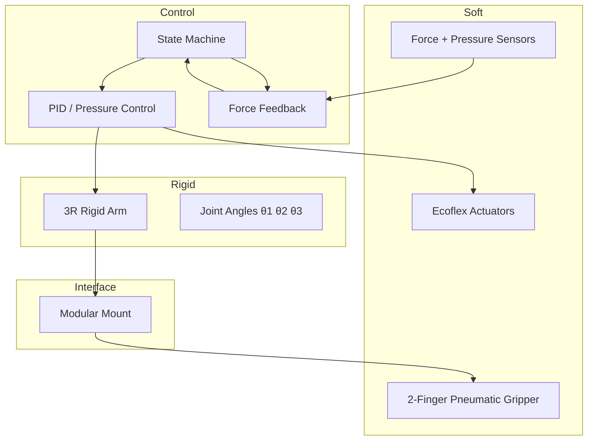

# Week 3: Soft Robotics

**24-Week Weekend Bootcamp**  
**PolyU MSc Intelligent Robotics Engineering + CUHK BEng MAE**

**Status**: ✅ Theory + Simulation + Arduino + Physical Design 完成  
**Last Updated**: 2026-07-28

---

## 目標與 Deliverables

本週目標是從理論走到可落地的 **2-Finger Pneumatic Soft Gripper**，並與現有 3R Rigid Arm 形成 Hybrid 系統。

### 已完成項目

| 項目 | 狀態 | 檔案 / 位置 |
|------|------|-------------|
| Soft Robotics 詳細筆記 | ✅ | 15 sections, ~3,550 字 |
| 4 個 Mermaid Diagrams | ✅ | Architecture / State Machine / Sequence / Wiring |
| Python PCC Soft Actuator Sim | ✅ | `demos/soft_actuator_sim.py` |
| Hybrid 3R + Soft Gripper Demo | ✅ | Python + Mobile HTML 版本 |
| 完整 Arduino 6-State Machine | ✅ | 含 Timeout + 安全保護 + LIFT 訊號 |
| 實體組裝教學 | ✅ | 詳細步驟 + BOM + 接線 |
| 3 篇核心論文整理 | ✅ | Rus & Tolley / Polygerinos / Laschi |
| 本 README | ✅ | 統一入口 |

---

## 1. 這個領域所有專家共享的 5 個核心心智模型

### 1. Continuum / Infinite DOF Thinking
軟機器人不是「多幾個關節」，而是接近連續體。專家把軟體想成 **continuum**（連續體），用曲率、弧長、扭轉來描述，而不是傳統 DH 參數。這直接影響建模選擇（PCC、Cosserat Rod、FEM）。

### 2. Compliance is a Feature, not a Bug
剛性機器人追求「消除柔順」；軟機器人則把 **compliance** 當成核心能力。它能被動適應不確定環境、吸收衝擊、提升安全性。專家會問：「這個任務需要多少順應性？」而不是「怎麼把順應性拿掉？」

### 3. Morphological Computation（形態計算）
軟體結構本身就能處理一部分資訊處理。形狀、材料剛度、氣室設計會「計算」出適合的抓取行為，減少對中央控制器的依賴。這是 soft robotics 最獨特的思維方式。

### 4. Hybrid Soft-Rigid Systems
純軟機器人雖然安全，但定位精度與負載能力有限。目前主流務實路線是 **Hybrid**：剛性骨架負責精度與負載，軟末端負責接觸與適應。你現有的 3R Arm + Soft Gripper 正是這條路線。

### 5. Embodiment + Interaction under Uncertainty
軟機器人強調「身體與環境的互動」。專家不會只優化軌跡，而會同時考慮材料、驅動、感測與環境不確定性。Force feedback、滑脫檢測、壓力閉環都是這種思維的產物。

---

## 2. 專家根本分歧的 3 個地方 + 各方最強論點

### 分歧 1：Model-based Control vs Learning-based / Model-free Control

**Model-based 陣營最強論點**  
軟機器人雖然非線性，但物理模型（PCC、Cosserat、FEM）仍然可以提供足夠準確的預測。有模型才能做穩定的閉環控制、保證安全邊界，也更容易做系統分析與認證。

**Learning-based 陣營最強論點**  
真實軟體的遲滯、材料變異、接觸非線性極難用解析模型準確捕捉。深度學習 / RL 可以直接從數據學習映射，在複雜抓取任務上往往表現更好，而且能適應材料老化。

### 分歧 2：Pure Soft vs Hybrid Soft-Rigid

**Pure Soft 陣營最強論點**  
只有徹底去掉剛性結構，才能真正發揮「被動安全」與「極度適應」的優勢。Hybrid 會把剛性部分的風險重新引入，削弱 soft robotics 的核心價值。

**Hybrid 陣營最強論點**  
純軟在定位精度、重複性、負載能力上仍然明顯不足。現實應用（工業、醫療、物流）需要可預測的性能。Hybrid 能同時保留剛性的精度與軟體的安全性，是目前最務實的工程路線。

### 分歧 3：Pneumatic 是否仍是最佳實用驅動方式

**Pneumatic 支持者最強論點**  
氣動驅動力大、響應相對快、成本低、容易製造，而且已經有大量成熟的 soft gripper 產品。對於需要中等力量與安全性的任務，氣動仍然是工程上最平衡的選擇。

**其他驅動支持者最強論點**  
氣動需要氣源與管路，系統體積與噪音較大，且壓力控制存在非線性與遲滯。DEA、SMA、IPMC 等在小型化、靜音、低功耗場合有明顯優勢，長期來看更適合嵌入式與穿戴式應用。

---

## 3. 10 個能區分深度理解與死背知識的問題

1. 為什麼 Piecewise Constant Curvature (PCC) 近似在很多軟機器人上「夠用」，但在什麼情況下會明顯失效？
2. Strain Limiting Layer 的作用本質是什麼？如果完全對稱的氣室結構會發生什麼事？
3. 軟機器人的「遲滯 (hysteresis)」主要來自哪幾個物理來源？控制時應如何處理？
4. 為什麼很多 soft gripper 選擇「開環壓力控制 + 力感測閉環」而不是完整的模型預測控制？
5. Hybrid 系統中，剛性臂與軟末端的「責任邊界」應該如何劃分？有什麼判斷原則？
6. 當 soft gripper 抓取易碎物體時，力控制與位置控制的權衡邏輯是什麼？
7. Morphological Computation 的概念如何具體應用在氣室設計上？請舉一個例子說明結構本身如何「計算」。
8. 為什麼 soft robotics 在醫療與人機協作場景特別受重視，但在工業高精度組裝上仍較少見？
9. 如果要把現有 3R Arm 的 force feedback 與 soft gripper 的壓力控制結合，閉環結構應該長什麼樣？
10. 從材料科學角度看，Ecoflex 00-30 與 Dragon Skin 的選擇差異反映了什麼設計取捨？

---

## 4. 核心理論速覽

### 主要驅動技術比較

| 技術 | 優點 | 缺點 | 適合場景 | 難度 |
|------|------|------|----------|------|
| Pneumatic | 力大、成本低、易製造 | 需要氣源、有管路 | Soft Gripper、爬行 | 中 |
| DEA | 響應快、能量密度高 | 需要高電壓 | 人工肌肉 | 中高 |
| SMA | 結構簡單、力大 | 響應慢、發熱 | 微型抓手 | 中 |
| IPMC | 低電壓、可在水中 | 力小、壽命有限 | 水下微型 | 中 |
| Soft Hydraulic | 力更大、精度較好 | 系統更複雜 | 高負載軟體 | 高 |

### 建模方法

- **PCC (Piecewise Constant Curvature)**：目前最常用的工程近似
- **Cosserat Rod Theory**：更精準的 continuum 模型
- **FEM**：高保真模擬，計算成本高
- **Learning-based**：直接從數據學習映射

---

## 5. 與現有 3R Arm 的整合架構

### 系統分層



### 控制狀態機

```
APPROACH → SOFT_CONTACT → GRIP → HOLD → LIFT → RELEASE
```

- **APPROACH**：剛性臂移動，gripper 張開
- **SOFT_CONTACT**：減速並監測接觸力
- **GRIP**：開始加壓並閉環調整
- **HOLD**：維持抓取，檢測滑脫
- **LIFT**：維持壓力 + 通知 / 執行 3R Arm 提升
- **RELEASE**：放氣並回到初始狀態

---

## 6. 實體製作重點

### 推薦材料
- **Ecoflex 00-30**（最常用入門矽膠）
- Strain Limiting Layer（布或較硬矽膠片）
- 矽膠管 + T/Y 接頭
- 12V 電磁閥 + 微型氣泵 + MOSFET

### 關鍵設計原則
1. 氣室不對稱 + Strain Limiting Layer → 控制彎曲方向
2. 壁厚 2–2.5 mm 較適合新手
3. 進氣孔必須良好密封
4. 第一次測試從 40–60 kPa 開始，不要超過 100 kPa

### 安全機制（已實作於 Arduino）
- 緊急停止按鈕
- 壓力上限保護
- 力上限保護
- 超時保護
- 滑脫自動重抓
- 狀態 LED 指示

---

## 7. 模擬與程式資源

| 檔案 | 說明 |
|------|------|
| `soft_actuator_sim.py` | PCC 模型 + 壓力掃掠 + 遲滯視覺化 |
| `hybrid_3r_soft_gripper.py` | 3R Arm + Soft Gripper 聯合模擬 |
| `hybrid_mobile.html` | 手機版即時 Demo |
| Arduino 完整程式 | 6 狀態機 + Timeout + 安全保護 |

---

## 8. 推薦論文（必讀）

1. **Rus, D., & Tolley, M. T. (2015).** Design, fabrication and control of soft robots. *Nature*.  
   → Soft Robotics 入門神文，涵蓋材料、驅動、控制與應用。

2. **Polygerinos, P. et al. (2017).** Soft robotics: Review of fluid‐driven intrinsically soft devices. *Advanced Engineering Materials*.  
   → 氣動軟體裝置的製造、感測與控制完整回顧。

3. **Laschi, C. et al. (2016).** Soft robot arm inspired by the octopus. *Advanced Robotics*.  
   → Continuum 建模與生物啟發設計，與你的 geotech 背景有 synergy。

---

## 9. 與你背景的連結

你的 **geotechnical** 經驗在 soft robotics 中有直接優勢：

- Soil constitutive models（Mohr-Coulomb、Hardening Soil）與 soft material hyperelastic models（Neo-Hookean、Ogden）在數學結構上高度相似。
- Continuum mechanics 思維可以直接遷移到 Cosserat Rod 與 FEM soft body 建模。
- 這是你區別於一般機械背景學生的獨特優勢。

---

## 10. 本週進度檢查清單

- [x] 完成 Soft Robotics 理論筆記
- [x] 實作 PCC Soft Actuator 模擬
- [x] 完成 Hybrid 架構設計（Mermaid）
- [x] 寫好 6 狀態 Arduino 控制程式
- [x] 完成實體組裝詳細步驟
- [x] 整理 3 篇核心論文
- [x] 產出本 README
- [ ] 實體 2-Finger Gripper 模具製作
- [ ] 第一次矽膠澆注與測試
- [ ] 與 3R Arm 實體整合

---

## 11. 下一步建議

**短期（本週末）**
1. 決定用紙板快速原型或 3D 打印模具
2. 購買 Ecoflex 00-30 與基本氣動零件
3. 完成第一次澆注測試

**中期（Week 4–6）**
- 把 Soft Gripper 真正接到 3R Arm
- 優化 force + pressure 閉環
- 錄製完整抓取 Demo

**長期（Phase 3）**
- 探索 SMA 或 DEA 作為替代驅動
- 考慮加入 soft sensor
- 準備作為 FYP / Portfolio 核心項目

---

**Week 3 Soft Robotics 已形成完整閉環：理論 → 模擬 → 控制 → 實體設計。**

有需要繼續深化（模具尺寸、更完整 Arduino、實體測試 checklist 等），隨時講。

**加油！** 🦞
