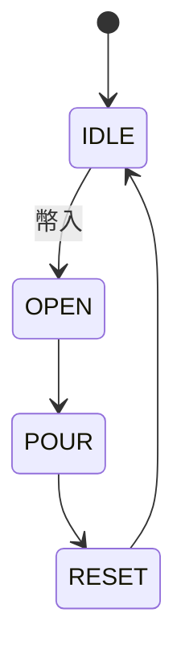
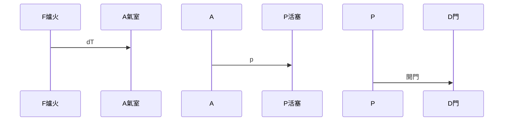
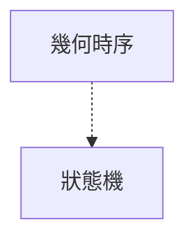
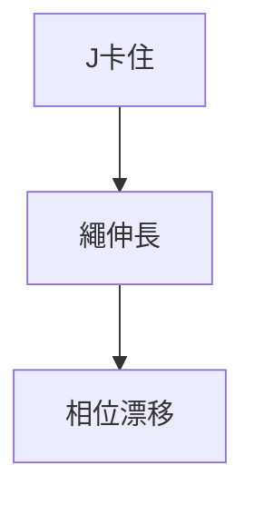

# 001 古希臘的機械

**來源**：和田忠太《機械構造解剖圖鑑》（修訂版）／第1章 機械的起源  
**格式**：Deep Study — 5MM / 3DG / 10Q / 5DD / 10SL / 5MR  
**領域標籤**：`origin`

**一句话**：赫龍用火、水、空氣、重力把簡單機械編成開環程序；自動化 ≠ 電。

主方程：$$ W=mgh $$

思想來源：Heron *Pneumatica*。數量級：開環自動機。

## 5MM
1. **開環時序已是程式** — 硬幣重 → 樄桿 → 閥 → 定量水 → 配重復位。
2. **四種能量決定架構** — 重力 $mgh$、熱膨脹、壓差 $\Delta p A$。
3. **定量來自止擋** — 17 g 古幣 $\approx 0.17\,\mathrm{N}$，樄桿 8:1 開閥力 $\approx 1.4\,\mathrm{N}$。
4. **可復刻才算讀懂** — 早稻田 1962 復刻自動門。
5. **奇觀支 vs 生產力支** — gripper state machine 屬後者。

## 3DG
### DG1 算不算真機械
- **A**：有確定 I/O 與可復刻運動即機械。
- **B**：不以省勞動為目的，工業意義有限。
### DG2 課時
- **A**：先建能量＋約束＋時序直覺。
- **B**：直接靜力學與控制更划算。
### DG3 動力源 vs 運動
- **A**：先看現場有什麼能（Heron）。
- **B**：先規定軌跡再找致動器（Erdman & Sandor）。

## 10Q
1. 聖水機的「感測器」是哪個物理量？
2. 為何定量出水不需電子計時？
3. 熱空氣開門推的是 $p$ 還是 $V$？
4. 硬幣卡住時開環會怎樣？
5. 虹吸是閥還是泵？
6. 改成「有人靠近才出水」最少加哪層回授？
7. 早稻田復刻證明了什麼？
8. 6-state gripper 與赫龍事件鏈何處同異？
9. $\eta=0.3$ 夾起 2 N 雞蛋升 0.15 m，落差 0.5 m，落下質量？
10. 為何「有電」不是自動化的定義？

## 5DD
### DD1 硬幣是質量
訊號是力，不是 bit。 / The coin is a mass. The signal is force.
### DD2 熱氣動
$W=\int p\,dA\,dx$。目標是驚奇不是 $\eta$。
### DD3 止擋即分辨率
Stops are encoder resolution.
### DD4 故障是卡住
That is why LIFT needs a timeout.
### DD5 遷移
硬幣→視覺旗標，閥→grab()，定量水→drop zone。

## 10SL
### SL1 $F=mga/b=1.11\,\mathrm{N}$（$m=0.017,a=0.080,b=0.012$）
### SL2 $V=6.4\,\mathrm{mL}$（$A=20\mathrm{mm}^2,v=0.40,t=0.80$）
### SL3 $\Delta V=0.46\,\mathrm{L}$（$V=0.002,\Delta T=80,T=350$）
### SL4 輸出 0.30 J，$\eta=0.3$ 要 1.0 J → $m=0.20\,\mathrm{kg}$
### SL5 每週期伸長 0.5 mm，槽寬 8 mm 約第 16 週期失效
### SL6 缺 SOFT_CONTACT 與力限
### SL7 虹吸需預充
### SL8 復位力矩 $0.024\,\mathrm{N\cdot m}$
### SL9
```python
print(20e-6 * 0.40 * 0.80 * 1e6, "mL")
```
### SL10
```python
print(0.002*80/350)
```

## 5MR





