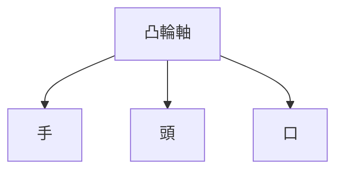
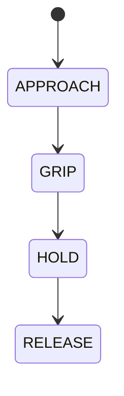

# 002 機械結構人偶

**格式**：Deep Study — 5MM / 3DG / 10Q / 5DD / 10SL / 5MR  
**一句话**：凸輪把時間寫成位移；一根軸上多片凸輪就是固態平行程式。

$$ s=s(\theta) $$

Reuleaux 凸輪。

## 5MM
1. **凸輪是固態函數** — $s=s(\theta)$。
2. **配重是能量庫** — $mgh$ 或發條 $\tfrac12 k\phi^2$。
3. **相位鎖定取代通訊** — 同軸 $\Delta\theta$。
4. **自由度被鎖死** — 真正輸入常是 1 軸。
5. **間隙破壞相位** — $c=0.3\mathrm{mm},r=25\mathrm{mm}\Rightarrow\Delta\theta\approx0.69^\circ$。

## 3DG
### DG1 算不算機械人
- **A** automaton 祖先（Riskin）
- **B** 無感測回授不算 robot（Siciliano & Khatib）
### DG2 凸輪 vs 電子凸輪
- **A** 同步硬、掉電仍可走半週期
- **B** 改配方不用開模
### DG3 教學
- **A** 最好的「什麼是程式」教具
- **B** 課時應給工業凸輪

## 10Q
1. 為何一片凸輪自然只產生單自由度週期運動？
2. 等速/等加速/擺線輪廓各解什麼衝擊？
3. 配重放完為何停—控制還是能量耗盡？
4. 怎樣用第二片做「若已舉手則點頭」？
5. 間隙如何破壞相位承諾？
6. 人偶與 6-state 誰較易插 SOFT_CONTACT？
7. 凸輪軸改步進電機，失去與得到什麼？
8. 力封閉從動件何時飛離？
9. 一張凸輪開合軟夾爪，頻率受什麼限？
10. 三片凸輪對應 APPROACH–GRIP–RELEASE 軸角如何分？

## 5DD
### DD1 輪廓是編譯後的代碼
The profile is compiled code.
### DD2 形封閉 vs 力封閉
$a>k\delta/m$ 就飛離。
### DD3 一根軸是匯流排也是時鐘
### DD4 能量庫定時長
### DD5 凸輪片換 changeState()，相位換 millis()

## 10SL
### SL1 $h=13\mathrm{mm}$
### SL2 $v=0.039\mathrm{m/s}$（30 rpm，升程 60°）
### SL3 等速起迄加速度脈衝
### SL4 $E=3.14\mathrm{J}$（0.80 kg 降 0.40 m）
### SL5 死區 $0.96\mathrm{mm}$
### SL6 $a_{lim}=32\mathrm{m/s}^2$
### SL7 相位：APPROACH 0–80°，GRIP 80–140°，HOLD 140–220°，RELEASE 220–300°
### SL8 改 HOLD +20°：凸輪要重磨；代碼一行
### SL9
```python
print(0.013 * (30*2*3.1416/60) / (3.1416/3))
```
### SL10
```python
print(200*0.008/0.05)
```

## 5MR


