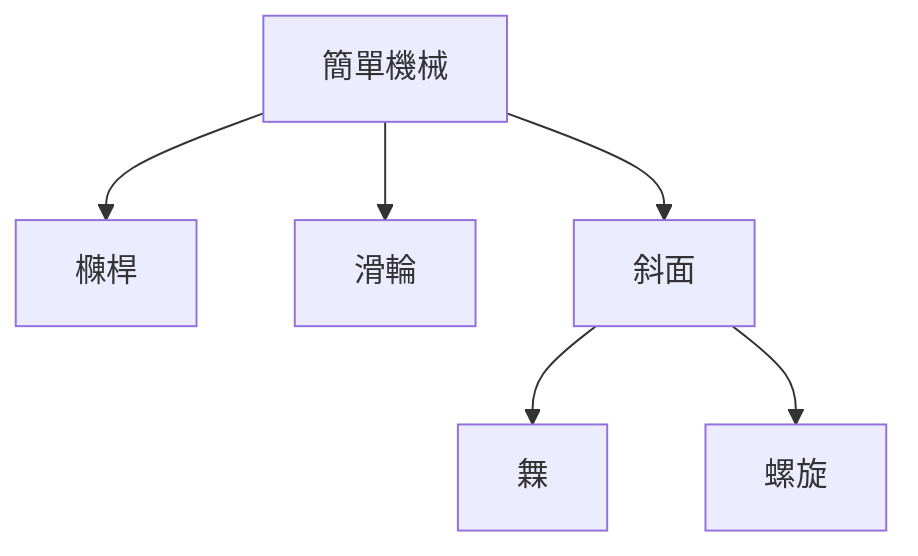
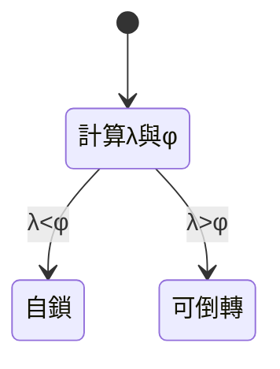

# 003 簡單機械

**格式**：Deep Study — 5MM / 3DG / 10Q / 5DD / 10SL / 5MR（金標）  
**課程**：MAEG2020 · MAEG3040

**一句话**：六種簡單機械是力–位移變壓器。理想 $F_{\mathrm{in}} s_{\mathrm{in}}=F_{\mathrm{out}} s_{\mathrm{out}}$；摩擦把等式變不等式。

## 5MM
1. **功守恆（Stevin 1586）** — $F_{\mathrm{in}}=24\mathrm{N},a=0.35\mathrm{m},b=0.07\mathrm{m}\Rightarrow F_{\mathrm{out}}=120\mathrm{N}$
2. **MA vs $\eta$（Rankine）** — 千斤頂 $\mathrm{MA}=40$ 但 $\eta\approx0.25$
3. **自鎖 $\lambda<\arctan\mu$（Euler）** — $\mu=0.15\Rightarrow\phi=8.5^\circ$；$L=4\mathrm{mm},d=16\mathrm{mm}\Rightarrow\lambda=4.6^\circ$自鎖
4. **動滑輪才省力** — 4 繩、200 N、滑輪 $\eta_s=0.95\Rightarrow F\approx58\mathrm{N}$
5. **約束先於外形（Reuleaux 1875）** — 軟指 $p\Delta V$ 像分佈式斜面

## 3DG
### DG1 六種還要不要教 — Meriam vs 直接靜力學
### DG2 先理想還是先摩擦 — Beer & Johnston vs Euler–Eytelwein
### DG3 能量法 vs 力矩 — 串聯機構 vs 支點反力

## 10Q
1. 六種各改力大小、方向還是兩者？
2. 為何省力必加長行程？
3. 定滑輪 MA 為何=1？
4. $\lambda$ 與 $\phi=\arctan\mu$ 誰大時自鎖？
5. 橆角變小為何可能卡死？
6. 繩數加倍手力是否真減半？
7. 升 vs 降的螺旋 $\eta$ 符號？
8. 3R 關節減速 50:1 力矩與末端速怎樣換？
9. 氣動軟指對應六種哪一？
10. 無電夾取選哪一種？自鎖與釋放如何兼得？

## 5DD
### DD1 MA 不是能量增益 — 100 N 升 0.50 m、斜長 2.0 m → 25 N
### DD2 自鎖是不等式 — 潤滑油可讓千斤頂倒轉
### DD3 滑輪組隱藏質量與彎曲損失
### DD4 橆是可分離斜面對
### DD5 減速器=輪軸；絲杠=螺旋；軟指=$p\Delta V$

## 10SL
### SL1 $F_{out}=120\mathrm{N}$
### SL2 斜面 $\mu=0$ ：$F=45\mathrm{N}$（W=180, h=0.60, L=2.40）
### SL3 $\mu=0.20\Rightarrow F=77.9\mathrm{N}$
### SL4 $\eta=45/77.9=0.58$
### SL5 4 繩 $\eta=0.885\Rightarrow F=56.5\mathrm{N}$
### SL6 $L=5\mathrm{mm},d=20\mathrm{mm},\mu=0.12$ 自鎖；$\mu=0.06$ 不自鎖
### SL7 $T=3.98\mathrm{N\cdot m}$（W=2 kN）
### SL8 輪軸 $F_{out}=150\mathrm{N}$
### SL9
```python
import math
W,L,h,mu=180,2.40,0.60,0.20
th=math.asin(h/L)
F0=W*h/L
F=W*(math.sin(th)+mu*math.cos(th))
print(F0,F,F0/F)
```
### SL10
```python
import math
L,d,mu=0.005,0.020,0.12
lam=math.atan(L/(math.pi*d))
print(math.degrees(lam), math.degrees(math.atan(mu)), lam<math.atan(mu))
```

## 5MR


