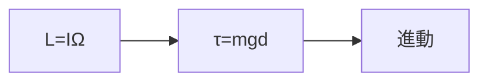
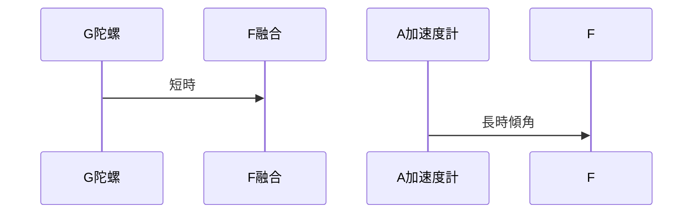

# 004 陀螺儀

**格式**：Deep Study — 5MM / 3DG / 10Q / 5DD / 10SL / 5MR  
**一句话**：陀螺賣的是 $\mathbf{L}=I\boldsymbol{\omega}$，不是「會轉」。

$$ \boldsymbol{\tau}=d\mathbf{L}/dt $$

Foucault 1852。

## 5MM
1. **角動量是軸** — $L=I_s\Omega$。例：$I=2\times10^{-5},\Omega=209\mathrm{rad/s},L=4.2\times10^{-3}\mathrm{N\cdot m\cdot s}$
2. **進動** — $\omega_p=mgd/L$。$m=0.12,d=30\mathrm{mm}\Rightarrow\omega_p\approx8.4\mathrm{rad/s}$
3. **框架自由度=能測的軸**
4. **漂移來自摩擦與不平衡** — MEMS 偏置常 $10^\circ/\mathrm{s}$ 量級
5. **Coriolis 振動陀螺共享同一守恆**

## 3DG
### DG1 機械轉子還有沒有地位
- **A** 航海/航天仍用高階（Titterton）
- **B** 機械人/手機已被 MEMS 佔領
### DG2 先向量還是先課堂陀螺
### DG3 IMU 輸出算不算陀螺讀數
- **A** 陀螺只給 $\omega$；姿態是融合
- **B** 模組已包含融合

## 10Q
1. 為何自旋越快進動越慢？
2. $\tau=dL/dt$ 如何解釋進動方向？
3. gimbal lock 損失什麼？
4. 進動 vs 章動？
5. MEMS 刻度因數單位？溫度為何傷它？
6. 為何不能單靠三軸陀螺做 10 分鐘姿態？
7. 3R 臂要不要陀螺？
8. 月球 $g/6$，$\omega_p$ 如何變？
9. 離共振時靈敏度為何掉？
10. 手機 IMU 轉椅如何估偏置？

## 5DD
### DD1 進動不是搖晃
### DD2 積分就是漂移：$0.2^\circ/\mathrm{s}\times60\mathrm{s}=12^\circ$
### DD3 框架是感測架構
### DD4 Coriolis 是微觀進動
### DD5 末端 IMU 審查 FK，不取代編碼器

## 10SL
### SL1 $L=4.18\times10^{-3}$
### SL2 $\omega_p=8.43\mathrm{rad/s}$
### SL3 $\Omega\times2\Rightarrow\omega_p/2$
### SL4 月球 $\omega_p\to1.40$
### SL5 $b=0.15^\circ/\mathrm{s},t=120\mathrm{s}\Rightarrow18^\circ$
### SL6 互補濾波 $\theta_k=0.98(\theta_{k-1}+\omega\Delta t)+0.02\theta_{acc}$
### SL7 萬向架奇異
### SL8 $v=\omega r=0.42\mathrm{m/s}$（$r=0.35,\omega=1.2$）
### SL9
```python
I,rpm,m,d=2e-5,2000,0.12,0.030
O=rpm*2*3.1416/60
print(I*O, m*9.81*d/(I*O))
```
### SL10
```python
print(0.15*60)
```

## 5MR


