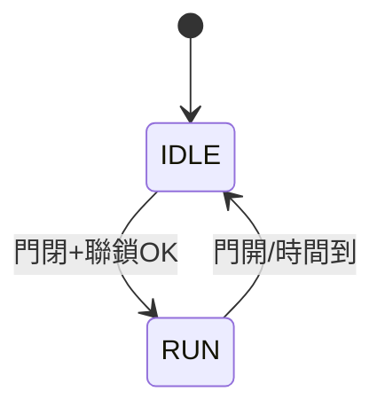

# 005 微波爐

**格式**：Deep Study — 5MM / 3DG / 10Q / 5DD / 10SL / 5MR  
**一句话**：2.45 GHz 選擇性耦合水分子；門聯鎖與場均勻是安全與品質。

$$ P_{\mathrm{abs}}=\omega\varepsilon_0\varepsilon''|E|^2 $$

von Hippel。錨點：2.45 GHz，700 W，雙重門聯鎖。

## 5MM
1. **頻率選擇性加熱** — 水的介電損耗在 ISM 2.45 GHz 有效。
2. **金屬腔是諧振器不是鍋** — 門縫必須截止洩漏。
3. **駐波造成熱點** — 轉盤/攤拌器用來打破場不均。
4. **門聯鎖是法定安全** — 不是附加功能。
5. **磁控管要消熱** — 轉換效率有限。

## 3DG
### DG1 機械還是電磁
- **A** 聯鎖與轉盤是機構安全
- **B** 核心是微波工程
### DG2 轉盤是否必要
### DG3 家用頻段是否最佳
- ISM 是法規選擇

## 10Q
1. 為何水被優先加熱而陶磁不是？
2. 金屬餐具為何危險但腔體本身是金屬？
3. 門聯鎖壞了為何是安全事件？
4. 轉盤停了會怎樣？
5. 700 W 輸入有多少變成飲品內能？
6. 空燒會燒什麼？
7. 為何不用 915 MHz 家用？
8. 與電磁爐的能量路徑差在哪？
9. 移到軟夾爪加熱模具能用嗎？
10. 洩漏限值來自安全標準還是烴爛？

## 5DD
### DD1 場不均是物理
駐波折射。 / Standing waves make hot spots.
### DD2 門縫是波導
### DD3 介電損耗隨溫度變
### DD4 磁控管是真空管
### DD5 聯鎖是州機不是 UI

## 10SL
### SL1 $f=2.45\times10^9\mathrm{Hz}$
### SL2 700 W × 60 s = 42 kJ
### SL3 250 g 水 $\Delta T=80\mathrm{K}\Rightarrow Q=mc\Delta T=83.6\mathrm{kJ}$ 約 2 min
### SL4 $\eta\approx42/83$ 不夠，實際要更久因場不均與容器熱容
### SL5 雙聯鎖串聯
### SL6 轉盤 5 rpm 打破熱點
### SL7 金屬尖端打火花
### SL8 波導截止頻率
### SL9
```python
print(0.25*4180*80 / 700, "s ideal")
```
### SL10
```python
print(2.45e9, "Hz")
```

## 5MR


