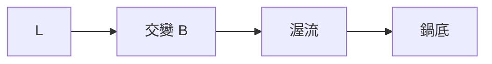

# 006 電磁爐

**格式**：Deep Study — 5MM / 3DG / 10Q / 5DD / 10SL / 5MR  
**一句话**：鏡場在鍋底變渥流熱；鍋材的 $\rho$ 與厚度決定能否煮。

$$ P\sim B^2 f^2 t/\rho $$

20–30 kHz，1.5–3 kW。Maxwell 渥流。

## 5MM
1. **熱在鍋裡不在爐面** — 空鍍就沒負載。
2. **層深 $\delta=\sqrt{2/\omega\mu\sigma}$** — $f$ 越高皮肤越薄。
3. **不鋼鍋 $\sigma$ 太低** — 渥流不足。
4. **線圈必消自身 $I^2R$** — 照理扇熱。
5. **鍋底偵測是安全聯鎖**

## 3DG
### DG1 電磁 vs 電熱絲
- **A** $\eta$ 高、爐面冷
- **B** 鍋具限制、EMI
### DG2 工頻高還是低
### DG3 多爐同時開的 EMI

## 10Q
1. 為何碳鋼鍋比鋼鍋難熱？
2. $f$ 提高時 $P$ 與 $\delta$ 怎變？
3. 空鍍保護用什麼量？
4. 照理扇為何會熱？
5. 與微波爐能量路徑差在哪？
6. 鍋底微凹會不會無法偵測？
7. 2 kW 煮一壺水 $\Delta T=80\mathrm{K}$ 理想時間？
8. 控溫量的是鍋底還是食材？
9. 移到 3R 加熱模具可行嗎？
10. IEC 洩漏限值管什麼？

## 5DD
### DD1 渥流是負載
No pan, no load.
### DD2 層深要配鍋厚
### DD3 證明是鍋材不是爐面
### DD4 EMI 是邻居問題
### DD5 聯鎖在鍋偵測

## 10SL
### SL1 $f=25\mathrm{kHz}$
### SL2 2 kW × 120 s = 240 kJ
### SL3 1.5 kg 水 $\Delta T=80\Rightarrow Q=502\mathrm{kJ}$ → 約 4 min @$\eta=0.8$
### SL4 $\delta$ 隨 $f$ 下降
### SL5 空鍍切斷 <1 s
### SL6 照理扇溫升必須有
### SL7 碳鋼鍋拒動
### SL8 多爐相位措開
### SL9
```python
print(1.5*4180*80 / (2000*0.8), "s")
```
### SL10
```python
print(25000, "Hz")
```

## 5MR

