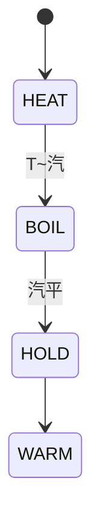

# 007 電鍉

**格式**：Deep Study — 5MM / 3DG / 10Q / 5DD / 10SL / 5MR  
**一句话**：閉環溫度 + 水蒸汽切換；不是「計時器煮米」。

$$ C\dot T=P-hA(T-T_\infty) $$

沸點 100 °C 切換；保溫 70 °C。

## 5MM
1. **水作為溫度匯流** — 米吸水後至 $T_{boil}$ 才算熟。
2. **汽切換是事件** — 不是 PID 追蹤 $T_{set}$ 全程。
3. **封閉汽改汽化點** — 高壓鍉 $T>100$。
4. **保溫用小 $P$** — 抵消 $hA\Delta T$。
5. **熱電偶可失效** — 幹燒風險

## 3DG
### DG1 溫控 vs 水量算法
### DG2 鏡應放壺底還是蒸汽出口
### DG3 IH 鍉 vs 電熱線

## 10Q
1. 為何「計 30 分鐘」不是好控制？
2. $C$ 主要來自水還是米？
3. 汽切換如何識別「已熟」？
4. 保溫 70 °C 對應多少 $P$？
5. 高壓鍉為何要安全泄壓？
6. 空鍉乾燒的聯鎖是什麼？
7. 與微波爐加熱機制差在哪？
8. 米水比改變熱容還是熟度？
9. 移到工業鍉爐多哪一層？
10. 鍉蓋是約束還是絕熱？

## 5DD
### DD1 汽化潛熱是標志
Boil plateau is the cook flag.
### DD2 保溫是小功率平衡
### DD3 幹燒是失控
### DD4 壓力改 $T_{sat}$
### DD5 狀態：吸水→汽點→熾→保溫

## 10SL
### SL1 $C\approx m c=1.2\times4180$
### SL2 $P=600\mathrm{W}$ 到 100 °C 約 10 min
### SL3 保溫 $P=hA\Delta T\approx40\mathrm{W}$
### SL4 汽切換標誌：$\dot T\to0$
### SL5 空鍉 $T$ 狂昇
### SL6 高壓檢點泄壓
### SL7 鍉蓋減少 $hA$
### SL8 熱電偶放壺底
### SL9
```python
print(1.2*4180*80/600, "s")
```
### SL10
```python
print(5*8*50, "W keep-warm order")
```

## 5MR

