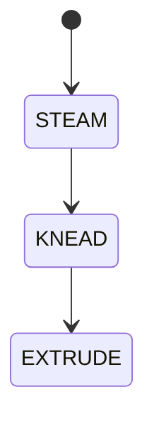

# 008 麻糗機

**格式**：Deep Study — 5MM / 3DG / 10Q / 5DD / 10SL / 5MR  
**一句话**：擱拌把黃米糊的高黏輸出變成可塞結的麻糗；力矩隨黏度變。

$$ T=\eta\dot\gamma \cdot V_{\mathrm{gap}} $$

擱拌 + 蒸米。

## 5MM
1. **黏度是負載** — 糊化過程 $T$ 下降。
2. **齒比決定剪切** — 間隙太小卡死。
3. **馬達驟起動力矩** — 冷起動電流峰。
4. **蒸汽是另一個能量路徑**
5. **防夾手聯鎖** — 開蓋停機。

## 3DG
### DG1 螺旋擱 vs 撼擼
### DG2 家用 vs 工廠高剪切
### DG3 定時 vs 力矩/電流判熟

## 10Q
1. 為何冷面團起動會乾燒馬達？
2. 齒比變大 $T$ 怎變？
3. 蒸米與擱拌誰先誰後？
4. 開蓋不停會怎樣？
5. 輸出形狀由模具還是齒比？
6. 與 3R 夾高黏物有何相似？
7. $\eta$ 隨溫下降後力矩？
8. 一批 1 kg 需要多少 $E$？
9. 卡死時應限流還是斷電？
10. 食品接觸面似何材料？

## 5DD
### DD1 高黏物是軟體
Dough is a soft robot material.
### DD2 間隙=剪切窗
### DD3 電流可當黏度計
### DD4 開蓋聯鎖像夾爪警告
### DD5 熟度是流變不是時鐘

## 10SL
### SL1 $P=200\mathrm{W}\times10\mathrm{min}=120\mathrm{kJ}$
### SL2 起動 $T$ 可達額定 2–3 倍
### SL3 間隙 2 mm → 1 mm 剪切約倍
### SL4 溫升 20 K 黏度下降
### SL5 限流 4 A
### SL6 食品級不鏴鋼
### SL7 狀態：蒸→擱→出料
### SL8 夾爪不要直接夾高黏糊
### SL9
```python
print(200*600, "J")
```
### SL10
```python
print("start torque 2-3x rated")
```

## 5MR

