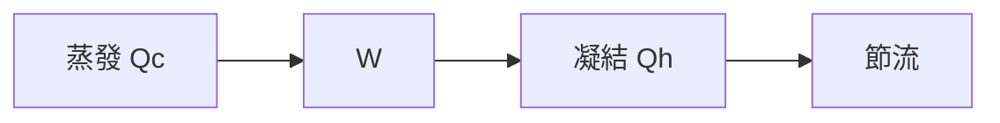

# 009 電冰箱

**格式**：Deep Study — 5MM / 3DG / 10Q / 5DD / 10SL / 5MR  
**一句话**：蒸汽壓縮把熱從冷箱搬到屋裡；COP 不是效率百分比。

$$ \mathrm{COP}=Q_c/W $$

家用 COP 2–4；R600a。Carnot $T_C/(T_H-T_C)$。

## 5MM
1. **熱沒消失只是搬** — 凝結器必須排熱。
2. **Carnot 上限** — $T_C=260,T_H=308\Rightarrow\mathrm{COP}_{id}=5.4$
3. **四件組** — 壓縮機–凝結–節流–蒸發。
4. **霜是熱阻** — $hA$ 下降 COP 崩。
5. **冷媒選型是法規不是口味**

## 3DG
### DG1 蒸汽 vs 半導體 vs 吸附
### DG2 定頻 vs 變頻
### DG3 能效標籤 vs 寶庫容積

## 10Q
1. COP=3 表示什麼？
2. 為何屋裡會變熱？
3. 門常開為何耗電？
4. 霜層 2 mm 對 $UA$ 影響？
5. 節流孔堵塞會怎樣？
6. $T_H$ 升 10 K，COP 上限？
7. 為何不能用加熱器「反過來」當冷氣？
8. 與空調同一循環嗎？
9. 軟機械人液體冷卻可否借用？
10. 安全：門閉與密封誰先？

## 5DD
### DD1 COP 可以 >1
It is not efficiency.
### DD2 凝結器是排熱器
### DD3 霜=絕緣
### DD4 節流孔是小型氣缸
### DD5 屋裡是 $T_H$

## 10SL
### SL1 $\mathrm{COP}_{id}=260/48=5.42$
### SL2 實 COP=3 → $W=Q_c/3$
### SL3 $Q_c=100\mathrm{W}$ 漏熱 → $W=33\mathrm{W}$ 平均
### SL4 門開 30 s 混合熱容上升
### SL5 $T_H=318\Rightarrow\mathrm{COP}_{id}=4.48$
### SL6 R600a 可燃
### SL7 凝結器空間不要塞
### SL8 除霜週期
### SL9
```python
print(260/(308-260))
```
### SL10
```python
print(100/3, "W compressor avg")
```

## 5MR

