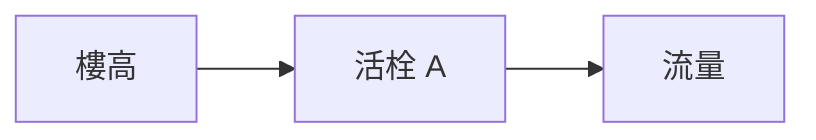

# 010 水龍頭·活栓

**格式**：Deep Study — 5MM / 3DG / 10Q / 5DD / 10SL / 5MR  
**一句话**：活栓用幾何變 $A$；水鎖用 $\rho c\Delta v$。

$$ Q=C_d A\sqrt{2\Delta p/\rho} $$

Bernoulli + 水鎖。

## 5MM
1. **開度是面積** — 不是「水量按鈕」。
2. **壓差來自樓高** — $10\mathrm{m}\Rightarrow0.1\mathrm{MPa}$。
3. **忽關 $\Delta v$ 製水鎖** — $p=\rho c\Delta v$。
4. **瓆裝改流型** — 濯漏 vs 平流。
5. **圖級封是漏失點**

## 3DG
### DG1 陳舊陳孔 vs 陳新陳孔
### DG2 陳陸 vs 陳水溫控
### DG3 陳水鎖要不要緩閉

## 10Q
1. $\Delta p$ 倍增 $Q$ 不是倍增為何？
2. 為何洗臉盆 $A$ 變小仍有衝量？
3. 15 樓 $\Delta p$ 多少？
4. 忽關為何會反擊水管？
5. 陳心陳絲會不會卡死？
6. $C_d$ 典型 0.6 意味？
7. 氣動陳與軟夾爪氣路相似處？
8. 漏水 2 mm 縫的 $Q$？
9. 陳水鎖器放哪？
10. 陳三件套為何是維修標準？

## 5DD
### DD1 開度=$A(x)$
### DD2 水鎖是波
Wave speed in water ~1400 m/s.
### DD3 陳封比竣口更易漏
### DD4 陳氣門像電磁陳
### DD5 陳流量控制=小型氣缸

## 10SL
### SL1 $\Delta p=150\mathrm{kPa}$ 約 15 m
### SL2 $A=20\mathrm{mm}^2,C_d=0.62\Rightarrow Q\approx0.25\mathrm{L/s}$
### SL3 $\Delta v=2\mathrm{m/s},c=1400\Rightarrow p\approx2.8\mathrm{MPa}$ 峰
### SL4 緩關 0.3 s 可減水鎖
### SL5 縫 2 mm 漏水
### SL6 陳心陳絲預緊
### SL7 氣動陳 $C_v$ 曲線
### SL8 三件套：陳+濾+檢修門
### SL9
```python
import math
Cd,A,dp,rho=0.62,20e-6,1.5e5,1000
print(Cd*A*math.sqrt(2*dp/rho)*1000, "L/s")
```
### SL10
```python
print(1000*1400*2/1e6, "MPa hammer")
```

## 5MR

