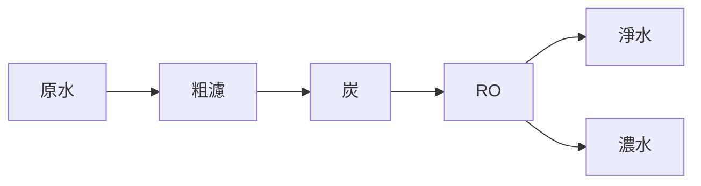

# 011 淨水器

**格式**：Deep Study — 5MM / 3DG / 10Q / 5DD / 10SL / 5MR  
**一句话**：濾芯用 $\Delta p$ 換截留；堵了就變成節流器。

$$ \Delta p = R_{\mathrm{filter}} Q $$

模孔 / RO / 活性炭。

## 5MM
1. **截留粒徑 vs 流量** — 越細 $\Delta p$ 越大。
2. **RO 要高於滲透壓** — 約 0.5–1 MPa。
3. **濾芯壞了 $R$ 上升** — $Q$ 下降是故障訊號。
4. **濃水比不是賦物** — RO 必須排濃水。
5. **微生物是另一個故障模式**

## 3DG
### DG1 濾料 vs RO vs UV
### DG2 炭罐計時 vs 壓差計時
### DG3 中央淨水 vs 末端

## 10Q
1. 為何細濾要高壓？
2. $Q$ 半減代表什麼？
3. RO 廢水比典型？
4. 炭罐飽和怎麼知？
5. 微生物在潤濾芯怎樣辨？
6. 與氣動濾氣相似？
7. $\Delta p$ 0.3 MPa 對水龍頭 $Q$ 影響？
8. 換芯判據用流量還是 TDS？
9. 軟夾爪氣路濾氣放哪？
10. 安全：回流防止污染？

## 5DD
### DD1 濾芯是電阻
Resistance rises with clogging.
### DD2 RO 是能量換純度
### DD3 濃水必須排
### DD4 炭是吸附不是篩
### DD5 測壓差=故障診斷

## 10SL
### SL1 $Q=2\mathrm{L/min},\Delta p=50\mathrm{kPa}\Rightarrow R=1.5\times10^9$
### SL2 $R\times2\Rightarrow Q$ 一半
### SL3 RO 0.7 MPa 泵
### SL4 濃水 1:3
### SL5 TDS 下降 90%
### SL6 UV 不去粒徑
### SL7 回止閥
### SL8 氣動濾 5 μm
### SL9
```python
print(50e3 / (2/60*1e-3))
```
### SL10
```python
print("clog: Q halves when R doubles")
```

## 5MR

