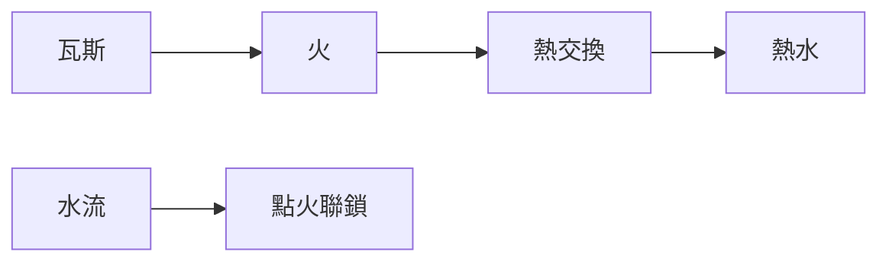

# 012 即熱式瓦斯熱水器

**格式**：Deep Study — 5MM / 3DG / 10Q / 5DD / 10SL / 5MR  
**一句话**：$流量\times\Delta T$ 要等於燃燃功率；火花與排氣是安全聯鎖。

$$ \dot m c_p \Delta T = \eta \dot m_{\mathrm{fuel}} H $$

即熱、沒大水箱。

## 5MM
1. **能量平衡定溫度** — 流大就減 $\Delta T$。
2. **一氧化碳是失敗** — 排氣/進氣不足。
3. **水流切換點火** — 無水不燃。
4. **熱交換器結埠** — $\Delta T$ 不足。
5. **燃氣偵測是聯鎖**

## 3DG
### DG1 即熱 vs 儲水箱
### DG2 瓦斯 vs 電即熱
### DG3 開放式 vs 密閉燃燒

## 10Q
1. 流量加倍 $\Delta T$ 為何約一半？
2. $\eta=0.8$ 時廢熱去哪？
3. 為何無水不得點火？
4. CO 警報應不應關火？
5. 結埠 1 mm 對 $UA$？
6. 12 L/min 、$\Delta T=25\mathrm{K}$ 需多少 kW？
7. 與電鍉同式的差異？
8. 冬季入水 10 °C 怎樣調？
9. 復古燃燒器為何不行？
10. 安全距離與排氣端？

## 5DD
### DD1 流量與溫度互貞
You cannot have both max flow and max ΔT.
### DD2 CO 是缺氧
### DD3 水控火是聯鎖
### DD4 結埠=絕緣
### DD5 排氣管是結構件

## 10SL
### SL1 $\dot m=12/60=0.20\mathrm{kg/s}$
### SL2 $P=\dot m c\Delta T=20.9\mathrm{kW}$ @$\Delta T=25$
### SL3 $\eta=0.82\Rightarrow$ 燃氣 25.5 kW
### SL4 流量×2 → $\Delta T\approx12.5$
### SL5 水控火開關
### SL6 CO 關斷
### SL7 冬季 $\Delta T=35\Rightarrow29\mathrm{kW}$
### SL8 結埠使出水減溫
### SL9
```python
print(0.20*4180*25/1000, "kW")
```
### SL10
```python
print(20.9/0.82, "kW fuel")
```

## 5MR

