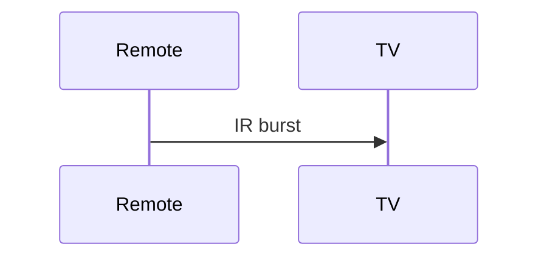

# 016 紅外線遠控器

**一句话**：近紅外 LED + 載波；視線與陰影是約束。

$$ E=hf,\quad 850\text{--}950\,\mathrm{nm} $$

## 5MM
1. 載波區分品牌  2. 接收角  3. 陰影=4b  4. 電池 ESR  5. 不能穿牆
## 3DG
IR vs RF / Bluetooth
## 10Q
1. 為何不用可見光？ 2. 太陽光幹擾？ 3. 載波率典型？ 4. 與 RC 機械人差？ 5. 串音怎檢？
## 5DD
視線是物理層。Line of sight is the protocol.
## 10SL
`print(3e8/940e-9,"Hz")`
## 5MR

