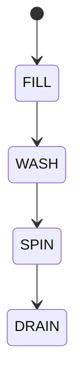

# 028 洗衣機

**格式**：Deep Study — 5MM / 3DG / 10Q / 5DD / 10SL / 5MR  
**一句话**：洗淨是流體剪切；脫水是離心 $m\omega^2 r$。

$$ F=m\omega^2 r $$

不平衡偵測決定能否加速。

## 5MM
1. **脫水 g-值當 $\omega^2 r/g$** — 800 rpm、r=0.22 m 約 155 g
2. **不平衡產生支承力** — $m e \omega^2$
3. **水位與洗劍決定流體**
4. **門聯鎖是安全**
5. **鬧音是振動訊號**

## 3DG
### DG1 波輪 vs 鼓式
### DG2 高轉 vs 承載
### DG3 水效 vs 時間

## 10Q
1. rpm 倍增離心力三倍嗎？
2. 為何有不平衡停機？
3. r 變大對支承的影響？
4. 洗劍太多會怎樣？
5. 門開連鎖斷哪一路？
6. 水位感測壞了？
7. 與離心澆鑄同式？
8. 3R 能否學不平衡跳過？
9. 鬧音 dB 與支承初期捕可用嗎？
10. 排水門卡死的安全？

## 5DD
### DD1 離心不是魔術
It is kinematics of rotation.
### DD2 不平衡=旋轉失衡
### DD3 洗淨是化學+剪切
### DD4 聯鎖在門
### DD5 水位是狀態變量

## 10SL
### SL1 $\omega=83.8\mathrm{rad/s}$（800 rpm）
### SL2 $a=\omega^2 r=1545\mathrm{m/s}^2\approx158g$
### SL3 $e=20\mathrm{mm},m=2\mathrm{kg}\Rightarrow F=62\mathrm{N}$
### SL4 1200 rpm → $a\times2.25$
### SL5 跳過轉速帶
### SL6 門開制動
### SL7 水位電極
### SL8 排水泄壓
### SL9
```python
import math
w=800*2*math.pi/60
print(w*w*0.22/9.81, "g")
```
### SL10
```python
print(2*0.02*(800*2*3.1416/60)**2, "N unbalance")
```

## 5MR

