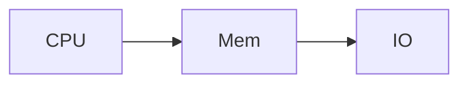

# 038 個人電腦

$$ t=t_{CPU}+t_{mem}+t_{I/O} $$

von Neumann。階層記憶體。散熱決定時鍸。
5MM: 存儲階層/掛起/中斷/供電/匯流
3DG: CISC vs RISC / 本機 vs 雲
10SL: `print(1/3.4e9,"s clock")`

```mermaid
flowchart LR
  CPU-->Mem-->IO
```
