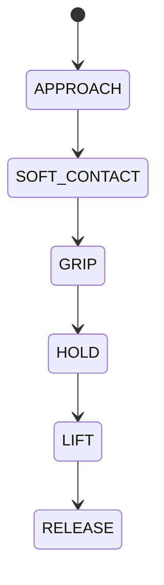

# 127 產業用機械手臂

**格式**：Deep Study — 5MM / 3DG / 10Q / 5DD / 10SL / 5MR  
**一句话**：賣重複定位與剛度，不賣「像人」。

$$ v=J(q)\dot q $$

ISO 9283；Siciliano。重複 $\pm0.02\mathrm{mm}$。

## 5MM
1. **重複精度 ≠ 絕對精度** — 產線靠治具把世界拉進重複世界。
2. **剛度 $\delta=F/k$** — $k=200\mathrm{N/mm},F=60\mathrm{N}\Rightarrow\delta=0.30\mathrm{mm}$
3. **雅可比奇異** — $\det J\to0$ 時加電流無效。
4. **工裝決定精度** — 背隙與熱比編碼器位數更常是環節。
5. **安全：ISO 10218 / TS 15066**

## 3DG
### DG1 6R 串聯 vs Delta 並聯
### DG2 圍欄高速 vs 協作力限
### DG3 示教 vs 離線/視覺

## 10Q
1. 為何規格先寫重複精度？
2. 奇異時加電流為何危險？
3. 0.5 mm 工裝誤差如何出現在工件上？
4. 6R IK 為何多解？
5. payload 3 kg→8 kg，PID 哪項先壞？
6. 軟夾爪裝上後控制目標改什麼？
7. 速度監控 vs 軟限位？
8. TCP 與關節原點？
9. 為何有力感測仍加氣缸緩衝？
10. pygame 3R 缺哪三個工業性質？

## 5DD
### DD1 重複世界 vs 世界世界
Pins are cheaper than absolute calibration.
### DD2 奇異是幾何
### DD3 柔順應該放末端
### DD4 熱是第四軸
### DD5 示教點是凍結的閉環

## 10SL
### SL1 $\delta=0.225\mathrm{mm}$（$k=200\mathrm{N/mm},F=45\mathrm{N}$）
### SL2 銷釘公差應 $<0.05\mathrm{mm}$
### SL3 $\theta_2=0$ 時 $J$ 降秩
### SL4 $T=22.4\mathrm{N\cdot m}$（0.40 N·m × 80 × 0.70）
### SL5 接觸後改力控 $F_d=8\mathrm{N}$
### SL6 節拍 3.0 s → 1200 件/時
### SL7 背隙 $0.14\mathrm{mm}$（0.8 arcmin × 0.6 m）
### SL8 TS 15066 手部力限量級
### SL9
```python
import math
l1=l2=0.25; t1,t2=math.radians(40),math.radians(50)
print(l1*math.cos(t1)+l2*math.cos(t1+t2))
```
### SL10
```python
print(45/200e3*1e3, "mm")
```

## 5MR

