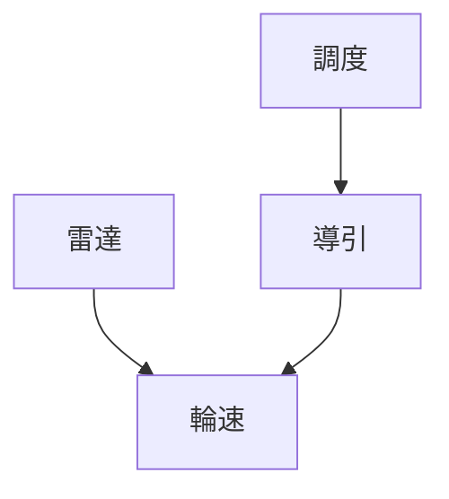

# 129 無人搬運車 AGV

**格式**：Deep Study — 5MM / 3DG / 10Q / 5DD / 10SL / 5MR  
**一句话**：導引把路徑鎖死；調度把多車變成系統。

$$ s=v t_r + v^2/(2\mu g) $$

ISO 3691-4。

## 5MM
1. **導引誤差會積分** — 輪徑 0.5% 走 40 m 偏 0.20 m。
2. **定位層 ≠ 調度層**
3. **地面是真正動力學** — $\mu$ 0.6→0.2 制動距拉長。
4. **電池定義任務半徑**
5. **人是移動障礙**

## 3DG
### DG1 磁導/二維碼 vs AMR
### DG2 集中調度 vs 車端自主
### DG3 AGV vs AMR 名稱

## 10Q
1. 為何輪徑誤差會越走越歪？
2. 二維碼不見，停還是衝？
3. 交叉口為何不能只靠蜂鳴器？
4. 負載增加時制動補度怎變？
5. 充電下限怎樣定？
6. warehouse demo 缺底盤還是調度？
7. $v=0.8,t_r=0.3,\mu=0.35$ 制車夠不夠？
8. 為何禁跑出油漆線？
9. 軟夾爪裝上 AGV 新增哪三種失效？
10. 驗收五個指標？

## 5DD
### DD1 導引把平面 3DOF 鎖回 1
### DD2 回正間距決定最大偏離
### DD3 交叉口是互斥資源
### DD4 制車距離是佈線參數
### DD5 AGV = 會移的 drop zone

## 10SL
### SL1 40 m × 0.5% = 0.20 m
### SL2 $s=0.33\mathrm{m}$（$v=0.8,\mu=0.35,t_r=0.3$）
### SL3 $\mu=0.20\Rightarrow s=0.40\mathrm{m}$
### SL4 24 V × 40 Ah × 0.7 = 672 Wh
### SL5 碼距 1.5 m × 0.4% = 6 mm
### SL6 交叉佔用 ~3 s
### SL7 滿載 $a$ 下降
### SL8 回充下限 $>$ 幹道最遠段
### SL9
```python
def stop_dist(v,tr=0.3,mu=0.35):
    a=mu*9.81
    return v*tr + v*v/(2*a)
print(stop_dist(0.8), stop_dist(0.8,mu=0.20))
```
### SL10
```python
print(40*0.005)
```

## 5MR

