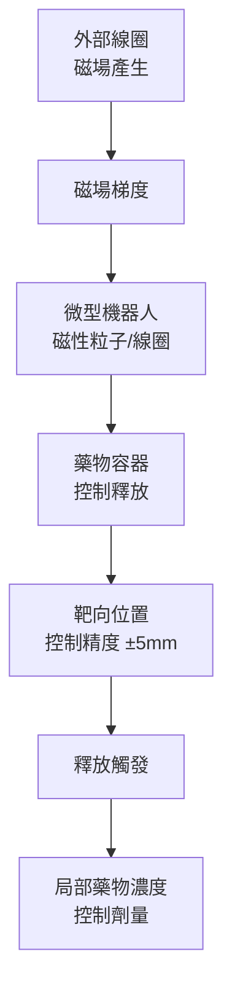
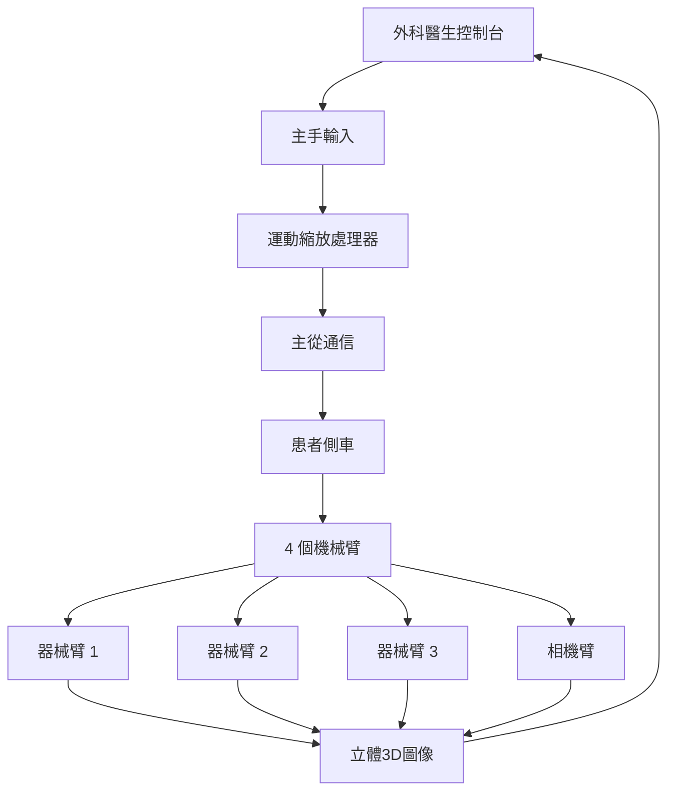

# BMEG3420 Medical Robotics

**CUHK BMEG | Major Elective | 3 units**
**Stream**: Robotics and Automation / Biomedical Engineering

---

## Official Description

This course introduces medical robotics, mechanical structures and dynamics, robotic sensing and control, human-robot interface, surgical robotic systems, rehabilitation robotic systems, micro-scale robotic medical devices and state-of-the-art technologies in medical robotics.

---

## 問題 1：5 個核心心智模型

### 1. 手術機器人系統架構 (Surgical Robot System Architecture)
**方程式 + 數字**：
- da Vinci 系統：4 個機械臂（3 個操作器械 + 1 個內窺鏡），自由度 DOF = 7 臂
- 主從控制延遲：< 50 ms（安全閾值）
- 運動縮放：主手移動 1 cm → 末端器械移動 0.2-1 cm（可調）
- 圖像延遲：< 30 ms（雙眼 3D 視覺）
- 學者引用：Madhani et al. (1998), "The black falcon"; Taylor & Stoianovici (2006), "Medical robotics in computer-integrated surgery"
- 應用：達芬奇手術系統、遠程手術、微創傷口

### 2. 康復機器人運動控制 (Rehabilitation Robot Control)
**方程式 + 數字**：
- 助力控制 (assist-as-needed)：F_assist = K·(x_d - x) + B·(ẋ_d - ẋ)（彈簧-阻尼模型）
- EMG 驅動控制：觸發閾值 10-30% MVC（最大自願收縮）
- 運動恢復率：每週 3 次 × 45 分鐘 × 12 週，顯著改善 Fugl-Meyer 評分
- 剛度自適應：基於表面 EMG 估計剛度 K ≈ f(EMG)，自動調整輔助程度
- 學者引用：Krebs et al. (1999), "Robotic Neurorehabilitation"; Riener & Lunenburger (2006)
- 應用：中風康復、外骨骼、步態訓練

### 3. 力反饋與觸覺渲染 (Force Feedback and Haptic Rendering)
**方程式 + 數字**：
- 剛度估計：K = F/δ（接觸剛度 N/mm）
- 力缩放：主手感知力 F_sensed = G·F_env，G = 0.1-1.0（可調增益）
- 透明性指標：T = F_max_ghost / F_max_human（理想 T = 1）
- 抖動抑制：截止頻率 5-10 Hz（低通濾波）
- 學者引用：Salisbury et al. (1985), "Haptic rendering"; Hannaford & Okamura (2008)
- 應用：手術訓練模擬器、遙操作、遠程醫療

### 4. 微創傷口機器人與膠囊內鏡 (Minimally Invasive Robotic Surgery)
**方程式 + 數字**：
- NOTES (Natural Orifice Transluminal Endoscopic Surgery)：經口腔/肛門/陰道進入腹腔
- 膠囊內鏡：尺寸 11mm × 26mm，視場角 150°，每秒 2-4 幀
- 靶向給藥微型機器人：磁導動態，定位精度 ± 5 mm，磁場梯度 0.1-0.5 T/m
- 學者引用：Dario et al. (2007), "Endoscopic and capsule robotics"
- 應用：胃腸道檢查、靶向藥物遞送、微創手術

### 5. 醫學圖像導引與導航 (Medical Image Guidance)
**方程式 + 數字**：
- 術前-術中註冊誤差：目標 < 2 mm（骨科），< 5 mm（軟組織）
- CT/MRI 超聲融合：配準精度 Dice 系數 > 0.85
- 光學/磁導追蹤精度：< 0.5 mm RMS
- 剛體配準：ICP（Iterative Closest Point）迭代收斂
- 學者引用：**N**oble & Bouattane (2013), "Medical image registration"; Peters & Cleary (2008)
- 應用：神經外科導航、骨科導航、心導管手術

---

## 問題 2：3 個根本分歧

### 分歧 A：自主手術 vs. 遥操作手術

**遥操作（主流）**：da Vinci 系統，完全由外科醫生控制
- 優點：外科醫生的判斷和經驗主導，FDA 認證完善
- 缺點：缺乏觸覺反饋（力反饋延遲），學習曲線陡峭

**半自主手術**（研究前沿）：
- 優點：降低外科醫生工作負擔，提高精度
- 缺點：安全性驗證困難，監管框架不完善
- 典型：Smart Tissue Autonomous Robot (STAR)

### 分歧 B：外骨骼康復 vs. 末端康復

**外骨骼（穿戴式）**：
- 優點：直接控制肢體姿勢，適用嚴重損傷患者
- 缺點：穿戴不便，個體適配複雜

**末端康復（末端效應器）**：
- 優點：結構簡單，適用輕中度患者
- 缺點：不能直接控制肢體角度

### 分歧 C：磁驅動 vs. 機構驅動微型機器人

**磁驅動**（被動/主動）：
- 優點：無需體內電源，可通過外部磁場控制
- 缺點：精度受限，磁場不均勻

**機構驅動**（微型馬達/ SMA）：
- 優點：精度高，可承載更大載荷
- 缺點：需體內電源和控制器

---

## 問題 3：10 個深度問題

1. 設計一個主從手術機器人的運動學模型，包括正逆運動學和運動縮放算法。
2. 什麼是「助力康復」(Assist-as-Needed) 控制策略？如何用 EMG 信號實現？
3. 比較力反饋手術和無力反饋手術的手術效果差異和學習曲線。
4. 描述膠囊內鏡的圖像壓縮和能量管理策略。
5. 什麼是術前-術中圖像註冊？比較剛體和變形配準算法。
6. 康復外骨骼的剛度控制如何實現？基於模型的 vs. 數據驅動的方法。
7. 設計一個微型藥物遞送磁導微型機器人的閉環控制系統。
8. 什麼是血管介入手術機器人的導絲導管導航策略？
9. 比較手術訓練模擬器中基於物理的觸覺渲染和數據驅動的觸覺渲染。
10. 什麼是手術機器人的安全性標準（IEC 60601）？FDA 認證流程是什麼？

---

# 核心心智模型深化（中英對照）

## 1. 手術機器人運動學與控制

### 1.1 主從控制架構
```
外科醫生 → 主手 (3D 輸入) → 運動縮放 → 從手 (器械運動)
                ↓
         力傳感器 → 力缩放 → 主手 (力反饋)

縮放比：
s = 主手位移 / 從手位移（典型 s = 0.2-0.5）
→ 外科醫生的大幅運動轉化為精細的器械運動
```

### 1.2 從手運動學
```
da Vinci 內窺鏡器械：
- 入口點（切口）約束
- 遠程運動中心（Remote Center of Motion, RCM）
- 7 DOF：旋轉×2 + 軸向 + 腕部×3 + 開合

約束：通過 RCM 點，器械長度恆定
→ 運動學簡化為 RCM 周圍的球面運動
```

### 1.3 剛度控制
```
運動約束：
x_RCM = f(θ)  (器械末端的 RCM 約束)

力約束：
手術器械末端力 F 需控制在安全範圍內
典型安全力閾值：< 5 N（軟組織），< 20 N（硬組織）
```

### 1.4 圖解：主從手術控制
```mermaid
flowchart LR
    A["外科醫生手部"] --> B["主手控制器"]
    B -->|"運動縮放<br/>s=0.2-0.5", C["運動命令"]
    C --> D["從手機械臂"]
    D --> E["器械末端"]
    E -->|"接觸力", F["力感測器"]
    F -->|"力缩放<br/>G=0.1-1.0", B
    E -->|"圖像", G["立體相機"]
    G -->|"3D 顯示", H["外科醫生眼睛"]
```

---

## 2. 康復機器人控制策略

### 2.1 助力控制 (AAN)
```
助力控制方程：
F_assist = K(x_d - x) + B(ẋ_d - ẋ)

K = 彈簧剛度（N/m）
B = 阻尼係數（N·s/m）
x_d = 期望軌跡
x = 實際軌跡

關鍵思想：患者表現好 → 助力小；患者表現差 → 助力大
```

### 2.2 EMG 驅動控制
```
表面 EMG 處理：
Raw EMG → 整流 → 低通濾波 → 移動平均 → 估計肌肉激活度

觸發條件：
if emg_estimate > threshold × MVC_max:
    觸發助力模式
else:
    被動模式

閾值通常設置在 10-30% MVC
```

### 2.3 運動分析
```
步態週期：
支撐相（60%）+ 擺動相（40%）

關鍵參數：
- 步速（m/s）
- 步幅（m）
- 步頻（steps/min）
- 雙支撐時間（s）

康復評估：
Fugl-Meyer Assessment (FMA)：0-100 分
FMA > 80 = 良好恢復
```

### 2.4 圖解：助力康復控制
```mermaid
flowchart LR
    A["患者意圖<br/>EMG/運動"] --> B["控制器"]
    B -->|"助力命令", C["外骨骼/末端"]
    C -->|"實際運動", D["患者肢體"]
    D -->|"生物反饋", E["感測器"]
    E --> B
    B -->|"評估患者能力", F["自適應助力"]
    F -.->|"好表現→低助力", G["患者主動"]
    F -.->|"差表現→高助力", H["系統輔助"]
```

---

## 3. 力反饋與觸覺渲染

### 3.1 觸覺渲染分類
```
約束渲染（Constrained Haptic Rendering）：
- 接觸剛度建模
- 穿透深度估算
- 法向力計算

自由空間渲染：
- 無力輸出
- 平穩過渡到約束空間

牆模型（Wall Model）：
F = K·max(0, p_penetration)
```

### 3.2 透明性與穩定性
```
透明性：T = |F_human| / |F_ghost| （理想 T = 1）
穩定性邊界：
|k_c < 2(b + d)/T_s|

k_c = 阻抗增益
b = 阻尼
T_s = 採樣周期
→ 延遲越大，最大穩定剛度越小
```

### 3.3 手術觸覺
```
軟組織特性：
- 肝臟：E ≈ 0.1-0.5 MPa
- 肌肉：E ≈ 0.1-0.3 MPa
- 腫瘤：比正常組織更硬（觸覺差異）
→ 觸覺差異可用於腫瘤檢測

力感測器：小型力/力矩感測器（1-3軸）
典型精度：±0.1 N，頻帶寬 0-100 Hz
```

### 3.4 圖解：觸覺渲染架構
```mermaid
flowchart TD
    A["虛擬環境"] --> B["碰撞檢測"]
    B --> C{接觸?}
    C -->|"是|", D["穿透深度計算"]
    C -->|"否|", E["自由空間"]
    D --> F["力計算<br/>F = K·δ"]
    F --> G["力缩放"]
    G --> H["觸覺設備"]
    H -->|"人手", A
    F --> I["圖像渲染"]
    I --> H
```

---

## 4. 微創傷口與膠囊內鏡

### 4.1 NOTES 系統分類
```
經口 NOTES（口腔進入）：
- 胃切開術
- 膽囊切除術（實驗階段）

經肛 NOTES：
- 結腸切除術

經陰道 NOTES：
- 膽囊切除術（臨床試驗）

微型器械：直徑 3-5 mm，柔性機構
挑戰：精細操作、工具整合、縫合
```

### 4.2 膠囊內鏡能源管理
```
典型功耗：
- 圖像處理：3-5 mW
- 無線傳輸：10-15 mW
- 光源：2-3 mW
- 總功耗：15-25 mW

策略：
- 幀率自適應：活動區域高幀率，空閒區域低幀率
- 壓縮：JPEG 壓縮比 10:1
- 休眠模式：非拍攝時進入深度休眠
```

### 4.3 微型藥物遞送
```
磁導控制：
F = ∇(B · m)（磁力）
- B = 外部磁場
- m = 磁性粒子磁矩

梯度驅動：
典型磁場梯度：0.1-0.5 T/m
所需力：0.1-1 mN（克服黏滯阻力）

控制策略：PI 控制 + 磁場方向閉環
```

### 4.4 圖解：磁導微型機器人


---

## 5. 醫學圖像導引

### 5.1 術前-術中配準
```
剛體配準步驟：
1. 術前 CT/MRI 分割（骨結構或基準標記）
2. 術中追蹤（光學/磁導追蹤器）
3. ICP 迭代最近點配準
4. 評估配準精度（TRE < 2 mm）

誤差來源：
- 術前-術中患者位置變化
- 組織變形（軟組織）
- 追蹤器移位
```

### 5.2 光學追蹤系統
```
原理：三角測量
- 紅外相機 × 2（或 3）
- 剛體標記球（紅外反射球）
- 精度：< 0.5 mm RMS

標記配置：
- 基準標記（術前固定於骨骼）
- 工具標記（手術器械）
```

### 5.3 圖像融合
```
超聲-CT 融合：
1. 術前 CT 重建 3D 體積
2. 術中超聲 3D 重建
3. 剛體配準（骨結構作為共同標記）
4. 顯示融合圖像

超聲-超聲 3D：
- 自由手臂超聲
- 自動重建 3D 體積
- 實時目標追蹤
```

### 5.4 圖解：手術導航架構
```mermaid
flowchart TD
    A["術前 CT/MRI"] --> B["圖像分割<br/>目標結構"]
    B --> C["配準算法<br/>ICP/Rigid"]
    D["術中追蹤"] --> C
    C --> E["配準矩陣<br/>T_pre2intra"]
    E --> F["導航顯示"]
    F --> G["外科醫生"]
    D --> G
    G -->|"手術操作", H["患者"]
    H -.->|"圖像更新", I["超聲/內窺鏡"]
    I -.->|"實時反饋", F
```

---

## 深度自測問題詳解

**Q1**: 主從運動學
```
運動縮放算法：
設主手位移 Δx_master，縮放比 s，則從手位移：
Δx_slave = s · Δx_master

約束處理：
器械必須通過 RCM 點（切口）：
θ_RCM = atan2(Δx_slave, L_eff)
旋轉角度 → 球面約束

從手逆運動學：
已知末端位置 P_desired 和 RCM 點
θ = arcsin(|P_desired - RCM| / L_eff)
```

**Q2**: AAN 控制 EMG 觸發
```
門控條件：
if emg_filtered > α · MVC_max:
    激活助力模式
else:
    純被動模式

助力函數：
F_assist = K(x_d - x) + B(ẋ_d - ẋ)

剛度自適應：
K = K_base + β · emg_estimate
→ EMG 越高，剛度越大，助力越強
```

**Q5**: 術前-術中配準
```
步驟：
1. 術前 CT 分割骨組織（或植入基準標記）
2. 術中追蹤器測量骨結構或基準標記位置
3. 選擇對應點對，建立剛體變換 T
4. 使用 ICP 迭代優化：

ICP 算法：
repeat:
    對每個術中點，找術前 CT 最近點
    更新 T = argmin Σ|T·p_intra - p_pre|^2
until: ||T_new - T_old|| < ε

配準精度：
FRE（基準標記誤差）< 1 mm
TRE（靶向誤差）< 2 mm（目標）
```

---

## 📊 Mermaid 圖解

### 圖 1：da Vinci 手術系統架構


### 圖 2：康復外骨骼控制環
```mermaid
flowchart LR
    P["患者意圖"] --> EMG["EMG 採集"]
    EMG --> Ctrl["助力控制器"]
    Ctrl --> Act["執行器"]
    Act --> Limb["肢體運動"]
    Limb --> Sensor["運動感測器"]
    Sensor -->|"軌跡誤差", Ctrl
    Limb -.->|"肌肉活動", EMG
```

### 圖 3：觸覺渲染管道
```mermaid
flowchart LR
    A["虛擬環境<br/>幾何+物理"] --> B["碰撞檢測"]
    B --> C["穿透量計算"]
    C --> D["力計算<br/>F = K·δ"]
    D --> E["穩定性濾波"]
    E --> F["力缩放 G"]
    F --> H["觸覺設備"]
    H -.->|"人機交互", A
```

### 圖 4：手術機器人安全架構
```mermaid
flowchart TD
    A["安全監控模塊"] --> B["力監控<br/>F < 5N"]
    A --> C["運動監控<br/>DOF 約束"]
    A --> D["圖像監控<br/>異常檢測"]
    A --> E["緊急停止<br/>Master-Slave Kill"]
    B & C & D & E --> F{"危險檢測?"}
    F -->|"是|", G["緊急停止"]
    F -->|"否|", H["正常手術"]
    G --> I["所有軸制動"]
    H --> J["繼續"]
```

### 圖 5：微型藥物遞送系統
```mermaid
flowchart TD
    A["MRI/CT 圖像"] --> B["靶向規劃"]
    B --> C["磁場設計"]
    C --> D["磁導控制器"]
    D --> E["外部磁線圈"]
    E --> F["微型機器人"]
    F --> G["靶向位置確認"]
    G --> H["藥物釋放"]
    H --> I["治療效果評估"]
    I -.->|"圖像反饋", B
```

---

## 總結

BMEG3420 Medical Robotics 覆蓋了手術機器人、康復機器人和微型醫療機器人的核心技術。5 個核心心智模型：

1. **手術機器人架構** → 主從控制、力反饋、運動縮放是核心
2. **康復機器人控制** → 助力控制（AAN）和 EMG 驅動是關鍵
3. **觸覺渲染** → 透明性 vs. 穩定性的權衡是工程挑戰
4. **微型機器人** → 磁導和膠囊內鏡代表微創傷口的未來
5. **圖像導引** → 術前-術中配準是精準手術的基礎

對智慧機器人工程而言，醫療機器人代表了**最高可靠性和安全性要求**的應用領域——從手術導航到康復訓練，都需要精準的運動控制、可靠的感知系統和嚴格的安全標準。

**核心 Reference**：
- Taylor, R.H. & Stoianovici, D. (2006). "Medical robotics in computer-integrated surgery." IEEE Trans. Robotics.
- Madhani, A.J. et al. (1998). "The black falcon: A teleoperated surgical instrument." Autonomous Robots.
- Krebs, H.I. et al. (1999). "Robotic neurorehabilitation." IEEE Trans. Rehab Eng.
- Salisbury, K. et al. (1985). "Haptic rendering: Introducing force feedback." SIGGRAPH.
- Dario, P. et al. (2007). "Endoscopic and capsule robotics." IEEE Trans. Robotics.
