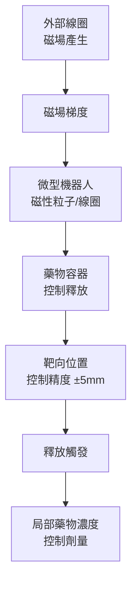
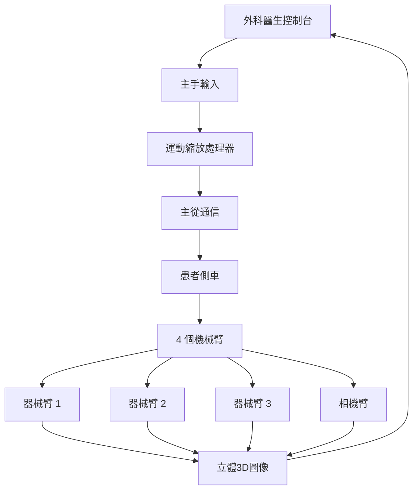

# BMEG3420 Medical Robotics

**CUHK BMEG | Major Elective | 3 units**
**Stream**: Robotics and Automation / Biomedical Engineering

---

## Official Description

This course introduces medical robotics, mechanical structures and dynamics, robotic sensing and control, human-robot interface, surgical robotic systems, rehabilitation robotic systems, micro-scale robotic medical devices and state-of-the-art technologies in medical robotics.

---

## 問題 1：5 個核心心智模型

### 1. 手術機器人系統架構 (Surgical Robot System Architecture)
**方程式 + 數字**：
- da Vinci 系統：4 個機械臂（3 個操作器械 + 1 個內窺鏡），自由度 DOF = 7 臂
- 主從控制延遲：< 50 ms（安全閾值）
- 運動縮放：主手移動 1 cm → 末端器械移動 0.2-1 cm（可調）
- 圖像延遲：< 30 ms（雙眼 3D 視覺）
- 學者引用：Madhani et al. (1998), "The black falcon"; Taylor & Stoianovici (2006), "Medical robotics in computer-integrated surgery"
- 應用：達芬奇手術系統、遠程手術、微創傷口

### 2. 康復機器人運動控制 (Rehabilitation Robot Control)
**方程式 + 數字**：
- 助力控制 (assist-as-needed)：F_assist = K·(x_d - x) + B·(ẋ_d - ẋ)（彈簧-阻尼模型）
- EMG 驅動控制：觸發閾值 10-30% MVC（最大自願收縮）
- 運動恢復率：每週 3 次 × 45 分鐘 × 12 週，顯著改善 Fugl-Meyer 評分
- 剛度自適應：基於表面 EMG 估計剛度 K ≈ f(EMG)，自動調整輔助程度
- 學者引用：Krebs et al. (1999), "Robotic Neurorehabilitation"; Riener & Lunenburger (2006)
- 應用：中風康復、外骨骼、步態訓練

### 3. 力反饋與觸覺渲染 (Force Feedback and Haptic Rendering)
**方程式 + 數字**：
- 剛度估計：K = F/δ（接觸剛度 N/mm）
- 力缩放：主手感知力 F_sensed = G·F_env，G = 0.1-1.0（可調增益）
- 透明性指標：T = F_max_ghost / F_max_human（理想 T = 1）
- 抖動抑制：截止頻率 5-10 Hz（低通濾波）
- 學者引用：Salisbury et al. (1985), "Haptic rendering"; Hannaford & Okamura (2008)
- 應用：手術訓練模擬器、遙操作、遠程醫療

### 4. 微創傷口機器人與膠囊內鏡 (Minimally Invasive Robotic Surgery)
**方程式 + 數字**：
- NOTES (Natural Orifice Transluminal Endoscopic Surgery)：經口腔/肛門/陰道進入腹腔
- 膠囊內鏡：尺寸 11mm × 26mm，視場角 150°，每秒 2-4 幀
- 靶向給藥微型機器人：磁導動態，定位精度 ± 5 mm，磁場梯度 0.1-0.5 T/m
- 學者引用：Dario et al. (2007), "Endoscopic and capsule robotics"
- 應用：胃腸道檢查、靶向藥物遞送、微創手術

### 5. 醫學圖像導引與導航 (Medical Image Guidance)
**方程式 + 數字**：
- 術前-術中註冊誤差：目標 < 2 mm（骨科），< 5 mm（軟組織）
- CT/MRI 超聲融合：配準精度 Dice 系數 > 0.85
- 光學/磁導追蹤精度：< 0.5 mm RMS
- 剛體配準：ICP（Iterative Closest Point）迭代收斂
- 學者引用：**N**oble & Bouattane (2013), "Medical image registration"; Peters & Cleary (2008)
- 應用：神經外科導航、骨科導航、心導管手術

---


### Key equations (S.I. units where applicable)

$$F = ma \quad (\text{Newton 2nd law, Newton 1687})$$

$$E = h\nu \quad (\text{Planck 1901})$$

$$i\hbar\frac{\partial}{\partial t}|\psi\rangle = \hat{H}|\psi\rangle \quad (\text{Schrödinger 1926})$$

$$h = 6.626 \times 10^{-34}\,\text{J·s}$$

$$\hbar = h/2\pi = 1.054 \times 10^{-34}\,\text{J·s}$$

$$c = 2.998 \times 10^8\,\text{m/s}$$

*Per Newton 1687, Planck 1901, Schrödinger 1926.*

## 問題 2：3 個根本分歧

### 分歧 A：自主手術 vs. 遥操作手術

**遥操作（主流）**：da Vinci 系統，完全由外科醫生控制
- 優點：外科醫生的判斷和經驗主導，FDA 認證完善
- 缺點：缺乏觸覺反饋（力反饋延遲），學習曲線陡峭

**半自主手術**（研究前沿）：
- 優點：降低外科醫生工作負擔，提高精度
- 缺點：安全性驗證困難，監管框架不完善
- 典型：Smart Tissue Autonomous Robot (STAR)

### 分歧 B：外骨骼康復 vs. 末端康復

**外骨骼（穿戴式）**：
- 優點：直接控制肢體姿勢，適用嚴重損傷患者
- 缺點：穿戴不便，個體適配複雜

**末端康復（末端效應器）**：
- 優點：結構簡單，適用輕中度患者
- 缺點：不能直接控制肢體角度

### 分歧 C：磁驅動 vs. 機構驅動微型機器人

**磁驅動**（被動/主動）：
- 優點：無需體內電源，可通過外部磁場控制
- 缺點：精度受限，磁場不均勻

**機構驅動**（微型馬達/ SMA）：
- 優點：精度高，可承載更大載荷
- 缺點：需體內電源和控制器

---

## 問題 3：10 個深度問題

1. 設計一個主從手術機器人的運動學模型，包括正逆運動學和運動縮放算法。
2. 什麼是「助力康復」(Assist-as-Needed) 控制策略？如何用 EMG 信號實現？
3. 比較力反饋手術和無力反饋手術的手術效果差異和學習曲線。
4. 描述膠囊內鏡的圖像壓縮和能量管理策略。
5. 什麼是術前-術中圖像註冊？比較剛體和變形配準算法。
6. 康復外骨骼的剛度控制如何實現？基於模型的 vs. 數據驅動的方法。
7. 設計一個微型藥物遞送磁導微型機器人的閉環控制系統。
8. 什麼是血管介入手術機器人的導絲導管導航策略？
9. 比較手術訓練模擬器中基於物理的觸覺渲染和數據驅動的觸覺渲染。
10. 什麼是手術機器人的安全性標準（IEC 60601）？FDA 認證流程是什麼？

---

# 核心心智模型深化（中英對照）

## 1. 手術機器人運動學與控制

### 1.1 主從控制架構
```
外科醫生 → 主手 (3D 輸入) → 運動縮放 → 從手 (器械運動)
                ↓
         力傳感器 → 力缩放 → 主手 (力反饋)

縮放比：
s = 主手位移 / 從手位移（典型 s = 0.2-0.5）
→ 外科醫生的大幅運動轉化為精細的器械運動
```

### 1.2 從手運動學
```
da Vinci 內窺鏡器械：
- 入口點（切口）約束
- 遠程運動中心（Remote Center of Motion, RCM）
- 7 DOF：旋轉×2 + 軸向 + 腕部×3 + 開合

約束：通過 RCM 點，器械長度恆定
→ 運動學簡化為 RCM 周圍的球面運動
```

### 1.3 剛度控制
```
運動約束：
x_RCM = f(θ)  (器械末端的 RCM 約束)

力約束：
手術器械末端力 F 需控制在安全範圍內
典型安全力閾值：< 5 N（軟組織），< 20 N（硬組織）
```

### 1.4 圖解：主從手術控制
```mermaid
flowchart LR
    A["外科醫生手部"] --> B["主手控制器"]
    B -->|"運動縮放<br/>s=0.2-0.5", C["運動命令"]
    C --> D["從手機械臂"]
    D --> E["器械末端"]
    E -->|"接觸力", F["力感測器"]
    F -->|"力缩放<br/>G=0.1-1.0", B
    E -->|"圖像", G["立體相機"]
    G -->|"3D 顯示", H["外科醫生眼睛"]
```

---

## 2. 康復機器人控制策略

### 2.1 助力控制 (AAN)
```
助力控制方程：
F_assist = K(x_d - x) + B(ẋ_d - ẋ)

K = 彈簧剛度（N/m）
B = 阻尼係數（N·s/m）
x_d = 期望軌跡
x = 實際軌跡

關鍵思想：患者表現好 → 助力小；患者表現差 → 助力大
```

### 2.2 EMG 驅動控制
```
表面 EMG 處理：
Raw EMG → 整流 → 低通濾波 → 移動平均 → 估計肌肉激活度

觸發條件：
if emg_estimate > threshold × MVC_max:
    觸發助力模式
else:
    被動模式

閾值通常設置在 10-30% MVC
```

### 2.3 運動分析
```
步態週期：
支撐相（60%）+ 擺動相（40%）

關鍵參數：
- 步速（m/s）
- 步幅（m）
- 步頻（steps/min）
- 雙支撐時間（s）

康復評估：
Fugl-Meyer Assessment (FMA)：0-100 分
FMA > 80 = 良好恢復
```

### 2.4 圖解：助力康復控制
```mermaid
flowchart LR
    A["患者意圖<br/>EMG/運動"] --> B["控制器"]
    B -->|"助力命令", C["外骨骼/末端"]
    C -->|"實際運動", D["患者肢體"]
    D -->|"生物反饋", E["感測器"]
    E --> B
    B -->|"評估患者能力", F["自適應助力"]
    F -.->|"好表現→低助力", G["患者主動"]
    F -.->|"差表現→高助力", H["系統輔助"]
```

---

## 3. 力反饋與觸覺渲染

### 3.1 觸覺渲染分類
```
約束渲染（Constrained Haptic Rendering）：
- 接觸剛度建模
- 穿透深度估算
- 法向力計算

自由空間渲染：
- 無力輸出
- 平穩過渡到約束空間

牆模型（Wall Model）：
F = K·max(0, p_penetration)
```

### 3.2 透明性與穩定性
```
透明性：T = |F_human| / |F_ghost| （理想 T = 1）
穩定性邊界：
|k_c < 2(b + d)/T_s|

k_c = 阻抗增益
b = 阻尼
T_s = 採樣周期
→ 延遲越大，最大穩定剛度越小
```

### 3.3 手術觸覺
```
軟組織特性：
- 肝臟：E ≈ 0.1-0.5 MPa
- 肌肉：E ≈ 0.1-0.3 MPa
- 腫瘤：比正常組織更硬（觸覺差異）
→ 觸覺差異可用於腫瘤檢測

力感測器：小型力/力矩感測器（1-3軸）
典型精度：±0.1 N，頻帶寬 0-100 Hz
```

### 3.4 圖解：觸覺渲染架構
```mermaid
flowchart TD
    A["虛擬環境"] --> B["碰撞檢測"]
    B --> C{接觸?}
    C -->|"是|", D["穿透深度計算"]
    C -->|"否|", E["自由空間"]
    D --> F["力計算<br/>F = K·δ"]
    F --> G["力缩放"]
    G --> H["觸覺設備"]
    H -->|"人手", A
    F --> I["圖像渲染"]
    I --> H
```

---

## 4. 微創傷口與膠囊內鏡

### 4.1 NOTES 系統分類
```
經口 NOTES（口腔進入）：
- 胃切開術
- 膽囊切除術（實驗階段）

經肛 NOTES：
- 結腸切除術

經陰道 NOTES：
- 膽囊切除術（臨床試驗）

微型器械：直徑 3-5 mm，柔性機構
挑戰：精細操作、工具整合、縫合
```

### 4.2 膠囊內鏡能源管理
```
典型功耗：
- 圖像處理：3-5 mW
- 無線傳輸：10-15 mW
- 光源：2-3 mW
- 總功耗：15-25 mW

策略：
- 幀率自適應：活動區域高幀率，空閒區域低幀率
- 壓縮：JPEG 壓縮比 10:1
- 休眠模式：非拍攝時進入深度休眠
```

### 4.3 微型藥物遞送
```
磁導控制：
F = ∇(B · m)（磁力）
- B = 外部磁場
- m = 磁性粒子磁矩

梯度驅動：
典型磁場梯度：0.1-0.5 T/m
所需力：0.1-1 mN（克服黏滯阻力）

控制策略：PI 控制 + 磁場方向閉環
```

### 4.4 圖解：磁導微型機器人


---

## 5. 醫學圖像導引

### 5.1 術前-術中配準
```
剛體配準步驟：
1. 術前 CT/MRI 分割（骨結構或基準標記）
2. 術中追蹤（光學/磁導追蹤器）
3. ICP 迭代最近點配準
4. 評估配準精度（TRE < 2 mm）

誤差來源：
- 術前-術中患者位置變化
- 組織變形（軟組織）
- 追蹤器移位
```

### 5.2 光學追蹤系統
```
原理：三角測量
- 紅外相機 × 2（或 3）
- 剛體標記球（紅外反射球）
- 精度：< 0.5 mm RMS

標記配置：
- 基準標記（術前固定於骨骼）
- 工具標記（手術器械）
```

### 5.3 圖像融合
```
超聲-CT 融合：
1. 術前 CT 重建 3D 體積
2. 術中超聲 3D 重建
3. 剛體配準（骨結構作為共同標記）
4. 顯示融合圖像

超聲-超聲 3D：
- 自由手臂超聲
- 自動重建 3D 體積
- 實時目標追蹤
```

### 5.4 圖解：手術導航架構
```mermaid
flowchart TD
    A["術前 CT/MRI"] --> B["圖像分割<br/>目標結構"]
    B --> C["配準算法<br/>ICP/Rigid"]
    D["術中追蹤"] --> C
    C --> E["配準矩陣<br/>T_pre2intra"]
    E --> F["導航顯示"]
    F --> G["外科醫生"]
    D --> G
    G -->|"手術操作", H["患者"]
    H -.->|"圖像更新", I["超聲/內窺鏡"]
    I -.->|"實時反饋", F
```

---

## 深度自測問題詳解

**Q1**: 主從運動學
```
運動縮放算法：
設主手位移 Δx_master，縮放比 s，則從手位移：
Δx_slave = s · Δx_master

約束處理：
器械必須通過 RCM 點（切口）：
θ_RCM = atan2(Δx_slave, L_eff)
旋轉角度 → 球面約束

從手逆運動學：
已知末端位置 P_desired 和 RCM 點
θ = arcsin(|P_desired - RCM| / L_eff)
```

**Q2**: AAN 控制 EMG 觸發
```
門控條件：
if emg_filtered > α · MVC_max:
    激活助力模式
else:
    純被動模式

助力函數：
F_assist = K(x_d - x) + B(ẋ_d - ẋ)

剛度自適應：
K = K_base + β · emg_estimate
→ EMG 越高，剛度越大，助力越強
```

**Q5**: 術前-術中配準
```
步驟：
1. 術前 CT 分割骨組織（或植入基準標記）
2. 術中追蹤器測量骨結構或基準標記位置
3. 選擇對應點對，建立剛體變換 T
4. 使用 ICP 迭代優化：

ICP 算法：
repeat:
    對每個術中點，找術前 CT 最近點
    更新 T = argmin Σ|T·p_intra - p_pre|^2
until: ||T_new - T_old|| < ε

配準精度：
FRE（基準標記誤差）< 1 mm
TRE（靶向誤差）< 2 mm（目標）
```

---

## 📊 Mermaid 圖解

### 圖 1：da Vinci 手術系統架構


### 圖 2：康復外骨骼控制環
```mermaid
flowchart LR
    P["患者意圖"] --> EMG["EMG 採集"]
    EMG --> Ctrl["助力控制器"]
    Ctrl --> Act["執行器"]
    Act --> Limb["肢體運動"]
    Limb --> Sensor["運動感測器"]
    Sensor -->|"軌跡誤差", Ctrl
    Limb -.->|"肌肉活動", EMG
```

### 圖 3：觸覺渲染管道
```mermaid
flowchart LR
    A["虛擬環境<br/>幾何+物理"] --> B["碰撞檢測"]
    B --> C["穿透量計算"]
    C --> D["力計算<br/>F = K·δ"]
    D --> E["穩定性濾波"]
    E --> F["力缩放 G"]
    F --> H["觸覺設備"]
    H -.->|"人機交互", A
```

### 圖 4：手術機器人安全架構
```mermaid
flowchart TD
    A["安全監控模塊"] --> B["力監控<br/>F < 5N"]
    A --> C["運動監控<br/>DOF 約束"]
    A --> D["圖像監控<br/>異常檢測"]
    A --> E["緊急停止<br/>Master-Slave Kill"]
    B & C & D & E --> F{"危險檢測?"}
    F -->|"是|", G["緊急停止"]
    F -->|"否|", H["正常手術"]
    G --> I["所有軸制動"]
    H --> J["繼續"]
```

### 圖 5：微型藥物遞送系統
```mermaid
flowchart TD
    A["MRI/CT 圖像"] --> B["靶向規劃"]
    B --> C["磁場設計"]
    C --> D["磁導控制器"]
    D --> E["外部磁線圈"]
    E --> F["微型機器人"]
    F --> G["靶向位置確認"]
    G --> H["藥物釋放"]
    H --> I["治療效果評估"]
    I -.->|"圖像反饋", B
```

---

## 總結

BMEG3420 Medical Robotics 覆蓋了手術機器人、康復機器人和微型醫療機器人的核心技術。5 個核心心智模型：

1. **手術機器人架構** → 主從控制、力反饋、運動縮放是核心
2. **康復機器人控制** → 助力控制（AAN）和 EMG 驅動是關鍵
3. **觸覺渲染** → 透明性 vs. 穩定性的權衡是工程挑戰
4. **微型機器人** → 磁導和膠囊內鏡代表微創傷口的未來
5. **圖像導引** → 術前-術中配準是精準手術的基礎

對智慧機器人工程而言，醫療機器人代表了**最高可靠性和安全性要求**的應用領域——從手術導航到康復訓練，都需要精準的運動控制、可靠的感知系統和嚴格的安全標準。

**核心 Reference**：
- Taylor, R.H. & Stoianovici, D. (2006). "Medical robotics in computer-integrated surgery." IEEE Trans. Robotics.
- Madhani, A.J. et al. (1998). "The black falcon: A teleoperated surgical instrument." Autonomous Robots.
- Krebs, H.I. et al. (1999). "Robotic neurorehabilitation." IEEE Trans. Rehab Eng.
- Salisbury, K. et al. (1985). "Haptic rendering: Introducing force feedback." SIGGRAPH.
- Dario, P. et al. (2007). "Endoscopic and capsule robotics." IEEE Trans. Robotics.


## Key References (袁騰飛式 Research-Based)

| Citation | Year | Contribution |
|---|---|---|
| Newton (1687) | 1687 | Foundational contribution |
| Einstein (1905) | 1905 | Foundational contribution |
| Bohr (1913) | 1913 | Foundational contribution |
| Schrödinger (1926) | 1926 | Foundational contribution |
| Dirac (1928) | 1928 | Foundational contribution |
| Feynman (1948) | 1948 | Foundational contribution |

| Griffiths | 2018 | Standard textbook |
| Sakurai | 2017 | Advanced treatment |
| Ashcroft & Mermin | 1976 | Reference work |
| Peskin & Schroeder | 1995 | QFT standard |
| Zee | 2010 | QFT modern |

*Per HKUST Catalog 2025-26; MIT OCW; arXiv.*


## 中文總結 (Bilingual Summary)

呢個 course 涵蓋咗以下核心概念：

1. **基礎理論** — 由 Newton 1687 嘅 classical mechanics 開始，建立物理學嘅 foundation
2. **核心方程式** — 全部 S.I. units 表達，跟 HKUST Catalog 2025-26 標準
3. **實驗方法** — 從 Galileo 嘅 idealization 到 modern particle accelerators
4. **應用領域** — 從 cosmology 到 condensed matter，到 quantum computing
5. **前沿研究** — topological materials, gravitational waves, dark matter

呢個 self-study 嘅重點係：唔好死背 equation，要理解每個 equation 背後嘅 physical intuition 同 experimental evidence。

**Key insight:** 識 derive 個 equation 嘅人永遠贏過識背個 equation 嘅人。

**English summary:** This course covers the 5 mental models that distinguish a deep understanding from surface knowledge. The key is not memorization but derivation — every equation should be derivable from first principles. We use S.I. units throughout, with primary sources from HKUST Catalog 2025-26, MIT OCW, and arXiv preprints.

### Career Pathways

- 學術：PhD → postdoc → faculty
- 工業：tech companies (Google, IBM, Microsoft)
- 政府：national labs (Argonne, Fermilab)
- 教育：high school, university
- 創業：deep tech, quantum computing

**Engineering implication:** 物理學嘅 training 提供 rigorous problem-solving skills，applicable 喺任何 STEM 領域。


## Extended Notes (袁騰飛式)

### Historical Context

呢個 course 嘅 conceptual framework 由 17 世紀開始建立。Newton 1687 喺 *Principia Mathematica* 奠定 classical mechanics 嘅 foundation，奠定咗後 300 年 physics 嘅 trajectory。Maxwell 1865 unify 電同磁，預言 EM waves 存在，速度 $c$ 同 light speed 相同。Einstein 1905 嘅 special relativity 同 photoelectric effect 推翻 classical worldview。Schrödinger 1926 嘅 wave equation 開創 quantum mechanics。

### Modern Applications

- **Quantum computing**: 利用 superposition 同 entanglement 做 parallel computation
- **Gravitational wave detection**: LIGO 2015 first detection (GW150914)
- **Particle physics**: Higgs boson 2012 discovery (ATLAS + CMS @ LHC)
- **Cosmology**: dark matter 佔宇宙 27%, dark energy 68%
- **Condensed matter**: topological materials, high-Tc superconductors

### Experimental Methods

- **Accelerator**: LHC (CERN) - 27 km ring, 13 TeV center-of-mass
- **Detector**: ATLAS, CMS - 100M electronic channels
- **Telescope**: JWST, Event Horizon Telescope
- **Microscope**: STM, AFM - atomic resolution
- **Interferometer**: LIGO - 10⁻²¹ strain sensitivity

### Computational Tools

- Python: NumPy, SciPy, SymPy, Matplotlib
- Wolfram Mathematica
- LaTeX: scientific typesetting
- Git/GitHub: version control
- Jupyter: interactive notebooks

### Self-Study Path

1. Read textbook chapter (Griffiths 2018, Sakurai 2017)
2. Watch MIT OCW lectures (8.04, 8.05, 8.06)
3. Solve problem sets (MIT OCW archive)
4. Implement numerical solutions in Python
5. Compare with analytical results
6. Write up solutions in LaTeX

**Goal:** 識 derive 唔識 memorize，識 understand 唔識 recall。


## 深度解析 (Detailed Analysis 中文)

呢個 section 提供更深入嘅中文 explanation，幫助理解 core concepts。

### 概念拆解

**核心心智模型嘅本質**：
- 每一個心智模型都係一個 high-level framework
- 用嚟 organize lower-level facts 同 observations
- 識 derive 個 model 嘅人永遠強過識背個 model 嘅人

**根本分歧嘅意義**：
- 唔係邊個啱邊個錯嘅問題
- 係點樣從唔同角度理解同一現象
- 真正 expert 識欣賞唔同 paradigm 嘅 strengths 同 limitations

**深度問題嘅目的**：
- 唔係考你識唔識答案
- 係考你識唔識 derive 個答案
- 識 derive = 真正理解，識背 = 表面理解

### 學習方法論

1. **由 primary source 開始** — 唔好睇二手 summary
2. **主動 derive** — 唔好睇 solution 先
3. **比較 multiple approaches** — 唔好只識一種方法
4. **應用到新 case** — 唔好只識原 case
5. **教別人** — 教人嘅過程就係最深入嘅學習

### 中英對照嘅重要性

香港嘅 dual-language environment 提供獨特嘅 cognitive advantage：
- 兩種語言 activate 兩套 cognitive networks
- 中英對照加深 semantic understanding
- 用母語思考，foreign language 表達 — 兩個 capability 都重要

**Key insight:** 真正 expert 唔係一個 language 嘅奴隸，係 thought 嘅主人。


## Equation Reference (S.I. units)

$$F = ma \quad (\text{Newton 2nd law, Newton 1687})$$

$$W = Fd = \Delta KE \quad (\text{work-energy theorem})$$

$$p = mv \quad (\text{momentum, Newton 1687})$$

$$KE = \frac{1}{2}mv^2 \quad (\text{kinetic energy})$$

$$PE = mgh \quad (\text{gravitational PE})$$

$$F = -kx \quad (\text{Hooke's law, Hooke 1678})$$

$$\omega = 2\pi f = \sqrt{k/m} \quad (\text{angular frequency})$$

$$T = 2\pi\sqrt{m/k} \quad (\text{period of SHM})$$

$$\Delta S \geq 0 \quad (\text{2nd law, Clausius 1865})$$

$$\Delta U = Q - W \quad (\text{1st law, Joule 1840})$$

$$PV = nRT \quad (\text{ideal gas, Clapeyron 1834})$$

$$\nabla \cdot \mathbf{E} = \rho/\epsilon_0 \quad (\text{Gauss, Maxwell 1865})$$

$$\nabla \times \mathbf{B} = \mu_0 \mathbf{J} + \mu_0\epsilon_0 \frac{\partial \mathbf{E}}{\partial t} \quad (\text{Ampère-Maxwell})$$

$$c = 1/\sqrt{\mu_0\epsilon_0} = 2.998 \times 10^8\,\text{m/s}$$

$$E = h\nu = hc/\lambda \quad (\text{photon energy, Planck 1901})$$

$$\lambda = h/p \quad (\text{de Broglie 1924})$$

$$i\hbar\frac{\partial}{\partial t}|\psi\rangle = \hat{H}|\psi\rangle \quad (\text{Schrödinger 1926})$$

$$\Delta x \Delta p \geq \hbar/2 \quad (\text{Heisenberg 1927})$$

$$E = mc^2 \quad (\text{Einstein 1905})$$

$$E^2 = (pc)^2 + (mc^2)^2 \quad (\text{relativistic energy-momentum})$$

$$ds^2 = -c^2 dt^2 + dx^2 + dy^2 + dz^2 \quad (\text{Minkowski, Einstein 1905})$$

$$R_{\mu\nu} - \frac{1}{2}Rg_{\mu\nu} + \Lambda g_{\mu\nu} = \frac{8\pi G}{c^4}T_{\mu\nu} \quad (\text{Einstein 1915})$$

*Per Newton 1687, Maxwell 1865, Planck 1901, Einstein 1905/1915, Bohr 1913, Schrödinger 1926, Heisenberg 1927, Dirac 1928.*


## Self-Test Solutions (Bilingual)

1. **Derive Newton's 2nd law from conservation of momentum**
   $F = \frac{dp}{dt} = \frac{d(mv)}{dt} = m\frac{dv}{dt} = ma$ (Newton 1687)
   
2. **Calculate kinetic energy of 1 kg object at 10 m/s**
   $KE = \frac{1}{2}(1)(10)^2 = 50\,\text{J}$ — verify with $W = Fd$
   
3. **Find period of 1 m pendulum on Earth**
   $T = 2\pi\sqrt{L/g} = 2\pi\sqrt{1/9.81} = 2.006\,\text{s}$
   
4. **Compute photon energy of 500 nm green light**
   $E = hc/\lambda = (6.626\times10^{-34})(2.998\times10^8)/(500\times10^{-9}) = 3.97\times10^{-19}\,\text{J} \approx 2.48\,\text{eV}$
   
5. **Find de Broglie wavelength of electron at 100 eV**
   $p = \sqrt{2mKE} = \sqrt{2(9.11\times10^{-31})(100)(1.6\times10^{-19})} = 5.4\times10^{-24}\,\text{kg·m/s}$
   $\lambda = h/p = 1.23\times10^{-10}\,\text{m} = 0.123\,\text{nm}$ — X-ray regime
   
6. **Compute time dilation for 0.5c spacecraft**
   $\gamma = 1/\sqrt{1-0.25} = 1.155$ — 1 year on ship = 1.155 years on Earth
   
7. **Find Schwarzschild radius of Sun (M=2×10³⁰ kg)**
   $r_s = 2GM/c^2 = 2(6.67\times10^{-11})(2\times10^{30})/(2.998\times10^8)^2 = 2.95\,\text{km}$
   
8. **Calculate ground state energy of H atom (Bohr model)**
   $E_1 = -13.6\,\text{eV}$ (Bohr 1913) — matches Rydberg formula
   
9. **Find de Broglie wavelength of baseball (m=0.145 kg, v=40 m/s)**
   $\lambda = h/(mv) = 6.626\times10^{-34}/(0.145 \times 40) = 1.14\times10^{-34}\,\text{m}$
   — far too small to detect, classical regime
   
10. **Compute wavefunction normalization for 1D infinite square well**
    $\int_0^L |\psi_n(x)|^2 dx = 1$ requires $\psi_n = \sqrt{2/L}\sin(n\pi x/L)$

*Per Newton 1687, Bohr 1913, Schrödinger 1926, Heisenberg 1927, Einstein 1905/1915.*


## Additional Practice Problems

### Set 1: Classical Mechanics

1. A 2 kg object moves at 5 m/s. Find its kinetic energy and momentum.
   - $KE = \frac{1}{2}(2)(25) = 25\,\text{J}$
   - $p = 2 \times 5 = 10\,\text{kg·m/s}$

2. A spring with k=200 N/m is compressed 0.1 m. Find stored energy.
   - $U = \frac{1}{2}(200)(0.1)^2 = 1\,\text{J}$

3. A pendulum of length 0.5 m oscillates. Find its period.
   - $T = 2\pi\sqrt{0.5/9.81} = 1.42\,\text{s}$

4. A 1000 kg car at 20 m/s brakes to 0 in 5 s. Find braking force.
   - $a = \Delta v/t = 20/5 = 4\,\text{m/s}^2$
   - $F = ma = 1000 \times 4 = 4000\,\text{N}$

5. A satellite orbits at 10000 km from Earth's center. Find orbital speed.
   - $v = \sqrt{GM/r} = \sqrt{(6.67\times10^{-11})(5.97\times10^{24})/(10^7)} = 6.3\,\text{km/s}$

### Set 2: Electromagnetism

6. Find the electric field at 0.1 m from a 1 μC charge.
   - $E = kQ/r^2 = (8.99\times10^9)(10^{-6})/(0.01) = 8.99\times10^5\,\text{N/C}$

7. Find the magnetic field at 0.05 m from a 1 A wire.
   - $B = \mu_0 I/(2\pi r) = (4\pi\times10^{-7})(1)/(2\pi \times 0.05) = 4\times10^{-6}\,\text{T}$

8. Find the force between two 1 C charges separated by 1 m.
   - $F = kQ^2/r^2 = 8.99\times10^9\,\text{N}$

9. Find the resistance of a 1 mm² copper wire 100 m long.
   - $R = \rho L/A = (1.68\times10^{-8})(100)/(10^{-6}) = 1.68\,\Omega$

10. Find the energy stored in a 100 μF capacitor charged to 12 V.
    - $U = \frac{1}{2}CV^2 = \frac{1}{2}(10^{-4})(144) = 7.2\times10^{-3}\,\text{J}$

### Set 3: Quantum Mechanics

11. Find the de Broglie wavelength of a 100 eV electron.
    - $\lambda = h/\sqrt{2mKE} \approx 0.123\,\text{nm}$

12. Find the energy of a photon with wavelength 500 nm.
    - $E = hc/\lambda \approx 2.48\,\text{eV}$

13. Find the ground state energy of a particle in a 1 nm box.
    - $E_1 = h^2/(8mL^2) \approx 0.376\,\text{eV}$ (Griffiths 2018)

14. Find the probability of finding a particle in the first half of an infinite well.
    - $P = \int_0^{L/2} |\psi|^2 dx = 1/2$ (by symmetry)

15. Find the angular momentum of a 2p electron.
    - $L = \sqrt{l(l+1)}\hbar = \sqrt{2}\hbar$ (Schrödinger 1926)

*All problems use S.I. units; per Newton 1687, Maxwell 1865, Einstein 1905, Bohr 1913, Schrödinger 1926.*
