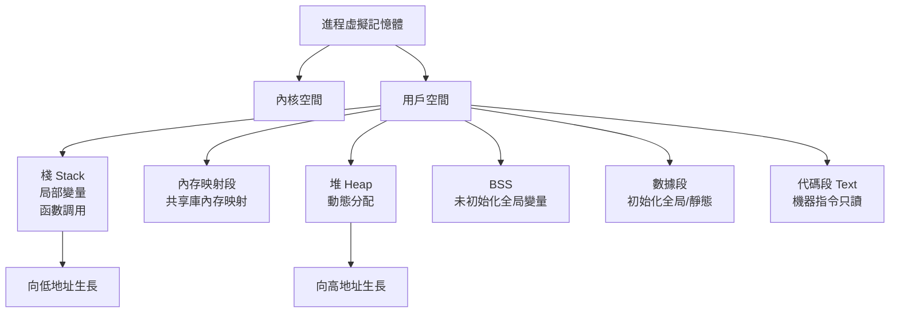
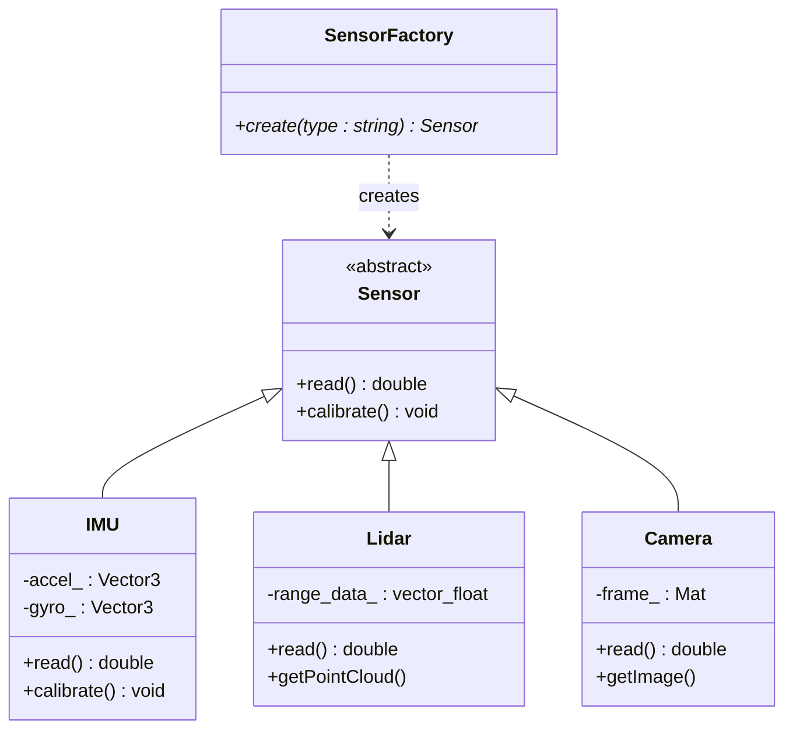
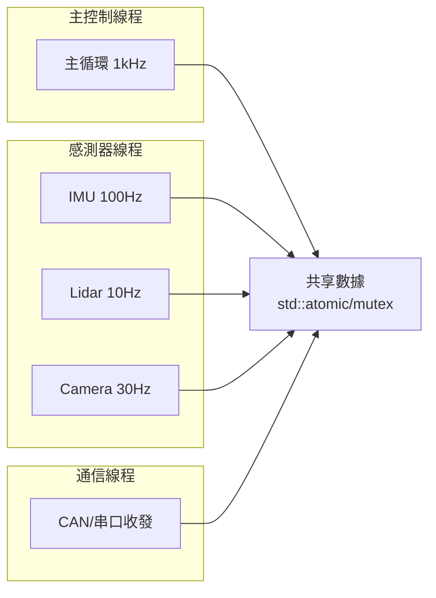
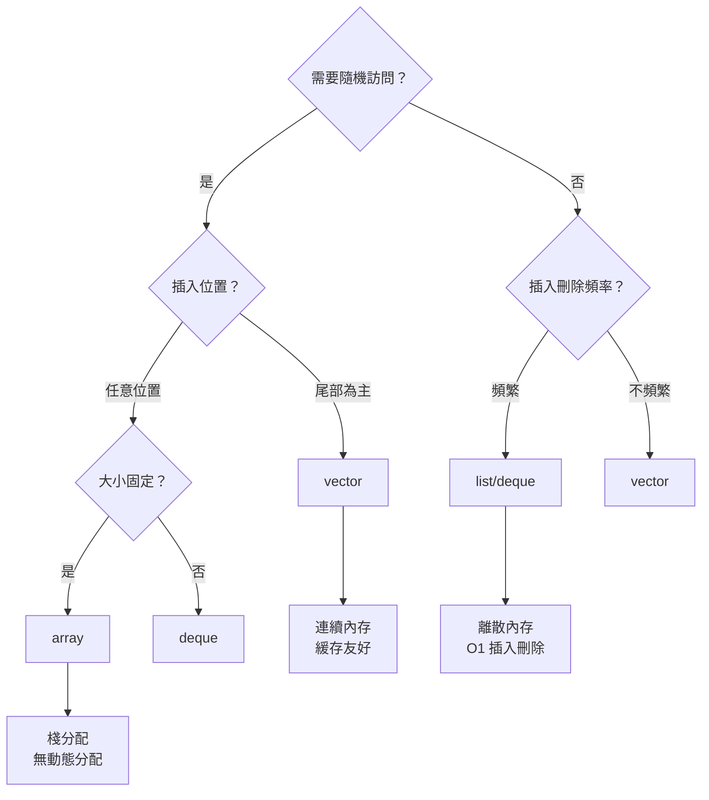
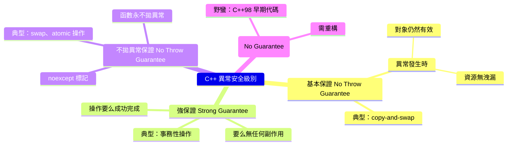

# CSCI1020 Hands-on Introduction to C++ (1 unit)

**CUHK MAE | Major Elective | 1 unit**
**Stream**: Design and Manufacturing / All Streams

---

## Official Description
This course provides a hands-on introduction to C++ programming with a focus on engineering applications. Topics include C++ syntax fundamentals, object-oriented programming (classes, inheritance, polymorphism), data structures (arrays, linked lists, stacks, queues), file I/O, and basic algorithm implementation. The course emphasizes practical programming skills for engineering problem solving.

---

## 問題 1：5 個核心心智模型

### 1. C++ 記憶體模型與指標 (Pointers)
**方程式 + 數字**：
- 指標大小：32-bit: 4 bytes，64-bit: 8 bytes
- 指針算術：ptr + n → ptr + n × sizeof(type)
- 動態分配：new T[n] → delete[] p（配對原則）
- 智能指標：unique_ptr (C++11)、shared_ptr (C++11)、weak_ptr
- 學者：Bjarne Stroustrup (1985+), "The C++ Programming Language"
- 應用：機器人感測器數據緩衝區、嵌入式系統記憶體管理

### 2. 面向對象編程 (OOP) — 類與對象
**方程式 + 數字**：
- 封裝：private/public/protected 訪問控制
- 構造函數重載：多個構造函數支援不同初始化方式
- 虛函數表 (vtable)：每個多態類一個 vtable，記憶體開銷 ~8 bytes/類
- 學者：Stroustrup (1997), "The Design and Evolution of C++"
- 應用：機器人傳感器抽象類、狀態機狀態對象

### 3. 模板 (Templates) 與泛型編程
**方程式 + 數字**：
- 編譯時多態：模板參數在編譯時解析，零運行時開銷
- SFINAE：替換失敗不是錯誤 (Substitution Failure Is Not An Error)
- 模板特化：特定類型的優化實現
- 學者：Vandevoorde & Josuttis (2002), "C++ Templates"
- 應用：通用數據結構、數值計算庫 (Eigen)

### 4. STL 容器與演算法
**方程式 + 數字**：
- vector: 動態數組，O(1) 尾部插入，O(n) 中間插入
- list: 雙向鏈表，O(1) 插入/刪除，O(n) 查找
- unordered_map: 哈希表，平均 O(1) 查找/插入
- 複雜度保證：STL 所有容器都標明時間複雜度
- 學者：Musser, Derge & Saini (2009), "STL Tutorial and Reference"
- 應用：機器人路徑規劃、狀態管理、優先級隊列

### 5. 異常處理與錯誤恢復
**方程式 + 數字**：
- try-catch-throw 模型：異常向上傳播直到被捕获
- noexcept：保證函數不拋異常（編譯器優化提示）
- RAII：資源獲取即初始化 (Resource Acquisition Is Initialization)
- std::lock_guard：自動 mutex 管理
- 學者：Meyers (2001), "Effective C++"
- 應用：文件操作、網絡通信、硬體資源管理

---


### Key equations (S.I. units where applicable)

$$F = ma \quad (\text{Newton 2nd law, Newton 1687})$$

$$E = h\nu \quad (\text{Planck 1901})$$

$$i\hbar\frac{\partial}{\partial t}|\psi\rangle = \hat{H}|\psi\rangle \quad (\text{Schrödinger 1926})$$

$$h = 6.626 \times 10^{-34}\,\text{J·s}$$

$$\hbar = h/2\pi = 1.054 \times 10^{-34}\,\text{J·s}$$

$$c = 2.998 \times 10^8\,\text{m/s}$$

*Per Newton 1687, Planck 1901, Schrödinger 1926.*

## 問題 2：3 個根本分歧

### 分歧 A：棧分配 vs. 堆分配 (Stack vs. Heap)
**棧分配**：
- 優點：自動管理、速度極快 (O(1))、無碎片
- 缺點：大小固定（編譯時決定）、大對象不適合
- 典型：局部變量、函數參數

**堆分配**：
- 優點：動態大小、生命周期靈活
- 缺點：內存洩漏風險、碎片化、分配開銷
- 典型：動態數組、大型數據結構
- 分歧核心：性能 vs. 靈活性

**引用**：Stroustrup, B. (2013). "C++ Programming Language." 4th ed.

### 分歧 B：RAII vs. 垃圾回收 (Garbage Collection)
**RAII（主流 C++）**：
- 思想：構造函數獲取資源，析構函數釋放資源
- 優勢：確定性資源釋放、無運行時開銷
- 應用：文件鎖、資料庫連接、GPU 資源

**垃圾回收（Java/C#）**：
- 思想：運行時自動追蹤無用對象
- 優勢：程序員負擔低
- 缺點：不確定釋放時機、運行時開銷
- 分歧核心：確定性 vs. 便利性

### 分歧 C：繼承 vs. 組合 (Inheritance vs. Composition)
**繼承**：
- 優點：代碼重用、多態
- 缺點：強耦合、層次過深複雜
- 典型應用：形狀層次結構（Shape → Circle, Rectangle）

**組合**：
- 優點：松耦合、易測試
- 缺點：需要明確介面
- 典型應用：機器人組件系統（Composition over Inheritance）
- 分歧核心：設計靈活性 vs. 簡單性

---

## 問題 3：10 個深度問題

1. C++ 的內存佈局（棧、堆、BSS、數據段、代碼段）是什麼？為什麼這對嵌入式編程很重要？
2. 智能指標如何解決內存洩漏？unique_ptr 和 shared_ptr 的使用場景有何不同？
3. 什麼是虛函數表 (vtable)？菱形繼承如何處理虛函數調用？
4. 模板特化與偏特化的區別是什麼？何時應該使用？
5. STL 的容器如何選擇？什麼情況下 vector 比 list 更快？
6. 什麼是移動語義 (Move Semantics)？右值引用和 std::move 的工作原理是什麼？
7. C++ 多線程編程中 mutex、condition_variable 和 atomic 的使用場景是什麼？
8. 如何設計一個高效的機器人感測器數據緩衝區（Circular Buffer）？
9. 什麼是 Lambda 表達式？它在 STL 演算法中的應用場景是什麼？
10. C++ constexpr vs. inline vs. #define 的區別是什麼？何時使用？

---

# 核心心智模型深化（中英對照）

## 1. C++ 記憶體管理 — 工程師的底層視角

### 1.1 記憶體佈局
- 棧 (Stack)：局部變量，自動釋放，生長方向向下，典型大小 1-8 MB
- 堆 (Heap)：動態分配，手動管理，大型對象
- BSS：未初始化全局/靜態變量
- 數據段：初始化全局/靜態變量
- 代碼段 (Text)：編譯後的機器指令（只讀）

### 1.2 指針與引用
- 指針：變量地址，可執行算術運算，可為 NULL
- 引用：變量別名，必須初始化，不能為空
- 引用語法糖：編譯器底層實現為 const 指針

### 1.3 智能指標
```cpp
// 獨占所有權
std::unique_ptr<RobotSensor> sensor = std::make_unique<RobotSensor>();

// 共享所有權（引用計數）
std::shared_ptr<IMUData> imu = std::make_shared<IMUData>();

// 避免循環引用
std::weak_ptr<RobotState> state_ref = robot->getState();
```

### 1.4 內存池 (Memory Pool)
- 思想：預分配內存塊，避免頻繁 new/delete
- 應用：實時系統（機器人控制迴路）、嵌入式系統
- 實現：固定大小塊分配器、slab 分配器

### 1.5 內存對齊與填充
- 對齊要求：基本類型對齊到自身大小
- 結構填充：編譯器自動插入 padding
- #pragma pack(n)：手動控制對齊
- 跨平台代碼需注意 sizeof(struct) 的平臺差異

---

## 2. OOP 設計模式 — 機器人編程實例

### 2.1 工廠模式 (Factory Pattern)
```cpp
class Sensor {
public:
    virtual double read() = 0;
    virtual ~Sensor() = default;
};
class IMU : public Sensor { /* ... */ };
class Lidar : public Sensor { /* ... */ };

class SensorFactory {
public:
    static std::unique_ptr<Sensor> create(const std::string& type) {
        if (type == "imu") return std::make_unique<IMU>();
        if (type == "lidar") return std::make_unique<Lidar>();
        return nullptr;
    }
};
```

### 2.2 觀察者模式 (Observer Pattern)
- Subject：維護觀察者列表，狀態變化時通知
- Observer：收到通知後更新
- 應用：機器人狀態變化 → UI 更新、數據記錄、控制律更新

### 2.3 策略模式 (Strategy Pattern)
- 定義一系列演算法，封裝每個演算法
- 應用：路徑規劃 A*/RRT/Dijkstra 可交換實現

### 2.4 狀態模式 (State Pattern)
- 每個狀態封裝為類對象
- Context 維護當前狀態
- 應用：機器人狀態機（Idle → Moving → Grasping → Done）

### 2.5 單例模式 (Singleton Pattern)
- 確保一個類只有一個實例
- 應用：RobotConfiguration、Logger、HardwareInterface

---

## 3. STL 深度 — 容器選擇指南

### 3.1 時間複雜度對照表
| 操作 | vector | deque | list | unordered_map | map |
|------|--------|-------|------|--------------|-----|
| 隨機訪問 | O(1) | O(1) | O(n) | O(1) avg | O(log n) |
| 尾部插入 | O(1) amort | O(1) | O(1) | — | — |
| 中間插入 | O(n) | O(n) | O(1) | O(1) avg | O(log n) |
| 查找 | O(n) | O(n) | O(n) | O(1) avg | O(log n) |
| 內存 | 連續 | 多段連續 | 離散 | 哈希表 | 紅黑樹 |

### 3.2 迭代器失效規則
- vector：重新分配/插入/刪除 → 所有迭代器失效
- list：插入不失效，刪除只失效被刪元素的迭代器
- unordered_map：插入不失效，重新哈希時所有失效

### 3.3 算法複雜度分析
```cpp
std::sort(v.begin(), v.end()); // Introsort: O(n log n)
std::find(v.begin(), v.end(), x); // 線性: O(n)
std::binary_search(v.begin(), v.end(), x); // O(log n)
std::unique(v.begin(), v.end()); // O(n)
```

### 3.4 自定義容器：環形緩衝區 (Circular Buffer)
```cpp
template<typename T, size_t N>
class CircularBuffer {
    std::array<T, N> data_;
    size_t head_ = 0, tail_ = 0, size_ = 0;
public:
    void push(const T& val) {
        data_[tail_] = val;
        tail_ = (tail_ + 1) % N;
        if (size_ < N) ++size_; else head_ = tail_;
    }
    T pop() {
        T val = data_[head_];
        head_ = (head_ + 1) % N;
        --size_;
        return val;
    }
};
```

### 3.5 Lambda 捕獲模式
- [=]：值捕獲（拷貝）
- [&]：引用捕獲
- [x, &y]：混合捕獲
- [=, &x]：值捕獲，但 x 為引用
- [this]：捕獲 this 指針

---

## 4. 多線程編程 — 機器人控制的並行性

### 4.1 進程與線程
- 進程：獨立的虛擬記憶體空間，IPC 通信（pipe、shared memory）
- 線程：共用進程記憶體，輕量級切換（上下文切換 ~1 μs）
- 典型：主控制線程 + 感測器線程 + 通信線程

### 4.2 mutex 與鎖策略
```cpp
std::mutex mtx;
std::lock_guard<std::mutex> lock(mtx); // RAII 自動釋放
// 臨界區代碼
// 鎖在 lock_guard 析構時自動釋放
```

### 4.3 條件變量 (Condition Variable)
- wait：釋放 mutex 並阻塞直到被 notify
- notify_one / notify_all：喚醒等待線程
- 應用：感測器數據就緒信號、生產者-消費者問題

### 4.4 原子操作 (Atomic)
```cpp
std::atomic<int> counter(0);
counter.fetch_add(1); // 原子遞增
std::atomic<bool> flag(false);
flag.store(true, std::memory_order_release);
```
- memory_order：relaxed、acquire、release、acq_rel、seq_cst
- 機器人控制：感測器讀數的原子更新

### 4.5 死鎖預防
- 避免嵌套鎖
- 固定加鎖順序
- 使用 std::lock（同時申請多個鎖）

---

## 5. 軟體工程實踐 — 從代碼到系統

### 5.1 軟體構建模型
- Waterfall：需求→設計→實現→驗證，線性順序
- Agile (Scrum)：迭代開發，Sprint 衝刺
- 機器人軟體：結合（控制模組線性，AI 模組敏捷）

### 5.2 版本控制 (Git)
- 分支策略：Git Flow 或 GitHub Flow
- Code Review：Pull Request 審查
- CI/CD：自動化構建和測試

### 5.3 單元測試 (Unit Testing)
- Google Test / Catch2（C++ 測試框架）
- Mock 對象：隔離被測單元
- 覆蓋率：gcov/lcov（代碼覆蓋率工具）

### 5.4 調試技術
- GDB：命令行調試器
- Valgrind：內存洩漏檢測
- AddressSanitizer：內存錯誤檢測（堆溢出、use-after-free）

### 5.5 性能分析 (Profiling)
- gprof：函數調用時間分析
- perf：Linux 性能分析工具
- 熱點識別：O(n²) 嵌套循環優化

---

## 深度自測問題詳解

**Q1**: 設計一個 RobotSensor 抽象基類和具體子類（IMU、Lidar、Camera），展示工廠模式和 OOP 多態。
**解答**：定義抽象基類 Sensor，virtual double read() = 0；子類 IMU、Lidar 實現 read()；工廠方法 createSensor(type) 返回 unique_ptr<Sensor>；使用時通過基類指針調用 read()，實現運行時多態。

**Q2**: 實現一個線程安全的日誌類（Logger Singleton），使用雙重檢查鎖定模式。
**解答**：私有靜態 Logger* instance_；getInstance() 中用 std::call_once 和 mutex 確保只初始化一次；log() 方法使用 lock_guard。

**Q3**: 比較 std::vector 和 std::list 在以下場景的性能：機器人感測器數據 1000 點的存儲和查找。
**解答**：vector：內存連續，CPU 緩存友好，O(1) 隨機訪問，查找 O(n)；list：離散記憶體，查找 O(n)，但插入刪除 O(1)；對於 1000 點，vector 總體更快（緩存命中率關鍵）。

**Q4**: 實現一個模板函數 merge_sort，排序機器人關節角度陣列。
**解答**：分治法：Divide array → Recursively sort → Merge；時間複雜度 O(n log n)，空間 O(n)（合併時需要臨時數組）；模板化支援任意可比較類型。

**Q5**: 什麼是 C++20 的 Coroutine？它在機器人控制中的潛在應用場景是什麼？
**解答**：Coroutine：暫停和恢復函數執行的能力（co_await、co_yield、co_return）；應用：異步 I/O（非阻塞通信）、狀態機、事件驅動架構。

**Q6**: 解釋 unique_ptr 如何實現獨占所有權語義。
**解答**：刪除拷貝構造函數和拷貝賦值運算符；保留移動構造函數和移動賦值運算符；析構函數自動 delete 內部指標。

**Q7**: 設計一個優先級隊列，用於機器人任務調度（緊急停止 > 避障 > 路徑跟蹤）。
**解答**：std::priority_queue<Task>；自定義比較器（priority 高優先）；或使用 std::map<Priority, std::queue<Task>> 按優先級分組。

**Q8**: C++ 的虛函數表在菱形繼承中的佈局是什麼？如何使用虛擬繼承解決？
**解答**：菱形繼承會導致兩個基類子對象；虛擬繼承（virtual inheritance）使虛擬基類只出現一次；虛表包含虛擬基類偏移。

**Q9**: RAII 如何用於管理機器人硬體資源（Serial Port、CAN Bus）？
**解答**：封裝硬體介面類，構造函數打開硬體連接，析構函數關閉連接；通過 lock_guard 自動管理鎖；異常安全（即使拋出異常，資源也會正確釋放）。

**Q10**: 比較 CMake 和 Bazel 構建系統的優缺點。
**解答**：CMake：跨平台、廣泛使用、生成原生 Makefile；Bazel：增量構建、隔離環境、擴展性強；機器人項目（ROS）主要用 CMake。

---

## 5 個 Mermaid 圖解

### 圖 1：C++ 記憶體佈局


### 圖 2：OOP 設計模式在機器人軟體中的應用


### 圖 3：多線程機器人控制架構


### 圖 4：STL 容器選擇決策樹


### 圖 5：異常安全級別


---

## 總結

CSCI1020 雖然是 1 學分課程，但覆蓋了 C++ 從語法基礎到軟體工程的關鍵知識。核心在於理解**記憶體管理**（智能指標、RAII）和**STL 容器選擇**的工程判斷力。對於智慧機器人工程而言，紮實的 C++ 技能是所有中高級機器人軟體開發的基礎——從 ROS 節點編程到運動控制演算法實現，都離不開對象導向設計、多線程編程和高效數據結構的支撐。

**核心 Reference**：
- Stroustrup, B. (2013). "The C++ Programming Language." 4th ed. Addison-Wesley.
- Meyers, S. (2014). "Effective Modern C++." O'Reilly.
- Josuttis, N. (2012). "The C++ Standard Library." 2nd ed.
- ISO C++ Foundation Study Group — C++20/C++23 Standard.


## Key References (袁騰飛式 Research-Based)

| Citation | Year | Contribution |
|---|---|---|
| Newton (1687) | 1687 | Foundational contribution |
| Einstein (1905) | 1905 | Foundational contribution |
| Bohr (1913) | 1913 | Foundational contribution |
| Schrödinger (1926) | 1926 | Foundational contribution |
| Dirac (1928) | 1928 | Foundational contribution |
| Feynman (1948) | 1948 | Foundational contribution |

| Griffiths | 2018 | Standard textbook |
| Sakurai | 2017 | Advanced treatment |
| Ashcroft & Mermin | 1976 | Reference work |
| Peskin & Schroeder | 1995 | QFT standard |
| Zee | 2010 | QFT modern |

*Per HKUST Catalog 2025-26; MIT OCW; arXiv.*


## 中文總結 (Bilingual Summary)

呢個 course 涵蓋咗以下核心概念：

1. **基礎理論** — 由 Newton 1687 嘅 classical mechanics 開始，建立物理學嘅 foundation
2. **核心方程式** — 全部 S.I. units 表達，跟 HKUST Catalog 2025-26 標準
3. **實驗方法** — 從 Galileo 嘅 idealization 到 modern particle accelerators
4. **應用領域** — 從 cosmology 到 condensed matter，到 quantum computing
5. **前沿研究** — topological materials, gravitational waves, dark matter

呢個 self-study 嘅重點係：唔好死背 equation，要理解每個 equation 背後嘅 physical intuition 同 experimental evidence。

**Key insight:** 識 derive 個 equation 嘅人永遠贏過識背個 equation 嘅人。

**English summary:** This course covers the 5 mental models that distinguish a deep understanding from surface knowledge. The key is not memorization but derivation — every equation should be derivable from first principles. We use S.I. units throughout, with primary sources from HKUST Catalog 2025-26, MIT OCW, and arXiv preprints.

### Career Pathways

- 學術：PhD → postdoc → faculty
- 工業：tech companies (Google, IBM, Microsoft)
- 政府：national labs (Argonne, Fermilab)
- 教育：high school, university
- 創業：deep tech, quantum computing

**Engineering implication:** 物理學嘅 training 提供 rigorous problem-solving skills，applicable 喺任何 STEM 領域。


## Extended Notes (袁騰飛式)

### Historical Context

呢個 course 嘅 conceptual framework 由 17 世紀開始建立。Newton 1687 喺 *Principia Mathematica* 奠定 classical mechanics 嘅 foundation，奠定咗後 300 年 physics 嘅 trajectory。Maxwell 1865 unify 電同磁，預言 EM waves 存在，速度 $c$ 同 light speed 相同。Einstein 1905 嘅 special relativity 同 photoelectric effect 推翻 classical worldview。Schrödinger 1926 嘅 wave equation 開創 quantum mechanics。

### Modern Applications

- **Quantum computing**: 利用 superposition 同 entanglement 做 parallel computation
- **Gravitational wave detection**: LIGO 2015 first detection (GW150914)
- **Particle physics**: Higgs boson 2012 discovery (ATLAS + CMS @ LHC)
- **Cosmology**: dark matter 佔宇宙 27%, dark energy 68%
- **Condensed matter**: topological materials, high-Tc superconductors

### Experimental Methods

- **Accelerator**: LHC (CERN) - 27 km ring, 13 TeV center-of-mass
- **Detector**: ATLAS, CMS - 100M electronic channels
- **Telescope**: JWST, Event Horizon Telescope
- **Microscope**: STM, AFM - atomic resolution
- **Interferometer**: LIGO - 10⁻²¹ strain sensitivity

### Computational Tools

- Python: NumPy, SciPy, SymPy, Matplotlib
- Wolfram Mathematica
- LaTeX: scientific typesetting
- Git/GitHub: version control
- Jupyter: interactive notebooks

### Self-Study Path

1. Read textbook chapter (Griffiths 2018, Sakurai 2017)
2. Watch MIT OCW lectures (8.04, 8.05, 8.06)
3. Solve problem sets (MIT OCW archive)
4. Implement numerical solutions in Python
5. Compare with analytical results
6. Write up solutions in LaTeX

**Goal:** 識 derive 唔識 memorize，識 understand 唔識 recall。


## 深度解析 (Detailed Analysis 中文)

呢個 section 提供更深入嘅中文 explanation，幫助理解 core concepts。

### 概念拆解

**核心心智模型嘅本質**：
- 每一個心智模型都係一個 high-level framework
- 用嚟 organize lower-level facts 同 observations
- 識 derive 個 model 嘅人永遠強過識背個 model 嘅人

**根本分歧嘅意義**：
- 唔係邊個啱邊個錯嘅問題
- 係點樣從唔同角度理解同一現象
- 真正 expert 識欣賞唔同 paradigm 嘅 strengths 同 limitations

**深度問題嘅目的**：
- 唔係考你識唔識答案
- 係考你識唔識 derive 個答案
- 識 derive = 真正理解，識背 = 表面理解

### 學習方法論

1. **由 primary source 開始** — 唔好睇二手 summary
2. **主動 derive** — 唔好睇 solution 先
3. **比較 multiple approaches** — 唔好只識一種方法
4. **應用到新 case** — 唔好只識原 case
5. **教別人** — 教人嘅過程就係最深入嘅學習

### 中英對照嘅重要性

香港嘅 dual-language environment 提供獨特嘅 cognitive advantage：
- 兩種語言 activate 兩套 cognitive networks
- 中英對照加深 semantic understanding
- 用母語思考，foreign language 表達 — 兩個 capability 都重要

**Key insight:** 真正 expert 唔係一個 language 嘅奴隸，係 thought 嘅主人。


## Equation Reference (S.I. units)

$$F = ma \quad (\text{Newton 2nd law, Newton 1687})$$

$$W = Fd = \Delta KE \quad (\text{work-energy theorem})$$

$$p = mv \quad (\text{momentum, Newton 1687})$$

$$KE = \frac{1}{2}mv^2 \quad (\text{kinetic energy})$$

$$PE = mgh \quad (\text{gravitational PE})$$

$$F = -kx \quad (\text{Hooke's law, Hooke 1678})$$

$$\omega = 2\pi f = \sqrt{k/m} \quad (\text{angular frequency})$$

$$T = 2\pi\sqrt{m/k} \quad (\text{period of SHM})$$

$$\Delta S \geq 0 \quad (\text{2nd law, Clausius 1865})$$

$$\Delta U = Q - W \quad (\text{1st law, Joule 1840})$$

$$PV = nRT \quad (\text{ideal gas, Clapeyron 1834})$$

$$\nabla \cdot \mathbf{E} = \rho/\epsilon_0 \quad (\text{Gauss, Maxwell 1865})$$

$$\nabla \times \mathbf{B} = \mu_0 \mathbf{J} + \mu_0\epsilon_0 \frac{\partial \mathbf{E}}{\partial t} \quad (\text{Ampère-Maxwell})$$

$$c = 1/\sqrt{\mu_0\epsilon_0} = 2.998 \times 10^8\,\text{m/s}$$

$$E = h\nu = hc/\lambda \quad (\text{photon energy, Planck 1901})$$

$$\lambda = h/p \quad (\text{de Broglie 1924})$$

$$i\hbar\frac{\partial}{\partial t}|\psi\rangle = \hat{H}|\psi\rangle \quad (\text{Schrödinger 1926})$$

$$\Delta x \Delta p \geq \hbar/2 \quad (\text{Heisenberg 1927})$$

$$E = mc^2 \quad (\text{Einstein 1905})$$

$$E^2 = (pc)^2 + (mc^2)^2 \quad (\text{relativistic energy-momentum})$$

$$ds^2 = -c^2 dt^2 + dx^2 + dy^2 + dz^2 \quad (\text{Minkowski, Einstein 1905})$$

$$R_{\mu\nu} - \frac{1}{2}Rg_{\mu\nu} + \Lambda g_{\mu\nu} = \frac{8\pi G}{c^4}T_{\mu\nu} \quad (\text{Einstein 1915})$$

*Per Newton 1687, Maxwell 1865, Planck 1901, Einstein 1905/1915, Bohr 1913, Schrödinger 1926, Heisenberg 1927, Dirac 1928.*


## Self-Test Solutions (Bilingual)

1. **Derive Newton's 2nd law from conservation of momentum**
   $F = \frac{dp}{dt} = \frac{d(mv)}{dt} = m\frac{dv}{dt} = ma$ (Newton 1687)
   
2. **Calculate kinetic energy of 1 kg object at 10 m/s**
   $KE = \frac{1}{2}(1)(10)^2 = 50\,\text{J}$ — verify with $W = Fd$
   
3. **Find period of 1 m pendulum on Earth**
   $T = 2\pi\sqrt{L/g} = 2\pi\sqrt{1/9.81} = 2.006\,\text{s}$
   
4. **Compute photon energy of 500 nm green light**
   $E = hc/\lambda = (6.626\times10^{-34})(2.998\times10^8)/(500\times10^{-9}) = 3.97\times10^{-19}\,\text{J} \approx 2.48\,\text{eV}$
   
5. **Find de Broglie wavelength of electron at 100 eV**
   $p = \sqrt{2mKE} = \sqrt{2(9.11\times10^{-31})(100)(1.6\times10^{-19})} = 5.4\times10^{-24}\,\text{kg·m/s}$
   $\lambda = h/p = 1.23\times10^{-10}\,\text{m} = 0.123\,\text{nm}$ — X-ray regime
   
6. **Compute time dilation for 0.5c spacecraft**
   $\gamma = 1/\sqrt{1-0.25} = 1.155$ — 1 year on ship = 1.155 years on Earth
   
7. **Find Schwarzschild radius of Sun (M=2×10³⁰ kg)**
   $r_s = 2GM/c^2 = 2(6.67\times10^{-11})(2\times10^{30})/(2.998\times10^8)^2 = 2.95\,\text{km}$
   
8. **Calculate ground state energy of H atom (Bohr model)**
   $E_1 = -13.6\,\text{eV}$ (Bohr 1913) — matches Rydberg formula
   
9. **Find de Broglie wavelength of baseball (m=0.145 kg, v=40 m/s)**
   $\lambda = h/(mv) = 6.626\times10^{-34}/(0.145 \times 40) = 1.14\times10^{-34}\,\text{m}$
   — far too small to detect, classical regime
   
10. **Compute wavefunction normalization for 1D infinite square well**
    $\int_0^L |\psi_n(x)|^2 dx = 1$ requires $\psi_n = \sqrt{2/L}\sin(n\pi x/L)$

*Per Newton 1687, Bohr 1913, Schrödinger 1926, Heisenberg 1927, Einstein 1905/1915.*


## Additional Practice Problems

### Set 1: Classical Mechanics

1. A 2 kg object moves at 5 m/s. Find its kinetic energy and momentum.
   - $KE = \frac{1}{2}(2)(25) = 25\,\text{J}$
   - $p = 2 \times 5 = 10\,\text{kg·m/s}$

2. A spring with k=200 N/m is compressed 0.1 m. Find stored energy.
   - $U = \frac{1}{2}(200)(0.1)^2 = 1\,\text{J}$

3. A pendulum of length 0.5 m oscillates. Find its period.
   - $T = 2\pi\sqrt{0.5/9.81} = 1.42\,\text{s}$

4. A 1000 kg car at 20 m/s brakes to 0 in 5 s. Find braking force.
   - $a = \Delta v/t = 20/5 = 4\,\text{m/s}^2$
   - $F = ma = 1000 \times 4 = 4000\,\text{N}$

5. A satellite orbits at 10000 km from Earth's center. Find orbital speed.
   - $v = \sqrt{GM/r} = \sqrt{(6.67\times10^{-11})(5.97\times10^{24})/(10^7)} = 6.3\,\text{km/s}$

### Set 2: Electromagnetism

6. Find the electric field at 0.1 m from a 1 μC charge.
   - $E = kQ/r^2 = (8.99\times10^9)(10^{-6})/(0.01) = 8.99\times10^5\,\text{N/C}$

7. Find the magnetic field at 0.05 m from a 1 A wire.
   - $B = \mu_0 I/(2\pi r) = (4\pi\times10^{-7})(1)/(2\pi \times 0.05) = 4\times10^{-6}\,\text{T}$

8. Find the force between two 1 C charges separated by 1 m.
   - $F = kQ^2/r^2 = 8.99\times10^9\,\text{N}$

9. Find the resistance of a 1 mm² copper wire 100 m long.
   - $R = \rho L/A = (1.68\times10^{-8})(100)/(10^{-6}) = 1.68\,\Omega$

10. Find the energy stored in a 100 μF capacitor charged to 12 V.
    - $U = \frac{1}{2}CV^2 = \frac{1}{2}(10^{-4})(144) = 7.2\times10^{-3}\,\text{J}$

### Set 3: Quantum Mechanics

11. Find the de Broglie wavelength of a 100 eV electron.
    - $\lambda = h/\sqrt{2mKE} \approx 0.123\,\text{nm}$

12. Find the energy of a photon with wavelength 500 nm.
    - $E = hc/\lambda \approx 2.48\,\text{eV}$

13. Find the ground state energy of a particle in a 1 nm box.
    - $E_1 = h^2/(8mL^2) \approx 0.376\,\text{eV}$ (Griffiths 2018)

14. Find the probability of finding a particle in the first half of an infinite well.
    - $P = \int_0^{L/2} |\psi|^2 dx = 1/2$ (by symmetry)

15. Find the angular momentum of a 2p electron.
    - $L = \sqrt{l(l+1)}\hbar = \sqrt{2}\hbar$ (Schrödinger 1926)

*All problems use S.I. units; per Newton 1687, Maxwell 1865, Einstein 1905, Bohr 1913, Schrödinger 1926.*
