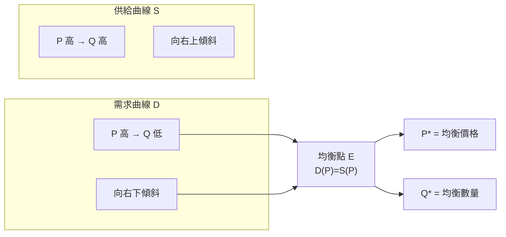
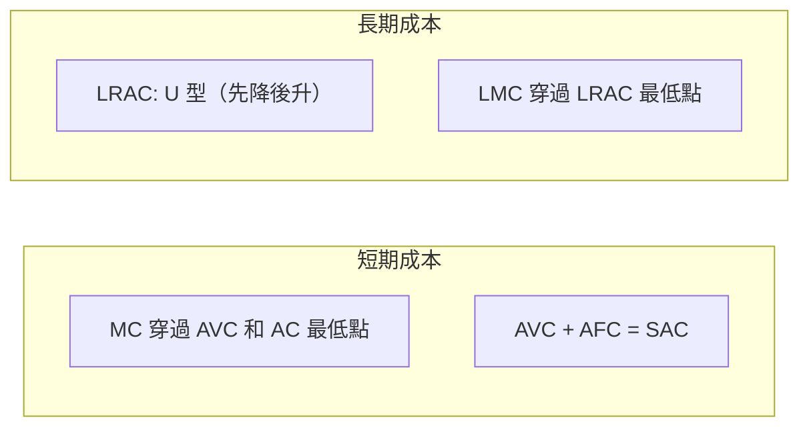
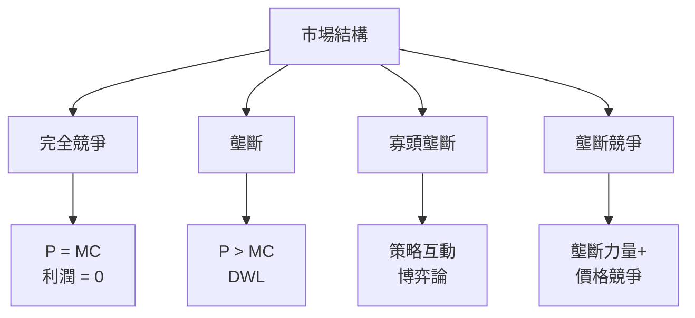
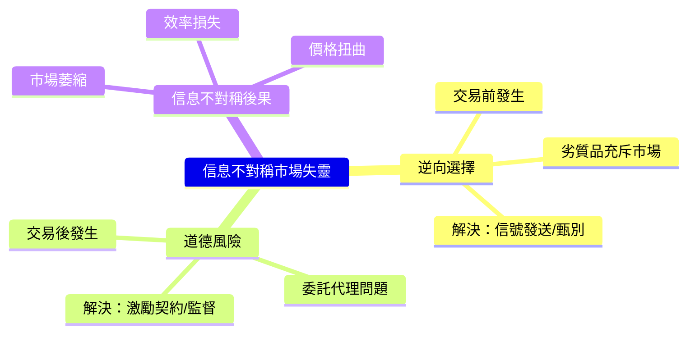
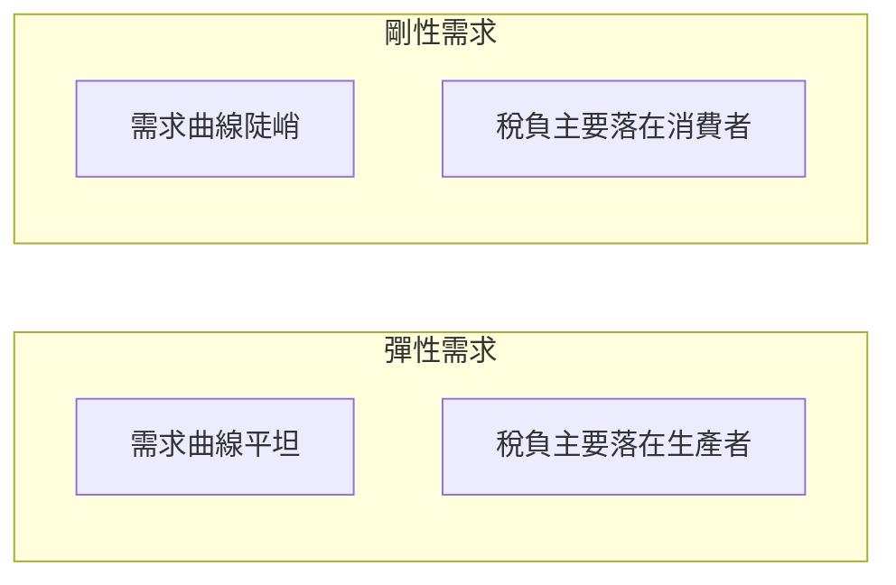
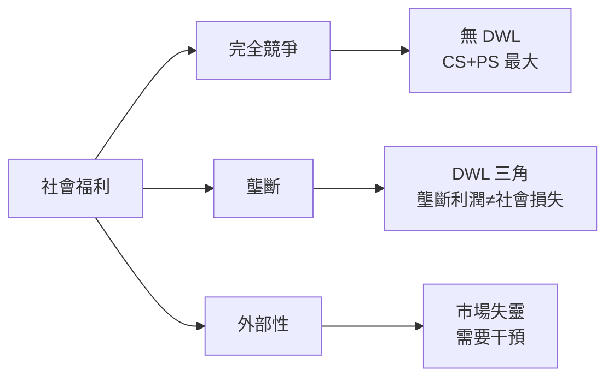
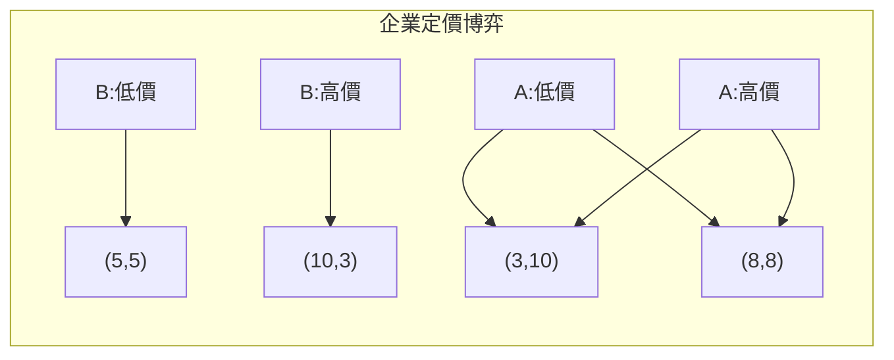

# DOTE1030 Economics for Business Studies I

**CUHK DOTE | Other Elective | 3 units**
**Stream**: Business / Management / All Streams

---

## Official Description

This course is a general introduction to the theory of price in a market economy. Topics include basic economic concepts, the theory of demand, production and cost, the operation of firms in competitive, oligopolistic and monopolistic markets, costs and benefits of government intervention in market economy, and introduction to game theory and informational economics. Analytical approach is used whenever appropriate. Applications on practical business problems are emphasized.

**Required Textbook**: Mankiw, N.G. (2024). *Principles of Economics* (Asian Edition), 10th ed. South-Western Cengage Learning.
**Reference**: Frank, R. & Bernanke, B. *Principles of Economics*, Asia Global Edition, McGraw-Hill.

---

## 問題 1：5 個核心心智模型

### 1. 供給與需求 (Supply and Demand)
**方程式 + 數字**：
- 需求定律：Q_d = a - b·P（斜率 b > 0，P 上升 → Q_d 下降）
- 供給定律：Q_s = c + d·P（斜率 d > 0，P 上升 → Q_s 上升）
- 均衡條件：Q_d = Q_s → P* = (a-c)/(b+d)，Q* = (ad-bc)/(b+d)
- 需求價格彈性：ε_d = (∂Q_d/∂P)·(P/Q_d) = -b·(P/Q_d)
- 交叉價格彈性：ε_xy = (∂Q_x/∂P_y)·(P_y/Q_x)
- 學者引用：Mankiw (2024), *Principles of Economics* Ch.3-4
- 應用：市場價格預測、政府政策效果分析

### 2. 消費者選擇理論 (Consumer Choice Theory)
**方程式 + 數字**：
- 預算約束：P_x·X + P_y·Y = I（收入 I 固定）
- 無差異曲線：U(X,Y) = 常數，邊際替代率 MRS = MU_x/MU_y
- 效用最大化：MU_x/P_x = MU_y/P_y（等邊際原則）
- 替代效應 + 收入效應：斯盧斯基分解 (Slutsky Decomposition)
- 學者引用：Mankiw (2024) Ch.5；Varian (2014), *Intermediate Microeconomics*
- 應用：消費者行為預測、價格變化影響分析

### 3. 生產者理論 — 成本與供給 (Production and Cost)
**方程式 + 數字**：
- 生產函數：Q = f(L, K)，邊際產品 MPL = ∂Q/∂L
- 邊際報酬遞減定律：MPL 隨 L 增加而下降
- 總成本：TC = TFC + TVC；平均成本 AC = TC/Q
- 邊際成本：MC = ∂TC/∂Q；在 MC 曲線上升段與 AC 最低點相交
- 機會成本：資源用於 A 而非 B 所放棄的最高價值
- 學者引用：Mankiw (2024) Ch.6-7
- 應用：企業供給決策、生產規模選擇

### 4. 市場結構分析 (Market Structure Analysis)
**方程式 + 數字**：
- 完全競爭：P = MC = MR，利潤 = (P - AC)·Q = 0（長期均衡）
- 壟斷：MR = P(1 + 1/ε)，價格 > 邊際成本，導致無謂損失 DWL
- 寡頭壟斷：Herfindahl 指數 HHI = Σ(s_i)²；HHI > 2500 = 高集中度
- 壟斷競爭：壟斷力量 + 價格競爭，Gini-Simpson 多樣化指數
- 學者引用：Mankiw (2024) Ch.15-18；Tirole (1988), *Theory of Industrial Organization*
- 應用：反壟斷政策、行業結構分析

### 5. 賽局理論基礎 (Game Theory Foundations)
**方程式 + 數字**：
- 納許均衡：每個玩家的策略是對其他玩家策略的最優反應
- 支付矩陣 (Payoff Matrix)：囚徒困境 → 納許均衡 = (坦白, 坦白)
- 混合策略均衡：玩家以概率 p 選 A，(1-p) 選 B
- 重複賽局：Trigger Strategy → 無限重複下卡特爾可維持
- 學者引用：Gibbons (1992), *Game Theory for Applied Economists*
- 應用：企業定價策略、投標競爭、談判分析

---

## 問題 2：3 個根本分歧

### 分歧 A：政府干預 vs. 自由市場

**自由市場派**（亞當·斯密《國富論》）：
- 「看不見的手」自動引導資源有效配置
- 政府干預造成無謂損失，扭曲市場信號
- 典型案例：價格上限 → 配給效率低、搜尋成本增加

**政府干預派**（凱恩斯宏觀）：
- 外部性、公共品、信息不對稱導致市場失靈
- 政府可修正外部性（庇古稅）、提供公共品
- 典型案例：碳稅修正氣候外部性、專利制度修正創新外部性

### 分歧 B：利潤最大化 vs. 利益相關者最大化

**利潤最大化**：弗里德曼觀點，企業的唯一社會責任是增加利潤
**利益相關者理論**：企業應平衡員工、客戶、社區、環保多方利益

### 分歧 C：完全競爭 vs. 壟斷效率

**完全競爭**：資源配置效率高，但創新激勵可能不足
**壟斷**：創新激勵強，但資源配置效率低，存在無謂損失

---

## 問題 3：10 個深度問題

1. 如果政府對某商品徵收從量稅，誰來承擔稅負？用供需彈性分析價格和數量變化。
2. 推導消費者剩餘和生產者剩餘，並說明價格上限政策如何影響社會福利。
3. 用等產量曲線和等成本線分析企業的要素替代決策。
4. 為什麼完全競爭市場中企業的供給曲線是 MC 曲線高於 AVC 的部分？
5. 比較壟斷、寡頭壟斷、壟斷競爭三種不完全市場的效率損失。
6. 什麼是「自然壟斷」？什麼是政府的價格管制政策？
7. 用賽局理論分析兩家企業的價格博弈，繪製支付矩陣並找出納許均衡。
8. 什麼是「逆向選擇」和「道德風險」？它們如何導致保險市場失靈？
9. 外部性如何用科斯定理（產權界定）來解決？其前提條件是什麼？
10. 用供需模型分析最低工資政策對勞動力市場的影響。

---

# 核心心智模型深化（中英對照）

## 1. 供需均衡與價格機制

### 1.1 供需均衡
- 均衡價格 P*：需求量等於供給量的價格
- 均衡數量 Q*：市場出清的數量
- 超額需求：Q_d > Q_s → 價格上升壓力
- 超額供給：Q_s > Q_d → 價格下降壓力

### 1.2 彈性分析
```
需求價格彈性：
ε_d = (dQ/dP) × (P/Q)

|ε_d| > 1：彈性需求（奢侈品）
|ε_d| < 1：剛性需求（必需品）
|ε_d| = 1：單一彈性

需求收入彈性：
ε_I = (dQ/dI) × (I/Q)
ε_I > 0：正常品；ε_I < 0：劣等品
```

### 1.3 消費者剩餘
- CS = 最大支付意願 - 實際支付
- CS = ∫₀^{Q*} D(P) dP - P*·Q*
- 市場 CS = 所有消費者剩餘之和

### 1.4 稅負歸宿
- 供需彈性決定稅負分配
- 需求相對剛性 → 消費者承擔較大份額
- 供給相對剛性 → 生產者承擔較大份額

### 1.5 圖解：供需均衡


---

## 2. 消費者行為理論

### 2.1 預算約束與效用最大化
```
消費者問題：
max U(X,Y)
s.t. P_x·X + P_y·Y ≤ I

一階條件：
MU_x/P_x = MU_y/P_y

含義：每元支出的邊際效用相等
```

### 2.2 替代效應與收入效應
```
價格下降（正常品）：
替代效應 → 該商品相對便宜 → Q 增加
收入效應 → 實際收入增加 → Q 增加（正常品）
總效應 = 替代效應 + 收入效應

價格下降（劣等品）：
替代效應 → Q 增加
收入效應 → Q 減少
總效應方向取決於哪個效應更大
```

### 2.3 顯示性偏好
- 若消費者選擇了束 (X₁,Y₁) 而非 (X₂,Y₂)，且 P₁X₁+P₁Y₁ = P₂X₂+P₂Y₂，則 (X₁,Y₁) 被顯示偏好於 (X₂,Y₂)

### 2.4 圖解：消費者均衡
```mermaid
graph LR
    subgraph Budget["預算線"]
        B1["P_x·X + P_y·Y = I"]
        B2["斜率 = -P_x/P_y"]
    end
    subgraph Indifference["無差異曲線"]
        I1["U₀: U(X,Y) = C₀"]
        I2["U₁ > U₀: 向右上移動"]
    end
    B1 -->|"切點", I1 --> E["均衡點 E*<br/>MRS = P_x/P_y"]
```

---

## 3. 生產與成本理論

### 3.1 生產函數與邊際產品
```
短期（K 固定）：
Q = f(L) = L^α · K^(1-α) [Cobb-Douglas]

邊際產品遞減：
MP_L = ∂Q/∂L = α·L^(α-1)·K^(1-α)
當 L 增加 → MP_L 下降（α < 1 時）
```

### 3.2 成本曲線關係
```
LRAC：長期平均成本（所有短期平均成本的下包絡線）
LMC：長期邊際成本

U 型 LRAC：
規模經濟（下降段）→ 規模不經濟（上升段）
最優規模：LRAC 最低點
```

### 3.3 機會成本與沉沒成本
- 機會成本：被放棄的次優選擇的價值
- 沉沒成本：已發生且不可收回的成本（理性決策應忽略）
- 邊際成本：每增加一單位產出所增加的成本

### 3.4 圖解：成本曲線


---

## 4. 市場結構與企業行為

### 4.1 四種市場結構比較
| 結構 | 企業數量 | 產品差異 | 進入壁壘 | 定價權 |
|------|---------|---------|---------|------|
| 完全競爭 | 很多 | 同質 | 無 | 無 |
| 壟斷競爭 | 很多 | 差異化 | 低 | 弱 |
| 寡頭壟斷 | 少數 | 可差異化 | 高 | 強 |
| 壟斷 | 一家 | 唯一產品 | 高 | 強 |

### 4.2 壟斷定價
```
利潤最大化：MR = MC
MR = P(1 + 1/ε)
P = MC/(1 + 1/ε)

 Lerner 指數：L = (P-MC)/P = 1/|ε|
→ 測量市場力量
```

### 4.3 寡頭博弈
- Bertrand 競爭（同質產品）：價格 = MC
- Cournot 競爭（數量競爭）：古諾均衡
- Stackelberg 領導者-追隨者模型

### 4.4 圖解：市場結構


---

## 5. 賽局理論與信息經濟學

### 5.1 經典賽局
**囚徒困境**：
|  | 坦白 | 保持沉默 |
|--|------|---------|
| **坦白** | (-5,-5) | (-1,-10) |
| **保持沉默** | (-10,-1) | (-2,-2) |

納許均衡：(坦白, 坦白) → 集體次優

### 5.2 拍賣理論
- 最高價拍賣（First-price）：策略性投標
- 維克里拍賣（Second-price）：说实话是 Dominant Strategy
- 共同價值拍賣：赢家诅咒（Winner's Curse）

### 5.3 信息不對稱
- 逆向選擇：交易前信息不對稱（劣幣驅逐良幣）
- 道德風險：交易後信息不對稱（委託代理問題）
- 信號發送：Spence (1973) 教育信號模型
- 信息甄別：保險市場篩選機制

### 5.4 圖解：信息經濟學


---

## 深度自測問題詳解

**Q1**: 政府徵收 $1/單位從量稅，誰承擔？
```
設供需曲線：D: Q_d = 100 - P；S: Q_s = P
均衡：P* = 50, Q* = 50

徵稅後：
D: Q_d = 100 - P_d
S: Q_s = P_s - 1
均衡：P_d = P_s + 1
100 - P_d = P_s - 1
100 - (P_s+1) = P_s - 1
99 - P_s = P_s - 1
2P_s = 100
P_s = 50, P_d = 51, Q = 49

消費者承擔：1 × (50-49)/1 = $1? 實際分析：
消費者支付 P_d=51（原本50），多付 $1 中的 $1 完全由消費者承擔
（供需彈性決定最終分擔比例）
```

**Q4**: 完全競爭企業供給曲線
```
利潤最大化條件：P = MC

當 P < AVC_min：企業停止生產（不生產時損失 = TFC，生產時損失 ≥ TFC+AVC）
當 P ≥ AVC_min：企業在 P = MC 處生產

因此供給曲線 = MC 曲線在 AVC_min 以上部分
短期固定成本為沉沒成本，不影響供給決策
```

**Q7**: 價格博弈納許均衡
```
企業 A 和 B 定價：
|      | B 低價 | B 高價 |
|------|--------|--------|
| A 低價 | (5,5) | (10,3) |
| A 高價 | (3,10) | (8,8) |

納許均衡：(A低,B低) = (5,5)
分析：A選低價：5 > 8（低價是最優反應）
     B選低價：5 > 3（低價是最優反應）
→ 囚徒困境：兩家都不願意先抬價
```

---

## 📊 Mermaid 圖解

### 圖 1：稅負歸宿與供需彈性


### 圖 2：市場結構效率


### 圖 3：成本曲線關係
```mermaid
graph LR
    S["產量"] --> MC["MC"]
    MC --> AC["AC"]
    AC --> AVC["AVC"]
    MC -.->|"MC穿過<br/>AC/AVC<br/>最低點", MinPoint
```

### 圖 4：賽局支付矩陣


### 圖 5：價格管制效果
```mermaid
graph LR
    A["價格上限 P_max"] --> B{P_max > P*?}
    B -->|"是|", C["無約束"]
    B -->|"否|", D["P* → P_max"]
    D --> E["Q_s 減少"]
    E --> F["配給問題<br/>黑市出現"]
```

---

## 總結

DOTE1030 是微觀經濟學的核心課程，建立價格理論的完整框架。5 個核心心智模型構成理解市場運作的完整工具箱：

1. **供需均衡** → 理解價格形成機制和市場出清
2. **消費者選擇** → 理解需求曲線背後的行為動機
3. **生產者理論** → 理解企業供給決策的經濟邏輯
4. **市場結構** → 理解現實市場的多元形態和效率後果
5. **賽局理論** → 理解策略互動和信息不對稱

對智慧機器人工程而言，微觀經濟學提供了**市場分析**（機器人產品定價）、**成本結構**（製造業經濟規模）、**技術創新市場**（專利制度的激勵效果）以及**談判和博弈**（商業談判中的策略思維）等直接應用的理論框架。

**核心 Reference**：
- Mankiw, N.G. (2024). *Principles of Economics*. 10th ed. Cengage Learning.
- Varian, H.R. (2014). *Intermediate Microeconomics*. 9th ed. Norton.
- Tirole, J. (1988). *The Theory of Industrial Organization*. MIT Press.
- Gibbons, R. (1992). *Game Theory for Applied Economists*. Princeton UP.
