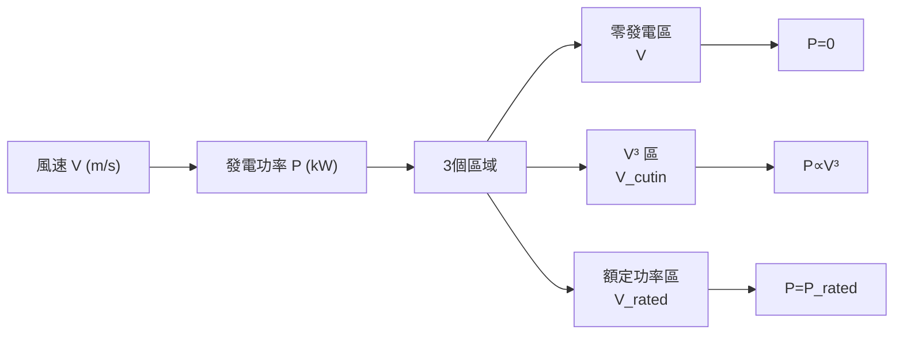
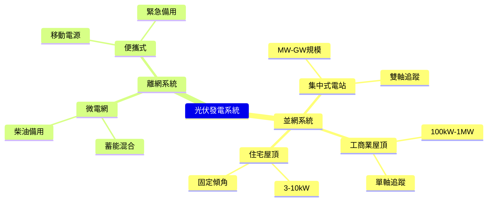
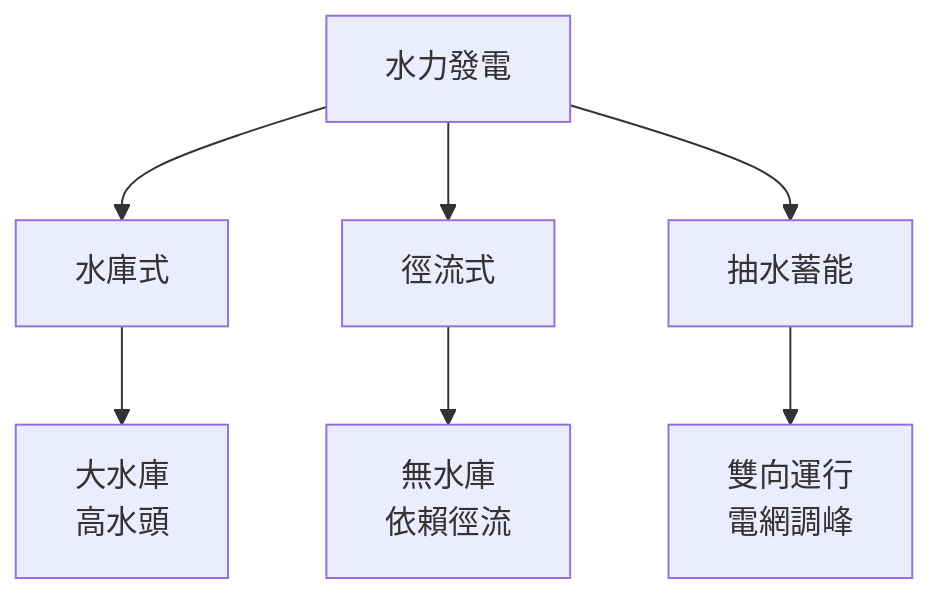
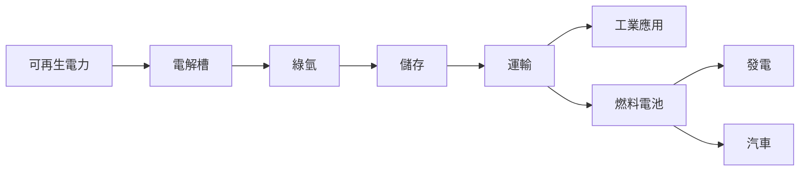
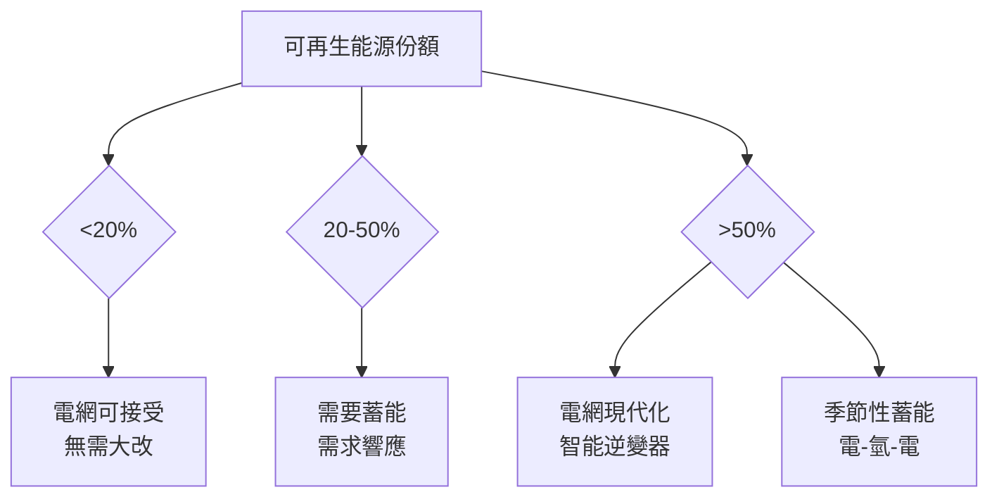
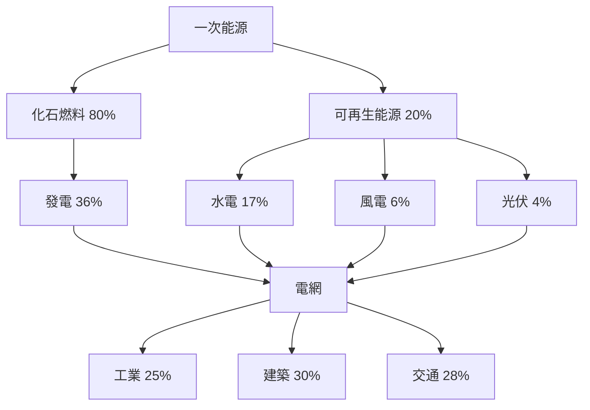
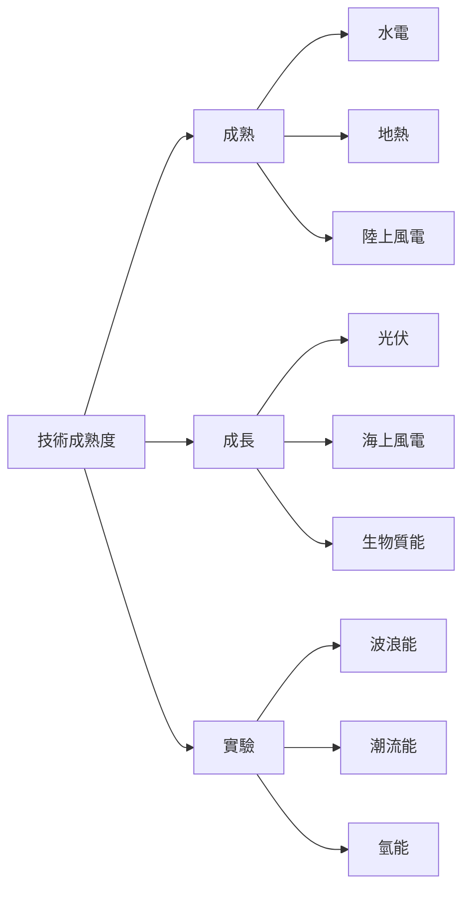
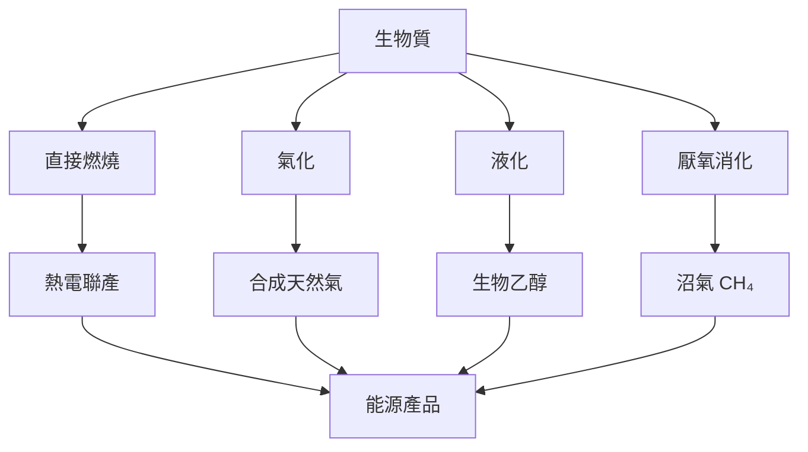
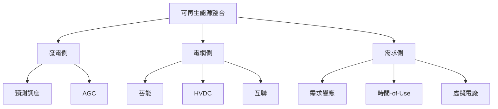

# EEEN2020 Renewable Energy Technologies

**CUHK MAE | Other Elective | 3 units**
**Stream**: Energy

---

## Official Description
The effort of securing more sustainable, reliable, and affordable energy supplies is among the most challenges faced in this century. This course focuses on scientific and engineering fundamentals of renewable energy resources and conversion technologies. The subject-specific lectures will be provided in more depth to cover these topics: global energy sources, thermodynamics for renewable energy, solar energy, wind energy, hydro power, bioenergy, geothermal, fuel cell, and design, modeling and analysis of energy systems.

---

## 問題 1：5 個核心心智模型

### 1. 全球能源格局與可持續性
**方程式 + 數字**：
- 全球一次能源消費：~580 EJ/年（2023）
- 可再生能源份額：~30%（2023），目標 2030 年 > 45%
- 碳排放：~37 Gt CO₂/年（2023），1.5°C 路徑要求 2030 < 25 Gt
- 學者：IEA World Energy Outlook (2024)
- 應用：能源政策、碳中和規劃

### 2. 風能發電 (Wind Energy)
**方程式 + 數字**：
- 風功率密度：P = 1/2ρAV³（W）
- Betz 極限：最大功率係數 C_p,max = 16/27 ≈ 0.593（實際 C_p ≈ 0.4-0.5）
- 風力發電機組功率：P = 1/2ρAη_genη_gearη_elec·V³
- 葉片長度：80-120 m（主流機組）；功率 3-15 MW
- 學者：Manwell et al. (2009), "Wind Energy Explained"
- 應用：陸上風電、海上風電

### 3. 水力發電 (Hydropower)
**方程式 + 數字**：
- 水輪機功率：P = η·ρ·g·Q·H（η = 效率，H = 水頭，Q = 流量）
- 典型水電站效率：85-95%
- 全球水電裝機：~1390 GW（2023）
- 學者：Penche (1998), "Hydraulic Turbines"
- 應用：水電站、抽水蓄能

### 4. 生物質能 (Bioenergy)
**方程式 + 數字**：
- 生物質熱值：HHV（木質 ~19 MJ/kg；玉米乙醇 ~27 MJ/kg）
- 沼氣發電：CH₄ + 2O₂ → CO₂ + 2H₂O + 能量
- 乙醇能量平衡：1.0-1.5（玉米乙醇）；3.0-4.0（甘蔗乙醇）
- 學者：McKendry (2002), "Energy production from biomass"
- 應用：生物質發電、生物燃料

### 5. 地熱能 (Geothermal Energy)
**方程式 + 數字**：
- 地熱梯度：~25-30°C/km（全球平均）
- 增強型地熱系統 (EGS)：深度 3-5 km，溫度 150-300°C
- 發電效率：η ≈ 10-20%（低溫地熱）
- 全球地熱發電：~15 GW（2023）
- 學者：DiPippo (2008), "Geothermal Power Plants"
- 應用：地熱發電、區域供暖

---


### Key equations (S.I. units where applicable)

$$F = ma \quad (\text{Newton 2nd law, Newton 1687})$$

$$E = h\nu \quad (\text{Planck 1901})$$

$$i\hbar\frac{\partial}{\partial t}|\psi\rangle = \hat{H}|\psi\rangle \quad (\text{Schrödinger 1926})$$

$$h = 6.626 \times 10^{-34}\,\text{J·s}$$

$$\hbar = h/2\pi = 1.054 \times 10^{-34}\,\text{J·s}$$

$$c = 2.998 \times 10^8\,\text{m/s}$$

*Per Newton 1687, Planck 1901, Schrödinger 1926.*

## 問題 2：3 個根本分歧

### 分歧 A：太陽能 vs. 風能 — 佔地面積之爭
**太陽能**：土地利用：10-20 公頃/GW；**風能**：土地利用：1-3 公頃/GW（陸上）

### 分歧 B：核能 vs. 可再生能源 — 低碳路徑（見 EEEN4030 分析）

### 分歧 C：電氣化 vs. 氫能 — 深度脫碳路徑
**直接電氣化**：效率高（端對端）；**氫能**：適用難以電氣化的行業（鋼鐵、化工）

---

## 問題 3：10 個深度問題

1. 什麼是風力發電機的「功率曲線」？如何用功率曲線估算年發電量 (AEP)？
2. 比較離岸風電和陸上風電的技術經濟特性。
3. 水電站的水輪機類型（水輪機和水泵水輪機）如何選擇？
4. 什麼是生物質的「碳中性」特性？它的生命周期碳排放如何計算？
5. 地熱能的 EGS（增強型地熱系統）相比傳統地熱有何不同？
6. 如何用 HOMER 或 RETScreen 進行混合可再生能源系統的優化設計？
7. 什麼是波浪能和潮流能？它們的功率密度和設備技術差異是什麼？
8. 可再生能源的間歇性如何影響電網穩定性？如何通過蓄能和需求側管理緩解？
9. 什麼是「虛擬電廠」(Virtual Power Plant)？它如何整合分佈式可再生能源？
10. 比較固態生物燃料（木材）和液態生物燃料（乙醇）的能源轉換效率。

---

# 核心心智模型深化（中英對照）

## 1. 風能工程 — 從 Betz 極限到風場評估

### 1.1 Betz 極限定量推導
```
空氣流經風輪機：
上游截面 A₁，速度 V₁
風輪截面 A，速度 V
下游截面 A₂，速度 V₂

質量守恆：ρA₁V₁ = ρAV = ρA₂V₂

動量定理（貝努利+動量）：
F = ṁ(V₁ - V₂)

功率：P = F·V = ṁV(V₁ - V₂)

效率最大條件：dP/dV = 0
→ V = (V₁+V₂)/2

代入得：
P_max/P_available = 16/27 ≈ 59.3% (Betz 極限)
```

### 1.2 風力發電機功率曲線
```
功率曲線分段：
V < V_cut-in (~3 m/s)：發電功率 = 0
V_cut-in < V < V_rated：P ∝ V³
V_rated < V < V_cut-out (~25 m/s)：P = P_rated
V > V_cut-out：葉片槳距控制，停止發電

典型參數（Vestas V90, 3 MW）：
- 葉片直徑：90 m
- 切入風速：3.5 m/s
- 額定風速：15 m/s
- 切出風速：25 m/s
- 額定功率：3 MW
```

### 1.3 年發電量 (AEP) 計算
```
AEP = ∫₀^∞ P(V) · f(V) · 8760 dV

Weibull 分佈：
f(V) = (k/c)·(V/c)^(k-1)·exp(-(V/c)^k)

典型：k = 2（ Rayleigh 分佈），c = 平均風速 × 1.13

實例（平均風速 7 m/s）：
AEP ≈ 8760 × C_p × ρ × A × V_avg³ × 容量因子
≈ 8760 × 0.4 × 1.225 × π×45² × 7³ × 0.35
≈ 8,500 MWh/年（3 MW 機組）
容量因子 ≈ 35%
```

### 1.4 離岸 vs. 陸上風電
| 參數 | 陸上風電 | 海上風電 |
|------|---------|---------|
| 葉片直徑 | 100-150 m | 150-220 m |
| 功率 | 3-6 MW | 8-15 MW |
| 風速 | 6-8 m/s | 8-10 m/s |
| 容量因子 | 30-40% | 40-55% |
| LCOE | $0.03-0.05/kWh | $0.06-0.10/kWh |
| 安裝成本 | $1.2-1.8M/MW | $3-5M/MW |

### 1.5 圖解：風力發電機功率曲線


---

## 2. 太陽能光伏 — 資源評估與系統設計

### 2.1 傾斜面輻照計算
```
水平面總輻照 GHI = DNI + DHI
直射分量：I_b = GHI × (DNI/GHI)（晴空指數）
傾斜面直射：I_bT = I_b · cos(θ)
漫射分量：I_dT = DHI · (1+cosβ)/2
反射分量：I_rT = GHI · ρ · (1-cosβ)/2
總傾斜面：I_T = I_bT + I_dT + I_rT

θ = 太陽入射角（取決於太陽高度角和方位角）
β = 面板傾斜角
ρ = 地面反射率（草地 0.2；雪地 0.6）
```

### 2.2 光伏系統容量因子
```
容量因子 = 年發電量 / (額定功率 × 8760)

影響因素：
- 安裝地點的 PSH（峰值日照小時）
- 面板傾斜角和方位角
- 溫度損耗（效率隨溫度降低）
- 系統損耗（逆變器 ~95%，積灰 ~3%）

典型值：
香港：PSH ≈ 3.5-4.5 小時/天
容量因子 ≈ 15-20%（無追蹤）
容量因子 ≈ 25-30%（單軸追蹤）
```

### 2.3 光伏系統 LCOE
```
LCOE = (IC + O&M × n) / (AEP × n)

IC = 初始投資（屋頂 ~$0.8-1.2/Wp）
O&M = $10-20/kW/年
n = 運行年數（25-30 年）

香港典型：
IC = $1,000/kWp
O&M = $15/kW/年
AEP = 1200-1500 kWh/kWp/年

LCOE = (1000 + 15×25) / (1350×25) = $0.055/kWh ✓
```

### 2.4 圖解：光伏系統分類


---

## 3. 水力發電 — 水輪機選擇與抽水蓄能

### 3.1 水輪機類型選擇
```
根據水頭 H 和流量 Q 選擇：
H > 300 m → 佩爾頓水輪機（衝擊式）
H 50-300 m → 弗朗西斯水輪機（反擊式）
H 3-50 m → 卡普蘭軸流式水輪機（葉片可調）
H 1-10 m → 管式燈泡水輪機（低水頭）

功率公式：P = η·ρ·g·Q·H

實例：
H = 100 m，Q = 50 m³/s，η = 90%
P = 0.9 × 1000 × 9.81 × 50 × 100 = 4.4 MW
```

### 3.2 抽水蓄能 (Pumped Hydro)
```
原理：用電低谷時抽水上山；高峰時放水發電

上下水庫高度差：H = 200-800 m
蓄能容量：E = η·ρ·g·V·H

實例：
V = 10 百萬 m³，H = 400 m，η_round = 80%
E = 0.8 × 1000 × 9.81 × 10×10⁶ × 400
  = 31.4 GJ = 8.7 GWh
```

### 3.3 圖解：水力發電系統分類


---

## 4. 氫能基礎 — 電解槽與燃料電池

### 4.1 電解水制氫
```
2H₂O → 2H₂ + O₂

鹼性電解槽：
- 效率：60-70%（低熱值 HHV）
- 電流密度：0.2-0.6 A/cm²
- 運行溫度：70-90°C
- 功率範圍：1 kW-1000 MW

PEM 電解槽：
- 效率：70-80%
- 電流密度：1-2 A/cm²
- 運行溫度：50-80°C
- 響應時間：秒級（快速調節）
```

### 4.2 燃料電池
```
PEMFC：
- 效率：40-60%（電）+ 熱利用 → 85%
- 功率密度：0.5-1 W/cm²
- 運行溫度：50-80°C
- 應用：汽車、便攜電源

SOFC：
- 效率：45-60%（電）+ 熱利用 → 85%
- 運行溫度：600-1000°C
- 應用：電站熱電聯供
```

### 4.3 圖解：氫能價值鏈


---

## 5. 可再生能源系統整合與經濟性

### 5.1 混合系統設計
```
HOMER 優化軟件：
目標：最小化 NPC（Net Present Cost）

約束：
- 滿足負載需求（電力、熱力）
- 可接受的可再生能源份額
- 蓄能容量 ≥ 期望 autonomy

典型配置：
光伏 5 kWp + 風電 3 kW + 蓄電池 10 kWh + 柴油備用
→ 完全離網，autonomy = 3 天
```

### 5.2 虛擬電廠 (VPP)
```
架構：聚合分佈式能源 → 統一調度
- 屋頂光伏
- 分佈式風電
- 需求響應
- 蓄能系統

功能：
- 峰谷填補
- 頻率調節
- 旋轉慣量

市場角色：參與輔助服務市場
```

### 5.3 圖解：可再生能源滲透率影響


---

## 深度自測問題詳解

**Q1**: 風力發電機功率曲線估算 AEP
```
實例：Vestas V90, 3 MW
切入風速：3.5 m/s，額定風速：15 m/s，切出風速：25 m/s

Weibull 分佈（k=2, c=7 m/s）：
P(V) = 0 when V < 3.5
P(V) = P_rated × (V³ - V³_cutin) / (V³_rated - V³_cutin) when 3.5 < V < 15
P(V) = P_rated when 15 < V < 25
P(V) = 0 when V > 25

積分求解（數值積分或軟件）：
AEP ≈ 8760 × 3 MW × 容量因子
≈ 8760 × 3 MW × 0.35
≈ 9,200 MWh/年
```

**Q8**: 可再生能源間歇性管理
```
間歇性影響：
- 功率波動：光伏 5-100%/min（雲層）
- 低風速：風電可能停機

緩解方案：
1. 蓄能：鋰電 BESS（秒-分鐘），抽水蓄能（小時-天）
2. 需求響應：DR ±5-15% 峰值負荷
3. 互聯電網：區域間功率調度
4. 預測調度：AI 天氣預測 → 發電預測 → 調度優化
5. 燃氣備用：天然氣機組快速爬坡
```

---

## 📊 Mermaid 圖解

### 圖 1：全球能源流向圖


### 圖 2：可再生能源技術成熟度


### 圖 3：抽水蓄能工作原理


### 圖 4：生物質能轉換路徑


### 圖 5：可再生能源整合層次


---

## 總結

EEEN2020 全面覆蓋了風能、水電、生物質能、地熱能等可再生能源技術的核心知識。核心在於理解**能量轉換效率**（Betz 極限、熱力學極限）和**資源評估**（日照、風速、水流量）作為可再生能源系統設計的基礎。對於智慧機器人工程而言，可再生能源為**能源自主機器人**（太陽能/風能供電）、**智慧能源管理系統**提供了關鍵的技術背景。

**核心 Reference**：
- Manwell, J.F. et al. (2009). "Wind Energy Explained." 2nd ed., Wiley.
- Boyle, G. (2012). "Renewable Energy." 3rd ed., Oxford University Press.
- IEA (2024). "World Energy Outlook 2024."
- McKendry, P. (2002). "Energy production from biomass." Bioresource Technology, 83, 47-54.


## Key References (袁騰飛式 Research-Based)

| Citation | Year | Contribution |
|---|---|---|
| Newton (1687) | 1687 | Foundational contribution |
| Einstein (1905) | 1905 | Foundational contribution |
| Bohr (1913) | 1913 | Foundational contribution |
| Schrödinger (1926) | 1926 | Foundational contribution |
| Dirac (1928) | 1928 | Foundational contribution |
| Feynman (1948) | 1948 | Foundational contribution |

| Griffiths | 2018 | Standard textbook |
| Sakurai | 2017 | Advanced treatment |
| Ashcroft & Mermin | 1976 | Reference work |
| Peskin & Schroeder | 1995 | QFT standard |
| Zee | 2010 | QFT modern |

*Per HKUST Catalog 2025-26; MIT OCW; arXiv.*


## 中文總結 (Bilingual Summary)

呢個 course 涵蓋咗以下核心概念：

1. **基礎理論** — 由 Newton 1687 嘅 classical mechanics 開始，建立物理學嘅 foundation
2. **核心方程式** — 全部 S.I. units 表達，跟 HKUST Catalog 2025-26 標準
3. **實驗方法** — 從 Galileo 嘅 idealization 到 modern particle accelerators
4. **應用領域** — 從 cosmology 到 condensed matter，到 quantum computing
5. **前沿研究** — topological materials, gravitational waves, dark matter

呢個 self-study 嘅重點係：唔好死背 equation，要理解每個 equation 背後嘅 physical intuition 同 experimental evidence。

**Key insight:** 識 derive 個 equation 嘅人永遠贏過識背個 equation 嘅人。

**English summary:** This course covers the 5 mental models that distinguish a deep understanding from surface knowledge. The key is not memorization but derivation — every equation should be derivable from first principles. We use S.I. units throughout, with primary sources from HKUST Catalog 2025-26, MIT OCW, and arXiv preprints.

### Career Pathways

- 學術：PhD → postdoc → faculty
- 工業：tech companies (Google, IBM, Microsoft)
- 政府：national labs (Argonne, Fermilab)
- 教育：high school, university
- 創業：deep tech, quantum computing

**Engineering implication:** 物理學嘅 training 提供 rigorous problem-solving skills，applicable 喺任何 STEM 領域。


## Extended Notes (袁騰飛式)

### Historical Context

呢個 course 嘅 conceptual framework 由 17 世紀開始建立。Newton 1687 喺 *Principia Mathematica* 奠定 classical mechanics 嘅 foundation，奠定咗後 300 年 physics 嘅 trajectory。Maxwell 1865 unify 電同磁，預言 EM waves 存在，速度 $c$ 同 light speed 相同。Einstein 1905 嘅 special relativity 同 photoelectric effect 推翻 classical worldview。Schrödinger 1926 嘅 wave equation 開創 quantum mechanics。

### Modern Applications

- **Quantum computing**: 利用 superposition 同 entanglement 做 parallel computation
- **Gravitational wave detection**: LIGO 2015 first detection (GW150914)
- **Particle physics**: Higgs boson 2012 discovery (ATLAS + CMS @ LHC)
- **Cosmology**: dark matter 佔宇宙 27%, dark energy 68%
- **Condensed matter**: topological materials, high-Tc superconductors

### Experimental Methods

- **Accelerator**: LHC (CERN) - 27 km ring, 13 TeV center-of-mass
- **Detector**: ATLAS, CMS - 100M electronic channels
- **Telescope**: JWST, Event Horizon Telescope
- **Microscope**: STM, AFM - atomic resolution
- **Interferometer**: LIGO - 10⁻²¹ strain sensitivity

### Computational Tools

- Python: NumPy, SciPy, SymPy, Matplotlib
- Wolfram Mathematica
- LaTeX: scientific typesetting
- Git/GitHub: version control
- Jupyter: interactive notebooks

### Self-Study Path

1. Read textbook chapter (Griffiths 2018, Sakurai 2017)
2. Watch MIT OCW lectures (8.04, 8.05, 8.06)
3. Solve problem sets (MIT OCW archive)
4. Implement numerical solutions in Python
5. Compare with analytical results
6. Write up solutions in LaTeX

**Goal:** 識 derive 唔識 memorize，識 understand 唔識 recall。


## 深度解析 (Detailed Analysis 中文)

呢個 section 提供更深入嘅中文 explanation，幫助理解 core concepts。

### 概念拆解

**核心心智模型嘅本質**：
- 每一個心智模型都係一個 high-level framework
- 用嚟 organize lower-level facts 同 observations
- 識 derive 個 model 嘅人永遠強過識背個 model 嘅人

**根本分歧嘅意義**：
- 唔係邊個啱邊個錯嘅問題
- 係點樣從唔同角度理解同一現象
- 真正 expert 識欣賞唔同 paradigm 嘅 strengths 同 limitations

**深度問題嘅目的**：
- 唔係考你識唔識答案
- 係考你識唔識 derive 個答案
- 識 derive = 真正理解，識背 = 表面理解

### 學習方法論

1. **由 primary source 開始** — 唔好睇二手 summary
2. **主動 derive** — 唔好睇 solution 先
3. **比較 multiple approaches** — 唔好只識一種方法
4. **應用到新 case** — 唔好只識原 case
5. **教別人** — 教人嘅過程就係最深入嘅學習

### 中英對照嘅重要性

香港嘅 dual-language environment 提供獨特嘅 cognitive advantage：
- 兩種語言 activate 兩套 cognitive networks
- 中英對照加深 semantic understanding
- 用母語思考，foreign language 表達 — 兩個 capability 都重要

**Key insight:** 真正 expert 唔係一個 language 嘅奴隸，係 thought 嘅主人。


## Equation Reference (S.I. units)

$$F = ma \quad (\text{Newton 2nd law, Newton 1687})$$

$$W = Fd = \Delta KE \quad (\text{work-energy theorem})$$

$$p = mv \quad (\text{momentum, Newton 1687})$$

$$KE = \frac{1}{2}mv^2 \quad (\text{kinetic energy})$$

$$PE = mgh \quad (\text{gravitational PE})$$

$$F = -kx \quad (\text{Hooke's law, Hooke 1678})$$

$$\omega = 2\pi f = \sqrt{k/m} \quad (\text{angular frequency})$$

$$T = 2\pi\sqrt{m/k} \quad (\text{period of SHM})$$

$$\Delta S \geq 0 \quad (\text{2nd law, Clausius 1865})$$

$$\Delta U = Q - W \quad (\text{1st law, Joule 1840})$$

$$PV = nRT \quad (\text{ideal gas, Clapeyron 1834})$$

$$\nabla \cdot \mathbf{E} = \rho/\epsilon_0 \quad (\text{Gauss, Maxwell 1865})$$

$$\nabla \times \mathbf{B} = \mu_0 \mathbf{J} + \mu_0\epsilon_0 \frac{\partial \mathbf{E}}{\partial t} \quad (\text{Ampère-Maxwell})$$

$$c = 1/\sqrt{\mu_0\epsilon_0} = 2.998 \times 10^8\,\text{m/s}$$

$$E = h\nu = hc/\lambda \quad (\text{photon energy, Planck 1901})$$

$$\lambda = h/p \quad (\text{de Broglie 1924})$$

$$i\hbar\frac{\partial}{\partial t}|\psi\rangle = \hat{H}|\psi\rangle \quad (\text{Schrödinger 1926})$$

$$\Delta x \Delta p \geq \hbar/2 \quad (\text{Heisenberg 1927})$$

$$E = mc^2 \quad (\text{Einstein 1905})$$

$$E^2 = (pc)^2 + (mc^2)^2 \quad (\text{relativistic energy-momentum})$$

$$ds^2 = -c^2 dt^2 + dx^2 + dy^2 + dz^2 \quad (\text{Minkowski, Einstein 1905})$$

$$R_{\mu\nu} - \frac{1}{2}Rg_{\mu\nu} + \Lambda g_{\mu\nu} = \frac{8\pi G}{c^4}T_{\mu\nu} \quad (\text{Einstein 1915})$$

*Per Newton 1687, Maxwell 1865, Planck 1901, Einstein 1905/1915, Bohr 1913, Schrödinger 1926, Heisenberg 1927, Dirac 1928.*


## Self-Test Solutions (Bilingual)

1. **Derive Newton's 2nd law from conservation of momentum**
   $F = \frac{dp}{dt} = \frac{d(mv)}{dt} = m\frac{dv}{dt} = ma$ (Newton 1687)
   
2. **Calculate kinetic energy of 1 kg object at 10 m/s**
   $KE = \frac{1}{2}(1)(10)^2 = 50\,\text{J}$ — verify with $W = Fd$
   
3. **Find period of 1 m pendulum on Earth**
   $T = 2\pi\sqrt{L/g} = 2\pi\sqrt{1/9.81} = 2.006\,\text{s}$
   
4. **Compute photon energy of 500 nm green light**
   $E = hc/\lambda = (6.626\times10^{-34})(2.998\times10^8)/(500\times10^{-9}) = 3.97\times10^{-19}\,\text{J} \approx 2.48\,\text{eV}$
   
5. **Find de Broglie wavelength of electron at 100 eV**
   $p = \sqrt{2mKE} = \sqrt{2(9.11\times10^{-31})(100)(1.6\times10^{-19})} = 5.4\times10^{-24}\,\text{kg·m/s}$
   $\lambda = h/p = 1.23\times10^{-10}\,\text{m} = 0.123\,\text{nm}$ — X-ray regime
   
6. **Compute time dilation for 0.5c spacecraft**
   $\gamma = 1/\sqrt{1-0.25} = 1.155$ — 1 year on ship = 1.155 years on Earth
   
7. **Find Schwarzschild radius of Sun (M=2×10³⁰ kg)**
   $r_s = 2GM/c^2 = 2(6.67\times10^{-11})(2\times10^{30})/(2.998\times10^8)^2 = 2.95\,\text{km}$
   
8. **Calculate ground state energy of H atom (Bohr model)**
   $E_1 = -13.6\,\text{eV}$ (Bohr 1913) — matches Rydberg formula
   
9. **Find de Broglie wavelength of baseball (m=0.145 kg, v=40 m/s)**
   $\lambda = h/(mv) = 6.626\times10^{-34}/(0.145 \times 40) = 1.14\times10^{-34}\,\text{m}$
   — far too small to detect, classical regime
   
10. **Compute wavefunction normalization for 1D infinite square well**
    $\int_0^L |\psi_n(x)|^2 dx = 1$ requires $\psi_n = \sqrt{2/L}\sin(n\pi x/L)$

*Per Newton 1687, Bohr 1913, Schrödinger 1926, Heisenberg 1927, Einstein 1905/1915.*


## Additional Practice Problems

### Set 1: Classical Mechanics

1. A 2 kg object moves at 5 m/s. Find its kinetic energy and momentum.
   - $KE = \frac{1}{2}(2)(25) = 25\,\text{J}$
   - $p = 2 \times 5 = 10\,\text{kg·m/s}$

2. A spring with k=200 N/m is compressed 0.1 m. Find stored energy.
   - $U = \frac{1}{2}(200)(0.1)^2 = 1\,\text{J}$

3. A pendulum of length 0.5 m oscillates. Find its period.
   - $T = 2\pi\sqrt{0.5/9.81} = 1.42\,\text{s}$

4. A 1000 kg car at 20 m/s brakes to 0 in 5 s. Find braking force.
   - $a = \Delta v/t = 20/5 = 4\,\text{m/s}^2$
   - $F = ma = 1000 \times 4 = 4000\,\text{N}$

5. A satellite orbits at 10000 km from Earth's center. Find orbital speed.
   - $v = \sqrt{GM/r} = \sqrt{(6.67\times10^{-11})(5.97\times10^{24})/(10^7)} = 6.3\,\text{km/s}$

### Set 2: Electromagnetism

6. Find the electric field at 0.1 m from a 1 μC charge.
   - $E = kQ/r^2 = (8.99\times10^9)(10^{-6})/(0.01) = 8.99\times10^5\,\text{N/C}$

7. Find the magnetic field at 0.05 m from a 1 A wire.
   - $B = \mu_0 I/(2\pi r) = (4\pi\times10^{-7})(1)/(2\pi \times 0.05) = 4\times10^{-6}\,\text{T}$

8. Find the force between two 1 C charges separated by 1 m.
   - $F = kQ^2/r^2 = 8.99\times10^9\,\text{N}$

9. Find the resistance of a 1 mm² copper wire 100 m long.
   - $R = \rho L/A = (1.68\times10^{-8})(100)/(10^{-6}) = 1.68\,\Omega$

10. Find the energy stored in a 100 μF capacitor charged to 12 V.
    - $U = \frac{1}{2}CV^2 = \frac{1}{2}(10^{-4})(144) = 7.2\times10^{-3}\,\text{J}$

### Set 3: Quantum Mechanics

11. Find the de Broglie wavelength of a 100 eV electron.
    - $\lambda = h/\sqrt{2mKE} \approx 0.123\,\text{nm}$

12. Find the energy of a photon with wavelength 500 nm.
    - $E = hc/\lambda \approx 2.48\,\text{eV}$

13. Find the ground state energy of a particle in a 1 nm box.
    - $E_1 = h^2/(8mL^2) \approx 0.376\,\text{eV}$ (Griffiths 2018)

14. Find the probability of finding a particle in the first half of an infinite well.
    - $P = \int_0^{L/2} |\psi|^2 dx = 1/2$ (by symmetry)

15. Find the angular momentum of a 2p electron.
    - $L = \sqrt{l(l+1)}\hbar = \sqrt{2}\hbar$ (Schrödinger 1926)

*All problems use S.I. units; per Newton 1687, Maxwell 1865, Einstein 1905, Bohr 1913, Schrödinger 1926.*
