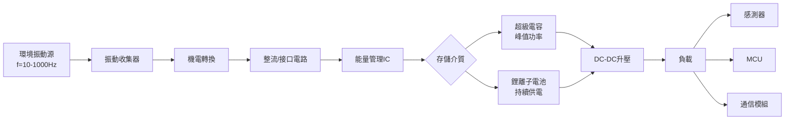
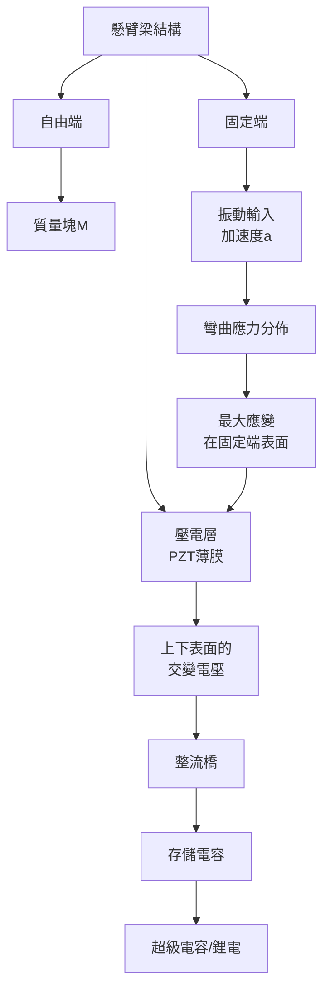
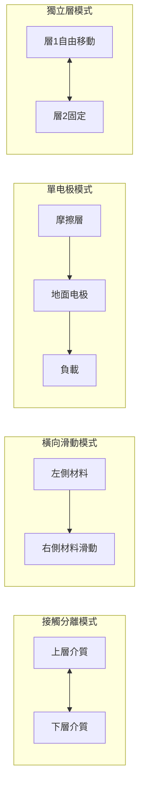
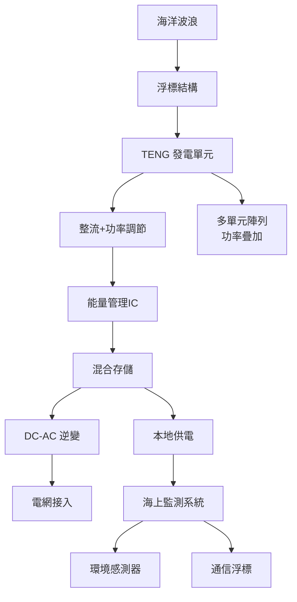

# EEEN4010 Kinetic Energy Harvesting Devices and Systems

**CUHK MAE | Other Elective | 3 units**
**Stream**: Energy

---

## Official Description
This course discusses kinetic energy harvesting devices and systems, from basic mechanisms to applications. The first half of the course covers the fundamentals of kinetic energy harvesting, including mechanisms of electromagnetic, piezoelectric, triboelectric, electrostatic, and others. Then it covers basic device designs and energy transfer; physics and circuit models; electromechanical modeling and analysis; simulation methods and practice; and interfacing circuits. The second half covers the applications of kinetic energy harvesting in various situations, including power plants, wind turbine, vibrations, hydro systems, ocean waves, body motions, and others, and ends with discussions on kinetic energy harvesting technology in the future.

---

## 問題 1：5 個核心心智模型

### 1. 機電能量轉換原理 (Electromechanical Energy Conversion)
**方程式 + 數字**：
- 功率密度：P_avg = (1/2)·m·ω²·A² / T（振動能量收集）
- 機電耦合係數：k² = U_mech / (U_mech + U_elec)（典型 0.1-0.7）
- 諧振頻率匹配：f_resonance ≈ f_excitation（最大功率傳輸條件）
- 品質因數：Q = f_r / Δf（典型 Q = 10-100，壓電梁）
- 學者：Williams & Yates (1996), "Analysis of a micro-generator for development of vibration energy harvesting"
- 應用：橋樑振動發電、工業設備狀態監測、無線感測器節點

### 2. 壓電能量收集 (Piezoelectric Energy Harvesting)
**方程式 + 數字**：
- 功率密度：P = (σ²·d·f) / Y（σ = 應力，d = 壓電係數，f = 頻率）
- 典型值：P ≈ 200-400 μW/cm³ @ 1 m/s² 加速度
- 接口電路：SSHI (Synchronized Switch Harvesting on Inductor) 效率提升 3-10×
- 諧振頻率：f_r = (1/2π)·√(k/Y·A/L³)（懸臂梁模型）
- 學者：Roundy & Wright (2004), "A piezoelectric vibration generator"
- 應用：機電設備振動監測、樓梯照明

### 3. 電磁感應能量收集 (Electromagnetic Energy Harvesting)
**方程式 + 數字**：
- 感應電動勢：V = N·dΦ/dt = N·B·l·v（N = 線圈匝數，B = 磁通密度，l = 導線長度）
- 線圈優化：內阻 R_c ≈ 8ρ·l_w / (π·d²)（ρ = 銅電阻率，d = 線徑）
- 典型功率：10-1000 μW（微型發電機）
- 磁鐵配置：Halbach 陣列可增強磁通密度 ~50%
- 學者：Beeby et al. (2006), "Micro electromagnetic vibration energy harvesting"
- 應用：管道流量發電、橋墩水流發電

### 4. 摩擦電能量收集 (Triboelectric Nanogenerator, TENG)
**方程式 + 數字**：
- 功率密度：10-500 mW/cm²（實驗室峰值）
- 開路電壓：V_oc ≈ Q/C（Q = 電荷，C = 電容）
- 短路電荷轉移：Q_sc ≈ σ·s（S = 接觸面積，σ = 電荷密度）
- 頻率依賴性：P ∝ f·A（在固定位移振幅下）
- 學者：Z.L. Wang (2012), "Triboelectric nanogenerators"
- 應用：海浪能收集、人體運動發電、可穿戴電子

### 5. 能量管理電路與最大功率點追蹤 (MPPT)
**方程式 + 數字**：
- 阻抗匹配：R_load = R_source（最大功率傳輸定理）
- 標準接口電路：整流橋 + DC-DC 變換器 + 存儲
- SSHI 接口：電壓反轉同步開關，功率提升 η_SSHI ≈ 3-10×
- 存儲效率：鋰電池充放電效率 ~90-95%；超級電容 ~95-99%
- 學者：Ottman et al. (2003), "Adaptive piezoelectric energy harvesting circuit"
- 應用：IoT 感測器供電、偏遠地區監測站

---

## 問題 2：3 個根本分歧

### 分歧 A：壓電 vs. 電磁 — 微型能量收集哪個更優？
**壓電方案**：
- 優點：無磁鐵、機械結構簡單、可微型化（MEMS）、高電壓輸出
- 缺點：電容性輸出阻抗、大內阻（高頻阻尼）、頻率敏感
- 典型功率密度：100-500 μW/cm³ @ 1 g

**電磁方案**：
- 優點：低阻抗輸出（易於功率提取）、寬頻率響應
- 缺點：微型化困難（線圈 + 磁鐵體積）、低電壓輸出
- 典型功率密度：10-100 μW/cm³ @ 1 g

**引用**：Beeby, S.P. et al. (2006). "Micro electromagnetic vibration energy harvesting." J. Micromechanics and Microengineering.

### 分歧 B：摩擦電 vs. 壓電 — 海浪能收集之爭
**摩擦電 (TENG)**：
- 優點：成本極低、材料選擇廣、高電壓（kV 級）、可在低頻 (< 1 Hz) 工作
- 缺點：內阻極高、功率密度受摩擦材料壽命限制（< 10⁵ 次循環）
- 適合：人體運動（0.5-5 Hz）

**壓電**：
- 優點：穩定功率輸出、技術成熟、頻率範圍較寬
- 缺點：高頻需求（> 10 Hz）才能高效
- 適合：高頻振動（機器振動 > 50 Hz）

### 分歧 C：最大功率點追蹤 vs. 固定阻抗 — 控制策略之爭
**MPPT（主動控制）**：
- 優點：實時調整功率點，寬頻率範圍內保持接近最大功率
- 缺點：控制電路複雜度增加、額外功耗（可能吃掉 20-30% 收集功率）
- 適合：輸入功率波動大的場景

**固定阻抗匹配**：
- 優點：電路簡單、功耗極低、適用於低功耗系統
- 缺點：寬頻率下效率下降明顯
- 適合：恆定頻率振動場景

---

## 問題 3：10 個深度問題

1. 振動能量收集中，什麼是諧振頻率調諧（frequency tuning）？有哪些技術實現方式？
2. 推導壓電懸臂梁的能量收集功率表達式，並說明如何優化幾何尺寸。
3. 什麼是機電阻抗匹配？如何在寬頻率振動環境中實現自適應匹配？
4. TENG 的四種基本工作模式（接觸分離、橫向滑動、單电极、獨立層）各有何優缺點？
5. 比較超級電容和鋰離子電池在能量收集系統中的應用優劣。
6. 什麼是同步電荷提取 (SECE)？相比標準電路有何優勢？
7. 能量收集系統的功率預算 (Power Budget) 如何計算？
8. 海洋波浪能收集的難點是什麼？現有的 TENG 和 EM 混合方案的優點？
9. 如何設計一個完整的自供電 IoT 感測器節點（能源收集 + 存儲 + 管理 + 通信）？
10. 什麼是振動-電-機械的耦合動力學？如何用狀態空間模型描述？

---

# 核心心智模型深化（中英對照）

## 1. 振動能量收集 — 基礎理論

### 1.1 諧振系統建模
**單自由度振動系統**：
mÿ + cẏ + ky = -m ẍ_ext

**穩態位移幅值**：
Y(ω) = (ω²/√((k - mω²)² + (cω)²)) · A_ext

**共振頻率**：
ω_r = √(k/m) · √(1 - ζ²)（ζ = c/(2√(mk))）

### 1.2 機電類比 (Electromechanical Analogy)
| 機械系統 | 電學系統 |
|---------|---------|
| 質量 m | 電感 L |
| 阻尼 c | 電阻 R |
| 彈簧 k | 1/電容 1/C |
| 力 F | 電壓 V |
| 速度 v | 電流 I |

### 1.3 頻率響應函數 (FRF)
H(ω) = Y(ω)/A_ext(ω)

**峰值增益**：
|H(ω_r)|_max = 1/(2ζ·√(1-ζ²))

Q = 1/(2ζ)（品質因數）

### 1.4 寬頻率策略
- 多模態設計：多個諧振頻率懸臂梁
- 磁性調諧：改變磁鐵位置改變等效剛度
- 非線性剛度： Duffing 振子（硬/軟彈簧特性）

### 1.5 疲勞分析
- 高週疲勞：應力比 R = σ_min/σ_max
- S-N 曲線：σ_a = σ_f' (2N_f)^b
- 壓電材料：壓電係數 d₃₃ 隨循環次數退化

---

## 2. 壓電能量收集 — 設計與優化

### 2.1 懸臂梁幾何優化
- 優化目標：最大化功率輸出
- 約束：體積 V = b·L·t
- 最優長寬比：L/b ≈ 5-10
- 壓電層位置：中立面以上最大應變

### 2.2 介電損耗與機電耦合損耗
- 介電損耗角正切：tan δ = ε''/ε'（典型 0.01-0.05）
- 功率耗散：P_dielectric = ω·C·V²·tan δ
- 總效率：η = P_out / (P_out + P_dielectric + P_mechanical_loss)

### 2.3 接口電路拓撲
**標準接口 (Standard)**：
- 交流 → 整流橋 → 濾波電容 → 存儲
- 缺點：壓電電荷在非峰值電壓時被浪費

**SSHI 接口**：
- 同步電壓反轉 + 電感振盪
- 效果：相位匹配電壓和速度，功率提升 3-10×

**SECE 接口**：
- 同步電荷提取（每周期提取固定電荷）
- 適合：寬頻率變化場景

### 2.4 多層壓電堆疊
- 串聯：電壓叠加（適合高阻抗後端）
- 並聯：電流叠加（適合低阻抗後端）
- 功率密度不變，但電壓/電流特性改變

### 2.5 MEMS 微型化
- 矽基壓電懸臂梁：厚度 1-10 μm
- PZT 薄膜沉積：溶劑-凝膠法 (Sol-Gel)，厚度 0.5-2 μm
- 功率密度：10-50 μW/cm³ @ 1 g

---

## 3. 摩擦電能量收集 — TENG 原理與應用

### 3.1 摩擦電序列
**正極性材料**（失電子強）：
尼龍 > 鋁 > 紙 > 木材 > 尼龍 > 棉花 > 鋼 > 木材 > 聚氨酯 > PTFE（特氟龍）

**負極性材料**（得電子強）：
（尼龍在空氣中可正可負）

### 3.2 電荷密度極限
- 最大電荷密度：σ_max ≈ 100-500 μC/m²（空氣擊穿限制）
- 真空/乾燥氮氣：σ_max 可達 mC/m² 級
- 表面電荷衰減時間：τ ≈ ε₀/σ_surf · ρ（ρ = 表面電阻率）

### 3.3 四種工作模式
| 模式 | 運動方向 | 優點 | 應用 |
|------|---------|------|------|
| 接觸分離 | 垂直 | 簡單可靠 | 鞋墊、振動 |
| 橫向滑動 | 平行 | 高電荷轉移 | 滑動開關 |
| 單电极 | 任何 | 對地參考 | 觸摸感測 |
| 獨立層 | 自由 | 無電線 | 波浪能 |

### 3.4 壽命與材料選擇
- 磨損：尼龍-PTFE 組合 > 10⁵ 次循環後電荷保持 > 80%
- 表面微結構：等離子體處理可增強電荷密度 3-5×
- 封裝：防止濕度影響（電荷消散）

### 3.5 功率管理
- 高輸出阻抗匹配：DC-DC 升壓 + 阻抗變換
- 存儲策略：超級電容（快充快放）+ 後備鋰電池（持續供電）

---

## 4. 能量管理系統 — 從收集到應用

### 4.1 功率預算分析
**能量來源**：
- 振動（1 m/s² @ 100 Hz）：~200 μW/cm³
- 溫差（5°C 梯度）：~10 μW/cm³
- 光（室內 100 lux）：~10 μW/cm²

**典型 IoT 節點功耗**：
- 感測器：10-100 μW
- MCU (休眠)：1-10 μW
- 通信（TX/RX）：10-100 mW
- 目標：能量收集功率 > 平均功耗

### 4.2 鋰離子電池特性
- 標稱電壓：3.7 V
- 能量密度：150-250 Wh/kg
- 循環壽命：500-2000 次（@ 80% 容量）
- 自放電：每月 2-5%

### 4.3 超級電容特性
- 電壓窗口：2.5-2.7 V（活性炭）
- 功率密度：5-10 kW/kg
- 循環壽命：10⁵-10⁶ 次
- 自放電：每月 10-40%（高於鋰電）

### 4.4 混合存儲系統
- 超級電容：峰值功率吸收（瞬時大功率）
- 鋰離子電池：持續功率供應
- 管理 IC：BQ25570（能量收集管理晶片）

### 4.5 低功耗 MCU 選擇
- MSP430FR59xx：0.7 μA/MHz (LPM3)，內置能量收集管理
- STM32L4xx：0.5 μA/MHz (LPM)，多種低功耗模式

---

## 5. 應用場景與系統設計案例

### 5.1 橋樑結構健康監測
- 振動源：車流引起橋面振動，f = 5-20 Hz
- 能量收集器：磁電式，功率 ~1-10 mW
- 供電：超級電容 + 太陽能輔助
- 數據傳輸：LPWAN (LoRa) 或 NB-IoT

### 5.2 人體運動發電
- 振動源：走路頻率 f = 0.5-2 Hz
- TENG：鞋墊嵌入式（接觸分離模式）
- 功率：50-500 mW（峰值），平均 ~10-50 mW
- 應用：可穿戴感測器供電

### 5.3 海洋波浪能收集
- 挑戰：低頻（0.1-0.5 Hz）、大振幅、不規則
- TENG-EM 混合：TENG（低頻）+ EM（高頻分量）
- 功率密度：1-10 W/m²（海面波濤）
- 電網接入：需要整流 + DC-AC 逆變

### 5.4 工業設備狀態監測
- 振動源：馬達軸承振動，f = 100-1000 Hz
- 壓電懸臂梁：PZT，功率 ~100 μW
- 自供電感測器：無需更換電池
- 數據：振動頻譜 → 軸承故障診斷

### 5.5 室內光能收集
- 光伏電池：室內效率 ~10-20%（vs. 室外 15-25%）
- 室内照度：100-1000 lux
- 功率密度：10-100 μW/cm²
- 應用：智慧建築感測器供電

---

## 深度自測問題詳解

**Q1**: 設計一個壓電懸臂梁能量收集器（目標：100 Hz 馬達振動，1 m/s² 加速度）。
**解答**：(1) 選擇 PZT-5A 壓電片（d₃₃ = 374 pC/N）；(2) 計算共振頻率 f_r = (1/2π)√(k/m) ≈ 100 Hz；(3) 懸臂梁長度 L ≈ 30-50 mm（需實驗調諧）；(4) 接口電路：SSHI 整流；(5) 預期功率：P ≈ 100-300 μW @ 1 m/s²

**Q2**: 比較四種 TENG 工作模式的頻率適應性。
**解答**：接觸分離（0.1-10 Hz 低頻）；橫向滑動（依賴滑動速度，1-100 Hz）；單电极（寬頻率 0.1-1000 Hz）；獨立層（極低頻 0.01-1 Hz，波浪能）

**Q3**: 計算最大功率傳輸定理在能量收集中的具體應用。
**解答**：當 R_load = R_source × (1 + k⁴)/(2·k²)（考慮機電耦合 k）；k² = 0.1 時，R_load ≈ 0.6 × R_source

**Q4**: 為什麼能量收集系統需要考慮 duty cycle？
**解答**：收集功率通常遠低於峰值功耗；通過 sleep-wake cycle：99% 時間休眠（μW 功耗），1% 時間工作（W 級）；平均功耗 = P_active × duty_cycle + P_sleep × (1-duty_cycle)；典型：工作 1 ms @ 10 mW，休眠 99 ms @ 10 μW，平均 = 110 μW

**Q5**: 什麼是磁懸浮發電機 (Magnetic Levitation Generator)？它如何實現自諧振？
**解答**：磁懸浮發電機：磁鐵在线圈中自由振动，無機械接觸損耗；自諧振：弹簧-質量系統決定諧振頻率；優點：摩擦損耗極低，Q 值可達 1000+；功率密度比傳統電磁高 3-5×

**Q6**: 計算 TENG 在 1 Hz 低頻工作時的理論功率密度。
**解答**：σ_max ≈ 200 μC/m²（空氣擊穿限制）；單次接觸分離電荷轉移 Q ≈ σ × A ≈ 200 μC/m² × 0.01 m² = 2 μC；每次 cycle 功率 W = Q × V_oc ≈ 2 μC × 200 V = 400 μJ；1 Hz → P = 400 μW/m²

**Q7**: 設計一個完整的自供電振動監測節點，列出關鍵元件和功率預算。
**解答**：壓電收集器（PZT，~200 μW）→ SSHI 整流 → 超級電容（10 F, 5.5 V）→ BQ25570 管理 IC → MSP430FR5949 MCU → SPI 感測器（加速度計）→ BLE 通信；平均功耗預算：感測器讀取 50 μW × 1% duty = 0.5 μW；通信 15 mW × 0.1% = 15 μW；MCU 10 μW；總計 ~30 μW < 200 μW 收集功率 ✓

**Q8**: 解釋為什麼超級電容比鋰離子電池更適合高功率脈衝應用。
**解答**：ESR（等效串聯電阻）：超級電容 ~1-10 mΩ vs. 鋰電 ~50-100 mΩ；峰值放電功率：P_max = V²/4R ≈ 100-1000× 鋰電；內阻損耗：I²R 顯著低於鋰電；循環壽命：超級電容 >> 鋰電（無化學降解）

**Q9**: 什麼是 Duffing 振子？如何利用其非線性實現寬頻率能量收集？
**解答**：Duffing equation：mÿ + cẏ + αy + βy³ = -m ẍ；非線性項 βy³：硬彈簧（β>0）或軟彈簧（β<0）；利用：參數振動或分岔現象可在更寬頻率範圍內維持高功率；風險：跳躍現象（Jump phenomenon）導致不穩定

**Q10**: 計算射頻能量收集 (RF Energy Harvesting) 的典型功率密度。
**解答**：GSM 900 MHz 基站附近：0.1-1 μW/cm²；WiFi 路由器附近：0.01-0.1 μW/cm²；FCC 允許最大功率：36 dBm EIRP；射頻收集效率 ~30-60%（天線+整流）；典型收集功率：室內 ~0.1-1 μW，戶外基站附近 ~10-100 μW

---

## 5 個 Mermaid 圖解

### 圖 1：振動能量收集系統架構

### 圖 2：壓電懸臂梁工作原理

### 圖 3：TENG 四種工作模式

### 圖 4：功率預算與 Duty Cycle

```mermaid
gantt
    title 自供電感測器節點功率預算
    dateFormat X
    axisFormat %s ms
    
    section 收集
    壓電收集功率: done, 0, 200
    收集平均功率: done, 0, 100
    
    section 消耗
    休眠功耗: done, 0, 10
    感測讀取: done, 10, 11
    MCU處理: done, 11, 13
    數據發射: done, 13, 16
    休眠功耗: done, 16, 100
```

### 圖 5：海浪 TENG 陣列系統

---

## 總結

EEEN4010 從微觀的機電耦合物理到宏觀的系統級能量管理，全面覆蓋了振動能量收集的核心知識。核心在於理解**諧振匹配**（f_resonance = f_excitation）作為最大化功率傳輸的關鍵條件，並掌握**功率管理電路**（SSHI、SECE、MPPT）的設計原理。對於智慧機器人工程而言，能量收集是实现**自主機器人**（無需外部供電）的關鍵技術，特別適用於偏遠地區的監測機器人和海洋環境中的自供電系統。

**核心 Reference**：
- Williams, C.B. & Yates, R.B. (1996). "Analysis of a micro-generator for development of vibration energy harvesting." Sensors and Actuators A, 52, 8-11.
- Beeby, S.P. et al. (2006). "Micro electromagnetic vibration energy harvesting." J. Micromechanics and Microengineering, 16, R1-R21.
- Roundy, S. & Wright, P.K. (2004). "A piezoelectric vibration generator." Smart Materials and Structures, 13, 1131-1142.
- Wang, Z.L. (2012). "Triboelectric nanogenerators as new energy technology." ACS Nano, 7(11), 9533-9557.
- Ottman, G.K. et al. (2003). "Adaptive piezoelectric energy harvesting circuit." IEEE Trans. Power Electron., 18(2), 696-703.
