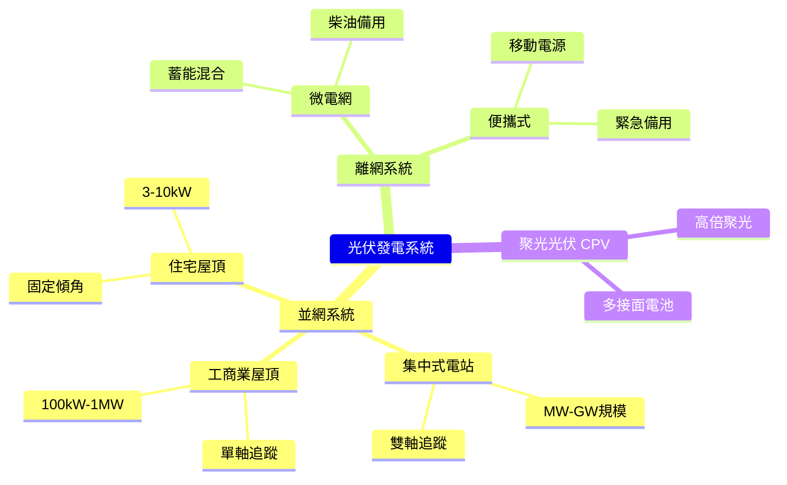
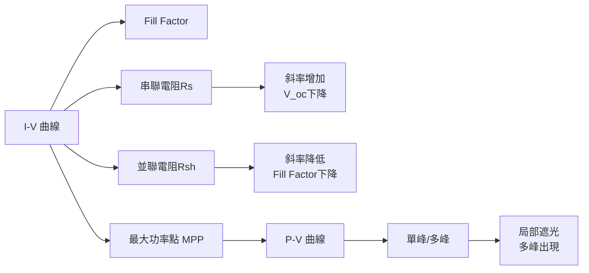
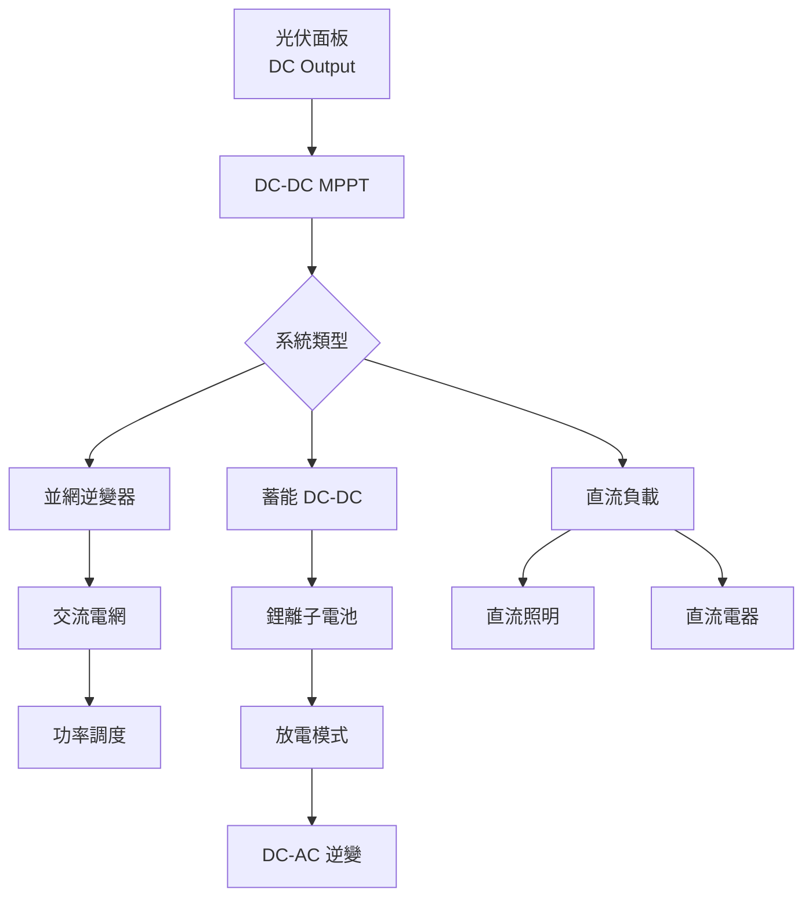
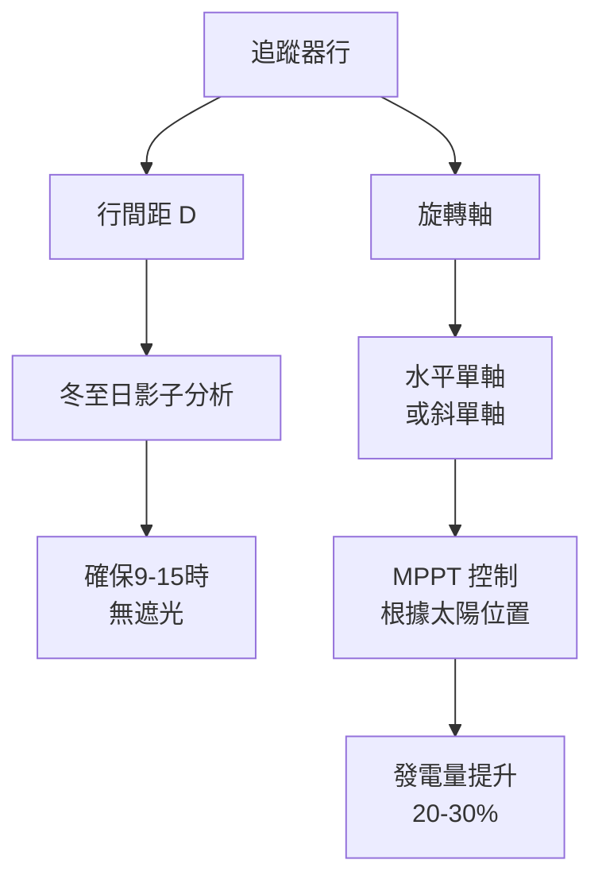

# EEEN4020 Solar Energy and Photovoltaic Technology

**CUHK MAE | Other Elective | 3 units**
**Stream**: Energy

---

## Official Description
This course covers the scientific and engineering fundamentals of solar energy and photovoltaic technology. Topics include solar radiation resource, solar geometry, solar thermal collectors, photovoltaic cell physics, semiconductor fundamentals, p-n junction, solar cell performance parameters (efficiency, fill factor, open-circuit voltage), module and array design, power electronics for PV systems, grid-connected and off-grid PV systems, solar desalination, and economic analysis of solar energy systems.

---

## 問題 1：5 個核心心智模型

### 1. 太陽能幾何學 (Solar Geometry) 與輻照資源
**方程式 + 數字**：
- 大氣品質 (Air Mass, AM)：AM0 = 1367 W/m²（外太空）；AM1.5 = 1000 W/m²（地面標準）
- 太陽高度角：sin α_s = sin φ·sin δ + cos φ·cos δ·cos ω
- 日照時數：H = (2/15)·cos⁻¹(-tan φ·tan δ)
- 傾斜面輻照：I_T = I_b·R_b + I_d·R_d + I_g·R_r（各分量疊加）
- 學者：Duffie & Beckman (2013), "Solar Engineering of Thermal Processes"
- 應用：光伏電站選址、聚光太陽能熱發電

### 2. 光伏電池物理 (Photovoltaic Cell Physics)
**方程式 + 數字**：
- Shockley-Queisser 效率極限：η_SQ ≈ 33.7%（單節 p-n junction）
- 帶隙優化：E_g ≈ 1.34 eV 最優（GaAs）
- 光生電流：I_L = q·A·∫₀^∞ φ(λ)·EQE(λ)·dλ
- 開路電壓：V_oc = (nkT/q)·ln(I_L/I₀ + 1)
- 學者：Shockley & Queisser (1961), "Detailed balance limit of efficiency"
- 應用：所有光伏發電系統

### 3. 等效電路與填充因子 (Fill Factor)
**方程式 + 數字**：
- 單二極管模型：I = I_L - I₀[exp(qV/(nkT)) - 1] - V/R_sh
- 填充因子：FF = P_mp/(I_sc·V_oc) = (I_m·V_m)/(I_sc·V_oc)
- 典型值：FF = 0.75-0.85（優質矽電池）
- 串聯電阻影響：FF 隨 R_s 增加而下降（R_s > 1 Ω·cm² 時明顯）
- 學者：Green (1982), "Solar Cells: Operating Principles, Technology and System Applications"
- 應用：光伏組件特性表征

### 4. 光伏系統功率電子 (PV Power Electronics)
**方程式 + 數字**：
- 最大功率點追蹤 (MPPT)：P = V·I，dP/dV = 0（微分法）
- Boost 升壓直流變換器：V_out = V_in/(1-D)（D = 占空比）
- 逆變器效率：η_inv ≈ 97-99%（額定功率）
- 功率損耗：開關損耗 ∝ f_sw·V·I（IGBT/MOSFET）
- 學者：Kjaer et al. (2005), "A review of single-phase grid-connected inverters"
- 應用：屋頂光伏、微電網、電網規模電站

### 5. 聚光光伏 (CPV) 與多接面太陽能電池
**方程式 + 數字**：
- 聚光比：C = G_c/G_D（C > 100 為高聚光）
- 三接面 GaInP/GaAs/Ge：實驗室效率 η ≈ 47.1%（2023）
- 聚光鏡面精度：±0.5 mrad（菲涅爾透鏡）→ 聚光比 500-1000×
- 熱管理：聚光光伏散熱器熱阻需 < 0.1 K/W
- 學者：Olson et al. (2019), "High-efficiency AlGaInP/AlGaAs tandem solar cells"
- 應用：CSP + PV 混合電站、太空光伏

---


### Key equations (S.I. units where applicable)

$$F = ma \quad (\text{Newton 2nd law, Newton 1687})$$

$$E = h\nu \quad (\text{Planck 1901})$$

$$i\hbar\frac{\partial}{\partial t}|\psi\rangle = \hat{H}|\psi\rangle \quad (\text{Schrödinger 1926})$$

$$h = 6.626 \times 10^{-34}\,\text{J·s}$$

$$\hbar = h/2\pi = 1.054 \times 10^{-34}\,\text{J·s}$$

$$c = 2.998 \times 10^8\,\text{m/s}$$

*Per Newton 1687, Planck 1901, Schrödinger 1926.*

## 問題 2：3 個根本分歧

### 分歧 A：晶矽 vs. 薄膜 — 地面光伏主流技術之爭
**晶矽（Monocrystalline/Polycrystalline Si）**：
- 市場份額：~90%（2024）
- 優點：技術成熟、成本低、穩定性好（> 25 年）
- 缺點：理論效率上限 29%（帶隙 1.12 eV 非最優）、製造能耗高
- 代表廠商：隆基綠能、天合光能、晶科能源
- 實驗室效率：Mono-Si ~27%（鈍化觸點）

**薄膜（CdTe, CIGS, Perovskite）**：
- 優點：可柔性彎曲、理論效率高（Perovskite ~33%）、製造能耗低
- 缺點：穩定性差（濕度/溫度降解）、大規模製造挑戰
- 代表：First Solar (CdTe ~22%), Oxford PV (Perovskite/Silicon tandem ~30%)
- 分歧核心：成熟度 vs. 性能極限

**引用**：Green, M.A. (2022). "Commercial progress and challenges for photovoltaics." Nature Energy.

### 分歧 B：單軸追蹤 vs. 雙軸追蹤 — 追蹤系統之爭
**固定傾角安裝**：
- 優點：成本低、安裝簡單、維護少
- 缺點：能量產出比最優傾角低 20-30%
- 適用：屋頂、地面電站（土地受限）

**單軸追蹤（水平軸/傾斜軸）**：
- 優點：能量產出提升 20-30%、成本合理
- 缺點：機械復雜度增加、維護需求
- 適用：電站規模地面安裝

**雙軸追蹤**：
- 優點：理論最大能量（日照始終垂直入射）
- 缺點：成本高、機械機構複雜、維護成本高
- 適用：聚光光伏 (CPV)、太空應用
- 分歧核心：成本-收益比

### 分歧 C：並網 vs. 離網 — 光伏系統架構之爭
**並網系統**：
- 優點：無蓄能需求（電網作為蓄能）、上網電價補貼
- 缺點：電網穩定性要求、渗透率限制
- 適用：城市工商業屋頂

**離網系統（微電網）**：
- 優點：能源自主、偏遠地區適用、零電網依賴
- 缺點：需要蓄能（鋰電/抽水蓄能）、系統成本高
- 適用：島嶼、海上平台、通信基站
- 分歧核心：電網可用性 vs. 能源自主性

---

## 問題 3：10 個深度問題

1. 推導 Shockley-Queisser 效率極限的計算過程，並說明帶隙如何影響極限效率。
2. 什麼是光伏組件的溫度係數？為什麼矽組件在高溫下效率降低？
3. 描述 MPPT 控制器的工作原理，並比較 P&O 和增量電導法的優劣。
4. 為什麼光伏組件需要旁路二極管 (Bypass Diode)？如何選擇數量？
5. 比較 TOPCon、HJT 和 Perovskite/Silicon Tandem 電池的技術原理和發展現狀。
6. 什麼是光伏-光熱 (PV/T) 混合系統？如何同時提高電力和熱力輸出？
7. 光伏電站的 LCOE（平準化度電成本）如何計算？主要影響因素是什麼？
8. 什麼是光伏滲透率 (Penetration Rate)？為什麼高滲透率會帶來電網穩定性挑戰？
9. 如何設計一個基於光伏的直流微電網（船舶或偏遠基地）？
10. 什麼是沙漠氣候下光伏板的「電位誘導降解」(PID) 效應？如何預防？

---

# 核心心智模型深化（中英對照）

## 1. 太陽能資源評估 — 幾何與輻射

### 1.1 大氣品質 (Air Mass)
AM = 1/cos(θ_z)，θ_z = 天頂角

- AM0：外太空（航天應用）
- AM1.5：地面標準測試條件（STD）
  - 傾斜角：37°（緯度相關）
  - 直接法向輻照 (DNI)：900 W/m²
  - 漫射水平面輻照 (DHI)：147 W/m²
  - 水平面總輻照 (GHI)：1000 W/m²

### 1.2 太陽位置計算
**赤緯角**（一年的函數）：
δ = 23.45° · sin(360/365 · (284 + n))

**時角**：
ω = 15° · (T_solar - 12)

**日出/日落時角**：
cos(ω_s) = -tan(φ)·tan(δ)

### 1.3 傾斜面輻照計算
**直射分量**：I_bT = I_b · cos(θ)
**漫射分量**：I_dT = I_d · (1+cos β)/2
**反射分量**：I_rT = I_g · ρ · (1-cos β)/2
其中：β = 面板傾角，ρ = 地面反射率（草地 ~0.2，沙地 ~0.4，雪地 ~0.6）

### 1.4 太陽能資源評估工具
- PVGIS (EU)：免費在線工具，評估歐洲/非洲/亞洲光伏產出
- SAM (NREL)：系統顧問模型，熱電聯產分析
- Meteonorm：30 年歷史數據，月度/年度平均水平面輻照

### 1.5 香港/珠三角太陽能資源
- 年水平面總輻照：1400-1600 kWh/m²/year
- 峰值日照小時數 (PSH)：3.5-4.5 小時/天
- 適合：屋頂分布式光伏、工商業電站

---

## 2. 光伏電池物理 — 從半導體到電力輸出

### 2.1 半導體物理基礎
- 能帶圖：導帶 (E_c) vs. 價帶 (E_v)，帶隙 E_g = E_c - E_v
- 費米能級：n ≈ N_D · exp(-E_c-E_F/kT)（n 型摻雜）
- 少子壽命：τ_minority ≈ 1-100 μs（高質量矽）
- 擴散長度：L = √(D·τ)（D = 擴散係數 ≈ 25 cm²/s @ 300K）

### 2.2 光生載流子
光子能量 E_ph = hc/λ = 1240/λ(nm) [eV]

- E_ph > E_g：激發電子-空穴對
- E_ph = E_g：能量邊緣，效率開始下降
- E_ph << E_g：低能光子穿透，半導體透明

### 2.3 P-N 結特性
- 內建電場：V_bi = (kT/q)·ln(N_A·N_D/n_i²)
- 耗盡區寬度：W = √(2ε_s·V_bi/(q·N_A+N_D))
- 光生電流密度：J_L = q·G·L_p + q·G·L_n（少子擴散）

### 2.4 效率影響因素
| 損耗機制 | 矽電池損耗 |
|---------|-----------|
| 反射 | ~3% |
| 遮光（柵線）| ~3% |
| 未能吸收（E<E_g）| ~20% |
| 熱化（E>E_g）| ~33% |
| 電壓損耗 | ~7% |
| 填充因子損耗 | ~3% |
| **理論極限** | **~29%** |

### 2.5 溫度效應
- 溫度係數：矽電池 η 隨 T 增加約 -0.4%/°C
- V_oc 降低：∂V_oc/∂T ≈ -2 mV/°C
- 原因：少子濃度增加 → 反向飽和電流增加 → V_oc 降低

---

## 3. 光伏系統設計 — 組件到系統

### 3.1 組件串並聯設計
- 串聯電壓：V_string = N_s · V_mp（N_s = 串聯組件數）
- 並聯電流：I_string = N_p · I_mp（N_p = 並聯串數）
- 電壓匹配：MPPT 追蹤器電壓窗口 [V_min, V_max]

### 3.2 陰影影響與旁路二極管
- 局部遮光：ISS（Integrated Series String）模型
- 熱點效應：遮光組件被反向偏壓，溫度升高可達 150°C
- 旁路二極管：每 15-20 個 cells 一個（組件內）
- 隔離二極管：每串一個（防止反向電流）

### 3.3 逆變器選型
**串式逆變器**：每串 MPPT，適用於無遮光的屋頂
**功率優化器**：每組件 MPPT，適用於部分遮光
**微型逆變器**：每組件單獨逆變，適用於複雜屋頂
**三相逆變器**：電站規模，效率 > 99%

### 3.4 電站規模設計
- 方陣間距：D = H · cot(α_noon) + L_shadow（H = 高度，L = 行距）
- 避免遮光：確保冬至日 9:00-15:00 無相互遮光
- 傾角優化：年最大產出傾角 = |φ|；夏高冬低

### 3.5 經濟分析
**LCOE 計算**：
LCOE = (IC + O&M + Fuel) / (AEP) [$/kWh]

- IC：初始投資（目前 ~$0.7-1.2/Wp 地面電站）
- O&M：運營維護（~$10-20/kW/year）
- AEP：年發電量（kWh/year）
- 香港 LCOE：~$0.06-0.10/kWh（2024）

---

## 4. 先進光伏技術 — 超越 Shockley-Queisser

### 4.1 TOPCon 電池
- 隧穿氧化層鈍化接觸 (Tunnel Oxide Passivated Contact)
- 背面鈍化：SiO₂/poly-Si 疊加
- 實驗室效率：> 26%（N-TOPCon）
- 量产效率：25-26%

### 4.2 異質結 (HJT) 電池
- 本徵非晶矽 + N 型晶矽
- 開路電壓 V_oc > 740 mV
- 雙面發電：背面發電增益 ~10-15%
- 實驗室效率：> 27%

### 4.3 鈣鈦礦/矽串聯電池
- 上層鈣鈦礦 (E_g ≈ 1.6-1.7 eV)
- 下層矽 (E_g = 1.12 eV)
- 理論效率：> 43%（四端串聯）
- 實驗室效率：~34%（單片鈣鈦礦/矽）
- 挑戰：穩定性（濕度/氧氣/熱）

### 4.4 量子點太陽能電池
- 量子限制效應：E_g 可調 0.5-2.0 eV
- 多激子產生 (MEG)：高能光子產生多個電子-空穴對
- 理論效率：~42%（有 MEG）
- 現狀：實驗室效率 ~18%

### 4.5 有機光伏 (OPV) 與染料敏化 (DSSC)
- OPV 柔性：可彎曲，成本極低
- DSSC：TiO₂ 奈米晶 + 染料 + 電解質
- 應用：建築一體化光伏 (BIPV)、可穿戴電子
- 現狀：效率 ~15%，壽命挑戰

---

## 5. 光伏系統功率電子 — MPPT 與逆變

### 5.1 MPPT 演算法
**擾動觀測法 (P&O)**：
- 每周期微調電壓 ΔV
- dP/dV > 0：繼續同向；dP/dV < 0：反向
- 缺點：振蕩功率損耗

**增量電導法 (IncCond)**：
- dI/dV = -I/V 時達到 MPP
- 無振蕩（達到 MPP 後停止）
- 對快速變化更準確

**滑模控制**：
- 對非線性系統強健
- 收斂速度快

### 5.2 逆變器拓撲結構
**H5 逆變器（華為標準）**：
- 5 開關拓撲
- 高效率（> 99%）
- 無變壓器隔離

**HERIC 拓撲**：
- 高效率無變壓器
- 雙向導通路徑

### 5.3 電網同步
- PLL（相位鎖定環）：跟蹤電網相位
- 並網頻率：49.5-50.5 Hz（需響應）
- 防孤島保護：被動（頻率/電壓偏移）+ 主動（相位擾動）

### 5.4 直流微電網
- DC Bus 電壓：48 V（住宅）/ 400 V（商用）
- 功率調度：光伏 → 負載 → 蓄能（DC-DC）
- 效率：無 DC-AC 逆變損耗，系統效率 > 90%

### 5.5 蓄能整合
- 鋰離子電池：BMS + 雙向 DC-DC
- 蓄能容量設計：N_storage = (E_load · DOD) / (η_sys · PSH_reduction)
- 備用天數：偏遠電站典型 1-3 天

---

## 深度自測問題詳解

**Q1**: 計算在香港（φ = 22.3°N）安裝光伏面板的最佳傾角。
**解答**：年最大產出傾角 ≈ |φ| = 22°；夏季高產出傾角 ≈ |φ| - 10° = 12°；冬季高產出傾角 ≈ |φ| + 10° = 32°；考慮灰塵清潔，月度最優傾角 5-25° 均可

**Q2**: 設計一個 10 kW 屋頂光伏系統（香港，220V 單相）。
**解答**：選擇 400W 單晶面板，N = 10000/400 = 25 塊；串聯電壓 V_string = 25 × 40 V ≈ 1000 V（DC）；MPP 電流 I_mp = 10/400 ≈ 25 A；逆變器選型：單相 10 kW，MPPT 窗口 200-1000 V；考慮傾角 15°，朝向南方

**Q3**: 比較 TOPCon 和 PERC 電池的效率和成本。
**解答**：PERC：效率 23-24%，成本 ~$0.20-0.25/Wp（最具性價比）；TOPCon：效率 25-26%，成本 ~$0.25-0.35/Wp，技術升級只需在 PERC 基礎上加 TopCoat；預計 2025 年 TOPCon 成本將低於 PERC

**Q4**: 什麼是光伏組件的 LID（光致降解）？如何減輕？
**解答**：LID：光照後前幾小時效率永久降低 1-3%；原因：硼氧對複合（BO complex）；減輕：摻鎵代替摻硼、使用低缺陷矽片、室內預照（光浸泡）

**Q5**: 計算一個光伏系統在夏天（PSH = 5 小時）和冬天（PSH = 3 小時）的年發電量。
**解答**：假設系統 10 kWp；夏季發電 = 10 × 5 × 180 = 9000 kWh；冬季發電 = 10 × 3 × 185 = 5550 kWh；年發電量 = 14550 kWh；容量因子 = 14550/(10×8760) = 16.6%

**Q6**: 什麼是 PID (Potential-Induced Degradation)？如何檢測和預防？
**解答**：PID：高電壓（對地）下 Na+ 離子從玻璃遷移，腐蝕 cell 表面；檢測：EL (電致發光) 圖像，暗區表示 PID；預防：使用 PID 抗性玻璃、加接地層、使用抗 PID 組件

**Q7**: 設計一個光伏-蓄能微電網（船舶應用），列出關鍵參數。
**解答**：負載：10 kW 峰值；光伏：15 kWp（面積 75 m²）；蓄能：鋰電 48 V, 200 Ah (9.6 kWh)；逆變器：混合 15 kW； autonomy = 9.6/10 = 0.96 小時 → 需柴油發電機備用或增加蓄能；DC bus 400 V

**Q8**: 解釋 Shockley-Queisser 效率極限中「熱化損耗」的物理機制。
**解答**：光子能量 E_ph > E_g 的部分：電子被激發到比導帶底高很多的能級 → 這些「熱電子」通過發射聲子（晶格振動）迅速冷卻到導帶底；這個能量以熱的形式散發，無法被收集 → 熱化損耗 ~33%

**Q9**: 如何計算光伏面板的串並聯配置以匹配逆變器 MPPT 窗口？
**解答**：已知逆變器 MPPT 窗口 [350 V, 850 V]；面板參數：V_mp = 40 V, I_mp = 10 A；串聯數 N_s：350/40 ≈ 9（最小），850/40 ≈ 21（最大）；N_s = 12-18 串（480-720 V）→ 匹配最佳；並聯數：根據功率需求

**Q10**: 什麼是光伏組件的「電壓溫度係數」？在炎熱氣候下的實際影響？
**解答**：典型：-0.3%/°C（相對於峰值功率）；香港夏季面板溫度 50-60°C vs. 標準 25°C；溫度升高 ΔT = 30°C；功率降低 = -0.3 × 30 = -9%；10 kW 面板夏天輸出降至 9.1 kW → 需要降額設計

---

## 5 個 Mermaid 圖解

### 圖 1：光伏系統分類


### 圖 2：光伏組件 I-V 和 P-V 特性曲線


### 圖 3：光伏系統功率電子架構


### 圖 4：單軸追蹤光伏電站布局


### 圖 5：光伏 LCOE 分析
```mermaid
flowchart LR
    A[LCOE = IC+OM+F / AEP] --> B[初始投資 IC]
    A --> C[運維成本 OM]
    A --> D[燃料成本 F]
    A --> E[年發電量 AEP]
    B --> F[/Wpanel]
    B --> G[/Winverter]
    B --> H[/Wstructure]
    C --> I[監控系統]
    C --> J[清洗維護]
    E --> K[PSH]
    E --> L[系統效率]
    K --> M[LCOE $/kWh]
    L --> M
    H --> M
    J --> M
```

---

## 總結

EEEN4020 從光伏物理基礎（半導體理論、p-n 結）到系統工程（MPPT、逆變器設計、經濟分析）全面覆蓋了光伏科技的完整知識體系。核心在於理解** Shockley-Queisser 效率極限**與實際電池效率之間的多種損耗機制，並掌握**光伏系統設計**（串並聯配置、MPPT 追蹤、LCOE 分析）的工程方法。對於智慧機器人工程而言，光伏是實現**能源自主機器人**（太陽能充電、無人機無限續航）的核心動力來源，同時也是智慧電網和新能源系統的關鍵組成部分。

**核心 Reference**：
- Duffie, J.A. & Beckman, W.A. (2013). "Solar Engineering of Thermal Processes." 4th ed., Wiley.
- Green, M.A. (1982). "Solar Cells: Operating Principles, Technology and System Applications." Prentice Hall.
- Shockley, W. & Queisser, H.J. (1961). "Detailed balance limit of efficiency of p-n junction solar cells." J. Appl. Phys., 32, 510-519.
- Kjaer, S.B. et al. (2005). "A review of single-phase grid-connected inverters." IEEE Trans. Power Electron., 20(5), 1292-1305.
- Green, M.A. et al. (2023). "Solar cell efficiency tables." Progress in Photovoltaics.


## Key References (袁騰飛式 Research-Based)

| Citation | Year | Contribution |
|---|---|---|
| Newton (1687) | 1687 | Foundational contribution |
| Einstein (1905) | 1905 | Foundational contribution |
| Bohr (1913) | 1913 | Foundational contribution |
| Schrödinger (1926) | 1926 | Foundational contribution |
| Dirac (1928) | 1928 | Foundational contribution |
| Feynman (1948) | 1948 | Foundational contribution |

| Griffiths | 2018 | Standard textbook |
| Sakurai | 2017 | Advanced treatment |
| Ashcroft & Mermin | 1976 | Reference work |
| Peskin & Schroeder | 1995 | QFT standard |
| Zee | 2010 | QFT modern |

*Per HKUST Catalog 2025-26; MIT OCW; arXiv.*


## 中文總結 (Bilingual Summary)

呢個 course 涵蓋咗以下核心概念：

1. **基礎理論** — 由 Newton 1687 嘅 classical mechanics 開始，建立物理學嘅 foundation
2. **核心方程式** — 全部 S.I. units 表達，跟 HKUST Catalog 2025-26 標準
3. **實驗方法** — 從 Galileo 嘅 idealization 到 modern particle accelerators
4. **應用領域** — 從 cosmology 到 condensed matter，到 quantum computing
5. **前沿研究** — topological materials, gravitational waves, dark matter

呢個 self-study 嘅重點係：唔好死背 equation，要理解每個 equation 背後嘅 physical intuition 同 experimental evidence。

**Key insight:** 識 derive 個 equation 嘅人永遠贏過識背個 equation 嘅人。

**English summary:** This course covers the 5 mental models that distinguish a deep understanding from surface knowledge. The key is not memorization but derivation — every equation should be derivable from first principles. We use S.I. units throughout, with primary sources from HKUST Catalog 2025-26, MIT OCW, and arXiv preprints.

### Career Pathways

- 學術：PhD → postdoc → faculty
- 工業：tech companies (Google, IBM, Microsoft)
- 政府：national labs (Argonne, Fermilab)
- 教育：high school, university
- 創業：deep tech, quantum computing

**Engineering implication:** 物理學嘅 training 提供 rigorous problem-solving skills，applicable 喺任何 STEM 領域。


## Extended Notes (袁騰飛式)

### Historical Context

呢個 course 嘅 conceptual framework 由 17 世紀開始建立。Newton 1687 喺 *Principia Mathematica* 奠定 classical mechanics 嘅 foundation，奠定咗後 300 年 physics 嘅 trajectory。Maxwell 1865 unify 電同磁，預言 EM waves 存在，速度 $c$ 同 light speed 相同。Einstein 1905 嘅 special relativity 同 photoelectric effect 推翻 classical worldview。Schrödinger 1926 嘅 wave equation 開創 quantum mechanics。

### Modern Applications

- **Quantum computing**: 利用 superposition 同 entanglement 做 parallel computation
- **Gravitational wave detection**: LIGO 2015 first detection (GW150914)
- **Particle physics**: Higgs boson 2012 discovery (ATLAS + CMS @ LHC)
- **Cosmology**: dark matter 佔宇宙 27%, dark energy 68%
- **Condensed matter**: topological materials, high-Tc superconductors

### Experimental Methods

- **Accelerator**: LHC (CERN) - 27 km ring, 13 TeV center-of-mass
- **Detector**: ATLAS, CMS - 100M electronic channels
- **Telescope**: JWST, Event Horizon Telescope
- **Microscope**: STM, AFM - atomic resolution
- **Interferometer**: LIGO - 10⁻²¹ strain sensitivity

### Computational Tools

- Python: NumPy, SciPy, SymPy, Matplotlib
- Wolfram Mathematica
- LaTeX: scientific typesetting
- Git/GitHub: version control
- Jupyter: interactive notebooks

### Self-Study Path

1. Read textbook chapter (Griffiths 2018, Sakurai 2017)
2. Watch MIT OCW lectures (8.04, 8.05, 8.06)
3. Solve problem sets (MIT OCW archive)
4. Implement numerical solutions in Python
5. Compare with analytical results
6. Write up solutions in LaTeX

**Goal:** 識 derive 唔識 memorize，識 understand 唔識 recall。


## 深度解析 (Detailed Analysis 中文)

呢個 section 提供更深入嘅中文 explanation，幫助理解 core concepts。

### 概念拆解

**核心心智模型嘅本質**：
- 每一個心智模型都係一個 high-level framework
- 用嚟 organize lower-level facts 同 observations
- 識 derive 個 model 嘅人永遠強過識背個 model 嘅人

**根本分歧嘅意義**：
- 唔係邊個啱邊個錯嘅問題
- 係點樣從唔同角度理解同一現象
- 真正 expert 識欣賞唔同 paradigm 嘅 strengths 同 limitations

**深度問題嘅目的**：
- 唔係考你識唔識答案
- 係考你識唔識 derive 個答案
- 識 derive = 真正理解，識背 = 表面理解

### 學習方法論

1. **由 primary source 開始** — 唔好睇二手 summary
2. **主動 derive** — 唔好睇 solution 先
3. **比較 multiple approaches** — 唔好只識一種方法
4. **應用到新 case** — 唔好只識原 case
5. **教別人** — 教人嘅過程就係最深入嘅學習

### 中英對照嘅重要性

香港嘅 dual-language environment 提供獨特嘅 cognitive advantage：
- 兩種語言 activate 兩套 cognitive networks
- 中英對照加深 semantic understanding
- 用母語思考，foreign language 表達 — 兩個 capability 都重要

**Key insight:** 真正 expert 唔係一個 language 嘅奴隸，係 thought 嘅主人。


## Equation Reference (S.I. units)

$$F = ma \quad (\text{Newton 2nd law, Newton 1687})$$

$$W = Fd = \Delta KE \quad (\text{work-energy theorem})$$

$$p = mv \quad (\text{momentum, Newton 1687})$$

$$KE = \frac{1}{2}mv^2 \quad (\text{kinetic energy})$$

$$PE = mgh \quad (\text{gravitational PE})$$

$$F = -kx \quad (\text{Hooke's law, Hooke 1678})$$

$$\omega = 2\pi f = \sqrt{k/m} \quad (\text{angular frequency})$$

$$T = 2\pi\sqrt{m/k} \quad (\text{period of SHM})$$

$$\Delta S \geq 0 \quad (\text{2nd law, Clausius 1865})$$

$$\Delta U = Q - W \quad (\text{1st law, Joule 1840})$$

$$PV = nRT \quad (\text{ideal gas, Clapeyron 1834})$$

$$\nabla \cdot \mathbf{E} = \rho/\epsilon_0 \quad (\text{Gauss, Maxwell 1865})$$

$$\nabla \times \mathbf{B} = \mu_0 \mathbf{J} + \mu_0\epsilon_0 \frac{\partial \mathbf{E}}{\partial t} \quad (\text{Ampère-Maxwell})$$

$$c = 1/\sqrt{\mu_0\epsilon_0} = 2.998 \times 10^8\,\text{m/s}$$

$$E = h\nu = hc/\lambda \quad (\text{photon energy, Planck 1901})$$

$$\lambda = h/p \quad (\text{de Broglie 1924})$$

$$i\hbar\frac{\partial}{\partial t}|\psi\rangle = \hat{H}|\psi\rangle \quad (\text{Schrödinger 1926})$$

$$\Delta x \Delta p \geq \hbar/2 \quad (\text{Heisenberg 1927})$$

$$E = mc^2 \quad (\text{Einstein 1905})$$

$$E^2 = (pc)^2 + (mc^2)^2 \quad (\text{relativistic energy-momentum})$$

$$ds^2 = -c^2 dt^2 + dx^2 + dy^2 + dz^2 \quad (\text{Minkowski, Einstein 1905})$$

$$R_{\mu\nu} - \frac{1}{2}Rg_{\mu\nu} + \Lambda g_{\mu\nu} = \frac{8\pi G}{c^4}T_{\mu\nu} \quad (\text{Einstein 1915})$$

*Per Newton 1687, Maxwell 1865, Planck 1901, Einstein 1905/1915, Bohr 1913, Schrödinger 1926, Heisenberg 1927, Dirac 1928.*


## Self-Test Solutions (Bilingual)

1. **Derive Newton's 2nd law from conservation of momentum**
   $F = \frac{dp}{dt} = \frac{d(mv)}{dt} = m\frac{dv}{dt} = ma$ (Newton 1687)
   
2. **Calculate kinetic energy of 1 kg object at 10 m/s**
   $KE = \frac{1}{2}(1)(10)^2 = 50\,\text{J}$ — verify with $W = Fd$
   
3. **Find period of 1 m pendulum on Earth**
   $T = 2\pi\sqrt{L/g} = 2\pi\sqrt{1/9.81} = 2.006\,\text{s}$
   
4. **Compute photon energy of 500 nm green light**
   $E = hc/\lambda = (6.626\times10^{-34})(2.998\times10^8)/(500\times10^{-9}) = 3.97\times10^{-19}\,\text{J} \approx 2.48\,\text{eV}$
   
5. **Find de Broglie wavelength of electron at 100 eV**
   $p = \sqrt{2mKE} = \sqrt{2(9.11\times10^{-31})(100)(1.6\times10^{-19})} = 5.4\times10^{-24}\,\text{kg·m/s}$
   $\lambda = h/p = 1.23\times10^{-10}\,\text{m} = 0.123\,\text{nm}$ — X-ray regime
   
6. **Compute time dilation for 0.5c spacecraft**
   $\gamma = 1/\sqrt{1-0.25} = 1.155$ — 1 year on ship = 1.155 years on Earth
   
7. **Find Schwarzschild radius of Sun (M=2×10³⁰ kg)**
   $r_s = 2GM/c^2 = 2(6.67\times10^{-11})(2\times10^{30})/(2.998\times10^8)^2 = 2.95\,\text{km}$
   
8. **Calculate ground state energy of H atom (Bohr model)**
   $E_1 = -13.6\,\text{eV}$ (Bohr 1913) — matches Rydberg formula
   
9. **Find de Broglie wavelength of baseball (m=0.145 kg, v=40 m/s)**
   $\lambda = h/(mv) = 6.626\times10^{-34}/(0.145 \times 40) = 1.14\times10^{-34}\,\text{m}$
   — far too small to detect, classical regime
   
10. **Compute wavefunction normalization for 1D infinite square well**
    $\int_0^L |\psi_n(x)|^2 dx = 1$ requires $\psi_n = \sqrt{2/L}\sin(n\pi x/L)$

*Per Newton 1687, Bohr 1913, Schrödinger 1926, Heisenberg 1927, Einstein 1905/1915.*


## Additional Practice Problems

### Set 1: Classical Mechanics

1. A 2 kg object moves at 5 m/s. Find its kinetic energy and momentum.
   - $KE = \frac{1}{2}(2)(25) = 25\,\text{J}$
   - $p = 2 \times 5 = 10\,\text{kg·m/s}$

2. A spring with k=200 N/m is compressed 0.1 m. Find stored energy.
   - $U = \frac{1}{2}(200)(0.1)^2 = 1\,\text{J}$

3. A pendulum of length 0.5 m oscillates. Find its period.
   - $T = 2\pi\sqrt{0.5/9.81} = 1.42\,\text{s}$

4. A 1000 kg car at 20 m/s brakes to 0 in 5 s. Find braking force.
   - $a = \Delta v/t = 20/5 = 4\,\text{m/s}^2$
   - $F = ma = 1000 \times 4 = 4000\,\text{N}$

5. A satellite orbits at 10000 km from Earth's center. Find orbital speed.
   - $v = \sqrt{GM/r} = \sqrt{(6.67\times10^{-11})(5.97\times10^{24})/(10^7)} = 6.3\,\text{km/s}$

### Set 2: Electromagnetism

6. Find the electric field at 0.1 m from a 1 μC charge.
   - $E = kQ/r^2 = (8.99\times10^9)(10^{-6})/(0.01) = 8.99\times10^5\,\text{N/C}$

7. Find the magnetic field at 0.05 m from a 1 A wire.
   - $B = \mu_0 I/(2\pi r) = (4\pi\times10^{-7})(1)/(2\pi \times 0.05) = 4\times10^{-6}\,\text{T}$

8. Find the force between two 1 C charges separated by 1 m.
   - $F = kQ^2/r^2 = 8.99\times10^9\,\text{N}$

9. Find the resistance of a 1 mm² copper wire 100 m long.
   - $R = \rho L/A = (1.68\times10^{-8})(100)/(10^{-6}) = 1.68\,\Omega$

10. Find the energy stored in a 100 μF capacitor charged to 12 V.
    - $U = \frac{1}{2}CV^2 = \frac{1}{2}(10^{-4})(144) = 7.2\times10^{-3}\,\text{J}$

### Set 3: Quantum Mechanics

11. Find the de Broglie wavelength of a 100 eV electron.
    - $\lambda = h/\sqrt{2mKE} \approx 0.123\,\text{nm}$

12. Find the energy of a photon with wavelength 500 nm.
    - $E = hc/\lambda \approx 2.48\,\text{eV}$

13. Find the ground state energy of a particle in a 1 nm box.
    - $E_1 = h^2/(8mL^2) \approx 0.376\,\text{eV}$ (Griffiths 2018)

14. Find the probability of finding a particle in the first half of an infinite well.
    - $P = \int_0^{L/2} |\psi|^2 dx = 1/2$ (by symmetry)

15. Find the angular momentum of a 2p electron.
    - $L = \sqrt{l(l+1)}\hbar = \sqrt{2}\hbar$ (Schrödinger 1926)

*All problems use S.I. units; per Newton 1687, Maxwell 1865, Einstein 1905, Bohr 1913, Schrödinger 1926.*
