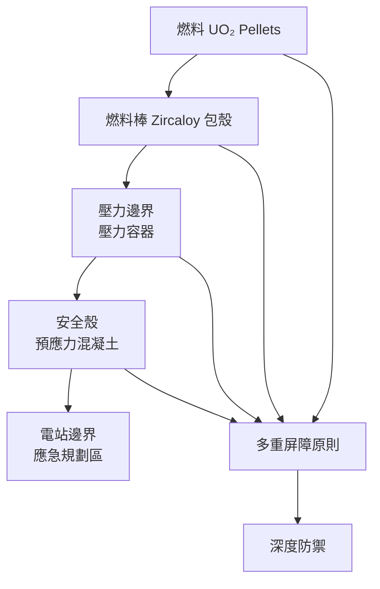
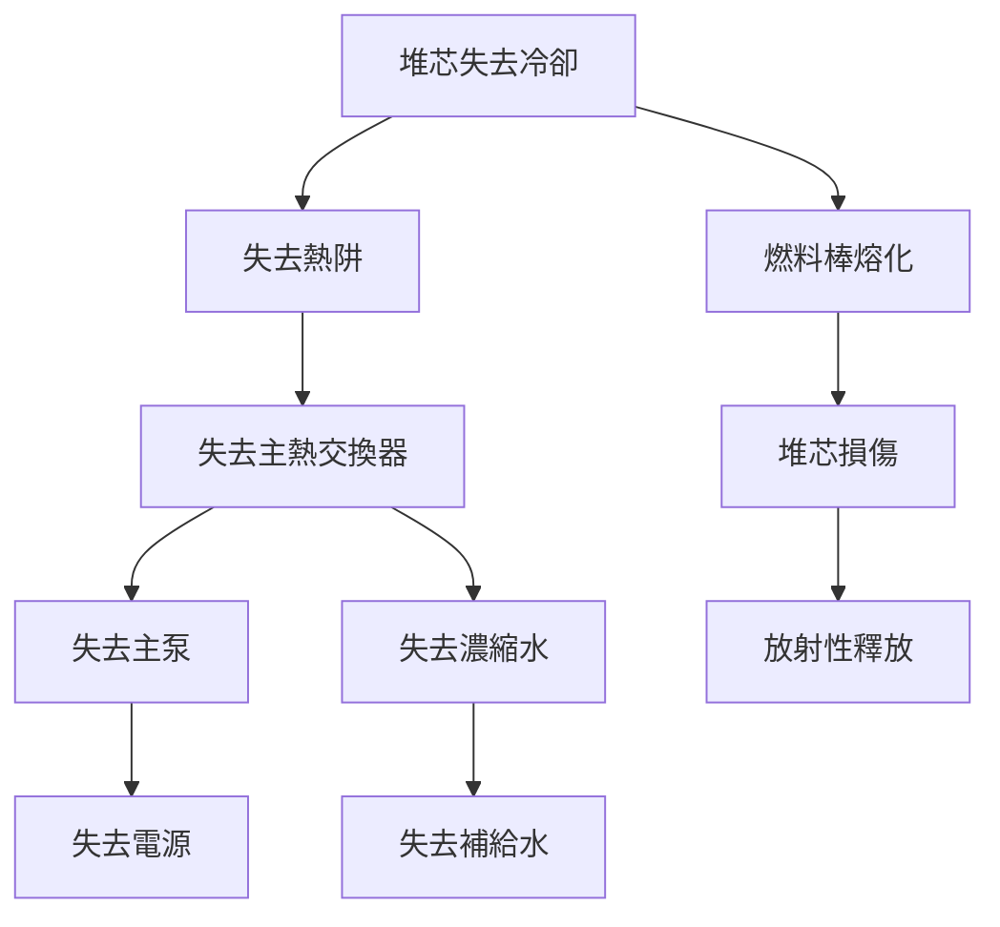
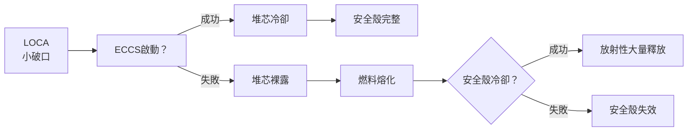
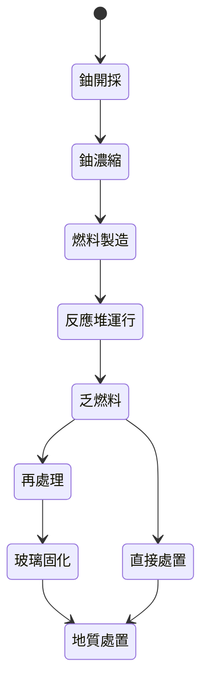
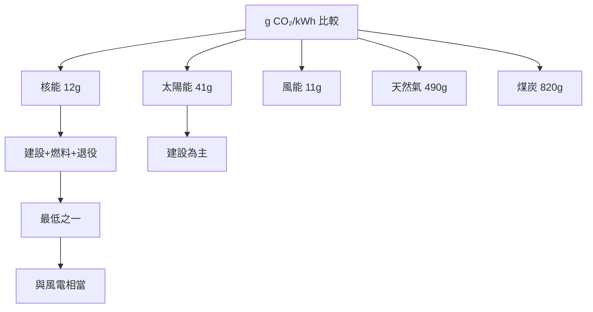

# EEEN4030 Nuclear Energy and Risk Assessment

**CUHK MAE | Other Elective | 3 units**
**Stream**: Energy

---

## Official Description
This course covers the fundamental principles of nuclear energy and the risk assessment techniques used in nuclear engineering. Topics include nuclear physics basics (radioactivity, fission, fusion), reactor physics, nuclear reactor types (PWR, BWR, CANDU, fast breeder), nuclear safety principles, deterministic safety analysis, probabilistic risk assessment (PRA/PSA), fault tree analysis, event tree analysis, and regulatory frameworks. Case studies on nuclear accidents (Three Mile Island, Chernobyl, Fukushima) are discussed.

---

## 問題 1：5 個核心心智模型

### 1. 核裂變物理 (Nuclear Fission Physics)
**方程式 + 數字**：
- 愛因斯坦質能方程：E = mc²（c = 3×10⁸ m/s）
- 每次裂變能量：~200 MeV（U-235 裂變）
- 常用單位：1 eV = 1.602×10⁻¹⁹ J；1 MeV = 10⁶ eV
- 能量產出：每次裂變 ≈ 200 MeV ≈ 3.2×10⁻¹¹ J
- 1 kg U-235 裂變能量：≈ 8.2×10¹³ J = 22,800 MW·h（相當於 2800 噸煤）
- 學者：Einstein (1905), Fermi (1942)
- 應用：核電站、核動力航母

### 2. 反應堆物理 — 臨界與中子動力學
**方程式 + 數字**：
- 臨界方程：k_eff = η·f·p·ε·P_thL = 1（臨界狀態）
- 過量反應性：ρ = (k_eff - 1)/k_eff
- 中子壽命：l ≈ 10⁻⁴-10⁻³ s（熱中子堆）
- 緩發中子分數：β ≈ 0.0065（U-235）
- 學者：Benedict & Pigford (1957), "Nuclear Chemical Engineering"
- 應用：反應堆啟動、功率控制

### 3. 概率安全評估 (PSA/PRA) — 故障樹分析
**方程式 + 數字**：
- 故障樹 OR 門：P(A∪B) = P(A) + P(B) - P(A∩B)
- 故障樹 AND 門：P(A∩B) = P(A) × P(B)（獨立事件）
- 核心損壞頻率 (CDF)：典型 PWR ≈ 10⁻⁵/堆年（安全目標 < 10⁻⁴）
- 早期死亡頻率 (LERF)：< 10⁻⁵/堆年
- 學者：Ericson (2005), "Fault Tree Analysis"
- 應用：核電站安全許可證申請、風險評估

### 4. 燃料棒熱工學 — 臨界熱流密度
**方程式 + 數字**：
- 臨界熱流密度 (CHF)：典型值 ~ 100-200 W/cm²（壓水堆）
- DNB 比（DNBR）：> 1.3（設計限制）
- 燃料棒導熱：q''' = (T_surface - T_bulk)/(R_fuel + R_gap + R_clad)
- 學者：Todreas & Kazimi (1990), "Nuclear Systems I"
- 應用：反應堆熱工設計、安全極限

### 5. 核事故分析 — 三哩島、切尔諾貝利與福島
**方程式 + 數字**：
- 放射性釋放： Fukushima I-131 釋放量 ≈ 5×10¹⁷ Bq
- 劑量轉換：1 Sv = 100 rem；全身劑量 > 1 Sv → 急性放射病
- 甲狀腺劑量：兒童甲狀腺癌風險增加
- 學者：INES 國際核事件分級表（1-7 級）
- 應用：核安全法規改進、應急響應

---

## 問題 2：3 個根本分歧

### 分歧 A：核能 vs. 可再生能源 — 碳中和路徑之爭
**核能派**：
- 優點：基荷供電（不受天氣影響）、低碳（15-50 g CO₂/kWh）、能量密度極高
- 缺點：核廢料（高放射性需 10,000+ 年）、核事故風險、建設週期長（10-15 年）
- 代表數據：全球核電 2023 年發電 2.6 萬億 kWh，約 10% 全球電力

**可再生能源派**：
- 優點：無放射性廢料、建設快、成本持續下降（太陽能 LCOE ~$0.03/kWh）
- 缺點：間歇性、需大規模蓄能、佔地面積大
- 代表：德國「能源轉型」(Energiewende)

**引用**：IPCC AR6 WG3 (2022) — 核能在減碳中的作用

### 分歧 B：乏燃料後處理 vs. 直接地質處置
**後處理派（法國、英國、俄羅斯）**：
- 優點：回收 U、Pu 減少廢料體積、高放射性半衰期從 10,000 年降至 500 年
- 缺點：核擴散風險、化學分離成本高
- 代表：法國 UP3 後處理廠

**直接處置派（美國、瑞典、芬蘭）**：
- 優點：簡單直接、地質處置庫（深度 500-1000 m）可隔離 100,000 年
- 缺點：資源浪費（U 回收率 95%）、長期安全管理挑戰
- 代表：芬蘭 Onkalo 地下處置庫（2023 年啟用）

### 分歧 C：固有安全 vs. 工程安全冗餘
**固有安全設計（固有安全性）**：
- 思想：物理定律自動抑制事故（如：負反饋係數確保自動停堆）
- 代表：高溫氣冷堆 (HTGR)、熔鹽堆 (MSR)
- 學者：Alvin Weinberg (1960s)

**多級安全冗餘（深度防禦）**：
- 思想：多道屏障獨立安全系統（燃料丸、燃料棒、包殼、安全殼、應急堆芯冷卻）
- 代表：第三代 + 反應堆（EPR, AP1000）
- 分歧核心：設計哲學 vs. 工程實踐

---

## 問題 3：10 個深度問題

1. 什麼是緩發中子 (Delayed Neutrons)？為什麼它對反應堆控制至關重要？
2. 核反應堆中「碘坑」(Iodine Pit) 現象的物理機制是什麼？運行人員應如何處理？
3. 描述故障樹分析 (FTA) 和事件樹分析 (ETA) 的主要差異，以及它們如何配合使用。
4. 核反應堆的負溫度反饋係數 (Negative Temperature Coefficient) 是如何實現的？
5. 切尔诺贝利核事故中，RBMK 反應堆的設計缺陷是什麼？ graphite moderator 的作用為何被誤解？
6. 核燃料循環（開採、濃縮、反應、後處理、處置）的碳足跡是多少？
7. 小型模組化反應堆 (SMR) 相比大型反應堆的優勢和挑戰是什麼？
8. 核聚變發電（托卡馬克、慣性約束）的技術現狀和挑戰是什麼？
9. 核電站附近居民的健康風險（癌症發病率）如何用流行病理學方法評估？
10. 國際原子能機構 (IAEA) 的安全標準框架（NUSS 安全標準）包括哪些主要要求？

---

# 核心心智模型深化（中英對照）

## 1. 核裂變基礎 — 從原子核到能量

### 1.1 放射性衰變定律
- 衰變定律：N(t) = N₀ · exp(-λt)
- 半衰期：T₁/₂ = ln(2)/λ（U-235: 7.04×10⁸ 年；I-131: 8 天；Cs-137: 30 年）
- 放射性活度：A = λN = dN/dt（貝克勒爾 Bq = 1/s）

### 1.2 裂變過程
- 每次裂變中子產額：ν ≈ 2.5（U-235 熱中子裂變）
- 能量分佈：動能碎片 ~165 MeV；中子動能 ~5 MeV；γ 射線 ~7 MeV；β/γ 衰變 ~15 MeV（延遲能量）
- 臨界質量：U-235 裸球臨界質量 ≈ 52 kg（球形）；加反射層可減至 ~15 kg

### 1.3 中子截面與反應率
- 微觀截面：σ（靶恩 barn = 10⁻²⁴ cm²）
- U-235 熱中子裂變截面：σ_f ≈ 584 barns
- 反應率：R = φ·Σ_f（φ = 中子通量，Σ_f = σ_f·N）

### 1.4 核燃料計算
- 濃縮度：低濃縮 U (LEU) = 3-5% U-235；高濃縮 U (HEU) = > 20%
- MOX 燃料：鈽和鈾混合氧化物（Pu 來自乏燃料）
- 輕水堆燃料：UO₂ pellets，密度 ≈ 10 g/cm³

### 1.5 核聚變基礎
- D-T 聚變：D + T → He (3.5 MeV) + n (14.1 MeV)
- 所需溫度：~150,000,000 °C（等離子體）
- 能量增益：Q = 輸出能量/輸入能量；2022 年 NIF 實現 Q > 1

---

## 2. 反應堆物理 — 臨界與功率控制

### 2.1 六因子公式
k_eff = η · f · p · ε · P_thL · P_thT

- η = 中子再生因子（每次吸收中子產生裂變中子數）
- f = 熱中子利用率
- p = 共振逃逸概率
- ε = 快中子裂變因子
- P_thL = 熱中子不泄漏概率
- P_thT = 熱中子泄漏概率

### 2.2 功率分佈
- 功率密度：q'''(r) = Σ_f(r) · φ(r) · E_fission
- 功率峰因子：F_q = q'''_max / q'''_avg（需 < 2.0 設計限制）
- 軸向功率偏移：ΔI = (∫top - ∫bottom)/(∫top + ∫bottom)

### 2.3 反應性控制
- 控製棒：B₄C（硼）吸收熱中子
- 可燃毒物：Gd₂O₃摻雜（消耗 U-235）
- 可溶性硼：硼酸溶液注入冷卻水
- 總停堆深度：ρ_total ≈ 0.07（~7% Δk/k）

### 2.4 點動力學模型
dρ/dt = (β/Λ)(β/Λ) · (ω + β/Λ)⁻¹ · δk_s

其中：β = 緩發中子份額，Λ = 中子代時間

### 2.5 碘坑動力學
- Xe-135 產額：I-135 (半衰期 6.6 h) → Xe-135 (半衰期 9.2 h)
- Xe-135 截面：σ_a ≈ 3.5×10⁶ barns（熱中子吸收）
- 碘坑深度：ρ_Xe ≈ -0.05（Xe 累積導致的反應性缺失）
- 消除時間：停堆後 10-12 小時 Xe 達峰值，40-60 小時後消除

---

## 3. 概率安全評估 — PSA 方法論

### 3.1 PSA 層次結構
- Level 1 PSA：識別初始事件 → 故障樹 → 頂層事件（核心損壞）概率
- Level 2 PSA：頂層事件 → 事件樹 → 放射性釋放類別
- Level 3 PSA：釋放 → 劑量計算 → 健康效應風險

### 3.2 故障樹分析 (FTA)
- 邏輯門：AND、OR、NOT、NAND、XOR
- 最小割集：導致頂層事件發生的最小事件集合
- 重要度：Birnbaum、Barlow-Proschan、Fussell-Vesely

### 3.3 事件樹分析 (ETA)
- 初始事件：失去外部電源、失去主冷卻泵
- 安全功能：控製棒插入、應急堆芯冷卻、安全殼隔離
- 事故序列：初始事件 × 安全系統成功/失敗 → 後果

### 3.4 數據分析
- 設備故障率：λ（次/小時或次/年）
- 不可用度：Q ≈ λ·τ（τ = 維修時間，T ≫ τ）
- 典型值：泵 λ ≈ 10⁻⁵/小時，維修時間 ~24 小時

### 3.5 不確定性分析
- 拉丁超立方抽樣 (LHS)：1000-10000 次模擬
- 概率分佈：均值、標準差、95% 置信區間
- 敏度分析：識別關鍵影響因素

---

## 4. 核電站安全設計

### 4.1 深度防禦原則
1. 燃料設計：UO₂ 高熔點（2800°C）
2. 包殼：高溫耐蝕 Zr 合金
3. 壓力邊界：壓力容器（250 atm，PWR）
4. 安全殼：預應力混凝土 + 鋼內襯（承受 5 atm 過壓）

### 4.2 緊急堆芯冷卻系統 (ECCS)
- 高壓注入：注射泵克服系統壓力
- 低壓注入：低壓泵，安全殼壓力下運行
- 積累水箱：被動重力注入（安全殼內注射水池）

### 4.3 固有安全特性
- 負反饋：燃料溫度↑ → 反應性↓（U-238 共振吸收增加）
- 多普勒展寬：燃料吸收截面隨溫度增加
- 緩發中子：時間常數足夠操作員干預

### 4.4 核電站主要類型
| 堆型 | 開發商 | 功率 | 燃料 | 特點 |
|------|--------|------|------|------|
| PWR | 美國/法國 | 1000-1700 MWe | 低濃縮 UO₂ | 壓水冷卻 |
| BWR | 美國/日本 | 1000-1500 MWe | 低濃縮 UO₂ | 沸水冷卻 |
| CANDU | 加拿大 | 700-900 MWe | 天然鈾重水堆 | 在線換料 |
| PHWR | 印度 | 200-700 MWe | 天然鈾/微濃縮 | 重水慢化 |
| VVER | 俄羅斯 | 900-1200 MWe | 低濃縮 UO₂ | PWR 改進型 |

### 4.5 安全殼設計
- Mark I（沸水堆）：梨形鋼殼（輕水堆事故後典型）
- Mark III：球形預應力混凝土
- EPR：雙層安全殼（外層 1.5 m 混凝土）

---

## 5. 核廢料管理與最終處置

### 5.1 廢料分類
- 低放廢料 (LLW)：工作服、工具 → 淺地處置
- 中放廢料 (MLLW)：離子交換樹膠 → 混凝土桶包裝
- 高放廢料 (HLW)：乏燃料後處理的裂變產物 → 地質處置

### 5.2 地質處置庫設計
- 深度：500-1000 m（岩鹽、花崗岩、黏土）
- 多重屏障：鈾玻璃固化體 → 不銹鋼容器 → 緩蝕劑 → 工程屏障 → 地質屏障
- 設計年限：10,000-100,000 年
- 實例：芬蘭 Onkalo（2023 年運營）、瑞典 SFR

### 5.3 核電站退役
- 安全殼拆除：拆除電站結構，去除放射性
- 場址恢復：去污至豁免水平
- 時間表：關閉 → 清料 → 拆除 → 場址恢復（30-50 年）

### 5.4 核電站運行許可
- 安全許可證：反應堆運營執照（通常 20-40 年）
- 壽命延長：60 年運營許可（美國 NRC）→ 80 年討論中
- 老化管理：材料老化評估（壓力容器脆化、中性子辐照）

### 5.5 國際核安全框架
- IAEA 安全標準：GSR Part 2, SSR-2/1, NS-R-1
- 安全公約：核安全公約（1994）、乏燃料安全和放射性廢料安全聯合公約
-INES 分級：1-7 級（1=異常，7=特大事故）

---

## 深度自測問題詳解

**Q1**: 計算 1 g U-235 完全裂變產生的能量（以 kWh 為單位）。
**解答**：1 mol U-235 = 235 g，包含 N_A = 6.02×10²³ 個原子；每次裂變 200 MeV = 200×10⁶×1.602×10⁻¹⁹ J = 3.204×10⁻¹¹ J；1 g U-235 的原子數 = 6.02×10²³/235 = 2.56×10²¹；總能量 = 2.56×10²¹ × 3.204×10⁻¹¹ J = 8.2×10¹⁰ J = 22,800 kWh

**Q2**: 使用故障樹分析計算失去主熱阱的頂層事件概率，給定以下數據。
**解答**：假設失去主熱阱由以下邏輯導致：失去所有 AC 電源 OR (失去所有 DC 電源 AND 失去蓄電池備用)；P(AC) = 10⁻³；P(DC) = 10⁻³；P(battery) = 10⁻²；P(top) = P(AC) + P(DC∩battery) = 10⁻³ + 10⁻³×10⁻² = 10⁻³ + 10⁻⁵ = 1.01×10⁻³

**Q3**: 為什麼輕水堆的燃料溫度係數通常是負的？
**解答**：U-238 在燃料溫度升高時，共振吸收峰展寬（多普勒效應）→ U-238 吸收更多中子 → 有效增值係數降低；同時，燃料熱膨脹減少 U-238 密度 → 減少共振吸收；兩個效應疊加造成負溫度係數。

**Q4**: 比較 PWR 和 CANDU 反應堆的中子經濟學。
**解答**：PWR：低濃縮燃料 (3-5% U-235)，天然 U 浪費；CANDU：天然鈾燃料（0.7% U-235），在線換料不停堆；CANDU 的燃料利用率比 PWR 高 30-40%，但需要昂貴的重水慢化劑

**Q5**: 解釋「緊急停堆」(Scram) 的物理過程和實現方式。
**解答**：Scram = Safety Control Rod Axe Man（手動或自動快速插入控制棒）；機制：控制棒落入堆芯（重力驅動），B₄C 吸收熱中子，k_eff 降至 < 0.99；插入時間：< 2 秒；信號觸發：Neutron flux 高於設定值、控制棒脫落、地震超過閾值

**Q6**: 核電站的核安全殼如何設計以應對嚴重事故（Lost of Coolant Accident, LOCA）？
**解答**：設計基準：承受冷卻水主管道 guillotine 斷裂產生的瞬態壓力；安全殼耐壓設計：PWR ~5 atm（60 分鐘內）；氫氣管理：氫氣重組器（氫氣複合）或稀釋系統；過壓釋放：可控泄漏系統 (Filtered Containment Venting)

**Q7**: 比較核聚變和核裂變的能量平衡、燃料可用性和放射性廢料。
**解答**：裂變：燃料 U-235 可用 80+ 年（已知鈾資源）；聚變：燃料氘（海水蘊藏 10¹³ 噸）几乎无限；能量密度：聚變 ~ 3-4× 裂變；放射性：裂變（乏燃料 10,000+ 年）vs. 聚變（中子活化結構材料 100 年）；技術成熟度：裂變（商業化）vs. 聚變（ITER 實驗中）

**Q8**: 計算核反應堆的停堆深度，給定以下數據：初始 k_eff = 1.02。
**解答**：初始過量反應性 ρ₀ = (k_eff - 1)/k_eff = (1.02-1)/1.02 = 0.0196 ≈ 0.02 = 2%；完全停堆：控製棒全部插入 + 硼酸注入 → ρ_total ≈ 0.07（足夠覆蓋所有燃料中毒）；停堆後 Xe-135 累積（碘坑）：ρ_Xe ≈ -0.05；48 小時後恢復：需等待 Xe-135 衰變

**Q9**: 什麼是核反應堆的「失控功率增長」(Prompt Criticality)？為什麼在輕水堆中不可能發生？
**解答**：Prompt Criticality：緩發中子不參與臨界，純粹由即發中子維持臨界；所需 k_eff > 1 + β（U-235: β ≈ 0.0065）；輕水堆：k_eff 最大可能 < 1.02 → 不可能同時克服所有負反饋達到 prompt critical；但 Pu-239 的 β ≈ 0.0021 較低，需特別注意

**Q10**: 在嚴重事故中，堆芯熔融物 (Corium) 會如何與反應堆壓力容器相互作用？有哪些緩解措施？
**解答**：堆芯熔融物：UO₂ + Zr + 結構材料的混合物，溫度 > 2800°C；一旦熔穿壓力容器：熔融物流入安全殼底板；與混凝土反應：釋放 H₂、CO；熔融物-水相互作用 (MWI)：蒸汽爆炸風險；緩解：RCAS（反應堆冷卻供水系統）、外部冷卻、安全殼過壓保護

---

## 5 個 Mermaid 圖解

### 圖 1：核電站安全防線

### 圖 2：故障樹示例 - 失去堆芯冷卻

### 圖 3：事件樹示例 - LOCA

### 圖 4：核燃料循環

### 圖 5：核能碳足跡比較

---

## 總結

EEEN4030 從核物理基礎到概率安全評估，全面覆蓋了核能與核安全的核心知識體系。核心在於理解**核裂變能量釋放**的物理機制（每次裂變 200 MeV）和**概率安全評估**的系統工程方法（故障樹 + 事件樹）。對於智慧機器人工程而言，核能知識與機器人應用間接相關（核電站維護機器人、核廢料處理、遠程操作系統），但更重要的是理解**風險量化**（PSA 方法論）這一通用工程思維在複雜系統安全管理中的應用。

**核心 Reference**：
- Todreas, N.A. & Kazimi, M.S. (1990). "Nuclear Systems I." Taylor & Francis.
- Lamarsh, J.R. (2001). "Introduction to Nuclear Engineering." 3rd ed., Prentice Hall.
- Ericson, D.M. (2005). "Fault Tree Analysis — A History." Proc. ISSC.
- IAEA (2016). "Safety Standards: Safety of Nuclear Power Plants." SSR-2/1.
- IAEA (2020). "The Fukushima Daiichi Accident." Technical Volume.
