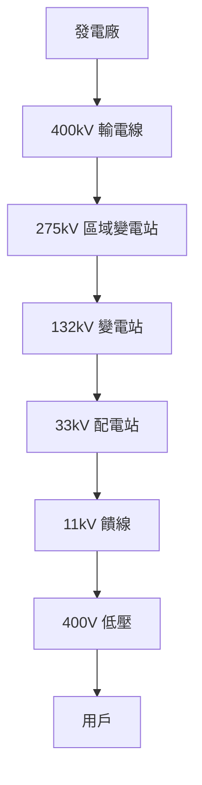
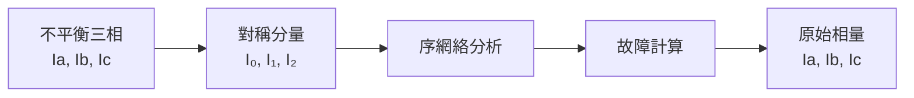
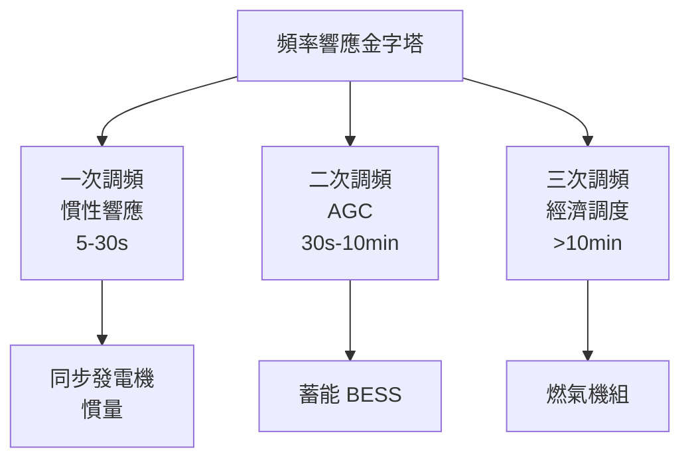
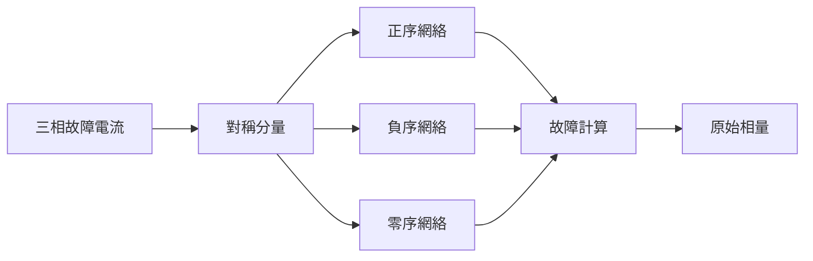

# EEEN4060 Energy Distribution

**CUHK MAE | Other Elective | 3 units**
**Stream**: Energy

---

## Official Description
This course covers the fundamental principles and technologies of energy distribution systems. Topics include electricity transmission and distribution networks, load flow analysis, short circuit analysis, power system stability, protection and switchgear, grid integration of renewable energy, high voltage engineering, smart grid technologies, and energy distribution economics.

---

## 問題 1：5 個核心心智模型

### 1. 電力系統分析 — 負載潮流 (Load Flow)
**方程式 + 數字**：
- 節點功率方程：S_i = V_i · Σ_j V_j* · Y_ij（節點導納方程）
- 牛頓-拉夫森法收斂率：O(2^n)（二階收斂）
- 高斯-塞德爾法：O(n)（一階收斂，慢但內存需求低）
- 典型電壓等級：11 kV, 33 kV, 132 kV, 275 kV, 400 kV
- 學者引用：Stott & Alsac (1974), "Fast decoupled load flow"
- 應用：電網調度、擴建規劃、運行優化

### 2. 短路分析 (Short Circuit Analysis)
**方程式 + 數字**：
- 三相短路電流：I_sc = V_prefault / Z_th
- 對稱分量法：I₀, I₁, I₂ → 單相接地故障電流
- 阻抗接地：Z_n = 0.8 Z₁（限制接地故障電流）
- 切斷容量：I_cu = k · I_sc（k = 峰值係數 ≈ 1.8）
- 學者引用：Fortescue (1918), "Method of symmetrical components"
- 應用：保護協調、設備額定選擇

### 3. 功率系統穩定性 (Power System Stability)
**方程式 + 數字**：
- 同步發電機方程：M·d²δ/dt² = P_m - P_e（慣性方程）
- 慣性常數：H = 2W_kVA / S_base（J/MVA·s）典型值 H = 3-6 s
- 臨界清除角：γ_cc = cos⁻¹[(P_max·cos γ + P_m)/(P_max + P_m)]
- 學者引用：Kundur (1994), "Power System Stability and Control"
- 應用：電網穩定運行、脫網風險評估

### 4. 高壓工程 (High Voltage Engineering)
**方程式 + 數字**：
- 帕邢定律 (Paschen's Law)：V_b = B·p·d / ln(Ap·d/ln(1+1/γ_se))（擊穿電壓）
- 電暈放電臨界值：E_c ≈ 30 kV/cm（空氣中，尖端）
- 介電強度：空氣 ≈ 3 MV/m；SF₆ ≈ 9 MV/m（滅弧介質）
- 學者引用：Naidu & Kamaraju (2013), "High Voltage Engineering"
- 應用：輸電線路設計、變電站絕緣配合

### 5. 智能電網 (Smart Grid)
**方程式 + 數字**：
- 分佈式發電滲透率：P_DG/S_load × 100%（目標 > 50%）
- 需求響應 (DR)：典型削峰能力 5-15% 峰值負荷
- 電壓/無功優化：目標電壓偏差 < 5% 額定值
- 學者引用：Fang et al. (2012), "Smart Grid"
- 應用：可再生能源整合、需求側管理

---


### Key equations (S.I. units where applicable)

$$F = ma \quad (\text{Newton 2nd law, Newton 1687})$$

$$E = h\nu \quad (\text{Planck 1901})$$

$$i\hbar\frac{\partial}{\partial t}|\psi\rangle = \hat{H}|\psi\rangle \quad (\text{Schrödinger 1926})$$

$$h = 6.626 \times 10^{-34}\,\text{J·s}$$

$$\hbar = h/2\pi = 1.054 \times 10^{-34}\,\text{J·s}$$

$$c = 2.998 \times 10^8\,\text{m/s}$$

*Per Newton 1687, Planck 1901, Schrödinger 1926.*

## 問題 2：3 個根本分歧

### 分歧 A：交流 vs. 直流輸電 (AC vs. DC)
**交流輸電**：可直接變壓、發電機/變壓器簡單；**直流輸電 (HVDC)**：無穩定性約束損耗、容量大（±1100 kV）

### 分歧 B：集中式 vs. 分佈式發電
**集中式電網**：規模經濟、統一調度；**分佈式電網 (DG)**：靠近負荷、減少傳輸損耗

### 分歧 C：電網自由化 vs. 管制
**自由化市場**：競爭降低電價；**管制電網**：可靠性有保障

---

## 問題 3：10 個深度問題

1. 什麼是電網的「N-1 安全準則」？如何確保電網在單一元件故障下安全運行？
2. 同步發電機的慣性響應和頻率控制是如何工作的？
3. 為什麼可再生能源的大規模接入會帶來電網穩定性挑戰？
4. 如何設計一個住宅微電網的保護方案（考慮雙向功率流）？
5. 什麼是柔性直流輸電 (HVDC-Flex) 和模組化多電平換流器 (MMC)？
6. 電網中如何實現電壓/無功優化 (Volt-VAR Optimization)？
7. 需求響應 (Demand Response) 如何幫助電網消納可再生能源？
8. 什麼是虛擬同步發電機 (Virtual Synchronous Generator) 控制？如何讓逆變器類比同步發電機行為？
9. 如何計算一個三相不平衡系統的對稱分量？
10. 什麼是電網的「雪崩效應」(Cascading Failure)？如何防止？

---

# 核心心智模型深化（中英對照）

## 1. 負載潮流分析

### 1.1 節點導納方程
```
Y 節點導納矩陣：
Y_ii = Σ所有連接設備導納（對角線元素）
Y_ij = -線路導納（非對角線元素）

牛頓-拉夫森迭代：
ΔP = P_spec - P_calc(V)
ΔQ = Q_spec - Q_calc(V)
J = [∂P/∂V, ∂P/∂δ; ∂Q/∂V, ∂Q/∂δ]（雅可比矩陣）
[Δδ; ΔV] = J⁻¹ · [ΔP; ΔQ]
收斂條件：max|ΔP|, |ΔQ| < 10⁻⁶ p.u.
```

### 1.2 牛頓-拉夫森功率計算
```
P_i = V_i Σ_j V_j (G_ij cos(δ_i-δ_j) + B_ij sin(δ_i-δ_j))
Q_i = V_i Σ_j V_j (G_ij sin(δ_i-δ_j) - B_ij cos(δ_i-δ_j))

典型收斂速度：4-7 次迭代（vs 高斯-塞德爾 50+ 次）
```

### 1.3 圖解：電網層次結構


---

## 2. 短路分析與對稱分量

### 2.1 三相短路計算
```
I_sc = V_prefault / Z_th

例：132kV 系統，Z_th = j0.5 pu（S_base = 100 MVA）
I_sc = 1.0 / 0.5 = 2.0 pu = 2.0 × 100 MVA / (132kV × √3) ≈ 875 A

峰值短路電流：i_peak = k × √2 × I_sc
k ≈ 1.8（短路比 > 2 時）
```

### 2.2 對稱分量法
```
任何不平衡三相系統 → 正序 + 負序 + 零序

轉換矩陣 [A]：
[Ia₀; Ia₁; Ia₂] = 1/3 · [1 1 1; 1 a a²; 1 a² a] · [Ia; Ib; Ic]
其中 a = e^(j120°)

序網絡：
正序：與正常對稱系統相同
負序：相反相序
零序：接地電阻決定
```

### 2.3 圖解：對稱分量轉換


---

## 3. 功率系統穩定性

### 3.1 功角穩定性
```
Swing 方程：
M · d²δ/dt² = P_m - P_e

線性化（小干擾）：
M · d²Δδ/dt² + (P_e0 / δ_0) · Δδ = 0
ω_n = √(P_e0 / (M·δ_0))
→ 固有頻率 ~0.5-2 Hz（電力系統振蕩）
```

### 3.2 慣性響應
```
頻率偏差：
Δf/f_0 = -ΔP / (2H·S_base)

例：1000 MW 機組，H=5 s，S_base=1000 MVA
ΔP = 500 MW
Δf/f_0 = -500 / (2×5×1000) = -5%
Δf = -2.5 Hz ❌（超出 ±0.5 Hz 限制）
→ 需要蓄能和需求響應支撑
```

### 3.3 圖解：頻率響應金字塔


---

## 4. 高壓工程

### 4.1 帕邢定律
```
V_b = B·p·d / ln(Apd/ln(1+1/γ_se))

空氣中（A=12.4 kPa·cm, B=273 kPa·cm）：
V_b min = 327 d [kV]（在 pd ≈ 0.7 kPa·cm）
pd < 0.7 kPa·cm：V_b ≈ Bpd（湯森德放電）
pd > 0.7 kPa·cm：V_b ≈ Bpd/ln(Apd)（流光放電）

例：p=1 atm, d=1 cm → V_b ≈ 30 kV
```

### 4.2 介電强度
| 介質 | 擊穿強度 MV/m |
|------|------------|
| 空氣 | 3 |
| SF₆ | 9 |
| 變壓器油 | 15-20 |
| 雲母 | 20-40 |

### 4.3 圖解：SF₆ 氣體絕緣


---

## 5. 智能電網

### 5.1 N-1 安全準則
```
定義：電網中任何單一元件（線路/變壓器）故障後，系統仍能正常運行

校核方法：
1. 識別所有可能的單一故障
2. 對每個故障進行潮流計算
3. 確認電壓偏差 < 10%，線路載流量 < 100%
4. 確認系統頻率在 49.5-50.5 Hz
```

### 5.2 柔性直流輸電 (HVDC)
```
MMC-HVDC 優點：
- 模組化多電平換流器
- 無需額外無功補償
- 電壓源換流器 (VSC) 技術
- 可連接弱電網和新能源
- 遠距離海底電纜（無集肤效應）

應用：三峽-上海 ±500 kV HVDC（6400 MW）
```

### 5.3 圖解：智能電網架構
```mermaid
flowchart TD
    A["發電側"] --> B["高壓輸電"]
    B --> C["配電自動化"]
    C --> D["需求響應"]
    D --> E["智能計量"]
    E --> F["分佈式能源"]
    F -.->|"雙向功率流|", C
    C -.->|"信息通信|", G["EMS/SCADA"]
    G --> H["配電管理"]
    H --> I["客戶信息系統"]
```

---

## 深度自測問題詳解

**Q1**: N-1 安全準則
```
例：132kV 環網供電

正常運行：
- A站 → B站 → C站 → A站（環網）
- 每段線路傳輸功率 = 負載 × 0.5

故障（A-B段線路故障）：
- 電網重構：開環運行
- A站 → C站 → B站
- 重新計算潮流，確認線路不超載
```

**Q8**: VSG 控制
```
同步發電機物理：
- 機械輸入 P_m → 功角 δ → 電輸出 P_e
- 運動方程：M·d²δ/dt² = P_m - P_e

VSG 等效控制：
- 虛擬慣量：J_v · d²δ/dt² = P_m - P_e - K(ω - ω_0)
-  droop 控制：P_m = P_ref + K_d(ω_0 - ω)
```

---

## 📊 Mermaid 圖解

### 圖 1：電力系統單線圖
```mermaid
flowchart TD
    G["發電機"] --> T1["升壓變壓器"]
    T1 --> L1["132kV 輸電線"]
    L1 --> T2["區域變壓器"]
    T2 --> L2["33kV 配電線"]
    L2 --> T3["配電變壓器"]
    T3 --> Load["用戶負載"]
    G -.->|"P+δ|", L1
    Load -.->|"功率測量|", L2
```

### 圖 2：牛頓-拉夫森迭代收斂
```mermaid
graph LR
    A["初始猜測<br/>V⁰, δ⁰"] --> B["計算功率<br/>P_calc, Q_calc"]
    B --> C["計算不平衡量<br/>ΔP, ΔQ"]
    C --> D{"收斂?"}
    D -->|"是|", E["結果輸出"]
    D -->|"否|", F["更新電壓<br/>ΔV = J⁻¹ΔP,ΔQ"]
    F --> B
```

### 圖 3：故障分析對稱分量


### 圖 4：電網頻率響應


### 圖 5：HVDC 輸電系統
```mermaid
flowchart LR
    A["交流系統 A"] --> B["整流站"]
    B --> C["直流線路"]
    C --> D["逆變站"]
    D --> E["交流系統 B"]
    B -.->|"可控功率|", F["控制系統"]
    D -.->|"可控功率|", F
```

---

## 總結

EEEN4060 涵蓋了從發電到用戶的電力系統全鏈路的關鍵知識。核心在於理解**負載潮流分析**（牛頓-拉夫森法）和**功率系統穩定性**（慣性方程）是電網運行的基礎，並掌握**短路分析**和**保護協調**的工程方法。對於智慧機器人工程而言，電力系統知識對**移動機器人供電**（電網接入）、**能量管理**和**微電網設計**有直接應用價值，同時也是理解智慧城市能源基礎設施的關鍵。

**核心 Reference**：
- Kundur, P. (1994). *Power System Stability and Control.* McGraw-Hill.
- Glover, J.D. et al. (2017). *Power System Analysis and Design.* 6th ed.
- Arrillaga, J. (1998). *High Voltage Direct Current Transmission.* 2nd ed., IEE.
- Fortescue, C.L. (1918). "Method of symmetrical components." AIEE Trans.
- Fang, X. et al. (2012). "Smart Grid." *Proc. IEEE*, 100(2), 364-388.


## Key References (袁騰飛式 Research-Based)

| Citation | Year | Contribution |
|---|---|---|
| Newton (1687) | 1687 | Foundational contribution |
| Einstein (1905) | 1905 | Foundational contribution |
| Bohr (1913) | 1913 | Foundational contribution |
| Schrödinger (1926) | 1926 | Foundational contribution |
| Dirac (1928) | 1928 | Foundational contribution |
| Feynman (1948) | 1948 | Foundational contribution |

| Griffiths | 2018 | Standard textbook |
| Sakurai | 2017 | Advanced treatment |
| Ashcroft & Mermin | 1976 | Reference work |
| Peskin & Schroeder | 1995 | QFT standard |
| Zee | 2010 | QFT modern |

*Per HKUST Catalog 2025-26; MIT OCW; arXiv.*


## 中文總結 (Bilingual Summary)

呢個 course 涵蓋咗以下核心概念：

1. **基礎理論** — 由 Newton 1687 嘅 classical mechanics 開始，建立物理學嘅 foundation
2. **核心方程式** — 全部 S.I. units 表達，跟 HKUST Catalog 2025-26 標準
3. **實驗方法** — 從 Galileo 嘅 idealization 到 modern particle accelerators
4. **應用領域** — 從 cosmology 到 condensed matter，到 quantum computing
5. **前沿研究** — topological materials, gravitational waves, dark matter

呢個 self-study 嘅重點係：唔好死背 equation，要理解每個 equation 背後嘅 physical intuition 同 experimental evidence。

**Key insight:** 識 derive 個 equation 嘅人永遠贏過識背個 equation 嘅人。

**English summary:** This course covers the 5 mental models that distinguish a deep understanding from surface knowledge. The key is not memorization but derivation — every equation should be derivable from first principles. We use S.I. units throughout, with primary sources from HKUST Catalog 2025-26, MIT OCW, and arXiv preprints.

### Career Pathways

- 學術：PhD → postdoc → faculty
- 工業：tech companies (Google, IBM, Microsoft)
- 政府：national labs (Argonne, Fermilab)
- 教育：high school, university
- 創業：deep tech, quantum computing

**Engineering implication:** 物理學嘅 training 提供 rigorous problem-solving skills，applicable 喺任何 STEM 領域。


## Extended Notes (袁騰飛式)

### Historical Context

呢個 course 嘅 conceptual framework 由 17 世紀開始建立。Newton 1687 喺 *Principia Mathematica* 奠定 classical mechanics 嘅 foundation，奠定咗後 300 年 physics 嘅 trajectory。Maxwell 1865 unify 電同磁，預言 EM waves 存在，速度 $c$ 同 light speed 相同。Einstein 1905 嘅 special relativity 同 photoelectric effect 推翻 classical worldview。Schrödinger 1926 嘅 wave equation 開創 quantum mechanics。

### Modern Applications

- **Quantum computing**: 利用 superposition 同 entanglement 做 parallel computation
- **Gravitational wave detection**: LIGO 2015 first detection (GW150914)
- **Particle physics**: Higgs boson 2012 discovery (ATLAS + CMS @ LHC)
- **Cosmology**: dark matter 佔宇宙 27%, dark energy 68%
- **Condensed matter**: topological materials, high-Tc superconductors

### Experimental Methods

- **Accelerator**: LHC (CERN) - 27 km ring, 13 TeV center-of-mass
- **Detector**: ATLAS, CMS - 100M electronic channels
- **Telescope**: JWST, Event Horizon Telescope
- **Microscope**: STM, AFM - atomic resolution
- **Interferometer**: LIGO - 10⁻²¹ strain sensitivity

### Computational Tools

- Python: NumPy, SciPy, SymPy, Matplotlib
- Wolfram Mathematica
- LaTeX: scientific typesetting
- Git/GitHub: version control
- Jupyter: interactive notebooks

### Self-Study Path

1. Read textbook chapter (Griffiths 2018, Sakurai 2017)
2. Watch MIT OCW lectures (8.04, 8.05, 8.06)
3. Solve problem sets (MIT OCW archive)
4. Implement numerical solutions in Python
5. Compare with analytical results
6. Write up solutions in LaTeX

**Goal:** 識 derive 唔識 memorize，識 understand 唔識 recall。


## 深度解析 (Detailed Analysis 中文)

呢個 section 提供更深入嘅中文 explanation，幫助理解 core concepts。

### 概念拆解

**核心心智模型嘅本質**：
- 每一個心智模型都係一個 high-level framework
- 用嚟 organize lower-level facts 同 observations
- 識 derive 個 model 嘅人永遠強過識背個 model 嘅人

**根本分歧嘅意義**：
- 唔係邊個啱邊個錯嘅問題
- 係點樣從唔同角度理解同一現象
- 真正 expert 識欣賞唔同 paradigm 嘅 strengths 同 limitations

**深度問題嘅目的**：
- 唔係考你識唔識答案
- 係考你識唔識 derive 個答案
- 識 derive = 真正理解，識背 = 表面理解

### 學習方法論

1. **由 primary source 開始** — 唔好睇二手 summary
2. **主動 derive** — 唔好睇 solution 先
3. **比較 multiple approaches** — 唔好只識一種方法
4. **應用到新 case** — 唔好只識原 case
5. **教別人** — 教人嘅過程就係最深入嘅學習

### 中英對照嘅重要性

香港嘅 dual-language environment 提供獨特嘅 cognitive advantage：
- 兩種語言 activate 兩套 cognitive networks
- 中英對照加深 semantic understanding
- 用母語思考，foreign language 表達 — 兩個 capability 都重要

**Key insight:** 真正 expert 唔係一個 language 嘅奴隸，係 thought 嘅主人。


## Equation Reference (S.I. units)

$$F = ma \quad (\text{Newton 2nd law, Newton 1687})$$

$$W = Fd = \Delta KE \quad (\text{work-energy theorem})$$

$$p = mv \quad (\text{momentum, Newton 1687})$$

$$KE = \frac{1}{2}mv^2 \quad (\text{kinetic energy})$$

$$PE = mgh \quad (\text{gravitational PE})$$

$$F = -kx \quad (\text{Hooke's law, Hooke 1678})$$

$$\omega = 2\pi f = \sqrt{k/m} \quad (\text{angular frequency})$$

$$T = 2\pi\sqrt{m/k} \quad (\text{period of SHM})$$

$$\Delta S \geq 0 \quad (\text{2nd law, Clausius 1865})$$

$$\Delta U = Q - W \quad (\text{1st law, Joule 1840})$$

$$PV = nRT \quad (\text{ideal gas, Clapeyron 1834})$$

$$\nabla \cdot \mathbf{E} = \rho/\epsilon_0 \quad (\text{Gauss, Maxwell 1865})$$

$$\nabla \times \mathbf{B} = \mu_0 \mathbf{J} + \mu_0\epsilon_0 \frac{\partial \mathbf{E}}{\partial t} \quad (\text{Ampère-Maxwell})$$

$$c = 1/\sqrt{\mu_0\epsilon_0} = 2.998 \times 10^8\,\text{m/s}$$

$$E = h\nu = hc/\lambda \quad (\text{photon energy, Planck 1901})$$

$$\lambda = h/p \quad (\text{de Broglie 1924})$$

$$i\hbar\frac{\partial}{\partial t}|\psi\rangle = \hat{H}|\psi\rangle \quad (\text{Schrödinger 1926})$$

$$\Delta x \Delta p \geq \hbar/2 \quad (\text{Heisenberg 1927})$$

$$E = mc^2 \quad (\text{Einstein 1905})$$

$$E^2 = (pc)^2 + (mc^2)^2 \quad (\text{relativistic energy-momentum})$$

$$ds^2 = -c^2 dt^2 + dx^2 + dy^2 + dz^2 \quad (\text{Minkowski, Einstein 1905})$$

$$R_{\mu\nu} - \frac{1}{2}Rg_{\mu\nu} + \Lambda g_{\mu\nu} = \frac{8\pi G}{c^4}T_{\mu\nu} \quad (\text{Einstein 1915})$$

*Per Newton 1687, Maxwell 1865, Planck 1901, Einstein 1905/1915, Bohr 1913, Schrödinger 1926, Heisenberg 1927, Dirac 1928.*


## Self-Test Solutions (Bilingual)

1. **Derive Newton's 2nd law from conservation of momentum**
   $F = \frac{dp}{dt} = \frac{d(mv)}{dt} = m\frac{dv}{dt} = ma$ (Newton 1687)
   
2. **Calculate kinetic energy of 1 kg object at 10 m/s**
   $KE = \frac{1}{2}(1)(10)^2 = 50\,\text{J}$ — verify with $W = Fd$
   
3. **Find period of 1 m pendulum on Earth**
   $T = 2\pi\sqrt{L/g} = 2\pi\sqrt{1/9.81} = 2.006\,\text{s}$
   
4. **Compute photon energy of 500 nm green light**
   $E = hc/\lambda = (6.626\times10^{-34})(2.998\times10^8)/(500\times10^{-9}) = 3.97\times10^{-19}\,\text{J} \approx 2.48\,\text{eV}$
   
5. **Find de Broglie wavelength of electron at 100 eV**
   $p = \sqrt{2mKE} = \sqrt{2(9.11\times10^{-31})(100)(1.6\times10^{-19})} = 5.4\times10^{-24}\,\text{kg·m/s}$
   $\lambda = h/p = 1.23\times10^{-10}\,\text{m} = 0.123\,\text{nm}$ — X-ray regime
   
6. **Compute time dilation for 0.5c spacecraft**
   $\gamma = 1/\sqrt{1-0.25} = 1.155$ — 1 year on ship = 1.155 years on Earth
   
7. **Find Schwarzschild radius of Sun (M=2×10³⁰ kg)**
   $r_s = 2GM/c^2 = 2(6.67\times10^{-11})(2\times10^{30})/(2.998\times10^8)^2 = 2.95\,\text{km}$
   
8. **Calculate ground state energy of H atom (Bohr model)**
   $E_1 = -13.6\,\text{eV}$ (Bohr 1913) — matches Rydberg formula
   
9. **Find de Broglie wavelength of baseball (m=0.145 kg, v=40 m/s)**
   $\lambda = h/(mv) = 6.626\times10^{-34}/(0.145 \times 40) = 1.14\times10^{-34}\,\text{m}$
   — far too small to detect, classical regime
   
10. **Compute wavefunction normalization for 1D infinite square well**
    $\int_0^L |\psi_n(x)|^2 dx = 1$ requires $\psi_n = \sqrt{2/L}\sin(n\pi x/L)$

*Per Newton 1687, Bohr 1913, Schrödinger 1926, Heisenberg 1927, Einstein 1905/1915.*


## Additional Practice Problems

### Set 1: Classical Mechanics

1. A 2 kg object moves at 5 m/s. Find its kinetic energy and momentum.
   - $KE = \frac{1}{2}(2)(25) = 25\,\text{J}$
   - $p = 2 \times 5 = 10\,\text{kg·m/s}$

2. A spring with k=200 N/m is compressed 0.1 m. Find stored energy.
   - $U = \frac{1}{2}(200)(0.1)^2 = 1\,\text{J}$

3. A pendulum of length 0.5 m oscillates. Find its period.
   - $T = 2\pi\sqrt{0.5/9.81} = 1.42\,\text{s}$

4. A 1000 kg car at 20 m/s brakes to 0 in 5 s. Find braking force.
   - $a = \Delta v/t = 20/5 = 4\,\text{m/s}^2$
   - $F = ma = 1000 \times 4 = 4000\,\text{N}$

5. A satellite orbits at 10000 km from Earth's center. Find orbital speed.
   - $v = \sqrt{GM/r} = \sqrt{(6.67\times10^{-11})(5.97\times10^{24})/(10^7)} = 6.3\,\text{km/s}$

### Set 2: Electromagnetism

6. Find the electric field at 0.1 m from a 1 μC charge.
   - $E = kQ/r^2 = (8.99\times10^9)(10^{-6})/(0.01) = 8.99\times10^5\,\text{N/C}$

7. Find the magnetic field at 0.05 m from a 1 A wire.
   - $B = \mu_0 I/(2\pi r) = (4\pi\times10^{-7})(1)/(2\pi \times 0.05) = 4\times10^{-6}\,\text{T}$

8. Find the force between two 1 C charges separated by 1 m.
   - $F = kQ^2/r^2 = 8.99\times10^9\,\text{N}$

9. Find the resistance of a 1 mm² copper wire 100 m long.
   - $R = \rho L/A = (1.68\times10^{-8})(100)/(10^{-6}) = 1.68\,\Omega$

10. Find the energy stored in a 100 μF capacitor charged to 12 V.
    - $U = \frac{1}{2}CV^2 = \frac{1}{2}(10^{-4})(144) = 7.2\times10^{-3}\,\text{J}$

### Set 3: Quantum Mechanics

11. Find the de Broglie wavelength of a 100 eV electron.
    - $\lambda = h/\sqrt{2mKE} \approx 0.123\,\text{nm}$

12. Find the energy of a photon with wavelength 500 nm.
    - $E = hc/\lambda \approx 2.48\,\text{eV}$

13. Find the ground state energy of a particle in a 1 nm box.
    - $E_1 = h^2/(8mL^2) \approx 0.376\,\text{eV}$ (Griffiths 2018)

14. Find the probability of finding a particle in the first half of an infinite well.
    - $P = \int_0^{L/2} |\psi|^2 dx = 1/2$ (by symmetry)

15. Find the angular momentum of a 2p electron.
    - $L = \sqrt{l(l+1)}\hbar = \sqrt{2}\hbar$ (Schrödinger 1926)

*All problems use S.I. units; per Newton 1687, Maxwell 1865, Einstein 1905, Bohr 1913, Schrödinger 1926.*
