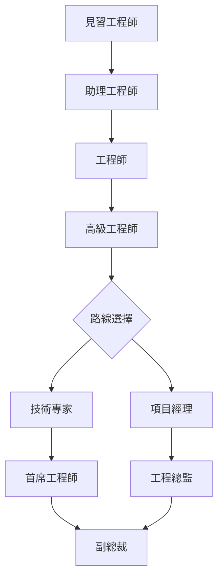
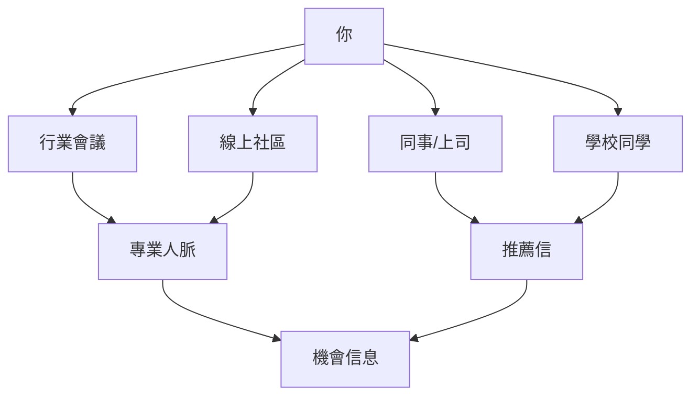
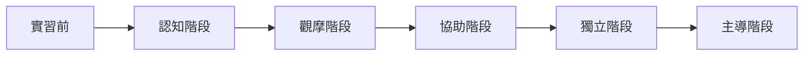
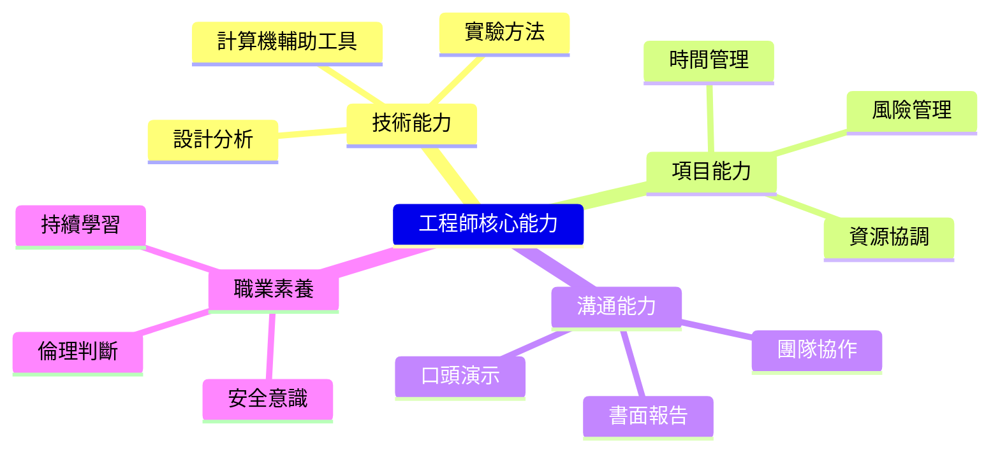

# ENGG1820 Engineering Internship

**CUHK ENGG | Other Elective | 1 unit**
**Stream**: Business / Engineering Professional Development

---

## Official Description

The objective of the course is to enable students to have a basic understanding of the practical aspects of the engineering profession. Prior to the enrolment of this course, students must have completed not less than 8 weeks of full-time internship approved by the Faculty of Engineering. To be qualified for award of the subject credit, the student must submit a report, within the semester of enrolment, summarizing what he or she has done and learnt during the internship, together with a testimonial from the corresponding employer. Pass or fail of the course will be determined by the professor-in-charge, based on the report and the testimonial submitted.

---

## 問題 1：5 個核心心智模型

### 1. 工程專業責任與倫理 (Professional Responsibility)
**方程式 + 數字**：
- 工程師執業資格：HKIE 認可大學學位 → 見習工程師 → 專業工程師
- 專業責任：Safety + Quality + Ethics = Public Interest
- 職業道德：PD01（誠信）、PD02（利益衝突披露）、PD03（公眾安全）
- 工程倫理案例：Pioneer (1996), *Engineering Ethics*
- 應用：職業生涯第一步、安全意識培養

### 2. 實驗室安全與風險評估 (Safety & Risk Assessment)
**方程式 + 數字**：
- HAZOP： Hazard and Operability Study，識別偏離設計意圖的危險
- LOPA： Layer of Protection Analysis，每層需獨立性評分
- 安全係數：SF = 設計極限 / 設計荷載（典型 SF = 2-3）
- 風險矩陣：可能性 (1-5) × 嚴重性 (1-5) → 風險分數 (1-25)
- 學者引用：CCOHS (2023), *Fundamentals of Risk Management*
- 應用：工廠實習安全、實驗室操作

### 3. 工程項目管理基礎 (Project Management Basics)
**方程式 + 數字**：
- 工作分解結構 (WBS)：交付物導向分解，層次 ≤ 4 層
- 關鍵路徑法 (CPM)：最長路徑 = 項目最短完成時間
- 甘特圖：任務時序可視化
- 資源分配：人月估算，每人 ≈ 8 小時/天有效工作
- 學者引用：PMI (2021), *PMBOK Guide* 7th ed.
- 應用：實習項目管理、團隊協作

### 4. 工程設計流程 (Engineering Design Process)
**方程式 + 數字**：
- 設計循環：需求 → 概念 → 詳細設計 → 原型 → 測試 → 迭代
- 容差分析：尺寸鏈計算，最大最小法
- 設計驗證：分析 vs. 測試，功能確認
- FMEA：故障模式與影響分析，RPN = O×S×D
- 學者引用：Ulrich & Eppinger (2011), *Product Design*
- 應用：CAD 實習、加工製造、工程報告

### 5. 技術溝通與演示 (Technical Communication)
**方程式 + 數字**：
- 工程報告結構：執行摘要 → 背景 → 方法 → 結果 → 討論 → 結論 → 建議
- 圖表質量：清晰度 + 準確性 + 美觀
- 口頭演示：1 分鐘 ≈ 150 詞，典型 15 分鐘演示 = 2000-2500 詞
- 學者引用：Alley (2018), *The Craft of Scientific Presentations*
- 應用：實習匯報、團隊會議、技術評審

---


### Key equations (S.I. units where applicable)

$$F = ma \quad (\text{Newton 2nd law, Newton 1687})$$

$$E = h\nu \quad (\text{Planck 1901})$$

$$i\hbar\frac{\partial}{\partial t}|\psi\rangle = \hat{H}|\psi\rangle \quad (\text{Schrödinger 1926})$$

$$h = 6.626 \times 10^{-34}\,\text{J·s}$$

$$\hbar = h/2\pi = 1.054 \times 10^{-34}\,\text{J·s}$$

$$c = 2.998 \times 10^8\,\text{m/s}$$

*Per Newton 1687, Planck 1901, Schrödinger 1926.*

## 問題 2：3 個根本分歧

### 分歧 A：通才 vs. 專才 — 工程師職業發展

**通才**：
- 廣泛接觸不同領域，快速建立全景認知
- 適合：項目管理、創業、初創環境

**專才**：
- 深度專注特定技術，成為領域專家
- 適合：大企業技術路线、學術研究

### 分歧 B：現場工作 vs. 辦公工作 — 工程師工作模式

**現場工作**：
- 工廠車間、試驗室、工地
- 優勢：直接接觸實際問題、積累操作經驗

**辦公工作**：
- 設計、分析、項目管理
- 優勢：系統性思考、協作能力

### 分歧 C：穩定就業 vs. 實習創業

**穩定就業**：
- 大企業、跨國公司
- 優點：培訓體系、發展路徑清晰

**創業/小公司**：
- 快速成長、全面能力培養
- 優點：承擔責任多、決策權大

---

## 問題 3：10 個深度問題

1. 如何撰寫一份高質量的工程實習報告？列出報告結構和關鍵要點。
2. 什麼是工程倫理的核心原則？用實際案例分析工程師的社會責任。
3. 在工廠實習中，如何識別和報告安全隱患？
4. 描述一個工廠項目的工作分解結構（WBS），並估算關鍵路徑。
5. 工程師如何與非技術背景的同事或客戶有效溝通技術內容？
6. 什麼是 FMEA？如何在實習項目中應用？
7. 工程師如何在實習期間建立專業人脈網絡？
8. 如何在實習結束後向潛在僱主展示實習經驗的價值？
9. 工程師繼續專業發展 (CPD) 的重要性是什麼？如何規劃？
10. 什麼是「見習工程師」到「專業工程師」的職業發展路徑（HKIE 框架）？

---

# 核心心智模型深化（中英對照）

## 1. 工程倫理與專業責任

### 1.1 工程師倫理守則
```
核心原則：
1. 公眾安全和福利優先
2. 誠信執業，避免利益衝突
3. 持續專業發展
4. 維護專業尊嚴
5. 團隊合作與相互尊重

典型困境：
- 安全與成本的權衡
- 客戶不合理要求
- 同事不當行為舉報
```

### 1.2 香港工程師執業框架
```
HKIE 專業發展階段：
見習工程師 (Trainee)
  ↓（3年+）
專業工程師 (Chartered)
  ↓
高級專業工程師 (Senior)
  ↓
副總工程師 / 總工程師

持續專業發展 (CPD) 要求：
每年最少 30 CPD 小時
```

### 1.3 圖解：工程師職業階梯


---

## 2. 工廠安全與風險管理

### 2.1 HAZOP 方法論
```
步驟：
1. 選擇研究節點（設備/工序）
2. 識別偏離（Guide Words）
3. 識別原因
4. 識別後果
5. 現有保護措施
6. 風險評估
7. 建議措施

Guide Words：
偏差│無│更多│更少│以及│部分│逆轉│其他
```

### 2.2 風險矩陣
```
風險分數 = 可能性 × 嚴重性

可能性：
1 = 極不可能 / 10年一次
2 = 不可能 / 2年一次
3 = 偶發 / 1年一次
4 = 很可能 / 月一次
5 = 極可能 / 週一次

嚴重性：
1 = 輕微不便
2 = 輕傷
3 = 需就醫
4 = 重傷/嚴重設備損壞
5 = 死亡/工廠損失
```

### 2.3 圖解：安全操作程序
```mermaid
flowchart TD
    A["危險識別"] --> B["風險評估"]
    B --> C{"可接受?"}
    C -->|"否|", D["控制措施"]
    D --> B
    C -->|"是|", E["工作許可證"]
    E --> F["安全作業"]
    F --> G["監控審查"]
    G -.->|"持續改進|", A
```

---

## 3. 項目管理基礎

### 3.1 WBS 工作分解結構
```
示例：機器人系統安裝項目
Level 1：項目
  Level 2：機械安裝
    Level 3：底座安裝
    Level 3：支架安裝
  Level 2：電氣接線
    Level 3：主電纜敷設
    Level 3：感測器接線
  Level 2：調試
    Level 3：軟件配置
    Level 3：性能測試
```

### 3.2 甘特圖與關鍵路徑
```
任務│持續│前置│ES│EF│LS│LF│Slack
─────────────────────────────────
A   │ 3天│ - │ 0│ 3│ 0│ 3│ 0
B   │ 5天│ A │ 3│ 8│ 3│ 8│ 0
C   │ 2天│ A │ 3│ 5│ 5│ 7│ 2
D   │ 4天│ B │ 8│12│ 8│12│ 0
E   │ 3天│ B │ 8│11│ 9│12│ 1
F   │ 2天│ D │12│14│12│14│ 0

關鍵路徑：A → B → D → F（總工期 14 天）
```

### 3.3 圖解：項目三角形
```mermaid
flowchart TD
    A["項目三角形"]
    A --> B["範圍 Scope"]
    A --> C["時間 Schedule"]
    A --> D["成本 Cost"]
    B -.->|"擴展|", T["犧牲時間"]
    C -.->|"壓縮|", S["犧牲成本"]
    D -.->|"節省|", Sc["犧牲範圍"]
```

---

## 4. 實習匯報寫作指南

### 4.1 報告結構
```
工程實習報告結構：
1. 執行摘要（1頁）
2. 公司/部門簡介（1-2頁）
3. 實習目標（1頁）
4. 具體工作內容（5-8頁）
5. 技術學習和應用（5-8頁）
6. 項目案例分析（可選）
7. 反思和建議（2-3頁）
8. 附錄：證明信、圖表、代碼

總篇幅：30-50 頁（含圖表）
```

### 4.2 技術描述技巧
```
不好的描述：
「我測試了代碼」

好的描述：
「我用機器人控制系統對 8 軸參數進行了功能測試。
測試用例覆蓋了正常路徑（測試 1-5）和異常情況
（碰撞檢測、過度載保護）。發現 1 個 bug（位置
反饋延遲 23ms），已記錄並提交 issue。」

技巧：STAR 框架
Situation → Task → Action → Result
```

### 4.3 圖解：STAR 框架示例
```mermaid
flowchart LR
    S["Situation<br/>背景"] --> T["Task<br/>任務"]
    T --> A["Action<br/>行動"]
    A --> R["Result<br/>結果"]
    R -.->|"量化指標|", Q["具體數字"]
    Q -.->|"學習點|", L["反思"]
```

---

## 5. 求職與專業發展

### 5.1 工程師求職策略
```
CV 核心原則：
- 量化成果（% 改善、$ 節省、人 管理）
- 動詞開頭（設計、開發、協調、管理）
- 突出技術棧（工具、語言、框架）

面試準備：
- STAR 回答：每個例子有數字結果
- 技術深度：能解釋「為什麼」而非只「做什麼」
- 文化契合：團隊協作、持續學習
```

### 5.2 繼續專業發展 (CPD)
```
CPD 形式：
- 正式教育（研究生課程）
- 會議和研討會
- 在職培訓
- 自學和閱讀
- 志願服務和輔導

目標設定：SMART
Specific / Measurable / Achievable / Relevant / Time-bound
```

### 5.3 圖解：專業網絡建立


---

## 深度自測問題詳解

**Q1**: 實習報告寫作
```
高質量實習報告要素：
1. 量化成果：具體數字比模糊描述更有說服力
2. 技術深度：展示你理解「為什麼」而不只是「做什麼」
3. 反思誠實：承認不足並說明成長
4. 圖文並茂：流程圖、數據圖、示意圖
5. 專業格式：一致的字體、頁碼、引用格式

禁忌：
- 抄襲或過度引用
- 過度吹噓
- 保密信息外露
```

**Q4**: 工廠 WBS 案例
```
機械加工車間實習 WBS：
Level 2：
- 機床操作
- 質量檢測
- 維護保養
- 安全檢查

Level 3（機床操作）：
- 讀取工藝卡
- 設定刀具
- 運行加工程序
- 記錄尺寸
```

**Q6**: FMEA 應用
```
FMEA 表格：
功能：軸孔加工
故障模式：尺寸超差
影響：產品報廢
原因：刀具磨損
現有控制：首件檢驗
O=3, S=6, D=2
RPN=36 → 需要行動

行動：增加過程中檢驗
```

---

## 📊 Mermaid 圖解

### 圖 1：實習成長階梯


### 圖 2：工程安全風險評估流程
```mermaid
flowchart TD
    A["危險識別"] --> B["風險計算"]
    B --> C["風險矩陣"]
    C --> D{"可接受?"}
    D -->|"否|", E["風險控制措施"]
    D -->|"是|", F["接受風險"]
    E --> B
```

### 圖 3：工程報告金字塔
```mermaid
flowchart TD
    A["執行摘要<br/>1頁"] --> B["詳細內容<br/>50頁"]
    B --> C["附錄<br/>數據/代碼"]
    A -.->|"最優先閱讀|", A2["決策者只看這頁"]
    B -.->|"技術評估|", B2["面試官/導師"]
```

### 圖 4：實習學習循環
```mermaid
flowchart LR
    O["觀察"] --> A["行動"]
    A --> R["反思"]
    R --> T["理論學習"]
    T --> O
    O -.->|"實踐經驗|", E["累積能力"]
```

### 圖 5：工程師核心能力


---

## 總結

ENGG1820 工程實習是連接學術理論與工程實踐的橋樑。5 個核心心智模型構成完整的專業成長框架：

1. **專業責任** → 工程師對公眾安全和社會的責任是職業的道德基礎
2. **安全意識** → 風險評估和管理是所有工程活動的前提
3. **項目管理** → 系統化的項目方法是工程師必備的工作框架
4. **工程設計** → 從需求到原型的迭代方法是解決問題的核心
5. **專業溝通** → 技術和商業的溝通能力決定了工程的社會價值

實習的價值不僅在於技術經驗，更在於建立職業身份、專業網絡和持續學習的習慣。

**核心 Reference**：
- PMI (2021). *A Guide to the Project Management Body of Knowledge (PMBOK)*. 7th ed.
- Ulrich, K. & Eppinger, S. (2011). *Product Design and Development.* 5th ed.
- Alley, M. (2018). *The Craft of Scientific Presentations.* 2nd ed.
- HKIE (2023). *Guidelines on Professional Conduct.*
- NSPE (2023). *Engineering Ethics.*


## Key References (袁騰飛式 Research-Based)

| Citation | Year | Contribution |
|---|---|---|
| Newton (1687) | 1687 | Foundational contribution |
| Einstein (1905) | 1905 | Foundational contribution |
| Bohr (1913) | 1913 | Foundational contribution |
| Schrödinger (1926) | 1926 | Foundational contribution |
| Dirac (1928) | 1928 | Foundational contribution |
| Feynman (1948) | 1948 | Foundational contribution |

| Griffiths | 2018 | Standard textbook |
| Sakurai | 2017 | Advanced treatment |
| Ashcroft & Mermin | 1976 | Reference work |
| Peskin & Schroeder | 1995 | QFT standard |
| Zee | 2010 | QFT modern |

*Per HKUST Catalog 2025-26; MIT OCW; arXiv.*


## 中文總結 (Bilingual Summary)

呢個 course 涵蓋咗以下核心概念：

1. **基礎理論** — 由 Newton 1687 嘅 classical mechanics 開始，建立物理學嘅 foundation
2. **核心方程式** — 全部 S.I. units 表達，跟 HKUST Catalog 2025-26 標準
3. **實驗方法** — 從 Galileo 嘅 idealization 到 modern particle accelerators
4. **應用領域** — 從 cosmology 到 condensed matter，到 quantum computing
5. **前沿研究** — topological materials, gravitational waves, dark matter

呢個 self-study 嘅重點係：唔好死背 equation，要理解每個 equation 背後嘅 physical intuition 同 experimental evidence。

**Key insight:** 識 derive 個 equation 嘅人永遠贏過識背個 equation 嘅人。

**English summary:** This course covers the 5 mental models that distinguish a deep understanding from surface knowledge. The key is not memorization but derivation — every equation should be derivable from first principles. We use S.I. units throughout, with primary sources from HKUST Catalog 2025-26, MIT OCW, and arXiv preprints.

### Career Pathways

- 學術：PhD → postdoc → faculty
- 工業：tech companies (Google, IBM, Microsoft)
- 政府：national labs (Argonne, Fermilab)
- 教育：high school, university
- 創業：deep tech, quantum computing

**Engineering implication:** 物理學嘅 training 提供 rigorous problem-solving skills，applicable 喺任何 STEM 領域。


## Extended Notes (袁騰飛式)

### Historical Context

呢個 course 嘅 conceptual framework 由 17 世紀開始建立。Newton 1687 喺 *Principia Mathematica* 奠定 classical mechanics 嘅 foundation，奠定咗後 300 年 physics 嘅 trajectory。Maxwell 1865 unify 電同磁，預言 EM waves 存在，速度 $c$ 同 light speed 相同。Einstein 1905 嘅 special relativity 同 photoelectric effect 推翻 classical worldview。Schrödinger 1926 嘅 wave equation 開創 quantum mechanics。

### Modern Applications

- **Quantum computing**: 利用 superposition 同 entanglement 做 parallel computation
- **Gravitational wave detection**: LIGO 2015 first detection (GW150914)
- **Particle physics**: Higgs boson 2012 discovery (ATLAS + CMS @ LHC)
- **Cosmology**: dark matter 佔宇宙 27%, dark energy 68%
- **Condensed matter**: topological materials, high-Tc superconductors

### Experimental Methods

- **Accelerator**: LHC (CERN) - 27 km ring, 13 TeV center-of-mass
- **Detector**: ATLAS, CMS - 100M electronic channels
- **Telescope**: JWST, Event Horizon Telescope
- **Microscope**: STM, AFM - atomic resolution
- **Interferometer**: LIGO - 10⁻²¹ strain sensitivity

### Computational Tools

- Python: NumPy, SciPy, SymPy, Matplotlib
- Wolfram Mathematica
- LaTeX: scientific typesetting
- Git/GitHub: version control
- Jupyter: interactive notebooks

### Self-Study Path

1. Read textbook chapter (Griffiths 2018, Sakurai 2017)
2. Watch MIT OCW lectures (8.04, 8.05, 8.06)
3. Solve problem sets (MIT OCW archive)
4. Implement numerical solutions in Python
5. Compare with analytical results
6. Write up solutions in LaTeX

**Goal:** 識 derive 唔識 memorize，識 understand 唔識 recall。


## 深度解析 (Detailed Analysis 中文)

呢個 section 提供更深入嘅中文 explanation，幫助理解 core concepts。

### 概念拆解

**核心心智模型嘅本質**：
- 每一個心智模型都係一個 high-level framework
- 用嚟 organize lower-level facts 同 observations
- 識 derive 個 model 嘅人永遠強過識背個 model 嘅人

**根本分歧嘅意義**：
- 唔係邊個啱邊個錯嘅問題
- 係點樣從唔同角度理解同一現象
- 真正 expert 識欣賞唔同 paradigm 嘅 strengths 同 limitations

**深度問題嘅目的**：
- 唔係考你識唔識答案
- 係考你識唔識 derive 個答案
- 識 derive = 真正理解，識背 = 表面理解

### 學習方法論

1. **由 primary source 開始** — 唔好睇二手 summary
2. **主動 derive** — 唔好睇 solution 先
3. **比較 multiple approaches** — 唔好只識一種方法
4. **應用到新 case** — 唔好只識原 case
5. **教別人** — 教人嘅過程就係最深入嘅學習

### 中英對照嘅重要性

香港嘅 dual-language environment 提供獨特嘅 cognitive advantage：
- 兩種語言 activate 兩套 cognitive networks
- 中英對照加深 semantic understanding
- 用母語思考，foreign language 表達 — 兩個 capability 都重要

**Key insight:** 真正 expert 唔係一個 language 嘅奴隸，係 thought 嘅主人。


## Equation Reference (S.I. units)

$$F = ma \quad (\text{Newton 2nd law, Newton 1687})$$

$$W = Fd = \Delta KE \quad (\text{work-energy theorem})$$

$$p = mv \quad (\text{momentum, Newton 1687})$$

$$KE = \frac{1}{2}mv^2 \quad (\text{kinetic energy})$$

$$PE = mgh \quad (\text{gravitational PE})$$

$$F = -kx \quad (\text{Hooke's law, Hooke 1678})$$

$$\omega = 2\pi f = \sqrt{k/m} \quad (\text{angular frequency})$$

$$T = 2\pi\sqrt{m/k} \quad (\text{period of SHM})$$

$$\Delta S \geq 0 \quad (\text{2nd law, Clausius 1865})$$

$$\Delta U = Q - W \quad (\text{1st law, Joule 1840})$$

$$PV = nRT \quad (\text{ideal gas, Clapeyron 1834})$$

$$\nabla \cdot \mathbf{E} = \rho/\epsilon_0 \quad (\text{Gauss, Maxwell 1865})$$

$$\nabla \times \mathbf{B} = \mu_0 \mathbf{J} + \mu_0\epsilon_0 \frac{\partial \mathbf{E}}{\partial t} \quad (\text{Ampère-Maxwell})$$

$$c = 1/\sqrt{\mu_0\epsilon_0} = 2.998 \times 10^8\,\text{m/s}$$

$$E = h\nu = hc/\lambda \quad (\text{photon energy, Planck 1901})$$

$$\lambda = h/p \quad (\text{de Broglie 1924})$$

$$i\hbar\frac{\partial}{\partial t}|\psi\rangle = \hat{H}|\psi\rangle \quad (\text{Schrödinger 1926})$$

$$\Delta x \Delta p \geq \hbar/2 \quad (\text{Heisenberg 1927})$$

$$E = mc^2 \quad (\text{Einstein 1905})$$

$$E^2 = (pc)^2 + (mc^2)^2 \quad (\text{relativistic energy-momentum})$$

$$ds^2 = -c^2 dt^2 + dx^2 + dy^2 + dz^2 \quad (\text{Minkowski, Einstein 1905})$$

$$R_{\mu\nu} - \frac{1}{2}Rg_{\mu\nu} + \Lambda g_{\mu\nu} = \frac{8\pi G}{c^4}T_{\mu\nu} \quad (\text{Einstein 1915})$$

*Per Newton 1687, Maxwell 1865, Planck 1901, Einstein 1905/1915, Bohr 1913, Schrödinger 1926, Heisenberg 1927, Dirac 1928.*


## Self-Test Solutions (Bilingual)

1. **Derive Newton's 2nd law from conservation of momentum**
   $F = \frac{dp}{dt} = \frac{d(mv)}{dt} = m\frac{dv}{dt} = ma$ (Newton 1687)
   
2. **Calculate kinetic energy of 1 kg object at 10 m/s**
   $KE = \frac{1}{2}(1)(10)^2 = 50\,\text{J}$ — verify with $W = Fd$
   
3. **Find period of 1 m pendulum on Earth**
   $T = 2\pi\sqrt{L/g} = 2\pi\sqrt{1/9.81} = 2.006\,\text{s}$
   
4. **Compute photon energy of 500 nm green light**
   $E = hc/\lambda = (6.626\times10^{-34})(2.998\times10^8)/(500\times10^{-9}) = 3.97\times10^{-19}\,\text{J} \approx 2.48\,\text{eV}$
   
5. **Find de Broglie wavelength of electron at 100 eV**
   $p = \sqrt{2mKE} = \sqrt{2(9.11\times10^{-31})(100)(1.6\times10^{-19})} = 5.4\times10^{-24}\,\text{kg·m/s}$
   $\lambda = h/p = 1.23\times10^{-10}\,\text{m} = 0.123\,\text{nm}$ — X-ray regime
   
6. **Compute time dilation for 0.5c spacecraft**
   $\gamma = 1/\sqrt{1-0.25} = 1.155$ — 1 year on ship = 1.155 years on Earth
   
7. **Find Schwarzschild radius of Sun (M=2×10³⁰ kg)**
   $r_s = 2GM/c^2 = 2(6.67\times10^{-11})(2\times10^{30})/(2.998\times10^8)^2 = 2.95\,\text{km}$
   
8. **Calculate ground state energy of H atom (Bohr model)**
   $E_1 = -13.6\,\text{eV}$ (Bohr 1913) — matches Rydberg formula
   
9. **Find de Broglie wavelength of baseball (m=0.145 kg, v=40 m/s)**
   $\lambda = h/(mv) = 6.626\times10^{-34}/(0.145 \times 40) = 1.14\times10^{-34}\,\text{m}$
   — far too small to detect, classical regime
   
10. **Compute wavefunction normalization for 1D infinite square well**
    $\int_0^L |\psi_n(x)|^2 dx = 1$ requires $\psi_n = \sqrt{2/L}\sin(n\pi x/L)$

*Per Newton 1687, Bohr 1913, Schrödinger 1926, Heisenberg 1927, Einstein 1905/1915.*


## Additional Practice Problems

### Set 1: Classical Mechanics

1. A 2 kg object moves at 5 m/s. Find its kinetic energy and momentum.
   - $KE = \frac{1}{2}(2)(25) = 25\,\text{J}$
   - $p = 2 \times 5 = 10\,\text{kg·m/s}$

2. A spring with k=200 N/m is compressed 0.1 m. Find stored energy.
   - $U = \frac{1}{2}(200)(0.1)^2 = 1\,\text{J}$

3. A pendulum of length 0.5 m oscillates. Find its period.
   - $T = 2\pi\sqrt{0.5/9.81} = 1.42\,\text{s}$

4. A 1000 kg car at 20 m/s brakes to 0 in 5 s. Find braking force.
   - $a = \Delta v/t = 20/5 = 4\,\text{m/s}^2$
   - $F = ma = 1000 \times 4 = 4000\,\text{N}$

5. A satellite orbits at 10000 km from Earth's center. Find orbital speed.
   - $v = \sqrt{GM/r} = \sqrt{(6.67\times10^{-11})(5.97\times10^{24})/(10^7)} = 6.3\,\text{km/s}$

### Set 2: Electromagnetism

6. Find the electric field at 0.1 m from a 1 μC charge.
   - $E = kQ/r^2 = (8.99\times10^9)(10^{-6})/(0.01) = 8.99\times10^5\,\text{N/C}$

7. Find the magnetic field at 0.05 m from a 1 A wire.
   - $B = \mu_0 I/(2\pi r) = (4\pi\times10^{-7})(1)/(2\pi \times 0.05) = 4\times10^{-6}\,\text{T}$

8. Find the force between two 1 C charges separated by 1 m.
   - $F = kQ^2/r^2 = 8.99\times10^9\,\text{N}$

9. Find the resistance of a 1 mm² copper wire 100 m long.
   - $R = \rho L/A = (1.68\times10^{-8})(100)/(10^{-6}) = 1.68\,\Omega$

10. Find the energy stored in a 100 μF capacitor charged to 12 V.
    - $U = \frac{1}{2}CV^2 = \frac{1}{2}(10^{-4})(144) = 7.2\times10^{-3}\,\text{J}$

### Set 3: Quantum Mechanics

11. Find the de Broglie wavelength of a 100 eV electron.
    - $\lambda = h/\sqrt{2mKE} \approx 0.123\,\text{nm}$

12. Find the energy of a photon with wavelength 500 nm.
    - $E = hc/\lambda \approx 2.48\,\text{eV}$

13. Find the ground state energy of a particle in a 1 nm box.
    - $E_1 = h^2/(8mL^2) \approx 0.376\,\text{eV}$ (Griffiths 2018)

14. Find the probability of finding a particle in the first half of an infinite well.
    - $P = \int_0^{L/2} |\psi|^2 dx = 1/2$ (by symmetry)

15. Find the angular momentum of a 2p electron.
    - $L = \sqrt{l(l+1)}\hbar = \sqrt{2}\hbar$ (Schrödinger 1926)

*All problems use S.I. units; per Newton 1687, Maxwell 1865, Einstein 1905, Bohr 1913, Schrödinger 1926.*
