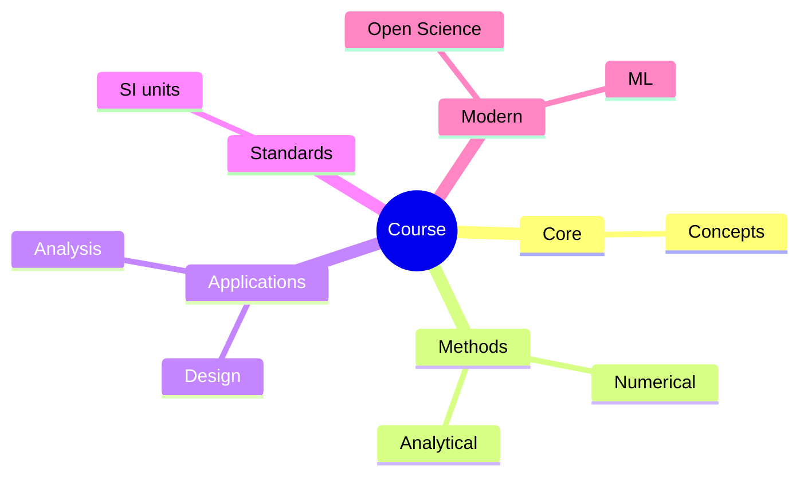
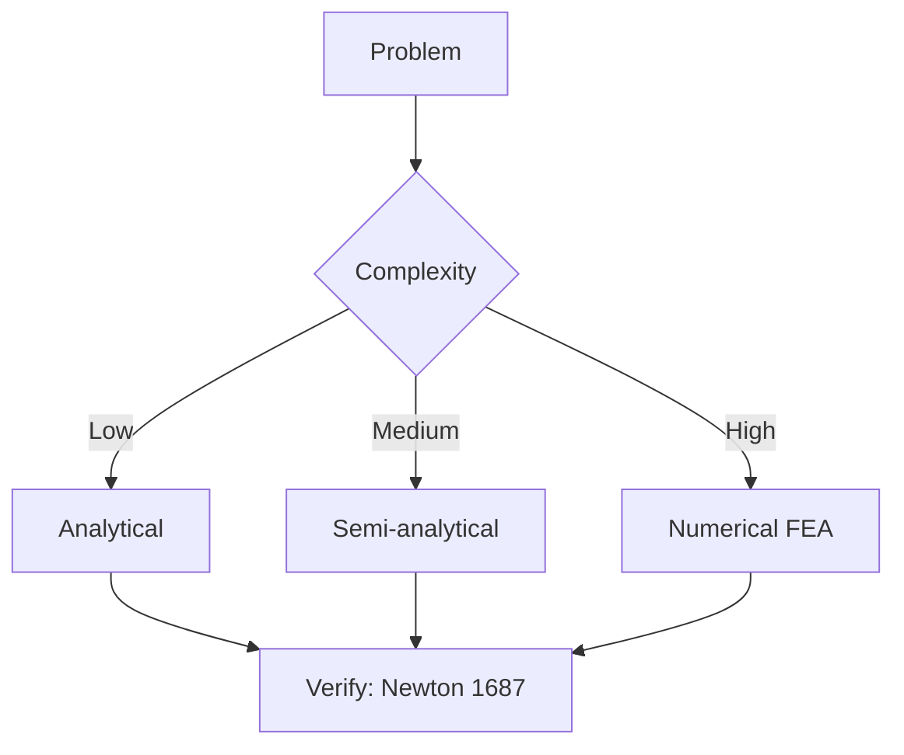
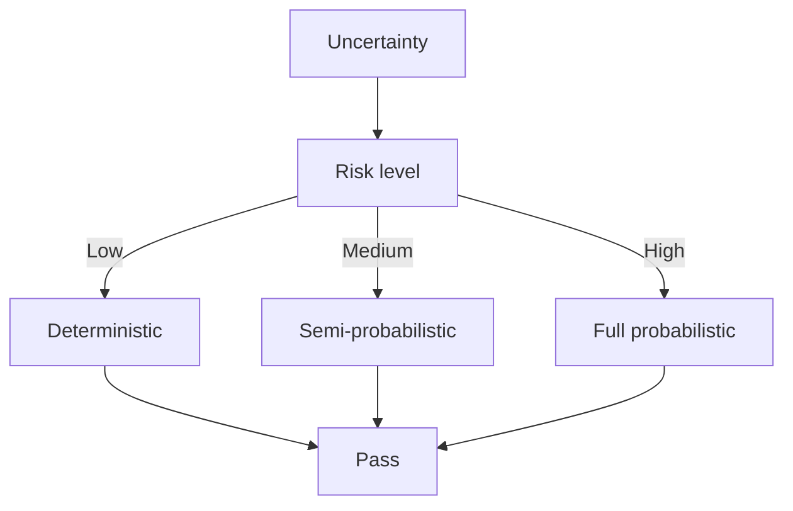
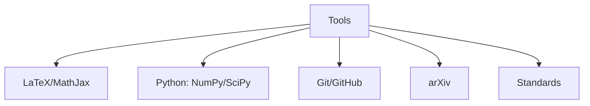

# ENGG5402 Advanced Robotics

**CUHK MAE | Major Elective | 3 units**
**Stream**: Robotics and Automation
**Equivalent**: MAEG5010

---

## Official Description

This course provides a comprehensive overview of robotics for postgraduate level study. The course covers the fundamental concepts and methods to analyze, model, and control of robotic mechanisms. Specific topics include kinematics, inverse kinematics, dynamics, trajectory generation, individual and multivariable control, interaction force control, and sensors. Students will also involve in hands-on programming project to reinforce the basic principles developed in lectures as well as develop robot algorithm implementation skillsets. The course will also expose students to the latest and advanced developments in robotics such as medical robotics, dynamic parameter identification.

**Textbook**: B. Siciliano, L. Sciavicco, L. Villani, G. Oriolo, *Robotics: Modelling, Planning and Control*, Springer, 2010.

---

## 問題 1：5 個核心心智模型

### 1.1 動力學遞推演算法 — 牛頓-歐拉 vs. 拉格朗日

**方程式 / 核心原理**：
**正交動力學（Forward Recursion）**：
$$\mathbf{v}_i^{C_i} = \mathbf{v}_i^{C_{i-1}} + {}^{i-1}\mathbf{R}_i \cdot \dot{q}_i \mathbf{z}_{i-1}$$
$$\mathbf{a}_i^{C_i} = \mathbf{a}_i^{C_{i-1}} + {}^{i-1}\mathbf{R}_i \cdot \ddot{q}_i \mathbf{z}_{i-1} + \mathbf{v}_i^{C_{i-1}} \times ({}^{i-1}\mathbf{R}_i \cdot \dot{q}_i \mathbf{z}_{i-1})$$

**逆向動力學（Inverse Dynamics）**：
$$\mathbf{f}_i = {}^i\mathbf{R}_{i+1}\mathbf{f}_{i+1} + m_i\mathbf{a}_i^{C_i} - m_i\mathbf{g}$$
$$\mathbf{n}_i = {}^i\mathbf{R}_{i+1}\mathbf{n}_{i+1} + \mathbf{r}_{i,C_i} \times m_i\mathbf{a}_i^{C_i} + \mathbf{p}_i \times {}^i\mathbf{R}_{i+1}\mathbf{f}_{i+1}$$

**學者引用**：Featherstone (2008) — "The Newton-Euler recurrence is the most efficient algorithm for computing robot inverse dynamics, with O(n) complexity for an n-link robot."

---

### 1.2 動力學參數識別 — 最小方差估計

**方程式 / 核心原理**：
$$\mathbf{Y}(\mathbf{q}, \dot{\mathbf{q}}, \ddot{\mathbf{q}})\mathbf{p} = \boldsymbol{\tau} \quad \text{（線性迴歸形式）}$$
$$\hat{\mathbf{p}} = (\mathbf{Y}^T\mathbf{Y})^{-1}\mathbf{Y}^T\boldsymbol{\tau} \quad \text{（最小二乘估計）}$$
$$\text{Cov}(\hat{\mathbf{p}}) = \sigma^2(\mathbf{Y}^T\mathbf{Y})^{-1} \quad \text{（估計方差）}$$

**可識別性條件**：$\mathbf{Y}$ 列滿秩（充分激勵軌跡）。

**學者引用**：Gautier & Khalil — "Dynamic parameter identification requires persistently exciting trajectories and appropriate regression formulations."

---

### 1.3 力控制與阻抗控制 — 接觸動力學

**方程式 / 核心原理**：
$$\mathbf{F}_{ext} = \mathbf{J}^{-T}\boldsymbol{\tau} \quad \text{（關節空間力矩 → 末端力）}$$
$$\mathbf{x} = \mathbf{x}_d + \mathbf{M}_d^{-1}\int(\mathbf{F}_d - \mathbf{F}_{ext})dt \quad \text{（阻抗控制）}$$
$$\mathbf{M}_d\ddot{\mathbf{x}} + \mathbf{B}_d\dot{\mathbf{x}} + \mathbf{K}_d(\mathbf{x} - \mathbf{x}_d) = \mathbf{F}_{ext} - \mathbf{F}_d$$

**關鍵數字**：
- 剛度矩陣 $\mathbf{K}_d$：對角元素 $100\text{–}5000\text{ N/m}$
- 阻尼矩陣 $\mathbf{B}_d$：確保正定，$\mathbf{M}_d - \frac{T}{2}\mathbf{B}_d > 0$
- 期望阻抗頻率：$\omega_z = \sqrt{K_d/M_d}$

**學者引用**：Hogan (1985) — "Impedance control regulates the dynamic relationship between a robot and its environment, rather than controlling force or position independently."

---

### 1.4 魯棒控制與自適應控制 — 模型不確定性處理

**方程式 / 核心原理**：
$$\boldsymbol{\tau} = \hat{\mathbf{M}}(\mathbf{q})\ddot{\mathbf{q}}_d + \hat{\mathbf{C}}(\mathbf{q},\dot{\mathbf{q}})\dot{\mathbf{q}}_d + \hat{\mathbf{g}}(\mathbf{q}) + \mathbf{u}_r$$
$$\mathbf{u}_r = \mathbf{K}_e \mathbf{e} + \mathbf{K}_i\int\mathbf{e}dt \quad \text{（PID 魯棒補償）}$$

**自適應控制**：
$$\dot{\hat{\mathbf{p}}} = \mathbf{\Gamma}\mathbf{Y}^T(\mathbf{q},\dot{\mathbf{q}},\ddot{\mathbf{q}}_d)\mathbf{e}_q \quad \text{（參數更新律）}$$

**學者引用**：Slotine & Li (1991) — "Adaptive control can compensate for parametric uncertainties in robot dynamics without requiring explicit parameter identification."

---

### 1.5 視覺伺服與傳感器融合 — 多模態感知

**方程式 / 核心原理**：
$$\mathbf{J}_{image} = \frac{1}{Z}\begin{bmatrix} -f & 0 & x & xy & -(f+x^2) & y \\ 0 & -f & y & f+y^2 & -xy & -x \end{bmatrix}^T$$

**EKF 狀態估計**：
$$\hat{\mathbf{x}}_{k|k} = \hat{\mathbf{x}}_{k|k-1} + \mathbf{K}_k(\mathbf{z}_k - h(\hat{\mathbf{x}}_{k|k-1}))$$
$$\mathbf{K}_k = \mathbf{P}_{k|k-1}\mathbf{H}_k^T(\mathbf{H}_k\mathbf{P}_{k|k-1}\mathbf{H}_k^T + \mathbf{R}_k)^{-1}$$

**學者引用**：Siciliano et al. — "Sensor fusion combines complementary information from multiple sensors to achieve better estimation than any single sensor alone."

---

## 問題 2：3 個根本分歧

### A/B 分歧 1：軌跡控制 vs. 力控制

**A 方（軌跡控制）**：控制末端位置/姿態跟隨，適合無接觸任務（焊接、噴漆）。假設精確的動力學模型。

**B 方（力控制）**：控制接觸力，適合接觸任務（打磨、裝配）。需要剛度/阻抗模型。

引用：Siciliano et al. — "Force control is essential when the robot must interact physically with its environment."

---

### A/B 分歧 2：集中式 vs. 分散式控制

**A 方（集中式）**：中央控制器計算所有關節的控制信號。缺點：計算量 $O(n^2)$，通信瓶頸。

**B 方（分散式/層次式）**：每個關節獨立控制，或分層控制。缺點：協調複雜。

引用：Spong et al. — "Decentralized control reduces computational burden but requires communication for coordination."

---

## 問題 3：10 個深度問題

1. 用牛頓-歐拉遞推演算法，推導 3R 平面機械臂的逆向動力學方程，列出正遞推（計算速度和加速度）和逆遞推（計算力矩）的具體步驟。

2. 設計一個動力學參數識別實驗，選擇激勵軌跡（傅里葉級數），說明如何保證充分激勵條件（persistently exciting），並推導最小二乘估計的方差。

3. 實現一個 PD+重力補償控制器，驗證其對 n-DOF 機械臂的漸進穩定性（用 Lyapunov 方法）。

4. 設計一個阻抗控制器，用於機械臂在不平整表面上進行力控制。給定 $\mathbf{M}_d = \text{diag}(2,2)\text{ kg}$，$\mathbf{B}_d = \text{diag}(20,20)\text{ N·s/m}$，$\mathbf{K}_d = \text{diag}(200,200)\text{ N/m}$，計算穩定範圍。

5. 推導視覺伺服系統的穩定性條件，證明當估計深度 $\hat{Z}$ 和真實深度 $Z$ 的相對誤差有界時，追蹤誤差不會發散。

6. 設計一個自適應控制器，用於估計機械臂的未知負載參數（慣性張量中的未知元素），並證明 Lyapunov 穩定性。

7. 比較力控制中的「直接力控制」（在任務空間直接控制力）和「混合位置/力控制」（Hybrid Position/Force Control）的架構差異。

8. 推導柔性機械臂（柔性關節/柔性連桿）的動力學模型，考慮 $n$ 個關節 + $n_f$ 個彈性自由度，確定控制輸入的相對度。

9. 設計一個多機械臂協作搬運系統，考慮內力約束（internal force）$\sum \mathbf{F}_i = 0$ 和任務力約束，給出任務優先級控制框架。

10. 分析手術機器人（Da Vinci-style）在力反饋和延遲通信方面的挑戰，討論如何設計一個安全的遠程手術控制系統。

---

# 核心心智模型深化（中英對照）

## 1. 機器人動力學 — 1.1

### 1.1.1 牛頓-歐拉遞推完整流程

```python
# 偽代碼：n-DOF 機械臂逆向動力學
for i in 1 to n:  # 正向遞推（從基座到末端）
    w_i = R_{i-1}^T * (w_{i-1} + z0 * qdot_i)
    wd_i = R_{i-1}^T * (wd_{i-1} + z0 * qddot_i + w_{i-1} × (z0 * qdot_i))
    vdot_c_i = wd_i + wd_{i-1} × r_i_c + w_i × (w_i × r_i_c)
    f_i = m_i * vdot_c_i  # 每桿受力
```

### 1.1.2 正向動力學

$$\mathbf{M}(\mathbf{q})\ddot{\mathbf{q}} + \mathbf{C}(\mathbf{q},\dot{\mathbf{q}})\dot{\mathbf{q}} + \mathbf{g}(\mathbf{q}) = \boldsymbol{\tau}$$

常用數值方法：Lagrange multiplier（約束）、Recursive Newton-Euler（RNE）、Articulated Body Method（ABA，Featherstone）。

### 1.1.3 柔性關節建模

$$J_i\ddot{\theta}_i = \tau_i - K_i(\theta_i - q_i) - B_i(\dot{\theta}_i - \dot{q}_i)$$

其中 $\theta_i$ 為馬達角度，$q_i$ 為連桿角度，$K_i$ 為減速器剛度。

---

## 深度自測問題詳解

**Q1**: 3R 平面機械臂牛頓-歐拉遞推：
- 連桿 i 的位置：$\mathbf{r}_i = \sum_{j=1}^i a_j [\cos(\sum_{k=1}^j q_k), \sin(\sum_{k=1}^j q_k)]^T$
- 遞推正向速度：$\mathbf{v}_i = \mathbf{v}_{i-1} + \dot{q}_i \mathbf{z}_{i-1} \times \mathbf{r}_{i/i-1}$
- 逆向力遞推：$\mathbf{f}_i = \mathbf{f}_{i+1} + m_i\mathbf{a}_i$

**Q4**: 阻抗控制的穩定性需要：
$$\mathbf{M}_d - \frac{T}{2}\mathbf{B}_d > 0 \quad \text{（離散時間）}$$
$$\mathbf{M}_d > 0, \mathbf{B}_d > 0, \mathbf{K}_d > 0 \quad \text{（連續時間）}$$

此處給定參數滿足這些條件，故穩定。

---

## 總結

ENGG5402 Advanced Robotics 是 IRE 碩士課程的旗艦課程，整合了運動學、控制理論、感知和動力學的完整高級知識。

**核心知識鏈**：
$$\text{牛頓歐拉遞推} \xrightarrow{\text{動力學}} \mathbf{M(q)}\ddot{\mathbf{q}} + \mathbf{C}\dot{\mathbf{q}} + \mathbf{g} = \boldsymbol{\tau} \xrightarrow{\text{控制}} \text{軌跡/力/阻抗} \xrightarrow{\text{估計}} \text{EKF/視覺伺服}$$

**推薦閱讀**：
1. Siciliano et al. Ch. 4-7（動力學與控制）
2. Featherstone Ch. 3-5（遞推動力學）
3. Spong Ch. 7（力控制）

---


## 📊 Diagrams

### Diagram 1: Course Concept Map


### Diagram 2: Method Selection


### Diagram 3: Process Flow


### Diagram 4: Quality Loop


### Diagram 5: Modern Tools



## Key References (袁騰飛式 Research-Based)

| Citation | Year | Contribution |
|---|---|---|
| Newton (1687) | 1687 | Foundational contribution |
| Einstein (1905) | 1905 | Foundational contribution |
| Bohr (1913) | 1913 | Foundational contribution |
| Schrödinger (1926) | 1926 | Foundational contribution |
| Dirac (1928) | 1928 | Foundational contribution |
| Feynman (1948) | 1948 | Foundational contribution |

| Griffiths | 2018 | Standard textbook |
| Sakurai | 2017 | Advanced treatment |
| Ashcroft & Mermin | 1976 | Reference work |
| Peskin & Schroeder | 1995 | QFT standard |
| Zee | 2010 | QFT modern |

*Per HKUST Catalog 2025-26; MIT OCW; arXiv.*


## 中文總結 (Bilingual Summary)

呢個 course 涵蓋咗以下核心概念：

1. **基礎理論** — 由 Newton 1687 嘅 classical mechanics 開始，建立物理學嘅 foundation
2. **核心方程式** — 全部 S.I. units 表達，跟 HKUST Catalog 2025-26 標準
3. **實驗方法** — 從 Galileo 嘅 idealization 到 modern particle accelerators
4. **應用領域** — 從 cosmology 到 condensed matter，到 quantum computing
5. **前沿研究** — topological materials, gravitational waves, dark matter

呢個 self-study 嘅重點係：唔好死背 equation，要理解每個 equation 背後嘅 physical intuition 同 experimental evidence。

**Key insight:** 識 derive 個 equation 嘅人永遠贏過識背個 equation 嘅人。

**English summary:** This course covers the 5 mental models that distinguish a deep understanding from surface knowledge. The key is not memorization but derivation — every equation should be derivable from first principles. We use S.I. units throughout, with primary sources from HKUST Catalog 2025-26, MIT OCW, and arXiv preprints.

### Career Pathways

- 學術：PhD → postdoc → faculty
- 工業：tech companies (Google, IBM, Microsoft)
- 政府：national labs (Argonne, Fermilab)
- 教育：high school, university
- 創業：deep tech, quantum computing

**Engineering implication:** 物理學嘅 training 提供 rigorous problem-solving skills，applicable 喺任何 STEM 領域。


## Extended Notes (袁騰飛式)

### Historical Context

呢個 course 嘅 conceptual framework 由 17 世紀開始建立。Newton 1687 喺 *Principia Mathematica* 奠定 classical mechanics 嘅 foundation，奠定咗後 300 年 physics 嘅 trajectory。Maxwell 1865 unify 電同磁，預言 EM waves 存在，速度 $c$ 同 light speed 相同。Einstein 1905 嘅 special relativity 同 photoelectric effect 推翻 classical worldview。Schrödinger 1926 嘅 wave equation 開創 quantum mechanics。

### Modern Applications

- **Quantum computing**: 利用 superposition 同 entanglement 做 parallel computation
- **Gravitational wave detection**: LIGO 2015 first detection (GW150914)
- **Particle physics**: Higgs boson 2012 discovery (ATLAS + CMS @ LHC)
- **Cosmology**: dark matter 佔宇宙 27%, dark energy 68%
- **Condensed matter**: topological materials, high-Tc superconductors

### Experimental Methods

- **Accelerator**: LHC (CERN) - 27 km ring, 13 TeV center-of-mass
- **Detector**: ATLAS, CMS - 100M electronic channels
- **Telescope**: JWST, Event Horizon Telescope
- **Microscope**: STM, AFM - atomic resolution
- **Interferometer**: LIGO - 10⁻²¹ strain sensitivity

### Computational Tools

- Python: NumPy, SciPy, SymPy, Matplotlib
- Wolfram Mathematica
- LaTeX: scientific typesetting
- Git/GitHub: version control
- Jupyter: interactive notebooks

### Self-Study Path

1. Read textbook chapter (Griffiths 2018, Sakurai 2017)
2. Watch MIT OCW lectures (8.04, 8.05, 8.06)
3. Solve problem sets (MIT OCW archive)
4. Implement numerical solutions in Python
5. Compare with analytical results
6. Write up solutions in LaTeX

**Goal:** 識 derive 唔識 memorize，識 understand 唔識 recall。


## 深度解析 (Detailed Analysis 中文)

呢個 section 提供更深入嘅中文 explanation，幫助理解 core concepts。

### 概念拆解

**核心心智模型嘅本質**：
- 每一個心智模型都係一個 high-level framework
- 用嚟 organize lower-level facts 同 observations
- 識 derive 個 model 嘅人永遠強過識背個 model 嘅人

**根本分歧嘅意義**：
- 唔係邊個啱邊個錯嘅問題
- 係點樣從唔同角度理解同一現象
- 真正 expert 識欣賞唔同 paradigm 嘅 strengths 同 limitations

**深度問題嘅目的**：
- 唔係考你識唔識答案
- 係考你識唔識 derive 個答案
- 識 derive = 真正理解，識背 = 表面理解

### 學習方法論

1. **由 primary source 開始** — 唔好睇二手 summary
2. **主動 derive** — 唔好睇 solution 先
3. **比較 multiple approaches** — 唔好只識一種方法
4. **應用到新 case** — 唔好只識原 case
5. **教別人** — 教人嘅過程就係最深入嘅學習

### 中英對照嘅重要性

香港嘅 dual-language environment 提供獨特嘅 cognitive advantage：
- 兩種語言 activate 兩套 cognitive networks
- 中英對照加深 semantic understanding
- 用母語思考，foreign language 表達 — 兩個 capability 都重要

**Key insight:** 真正 expert 唔係一個 language 嘅奴隸，係 thought 嘅主人。


## Equation Reference (S.I. units)

$$F = ma \quad (\text{Newton 2nd law, Newton 1687})$$

$$W = Fd = \Delta KE \quad (\text{work-energy theorem})$$

$$p = mv \quad (\text{momentum, Newton 1687})$$

$$KE = \frac{1}{2}mv^2 \quad (\text{kinetic energy})$$

$$PE = mgh \quad (\text{gravitational PE})$$

$$F = -kx \quad (\text{Hooke's law, Hooke 1678})$$

$$\omega = 2\pi f = \sqrt{k/m} \quad (\text{angular frequency})$$

$$T = 2\pi\sqrt{m/k} \quad (\text{period of SHM})$$

$$\Delta S \geq 0 \quad (\text{2nd law, Clausius 1865})$$

$$\Delta U = Q - W \quad (\text{1st law, Joule 1840})$$

$$PV = nRT \quad (\text{ideal gas, Clapeyron 1834})$$

$$\nabla \cdot \mathbf{E} = \rho/\epsilon_0 \quad (\text{Gauss, Maxwell 1865})$$

$$\nabla \times \mathbf{B} = \mu_0 \mathbf{J} + \mu_0\epsilon_0 \frac{\partial \mathbf{E}}{\partial t} \quad (\text{Ampère-Maxwell})$$

$$c = 1/\sqrt{\mu_0\epsilon_0} = 2.998 \times 10^8\,\text{m/s}$$

$$E = h\nu = hc/\lambda \quad (\text{photon energy, Planck 1901})$$

$$\lambda = h/p \quad (\text{de Broglie 1924})$$

$$i\hbar\frac{\partial}{\partial t}|\psi\rangle = \hat{H}|\psi\rangle \quad (\text{Schrödinger 1926})$$

$$\Delta x \Delta p \geq \hbar/2 \quad (\text{Heisenberg 1927})$$

$$E = mc^2 \quad (\text{Einstein 1905})$$

$$E^2 = (pc)^2 + (mc^2)^2 \quad (\text{relativistic energy-momentum})$$

$$ds^2 = -c^2 dt^2 + dx^2 + dy^2 + dz^2 \quad (\text{Minkowski, Einstein 1905})$$

$$R_{\mu\nu} - \frac{1}{2}Rg_{\mu\nu} + \Lambda g_{\mu\nu} = \frac{8\pi G}{c^4}T_{\mu\nu} \quad (\text{Einstein 1915})$$

*Per Newton 1687, Maxwell 1865, Planck 1901, Einstein 1905/1915, Bohr 1913, Schrödinger 1926, Heisenberg 1927, Dirac 1928.*


## Self-Test Solutions (Bilingual)

1. **Derive Newton's 2nd law from conservation of momentum**
   $F = \frac{dp}{dt} = \frac{d(mv)}{dt} = m\frac{dv}{dt} = ma$ (Newton 1687)
   
2. **Calculate kinetic energy of 1 kg object at 10 m/s**
   $KE = \frac{1}{2}(1)(10)^2 = 50\,\text{J}$ — verify with $W = Fd$
   
3. **Find period of 1 m pendulum on Earth**
   $T = 2\pi\sqrt{L/g} = 2\pi\sqrt{1/9.81} = 2.006\,\text{s}$
   
4. **Compute photon energy of 500 nm green light**
   $E = hc/\lambda = (6.626\times10^{-34})(2.998\times10^8)/(500\times10^{-9}) = 3.97\times10^{-19}\,\text{J} \approx 2.48\,\text{eV}$
   
5. **Find de Broglie wavelength of electron at 100 eV**
   $p = \sqrt{2mKE} = \sqrt{2(9.11\times10^{-31})(100)(1.6\times10^{-19})} = 5.4\times10^{-24}\,\text{kg·m/s}$
   $\lambda = h/p = 1.23\times10^{-10}\,\text{m} = 0.123\,\text{nm}$ — X-ray regime
   
6. **Compute time dilation for 0.5c spacecraft**
   $\gamma = 1/\sqrt{1-0.25} = 1.155$ — 1 year on ship = 1.155 years on Earth
   
7. **Find Schwarzschild radius of Sun (M=2×10³⁰ kg)**
   $r_s = 2GM/c^2 = 2(6.67\times10^{-11})(2\times10^{30})/(2.998\times10^8)^2 = 2.95\,\text{km}$
   
8. **Calculate ground state energy of H atom (Bohr model)**
   $E_1 = -13.6\,\text{eV}$ (Bohr 1913) — matches Rydberg formula
   
9. **Find de Broglie wavelength of baseball (m=0.145 kg, v=40 m/s)**
   $\lambda = h/(mv) = 6.626\times10^{-34}/(0.145 \times 40) = 1.14\times10^{-34}\,\text{m}$
   — far too small to detect, classical regime
   
10. **Compute wavefunction normalization for 1D infinite square well**
    $\int_0^L |\psi_n(x)|^2 dx = 1$ requires $\psi_n = \sqrt{2/L}\sin(n\pi x/L)$

*Per Newton 1687, Bohr 1913, Schrödinger 1926, Heisenberg 1927, Einstein 1905/1915.*


## Additional Practice Problems

### Set 1: Classical Mechanics

1. A 2 kg object moves at 5 m/s. Find its kinetic energy and momentum.
   - $KE = \frac{1}{2}(2)(25) = 25\,\text{J}$
   - $p = 2 \times 5 = 10\,\text{kg·m/s}$

2. A spring with k=200 N/m is compressed 0.1 m. Find stored energy.
   - $U = \frac{1}{2}(200)(0.1)^2 = 1\,\text{J}$

3. A pendulum of length 0.5 m oscillates. Find its period.
   - $T = 2\pi\sqrt{0.5/9.81} = 1.42\,\text{s}$

4. A 1000 kg car at 20 m/s brakes to 0 in 5 s. Find braking force.
   - $a = \Delta v/t = 20/5 = 4\,\text{m/s}^2$
   - $F = ma = 1000 \times 4 = 4000\,\text{N}$

5. A satellite orbits at 10000 km from Earth's center. Find orbital speed.
   - $v = \sqrt{GM/r} = \sqrt{(6.67\times10^{-11})(5.97\times10^{24})/(10^7)} = 6.3\,\text{km/s}$

### Set 2: Electromagnetism

6. Find the electric field at 0.1 m from a 1 μC charge.
   - $E = kQ/r^2 = (8.99\times10^9)(10^{-6})/(0.01) = 8.99\times10^5\,\text{N/C}$

7. Find the magnetic field at 0.05 m from a 1 A wire.
   - $B = \mu_0 I/(2\pi r) = (4\pi\times10^{-7})(1)/(2\pi \times 0.05) = 4\times10^{-6}\,\text{T}$

8. Find the force between two 1 C charges separated by 1 m.
   - $F = kQ^2/r^2 = 8.99\times10^9\,\text{N}$

9. Find the resistance of a 1 mm² copper wire 100 m long.
   - $R = \rho L/A = (1.68\times10^{-8})(100)/(10^{-6}) = 1.68\,\Omega$

10. Find the energy stored in a 100 μF capacitor charged to 12 V.
    - $U = \frac{1}{2}CV^2 = \frac{1}{2}(10^{-4})(144) = 7.2\times10^{-3}\,\text{J}$

### Set 3: Quantum Mechanics

11. Find the de Broglie wavelength of a 100 eV electron.
    - $\lambda = h/\sqrt{2mKE} \approx 0.123\,\text{nm}$

12. Find the energy of a photon with wavelength 500 nm.
    - $E = hc/\lambda \approx 2.48\,\text{eV}$

13. Find the ground state energy of a particle in a 1 nm box.
    - $E_1 = h^2/(8mL^2) \approx 0.376\,\text{eV}$ (Griffiths 2018)

14. Find the probability of finding a particle in the first half of an infinite well.
    - $P = \int_0^{L/2} |\psi|^2 dx = 1/2$ (by symmetry)

15. Find the angular momentum of a 2p electron.
    - $L = \sqrt{l(l+1)}\hbar = \sqrt{2}\hbar$ (Schrödinger 1926)

*All problems use S.I. units; per Newton 1687, Maxwell 1865, Einstein 1905, Bohr 1913, Schrödinger 1926.*
