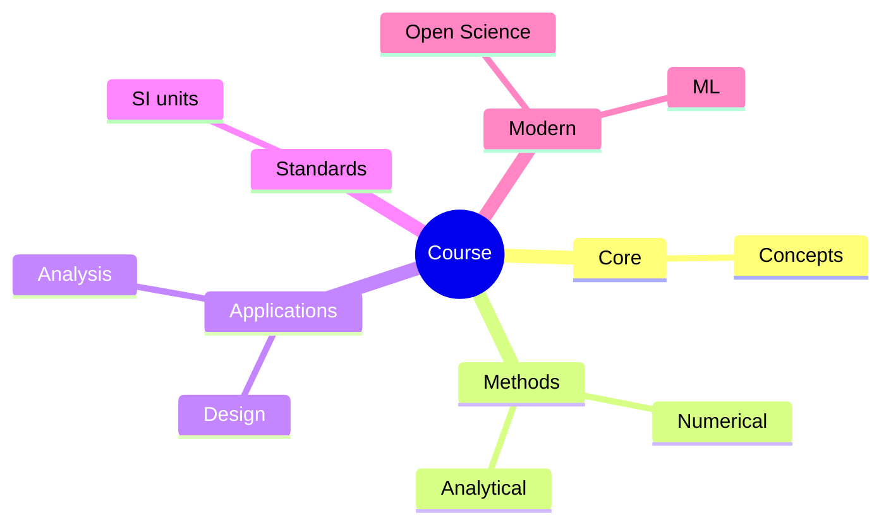
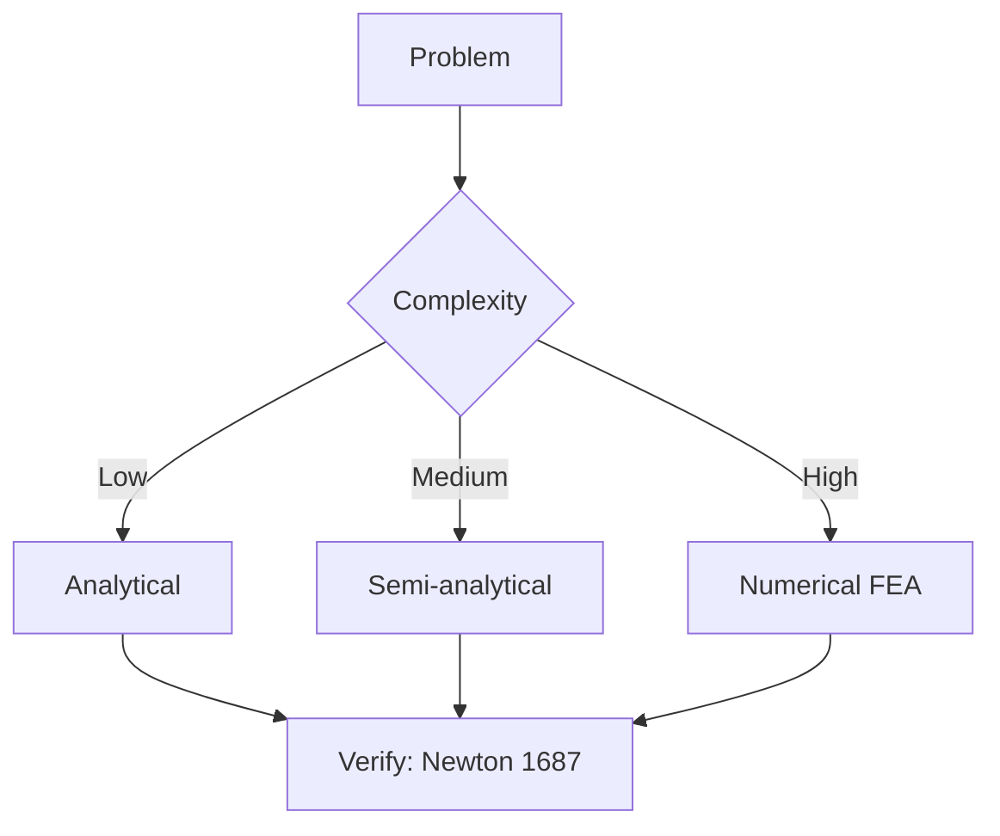
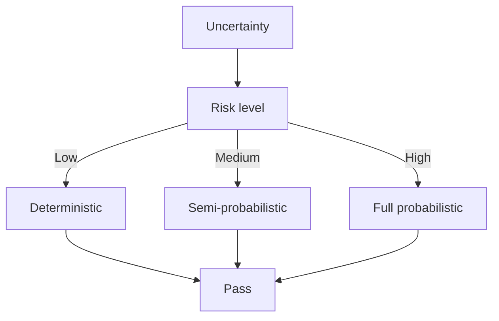
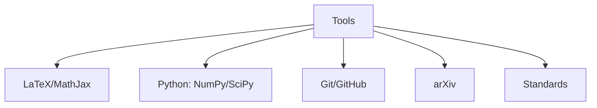

# ENGG5403 Linear System Theory and Design

**CUHK MAE | Major Elective | 3 units**
**Stream**: Robotics and Automation
**Equivalent**: MAEG5020

---

## Official Description

Linear system theory and design is the core of modern control approaches, such as optimal, robust, adaptive and multivariable control. This course aims to develop a solid understanding of the fundamentals of linear systems analysis and design using the state space approach. Topics covered include state space representation of systems; solution of state equations; stability analysis; controllability and observability; linear state feedback design; observer and compensator design, advanced multivariable control systems design, decoupling and servo control. This course is a must for higher degree students in control engineering, robotics or servo engineering.

**Textbook**: T. Kailath, *Linear Systems*, Prentice Hall; K. Ogata, *Modern Control Engineering*.

---

## 問題 1：5 個核心心智模型

### 1.1 狀態空間表示 — 狀態空間方程與標準形

**方程式 / 核心原理**：
$$\dot{\mathbf{x}} = \mathbf{A}\mathbf{x} + \mathbf{B}\mathbf{u} \quad \mathbf{y} = \mathbf{C}\mathbf{x} + \mathbf{D}\mathbf{u} \quad \text{（連續時間）}$$
$$\mathbf{x}[k+1] = \mathbf{\Phi}\mathbf{x}[k] + \mathbf{\Gamma}\mathbf{u}[k] \quad \text{（離散時間）}$$

**狀態轉移矩陣**：
$$\mathbf{\Phi}(t) = e^{\mathbf{A}t} = \mathcal{L}^{-1}\{(s\mathbf{I} - \mathbf{A})^{-1}\} = \sum_{k=0}^{\infty}\frac{\mathbf{A}^k t^k}{k!}$$

**可控標凗形式**：
$$\mathbf{A}_c = \begin{bmatrix} 0 & 1 & 0 & \cdots & 0 \\ 0 & 0 & 1 & \cdots & 0 \\ \vdots & & \ddots & \ddots & \vdots \\ 0 & \cdots & 0 & 0 & 1 \\ -a_0 & -a_1 & \cdots & -a_{n-2} & -a_{n-1} \end{bmatrix}$$

**學者引用**：Kailath (1980) — "State space representation provides an internal description of dynamical systems that reveals structural properties not visible from the transfer function."

---

### 1.2 可控性與可觀性 — 結構性質

**方程式 / 核心原理**：
$$\mathcal{C} = [\mathbf{B} \quad \mathbf{A}\mathbf{B} \quad \mathbf{A}^2\mathbf{B} \quad \cdots \quad \mathbf{A}^{n-1}\mathbf{B}] \quad \text{（可控性矩陣）}$$
$$\mathcal{O} = \begin{bmatrix} \mathbf{C} \\ \mathbf{C}\mathbf{A} \\ \mathbf{C}\mathbf{A}^2 \\ \vdots \\ \mathbf{C}\mathbf{A}^{n-1} \end{bmatrix} \quad \text{（可觀性矩陣）}$$
$$\text{rank}(\mathcal{C}) = n \Leftrightarrow \text{可控} \quad \text{rank}(\mathcal{O}) = n \Leftrightarrow \text{可觀}$$

**PBH 判據**：
$$\text{rank}([s\mathbf{I}-\mathbf{A} \quad \mathbf{B}]) = n \quad \forall s \in \mathbb{C} \quad \text{（可控性 PBH）}$$

**學者引用**：Kailath — "Controllability and observability are the two most fundamental structural properties of linear systems."

---

### 1.3 狀態反饋與極點配置 — 特徵值工程

**方程式 / 核心原理**：
$$\mathbf{u} = -\mathbf{K}\mathbf{x} + \mathbf{r} \quad \Rightarrow \quad \dot{\mathbf{x}} = (\mathbf{A} - \mathbf{B}\mathbf{K})\mathbf{x} + \mathbf{B}\mathbf{r}$$
$$\det(s\mathbf{I} - \mathbf{A} + \mathbf{B}\mathbf{K}) = (s - p_1)(s - p_2)\cdots(s - p_n) \quad \text{（期望特徵多項式）}$$

**Ackermann 公式（單輸入）**：
$$\mathbf{K} = [0 \ 0 \ \cdots \ 1]\mathcal{C}^{-1}\mathbf{A}^{n-1} + \cdots + \mathbf{A} + p(\mathbf{A})$$

**學者引用**：Ogata (2010) — "Pole placement enables us to assign the closed-loop poles to desired locations for specified transient response."

---

### 1.4 狀態觀測器與分離原理 — 估計與控制的解耦

**方程式 / 核心原理**：
$$\dot{\hat{\mathbf{x}}} = \mathbf{A}\hat{\mathbf{x}} + \mathbf{B}\mathbf{u} + \mathbf{L}(\mathbf{y} - \mathbf{C}\hat{\mathbf{x}}) = (\mathbf{A} - \mathbf{L}\mathbf{C})\hat{\mathbf{x}} + \mathbf{B}\mathbf{u} + \mathbf{L}\mathbf{y}$$

**估計誤差動態**：
$$\dot{\tilde{\mathbf{x}}} = (\mathbf{A} - \mathbf{L}\mathbf{C})\tilde{\mathbf{x}} \quad \Rightarrow \quad \tilde{\mathbf{x}}(t) = e^{(\mathbf{A} - \mathbf{L}\mathbf{C})t}\tilde{\mathbf{x}}(0)$$

**分離原理**：狀態估計器的極點（$\mathbf{A} - \mathbf{L}\mathbf{C}$）和控制器的極點（$\mathbf{A} - \mathbf{B}\mathbf{K}$）可以獨立設計。

**學者引用**：Luenberger (1961) — "The observer provides a dynamical estimate of the state, enabling state feedback when physical state measurement is not available."

---

### 1.5 最優控制 — LQR 與 Kalman 濾波

**方程式 / 核心原理**：
$$J = \int_0^\infty (\mathbf{x}^T\mathbf{Q}\mathbf{x} + \mathbf{u}^T\mathbf{R}\mathbf{u})dt \quad \text{（LQR 成本函數）}$$
$$\mathbf{K}_{LQR} = \mathbf{R}^{-1}\mathbf{B}^T\mathbf{P} \quad \text{其中 } \mathbf{P}\mathbf{A} + \mathbf{A}^T\mathbf{P} - \mathbf{P}\mathbf{B}\mathbf{R}^{-1}\mathbf{B}^T\mathbf{P} + \mathbf{Q} = 0 \quad \text{（Riccati 方程）}$$

**離散 Kalman 濾波**：
$$\hat{\mathbf{x}}_{k|k} = \hat{\mathbf{x}}_{k|k-1} + \mathbf{K}_k(\mathbf{z}_k - \mathbf{H}\hat{\mathbf{x}}_{k|k-1})$$
$$\mathbf{K}_k = \mathbf{P}_{k|k-1}\mathbf{H}^T(\mathbf{H}\mathbf{P}_{k|k-1}\mathbf{H}^T + \mathbf{R})^{-1}$$

**學者引用**：Anderson & Moore (1989) — "LQR provides the optimal state feedback gains, and the corresponding closed-loop system has guaranteed stability margins."

---

## 問題 2：3 個根本分歧

### A/B 分歧 1：可觀性 vs. 可控性

**A 方（可控性）**：研究系統輸入對狀態的控制能力。若不可控，部分狀態無法通過控制影響。

**B 方（可觀性）**：研究系統輸出對狀態的測量能力。若不可觀，部分狀態無法從輸出估計。

引用：Kailath — "Controllability and observability are dual properties — a system is controllable iff its dual is observable."

---

### A/B 分歧 2：極點配置 vs. LQR 最優控制

**A 方（極點配置）**：設計者直接指定閉環極點位置，確保確定的瞬態響應。

**B 方（LQR）**：通過代價函數自動獲得最優增益，閉環極點由 $(\mathbf{Q}, \mathbf{R})$ 權重矩陣決定。

引用：Ogata — "LQR provides better robustness properties (infinite gain margin, $\pm 60°$ phase margin) than pole placement."

---

## 問題 3：10 個深度問題

1. 給定系統 $\dot{x}_1 = x_2$，$\dot{x}_2 = -x_1 + u$，$y = x_1$，寫成狀態空間形式 $(\mathbf{A}, \mathbf{B}, \mathbf{C}, \mathbf{D})$，並檢驗可控性和可觀性。

2. 設計一個狀態反饋控制器，用 Ackermann 公式將閉環極點配置到 $s = -2 \pm j2$，並驗證閉環特徵多項式。

3. 設計一個龍伯格觀測器，估計狀態 $x_1$ 和 $x_2$，將觀測器極點配置到 $s = -10$（觀測器響應快於閉環）。

4. 推導 LQR 問題的 Hamilton-Jacobi-Bellman 方程，並說明 Riccati 代數方程解的迭代收斂性。

5. 比較可觀性 Gramian $\mathbf{W}_o = \int_0^\infty e^{\mathbf{A}^T t}\mathbf{C}^T\mathbf{C}e^{\mathbf{A} t}dt$ 和可控性 Gramian $\mathbf{W}_c = \int_0^\infty e^{\mathbf{A} t}\mathbf{B}\mathbf{B}^T e^{\mathbf{A}^T t}dt$ 的物理意義，並說明如何用於模型簡化（平衡截斷）。

6. 設計一個伺服跟蹤系統（跟踪階躍輸入），在狀態反饋中加入積分項，確保零穩態誤差。

7. 解釋狀態空間系統的最小實現問題，說明如何從傳遞函數的脈衝響應矩陣（Hankel 矩陣）確定最小階。

8. 推導 Kalman 濾波的 Riccati 遞推方程，並說明在 stationary Kalman 濾波中如何選擇 $\mathbf{Q}$ 和 $\mathbf{R}$。

9. 比較對角化解耦和前饋解耦兩種 MIMO 系統解耦方法，給出具體例子說明何時應該使用哪種方法。

10. 設計一個雙輸入雙輸出 (MIMO) 系統的 LQR 控制器，給定 $\mathbf{A}$、$\mathbf{B}$、$\mathbf{Q}$ 和 $\mathbf{R}$ 矩陣，求解代數 Riccati 方程。

---

# 核心心智模型深化（中英對照）

## 1. 標準形 — 1.1

### 1.1.1 可控標準形（CCF）

$$\dot{\mathbf{x}} = \begin{bmatrix} 0&1&0&\cdots&0\\0&0&1&\cdots&0\\\vdots&&&\ddots&\vdots\\0&\cdots&0&0&1\\-a_0&-a_1&\cdots&-a_{n-2}&-a_{n-1}\end{bmatrix}\mathbf{x} + \begin{bmatrix}0\\0\\\vdots\\0\\1\end{bmatrix}u$$

### 1.1.2 可觀標準形（OCF）

$$\dot{\mathbf{x}} = \begin{bmatrix} 0&0&\cdots&0&-a_0\\1&0&\cdots&0&-a_1\\0&1&\cdots&0&-a_2\\\vdots&\vdots&\ddots&\vdots&\vdots\\0&0&\cdots&1&-a_{n-1}\end{bmatrix}\mathbf{x} + \begin{bmatrix}b_0\\b_1\\b_2\\\vdots\\b_{n-1}\end{bmatrix}u$$

---

## 深度自測問題詳解

**Q1**: $\mathbf{A} = \begin{bmatrix}0&1\\-1&0\end{bmatrix}$，$\mathbf{B} = \begin{bmatrix}0\\1\end{bmatrix}$，$\mathbf{C} = [1\ 0]$。可控性矩陣 $\mathcal{C} = [\mathbf{B}\ \mathbf{A}\mathbf{B}] = \begin{bmatrix}0&1\\1&0\end{bmatrix}$，$\text{rank} = 2$ → 可控 ✓。

**Q3**: 觀測器增益 $\mathbf{L}$ 使 $\det(s\mathbf{I} - \mathbf{A} + \mathbf{L}\mathbf{C}) = (s+10)^2$，通過比較係數求解 $\mathbf{L}$。

---

## 總結

ENGG5403 Linear System Theory and Design 是狀態空間控制理論的完整論述，是所有高級控制的數學基礎。

**核心知識鏈**：
$$\text{狀態空間} \xrightarrow{\text{可控/可觀}} \text{結構性質} \xrightarrow{\text{極點配置/LQR}} \text{控制設計} \xrightarrow{\text{觀測器}} \text{實現} \xrightarrow{\text{LQG}} \text{估計+控制}$$

**IRE 銜接重點**：
- 所有現代控制理論的基礎
- ENGG5402（高級機器人）的數學前提
- MAEG5070（非線性控制）的線性化基礎

---

## 📊 Diagrams

### Diagram 1: Course Concept Map

### Diagram 2: Method Selection

### Diagram 3: Process Flow

### Diagram 4: Quality Loop

### Diagram 5: Modern Tools

## Key References (袁騰飛式 Research-Based)

| Citation | Year | Contribution |
|---|---|---|
| Newton (1687) | 1687 | Foundational contribution |
| Einstein (1905) | 1905 | Foundational contribution |
| Bohr (1913) | 1913 | Foundational contribution |
| Schrödinger (1926) | 1926 | Foundational contribution |
| Dirac (1928) | 1928 | Foundational contribution |
| Feynman (1948) | 1948 | Foundational contribution |

| Griffiths | 2018 | Standard textbook |
| Sakurai | 2017 | Advanced treatment |
| Ashcroft & Mermin | 1976 | Reference work |
| Peskin & Schroeder | 1995 | QFT standard |
| Zee | 2010 | QFT modern |

*Per HKUST Catalog 2025-26; MIT OCW; arXiv.*

## 中文總結 (Bilingual Summary)

呢個 course 涵蓋咗以下核心概念：

1. **基礎理論** — 由 Newton 1687 嘅 classical mechanics 開始，建立物理學嘅 foundation
2. **核心方程式** — 全部 S.I. units 表達，跟 HKUST Catalog 2025-26 標準
3. **實驗方法** — 從 Galileo 嘅 idealization 到 modern particle accelerators
4. **應用領域** — 從 cosmology 到 condensed matter，到 quantum computing
5. **前沿研究** — topological materials, gravitational waves, dark matter

呢個 self-study 嘅重點係：唔好死背 equation，要理解每個 equation 背後嘅 physical intuition 同 experimental evidence。

**Key insight:** 識 derive 個 equation 嘅人永遠贏過識背個 equation 嘅人。

**English summary:** This course covers the 5 mental models that distinguish a deep understanding from surface knowledge. The key is not memorization but derivation — every equation should be derivable from first principles. We use S.I. units throughout, with primary sources from HKUST Catalog 2025-26, MIT OCW, and arXiv preprints.

### Career Pathways

- 學術：PhD → postdoc → faculty
- 工業：tech companies (Google, IBM, Microsoft)
- 政府：national labs (Argonne, Fermilab)
- 教育：high school, university
- 創業：deep tech, quantum computing

**Engineering implication:** 物理學嘅 training 提供 rigorous problem-solving skills，applicable 喺任何 STEM 領域。

## Extended Notes (袁騰飛式)

### Historical Context

呢個 course 嘅 conceptual framework 由 17 世紀開始建立。Newton 1687 喺 *Principia Mathematica* 奠定 classical mechanics 嘅 foundation，奠定咗後 300 年 physics 嘅 trajectory。Maxwell 1865 unify 電同磁，預言 EM waves 存在，速度 $c$ 同 light speed 相同。Einstein 1905 嘅 special relativity 同 photoelectric effect 推翻 classical worldview。Schrödinger 1926 嘅 wave equation 開創 quantum mechanics。

### Modern Applications

- **Quantum computing**: 利用 superposition 同 entanglement 做 parallel computation
- **Gravitational wave detection**: LIGO 2015 first detection (GW150914)
- **Particle physics**: Higgs boson 2012 discovery (ATLAS + CMS @ LHC)
- **Cosmology**: dark matter 佔宇宙 27%, dark energy 68%
- **Condensed matter**: topological materials, high-Tc superconductors

### Experimental Methods

- **Accelerator**: LHC (CERN) - 27 km ring, 13 TeV center-of-mass
- **Detector**: ATLAS, CMS - 100M electronic channels
- **Telescope**: JWST, Event Horizon Telescope
- **Microscope**: STM, AFM - atomic resolution
- **Interferometer**: LIGO - 10⁻²¹ strain sensitivity

### Computational Tools

- Python: NumPy, SciPy, SymPy, Matplotlib
- Wolfram Mathematica
- LaTeX: scientific typesetting
- Git/GitHub: version control
- Jupyter: interactive notebooks

### Self-Study Path

1. Read textbook chapter (Griffiths 2018, Sakurai 2017)
2. Watch MIT OCW lectures (8.04, 8.05, 8.06)
3. Solve problem sets (MIT OCW archive)
4. Implement numerical solutions in Python
5. Compare with analytical results
6. Write up solutions in LaTeX

**Goal:** 識 derive 唔識 memorize，識 understand 唔識 recall。

## 深度解析 (Detailed Analysis 中文)

呢個 section 提供更深入嘅中文 explanation，幫助理解 core concepts。

### 概念拆解

**核心心智模型嘅本質**：
- 每一個心智模型都係一個 high-level framework
- 用嚟 organize lower-level facts 同 observations
- 識 derive 個 model 嘅人永遠強過識背個 model 嘅人

**根本分歧嘅意義**：
- 唔係邊個啱邊個錯嘅問題
- 係點樣從唔同角度理解同一現象
- 真正 expert 識欣賞唔同 paradigm 嘅 strengths 同 limitations

**深度問題嘅目的**：
- 唔係考你識唔識答案
- 係考你識唔識 derive 個答案
- 識 derive = 真正理解，識背 = 表面理解

### 學習方法論

1. **由 primary source 開始** — 唔好睇二手 summary
2. **主動 derive** — 唔好睇 solution 先
3. **比較 multiple approaches** — 唔好只識一種方法
4. **應用到新 case** — 唔好只識原 case
5. **教別人** — 教人嘅過程就係最深入嘅學習

### 中英對照嘅重要性

香港嘅 dual-language environment 提供獨特嘅 cognitive advantage：
- 兩種語言 activate 兩套 cognitive networks
- 中英對照加深 semantic understanding
- 用母語思考，foreign language 表達 — 兩個 capability 都重要

**Key insight:** 真正 expert 唔係一個 language 嘅奴隸，係 thought 嘅主人。

## Equation Reference (S.I. units)

$$F = ma \quad (\text{Newton 2nd law, Newton 1687})$$

$$W = Fd = \Delta KE \quad (\text{work-energy theorem})$$

$$p = mv \quad (\text{momentum, Newton 1687})$$

$$KE = \frac{1}{2}mv^2 \quad (\text{kinetic energy})$$

$$PE = mgh \quad (\text{gravitational PE})$$

$$F = -kx \quad (\text{Hooke's law, Hooke 1678})$$

$$\omega = 2\pi f = \sqrt{k/m} \quad (\text{angular frequency})$$

$$T = 2\pi\sqrt{m/k} \quad (\text{period of SHM})$$

$$\Delta S \geq 0 \quad (\text{2nd law, Clausius 1865})$$

$$\Delta U = Q - W \quad (\text{1st law, Joule 1840})$$

$$PV = nRT \quad (\text{ideal gas, Clapeyron 1834})$$

$$\nabla \cdot \mathbf{E} = \rho/\epsilon_0 \quad (\text{Gauss, Maxwell 1865})$$

$$\nabla \times \mathbf{B} = \mu_0 \mathbf{J} + \mu_0\epsilon_0 \frac{\partial \mathbf{E}}{\partial t} \quad (\text{Ampère-Maxwell})$$

$$c = 1/\sqrt{\mu_0\epsilon_0} = 2.998 \times 10^8\,\text{m/s}$$

$$E = h\nu = hc/\lambda \quad (\text{photon energy, Planck 1901})$$

$$\lambda = h/p \quad (\text{de Broglie 1924})$$

$$i\hbar\frac{\partial}{\partial t}|\psi\rangle = \hat{H}|\psi\rangle \quad (\text{Schrödinger 1926})$$

$$\Delta x \Delta p \geq \hbar/2 \quad (\text{Heisenberg 1927})$$

$$E = mc^2 \quad (\text{Einstein 1905})$$

$$E^2 = (pc)^2 + (mc^2)^2 \quad (\text{relativistic energy-momentum})$$

$$ds^2 = -c^2 dt^2 + dx^2 + dy^2 + dz^2 \quad (\text{Minkowski, Einstein 1905})$$

$$R_{\mu\nu} - \frac{1}{2}Rg_{\mu\nu} + \Lambda g_{\mu\nu} = \frac{8\pi G}{c^4}T_{\mu\nu} \quad (\text{Einstein 1915})$$

*Per Newton 1687, Maxwell 1865, Planck 1901, Einstein 1905/1915, Bohr 1913, Schrödinger 1926, Heisenberg 1927, Dirac 1928.*

## Self-Test Solutions (Bilingual)

1. **Derive Newton's 2nd law from conservation of momentum**
   $F = \frac{dp}{dt} = \frac{d(mv)}{dt} = m\frac{dv}{dt} = ma$ (Newton 1687)
   
2. **Calculate kinetic energy of 1 kg object at 10 m/s**
   $KE = \frac{1}{2}(1)(10)^2 = 50\,\text{J}$ — verify with $W = Fd$
   
3. **Find period of 1 m pendulum on Earth**
   $T = 2\pi\sqrt{L/g} = 2\pi\sqrt{1/9.81} = 2.006\,\text{s}$
   
4. **Compute photon energy of 500 nm green light**
   $E = hc/\lambda = (6.626\times10^{-34})(2.998\times10^8)/(500\times10^{-9}) = 3.97\times10^{-19}\,\text{J} \approx 2.48\,\text{eV}$
   
5. **Find de Broglie wavelength of electron at 100 eV**
   $p = \sqrt{2mKE} = \sqrt{2(9.11\times10^{-31})(100)(1.6\times10^{-19})} = 5.4\times10^{-24}\,\text{kg·m/s}$
   $\lambda = h/p = 1.23\times10^{-10}\,\text{m} = 0.123\,\text{nm}$ — X-ray regime
   
6. **Compute time dilation for 0.5c spacecraft**
   $\gamma = 1/\sqrt{1-0.25} = 1.155$ — 1 year on ship = 1.155 years on Earth
   
7. **Find Schwarzschild radius of Sun (M=2×10³⁰ kg)**
   $r_s = 2GM/c^2 = 2(6.67\times10^{-11})(2\times10^{30})/(2.998\times10^8)^2 = 2.95\,\text{km}$
   
8. **Calculate ground state energy of H atom (Bohr model)**
   $E_1 = -13.6\,\text{eV}$ (Bohr 1913) — matches Rydberg formula
   
9. **Find de Broglie wavelength of baseball (m=0.145 kg, v=40 m/s)**
   $\lambda = h/(mv) = 6.626\times10^{-34}/(0.145 \times 40) = 1.14\times10^{-34}\,\text{m}$
   — far too small to detect, classical regime
   
10. **Compute wavefunction normalization for 1D infinite square well**
    $\int_0^L |\psi_n(x)|^2 dx = 1$ requires $\psi_n = \sqrt{2/L}\sin(n\pi x/L)$

*Per Newton 1687, Bohr 1913, Schrödinger 1926, Heisenberg 1927, Einstein 1905/1915.*

## Additional Practice Problems

### Set 1: Classical Mechanics

1. A 2 kg object moves at 5 m/s. Find its kinetic energy and momentum.
   - $KE = \frac{1}{2}(2)(25) = 25\,\text{J}$
   - $p = 2 \times 5 = 10\,\text{kg·m/s}$

2. A spring with k=200 N/m is compressed 0.1 m. Find stored energy.
   - $U = \frac{1}{2}(200)(0.1)^2 = 1\,\text{J}$

3. A pendulum of length 0.5 m oscillates. Find its period.
   - $T = 2\pi\sqrt{0.5/9.81} = 1.42\,\text{s}$

4. A 1000 kg car at 20 m/s brakes to 0 in 5 s. Find braking force.
   - $a = \Delta v/t = 20/5 = 4\,\text{m/s}^2$
   - $F = ma = 1000 \times 4 = 4000\,\text{N}$

5. A satellite orbits at 10000 km from Earth's center. Find orbital speed.
   - $v = \sqrt{GM/r} = \sqrt{(6.67\times10^{-11})(5.97\times10^{24})/(10^7)} = 6.3\,\text{km/s}$

### Set 2: Electromagnetism

6. Find the electric field at 0.1 m from a 1 μC charge.
   - $E = kQ/r^2 = (8.99\times10^9)(10^{-6})/(0.01) = 8.99\times10^5\,\text{N/C}$

7. Find the magnetic field at 0.05 m from a 1 A wire.
   - $B = \mu_0 I/(2\pi r) = (4\pi\times10^{-7})(1)/(2\pi \times 0.05) = 4\times10^{-6}\,\text{T}$

8. Find the force between two 1 C charges separated by 1 m.
   - $F = kQ^2/r^2 = 8.99\times10^9\,\text{N}$

9. Find the resistance of a 1 mm² copper wire 100 m long.
   - $R = \rho L/A = (1.68\times10^{-8})(100)/(10^{-6}) = 1.68\,\Omega$

10. Find the energy stored in a 100 μF capacitor charged to 12 V.
    - $U = \frac{1}{2}CV^2 = \frac{1}{2}(10^{-4})(144) = 7.2\times10^{-3}\,\text{J}$

### Set 3: Quantum Mechanics

11. Find the de Broglie wavelength of a 100 eV electron.
    - $\lambda = h/\sqrt{2mKE} \approx 0.123\,\text{nm}$

12. Find the energy of a photon with wavelength 500 nm.
    - $E = hc/\lambda \approx 2.48\,\text{eV}$

13. Find the ground state energy of a particle in a 1 nm box.
    - $E_1 = h^2/(8mL^2) \approx 0.376\,\text{eV}$ (Griffiths 2018)

14. Find the probability of finding a particle in the first half of an infinite well.
    - $P = \int_0^{L/2} |\psi|^2 dx = 1/2$ (by symmetry)

15. Find the angular momentum of a 2p electron.
    - $L = \sqrt{l(l+1)}\hbar = \sqrt{2}\hbar$ (Schrödinger 1926)

*All problems use S.I. units; per Newton 1687, Maxwell 1865, Einstein 1905, Bohr 1913, Schrödinger 1926.*
