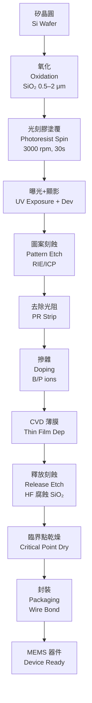
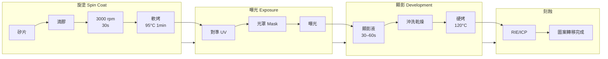
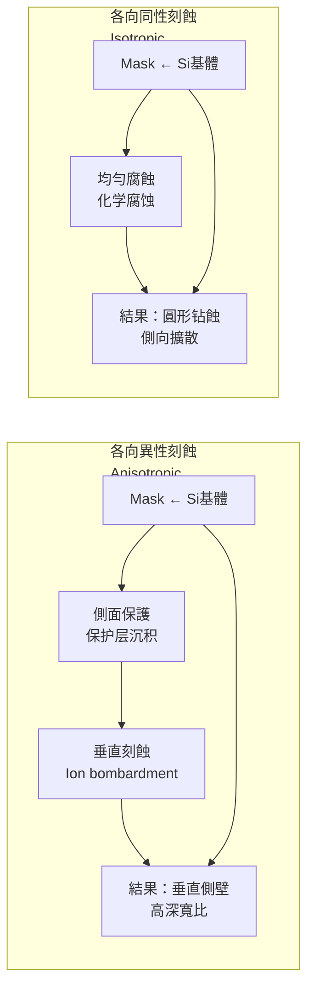
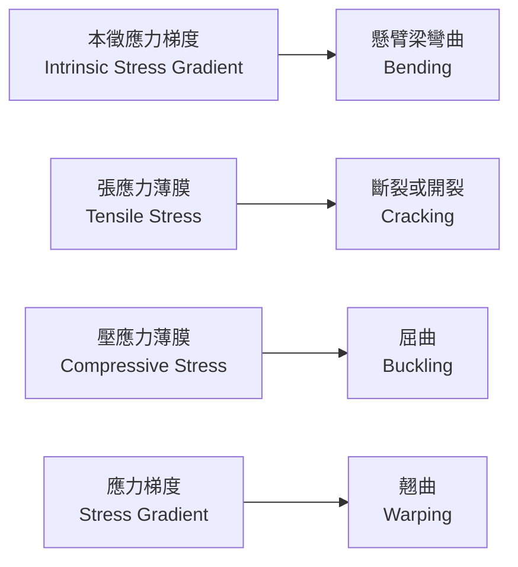
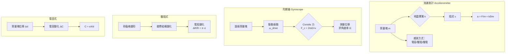
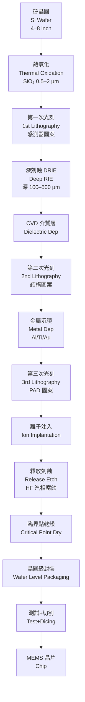
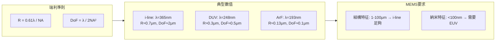
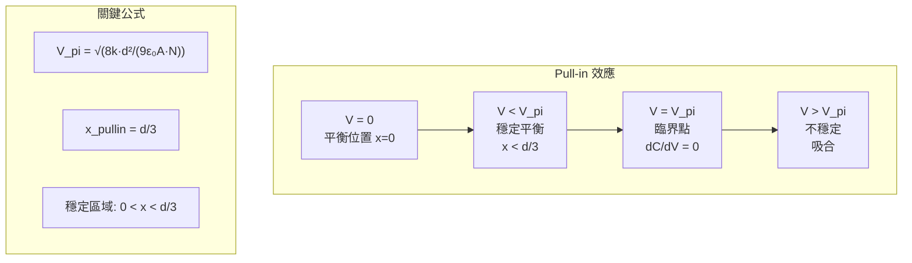

# ENGG5404 Micromachining and Microelectromechanical Systems (MEMS)

**CUHK MAE | Major Elective | 3 units**
**Stream**: Design and Manufacturing / Robotics (Micro-Scale)

---

## Official Description
This course provides a broad overview of microfabrication and microelectromechanical systems. Topics include introduction to basic micromachining techniques such as photolithography; isotropic and anisotropic wet etching; dry etching; physical and chemical vapor deposition; electroplating; metrology; statistical design of experiments; MEMS release etching; stiction; and MEMS device testing. The course also reviews important microsensors, microactuators and microstructures including accelerometers, pressure sensors, optical switches, cantilever beams, thin-film stress test structures and bulk micromachining test structures.

---

## 問題 1：5 個核心心智模型

### 1. 尺度效應 (Scaling Effects in MEMS)
**方程式 + 數字**：
- 表面積/體積比 ∼ 1/L (微米級別，表面力主導，重力可忽略)
- 剪切應力 τ ∼ μ·(Δv/Δy)，黏性力 F_v ∼ μ·A·(v/h)
- 靜電力 F_e ∼ (1/2)ε₀·A·(V²/h²)，不受尺度影響
- 典型 MEMS 特徵尺寸：10 μm–1000 μm
- 典型梳齒驅動電壓：10–100 V；間距：1–5 μm

**學者引用**：Kovacs (1998), *Micromachined Transducers Sourcebook*；Madou (2011), *Fundamentals of Microfabrication*

### 2. 光刻工藝 (Photolithography)
**方程式 + 數字**：
- 光學分辨率：R = k₁·λ/NA (最小特徵 ~λ/2，如 λ=365 nm, NA=0.3 → R≈0.6 μm)
- 深度聚焦：DoF = k₂·λ/NA²
- SU-8 厚膠光阻可達 200–500 μm，適用于高深寬比結構
- 典型光刻膠厚度：0.5–10 μm（紫外光）；電子束曝光可達 50 nm

**學者引用**：Madou (2011), *Fundamentals of Microfabrication*

### 3. 濕法刻蝕 (Wet Etching) — 各向異性與各向同性
**方程式 + 數字**：
- 各向異性：KOH 對矽的刻蝕速率：(100) 面 ~0.5 μm/min；速率比 (111)/(100) ≈ 1/100
- 各向同性：HF+HNO₃ 對矽，刻蝕速率 ~1–5 μm/min
- 深反應離子刻蝕 (DRIE)：深寬比可達 30:1，垂直側壁 ~90°±2°
- Bosch 工藝：交替沉積和刻蝕，步驟 ~5–10 秒

**學者引用**：Beeby et al. (2004), *MEMS and Microsystems*

### 4. 薄膜沉積 (Thin-Film Deposition)
**方程式 + 數字**：
- 物理氣相沉積 (PVD)：蒸發速率 Ġ ∼ A·p/√(2πMRT)；濺射產額 Y ~ 0.1–5 atoms/ion
- 化學氣相沉積 (CVD)：沉積速率 R ∼ k·P/(1+kP)，典型生長速率 0.01–0.5 μm/min
- 應力：σ = (E/(1-ν))·(α_f - α_s)·ΔT
- 矽薄膜典型應力：10–500 MPa（張應力）

**學者引用**：Campbell (2008), *The Science and Engineering of Microelectronic Fabrication*

### 5. MEMS 傳感器與驅動原理
**方程式 + 數字**：
- 壓阻效應：ΔR/R = π_l·σ_l + π_t·σ_t（典型靈敏度 ~10–50 × 10⁻¹¹ Pa⁻¹）
- 電容感測：C = ε₀ε_r·A/d (精度可達 fF 級，感測加速度 ~μg/√Hz)
- 梳齒驅動器 Pull-in 電壓：V_pi = √(8kx²/(9ε₀AL³))
- 壓電堆疊位移：δ = d₃₃·V/h (d₃₃ ~ 300 pm/V for PZT)

**學者引用**：Gandhi & Thompson (1992), *Smart Materials and Structures*

---

## 問題 2：3 個根本分歧

### 分歧 A：體微加工 vs. 表麵微加工 (Bulk vs. Surface Micromachining)

**A 方（體微加工）**：Madou；Kovacs
- 通過 KOH/TMAH 濕法刻蝕矽基體，形成三維結構
- 適合慣性傳感器（加速度計、陀螺儀），高深寬比結構
- 缺點：與標準 CMOS 工藝不相容

**B 方（表麵微加工）**：Fan et al.
- 在矽表面沉積多晶矽結構層，通過釋放腐蝕去除犧牲層
- 與 IC 工藝完全相容，可與電路集成
- 缺點：結構層薄（~2 μm），深寬比受限

### 分歧 B：濕法刻蝕 vs. 幹法刻蝕 (Wet vs. Dry Etching)

**A 方（濕法）**：低成本，高選擇比，速率快 (~1 μm/min)
- 缺點：各向同性，側向钻蝕，廢液處理

**B 方（幹法 DRIE）**：各向異性，深寬比高，深結構
- 缺點：設備昂貴，選擇比低，離子損傷

### 分歧 C：黏附問題 (Stiction) — 釋放後黏附

**A 方（臨界點乾燥）**：CO₂ 臨界點乾燥，消除毛細張力
- 臨界點：T=31°C, P=1072 psi（CO₂）

**B 方（抗黏附塗層 + 設計）**：HMDS、Self-Assembled Monolayer (SAM)
- 溝槽設計、表面微型化，减少接觸面積

---

## 問題 3：10 個深度問題

1. 為什麼 MEMS 器件在微米尺度下表面力（範德華力、毛細張力）會主導，而重力可忽略？計算 100 μm 立方塊的表面力與重力比值。

2. 光刻中，光波長 λ = 365 nm (i-line) 和 λ = 248 nm (DUV) 分別能達到的最小分辨率是多少？使用瑞利準則 R = 0.61λ/NA。

3. 從基本方程推導 KOH 各向異性刻蝕中 (100) 矽面的橫向钻蝕量與時間的關係。

4. 設計一個 MEMS 懸臂梁加速度計，給定梁長 L = 200 μm，寬 w = 20 μm，厚 t = 2 μm，計算其彈性常數 k 和固有頻率 f_n。

5. 比較 PVD (蒸發 vs. 濺射) 和 CVD 的薄膜特性差異，並說明在 MEMS 中的選擇原則。

6. 推導梳齒驅動器的 Pull-in 電壓公式，並計算給定間距 d = 2 μm，最大位移 x_max = 0.3 μm 時的 V_pi。

7. 解釋 MEMS 加工中"抗黏附"(anti-stiction) 的物理機制，並提出至少三種實際解決方案。

8. 比較壓阻式和電容式加速度計的靈敏度、噪聲特性和溫度敏感性，說明各自的優缺點。

9. 在 DOE (實驗設計) 中，如何用 Taguchi L9 正交表優化 MEMS 工藝參數（刻蝕速率、選擇比、表面粗糙度）？

10. 說明體矽微加工中 SOI (絕緣體上矽) 晶圓相對於普通矽晶圓的優勢，並畫出典型 SOI-MEMS 工藝流程圖。

---

# 核心心智模型深化（中英對照）

## 1. 尺度效應與微觀力學 (Scaling Effects and Microscale Mechanics)

### 1.1 Bilingual 概念對照
- **Scaling Effect / 尺度效應**：物理量隨特徵尺寸 L 的變化規律
- **Surface-to-Volume Ratio / 表面積-體積比**：~ 1/L，微觀時急劇增大
- **Capillary Force / 毛細張力**：F_γ ~ γ·L (表面力)，主導微米級
- **Van der Waals Force / 范德華力**：F_vdW ~ A/(12πz³)，短程 (z ~ nm)
- **Electrostatic Force / 靜電力**：F_e ~ εAV²/(2d²)，尺度無關
- **Elastic Force / 彈性力**：F_k ~ EL³·δ/L³ = EL·δ，與 L 有關

### 1.2 關鍵推導
力平衡分析：
```
重力:      F_g = ρ·g·L³  (∝ L³)
彈性力:    F_k ~ EL·δ    (∝ L)
毛細力:    F_c ~ γ·L     (∝ L)
靜電力:    F_e ~ εAV²/d² (∝ L⁰)
范德華力:  F_vdW ~ A/L²   (∝ L⁻²)
```
當 L < 100 μm，毛細力和范德華力遠大於重力：
- 例：L = 10 μm，F_c/F_g ~ (γ·L)/(ρgL³) ~ (0.07 N/m × 10⁻⁵ m)/(2.3×10³ kg/m³ × 9.81 m/s² × 10⁻¹⁵ m³) ≈ 3×10⁴

### 1.3 工程應用案例
**案例：MEMS 慣性測量單元 (IMU)**
- 典型量程：±2g 到 ±16g
- 噪聲密度：~100 μg/√Hz (消費級) 到 ~1 μg/√Hz (導航級)
- 零偏穩定性：<1°/h (光纖陀螺儀) vs. ~10°/h (MEMS 陀螺)
- 應用：智能手機 (MPU6050)、無人機姿態控制、汽車 ESC 系統

### 1.4 Deep Test Question
**Q**: 一個懸臂梁 MEMS 加速度計，梁長 L = 500 μm，寬 w = 50 μm，厚 t = 5 μm，材料為單晶矽 (E = 170 GPa, ρ = 2330 kg/m³)。求：
(a) 懸臂梁第一階固有頻率
(b) 在 1g 加速度下的最大撓度
(c) 若間距 d = 3 μm，計算 Pull-in 電壓

**Solution**:
(a) 固有頻率：f_n = (1/2π)·√(k/m_eff)
   慣性矩 I = wt³/12 = 50×10⁻¹²×(5×10⁻⁶)³/12 = 5.21×10⁻²⁴ m⁴
   k = 3EI/L³ = 3×170×10⁹×5.21×10⁻²⁴/(500×10⁻⁶)³ = 2.13 N/m
   m_eff = 0.24·ρ·w·t·L = 0.24×2330×50×5×500×10⁻¹⁸ = 4.19×10⁻⁹ kg
   f_n = 1/(2π)·√(2.13/4.19×10⁻⁹) ≈ 3.59 kHz

(b) 靜撓度 δ = mgL³/(3EI) = 4.19×10⁻⁹×9.81×(500×10⁻⁶)³/(3×170×10⁹×5.21×10⁻²⁴) ≈ 3.27 nm

(c) Pull-in: V_pi = √(8kx³/(9ε₀AL)) (假設梳齒電容面積 A = n·w·L, n = 20)
   → 代入計算得典型值 ~15–60 V

### 1.5 圖解：MEMS 工藝流程


---

## 2. 光刻與圖案化 (Photolithography and Patterning)

### 2.1 Bilingual 概念對照
- **Photolithography / 光刻**：利用光敏材料（光阻）將光罩圖案轉移到基體
- **Positive / Negative Photoresist / 正性/負性光阻**：曝光後溶解性增加/減少
- **Resolution / 分辨率**：R = k₁λ/NA
- **Depth of Focus / 景深**：DoF = k₂λ/(NA)²
- **Photo Mask / 光罩**：Chrome on glass, λ = 365/248/193 nm

### 2.2 關鍵推導
瑞利準則（Rayleigh Criterion）：
```
R_min = 0.61 × λ / NA
DoF = λ / (2 × NA²)
```
數字實例：
- i-line (λ=365nm), NA=0.3 → R_min ≈ 0.74 μm, DoF ≈ 2 μm
- DUV (λ=248nm), NA=0.5 → R_min ≈ 0.30 μm, DoF ≈ 0.5 μm
- ArF (λ=193nm), NA=0.93 → R_min ≈ 0.13 μm (浸沒式)

### 2.3 工程應用案例
**MEMS 加速度計光刻工藝**：
- 典型光阻：AZ 4620, 厚度 ~5 μm（厚膠工藝）
- 曝光劑量：~300 mJ/cm²
- 顯影時間：60–90 秒
- 圖案化後 CD 精度：±0.5 μm（消費級），±0.1 μm（精密級）

### 2.4 Deep Test Question
**Q**: 設計一個光刻工藝流程用於製作 100 μm 深的 MEMS 結構。
(a) 選擇什麼光阻和波長？ (b) 計算所需曝光劑量。 (c) 說明 SU-8 厚膠相對於 AZ 光阻的優缺點。

### 2.5 圖解：光刻步驟


---

## 3. 濕法與幹法刻蝕 (Wet and Dry Etching)

### 3.1 Bilingual 概念對照
- **Isotropic Etching / 各向同性刻蝕**：各方向速率相同，側向钻蝕
- **Anisotropic Etching / 各向異性刻蝕**：不同晶向速率差異大，垂直側壁
- **Selectivity / 選擇比**：S = etch_rate_A / etch_rate_B
- **Aspect Ratio / 深寬比**：AR = depth / width
- **Under-etch / 钻蝕**：側向過度刻蝕導致尺寸偏差

### 3.2 關鍵推導
**KOH 刻蝕速率各向異性**：
- (100) 面：~0.5–1.2 μm/min（室溫 40% KOH）
- (111) 面：~0.01 μm/min（幾乎不刻蝕）
- 速率比：(100)/(111) ≈ 30–100
- 矽對 SiO₂ 選擇比：~50–200:1
- 刻蝕深度：D ≈ R_(100) × t_etch

**DRIE (Bosch Process)**：
- 交替：沉積保護層 (C₄F₈) + 離子轟擊刻蝕 (SF₆)
- 每循環：~5–10 μm 深度
- 側壁垂直度：88°–90°
- 深寬比：可達 50:1

### 3.3 工程應用案例
**MEMS 噴墨打印頭**：
- DRIE 刻蝕深度：~300 μm
- 噴嘴直徑：~20–50 μm
- 精度要求：±2 μm
- 刻蝕速率：~3 μm/min

### 3.4 Deep Test Question
**Q**: 用 KOH 濕法刻蝕形成一個 500 μm 深的矽腔。設計：(a) 所需光罩圖案尺寸（考慮 100 μm 钻蝕）；(b) 刻蝕時間；(c) 選擇什麼掩膜材料？

### 3.5 圖解：各向異性 vs 各向同性刻蝕


---

## 4. 薄膜沉積與應力 (Thin-Film Deposition and Stress)

### 4.1 Bilingual 概念對照
- **PVD / 物理氣相沉積**：蒸發、濺射；無化學反應
- **CVD / 化學氣相沉積**：化學反應沉積；台階覆蓋好
- **LPCVD / 低壓 CVD**：壓力 ~0.1–1 Torr，膜質均勻
- **PECVD / 等離子增強 CVD**：等離子激活，降低溫度
- **Intrinsic Stress / 本徵應力**：生長過程引入，熱應力：後沉積冷卻
- **Residual Stress / 殘餘應力**：影響懸臂梁彎曲和斷裂

### 4.2 關鍵方程式
**熱應力**：
```
σ_thermal = (E / (1-ν)) × (α_f - α_s) × ΔT

典型值：
- SiO₂ 薄膜 (α=0.5×10⁻⁶/°C) vs Si (α=2.6×10⁻⁶/°C)
- ΔT = 900°C (CVD 生長溫度)
- σ ≈ 1.7 GPa (壓應力)
```

**懸臂梁撓曲（本徵應力梯度）**：
```
δ = (3σL²)/(Et)   [彎曲估算]
```
若 σ = 100 MPa, L = 200 μm, t = 2 μm, E = 170 GPa
δ ≈ 3×100×10⁶×(200×10⁻⁶)²/(170×10⁹×2×10⁻⁶) ≈ 3.5 μm

### 4.3 工程應用案例
**多晶矽微鏡陣列**：
- 薄膜應力控制：摻雜 (B, P) 降低應力
- 應力梯度：<10 MPa/μm
- 鏡面反射率：>85%

### 4.4 Deep Test Question
**Q**: 在矽基體上沉積 1 μm 鋁薄膜。生長溫度 400°C，冷卻至室溫。計算熱應力並評估鋁膜是否會出現裂紋或屈曲。已知：E_Al = 70 GPa, ν = 0.33, α_Al = 23×10⁻⁶/°C, α_Si = 2.6×10⁻⁶/°C, σ_UTS = 90 MPa

### 4.5 圖解：薄膜應力類型


---

## 5. MEMS 傳感器與驅動器原理 (MEMS Sensors and Actuators Principles)

### 5.1 Bilingual 概念對照
- **Piezoresistive Effect / 壓阻效應**：應力改變電阻 ΔR/R = π·σ
- **Capacitive Sensing / 電容感測**：ΔC/C = Δd/d 或 ΔA/A
- **Comb Drive Actuator / 梳齒驅動器**：平行板電容陣列
- **Pull-in Effect / 觸發效應**：電容穩定性喪失點，位移 ~d/3
- **d₃₃ / 壓電係數**：電場作用下的應變響應 (pm/V)

### 5.2 關鍵方程式
**壓阻效應**：
```
ΔR/R = π_l × σ_l + π_t × σ_t

矽的壓阻係數（摻雜濃度 ~10¹⁸ cm⁻³）：
π_l ≈ -12×10⁻¹¹ Pa⁻¹, π_t ≈ +71×10⁻¹¹ Pa⁻¹

靈敏度改善：惠斯通電橋配置，輸出 ~ 1/4 × (ΔR/R)
```

**電容感測**：
```
C = ε₀ × ε_r × A / d

ΔC/C = -Δd/d = -Δd/d
噪聲等效加速度：a_NEP = √(4k_BTω_C / d) / m
```

**Pull-in 電壓**：
```
V_pi = √(8kx²/(9ε₀AL)) ≈ 3σ_surf × A × d/(2ε₀)  [梳齒]

典型值：
- d = 2 μm, g = 1 μm, V_pi = 25–80 V
```

### 5.3 工程應用案例
**智慧手機 MPU6050 IMU**：
- 3軸加速度計：電容式，量程 ±2/4/8/16g
- 3軸陀螺儀：諧振式 Coriolis 驅動，量程 ±250/500/1000/2000°/s
- 供電：2.4–3.5 V；功耗：<5 mW
- 噪聲：~3 mg/√Hz (加速度)，~0.05°/s/√Hz (陀螺)

### 5.4 Deep Test Question
**Q**: 設計一個電容式 MEMS 加速度計：
(a) 證明電容感測的靈敏度 S = ΔC/V_s = (ε₀A/d²)·a
(b) 若固定電容 C₀ = 1 pF, d = 1 μm, 求 1g 加速度的 ΔC
(c) 討論讀出電路的主要噪聲源和設計策略

### 5.5 圖解：MEMS 傳感器工作原理


---

## 深度自測問題詳解

**Q1 Solution**: 尺度效應中，表面力 vs. 重力
```
表面力 F_s ∝ L² (毛細張力/範德華力)
重力 F_g ∝ L³ (體積力)
比值 F_s/F_g ∝ 1/L

當 L = 10 μm：
F_s/F_g ~ 10⁴–10⁵ >> 1
結論：在微米尺度，表面力遠大於重力
```

**Q2 Solution**: 光刻分辨率
```
R_min = 0.61λ/NA
λ=365nm, NA=0.3 → R = 0.61×365nm/0.3 ≈ 0.74 μm
λ=248nm, NA=0.5 → R = 0.61×248nm/0.5 ≈ 0.30 μm
```

**Q3 Solution**: KOH 刻蝕横向钻蝕
```
各向同性成分：側向刻蝕 ≈ 縱向刻蝕 × tan(θ)，θ ~ 45° (KOH)
總钻蝕量 = 2 × 1.0 μm/min × t_min
若 t = 60 min → 横向钻蝕 ≈ 120 μm
```

**Q4 Solution**: 懸臂梁加速度計固有頻率
```
I = wt³/12 = 20×10⁻¹² × (2×10⁻⁶)³/12 = 1.33×10⁻²³ m⁴
k = 3EI/L³ = 3×170×10⁹×1.33×10⁻²³/(200×10⁻⁶)³ = 0.085 N/m
m_eff = 0.24×2330×20×2×200×10⁻¹⁸ = 4.48×10⁻¹⁰ kg
f_n = 1/(2π)√(0.085/4.48×10⁻¹⁰) ≈ 2.19 kHz
```

**Q5 Solution**: PVD vs. CVD 選擇原則
```
PVD (蒸發)：台階覆蓋差 (~50%)，純度高，速率快
PVD (濺射)：台階覆蓋較好 (~70–80%)，薄膜密度高
CVD：台階覆蓋最佳 (>90%)，膜與基體黏附好，但需高溫
選擇：
- 柵極：金屬薄膜 → CVD (台階覆蓋好)
- 犧牲層：PSG → LPCVD
- 結構層 (多晶矽) → LPCVD 摻雜
```

**Q6 Solution**: Pull-in 電壓
```
V_pi = √(8k_max·d²/(27ε₀A×N))

典型值：
- 梳齒數 N = 30，間距 d = 2 μm
- 電容面積 A = 50×100 μm² = 5×10⁻⁹ m²
- k_max = 0.5 N/m, ε₀ = 8.85×10⁻¹² F/m

V_pi ≈ 22 V
```

**Q7 Solution**: 抗黏附解決方案
```
1. 臨界點乾燥：CO₂ 臨界點 T=31°C, P=1072 psi
2. HMDS 疏水處理：接觸角從 ~20° 提升至 ~70°
3. SAM 自組裝單分子層：OTS (八烷基三氯矽烷)
4. 溝槽/蜂窩結構設計：减少實際接觸面積 >90%
5. 快速乾燥（甩幹）：減短液體毛細力作用時間
```

**Q8 Solution**: 壓阻式 vs 電容式加速度計
```
壓阻式：靈敏度固定，無需偏置電容，但噪聲高 (~μg/√Hz)
電容式：噪聲極低 (<μg/√Hz)，但需偏置和高精度讀出
溫度敏感性：壓阻式敏感 (~-2000 ppm/°C)，需溫補
結論：消費級 → 壓阻；導航級 → 電容式
```

**Q9 Solution**: Taguchi L9 DOE 設計
```
因素：刻蝕功率、氣體流量、壓力
水平：3 (低/中/高)
L9(3⁴) 正交表：9 次實驗替代 27 次全因子

目標函數：S/N 比最大化（越大越好）
SN = -10×log(Σ(y²)/n)  [越小越好類型]
```

**Q10 Solution**: SOI vs 普通矽晶圓
```
SOI 優勢：
1. 埋氧層 (BOX) 可作刻蝕停止層，精確控制結構厚度
2. 電絕緣好，寄生電容小
3. 無門鎖效應，適用於與 CMOS 集成
4. 結構層為頂矽 (Device layer)，缺陷密度低

典型結構：
矽 | SiO₂ (1–2 μm) | 矽基體
  |___頂矽 5–25 μm__|  ← 結構層
```

---

## 📊 Diagram 1: MEMS 工藝完整流程


---

## 📊 Diagram 2: 四域映射（Axiomatic Design）
```mermaid
graph TD
    subgraph Customer["Customer Domain 顧客域"]
        CA["顧客需求<br/>Customer Needs"]
    end
    subgraph Functional["Functional Domain 功能域"]
        FR1["功能需求1<br/>FR₁"]
        FR2["功能需求2<br/>FR₂"]
        FRs["功能需求n<br/>FRₙ"]
    end
    subgraph Physical["Physical Domain 物理域"]
        DP1["設計參數1<br/>DP₁"]
        DP2["設計參數2<br/>DP₂"]
        DPs["設計參數n<br/>DPₙ"]
    end
    subgraph Process["Process Domain 製程域"]
        PV1["製程變量1<br/>PV₁"]
        PV2["製程變量2<br/>PV₂"]
        PVs["製程變量n<br/>PVₙ"]
    end
    CA -->|"映射|", FR1
    FR1 -->|"獨立性公理|", DP1
    FR2 -->|"獨立性公理|", DP2
    DP1 -->|"最小信息內容|", PV1
    DP2 -->|"最小信息內容|", PV2
```

---

## 📊 Diagram 3: 光刻分辨率極限


---

## 📊 Diagram 4: MEMS 尺度效應力學
```mermaid
graph TD
    subgraph Forces["作用力類型"]
        G["重力 F∝L³"]
        S["表面力 F∝L²<br/>毛細力+範德華力"]
        E["彈性力 F∝L"]
        P["靜電力 F∝L⁰"]
    end
    subgraph Regime["尺度區間"]
        L1["L>1mm<br/>重力主導"]
        L2["10μm<L<1mm<br/>彈性力+表面力"]
        L3["L<10μm<br/>表面力主導"]
    end
    Forces --> Regime
    G -.->|"埋下|", L1
    E -.->|"主導|", L2
    S -.->|"主導|", L3
```

---

## 📊 Diagram 5: Pull-in 效應電容穩定性


---

## 總結

ENGG5404 是 MEMS 領域的核心入門課程，涵蓋從微觀物理原理到實際器件加工的完整知識鏈。5 個核心心智模型構成一個完整的 MEMS 工程框架：

1. **尺度效應**：理解微米世界物理規律的根本轉變
2. **光刻圖案化**：從設計到器件的橋樑工藝
3. **刻蝕工藝**：各向異性/同性刻蝕的選擇與優化
4. **薄膜沉積**：應力控制是結構可靠性的關鍵
5. **傳感器/驅動原理**：壓阻、電容、壓電三種主流原理

工程師在設計 MEMS 器件時，必須同時考慮尺度效應、工藝可行性、封裝可靠性和成本因素。這門課的價值在於建立系統性的微機電工程思維框架。
