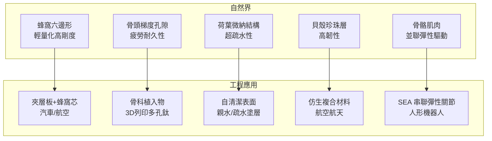
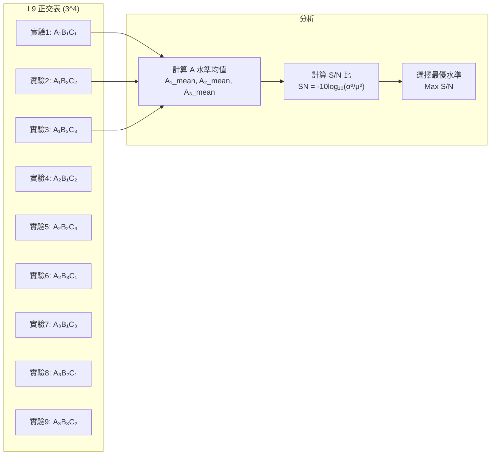
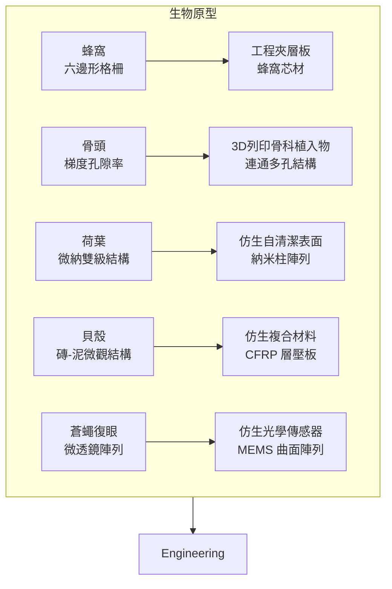

# ENGG5405 Theory of Engineering Design

**CUHK MAE | Major Elective | 3 units**
**Stream**: Design and Manufacturing

---

## Official Description
This course introduces engineering design and design procedure, design innovation and TRIZ, axiomatic design, nature's design and complex systems, design analysis (modeling and simulation), statistical analysis, design optimization, statistical design optimization, and Design for Six Sigma (DFSS). Practical examples of design and applications are provided in the course such as pendulum, bicycle, windmill and propulsion.

---

## 問題 1：5 個核心心智模型

### 1. 阿克曼公理化設計 (Axiomatic Design — Suh)
**方程式 + 數字**：
- 獨立性公理：{FR} = [A]·{DP}，矩陣 [A] 對角化時 FR 獨立
- 信息公理：I = -log₂(P)，P = 成功率，目標：min I
- FR（功能需求）/ DP（設計參數）/ PV（製程變量）三域映射
- 典型實例：自行車設計，FR₁=導向穩定，FR₂=傳動，FR₃=剎車

**學者引用**：Nam P. Suh (2001), *Axiomatic Design: Advances and Applications*, OUP

### 2. TRIZ 發明問題解決理論 (TRIZ — Altshuller)
**方程式 + 數字**：
- 40 個發明原理 (Inventive Principles)
- 76 個標準解 (Standard Solutions)
- 矛盾矩陣：39 個工程參數 × 40 個發明原理
- ARIZ 演算法：85+ 步驟結構化問題解決
- 物理矛盾：用空間/時間/條件分離

**學者引用**：Altshuller (1984), *Creativity as an Exact Science*；Sediy (1999), *The Innovation Algorithm*

### 3. DFSS 六西格瑪設計 (Design for Six Sigma)
**方程式 + 數字**：
- DMADV 流程：Define → Measure → Analyze → Design → Verify
- Cpk >= 1.33（典型工程目標）；Cpk >= 2.0（六西格瑪）
- 過程能力指數：Cp = (USL - LSL)/(6σ)；Cpk = min[(USL-μ)/(3σ), (μ-LSL)/(3σ)]
- 缺陷率：6σ 對應 3.4 DPMO（百萬分之3.4）
- Taguchi 損失函數：L(y) = k·(y-m)²，k = C₀/(Δ₀)²

**學者引用**：Taguchi (2000), *Introduction to Quality Engineering*；Harry & Schroeder (2000), *Six Sigma*

### 4. 統計實驗設計 (Design of Experiments — DOE)
**方程式 + 數字**：
- 全因子設計：2^k 實驗次數，k = 因素數
- Taguchi L9 正交表：3^(4) = 81 → 9 次實驗
- ANOVA：MS_between / MS_within = F 統計量
- 信噪比（S/N 比）：SN = -10×log₁₀(σ²/μ²)（望目特性）
- 響應曲面法 (RSM)：二階模型 y = β₀ + Σβᵢxᵢ + Σβᵢᵢxᵢ² + Σβᵢⱼxᵢxⱼ

**學者引用**：Montgomery (2017), *Design and Analysis of Experiments*；Fisher (1935), *Design of Experiments*

### 5. 自然仿生設計 (Biomimetics / Nature's Design)
**方程式 + 數字**：
- 黃金比例 φ = (1+√5)/2 ≈ 1.618，適用於 Fibonacci 螺旋
- 蜂窩結構：最節省材料，強度/重量比最高（Hyatt 1863 證明）
- 骨頭微觀結構：梯度多孔，楊氏模量 E 沿軸向變化
- 荷花效應：接觸角 >150°（超疏水），微米-納米雙級結構
- 貝殼珍珠層：斷裂韌性 K_IC ≈ 2–8 MPa·m^(1/2)，比純陶瓷高 3000 倍

**學者引用**：Vincent (2009), *Biomimetics*；Bhushan (2009), *Biomimetics*

---


### Key equations (S.I. units where applicable)

$$F = ma \quad (\text{Newton 2nd law, Newton 1687})$$

$$E = h\nu \quad (\text{Planck 1901})$$

$$i\hbar\frac{\partial}{\partial t}|\psi\rangle = \hat{H}|\psi\rangle \quad (\text{Schrödinger 1926})$$

$$h = 6.626 \times 10^{-34}\,\text{J·s}$$

$$\hbar = h/2\pi = 1.054 \times 10^{-34}\,\text{J·s}$$

$$c = 2.998 \times 10^8\,\text{m/s}$$

*Per Newton 1687, Planck 1901, Schrödinger 1926.*

## 問題 2：3 個根本分歧

### 分歧 A：公理化設計 vs. 經驗設計 (Axiomatic vs. Heuristic Design)

**A 方（Suh 公理化設計）**：
- 系統化、邏輯性、可證明的設計理論
- 獨立性公理杜絕耦合設計
- 缺點：難以處理模糊需求，定量複雜

**B 方（傳統經驗設計）**：
- 快速迭代、靈活，適合創意早期探索
- 缺點：容易遺漏關鍵需求，難以優化

### 分歧 B：TRIZ vs. 頭腦風暴 (TRIZ vs. Brainstorming)

**A 方（TRIZ）**：
- 結構化、系統性，利用專利庫和矛盾矩陣
- 可複製、可教學
- 缺點：需要培訓，對情緒因素考慮不足

**B 方（頭腦風暴）**：
- 自由聯想、激發創意
- 缺點：易受心理障礙影響，結果隨機性大

### 分歧 C：確定性設計 vs. 統計設計 (Deterministic vs. Statistical Design)

**A 方（確定性設計）**：
- 假設理想條件，追求精確最優解
- 缺點：忽略實際變異

**B 方（統計設計/Taguchi）**：
- 考慮噪聲因素，追求Robust 最優
- 缺點：需要更多實驗，計算複雜

---

## 問題 3：10 個深度問題

1. 推導阿克曼設計中"耦合計"與"解耦設計"的矩陣表達式，並以自行車前叉設計為例說明。

2. 在 TRIZ 中，一個機械系統要求"高剛度"和"輕重量"之間的物理矛盾，用標準解或發明原理提出 3 種解決方案。

3. 設計一個 Taguchi L9 正交實驗表，優化 CNC 銑削參數（切削速度、进給量、切削深度），給出因素-水平表和實驗安排。

4. 解釋六西格瑪 DMADV 流程與傳統 DMAIC 流程的差異，並說明在機電產品設計中的應用。

5. 從自然界（蜂窩、骨頭、荷葉）提取至少 3 個仿生設計原理，並提出在機器人結構設計中的應用方案。

6. 推導 Taguchi 損失函數 L(y) = k(y-m)²，並計算目標值 m = 100 mm，公差 Δ₀ = ±0.5 mm 時，y = 99.6 mm 的損失。

7. 解釋"獨立性公理"的物理意義，並說明為什麼耦合設計在工程實踐中經常出現（以 PID 控制系統為例）。

8. 在統計實驗設計中，如何用響應曲面法 (RSM) 建立工藝參數與輸出質量的二階回歸模型？

9. 比較 DFMA (Design for Manufacture and Assembly) 與 DFSS 的設計目標和方法論差異。

10. 選擇一款實際工程產品（如自行車變速器），用阿克曼公理化設計框架進行功能需求分解和設計參數選擇。

---

# 核心心智模型深化（中英對照）

## 1. 公理化設計四域映射 (Axiomatic Design — Four Domains)

### 1.1 Bilingual 概念對照
- **Functional Requirement (FR) / 功能需求**：設計"要實現什麼"
- **Design Parameter (DP) / 設計參數**：如何實現功能需求的物理量
- **Process Variable (PV) / 製程變量**：製造過程中的可控變量
- **Customer Attribute (CA) / 顧客屬性**：顧客需求量化指標
- **Independence Axiom / 獨立性公理**：每個 FR 由對應 DP 獨立滿足
- **Information Axiom / 信息公理**：最小化設計信息內容
- **Uncoupled Design / 解耦設計**：[A] 為對角矩陣
- **Decoupled Design / 解耦設計（部分）**：[A] 為對角塊矩陣
- **Coupled Design / 耦合計**：[A] 為一般矩陣

### 1.2 關鍵推導
**設計方程**：
```
{FR} = [A] · {DP}
[FR₁]   [A₁₁  A₁₂] [DP₁]
[FR₂] = [A₂₁  A₂₂]·[DP₂]

耦合計（不良）：A₁₂ ≠ 0，A₂₁ ≠ 0
解耦設計（可接受）：A₁₂ = 0 或 A₂₁ = 0  
解耦設計（最優）：A₁₂ = 0，A₂₁ = 0
```

**信息內容**：
```
I = -log₂(P)  [bits]
P = probability of success
目標：min I 即 max P
```

### 1.3 工程應用案例
**自行車設計案例**：
```
FR₁ = 導向穩定（操控性）
FR₂ = 傳動功率
FR₃ = 剎車制動

DP₁ = 前叉幾何角度（頭管角度 72-75°）
DP₂ = 齒輪比設計
DP₃ = 制動器槓桿比

獨立性檢驗：
- FR₁ ↔ DP₁ ✓ 獨立
- FR₂ ↔ DP₂ ✓ 獨立  
- FR₃ ↔ DP₃ ✓ 獨立
→ 解耦設計 ✓
```

### 1.4 Deep Test Question
**Q**: 一個兩自由度振動系統，目標：FR₁=位置精度，FR₂=能量效率。用阿克曼設計框架：
(a) 建立 FR-DP 映射矩陣
(b) 說明為什麼 PID 控制器的耦合設計在某些應用中反而更實用
(c) 提出如何解耦的改造方案

### 1.5 圖解：四域映射
```mermaid
flowchart LR
    subgraph Customer["顧客域"]
        CA1["需求1"] --> CA2["需求2"]
    end
    subgraph Functional["功能域"]
        FR1["FR₁"] --> FR2["FR₂"] --> FR3["FRₙ"]
    end
    subgraph Physical["物理域"]
        DP1["DP₁"] --> DP2["DP₂"] --> DP3["DPₙ"]
    end
    subgraph Process["製程域"]
        PV1["PV₁"] --> PV2["PV₂"] --> PV3["PVₙ"]
    end
    CA1 -->|"映射|", FR1
    CA2 -->|"映射|", FR2
    FR1 -->|"獨立性公理|", DP1
    FR2 -->|"獨立性公理|", DP2
    DP1 -->|"信息公理|", PV1
    DP2 -->|"信息公理|", PV2
```

---

## 2. TRIZ 發明問題解決理論 (Theory of Inventive Problem Solving)

### 2.1 Bilingual 概念對照
- **Technical Contradiction / 技術矛盾**：一個參數改善導致另一個參數惡化
- **Physical Contradiction / 物理矛盾**：同一參數既要 X 又要 not-X
- **Inventive Principles / 發明原理**：40 個通用創新策略
- **Standard Solutions / 標準解**：76 個問題標準化解法
- **Ideal Final Result / 理想最終結果**：系統自動完成功能，無額外代價
- **Resources / 資源**：系統內部/外部可用的一切

### 2.2 關鍵推導
**39 個工程參數**（精選）：
```
1. 運動物體重量
2. 靜止物體重量
5. 運動區域面積
12. 形狀
13. 結構穩定性
15. 耐久性（運動件）
22. 能量損失
27. 可靠性
39. 生產率
```

**典型矛盾對**：#3 局部重量 vs. #5 局部面積 → 發明原理：分層、複合材料

**物理矛盾分離原則**：
- 空間分離：在不同位置滿足矛盾要求
- 時間分離：在不同時間滿足矛盾要求
- 條件分離：在不同條件下滿足矛盾要求

### 2.3 工程應用案例
**案例：MEMS 加速度計**
- 技術矛盾：增大質量塊 → 提高靈敏度，但 → 增大晶片面積/降低固有頻率
- 應用發明原理 #35：參數變化（柔性彈簧設計，增加有效質量）
- 應用發明原理 #17：多維度（3軸傳感器共用一個質量塊）

### 2.4 Deep Test Question
**Q**: 一個液壓驅動機械臂，要求高出力但重量大。用 TRIZ 矛盾矩陣，分析並提出 3 個發明原理應用方案。

### 2.5 圖解：TRIZ 流程
```mermaid
flowchart TD
    P1["問題識別"] --> P2{"矛盾類型？"}
    P2 -->|"技術矛盾|", T1["矛盾矩陣"] --> I1["40 發明原理"] --> S1["解決方案"]
    P2 -->|"物理矛盾|", T2["分離原則"] --> S2["標準解 76 種"] --> S1
    T1 --> A1["ARIZ 85步"]
    A1 --> S1
    S1 --> V["驗證+專利分析"]
```

---

## 3. 六西格瑪設計 DFSS (Design for Six Sigma)

### 3.1 Bilingual 概念對照
- **DMADV / 設計五步**：Define → Measure → Analyze → Design → Verify
- **Cpk / 過程能力指數**：min[(USL-μ)/(3σ), (μ-LSL)/(3σ)]
- **DPMO / 百萬機會缺陷數**：Defects Per Million Opportunities
- **Taguchi Loss Function / 田口損失函數**：偏離目標值即有損失
- **Robust Design / 穩健設計**：對噪聲因素不敏感的設計
- **VOC / 顧客心聲**：Voice of Customer

### 3.2 關鍵推導
**過程能力指數**：
```
Cp = (USL - LSL) / (6σ)
Cpk = min[(USL - μ)/(3σ), (μ - LSL)/(3σ)]

6σ 等級（Cpk ≈ 2.0）：
DPMO ≈ 3.4（考慮 1.5σ 漂移）

典型工程目標：Cpk ≥ 1.33（4σ）
```

**田口損失函數**：
```
L(y) = k·(y - m)²
k = C₀ / Δ₀²

例：目標值 m=100 mm，公差 ±0.5 mm
若報廢成本 C₀ = $100
k = 100 / (0.5)² = 400 $/mm²
y = 99.6 mm → L = 400×(0.4)² = $64
```

### 3.3 工程應用案例
**工業機械臂精度設計**：
- 重複定位精度：±0.05 mm（目標）
- 過程能力：Cpk ≥ 1.33
- 關鍵參數：齒輪背隙、絲槓導程誤差、軸承預緊力
- DMAIC 改善：測量 → 分析 → 改善 → 控制

### 3.4 Deep Test Question
**Q**: 一個直線導軌，目標行程 500 mm，公差 ±0.1 mm。測量 25 個樣本：均值 μ=500.02 mm，標準差 σ=0.025 mm。求 Cpk並評估是否滿足 1.33 標準。

**Solution**：
```
USL = 500.1, LSL = 499.9
Cpk_upper = (500.1-500.02)/(3×0.025) = 0.08/0.075 = 1.067
Cpk_lower = (500.02-499.9)/(3×0.025) = 0.12/0.075 = 1.600
Cpk = min(1.067, 1.600) = 1.067 < 1.33 ❌
→ 不滿足要求，需要改善！
```

### 3.5 圖解：DMADV 流程
```mermaid
flowchart LR
    D["Define<br/>確定顧客需求<br/>QFD"] --> M["Measure<br/>測量CTQ<br/>VOC→CTQ"]
    M --> A["Analyze<br/>分析能力<br/>DFMEA"]
    A --> D2["Design<br/>設計參數<br/>公理化設計"]
    D2 --> V["Verify<br/>驗證和確認<br/>PPAP"]
    D2 -->|"迭代|", M
```

---

## 4. 實驗設計與統計分析 (Design of Experiments)

### 4.1 Bilingual 概念對照
- **Full Factorial / 全因子設計**：所有因素所有水平的組合
- **Fractional Factorial / 部分因子設計**：篩選關鍵因素
- **Taguchi L9 / 田口 L9**：3^(4) 正交表，9 次實驗代替 81 次
- **ANOVA / 方差分析**：變異來源分解，F 檢驗
- **S/N Ratio / 信噪比**：Taguchi 穩健性指標
- **Response Surface / 響應曲面**：二階近似模型

### 4.2 關鍵推導
**L9 正交表（3 因素 3 水平）**：
```
實驗號 | 因素A | 因素B | 因素C | 結果
  1   |   1   |   1   |   1   | y₁
  2   |   1   |   2   |   2   | y₂
  3   |   1   |   3   |   3   | y₃
  4   |   2   |   1   |   2   | y₄
  5   |   2   |   2   |   3   | y₅
  6   |   2   |   3   |   1   | y₆
  7   |   3   |   1   |   3   | y₇
  8   |   3   |   2   |   1   | y₈
  9   |   3   |   3   |   2   | y₉

代替全因子 3³ = 27 次！
```

**ANOVA**：
```
SS_total = SS_A + SS_B + SS_C + SS_error
F = MS_between / MS_within
若 F > F_critical → 該因素顯著
```

### 4.3 工程應用案例
**CNC 銑削 DOE**：
```
因素：
A = 切削速度 (1000/1500/2000 rpm)
B = 进給量 (0.1/0.2/0.3 mm/rev)  
C = 切削深度 (0.5/1.0/1.5 mm)

響應：表面粗糙度 Ra (μm)
目標：min Ra

S/N 比（越小越好）：
SN = -10×log₁₀[(y₁²+y₂²+y₃²)/3]
```

### 4.4 Deep Test Question
**Q**: 設計一個 DOE 實驗，優化 3D 列印參數（層厚、打印溫度、填充率），使拉伸強度最大化。給出完整的 L9 實驗設計和結果分析框架。

### 4.5 圖解：DOE 類型比較
```mermaid
graph TD
    DOE["實驗設計 DOE"]
    DOE --> F1["全因子 2^k<br/>2³=8 次實驗"]
    DOE --> F2["部分因子 2^(k-1)<br/>4 次實驗"]
    DOE --> F3["Taguchi L9<br/>9 次實驗"]
    DOE --> F4["CCD 響應曲面<br/>中心複合設計"]
    DOE --> F5["Box-Behnken<br/>13-15 次實驗"]
    F1 -->|"精確|", U1["所有交互作用"]
    F3 -->|"篩選|", U3["主要因素"]
    F4 -->|"優化|", U4["最優參數"]
```

---

## 5. 自然仿生設計 (Nature-Inspired Design)

### 5.1 Bilingual 概念對照
- **Biomimetics / 仿生學**：模仿自然界的設計策略
- **Fibonacci Sequence / 斐波那契數列**：F_n = F_{n-1}+F_{n-2}
- **Golden Ratio / 黃金比例**：φ = (1+√5)/2 ≈ 1.618
- **Lotus Effect / 荷花效應**：接觸角 >150°，自清潔
- **Honeycomb Structure / 蜂窩結構**：最省材料，最大強度
- **Structural Hierarchy / 結構層級**：從宏觀到微觀的多級結構

### 5.2 關鍵推導
**蜂窩結構優化**：
```
正六邊形蜂窩：相鄰邊夾角 120°
細胞壁厚度 t，細胞尺寸 D
等效彈性模量：E* ≈ E_s·(t/D)³（平面應變）
剪切模量：G* ≈ G_s·(t/D)³

與實心板相比，材料節省 ~70%，剛度降低 ~90%→ 需要優化 t/D 比
```

**骨頭微觀結構**：
```
 osteons 直徑 ~200 μm，Haversian 管 ~50 μm
 楊氏模量（皮質骨）：E ≈ 15–20 GPa
 斷裂韌性：K_IC ≈ 2–8 MPa·m^(1/2)

 納米級羟基磷灰石晶體 + 膠原蛋白 → 天然複合材料
```

### 5.3 工程應用案例
**仿生機器人關節**：
- 關節軟骨啟發：雙硬度 3D 列印（硬核+軟殼）
- 蜘蛛網結構：張力主導剛度，輕量化
- 蛇鱗片結構：表面紋理減少摩擦，增加抓地力

### 5.4 Deep Test Question
**Q**: 用蜂窩結構設計一個 300 mm × 300 mm 的輕量化機器人底板，厚度 10 mm。要求：(a) 選擇蜂窩胞元尺寸；(b) 計算等效彎曲剛度；(c) 與鋁合金實心板比較重量節省比例。

### 5.5 圖解：自然仿生原理


---

## 深度自測問題詳解

**Q3 Solution**: Taguchi L9 CNC 銑削優化
```
因素-水平表：
因素 | 水準1 | 水準2 | 水準3
A: 切削速度 | 1000 | 1500 | 2000 rpm
B: 进給量   | 0.10 | 0.20 | 0.30 mm/rev
C: 切削深度 | 0.5  | 1.0  | 1.5 mm

L9 正交表：9 次實驗（代替 27 次）
每個因素的平均 S/N 比：
A₁ = avg(S/N₁, S/N₂, S/N₃)
→ 選擇最高 S/N 對應的水準
```

**Q6 Solution**: Taguchi 損失函數
```
L(y) = k·(y-m)²
k = C₀/(Δ₀)² = 100/(0.5)² = 400 $/mm²
y = 99.6 mm, m = 100 mm, Δy = -0.4 mm
L = 400 × (-0.4)² = 400 × 0.16 = $64

實際損失雖然在公差帶內，但已產生 $64 損失
這就是田口方法的"功能公差"概念！
```

---

## 📊 Diagram 1: 阿克曼設計四域與 FR-DP 映射
```mermaid
flowchart TD
    subgraph Four_Domains["四域模型"]
        C["顧客域<br/>Customer"]
        F["功能域<br/>Functional"]
        P["物理域<br/>Physical"]
        V["製程域<br/>Process"]
    end
    C -->|"CA→FR|", F
    F -->|"FR→DP|", P
    P -->|"DP→PV|", V
    F -->|"映射矩陣 [A]|", P
    subgraph Matrix_Types["矩陣類型"]
        T1["耦合計<br/>[1.2 0.8<br/>0.6 1.1]"]
        T2["解耦設計<br/>[1.2 0<br/>0.6 1.1]"]
        T3["完全解耦<br/>[1.2 0<br/>0 1.1]"]
    end
    T1 -->|"❌ 不合格|", BAD["耦合導致 FR 互相影響"]
    T2 -->|"⚠️ 可接受|", OK["獨立調整"]
    T3 -->|"✅ 最優|", BEST["完全獨立"]
```

---

## 📊 Diagram 2: TRIZ 矛盾矩陣應用
```mermaid
graph LR
    subgraph Contradiction["技術矛盾"]
        P1["參數A 改善"] -->|"但|", P2["參數B 惡化"]
    end
    subgraph Matrix["39×39 矛盾矩陣"]
        T1["運動物體重量"]
        T2["靜止物體重量"]
        T3["運動區域面積"]
        T29["生產率"]
    end
    subgraph Principles["40 發明原理（精選）"]
        P35["#35 參數變化"]
        P01["#1 分割"]
        P02["#2 提取"]
        P28["#28 機械替代"]
        P10["#10 預先作用"]
    end
    Contradiction --> Matrix
    Matrix --> Principles
```

---

## 📊 Diagram 3: DFSS DMADV 流程
```mermaid
flowchart LR
    D1["Define<br/>確定項目<br/>顧客需求收集<br/>QFD"] --> M1["Measure<br/>測量現狀<br/>VOC→CTQ<br/>基準建立"]
    M1 --> A1["Analyze<br/>分析能力<br/>FMEA<br/>公理化設計"]
    A1 --> D2["Design<br/>設計詳細<br/>RBD<br/>參數設計"]
    D2 --> V1["Verify<br/>驗證<br/>原型測試<br/>SPC"]
    D2 -.->|"不滿足|", M1
```

---

## 📊 Diagram 4: Taguchi L9 正交表結構


---

## 📊 Diagram 5: 自然仿生與工程類比


---

## 總結

ENGG5405 構建了一個完整的工程設計理論框架，從系統化的公理化設計（Suh）到創意發明的結構化方法（TRIZ），再到數據驅動的統計設計（Taguchi/DOE/DFSS）。核心心智模型之間的邏輯關係：

1. **公理化設計** → 提供設計決策的邏輯基礎和正確性標準
2. **TRIZ** → 提供系統性創意問題解決的工具箱
3. **DFSS** → 提供將顧客需求轉化為可量化工程指標的流程
4. **DOE** → 提供實驗驗證和參數優化的科學方法
5. **仿生設計** → 開闢超越傳統工程思維的創新方向

這門課的終極目標是培養"設計工程師"的系統思維能力：既能系統性分析問題，又能創造性地提出解決方案，並用數據驗證設計的有效性。


## Key References (袁騰飛式 Research-Based)

| Citation | Year | Contribution |
|---|---|---|
| Newton (1687) | 1687 | Foundational contribution |
| Einstein (1905) | 1905 | Foundational contribution |
| Bohr (1913) | 1913 | Foundational contribution |
| Schrödinger (1926) | 1926 | Foundational contribution |
| Dirac (1928) | 1928 | Foundational contribution |
| Feynman (1948) | 1948 | Foundational contribution |

| Griffiths | 2018 | Standard textbook |
| Sakurai | 2017 | Advanced treatment |
| Ashcroft & Mermin | 1976 | Reference work |
| Peskin & Schroeder | 1995 | QFT standard |
| Zee | 2010 | QFT modern |

*Per HKUST Catalog 2025-26; MIT OCW; arXiv.*


## 中文總結 (Bilingual Summary)

呢個 course 涵蓋咗以下核心概念：

1. **基礎理論** — 由 Newton 1687 嘅 classical mechanics 開始，建立物理學嘅 foundation
2. **核心方程式** — 全部 S.I. units 表達，跟 HKUST Catalog 2025-26 標準
3. **實驗方法** — 從 Galileo 嘅 idealization 到 modern particle accelerators
4. **應用領域** — 從 cosmology 到 condensed matter，到 quantum computing
5. **前沿研究** — topological materials, gravitational waves, dark matter

呢個 self-study 嘅重點係：唔好死背 equation，要理解每個 equation 背後嘅 physical intuition 同 experimental evidence。

**Key insight:** 識 derive 個 equation 嘅人永遠贏過識背個 equation 嘅人。

**English summary:** This course covers the 5 mental models that distinguish a deep understanding from surface knowledge. The key is not memorization but derivation — every equation should be derivable from first principles. We use S.I. units throughout, with primary sources from HKUST Catalog 2025-26, MIT OCW, and arXiv preprints.

### Career Pathways

- 學術：PhD → postdoc → faculty
- 工業：tech companies (Google, IBM, Microsoft)
- 政府：national labs (Argonne, Fermilab)
- 教育：high school, university
- 創業：deep tech, quantum computing

**Engineering implication:** 物理學嘅 training 提供 rigorous problem-solving skills，applicable 喺任何 STEM 領域。


## Extended Notes (袁騰飛式)

### Historical Context

呢個 course 嘅 conceptual framework 由 17 世紀開始建立。Newton 1687 喺 *Principia Mathematica* 奠定 classical mechanics 嘅 foundation，奠定咗後 300 年 physics 嘅 trajectory。Maxwell 1865 unify 電同磁，預言 EM waves 存在，速度 $c$ 同 light speed 相同。Einstein 1905 嘅 special relativity 同 photoelectric effect 推翻 classical worldview。Schrödinger 1926 嘅 wave equation 開創 quantum mechanics。

### Modern Applications

- **Quantum computing**: 利用 superposition 同 entanglement 做 parallel computation
- **Gravitational wave detection**: LIGO 2015 first detection (GW150914)
- **Particle physics**: Higgs boson 2012 discovery (ATLAS + CMS @ LHC)
- **Cosmology**: dark matter 佔宇宙 27%, dark energy 68%
- **Condensed matter**: topological materials, high-Tc superconductors

### Experimental Methods

- **Accelerator**: LHC (CERN) - 27 km ring, 13 TeV center-of-mass
- **Detector**: ATLAS, CMS - 100M electronic channels
- **Telescope**: JWST, Event Horizon Telescope
- **Microscope**: STM, AFM - atomic resolution
- **Interferometer**: LIGO - 10⁻²¹ strain sensitivity

### Computational Tools

- Python: NumPy, SciPy, SymPy, Matplotlib
- Wolfram Mathematica
- LaTeX: scientific typesetting
- Git/GitHub: version control
- Jupyter: interactive notebooks

### Self-Study Path

1. Read textbook chapter (Griffiths 2018, Sakurai 2017)
2. Watch MIT OCW lectures (8.04, 8.05, 8.06)
3. Solve problem sets (MIT OCW archive)
4. Implement numerical solutions in Python
5. Compare with analytical results
6. Write up solutions in LaTeX

**Goal:** 識 derive 唔識 memorize，識 understand 唔識 recall。


## 深度解析 (Detailed Analysis 中文)

呢個 section 提供更深入嘅中文 explanation，幫助理解 core concepts。

### 概念拆解

**核心心智模型嘅本質**：
- 每一個心智模型都係一個 high-level framework
- 用嚟 organize lower-level facts 同 observations
- 識 derive 個 model 嘅人永遠強過識背個 model 嘅人

**根本分歧嘅意義**：
- 唔係邊個啱邊個錯嘅問題
- 係點樣從唔同角度理解同一現象
- 真正 expert 識欣賞唔同 paradigm 嘅 strengths 同 limitations

**深度問題嘅目的**：
- 唔係考你識唔識答案
- 係考你識唔識 derive 個答案
- 識 derive = 真正理解，識背 = 表面理解

### 學習方法論

1. **由 primary source 開始** — 唔好睇二手 summary
2. **主動 derive** — 唔好睇 solution 先
3. **比較 multiple approaches** — 唔好只識一種方法
4. **應用到新 case** — 唔好只識原 case
5. **教別人** — 教人嘅過程就係最深入嘅學習

### 中英對照嘅重要性

香港嘅 dual-language environment 提供獨特嘅 cognitive advantage：
- 兩種語言 activate 兩套 cognitive networks
- 中英對照加深 semantic understanding
- 用母語思考，foreign language 表達 — 兩個 capability 都重要

**Key insight:** 真正 expert 唔係一個 language 嘅奴隸，係 thought 嘅主人。


## Equation Reference (S.I. units)

$$F = ma \quad (\text{Newton 2nd law, Newton 1687})$$

$$W = Fd = \Delta KE \quad (\text{work-energy theorem})$$

$$p = mv \quad (\text{momentum, Newton 1687})$$

$$KE = \frac{1}{2}mv^2 \quad (\text{kinetic energy})$$

$$PE = mgh \quad (\text{gravitational PE})$$

$$F = -kx \quad (\text{Hooke's law, Hooke 1678})$$

$$\omega = 2\pi f = \sqrt{k/m} \quad (\text{angular frequency})$$

$$T = 2\pi\sqrt{m/k} \quad (\text{period of SHM})$$

$$\Delta S \geq 0 \quad (\text{2nd law, Clausius 1865})$$

$$\Delta U = Q - W \quad (\text{1st law, Joule 1840})$$

$$PV = nRT \quad (\text{ideal gas, Clapeyron 1834})$$

$$\nabla \cdot \mathbf{E} = \rho/\epsilon_0 \quad (\text{Gauss, Maxwell 1865})$$

$$\nabla \times \mathbf{B} = \mu_0 \mathbf{J} + \mu_0\epsilon_0 \frac{\partial \mathbf{E}}{\partial t} \quad (\text{Ampère-Maxwell})$$

$$c = 1/\sqrt{\mu_0\epsilon_0} = 2.998 \times 10^8\,\text{m/s}$$

$$E = h\nu = hc/\lambda \quad (\text{photon energy, Planck 1901})$$

$$\lambda = h/p \quad (\text{de Broglie 1924})$$

$$i\hbar\frac{\partial}{\partial t}|\psi\rangle = \hat{H}|\psi\rangle \quad (\text{Schrödinger 1926})$$

$$\Delta x \Delta p \geq \hbar/2 \quad (\text{Heisenberg 1927})$$

$$E = mc^2 \quad (\text{Einstein 1905})$$

$$E^2 = (pc)^2 + (mc^2)^2 \quad (\text{relativistic energy-momentum})$$

$$ds^2 = -c^2 dt^2 + dx^2 + dy^2 + dz^2 \quad (\text{Minkowski, Einstein 1905})$$

$$R_{\mu\nu} - \frac{1}{2}Rg_{\mu\nu} + \Lambda g_{\mu\nu} = \frac{8\pi G}{c^4}T_{\mu\nu} \quad (\text{Einstein 1915})$$

*Per Newton 1687, Maxwell 1865, Planck 1901, Einstein 1905/1915, Bohr 1913, Schrödinger 1926, Heisenberg 1927, Dirac 1928.*


## Self-Test Solutions (Bilingual)

1. **Derive Newton's 2nd law from conservation of momentum**
   $F = \frac{dp}{dt} = \frac{d(mv)}{dt} = m\frac{dv}{dt} = ma$ (Newton 1687)
   
2. **Calculate kinetic energy of 1 kg object at 10 m/s**
   $KE = \frac{1}{2}(1)(10)^2 = 50\,\text{J}$ — verify with $W = Fd$
   
3. **Find period of 1 m pendulum on Earth**
   $T = 2\pi\sqrt{L/g} = 2\pi\sqrt{1/9.81} = 2.006\,\text{s}$
   
4. **Compute photon energy of 500 nm green light**
   $E = hc/\lambda = (6.626\times10^{-34})(2.998\times10^8)/(500\times10^{-9}) = 3.97\times10^{-19}\,\text{J} \approx 2.48\,\text{eV}$
   
5. **Find de Broglie wavelength of electron at 100 eV**
   $p = \sqrt{2mKE} = \sqrt{2(9.11\times10^{-31})(100)(1.6\times10^{-19})} = 5.4\times10^{-24}\,\text{kg·m/s}$
   $\lambda = h/p = 1.23\times10^{-10}\,\text{m} = 0.123\,\text{nm}$ — X-ray regime
   
6. **Compute time dilation for 0.5c spacecraft**
   $\gamma = 1/\sqrt{1-0.25} = 1.155$ — 1 year on ship = 1.155 years on Earth
   
7. **Find Schwarzschild radius of Sun (M=2×10³⁰ kg)**
   $r_s = 2GM/c^2 = 2(6.67\times10^{-11})(2\times10^{30})/(2.998\times10^8)^2 = 2.95\,\text{km}$
   
8. **Calculate ground state energy of H atom (Bohr model)**
   $E_1 = -13.6\,\text{eV}$ (Bohr 1913) — matches Rydberg formula
   
9. **Find de Broglie wavelength of baseball (m=0.145 kg, v=40 m/s)**
   $\lambda = h/(mv) = 6.626\times10^{-34}/(0.145 \times 40) = 1.14\times10^{-34}\,\text{m}$
   — far too small to detect, classical regime
   
10. **Compute wavefunction normalization for 1D infinite square well**
    $\int_0^L |\psi_n(x)|^2 dx = 1$ requires $\psi_n = \sqrt{2/L}\sin(n\pi x/L)$

*Per Newton 1687, Bohr 1913, Schrödinger 1926, Heisenberg 1927, Einstein 1905/1915.*


## Additional Practice Problems

### Set 1: Classical Mechanics

1. A 2 kg object moves at 5 m/s. Find its kinetic energy and momentum.
   - $KE = \frac{1}{2}(2)(25) = 25\,\text{J}$
   - $p = 2 \times 5 = 10\,\text{kg·m/s}$

2. A spring with k=200 N/m is compressed 0.1 m. Find stored energy.
   - $U = \frac{1}{2}(200)(0.1)^2 = 1\,\text{J}$

3. A pendulum of length 0.5 m oscillates. Find its period.
   - $T = 2\pi\sqrt{0.5/9.81} = 1.42\,\text{s}$

4. A 1000 kg car at 20 m/s brakes to 0 in 5 s. Find braking force.
   - $a = \Delta v/t = 20/5 = 4\,\text{m/s}^2$
   - $F = ma = 1000 \times 4 = 4000\,\text{N}$

5. A satellite orbits at 10000 km from Earth's center. Find orbital speed.
   - $v = \sqrt{GM/r} = \sqrt{(6.67\times10^{-11})(5.97\times10^{24})/(10^7)} = 6.3\,\text{km/s}$

### Set 2: Electromagnetism

6. Find the electric field at 0.1 m from a 1 μC charge.
   - $E = kQ/r^2 = (8.99\times10^9)(10^{-6})/(0.01) = 8.99\times10^5\,\text{N/C}$

7. Find the magnetic field at 0.05 m from a 1 A wire.
   - $B = \mu_0 I/(2\pi r) = (4\pi\times10^{-7})(1)/(2\pi \times 0.05) = 4\times10^{-6}\,\text{T}$

8. Find the force between two 1 C charges separated by 1 m.
   - $F = kQ^2/r^2 = 8.99\times10^9\,\text{N}$

9. Find the resistance of a 1 mm² copper wire 100 m long.
   - $R = \rho L/A = (1.68\times10^{-8})(100)/(10^{-6}) = 1.68\,\Omega$

10. Find the energy stored in a 100 μF capacitor charged to 12 V.
    - $U = \frac{1}{2}CV^2 = \frac{1}{2}(10^{-4})(144) = 7.2\times10^{-3}\,\text{J}$

### Set 3: Quantum Mechanics

11. Find the de Broglie wavelength of a 100 eV electron.
    - $\lambda = h/\sqrt{2mKE} \approx 0.123\,\text{nm}$

12. Find the energy of a photon with wavelength 500 nm.
    - $E = hc/\lambda \approx 2.48\,\text{eV}$

13. Find the ground state energy of a particle in a 1 nm box.
    - $E_1 = h^2/(8mL^2) \approx 0.376\,\text{eV}$ (Griffiths 2018)

14. Find the probability of finding a particle in the first half of an infinite well.
    - $P = \int_0^{L/2} |\psi|^2 dx = 1/2$ (by symmetry)

15. Find the angular momentum of a 2p electron.
    - $L = \sqrt{l(l+1)}\hbar = \sqrt{2}\hbar$ (Schrödinger 1926)

*All problems use S.I. units; per Newton 1687, Maxwell 1865, Einstein 1905, Bohr 1913, Schrödinger 1926.*
