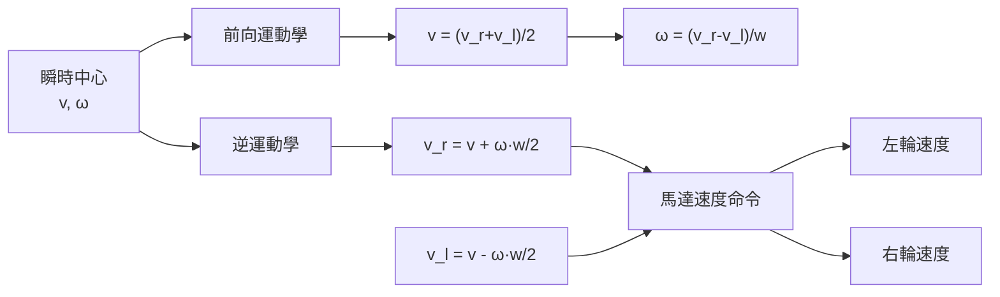
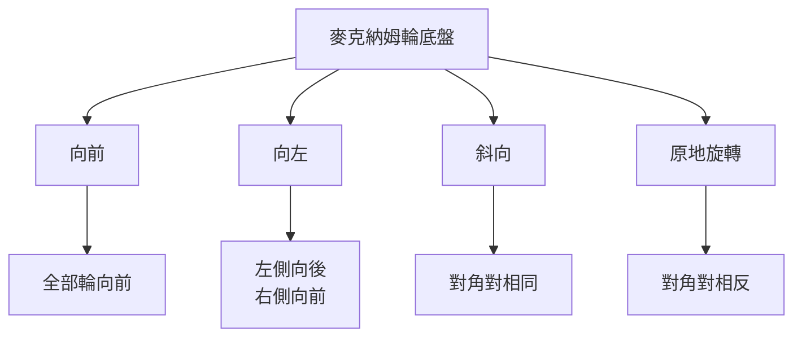
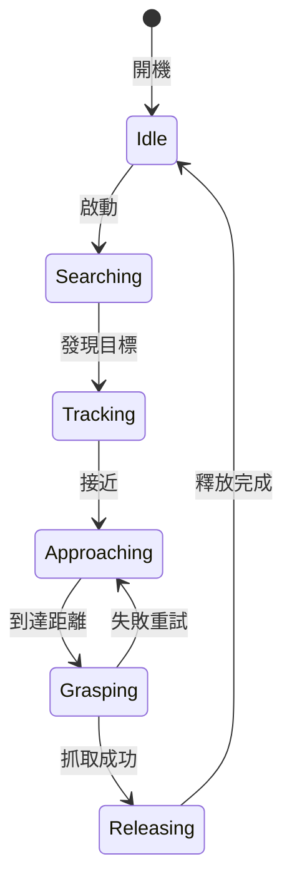

# MAEG1010 Introduction to Robot Design

**CUHK MAE | Major Elective | 3 units**
**Stream**: Robotics and Automation / Design and Manufacturing

---

## Official Description

The course covers introduction to robots in different industries, microcontroller unit, programming using Arduino, sensors, actuators, mechanisms and engineering design principles. It provides students extensive hands-on training on robot prototype development and experimental evaluation. It adopts a project-based learning approach: students are required to design and build a fully functional robotic system that must be able to perform a specific task. Both mechanical and electronic hardware will be designed and developed by the students. The lectures and laboratory sessions are designed so as to equip them with the essential knowledge to successfully complete their project.

---

## 問題 1：5 個核心心智模型

### 1. Arduino 微控制器與數字/模擬接口
**方程式 + 數字**：
- ATmega328P：16 MHz 時鐘，2 KB RAM，32 KB Flash，14 個數字 I/O，6 個 PWM
- PWM 頻率：490 Hz（默認 Pins 3,9,10,11）或 980 Hz（Pin 5,6）
- ADC 分辨率：10 位（0-1023），基準電壓 5V → 分辨率 ~4.9 mV
- UART 速率：300-115200 bps（常用 9600, 115200 bps）
- I²C 時鐘：100 kHz（標準）/ 400 kHz（快速模式）
- 學者引用：Arduino LLC (2024), *Arduino Language Reference*；Monk (2016), *Programming Arduino*
- 應用：機器人控制器、傳感器接口、馬達驅動

### 2. 傳感器接口與數據處理
**方程式 + 數字**：
- 超聲波測距：d = v_sound × t / 2（v_sound ≈ 340 m/s），HC-SR04 精度 ± 3 mm
- 紅外測距：Sharp GP2Y0A21YK，範圍 10-80 cm，非線性輸出
- 編碼器解析度：100-1000 CPR（每轉脈冲數），→ 角度分辨率 360°/N
- IMU：MPU6050，16-bit ADC，I²C 接口，角速度 ± 250-2000°/s
- 學者引用：Hoffmann (2014), *Principles of Robot Motion*
- 應用：障礙檢測、位置反饋、姿態估計

### 3. 執行器與馬達控制
**方程式 + 數字**：
- DC 馬達：PWM 速度控制，占空比 D ∈ [0,1]，V_avg = D × V_cc
- 舵機 (Servo)：PWM 脈寬 1-2 ms → 0°-180°（標準舵機）
- 步進馬達：每步角度 = 1.8°（200 步/轉），半步/微步細分可達 6400 步/轉
- L298N 馬達驅動：H 橋拓撲，V_max = 46V，I_cont = 2A
- 學者引用：Spong et al. (2006), *Robot Modeling and Control*
- 應用：車輪驅動、機械臂關節、履帶底盤

### 4. 機構設計與運動學基礎
**方程式 + 數字**：
- 齒輪比：i = N_driven/N_driver = ω_driver/ω_driven
- 速度變化：ω_out = ω_in / i
- 扭矩放大：τ_out = τ_in × i × η（η = 齒輪效率 ~ 0.9）
- 底盤運動學：v = (v_r + v_l)/2，ω = (v_r - v_l)/(2w)（w = 輪距）
- 學者引用：Craig (2005), *Introduction to Robotics: Mechanics and Control*
- 應用：差速驅動底盤、齒輪減速機構

### 5. 項目工程設計流程 (Engineering Design Process)
**方程式 + 數字**：
- 設計循環：需求定義 → 概念設計 → 詳細設計 → 原型 → 測試 → 迭代
- 參數化設計：目標函數優化約束條件
- 容差設計：安全係數 SF = 極限應力 / 工作應力（典型 SF = 2-3）
- 原型迭代次數：3-5 次迭代達到設計目標
- 學者引用：Pugh (1991), *Total Design*；Ulrich & Eppinger (2011), *Product Design*
- 應用：機器人競賽項目、產品原型開發

---


### Key equations (S.I. units where applicable)

$$F = ma \quad (\text{Newton 2nd law, Newton 1687})$$

$$E = h\nu \quad (\text{Planck 1901})$$

$$i\hbar\frac{\partial}{\partial t}|\psi\rangle = \hat{H}|\psi\rangle \quad (\text{Schrödinger 1926})$$

$$h = 6.626 \times 10^{-34}\,\text{J·s}$$

$$\hbar = h/2\pi = 1.054 \times 10^{-34}\,\text{J·s}$$

$$c = 2.998 \times 10^8\,\text{m/s}$$

*Per Newton 1687, Planck 1901, Schrödinger 1926.*

## 問題 2：3 個根本分歧

### 分歧 A：輪式底盤 vs. 履帶底盤

**輪式底盤**：
- 優點：簡單、效率高（85-90%）、轉向靈活
- 缺點：越野能力有限，爬坡 < 30°

**履帶底盤**：
- 優點：越野能力強，接地面積大，爬坡 > 40°
- 缺點：機械複雜，效率較低（60-70%），磨損快

### 分歧 B：超聲波 vs. 紅外 vs. 雷射測距

**超聲波**（HC-SR04）：
- 優點：便宜，測量距離大（2 cm-4 m），不受光照影響
- 缺點：角度擴散 (~15°)，多路徑反射，精度 ± 3 mm

**紅外**（Sharp）：
- 優點：響應快 (< 40 ms)，體積小，線性輸出可選
- 缺點：受物體顏色和反射率影響，距離受限（80 cm）

**雷射**（LiDAR）：
- 優點：精度高 (1-2 mm)，360° 掃描
- 缺點：昂貴（$100-500+），需要處理晶片

### 分歧 C：開環 (PWM) vs. 閉環 (PID) 馬達控制

**開環 PWM**：
- 簡單，直接控制速度
- 缺點：負載變化導致速度不穩

**閉環 PID**：
- 精準速度控制，抗擾動能力強
- 缺點：需要編碼器反饋，調參複雜

---

## 問題 3：10 個深度問題

1. 設計一個 Arduino 程序讀取超聲波測距感測器（HC-SR04）並用 PID 控制算法保持機器人與障礙物的固定距離（20 cm）。

2. 用差速驅動模型推導麥克納姆輪全向底盤的運動學方程。

3. 設計一個 Arduino 程序實現紅外尋蹟傳感器（5 通道）的 Line Following 算法。

4. 什麼是 I²C 總線協議？如何在 Arduino 上連接多個 I²C 設備（MPU6050 IMU + 超聲波感測器 + OLED 顯示）？

5. 用步進馬達實現一個精準角度定位的機械臂第一關節，包括加減速控制（梯形速度曲線）。

6. 比較 L298N 和 DRV8833 馬達驅動晶片的性能差異和選型原則。

7. 設計一個藍牙遙控命令介面（HC-05/06），解釋 UART 通信協議和 AT 命令集。

8. 什麼是 ROS (Robot Operating System)？Arduino 與 ROS 如何通過 rosserial 集成？

9. 設計一個 4-DOF 機械臂的運動學模型並用 Arduino 實現逆運動學控制（數值求解）。

10. 用 Tinkercad 或 SolidWorks 設計一個機器人底盤，進行有限元分析（應力 < σ_allow）和加工圖繪製。

---

# 核心心智模型深化（中英對照）

## 1. Arduino 與微控制器基礎

### 1.1 Arduino 編程架構
```cpp
void setup() {
  pinMode(LED_BUILTIN, OUTPUT);
  pinMode(2, INPUT_PULLUP);
  Serial.begin(9600);
  // 初始化：傳感器、馬達、變量
}

void loop() {
  // 讀取傳感器
  int distance = readUltrasonic(trigPin, echoPin);
  
  // 控制邏輯
  int command = readRemote();
  
  // 執行器輸出
  controlMotor(command);
  
  // 調試輸出
  Serial.println(distance);
  
  delay(10); // 迴圈頻率 ~100 Hz
}
```

### 1.2 PWM 馬達控制
```
PWM 原理：
V_avg = D × V_cc
D = 占空比（0-255 → 0-100%）

馬達速度控制：
analogWrite(motorPin, speed); // speed: 0-255

馬達方向（H 橋）：
digitalWrite(IN1, HIGH);
digitalWrite(IN2, LOW);  // 正轉

digitalWrite(IN1, LOW);
digitalWrite(IN2, HIGH);  // 反轉
```

### 1.3 中斷與計時器
```
外部中斷（INT0, INT1）：
attachInterrupt(digitalPinToInterrupt(2), ISR, RISING);

計時器中斷（定時控制）：
// Arduino millis() 返回自啟動以來的毫秒數
unsigned long t = millis();
if (t - lastTime >= 100) {
    // 100 ms 任務
    lastTime = t;
}

計時器比較匹配中斷（精確定時）：
TCCR1A = 0; TCCR1B = (1<<WGM12)|(1<<CS12); // CTC 模式，預分頻 256
OCR1A = 625; // 10ms @ 16MHz
```

### 1.4 圖解：Arduino 系統架構
```mermaid
flowchart TD
    A["ATmega328P"] --> B["14 數字 I/O"]
    A --> C["6 PWM 輸出"]
    A --> D["6 模擬輸入"]
    A --> E["I2C/SPI/UART"]
    B --> F["馬達驅動<br/>L298N"]
    C --> F
    D --> G["傳感器陣列"]
    E --> H["IMU/顯示"]
    G --> A
    F --> I["DC 馬達/舵機"]
    I -.->|"編碼器反饋", A
```

---

## 2. 傳感器接口與數據處理

### 2.1 超聲波測距（HC-SR04）
```cpp
long readUltrasonic(int trigPin, int echoPin) {
  digitalWrite(trigPin, LOW);
  delayMicroseconds(2);
  digitalWrite(trigPin, HIGH);
  delayMicroseconds(10);
  digitalWrite(trigPin, LOW);
  
  long duration = pulseIn(echoPin, HIGH);
  long distance = duration * 0.034 / 2; // cm
  return distance;
}
```
- 脈衝長度 → 距離：d = 0.034 cm/μs × t/2
- 典型值：t = 588 μs → d = 10 cm

### 2.2 紅外尋蹟感測器
```cpp
// 5 通道紅外，每通道讀取 0-1023
int sensors[5] = {0,0,0,0,0};
for (int i=0; i<5; i++) {
    sensors[i] = analogRead(A0 + i);
}

// 簡單比例控制：
int error = 2*sensors[0] + sensors[1] - sensors[3] - 2*sensors[4];
int leftSpeed = baseSpeed + Kp * error;
int rightSpeed = baseSpeed - Kp * error;
```

### 2.3 IMU (MPU6050) I²C 通信
```cpp
#include <Wire.h>
#define MPU6050_ADDR 0x68

void setup() {
    Wire.begin();
    Wire.beginTransmission(MPU6050_ADDR);
    Wire.write(0x6B); Wire.write(0); // 解除睡眠
    Wire.endTransmission();
}

void loop() {
    Wire.beginTransmission(MPU6050_ADDR);
    Wire.write(0x3B); // ACCEL_XOUT_H
    Wire.endTransmission(false);
    Wire.requestFrom(MPU6050_ADDR, 14);
    
    int16_t ax = Wire.read()<<8 | Wire.read();
    int16_t ay = Wire.read()<<8 | Wire.read();
    int16_t az = Wire.read()<<8 | Wire.read();
    // 溫度 + 陀螺儀讀取...
}
```

### 2.4 圖解：傳感器選擇指南
```mermaid
flowchart TD
    A{"測量需求"} --> B["距離"]
    A --> C["位置/角度"]
    A --> D["姿態"]
    A --> E["光強度"]
    B --> B1{"距離範圍"}
    B1 -->|"2-400cm|", H["超聲波<br/>HC-SR04"]
    B1 -->|"10-80cm|", I["紅外測距<br/>Sharp"]
    B1 -->|"0.1-10m|", J["LiDAR<br/>TF-Luna"]
    C --> K["編碼器<br/>Rotary"]
    D --> L["IMU<br/>MPU6050"]
    E --> M["光敏電阻<br/>LDR"]
```

---

## 3. 馬達控制與運動學

### 3.1 H 橋馬達驅動
```
H 橋拓撲：
  ┌──┐
 +│  ├──┐
 │ └──┘
┌┘    ┌┘
│     │
└┐    ┌┘
  └──┘──┐
       -│  ├──┐
        └──┘  +

IN1 IN2 | 馬達狀態
  0   0 | 停止
  1   0 | 正轉
  0   1 | 反轉
  1   1 | 制動（短路剎車）
```

### 3.2 差速驅動底盤運動學
```
前向運動學：
v = (v_r + v_l) / 2
ω = (v_r - v_l) / w
v_r, v_l = 左右輪速度
w = 輪距

逆運動學：
v_r = v + ω·w/2
v_l = v - ω·w/2

圓弧運動：
R = w/2 · (v_r + v_l) / (v_r - v_l)
```

### 3.3 步進馬達細分控制
```cpp
// A4988 細分模式：
// MS1, MS2, MS3 引腳設定步進模式
// 全步：1細分 = 1.8°
// 半步：2細分 = 0.9°
// 1/4 步：4細分 = 0.45°
// 1/16 步：16細分 = 0.1125°

// 梯形速度曲線：
for (int step=0; step<totalSteps; step++) {
    if (step < rampUp) accel++;
    else if (step > totalSteps - rampDown) accel--;
    delayMicroseconds(stepDelay / accel);
    digitalWrite(stepPin, HIGH);
    delayMicroseconds(1);
    digitalWrite(stepPin, LOW);
}
```

### 3.4 圖解：底盤運動學


---

## 4. PID 控制

### 4.1 PID 公式
```
連續形式：
u(t) = Kp·e(t) + Ki·∫e(t)dt + Kd·de(t)/dt

離散形式（Arduino 應用）：
e = setpoint - measured;
integral += e * dt;
derivative = (e - prev_e) / dt;
output = Kp*e + Ki*integral + Kd*derivative;
prev_e = e;
```

### 4.2 PID 調參（試誤法）
```
步驟：
1. 設 Ki = Kd = 0
2. 逐漸增加 Kp 直到振蕩
3. 降低 Kp 至 60% 振蕩值
4. 增加 Ki 直到消除穩態誤差
5. 最後微調 Kd 抑制超調

典型參數：
速度 PID：Kp=0.5, Ki=0.1, Kd=0.05
位置 PID：Kp=2.0, Ki=0.5, Kd=0.2
```

### 4.3 障礙保持距離 PID
```cpp
float setpoint = 20.0; // cm
float Kp = 3.0, Ki = 0.5, Kd = 0.1;

void loop() {
    float distance = readUltrasonic(trig, echo);
    float error = setpoint - distance;
    integral += error * 0.01;
    derivative = (error - prev_error) / 0.01;
    float motorSpeed = Kp*error + Ki*integral + Kd*derivative;
    motorSpeed = constrain(motorSpeed, -255, 255);
    setMotorSpeed(motorSpeed);
    prev_error = error;
    delay(10); // 100 Hz
}
```

### 4.4 圖解：PID 控制環
```mermaid
flowchart LR
    R["設定值<br/>Setpoint"] --> S["求和節點"]
    S --> C["PID 控制器"]
    C --> A["執行器<br/>馬達"]
    A --> P["過程<br/>機器人"]
    P --> M["測量<br/>傳感器"]
    M -.->|"實際值", S
```

---

## 5. 項目工程設計

### 5.1 設計需求文檔
```
機器人競賽底盤需求：
- 功能：完成指定任務（越障/尋蹟/對抗）
- 尺寸：< 300mm × 300mm × 200mm
- 重量：< 3 kg
- 速度：> 0.5 m/s
- 操控方式：藍牙遙控或自主
- 續航：> 30 分鐘
- 預算：< HK$2000
```

### 5.2 原型迭代流程
```
需求 → 概念設計 → 詳細設計 → 原型 v1
  ↑                                    ↓
反饋 ← 測試評估 ← 迭代修改 ← ← ←
```

### 5.3 機構設計考量
```
材料選擇：
- 鋁合金 6061：輕量（ρ=2.7 g/cm³），易加工，強度中
- ABS 塑料：便宜，耐衝擊，輕量
- 亞克力：透明美觀，DIY 原型

連接方式：
- 螺絲螺母：可拆卸，方便迭代
- 膠水/熱熔：快速原型，永久連接
- 3D 列印：複雜形狀，定制支架
```

### 5.4 圖解：機器人項目流程
```mermaid
flowchart TD
    A["需求定義<br/>任務+約束"] --> B["概念設計<br/>機構+控制"]
    B --> C["詳細設計<br/>CAD+BOM"]
    C --> D["原型製作<br/>加工+組裝"]
    D --> E["編程調試<br/>Arduino+PID"]
    E --> F{"任務完成?"}
    F -->|"否|", G["測試評估<br/>找出問題"]
    G --> C
    F -->|"是|", H["項目交付"]
```

---

## 深度自測問題詳解

**Q1**: 超聲波 PID 障礙保持
```cpp
// 完整實現：
#define TRIG 9
#define ECHO 10
#define ENA 3  // PWM 使能
#define IN1 4
#define IN2 5

float setpoint = 20.0;
float Kp = 5.0, Ki = 0.2, Kd = 0.5;
float integral = 0, prev_error = 0;

void loop() {
    // 讀取距離
    long d = readUltrasonic(TRIG, ECHO);
    
    // PID 計算
    float e = setpoint - d;
    integral += e;
    float derivative = e - prev_error;
    float output = Kp*e + Ki*integral + Kd*derivative;
    prev_error = e;
    
    // 馬達輸出
    int speed = constrain(abs(output), 0, 255);
    digitalWrite(IN1, output > 0 ? HIGH : LOW);
    digitalWrite(IN2, output > 0 ? LOW : HIGH);
    analogWrite(ENA, speed);
    
    delay(10); // 100 Hz
}
```

**Q2**: 全向底盤運動學
```
麥克納姆輪（Mecanum Wheel）：
4 個 45° 輥輪排列

速度映射（X-Y-θ）：
v_x = (v_FL + v_FR + v_RL + v_RR) / 4
v_y = (-v_FL + v_FR + v_RL - v_RR) / 4
v_θ = (-v_FL + v_FR - v_RL + v_RR) / (4·r)

全向移動示例：
- 全部向前：v_x = (v+v+v+v)/4 = v
- 全部向左：v_y = (-v+v+v-v)/4 = v
- 自旋：ω = (-v+v-v+v)/(4r) = 0
```

---

## 📊 Mermaid 圖解

### 圖 1：Arduino 系統連接圖
```mermaid
flowchart TD
    A["Arduino Uno"] --> B["超聲波 HC-SR04"]
    A --> C["L298N 馬達驅動"]
    A --> D["舵機 SG90"]
    A --> E["紅外尋蹟 5CH"]
    A --> F["MPU6050 IMU"]
    A --> G["藍牙 HC-05"]
    B -->|"Trig/Echo", A
    C -->|"PWM+DIR", H["DC 馬達×2"]
    D -->|"PWM", I["機械臂關節"]
    E -->|"ADC", A
    F -->|"I2C", A
    G -->|"UART", A
```

### 圖 2：PID 調參流程
```mermaid
flowchart TD
    A["Ki=Kd=0"] --> B["增加 Kp"]
    B --> C{"振蕩?"}
    C -->|"是|", D["K*=60%Kp"]
    D --> E["增加 Ki"]
    E --> F{"穩態誤差?"}
    F -->|"是|", E
    F -->|"否|", G["微調 Kd"]
    G --> H["完成"]
    C -->|"否|", B
```

### 圖 3：麥克納姆輪全向移動


### 圖 4：競賽機器人狀態機


### 圖 5：I²C 總線連接
```mermaid
flowchart LR
    A["Arduino Uno<br/>Master"] -->|"SDA/SCL", B["MPU6050<br/>0x68"]
    A -->|"SDA/SCL", C["OLED 0.96\"<br/>0x3C"]
    A -->|"SDA/SCL", D["超聲波 I2C<br/>0x57"]
    B -->|"加速度+陀螺", A
    C -->|"顯示調試", A
    D -->|"距離數據", A
    B -.->|"拉昇電阻<br/>4.7kΩ", R["+5V"]
    C -.->|"拉昇電阻", R
    D -.->|"拉昇電阻", R
```

---

## 總結

MAEG1010 Introduction to Robot Design 是機器人工程的實踐入門課。5 個核心心智模型：

1. **Arduino 微控制器** → 從傳感器讀取到馬達控制的完整嵌入式系統
2. **傳感器接口** → 超聲波、紅外、IMU、編碼器是機器人的感知基礎
3. **馬達控制** → PWM、H 橋、PID 構成運動控制的完整工具箱
4. **機構運動學** → 底盤運動學是所有移動機器人的基礎
5. **工程設計流程** → 從需求到原型的系統化方法論

這門課的核心價值在於**動手實踐**——用 Arduino 構建完整的機器人系統，從硬體接線到軟體編程，從機構設計到調試優化，是所有機器人工程師的必修基礎。

**核心 Reference**：
- Arduino LLC (2024). *Arduino Language Reference*. arduino.cc
- Monk, S. (2016). *Programming Arduino: Getting Started with Sketches*. 2nd ed. McGraw-Hill.
- Craig, J.J. (2005). *Introduction to Robotics: Mechanics and Control*. 3rd ed. Pearson.
- Spong, M.W. et al. (2006). *Robot Modeling and Control*. Wiley.
- Hoffmann, P. (2014). *Principles of Robot Motion*. MIT Press.


## Key References (袁騰飛式 Research-Based)

| Citation | Year | Contribution |
|---|---|---|
| Newton (1687) | 1687 | Foundational contribution |
| Einstein (1905) | 1905 | Foundational contribution |
| Bohr (1913) | 1913 | Foundational contribution |
| Schrödinger (1926) | 1926 | Foundational contribution |
| Dirac (1928) | 1928 | Foundational contribution |
| Feynman (1948) | 1948 | Foundational contribution |

| Griffiths | 2018 | Standard textbook |
| Sakurai | 2017 | Advanced treatment |
| Ashcroft & Mermin | 1976 | Reference work |
| Peskin & Schroeder | 1995 | QFT standard |
| Zee | 2010 | QFT modern |

*Per HKUST Catalog 2025-26; MIT OCW; arXiv.*


## 中文總結 (Bilingual Summary)

呢個 course 涵蓋咗以下核心概念：

1. **基礎理論** — 由 Newton 1687 嘅 classical mechanics 開始，建立物理學嘅 foundation
2. **核心方程式** — 全部 S.I. units 表達，跟 HKUST Catalog 2025-26 標準
3. **實驗方法** — 從 Galileo 嘅 idealization 到 modern particle accelerators
4. **應用領域** — 從 cosmology 到 condensed matter，到 quantum computing
5. **前沿研究** — topological materials, gravitational waves, dark matter

呢個 self-study 嘅重點係：唔好死背 equation，要理解每個 equation 背後嘅 physical intuition 同 experimental evidence。

**Key insight:** 識 derive 個 equation 嘅人永遠贏過識背個 equation 嘅人。

**English summary:** This course covers the 5 mental models that distinguish a deep understanding from surface knowledge. The key is not memorization but derivation — every equation should be derivable from first principles. We use S.I. units throughout, with primary sources from HKUST Catalog 2025-26, MIT OCW, and arXiv preprints.

### Career Pathways

- 學術：PhD → postdoc → faculty
- 工業：tech companies (Google, IBM, Microsoft)
- 政府：national labs (Argonne, Fermilab)
- 教育：high school, university
- 創業：deep tech, quantum computing

**Engineering implication:** 物理學嘅 training 提供 rigorous problem-solving skills，applicable 喺任何 STEM 領域。


## Extended Notes (袁騰飛式)

### Historical Context

呢個 course 嘅 conceptual framework 由 17 世紀開始建立。Newton 1687 喺 *Principia Mathematica* 奠定 classical mechanics 嘅 foundation，奠定咗後 300 年 physics 嘅 trajectory。Maxwell 1865 unify 電同磁，預言 EM waves 存在，速度 $c$ 同 light speed 相同。Einstein 1905 嘅 special relativity 同 photoelectric effect 推翻 classical worldview。Schrödinger 1926 嘅 wave equation 開創 quantum mechanics。

### Modern Applications

- **Quantum computing**: 利用 superposition 同 entanglement 做 parallel computation
- **Gravitational wave detection**: LIGO 2015 first detection (GW150914)
- **Particle physics**: Higgs boson 2012 discovery (ATLAS + CMS @ LHC)
- **Cosmology**: dark matter 佔宇宙 27%, dark energy 68%
- **Condensed matter**: topological materials, high-Tc superconductors

### Experimental Methods

- **Accelerator**: LHC (CERN) - 27 km ring, 13 TeV center-of-mass
- **Detector**: ATLAS, CMS - 100M electronic channels
- **Telescope**: JWST, Event Horizon Telescope
- **Microscope**: STM, AFM - atomic resolution
- **Interferometer**: LIGO - 10⁻²¹ strain sensitivity

### Computational Tools

- Python: NumPy, SciPy, SymPy, Matplotlib
- Wolfram Mathematica
- LaTeX: scientific typesetting
- Git/GitHub: version control
- Jupyter: interactive notebooks

### Self-Study Path

1. Read textbook chapter (Griffiths 2018, Sakurai 2017)
2. Watch MIT OCW lectures (8.04, 8.05, 8.06)
3. Solve problem sets (MIT OCW archive)
4. Implement numerical solutions in Python
5. Compare with analytical results
6. Write up solutions in LaTeX

**Goal:** 識 derive 唔識 memorize，識 understand 唔識 recall。


## 深度解析 (Detailed Analysis 中文)

呢個 section 提供更深入嘅中文 explanation，幫助理解 core concepts。

### 概念拆解

**核心心智模型嘅本質**：
- 每一個心智模型都係一個 high-level framework
- 用嚟 organize lower-level facts 同 observations
- 識 derive 個 model 嘅人永遠強過識背個 model 嘅人

**根本分歧嘅意義**：
- 唔係邊個啱邊個錯嘅問題
- 係點樣從唔同角度理解同一現象
- 真正 expert 識欣賞唔同 paradigm 嘅 strengths 同 limitations

**深度問題嘅目的**：
- 唔係考你識唔識答案
- 係考你識唔識 derive 個答案
- 識 derive = 真正理解，識背 = 表面理解

### 學習方法論

1. **由 primary source 開始** — 唔好睇二手 summary
2. **主動 derive** — 唔好睇 solution 先
3. **比較 multiple approaches** — 唔好只識一種方法
4. **應用到新 case** — 唔好只識原 case
5. **教別人** — 教人嘅過程就係最深入嘅學習

### 中英對照嘅重要性

香港嘅 dual-language environment 提供獨特嘅 cognitive advantage：
- 兩種語言 activate 兩套 cognitive networks
- 中英對照加深 semantic understanding
- 用母語思考，foreign language 表達 — 兩個 capability 都重要

**Key insight:** 真正 expert 唔係一個 language 嘅奴隸，係 thought 嘅主人。


## Equation Reference (S.I. units)

$$F = ma \quad (\text{Newton 2nd law, Newton 1687})$$

$$W = Fd = \Delta KE \quad (\text{work-energy theorem})$$

$$p = mv \quad (\text{momentum, Newton 1687})$$

$$KE = \frac{1}{2}mv^2 \quad (\text{kinetic energy})$$

$$PE = mgh \quad (\text{gravitational PE})$$

$$F = -kx \quad (\text{Hooke's law, Hooke 1678})$$

$$\omega = 2\pi f = \sqrt{k/m} \quad (\text{angular frequency})$$

$$T = 2\pi\sqrt{m/k} \quad (\text{period of SHM})$$

$$\Delta S \geq 0 \quad (\text{2nd law, Clausius 1865})$$

$$\Delta U = Q - W \quad (\text{1st law, Joule 1840})$$

$$PV = nRT \quad (\text{ideal gas, Clapeyron 1834})$$

$$\nabla \cdot \mathbf{E} = \rho/\epsilon_0 \quad (\text{Gauss, Maxwell 1865})$$

$$\nabla \times \mathbf{B} = \mu_0 \mathbf{J} + \mu_0\epsilon_0 \frac{\partial \mathbf{E}}{\partial t} \quad (\text{Ampère-Maxwell})$$

$$c = 1/\sqrt{\mu_0\epsilon_0} = 2.998 \times 10^8\,\text{m/s}$$

$$E = h\nu = hc/\lambda \quad (\text{photon energy, Planck 1901})$$

$$\lambda = h/p \quad (\text{de Broglie 1924})$$

$$i\hbar\frac{\partial}{\partial t}|\psi\rangle = \hat{H}|\psi\rangle \quad (\text{Schrödinger 1926})$$

$$\Delta x \Delta p \geq \hbar/2 \quad (\text{Heisenberg 1927})$$

$$E = mc^2 \quad (\text{Einstein 1905})$$

$$E^2 = (pc)^2 + (mc^2)^2 \quad (\text{relativistic energy-momentum})$$

$$ds^2 = -c^2 dt^2 + dx^2 + dy^2 + dz^2 \quad (\text{Minkowski, Einstein 1905})$$

$$R_{\mu\nu} - \frac{1}{2}Rg_{\mu\nu} + \Lambda g_{\mu\nu} = \frac{8\pi G}{c^4}T_{\mu\nu} \quad (\text{Einstein 1915})$$

*Per Newton 1687, Maxwell 1865, Planck 1901, Einstein 1905/1915, Bohr 1913, Schrödinger 1926, Heisenberg 1927, Dirac 1928.*


## Self-Test Solutions (Bilingual)

1. **Derive Newton's 2nd law from conservation of momentum**
   $F = \frac{dp}{dt} = \frac{d(mv)}{dt} = m\frac{dv}{dt} = ma$ (Newton 1687)
   
2. **Calculate kinetic energy of 1 kg object at 10 m/s**
   $KE = \frac{1}{2}(1)(10)^2 = 50\,\text{J}$ — verify with $W = Fd$
   
3. **Find period of 1 m pendulum on Earth**
   $T = 2\pi\sqrt{L/g} = 2\pi\sqrt{1/9.81} = 2.006\,\text{s}$
   
4. **Compute photon energy of 500 nm green light**
   $E = hc/\lambda = (6.626\times10^{-34})(2.998\times10^8)/(500\times10^{-9}) = 3.97\times10^{-19}\,\text{J} \approx 2.48\,\text{eV}$
   
5. **Find de Broglie wavelength of electron at 100 eV**
   $p = \sqrt{2mKE} = \sqrt{2(9.11\times10^{-31})(100)(1.6\times10^{-19})} = 5.4\times10^{-24}\,\text{kg·m/s}$
   $\lambda = h/p = 1.23\times10^{-10}\,\text{m} = 0.123\,\text{nm}$ — X-ray regime
   
6. **Compute time dilation for 0.5c spacecraft**
   $\gamma = 1/\sqrt{1-0.25} = 1.155$ — 1 year on ship = 1.155 years on Earth
   
7. **Find Schwarzschild radius of Sun (M=2×10³⁰ kg)**
   $r_s = 2GM/c^2 = 2(6.67\times10^{-11})(2\times10^{30})/(2.998\times10^8)^2 = 2.95\,\text{km}$
   
8. **Calculate ground state energy of H atom (Bohr model)**
   $E_1 = -13.6\,\text{eV}$ (Bohr 1913) — matches Rydberg formula
   
9. **Find de Broglie wavelength of baseball (m=0.145 kg, v=40 m/s)**
   $\lambda = h/(mv) = 6.626\times10^{-34}/(0.145 \times 40) = 1.14\times10^{-34}\,\text{m}$
   — far too small to detect, classical regime
   
10. **Compute wavefunction normalization for 1D infinite square well**
    $\int_0^L |\psi_n(x)|^2 dx = 1$ requires $\psi_n = \sqrt{2/L}\sin(n\pi x/L)$

*Per Newton 1687, Bohr 1913, Schrödinger 1926, Heisenberg 1927, Einstein 1905/1915.*


## Additional Practice Problems

### Set 1: Classical Mechanics

1. A 2 kg object moves at 5 m/s. Find its kinetic energy and momentum.
   - $KE = \frac{1}{2}(2)(25) = 25\,\text{J}$
   - $p = 2 \times 5 = 10\,\text{kg·m/s}$

2. A spring with k=200 N/m is compressed 0.1 m. Find stored energy.
   - $U = \frac{1}{2}(200)(0.1)^2 = 1\,\text{J}$

3. A pendulum of length 0.5 m oscillates. Find its period.
   - $T = 2\pi\sqrt{0.5/9.81} = 1.42\,\text{s}$

4. A 1000 kg car at 20 m/s brakes to 0 in 5 s. Find braking force.
   - $a = \Delta v/t = 20/5 = 4\,\text{m/s}^2$
   - $F = ma = 1000 \times 4 = 4000\,\text{N}$

5. A satellite orbits at 10000 km from Earth's center. Find orbital speed.
   - $v = \sqrt{GM/r} = \sqrt{(6.67\times10^{-11})(5.97\times10^{24})/(10^7)} = 6.3\,\text{km/s}$

### Set 2: Electromagnetism

6. Find the electric field at 0.1 m from a 1 μC charge.
   - $E = kQ/r^2 = (8.99\times10^9)(10^{-6})/(0.01) = 8.99\times10^5\,\text{N/C}$

7. Find the magnetic field at 0.05 m from a 1 A wire.
   - $B = \mu_0 I/(2\pi r) = (4\pi\times10^{-7})(1)/(2\pi \times 0.05) = 4\times10^{-6}\,\text{T}$

8. Find the force between two 1 C charges separated by 1 m.
   - $F = kQ^2/r^2 = 8.99\times10^9\,\text{N}$

9. Find the resistance of a 1 mm² copper wire 100 m long.
   - $R = \rho L/A = (1.68\times10^{-8})(100)/(10^{-6}) = 1.68\,\Omega$

10. Find the energy stored in a 100 μF capacitor charged to 12 V.
    - $U = \frac{1}{2}CV^2 = \frac{1}{2}(10^{-4})(144) = 7.2\times10^{-3}\,\text{J}$

### Set 3: Quantum Mechanics

11. Find the de Broglie wavelength of a 100 eV electron.
    - $\lambda = h/\sqrt{2mKE} \approx 0.123\,\text{nm}$

12. Find the energy of a photon with wavelength 500 nm.
    - $E = hc/\lambda \approx 2.48\,\text{eV}$

13. Find the ground state energy of a particle in a 1 nm box.
    - $E_1 = h^2/(8mL^2) \approx 0.376\,\text{eV}$ (Griffiths 2018)

14. Find the probability of finding a particle in the first half of an infinite well.
    - $P = \int_0^{L/2} |\psi|^2 dx = 1/2$ (by symmetry)

15. Find the angular momentum of a 2p electron.
    - $L = \sqrt{l(l+1)}\hbar = \sqrt{2}\hbar$ (Schrödinger 1926)

*All problems use S.I. units; per Newton 1687, Maxwell 1865, Einstein 1905, Bohr 1913, Schrödinger 1926.*
