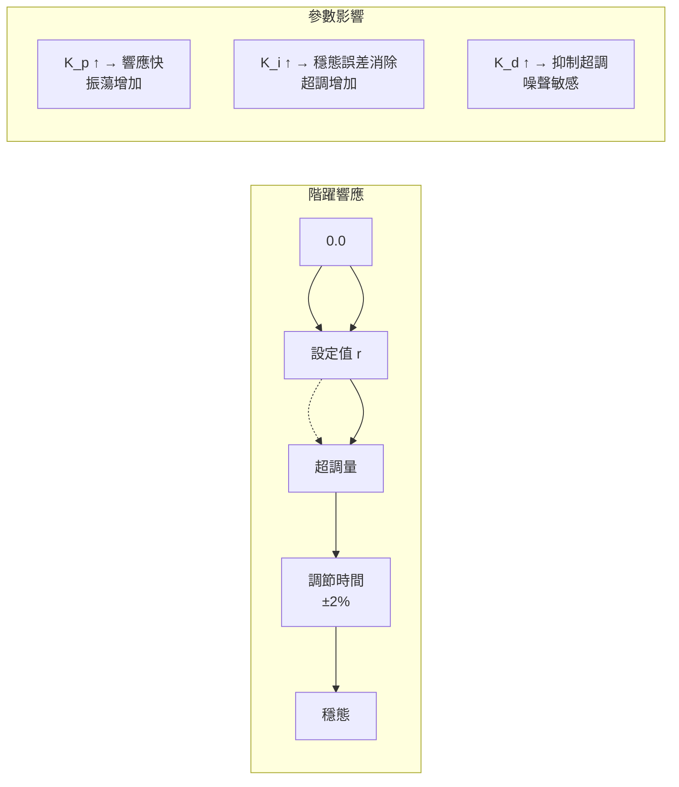
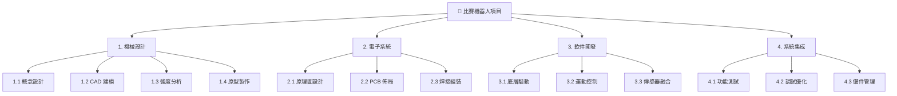
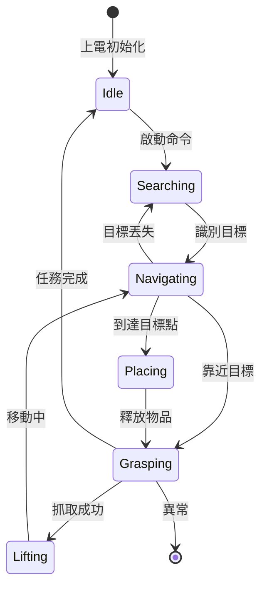

# MAEG2050 Robot Development in Practice: From Design to Prototyping

**CUHK MAE | Major Elective | 3 units**
**Stream**: Design and Manufacturing / Robotics and Automation

---

## Official Description
This course is aimed to enhance students' professional and engineering interests through practicum and team-based development of practical robots through participation in hands-on competitions. This is a project-based experiential course that exposes students to design and build practical robots. Students will be required to conceptualize and perform high-level design of a robot system, and then design and build various components using skills including CAD drawing, mechanical structure, electronic circuits and programming skills. Students will practice their engineering knowledge through tutorial-style workshops and laboratory sessions. The goal is to develop and nurture skills in problem-solving, hands-on skills, project and time management through the project. Students should obtain approval from the course instructor to ensure that the participated activities are in-line with the course learning outcomes.

---

## 問題 1：5 個核心心智模型

### 1. 機器人系統設計流程 (Robot System Design Process)
**方程式 + 數字**：
- 需求定義：功能分解 → FR (功能需求) → DFMEA
- 機構設計預算：每自由度成本 ~$50–500 (取決於精度需求)
- 典型比賽機器人：3–6 DOF，預算 $200–2000
- CAD 詳細設計：SolidWorks/Fusion 360，装配精度 ±0.1 mm
- 原型迭代：設計-製造-測試-改進 循環 (每周期 ~1–2 週)

**學者引用**：Siciliano et al. (2008), *Robotics: Modelling, Planning and Control*

### 2. 機電一體化設計 (Mechatronics Integration Design)
**方程式 + 數字**：
- 動力學建模：τ = M(q)q̈ + C(q,q̇)q̇ + G(q)（牛頓-歐拉或拉格朗日）
- 馬達選型：T_needed = T_static + T_dynamic = (m·g·r + J·α)·η
- 齒輪減速比：i = N_out/N_in，典型 i = 5:1 到 100:1
- 典型舵機：MG996R (Torque 10 kg·cm @ 6V), 59 g
- 編碼器分辨率：AB 相 400–1000 PPR (脈衝/轉)

**學者引用**：Robertino (2020), *Modern Robotics*

### 3. 傳感器選擇與融合 (Sensor Selection and Fusion)
**方程式 + 數字**：
- IMU 規格：MPU6050 (6軸), 加速度噪聲 ~3 mg/√Hz, 陀螺漂移 ~5°/s
- 超聲波測距：HC-SR04, 範圍 2 cm–4 m, 精度 ±3 mm, 角度 ~30°
- 紅外測距：Sharp GP2Y0A21, 範圍 10–80 cm, 非線性輸出
- 觸碰陣列：觸發力 ~100–500 g，矩陣掃描 8×8
- 感測器融合：卡爾曼濾波，協方差矩陣 P_k, Q, R 設計

**學者引用**：Bar-Shalom et al. (2001), *Estimation with Applications to Tracking and Navigation*

### 4. 控制系統架構 (Control System Architecture)
**方程式 + 數字**：
- PID 控制：u(t) = K_p·e(t) + K_i·∫e(t)dt + K_d·de(t)/dt
- 離散化：u[k] = K_p·e[k] + K_i·T_s·Σe[k] + K_d·(e[k]-e[k-1])/T_s
- 運動學逆解：6軸機械臂封閉解（Pieper 準則），數值迭代法
- 軌跡規劃：五次多項式 q(t) = a₀ + a₁t + a₂t² + a₃t³ + a₄t⁴ + a₅t⁵
- 實時控制週期：典型 1–10 ms (100–1000 Hz)

**學者引用**：Spong et al. (2006), *Robot Modeling and Control*

### 5. 專案管理與團隊協作 (Project Management)
**方程式 + 數字**：
- Gantt 圖：關鍵路徑識別，浮時計算
- 風險矩陣：概率 × 影響 = 風險值
- 迭代開發：每 sprint 2–3 週，站立會議每日
- BOM (物料清單)：成本控制 ±10%，採購週期 3–14 天
- 技術文檔：設計說明書 + 測試報告 + 用戶手冊

---

## 問題 2：3 個根本分歧

### 分歧 A：串聯結構 vs. 並聯結構 (Serial vs. Parallel Architecture)

**A 方（串聯機械臂）**：
- 運動學簡單，工作空間大，結構直觀
- 缺點：剛度低，誤差累積，慣性大

**B 方（並聯 Stewart 平台）**：
- 剛度高，精度高，慣性小
- 缺點：工作空間小，運動學複雜，控制難

### 分歧 B：離散傳感器 vs. 連續感測融合 (Discrete vs. Continuous Fusion)

**A 方（離散事件觸發）**：
- 簡單實現，計算量小，響應明確
- 缺點：信息損失，延遲累積

**B 方（連續感測融合）**：
- 充分利用所有信息，精度高
- 缺點：計算複雜，調試困難

### 分歧 C：比赛驅動 vs. 產品驅動 (Competition-driven vs. Product-driven)

**A 方（比赛導向）**：
- 明確目標和截止日期，激發團隊動力
- 缺點：過度優化特定任務，忽略通用性

**B 方（產品導向）**：
- 注重可持續性和可維護性
- 缺點：缺乏約束條件下可能進展緩慢

---

## 問題 3：10 個深度問題

1. 設計一個 4-DOF 機械爪機器人，包括：功能需求定義、機構選型、馬達計算、傳感器配置、控制架構設計。

2. 從牛頓-歐拉方程出發，推導平面 2R 機械臂的動力學模型，計算指定軌跡下的關節力矩。

3. 設計一個基於 MPU6050 IMU 和光編碼器的輪式移動機器人定位系統，說明卡爾曼濾波的狀態方程和量測方程。

4. 比較 PID 控制 vs. 計算力矩控制 (Computed Torque Control) 的原理和適用場景，並用 MATLAB/Simulink 進行仿真驗證。

5. 為什麼比賽機器人通常使用 RC 舵機而非工業步進伺服？從成本、精度、響應速度角度分析。

6. 設計一個 3D 列印機器人底盤的優化流程，包括拓撲優化和晶格填充，說明關鍵參數的選擇原則。

7. 在多傳感器融合中，解釋數據同步和坐標系標定的問題，並提出實際解決方案。

8. 說明 DMS (Design for Manufacturing) 和 DFM (Design for Assembly) 在比賽機器人設計中的具體應用原則。

9. 設計一個完整的專案管理計劃，包括工作分解結構 (WBS)、Gantt 圖、風險評估表。

10. 比較有刷直流馬達 vs. 無刷直流馬達 vs. 舵機在比賽機器人中的性能特性，並給出選型指南。

---

# 核心心智模型深化（中英對照）

## 1. 機器人系統設計流程 (Robot System Design Process)

### 1.1 Bilingual 概念對照
- **FR / 功能需求**：每個關節/自由度要實現的運動
- **DFMEA / 設計失效模式與效應分析**：系統性識別設計風險
- **機構學運動鏈 / Kinematic Chain**：串聯或並聯的剛體連桿組合
- **自由度 / DOF**：描述空間運動所需的最少獨立坐標數
- **工作空間 / Workspace**：末端執行器可達到的所有位置集合
- **BOM / 物料清單**：Bill of Materials，成本控制工具

### 1.2 關鍵推導
**自由度計算（Gruebler 方程）**：
```
平面機構：M = 3(n-1) - 2j
空間機構：M = 6(n-1) - 5j₁ - 4j₂ - 3j₃ - 2j₄ - j₅

n = 連桿數（包括基座）
j_i = 自由度為 i 的運動副數量
```

**工作空間估算**：
```
6-DOF 串聯機械臂：
每關節角度範圍：±90° to ±180°
典型工作空間：球形區域，半徑 ≈ ΣL_i (i=1 to 6)
```

### 1.3 工程應用案例
**RoboMaster 比賽機器人**：
- 雲台 (Gimbal)：2 DOF（偏航+俯仰），控制槍口方向
- 底盤：4 輪麥克納姆輪，全向移動
- 補給機構：1 DOF，彈丸供應
- 飛坡機構：離合器切換，1 DOF
- 預算控制：機構 ~30%，電子 ~25%，通信 ~15%，備件 ~20%

### 1.4 Deep Test Question
**Q**: 設計一個 3-DOF 揀選機械臂，要求工作半徑 500 mm，最大負載 500 g，定位精度 ±2 mm。
(a) 選擇每個關節的馬達（扭矩計算）
(b) 選擇減速比
(c) 選擇編碼器分辨率
(d) 給出 BOM 估算成本

**Solution**:
```
關節1 (肩部): 
M1 = 2 kg (連桿質量) + 1 kg (負載) = 3 kg
T1 = 3×9.81×0.3 ≈ 8.8 N·m → 選 12 N·m 馬達
減速比 i = 10:1 (舵機 10 kg·cm → 100 kg·cm)

關節2 (肘部):
M2 = 1.5 kg + 0.5 kg = 2 kg
T2 = 2×9.81×0.2 = 3.9 N·m → 選 5 N·m 馬達
i = 5:1

關節3 (腕部):
M3 = 0.5 kg
T3 = 0.5×9.81×0.1 = 0.5 N·m → 選 1 N·m 馬達
i = 3:1
```

### 1.5 圖解：機器人設計 V 模型
```mermaid
flowchart TD
    R1["需求定義<br/>系統規格書"] --> R2["功能分解<br/>FR Mapping"]
    R2 --> R3["概念設計<br/>方案比較"]
    R3 --> R4["詳細設計<br/>CAD+CAE"]
    R4 --> R5["原型製作<br/>3D列印+CNC"]
    R5 --> R6["系統集成<br/>機電整合"]
    R6 --> R7["測試驗證<br/>性能評估"]
    R7 -.->|"失敗|", R4
    R7 --> R8["迭代優化"]
    R8 -.->|"成功|", R9["完成交付"]
    R9 --> R10["比賽/展示"]
```

---

## 2. 機電一體化設計 (Mechatronics Integration)

### 2.1 Bilingual 概念對照
- **Mechatronics / 機電一體化**：機械+電子+控制+計算的跨學科整合
- **Actuator / 執行器**：將電能轉化為機械運動的裝置
- **Motor Sizing / 馬達選型**：根據扭矩/功率需求選擇馬達
- **Gear Ratio / 減速比**：i = ω_in/ω_out = T_out/T_in
- **Backlash / 齒輪回差**：空程誤差，影響定位精度

### 2.2 關鍵方程式
**扭矩需求計算**：
```
靜扭矩（克服重力）：
T_static = Σ(m_i × g × r_i) × η

動態扭矩：
T_dynamic = J_eq × α_eq
J_eq = Σ(J_i / i²) + m_load × r²

安全係數：SF = 1.5–2.0
T_motor ≥ T_needed × SF / (η × i)
```

**齒輪傳動效率**：
```
齒輪對效率：η ≈ 0.95–0.98 (潤滑良好)
諧波減速器：η ≈ 0.70–0.85
行星減速器：η ≈ 0.85–0.95
皮帶傳動：η ≈ 0.90–0.95
```

### 2.3 工程應用案例
**比賽機器人底盤**：
- 麥克納姆輪：4 輪獨立驅動，全向移動
- 典型配置：4× DC 馬達 12V 50W
- 速度：0–1.5 m/s
- 編碼器：磁編碼器 64–256 CPR

### 2.4 Deep Test Question
**Q**: 計算移動底盤馬達選型。底盤總重 5 kg，輪子半徑 50 mm，最大加速度 1 m/s²，最大速度 2 m/s。選擇合適的直流馬達。

**Solution**:
```
慣性需求：
J_wheel = m×r² = 5×(0.05)² = 0.0125 kg·m²
F_accel = m×a = 5×1 = 5 N
T_accel = F×r = 5×0.05 = 0.25 N·m

最大速度對應功率：
P = F×v = 5×2 = 10 W
考慮 4 個馬達 → 每個馬達 2.5 W + 安全係數 2 → 5 W

選擇：12V DC 馬達，額定功率 ≥20W，額定扭矩 ≥0.3 N·m
```

### 2.5 圖解：機電一體化系統架構
```mermaid
flowchart TD
    subgraph Input["感知輸入"]
        I1["IMU 姿態"]
        I2["超聲波測距"]
        I3["視覺識別"]
        I4["編碼器反饋"]
        I5["力感測器"]
    end
    subgraph Controller["控制層"]
        C1["STM32/ESP32"]
        C2["運動學解算"]
        C3["軌跡規劃"]
        C4["PID 控制"]
    end
    subgraph Actuation["執行層"]
        A1["DC/步進馬達"]
        A2["PWM 速度控制"]
        A3["舵機驅動"]
    end
    Input --> C1
    C1 --> Controller --> A1
    A1 -->|"反饋|", I4
```

---

## 3. 運動學與逆運動學 (Kinematics and Inverse Kinematics)

### 3.1 Bilingual 概念對照
- **Forward Kinematics / 正運動學**：q → T(q)，已知關節角求末端位置
- **Inverse Kinematics / 逆運動學**：T → q，已知末端位置求關節角
- **DH Convention / DH 參數法**：標準化關節坐標系設置
- **Workspace / 工作空間**：可達位置的集合
- **Singularity / 奇異位形**：Jacobian 行列式為零，運動受限

### 3.2 關鍵方程式
**DH 參數建立**：
```
第 i 連桿 DH 參數：
a_i = 連桿長度（z_{i-1} 到 z_i 沿 x_i 的距離）
α_i = 連桿扭角（繞 x_i 的 z_{i-1} 到 z_i 旋角）
d_i = 連桿偏移（沿 z_i 的 x_{i-1} 到 x_i 距離）
θ_i = 關節角（繞 z_i 的 x_{i-1} 到 x_i 旋角）

變換矩陣：
T_i^{i-1} = Rot(z, θ_i) × Trans(0,0,d_i) × Trans(a_i,0,0) × Rot(x, α_i)
```

**2R 平面機械臂逆解**：
```
x = L₁cosθ₁ + L₂cos(θ₁+θ₂)
y = L₁sinθ₁ + L₂sin(θ₁+θ₂)

r² = x² + y² = L₁² + L₂² + 2L₁L₂cosθ₂
cosθ₂ = (r² - L₁² - L₂²)/(2L₁L₂)
θ₂ = ±arccos(...)
θ₁ = atan2(y,x) - atan2(L₂sinθ₂, L₁+L₂cosθ₂)
```

### 3.3 工程應用案例
**SCARA 機械臂**：
- 4 DOF：Z軸升降 + 2 旋轉 + 末端抓取
- DH 參數：4×4 矩陣鏈乘
- 典型重複精度：±0.02 mm
- 應用：電子裝配、SMT 貼片

### 3.4 Deep Test Question
**Q**: 一個 3-DOF 機械臂，L₁=300 mm, L₂=250 mm, L₃=150 mm，目標位置 (400, 300, 200) mm。求所有可行的關節角配置（使用數值法或封閉解）。

### 3.5 圖解：正逆運動學
```mermaid
flowchart LR
    subgraph FK["正運動學 FK"]
        FK1["θ₁, θ₂, θ₃"] -->|"DH 矩陣|", FK2["T_0³ = T₁⁰·T₂¹·T₃²"]
        FK2 --> FK3["末端位置(x,y,z)<br/>姿態矩陣 R,P"]
    end
    subgraph IK["逆運動學 IK"]
        IK1["目標位置(x,y,z)"] --> IK2["幾何解/數值迭代"]
        IK2 --> IK3["關節角 θ₁, θ₂, θ₃"]
        IK3 -->|"驗證|", IK4["FK 計算核驗"]
    end
    FK1 -.->|"循環|", IK3
```

---

## 4. PID 控制與軌跡規劃 (PID Control and Trajectory Planning)

### 4.1 Bilingual 概念對照
- **PID Control / 比例-積分-微分控制**：最廣泛使用的反饋控制
- **Setpoint / 設定值**：目標值
- **Error / 誤差**：設定值 - 實際值
- **Overshoot / 超調量**：超越設定值的峰值
- **Settling Time / 調節時間**：誤差進入 ±2% 範圍的時間
- **Trajectory Planning / 軌跡規劃**：生成平滑的運動路徑

### 4.2 關鍵方程式
**PID 控制器**：
```
連續：u(t) = K_p·e(t) + K_i·∫e(t)dt + K_d·de(t)/dt

離散（數值積分）：
u[k] = K_p·e[k] + K_i·T_s·Σe[i] + K_d·(e[k]-e[k-1])/T_s

Ziegler-Nichols 調參法：
K_u = 最終增益（臨界增益）
P_u = 震蕩週期
K_p = 0.6·K_u, K_i = 1.2·K_u/P_u, K_d = 0.075·K_u·P_u
```

**五次多項式軌跡**：
```
q(t) = a₀ + a₁t + a₂t² + a₃t³ + a₄t⁴ + a₅t⁵

邊界條件：
q(0) = q₀, q(t_f) = q_f
q̇(0) = 0, q̇(t_f) = 0
q̈(0) = 0, q̈(t_f) = 0

求解：6 個方程 → 唯一 a₀...a₅
q(t) = q₀ + 10(q_f-q₀)(t/t_f)³ - 15(q_f-q₀)(t/t_f)⁴ + 6(q_f-q₀)(t/t_f)⁵
```

### 4.3 工程應用案例
**機械臂關節 PID 控制**：
```
典型參數（數字實例）：
K_p = 5–20, K_i = 0.1–1, K_d = 0.5–5
控制週期 T_s = 1 ms (1 kHz)
超調量 < 10%
調節時間 < 0.5 s
穩態誤差 < 1°
```

### 4.4 Deep Test Question
**Q**: 設計一個 2-DOF 平面機械臂的軌跡跟蹤控制系統。
(a) 建立狀態空間模型
(b) 設計計算力矩控制器
(c) 實現五次多項式軌跡

### 4.5 圖解：PID 控制原理
```mermaid
flowchart LR
    subgraph Plant["被控對象 Plant"]
        M["馬達+機械臂"]
    end
    subgraph PID_Controller
        P["P: K_p·e"]
        I["I: K_i∫e dt"]
        D["D: K_d·de/dt"]
    end
    subgraph Sensors
        E["編碼器"]
        IMU["IMU"]
    end
    subgraph Reference
        R["設定值 r(t)"]
    end
    R -->|"-|" --> P
    E -->|"反饋|", P
    P --> I --> D --> U["u(t) 控制輸入"] --> M
    M --> Y["y(t) 輸出"] -->|"-|", E
```

---

## 5. 專案管理與團隊協作 (Project Management)

### 5.1 Bilingual 概念對照
- **WBS / 工作分解結構**：Work Breakdown Structure
- **Critical Path / 關鍵路徑**：項目中最長的依賴路徑
- **Gantt Chart / 甘特圖**：任務時間線可視化
- **Risk Matrix / 風險矩陣**：概率 × 影響
- **Sprint / 衝刺**：敏捷開發的迭代周期
- **BOM / 物料清單**：Bill of Materials

### 5.2 關鍵推導
**關鍵路徑計算**：
```
ES (最早開始) = max(EF of predecessors)
EF (最早完成) = ES + duration
LF (最晚開始) = min(LS of successors)
LS (最晚開始) = LF - duration
Float = LS - ES

關鍵路徑：Float = 0 的所有任務
```

**風險評估表**：
```
風險值 = 概率 (1-5) × 影響 (1-5)
高風險 (>15)：立即緩解
中風險 (10-15)：持續監控
低風險 (<10)：接受
```

### 5.3 工程應用案例
**12 週比賽機器人專案計劃**：
```
第 1-2 週：需求定義 + 概念設計
第 3-4 週：CAD 設計 + 馬達/傳感器選型
第 5-7 週：原型製作 + 電路板焊接
第 8-9 週：軟件開發 + 控制調試
第 10-11 週：集成測試 + 迭代改進
第 12 週：比賽 + 技術報告
```

### 5.4 Deep Test Question
**Q**: 用 WBS 和 Gantt 圖設計一個 8 週的比賽機器人專案計劃，包括關鍵路徑識別和風險評估表。

### 5.5 圖解：專案管理框架
```mermaid
flowchart LR
    subgraph Initiation["立項 Initiation"]
        I1["需求定義"]
        I2["可行性分析"]
    end
    subgraph Planning["規劃 Planning"]
        P1["WBS 工作分解"]
        P2["Gantt 圖"]
        P3["風險評估"]
        P4["資源配置"]
    end
    subgraph Execution["執行 Execution"]
        E1["機構加工"]
        E2["電路焊接"]
        E3["軟件開發"]
        E4["系統集成"]
    end
    subgraph Monitor["監控 Monitor & Control"]
        M1["每週評審"]
        M2["進度追蹤"]
        M3["測試驗證"]
    end
    Initiation --> Planning --> Execution --> Monitor
    Monitor -.->|"偏差|", Planning
```

---

## 深度自測問題詳解

**Q1 Solution**: 4-DOF 機械爪設計
```
FR 定義：
FR1: 底盤移動 (2 DOF: x, y)
FR2: 機械臂升降 (1 DOF: z)
FR3: 末端抓取 (1 DOF: 爪開合)

馬達選型：
底盤：4× 12V DC 馬達 20W (麥克納姆輪)
機械臂：3× 伺服 MG996R 或步進 42 步進
抓取：1× 小型舵機 SG90
傳感器：超聲波×4 (避障) + IMU (姿態)
```

**Q2 Solution**: 2R 平面機械臂動力學
```
牛頓-歐拉遞推：
連桿 1:
ω̇₁ = J₁⁻¹(τ₁ - Σ external moments)
連桿 2:
ω̇₂ = J₂⁻¹(τ₂ - cross term interactions)

簡化（忽略哥氏力和離心力）：
τ₁ = m₁gL₁/2·cosθ₁ + m₂g(L₁·cosθ₁ + L₂/2·cos(θ₁+θ₂)) + J₁α₁
τ₂ = m₂g·L₂/2·cos(θ₁+θ₂) + J₂α₂
```

**Q5 Solution**: RC 舵機 vs 工業步進伺服
```
RC 舵機：
成本：$5–$50
扭矩密度：高（集成減速器）
精度：±1° (8-bit PWM)
響應：快 (0.1–0.2 s/60°)
缺點：無位置反饋（電位器），力矩限制

步進伺服：
成本：$50–$200
精度：高（編碼器反饋）
保持扭矩：大
缺點：高速丟步，需微步驅動
→ 比賽場景：舵機性價比高，但精度要求高時用步進
```

---

## 📊 Diagram 1: 機器人系統架構總圖
```mermaid
flowchart TD
    subgraph Perception["感知層 Perception"]
        P1["IMU 姿態感測"]
        P2["編碼器位置"]
        P3["超聲波測距"]
        P4["視覺識別"]
    end
    subgraph Planning["規劃層 Planning"]
        PL1["軌跡規劃"]
        PL2["運動學求解"]
        PL3["地圖構建"]
    end
    subgraph Control["控制層 Control"]
        C1["PID 控制"]
        C2["軌跡跟蹤"]
        C3["力控制"]
    end
    subgraph Actuation["執行層 Actuation"]
        A1["直流馬達"]
        A2["舵機"]
        A3["步進馬達"]
    end
    P1 & P2 & P3 & P4 --> Planning
    Planning --> Control --> Actuation
    Actuation -->|"位置反饋|", P2
```

---

## 📊 Diagram 2: 2R 機械臂運動學示意
```mermaid
graph LR
    subgraph Linkages["連桿結構"]
        B["基座"] -->|"L₁=0.3m|", L1["連桿1<br/>θ₁"]
        L1 -->|"L₂=0.25m|", L2["連桿2<br/>θ₂"]
        L2 -->|"L₃=0.15m|", E["末端執行器<br/>(x,y)"]
    end
    subgraph Formulas["關鍵公式"]
        F1["x = L₁cosθ₁ + L₂cos(θ₁+θ₂) + L₃cos(θ₁+θ₂+θ₃)"]
        F2["y = L₁sinθ₁ + L₂sin(θ₁+θ₂) + L₃sin(θ₁+θ₂+θ₃)"]
        F3["Jacobian J = ∂(x,y)/∂(θ₁,θ₂)"]
    end
```

---

## 📊 Diagram 3: PID 控制響應曲線


---

## 📊 Diagram 4: 專案 WBS 分解


---

## 📊 Diagram 5: 狀態機控制架構


---

## 總結

MAEG2050 通過實踐項目將機械設計、電子工程、控制理論和軟件開發整合為一體。5 個核心心智模型構成完整的工程能力框架：

1. **系統設計流程**：從需求到原型的 V 形開發模型
2. **機電一體化**：機構-電子-控制跨學科整合
3. **運動學/逆運動學**：機器人幾何的核心數學工具
4. **PID 控制 + 軌跡規劃**：運動控制的基礎演算法
5. **專案管理**：將工程知識轉化為可交付成果的組織能力

這門課強調"做中學"，每個團隊都需要在預算、時間和性能約束下完成一個功能完整的機器人系統。這是從理論學習到工程實踐的關鍵橋樑。
