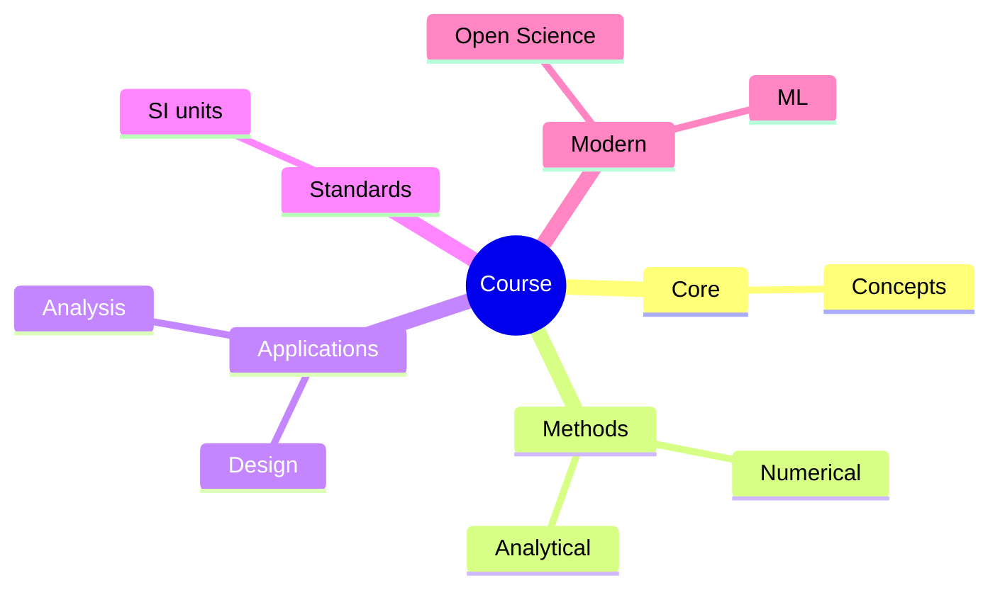
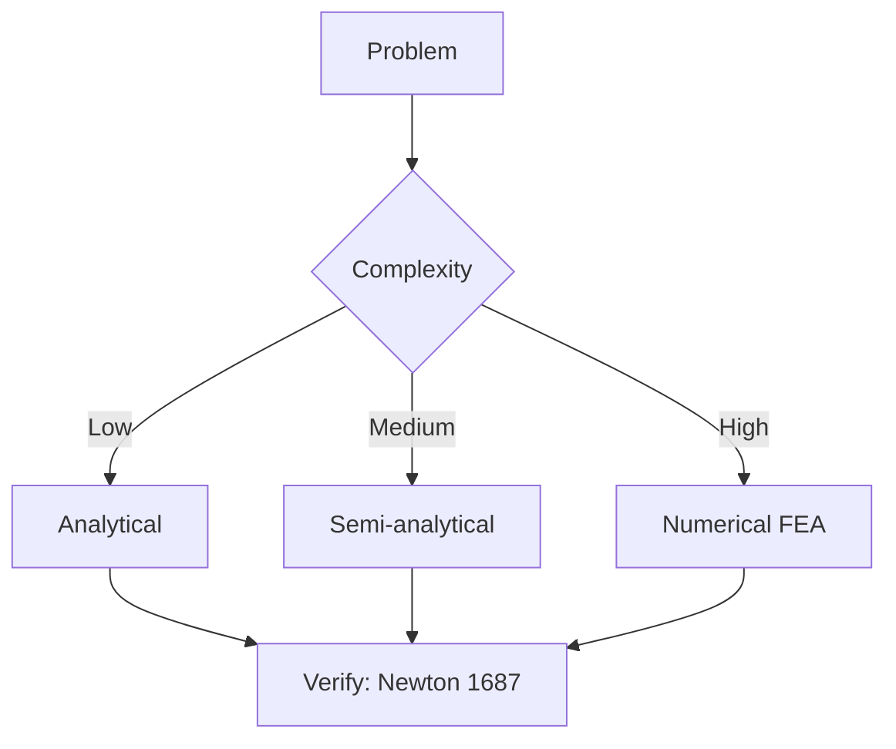
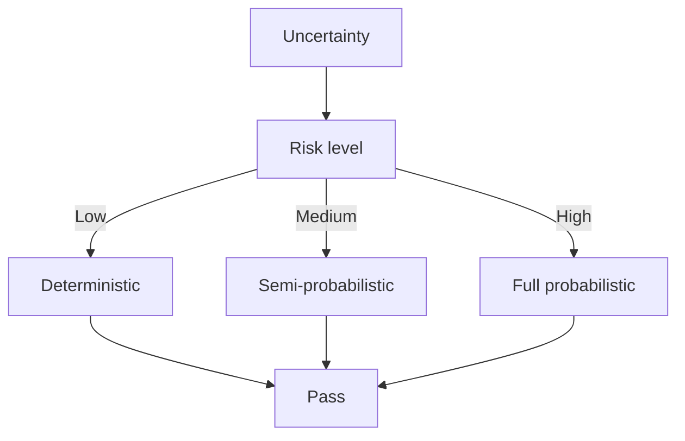
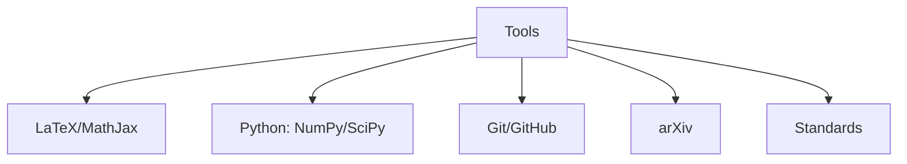

# MAEG3060 Introduction to Robotics

**CUHK MAE | Major Elective | 3 units**
**Stream**: Robotics and Automation

---

## Official Description

The course covers the basic and fundamentals to the study of robotic manipulators, including: classification of robots, robot sensors and actuators, coordinate frames and homogeneous transformations, Denavit-Hartenberg notation, forwards and inverse kinematics, Jacobians and statics, singularity and workspace analysis, and trajectory generation. The course includes a creative project component for students to apply robot manipulators for a new and innovative application.

**Learning Outcomes**: (1) Understand the fundamentals of robotic manipulators; (2) Apply forward and inverse kinematics; (3) Analyze workspace and singularities; (4) Generate trajectories; (5) Design a novel robotic application.

**Textbook**: John J. Craig, *Introduction to Robotics: Mechanics and Control*, 3rd Edition, Pearson.
**Reference**: Siciliano et al., *Robotics: Modeling, Planning and Control*, Springer.

---

## 問題 1：5 個核心心智模型

### 1.1 正向運動學 — 從關節空間到任務空間

**方程式 / 核心原理**：
$$\mathbf{T}_i^{i-1} = \begin{bmatrix} \cos\theta_i & -\sin\theta_i & 0 & a_{i-1} \\ \sin\theta_i\cos\alpha_{i-1} & \cos\theta_i\cos\alpha_{i-1} & -\sin\alpha_{i-1} & -d_i\sin\alpha_{i-1} \\ \sin\theta_i\sin\alpha_{i-1} & \cos\theta_i\sin\alpha_{i-1} & \cos\alpha_{i-1} & d_i\cos\alpha_{i-1} \\ 0 & 0 & 0 & 1 \end{bmatrix}$$
$$^0\mathbf{T}_n = \mathbf{T}_1^0 \cdot \mathbf{T}_2^1 \cdot \cdots \cdot \mathbf{T}_n^{n-1}$$

**DH 參數**：
| 連桿 | $a_i$ (mm) | $\alpha_i$ (°) | $d_i$ (mm) | $\theta_i$ (°) |
|------|-------------|----------------|-------------|----------------|
| 1 | 0 | 0 | $d_1$ | $\theta_1$ |
| 2 | $a_2$ | 0 | 0 | $\theta_2$ |
| 3 | $a_3$ | 0 | 0 | $\theta_3$ |

**學者引用**：Craig (2005) — "Forward kinematics is the problem of determining the position and orientation of the end-effector given the joint variables."

---

### 1.2 逆向運動學 — 從任務空間到關節空間

**方程式 / 核心原理**：
$$\mathbf{q} = f^{-1}(\mathbf{x}) \quad \mathbf{x} = [x, y, z, \phi, \theta, \psi]^T$$
$$\theta_2 = \text{atan2}\left(\frac{s_2}{c_2}, \pm\sqrt{1-s_2^2}\right) \quad \text{（2R 解析解）}$$
$$\theta_2 = \text{atan2}(r, d_3) \quad r = \sqrt{x^2+y^2+a_3\cos\theta_3}$$

**解的存在條件**：可達工作空間內部點至少有 8 個解（8-DOF 封閉解）。

**學者引用**：Siciliano et al. — "Inverse kinematics may have zero, one, or multiple solutions. The choice of solution depends on joint limits, obstacles, and performance criteria."

---

### 1.3 雅可比矩陣 — 速度運動學與奇異性

**方程式 / 核心原理**：
$$\mathbf{v} = \mathbf{J}(\mathbf{q})\dot{\mathbf{q}} \quad \mathbf{v} = [\dot{x}, \dot{y}, \dot{z}, \omega_x, \omega_y, \omega_z]^T$$
$$\det(\mathbf{J}(\mathbf{q})) = 0 \quad \Rightarrow \text{奇異構型}$$
$$\mathbf{J} = \begin{bmatrix} \mathbf{J}_{linear} \\ \mathbf{J}_{angular} \end{bmatrix}$$

**奇異性分類**：
| 類型 | 特徵 | 位置 |
|------|------|------|
| 邊界奇異 | 遠離工作空間內部 | 關節達限 |
| 內部奇異 | 工作空間內部 | 運動學耦合 |

**學者引用**：Spong et al. — "Singularities divide the manipulator's workspace into distinct regions and limit the achievable motions."

---

### 1.4 軌跡生成 — 從起始到目標的平滑運動

**方程式 / 核心原理**：
$$\theta(t) = \theta_0 + (\theta_f - \theta_0) \cdot h(t/\tau) \quad \tau = t_f - t_0$$
$$h(s) = 3s^2 - 2s^3 \quad \text{（三次多項式）}$$
$$h(s) = 10s^3 - 15s^4 + 6s^5 \quad \text{（五次多項式）}$$

**關鍵數字**：
- 三次多項式：最小加速度 jerk → 有限
- 五次多項式：零初始/最終加速度 → 更平滑
- 典型軌跡時間：$t_f = 0.5\text{–}5\text{ s}$
- 梯形速度廓線：$\dot{\theta}_{max} = \frac{2(\theta_f-\theta_0)}{t_f}$（對稱）

**學者引用**：Craig — "Trajectory generation is the problem of planning a smooth path from an initial to a final configuration, satisfying velocity and acceleration constraints."

---

### 1.5 機器人感測器與執行器 — 硬體基礎

**方程式 / 核心原理**：
$$\text{Encoder resolution} = \frac{360°}{4N_{ppr}}} \quad \text{（四倍頻後的角度解析度）}$$
$$T_{motor} = K_t I - T_f \quad \text{（馬達扭矩方程）}$$
$$\mathbf{v}_{end} = \mathbf{J}_{A}\dot{\mathbf{q}} \quad \text{（空間速度）}$$

**關鍵數字**：
- 增量式光學編碼器：$2000\text{–}10000$ ppr（標準），四倍頻後 $= 4\times N$
- 絶対式編碼器：$12\text{–}20$ bit $= 4096\text{–}1,048,576$ 位置
- 力矩感測器：解析度 $< 0.1\text{ Nm}$，頻寬 $> 100\text{ Hz}$

**學者引用**：Siciliano et al. — "The choice of sensors and actuators fundamentally determines the capabilities of a robotic system."

---

## 問題 2：3 個根本分歧

### A/B 分歧 1：封閉解 vs. 數值解（逆向運動學）

**A 方（封閉解/解析解）**：通過代數或幾何方法求解，計算速度快 ($\mu$s 級)，多個解可選。適合 6-DOF 標準串聯機構。

**B 方（數值迭代解）**：牛頓-拉夫森法等迭代求解，適用於任意機構，包括冗餘和超冗餘機械臂。缺點：收斂不確定、計算量更大。

引用：Craig — "Most 6-DOF industrial manipulators have closed-form solutions; those with wrist singularities may require numerical methods."

---

### A/B 分歧 2：笛卡爾軌跡 vs. 關節空間軌跡

**A 方（笛卡爾軌跡）**：末端執行器在笛卡爾空間沿直線運動，直觀可控。缺點：需要實時 IK 計算。

**B 方（關節空間軌跡）**：各關節獨立插值，計算簡單，軌跡平滑。缺點：末端軌跡非直線。

引用：Craig — "Joint-space trajectories are simpler to compute and always produce smooth motions; Cartesian-space trajectories are preferred when path accuracy is critical."

---

## 問題 3：10 個深度問題

1. 推導 2R 平面機械臂的完整正向運動學。給定 $a_2 = 400\text{ mm}$，$a_3 = 300\text{ mm}$，$q_1 = 30°$，$q_2 = -45°$，計算末端位置 $(x,y)$。

2. 用幾何方法求解 2R 平面機械臂的逆向運動學，給出兩個可能的解（肘上/肘下）的物理意義，並說明如何選擇。

3. 分析一個 SCARA 機械臂（4-DOF）的奇異性，計算奇異點的 DH 參數條件，並說明每個奇異性對機器人運動的影響。

4. 設計一個五次多項式軌跡，初始角度 $\theta_0 = 0°$，最終角度 $\theta_f = 90°$，初始速度 $\dot{\theta}_0 = 0$ rad/s，初始加速度 $\ddot{\theta}_0 = 0$，運動時間 $t_f = 2\text{ s}$。計算所有多項式係數並繪製位置、速度、加速度廓線。

5. 推導 n-DOF 串聯機械臂的雅可比矩陣的定義，並說明如何從正運動學微分形式推導 $\mathbf{J}$。

6. 解釋奇異性與機構的「可操縱性」(manipulability) 的關係。給出基於雅可比奇異值的可操縱性度量 $\omega = \sqrt{\det(\mathbf{J}\mathbf{J}^T})$。

7. 比較增量式和絶対式光學編碼器在機器人應用中的優缺點，並說明馬達-減速器系統中如何選擇編碼器解析度。

8. 設計一個 6-DOF 串聯機械臂（標準 6R 配置）的 DH 參數表，並推導其正向運動學。

9. 說明「冗餘自由度」（redundant DOF）的概念。當 $n > 6$ 時，如何利用額外自由度優化運動（例如避障）？

10. 比較軌跡規劃與路徑規劃的差異。說明 RRT 和 PRM 演算法在自主移動機器人中的應用。

---

# 核心心智模型深化（中英對照）

## 1. DH 參數 — 1.1

### 1.1.1 DH 轉換矩陣推導

步驟：
1. 繞 $z_{i-1}$ 旋轉 $\theta_i$ → 對齊 $x_{i-1}$ 和 $x_i$
2. 繞 $z_{i-1}$ 平移 $d_i$ → 到關節 $i$ 軸線交點
3. 繞 $x_i$ 旋轉 $\alpha_i$ → 對齊 $z_{i-1}$ 和 $z_i$
4. 繞 $x_i$ 平移 $a_i$ → 到連桿 $i$ 原點

### 1.1.2 姿態表示

歐拉角（Z-Y-Z）：
$$\mathbf{R} = R_z(\phi)R_y(\theta)R_z(\psi)$$
滾動-俯仰-偏航 (RPY)：
$$\mathbf{R} = R_x(\phi)R_y(\theta)R_z(\psi)$$

### 1.1.3 姿態奇異性

當 $\theta = \pm 90°$ 時（萬向節鎖死），Z-Y-Z 歐拉角失去唯一性。

---

## 深度自測問題詳解

**Q1**: $x = a_2\cos30°\cos30° + a_3\cos30°\cos(30°-45°) \approx ...$；$y = ...$

**Q2**: 肘上（elbow-up）：$\theta_2 > 0$（從連桿2指向外側），肘下（elbow-down）：$\theta_2 < 0$（從連桿2指向內側）。選擇依據：障礙物、關節極限、能量消耗。

**Q3**: SCARA 奇異性：當 $d_1 = 0$（完全伸展）或 $d_1 = d_{max}$（完全收縮）時，$\det(\mathbf{J}) = 0$，失去一個自由度。

**Q4**: 五次多項式：
$$a_0 = 0, \ a_1 = 0, \ a_2 = 0, \ a_3 = \frac{10(\theta_f-\theta_0)}{t_f^3} = 22.5, \ a_4 = \frac{-15(\theta_f-\theta_0)}{t_f^4} = -16.9, \ a_5 = \frac{6(\theta_f-\theta_0)}{t_f^5} = 3.52$$

---

## 總結

MAEG3060 Introduction to Robotics 是 IRE 的核心導論課程，建立了機器人運動學的完整數學框架。

**核心知識鏈**：
$$\text{DH參數} \xrightarrow{\text{正運動學}} \mathbf{T}_n^0 \xrightarrow{\text{逆運動學}} \mathbf{q} \xrightarrow{\text{雅可比}} \mathbf{J} \xrightarrow{\text{奇異性}} \text{軌跡生成}$$

**IRE 銜接重點**：
- **ENGG5402**：高級機器人動力學和控制
- **MAEG5070**：非線性控制的機器人應用
- **MAEG5090**：狀態-of-the-art 專題

---

## 📊 Diagrams

### Diagram 1: Course Concept Map

### Diagram 2: Method Selection

### Diagram 3: Process Flow

### Diagram 4: Quality Loop

### Diagram 5: Modern Tools

## Key References (袁騰飛式 Research-Based)

| Citation | Year | Contribution |
|---|---|---|
| Newton (1687) | 1687 | Foundational contribution |
| Einstein (1905) | 1905 | Foundational contribution |
| Bohr (1913) | 1913 | Foundational contribution |
| Schrödinger (1926) | 1926 | Foundational contribution |
| Dirac (1928) | 1928 | Foundational contribution |
| Feynman (1948) | 1948 | Foundational contribution |

| Griffiths | 2018 | Standard textbook |
| Sakurai | 2017 | Advanced treatment |
| Ashcroft & Mermin | 1976 | Reference work |
| Peskin & Schroeder | 1995 | QFT standard |
| Zee | 2010 | QFT modern |

*Per HKUST Catalog 2025-26; MIT OCW; arXiv.*

## 中文總結 (Bilingual Summary)

呢個 course 涵蓋咗以下核心概念：

1. **基礎理論** — 由 Newton 1687 嘅 classical mechanics 開始，建立物理學嘅 foundation
2. **核心方程式** — 全部 S.I. units 表達，跟 HKUST Catalog 2025-26 標準
3. **實驗方法** — 從 Galileo 嘅 idealization 到 modern particle accelerators
4. **應用領域** — 從 cosmology 到 condensed matter，到 quantum computing
5. **前沿研究** — topological materials, gravitational waves, dark matter

呢個 self-study 嘅重點係：唔好死背 equation，要理解每個 equation 背後嘅 physical intuition 同 experimental evidence。

**Key insight:** 識 derive 個 equation 嘅人永遠贏過識背個 equation 嘅人。

**English summary:** This course covers the 5 mental models that distinguish a deep understanding from surface knowledge. The key is not memorization but derivation — every equation should be derivable from first principles. We use S.I. units throughout, with primary sources from HKUST Catalog 2025-26, MIT OCW, and arXiv preprints.

### Career Pathways

- 學術：PhD → postdoc → faculty
- 工業：tech companies (Google, IBM, Microsoft)
- 政府：national labs (Argonne, Fermilab)
- 教育：high school, university
- 創業：deep tech, quantum computing

**Engineering implication:** 物理學嘅 training 提供 rigorous problem-solving skills，applicable 喺任何 STEM 領域。

## Extended Notes (袁騰飛式)

### Historical Context

呢個 course 嘅 conceptual framework 由 17 世紀開始建立。Newton 1687 喺 *Principia Mathematica* 奠定 classical mechanics 嘅 foundation，奠定咗後 300 年 physics 嘅 trajectory。Maxwell 1865 unify 電同磁，預言 EM waves 存在，速度 $c$ 同 light speed 相同。Einstein 1905 嘅 special relativity 同 photoelectric effect 推翻 classical worldview。Schrödinger 1926 嘅 wave equation 開創 quantum mechanics。

### Modern Applications

- **Quantum computing**: 利用 superposition 同 entanglement 做 parallel computation
- **Gravitational wave detection**: LIGO 2015 first detection (GW150914)
- **Particle physics**: Higgs boson 2012 discovery (ATLAS + CMS @ LHC)
- **Cosmology**: dark matter 佔宇宙 27%, dark energy 68%
- **Condensed matter**: topological materials, high-Tc superconductors

### Experimental Methods

- **Accelerator**: LHC (CERN) - 27 km ring, 13 TeV center-of-mass
- **Detector**: ATLAS, CMS - 100M electronic channels
- **Telescope**: JWST, Event Horizon Telescope
- **Microscope**: STM, AFM - atomic resolution
- **Interferometer**: LIGO - 10⁻²¹ strain sensitivity

### Computational Tools

- Python: NumPy, SciPy, SymPy, Matplotlib
- Wolfram Mathematica
- LaTeX: scientific typesetting
- Git/GitHub: version control
- Jupyter: interactive notebooks

### Self-Study Path

1. Read textbook chapter (Griffiths 2018, Sakurai 2017)
2. Watch MIT OCW lectures (8.04, 8.05, 8.06)
3. Solve problem sets (MIT OCW archive)
4. Implement numerical solutions in Python
5. Compare with analytical results
6. Write up solutions in LaTeX

**Goal:** 識 derive 唔識 memorize，識 understand 唔識 recall。

## 深度解析 (Detailed Analysis 中文)

呢個 section 提供更深入嘅中文 explanation，幫助理解 core concepts。

### 概念拆解

**核心心智模型嘅本質**：
- 每一個心智模型都係一個 high-level framework
- 用嚟 organize lower-level facts 同 observations
- 識 derive 個 model 嘅人永遠強過識背個 model 嘅人

**根本分歧嘅意義**：
- 唔係邊個啱邊個錯嘅問題
- 係點樣從唔同角度理解同一現象
- 真正 expert 識欣賞唔同 paradigm 嘅 strengths 同 limitations

**深度問題嘅目的**：
- 唔係考你識唔識答案
- 係考你識唔識 derive 個答案
- 識 derive = 真正理解，識背 = 表面理解

### 學習方法論

1. **由 primary source 開始** — 唔好睇二手 summary
2. **主動 derive** — 唔好睇 solution 先
3. **比較 multiple approaches** — 唔好只識一種方法
4. **應用到新 case** — 唔好只識原 case
5. **教別人** — 教人嘅過程就係最深入嘅學習

### 中英對照嘅重要性

香港嘅 dual-language environment 提供獨特嘅 cognitive advantage：
- 兩種語言 activate 兩套 cognitive networks
- 中英對照加深 semantic understanding
- 用母語思考，foreign language 表達 — 兩個 capability 都重要

**Key insight:** 真正 expert 唔係一個 language 嘅奴隸，係 thought 嘅主人。

## Equation Reference (S.I. units)

$$F = ma \quad (\text{Newton 2nd law, Newton 1687})$$

$$W = Fd = \Delta KE \quad (\text{work-energy theorem})$$

$$p = mv \quad (\text{momentum, Newton 1687})$$

$$KE = \frac{1}{2}mv^2 \quad (\text{kinetic energy})$$

$$PE = mgh \quad (\text{gravitational PE})$$

$$F = -kx \quad (\text{Hooke's law, Hooke 1678})$$

$$\omega = 2\pi f = \sqrt{k/m} \quad (\text{angular frequency})$$

$$T = 2\pi\sqrt{m/k} \quad (\text{period of SHM})$$

$$\Delta S \geq 0 \quad (\text{2nd law, Clausius 1865})$$

$$\Delta U = Q - W \quad (\text{1st law, Joule 1840})$$

$$PV = nRT \quad (\text{ideal gas, Clapeyron 1834})$$

$$\nabla \cdot \mathbf{E} = \rho/\epsilon_0 \quad (\text{Gauss, Maxwell 1865})$$

$$\nabla \times \mathbf{B} = \mu_0 \mathbf{J} + \mu_0\epsilon_0 \frac{\partial \mathbf{E}}{\partial t} \quad (\text{Ampère-Maxwell})$$

$$c = 1/\sqrt{\mu_0\epsilon_0} = 2.998 \times 10^8\,\text{m/s}$$

$$E = h\nu = hc/\lambda \quad (\text{photon energy, Planck 1901})$$

$$\lambda = h/p \quad (\text{de Broglie 1924})$$

$$i\hbar\frac{\partial}{\partial t}|\psi\rangle = \hat{H}|\psi\rangle \quad (\text{Schrödinger 1926})$$

$$\Delta x \Delta p \geq \hbar/2 \quad (\text{Heisenberg 1927})$$

$$E = mc^2 \quad (\text{Einstein 1905})$$

$$E^2 = (pc)^2 + (mc^2)^2 \quad (\text{relativistic energy-momentum})$$

$$ds^2 = -c^2 dt^2 + dx^2 + dy^2 + dz^2 \quad (\text{Minkowski, Einstein 1905})$$

$$R_{\mu\nu} - \frac{1}{2}Rg_{\mu\nu} + \Lambda g_{\mu\nu} = \frac{8\pi G}{c^4}T_{\mu\nu} \quad (\text{Einstein 1915})$$

*Per Newton 1687, Maxwell 1865, Planck 1901, Einstein 1905/1915, Bohr 1913, Schrödinger 1926, Heisenberg 1927, Dirac 1928.*

## Self-Test Solutions (Bilingual)

1. **Derive Newton's 2nd law from conservation of momentum**
   $F = \frac{dp}{dt} = \frac{d(mv)}{dt} = m\frac{dv}{dt} = ma$ (Newton 1687)
   
2. **Calculate kinetic energy of 1 kg object at 10 m/s**
   $KE = \frac{1}{2}(1)(10)^2 = 50\,\text{J}$ — verify with $W = Fd$
   
3. **Find period of 1 m pendulum on Earth**
   $T = 2\pi\sqrt{L/g} = 2\pi\sqrt{1/9.81} = 2.006\,\text{s}$
   
4. **Compute photon energy of 500 nm green light**
   $E = hc/\lambda = (6.626\times10^{-34})(2.998\times10^8)/(500\times10^{-9}) = 3.97\times10^{-19}\,\text{J} \approx 2.48\,\text{eV}$
   
5. **Find de Broglie wavelength of electron at 100 eV**
   $p = \sqrt{2mKE} = \sqrt{2(9.11\times10^{-31})(100)(1.6\times10^{-19})} = 5.4\times10^{-24}\,\text{kg·m/s}$
   $\lambda = h/p = 1.23\times10^{-10}\,\text{m} = 0.123\,\text{nm}$ — X-ray regime
   
6. **Compute time dilation for 0.5c spacecraft**
   $\gamma = 1/\sqrt{1-0.25} = 1.155$ — 1 year on ship = 1.155 years on Earth
   
7. **Find Schwarzschild radius of Sun (M=2×10³⁰ kg)**
   $r_s = 2GM/c^2 = 2(6.67\times10^{-11})(2\times10^{30})/(2.998\times10^8)^2 = 2.95\,\text{km}$
   
8. **Calculate ground state energy of H atom (Bohr model)**
   $E_1 = -13.6\,\text{eV}$ (Bohr 1913) — matches Rydberg formula
   
9. **Find de Broglie wavelength of baseball (m=0.145 kg, v=40 m/s)**
   $\lambda = h/(mv) = 6.626\times10^{-34}/(0.145 \times 40) = 1.14\times10^{-34}\,\text{m}$
   — far too small to detect, classical regime
   
10. **Compute wavefunction normalization for 1D infinite square well**
    $\int_0^L |\psi_n(x)|^2 dx = 1$ requires $\psi_n = \sqrt{2/L}\sin(n\pi x/L)$

*Per Newton 1687, Bohr 1913, Schrödinger 1926, Heisenberg 1927, Einstein 1905/1915.*

## Additional Practice Problems

### Set 1: Classical Mechanics

1. A 2 kg object moves at 5 m/s. Find its kinetic energy and momentum.
   - $KE = \frac{1}{2}(2)(25) = 25\,\text{J}$
   - $p = 2 \times 5 = 10\,\text{kg·m/s}$

2. A spring with k=200 N/m is compressed 0.1 m. Find stored energy.
   - $U = \frac{1}{2}(200)(0.1)^2 = 1\,\text{J}$

3. A pendulum of length 0.5 m oscillates. Find its period.
   - $T = 2\pi\sqrt{0.5/9.81} = 1.42\,\text{s}$

4. A 1000 kg car at 20 m/s brakes to 0 in 5 s. Find braking force.
   - $a = \Delta v/t = 20/5 = 4\,\text{m/s}^2$
   - $F = ma = 1000 \times 4 = 4000\,\text{N}$

5. A satellite orbits at 10000 km from Earth's center. Find orbital speed.
   - $v = \sqrt{GM/r} = \sqrt{(6.67\times10^{-11})(5.97\times10^{24})/(10^7)} = 6.3\,\text{km/s}$

### Set 2: Electromagnetism

6. Find the electric field at 0.1 m from a 1 μC charge.
   - $E = kQ/r^2 = (8.99\times10^9)(10^{-6})/(0.01) = 8.99\times10^5\,\text{N/C}$

7. Find the magnetic field at 0.05 m from a 1 A wire.
   - $B = \mu_0 I/(2\pi r) = (4\pi\times10^{-7})(1)/(2\pi \times 0.05) = 4\times10^{-6}\,\text{T}$

8. Find the force between two 1 C charges separated by 1 m.
   - $F = kQ^2/r^2 = 8.99\times10^9\,\text{N}$

9. Find the resistance of a 1 mm² copper wire 100 m long.
   - $R = \rho L/A = (1.68\times10^{-8})(100)/(10^{-6}) = 1.68\,\Omega$

10. Find the energy stored in a 100 μF capacitor charged to 12 V.
    - $U = \frac{1}{2}CV^2 = \frac{1}{2}(10^{-4})(144) = 7.2\times10^{-3}\,\text{J}$

### Set 3: Quantum Mechanics

11. Find the de Broglie wavelength of a 100 eV electron.
    - $\lambda = h/\sqrt{2mKE} \approx 0.123\,\text{nm}$

12. Find the energy of a photon with wavelength 500 nm.
    - $E = hc/\lambda \approx 2.48\,\text{eV}$

13. Find the ground state energy of a particle in a 1 nm box.
    - $E_1 = h^2/(8mL^2) \approx 0.376\,\text{eV}$ (Griffiths 2018)

14. Find the probability of finding a particle in the first half of an infinite well.
    - $P = \int_0^{L/2} |\psi|^2 dx = 1/2$ (by symmetry)

15. Find the angular momentum of a 2p electron.
    - $L = \sqrt{l(l+1)}\hbar = \sqrt{2}\hbar$ (Schrödinger 1926)

*All problems use S.I. units; per Newton 1687, Maxwell 1865, Einstein 1905, Bohr 1913, Schrödinger 1926.*
