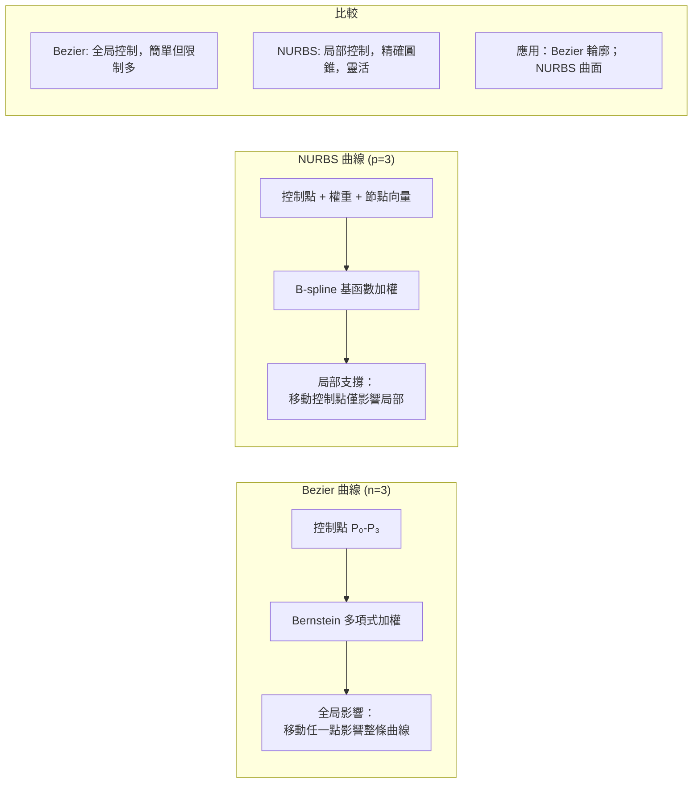
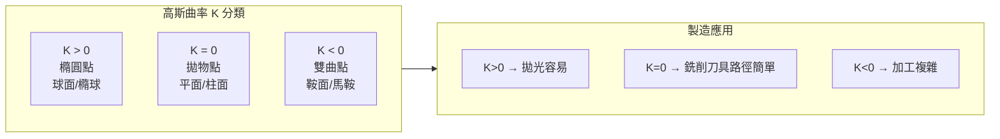
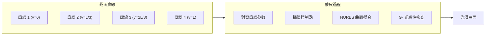
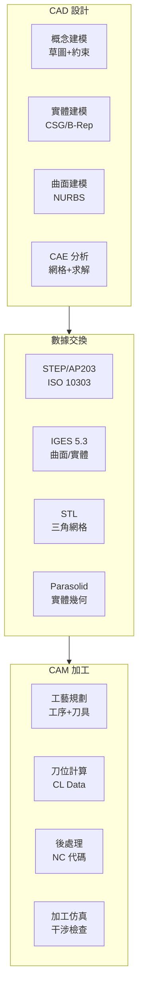

# MAEG3070 Fundamentals of Computer-Aided Design

**CUHK MAE | Major Elective | 3 units**
**Stream**: Design and Manufacturing

---

## Official Description
This course provides students with fundamentals of Computer Aided Design. It covers the following topics: elements of interactive graphics in CAD/CAM, mathematical bases and manipulation of curves and surfaces (parametric cubic curve, Bezier and NURBS curve, ruled surface, sweep surface, Coon's bilinear surface, Hermite surface, Bezier and NURBS surfaces), introduction to geometric and solid modeling (constructive solid geometry, boundary representation), and visualization for engineering simulation. Applications in design and manufacturing are also included.

---

## 問題 1：5 個核心心智模型

### 1. NURBS 曲線與曲面 (Non-Uniform Rational B-Splines)
**方程式 + 數字**：
- NURBS 曲線：C(u) = Σ[N_{i,p}(u)·w_i·P_i] / Σ[N_{i,p}(u)·w_i]
- 基函數遞推：N_{i,0}(u) = 1 if u_i ≤ u < u_{i+1}, else 0；N_{i,p}(u) = (u-u_i)/(u_{i+p}-u_i)·N_{i,p-1}(u) + (u_{i+p+1}-u)/(u_{i+p+1}-u_{i+1})·N_{i+1,p-1}(u)
- 典型 CATIA/SolidWorks 精度：曲線偏差 < 0.001 mm
- 控制點數量：n = 曲線段數 × p（p = degree）

**學者引用**：Piegl & Tiller (1997), *The NURBS Book*, Springer

### 2. Bezier 曲線 (Bezier Curves)
**方程式 + 數字**：
- Bernstein 基函數：B_{i,n}(u) = C(n,i)·u^i·(1-u)^{n-i}
- Bezier 曲線：C(u) = Σ P_i·B_{i,n}(u), i=0..n
- de Casteljau 算法：n 次多項式計算時間 O(n²)
- 幾何特性：首末端點切向量 = (P_1-P_0) 和 (P_n-P_{n-1})
- 缺點：n 增加時振蕩加劇，局部修改困難

**學者引用**：Farin (2002), *Curves and Surfaces for CAGD*, Morgan Kaufmann

### 3. Constructive Solid Geometry (CSG) vs. Boundary Representation (B-Rep)
**方程式 + 數字**：
- CSG：布爾運算（並集 ∪、交集 ∩、差集 −），樹狀結構表示
- B-Rep：拓撲結構 = 頂點(V) + 邊(E) + 面(F)，Euler 公式 V-E+F = 2（凸多面體）
- 精度：B-Rep 幾何精度可達 10⁻⁶ mm
- STEP 文件：ISO 10303，產品數據交換標準
- IGES 文件：.igs/.ige，曲面幾何數據交換

**學者引用**：Hoffmann (1989), *Geometric and Solid Modeling*, Morgan Kaufmann

### 4. 參數曲線微分幾何 (Differential Geometry of Parametric Curves)
**方程式 + 數字**：
- 一階導數：C'(u) = dC/du，切向量 T(u) = C'(u)/|C'(u)|
- 二階導數：C''(u)，曲率 κ(u) = |C'×C''|/|C'|³
- 撓率 τ(u)：描述曲線在三維空間的扭曲程度
- 弧長參數化：s = ∫|C'(u)|du，自然參數化
- 應用：路徑規劃、數控加工刀位計算

**學者引用**：Do Carmo (1976), *Differential Geometry of Curves and Surfaces*

### 5. 掃掠與蒙皮曲面 (Sweep and Skinning Surfaces)
**方程式 + 數字**：
- 直紋面 (Ruled Surface)：S(u,v) = (1-v)·C₁(u) + v·C₂(u)
- 掃掠面 (Sweep Surface)：截面曲線沿路徑掃描
- 蒙皮面 (Skinning Surface)：n 條廓線插值生成曲面
- Coons 曲面：雙三次補片，四邊邊界條件插值
- Hermite 插值：角點位置 + 切向量定義曲線

**學者引用**：Mortenson (2006), *Geometric Modeling*, Industrial Press

---

## 問題 2：3 個根本分歧

### 分歧 A：精確表示 vs. 近似表示 (Exact vs. Approximate Representation)

**A 方（精確 NURBS）**：
- 圓弧、圓錐曲線精確表示（NURBS 權重技巧）
- 數值精確，無累積誤差
- 缺點：計算複雜

**B 方（多項式近似）**：
- Bezier/分段多項式，實現簡單
- 缺點：圓弧只能近似（需多段）

### 分歧 B：CSG vs. B-Rep

**A 方（CSG）**：
- 直觀、布爾運算簡單、內存效率高
- 缺點：難以直接渲染，需轉換

**B 方（B-Rep）**：
- 直接幾何查詢、可視化方便
- 缺點：拓撲一致性維護複雜

### 分歧 C：參數化均勻 vs. 非均勻 (Uniform vs. Non-Uniform Parameterization)

**A 方（均勻參數化）**：
- 節點向量等距：u_i = i/n
- 簡單，但曲線分佈不均勻

**B 方（非均勻參數化）**：
- 弦長參數化 (Chord-length)：根據弧長分配參數
- 曲線分佈均勻，精度更高

---

## 問題 3：10 個深度問題

1. 給定 4 個控制點 P₀(0,0), P₁(1,2), P₂(3,2), P₃(4,0)，用 de Casteljau 算法計算 u=0.5 處的 Bezier 曲線點。

2. 從 NURBS 基函數遞推方程出發，證明 N_{i,p}(u) 滿足局部支撐性（p+1 個節點非零）。

3. 解釋為什麼 NURBS 可以精確表示圓錐曲線（圓、橢圓、拋物線），而普通 Bezier 不能。

4. 推導 B-Rep 拓撲結構的 Euler 公式 V - E + F = 2，並說明在非凸多面體中的推廣。

5. 比較直紋面 (Ruled)、掃掠面 (Sweep) 和蒙皮面 (Sking) 的幾何定義和製造應用場景。

6. 設計一個 CAD 建模流程來創建一個人形機器人頭部模型，包括從概念到 NURBS 曲面的完整步驟。

7. 解釋 Coons 雙三次補片的四邊界條件插值原理，並說明與 Hermite 插值的關係。

8. 在數控銑削加工中，解釋如何從 NURBS 曲面計算刀位軌跡 (CL data)，包括插補和誤差控制。

9. 比較 IGES 和 STEP 文件格式在幾何數據交換中的優缺點，並說明常見轉換失敗原因。

10. 設計一個葉輪 (Impeller) 的 CAD 建模方案，包括葉片曲面的 NURBS 表達和流道構建。

---

# 核心心智模型深化（中英對照）

## 1. NURBS 曲線數學 (NURBS Curve Mathematics)

### 1.1 Bilingual 概念對照
- **Knot Vector / 節點向量**：u = [u₀, u₁, ..., u_{m}]，定義參數域分割
- **Control Points / 控制點**：P_i，定義曲線形狀的頂點
- **Weight / 權重**：w_i，控制曲線"拉向"控制點的程度
- **Basis Function / 基函數**：N_{i,p}(u)，p 階 B-spline 基函數
- **Non-uniform / 非均勻**：節點間距不相等，允許局部控制
- **Rational / 有理**：分子為多項式，分母為加權和 → 精確圓錐曲線

### 1.2 關鍵推導
**三次 NURBS 曲線實例**：
```
節點向量：U = [0, 0, 0, 0.25, 0.5, 0.75, 1, 1, 1]
         ↑ p=3 時首尾各 p+1=4 個節點

控制點：P₀(0,0), P₁(1,1), P₂(2,1), P₃(3,0), P₄(4,0)
權重：w = [1, 1, 1, 1, 1]（均勻 NURBS）
     w = [1, √2/2, 1, √2/2, 1]（單位圓 Quarter）

u = 0.5 時的基函數值：
N_{0,3}(0.5) = 0.125, N_{1,3}(0.5) = 0.375
N_{2,3}(0.5) = 0.375, N_{3,3}(0.5) = 0.125

C(0.5) = Σ N_{i,3}(0.5)·P_i = 收斂於所需曲線
```

### 1.3 工程應用案例
**汽車車身曲面 NURBS 建模**：
- 自由度：每個控制點 3 DOF (x,y,z)，典型模型 ~500–5000 個控制點
- 曲面精度：間距 < 0.1 mm，G² 連續（曲率連續）
- CATIA NURBS 曲面：支持最高 degree=16
- 應用：車身 A 面（可見外表面），B 面（結構曲面）

### 1.4 Deep Test Question
**Q**: 設計一個 NURBS 曲線表示半徑為 R=1 的單位圓。
(a) 給出控制點、權重和節點向量
(b) 證明此表示精確無誤差

**Solution**:
```
單位圓 Quarter (0° to 90°):
P₀ = (1, 0), w₀ = 1
P₁ = (1, 1), w₁ = √2/2 ≈ 0.7071
P₂ = (0, 1), w₂ = 1

驗證：C(u) 計算結果恰好落在單位圓上！
技巧：w₁ = √2/2 使得分子分母比值精確
```

### 1.5 圖解：NURBS 曲線 vs Bezier 曲線


---

## 2. Bezier 曲線與 de Casteljau 算法 (Bezier Curves and de Casteljau)

### 2.1 Bilingual 概念對照
- **Bernstein Polynomial / Bernstein 多項式**：B_{i,n}(u) = C(n,i)·u^i·(1-u)^{n-i}
- **de Casteljau Algorithm / de Casteljau 算法**：遞推細分 Bezier 曲線
- **Control Polygon / 控制多邊形**：相鄰控制點連線形成的折線
- **Degree Elevation / 次數升高**：增加控制點數而不改變曲線形狀
- **Subdivision / 細分**：在 u=0.5 處分割為兩條 Bezier 曲線

### 2.2 關鍵推導
**de Casteljau 算法**：
```
給定控制點 P₀, P₁, P₂, P₃ 和參數 u
遞推：P_i¹ = (1-u)·P_i + u·P_{i+1} (i=0..2)
     P_i² = (1-u)·P_i¹ + u·P_{i+1}¹ (i=0..1)
     P_i³ = (1-u)·P_i² + u·P_{i+1}² (i=0)
     C(u) = P_0³

幾何意義：每一步都是線性插值
```

**控制多邊形逼近**：
```
曲線位於控制多邊形的凸包內（Convex Hull Property）
曲線在首末端點處與控制多邊形的首末邊相切
```

### 2.3 工程應用案例
**字體輪廓設計**：
- 每個字符由 1–4 段 Bezier 曲線組成
- TrueType 字體：二次 Bezier (n=2)
- PostScript 字體：三次 Bezier (n=3)
- 控制點密度：每字符 ~10–50 個控制點

### 2.4 Deep Test Question
**Q**: 用 de Casteljau 算法求 P₀(0,0), P₁(2,3), P₂(4,2), P₃(6,0) 在 u=1/3 處的曲線點。
```
P_0¹ = (1-1/3)(0,0) + (1/3)(2,3) = (2/3, 1)
P_1¹ = (1-1/3)(2,3) + (1/3)(4,2) = (10/3, 11/3)
P_2¹ = (1-1/3)(4,2) + (1/3)(6,0) = (22/3, 4/3)

P_0² = (1-1/3)(2/3, 1) + (1/3)(10/3, 11/3) = (16/9, 20/9)
P_1² = (1-1/3)(10/3, 11/3) + (1/3)(22/3, 4/3) = (52/9, 38/9)

P_0³ = (1-1/3)(16/9, 20/9) + (1/3)(52/9, 38/9) = (104/27, 128/27) ≈ (3.85, 4.74)
```

### 2.5 圖解：de Casteljau 算法幾何意義
```mermaid
graph LR
    subgraph Step1["Step 1: 線性插值 (P⁰)"]
        P00["P₀(0,0)"] & P10["P₁(2,3)"] --> Q01["P⁰₁(2/3,1)"]
        P10 & P20["P₂(4,2)"] --> Q11["P⁰₂(10/3,11/3)"]
        P20 & P30["P₃(6,0)"] --> Q21["P⁰₂(22/3,4/3)"]
    end
    subgraph Step2["Step 2: 二次插值 (P¹)"]
        Q01 & Q11 --> R02["P¹₁(16/9,20/9)"]
        Q11 & Q21 --> R12["P¹₂(52/9,38/9)"]
    end
    subgraph Step3["Step 3: 三次插值 (P²)"]
        R02 & R12 --> S03["P²₀(104/27,128/27)"]
        S03 -.->|"= C(u=1/3)|", CurvePt["曲線點"]
    end
```

---

## 3. 固態建模 CSG 與 B-Rep (Solid Modeling: CSG and B-Rep)

### 3.1 Bilingual 概念對照
- **CSG / 構造實體幾何**：用基本體素和布爾運算構建模型
- **B-Rep / 邊界表示**：用頂點、邊、面的拓撲結構描述物體
- **Primitive / 體素**：Box, Cylinder, Sphere, Cone, Torus
- **Boolean Operation / 布爾運算**：Union (並集), Intersection (交集), Difference (差集)
- **Euler Operators / 歐拉運算子**：B-Rep 的拓撲編輯操作
- **Manifold / 流形**：每條邊恰好被兩個面共享的閉合拓撲

### 3.2 關鍵方程式
**Euler 公式推廣**：
```
凸多面體：V - E + F = 2
帶孔多面體：V - E + F - H = 2(B - 1)
  H = 貫穿孔數
  B = 連通體數

馬環面 (Torus)：V=0, E=0, F=1 (不適用)
→ 使用推廣 Euler-Poincaré 公式：V - E + F - L = 2(S - H) - R
  L = 環形邊數, S = 殼數, H = 空洞數, R = 尖銳特徵數
```

**CSG 樹結構**：
```
節點：基本體素(Box, Cylinder, ...)
分支：布爾運算(Union, Subtract, Intersect)
葉子：具體幾何參數(r, h, ...)
```

### 3.3 工程應用案例
**齒輪 Solid Modeling**：
```
CSG 表示：
Cylinder(齒輪體) ∪ Box(輪轂) - Cylinder(軸孔)
+ 陣列 (循環複製齒形 Box)

B-Rep 表示：
齒輪輪廓曲線 → 拉伸 → 齒輪實體
齒廓漸開線：r(θ) = r_b(cosθ + θ·sinθ)
  r_b = 基圓半徑
```

### 3.4 Deep Test Question
**Q**: 一個帶軸孔的齒輪，齒數 z=20，模數 m=2 mm。用 CSG 描述建模流程並計算基本幾何參數。
```
解：
齒輪分度圓直徑：d = m·z = 2×20 = 40 mm
齒輪外徑：d_a = m(z+2) = 44 mm
齒輪根徑：d_f = m(z-2.5) = 35 mm
軸孔直徑：d_s = 12 mm (HSK 接口)

CSG 樹：
Cylinder(d=44, h=10) - Cylinder(d=35, h=10)
  ∪ Cylinder(d=12, h=20) [差集]
  + Box(齒形×20) [並集]
```

### 3.5 圖解：CSG 與 B-Rep
```mermaid
graph LR
    subgraph CSG["CSG 表示"]
        C1["Box"] & C2["Cylinder"] --> B1["並集 Union"]
        B1 & C3["Box"] --> B2["差集 Subtract"]
        C4["Sphere"] --> B3["交集 Intersect"]
        B2 --> Tree["CSG 樹結構"]
    end
    subgraph BRep["B-Rep 表示"]
        V["頂點 V<br/>幾何: 坐標(x,y,z)"] --> E["邊 E<br/>幾何: 曲線參數+拓撲: 兩頂點"]
        E --> F["面 F<br/>幾何: 曲面方程+拓撲: 封閉邊環"]
        F --> Topo["拓撲結構<br/>Euler 公式驗證"]
    end
    CSG -->|"等價|", BRep
```

---

## 4. 參數曲面微分幾何 (Differential Geometry of Parametric Surfaces)

### 4.1 Bilingual 概念對照
- **First Fundamental Form / 第一基本形式**：E = S_u·S_u, F = S_u·S_v, G = S_v·S_v
- **Second Fundamental Form / 第二基本形式**：L = S_{uu}·n, M = S_{uv}·n, N = S_{vv}·n
- **Principal Curvature / 主曲率**：κ₁, κ₂，曲面最大/最小曲率
- **Gaussian Curvature / 高斯曲率**：K = κ₁·κ₂
- **Mean Curvature / 平均曲率**：H = (κ₁+κ₂)/2

### 4.2 關鍵方程式
**曲面第一基本形式**：
```
S(u,v) = [x(u,v), y(u,v), z(u,v)]
E = S_u · S_u = |S_u|²
F = S_u · S_v
G = S_v · S_v

面積元素：dA = √(EG-F²)·du·dv
```

**主曲率計算**：
```
(LN - M²)·κ² - (EL - 2FM + GN)·κ + (EG - F²) = 0

解得：κ₁, κ₂ = 最大/最小根
```

### 4.3 工程應用案例
**汽車 A 曲面曲率連續性要求**：
```
G⁰ 連續：位置連續（C⁰），幾何不連續可見
G¹ 連續：切平面連續，視覺連續
G² 連續：曲率連續，無可見褶皺

G² 條件：相鄰曲面在跨界處滿足：
  S₁_u × S₁_v = λ·S₂_u × S₂_v (等價法向量方向)
  平均曲率函數連續
```

### 4.4 Deep Test Question
**Q**: 驗證球面 S(θ,φ) = (Rcosθcosφ, Rsinθcosφ, Rsinφ) 的高斯曲率處處為 1/R²。

### 4.5 圖解：曲面的曲率分類


---

## 5. 掃掠與蒙皮曲面 (Sweep and Skinning Surfaces)

### 5.1 Bilingual 概念對照
- **Ruled Surface / 直紋面**：兩條曲線對應點連線形成的面
- **Sweep Surface / 掃掠面**：截面曲線沿空間路徑平移/旋轉
- **Skinning / 蒙皮**：用多條廓線插值生成曲面
- **Coons Patch / Coons 曲面**：四邊界條件確定的雙三次曲面補片
- **Hermite 插值**：用端點和切向量確定三次曲線

### 5.2 關鍵方程式
**Hermite 三次曲線**：
```
C(u) = F₀(u)·P₀ + F₁(u)·P₁ + G₀(u)·T₀ + G₁(u)·T₁

基函數：
F₀(u) = 2u³ - 3u² + 1
F₁(u) = -2u³ + 3u²
G₀(u) = u³ - 2u² + u
G₁(u) = u³ - u²

驗證：
C(0) = P₀, C(1) = P₁
C'(0) = T₀, C'(1) = T₁
```

**Coons 雙三次曲面**：
```
S(u,v) = [1-u u] · [P(0,v)  P_u(0,v)]
               [P(1,v)  P_u(1,v)] · [1-v; v]
        + [F₀(u) F₁(u) G₀(u) G₁(u)] · M · [F₀(v) F₁(v) G₀(v) G₁(v)]ᵀ
```

### 5.3 工程應用案例
**葉片 (Blade) 曲面建模**：
```
截面廓線：沿葉片高度方向（翼型截面×15–20 個）
蒙皮方向：葉片軸向（z 方向）

葉型輪廓：NACA 4 位數翼型
  y_t = 5t [0.2969√x - 0.1260x - 0.3516x² + 0.2843x³ - 0.1015x⁴]
  上表面：y_c + y_t·cosθ
  下表面：y_c - y_t·cosθ
```

### 5.4 Deep Test Question
**Q**: 設計一個花瓶的 NURBS 曲面模型，用旋轉蒙皮方法生成。給出截面廓線和控制點配置。

### 5.5 圖解：蒙皮曲面生成


---

## 深度自測問題詳解

**Q1 Solution**: de Casteljau u=1/3
```
P₀(0,0), P₁(1,2), P₂(3,2), P₃(4,0)
u=1/3:

Level 1:
Q₀ = (2/3)(0,0) + (1/3)(1,2) = (1/3, 2/3)
Q₁ = (2/3)(1,2) + (1/3)(3,2) = (5/3, 8/3)
Q₂ = (2/3)(3,2) + (1/3)(4,0) = (10/3, 4/3)

Level 2:
R₀ = (2/3)(1/3,2/3) + (1/3)(5/3,8/3) = (7/9, 12/9)
R₁ = (2/3)(5/3,8/3) + (1/3)(10/3,4/3) = (20/9, 20/9)

Level 3:
C(1/3) = (2/3)(7/9,12/9) + (1/3)(20/9,20/9) = (34/27, 44/27) ≈ (1.26, 1.63)
```

**Q3 Solution**: NURBS 精確圓錐曲線
```
圓錐曲線的一般 NURBS 表示：
使用控制點 P₀, P₁, P₂ 和權重 w₀=1, w₁=sin(α), w₂=1
其中 α 決定圓錐類型：
  α > 90° → 橢圓
  α = 90° → 拋物線  
  α < 90° → 雙曲線

單位圓 quarter 例子：
P₀(1,0), P₁(1,1), P₂(0,1), w₁=√2/2
→ 精確圓，無近似誤差！
```

---

## 📊 Diagram 1: CAD/CAM 系統架構


---

## 📊 Diagram 2: NURBS 基函數遞推樹
```mermaid
flowchart TD
    U["節點向量 U = [0,0,0,0.5,1,1,1]"]
    U --> N00["N₀,₀(u)"]
    N00 -->|"遞推|", N10["N₀,₁(u)"] & N11["N₁,₁(u)"]
    N10 -->|"遞推|", N20["N₀,₂(u)"] & N21["N₁,₂(u)"] & N22["N₂,₂(u)"]
    N20 -->|"u=0.5時|", V20["= 0.5"]
    N21 -->|"u=0.5時|", V21["= 0.5"]
    N22 -->|"u=0.5時|", V22["= 0"]
    V20 & V21 & V22 --> Sum["Σ N_{i,2}(0.5) = 1 ✓"]
```

---

## 📊 Diagram 3: B-Rep 拓撲-幾何關係
```mermaid
graph TD
    subgraph Topology["拓撲結構"]
        V["頂點 Vertex<br/>V=8 (立方體)"]
        E["邊 Edge<br/>E=12 (立方體)"]
        F["面 Face<br/>F=6 (立方體)"]
        L["環 Loop<br/>每面1個封閉邊環"]
    end
    subgraph Geometry["幾何數據"]
        Vg["幾何坐標<br/>(x,y,z) 列表"]
        Eg["曲線參數<br/>直線/圓弧/Bezier"]
        Fg["曲面方程<br/>平面/NURBS"]
    end
    V -->|"共享|", E
    E -->|"邊界|", F
    V --> Vg
    E --> Eg
    F --> Fg
```

---

## 📊 Diagram 4: 蒙皮曲面生成流程
```mermaid
flowchart LR
    S1["定義廓線組<br/>N 個截面"] --> S2["對齊參數化<br/>弦長/均勻"]
    S2 --> S3["廓線對齊<br/>首尾對齊"]
    S3 --> S4["建立主跨界曲線"]
    S4 --> S5["蒙皮插值<br/>NURBS 擬合"]
    S5 --> S6["G¹/G² 光順性調整"]
    S6 -->|"OK|", S7["完成曲面"]
    S6 -.->|"失敗|", S3
```

---

## 📊 Diagram 5: CATIA V5 曲面建模流程
```mermaid
flowchart LR
    G1["創建主曲線<br/>輪廓+導軌"] --> G2["建立潤滑曲面<br/>Fill/Stitch"]
    G2 --> G3["分析曲率<br/>斑馬紋/Min/Max"]
    G3 -->|"G² 不滿足|", T1["調整控制點"]
    G3 -->|"G² OK|", T2["拼接曲面<br/>Match/GD&T"]
    T1 -.->|"重新計算|", G3
    T2 --> G4["厚壁/實體化"]
    G4 --> G5["導出 STEP/IGES"]
```

---

## 總結

MAEG3070 是 CAD/CAM/CAE 系統的理論基礎課，核心是從幾何學視角理解數字化產品設計。5 個心智模型構成完整的幾何計算框架：

1. **NURBS** → 工業標準曲線/曲面表示（汽車、航空、造船）
2. **Bezier** → 直觀理解曲線幾何，de Casteljau 可視化
3. **CSG vs B-Rep** → 固態建模兩大範式
4. **微分幾何** → 曲率連續性（G²）是高質量曲面標誌
5. **掃掠/蒙皮** → 從截面廓線到完整曲面的工程方法

NURBS 是當今所有主流 CAD 系統（CATIA, NX, SolidWorks, Fusion 360）的核心數學引擎，掌握其原理是成為優秀 CAD/CAE 工程師的必備基礎。
