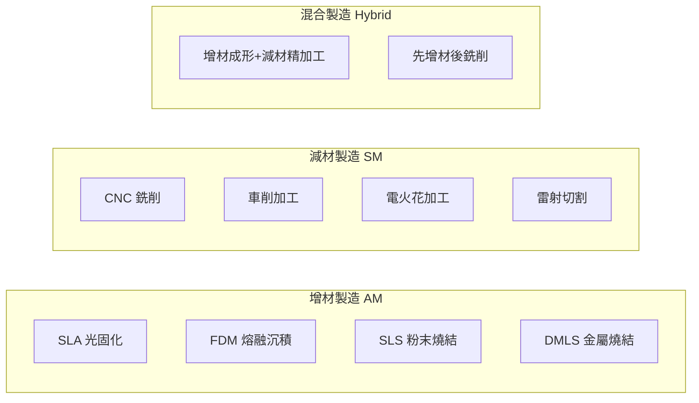
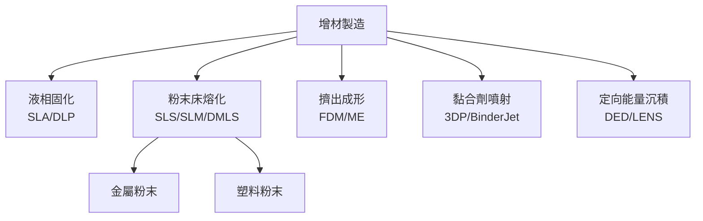
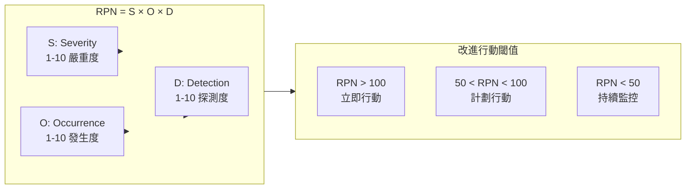

# MAEG3920 Engineering Design and Applications

**CUHK MAE | Major Elective | 3 units**
**Stream**: Design and Manufacturing

---

## Official Description
The course is intended to enable students to learn the fundamentals of engineering design and how to carry out the design process. One (or several) engineering project(s) for students to practice is (are) included with the following topics: engineering design process, innovation and design basics, CAD and CAE tools and applications, prototyping (mechanical workshop), prototyping (electronics workshop), quality and inspection.

---

## 問題 1：5 個核心心智模型

### 1. 工程設計流程 (Engineering Design Process)
**方程式 + 數字**：
- 需求收集 → QFD (質量功能展開) → 工程指標
- 概念篩選：Pugh 矩陣評分法，多準則決策 (MCDM)
- 設計驗證：FMEA 風險優先數 RPN = S×O×D
- 設計週期：典型概念→詳細→原型→測試 循環 3–5 次

**學者引用**：Pugh (1991), *Total Design Engineering*

### 2. 快速原型製造 (Rapid Prototyping)
**方程式 + 數字**：
- SLA 光固化：精度 ±0.05 mm，分層厚度 25–100 μm
- FDM 熔融沉積：層高 0.1–0.3 mm，材料 PLA/ABS/尼龍
- SLS 粉末燒結：精度 ±0.1–0.3 mm，無支撐結構
- 金屬 DMLS：Ti-6Al-4V，致密度 >99.5%
- 原型成本：SLA ~$0.05–0.20/g；金屬 ~$1–5/g

**學者引用**：Gibson et al. (2021), *Additive Manufacturing Technologies*

### 3. 機械加工基礎 (Machining Fundamentals)
**方程式 + 數字**：
- 切削速度：V_c = π·D·n/1000 (m/min)，D=刀具直徑，n=轉速 rpm
- 材料去除率：MRR = a_p × a_e × V_c (mm³/min)
- 刀具壽命：Taylor 方程 V·T^n = C (典型 n=0.3–0.5)
- 銑削力：F_c = K_c × a_p × a_e (K_c = 比切削力，~1000–3000 N/mm²)
- 表面粗糙度：Ra ≈ 0.8–3.2 μm (普通銑削)

**學者引用**：Kalpakjian & Schmid (2014), *Manufacturing Engineering and Technology*

### 4. 電子原型製作 (Electronics Prototyping)
**方程式 + 數字**：
- PCB 最小線寬：0.1–0.3 mm（消費級）；0.05 mm（精密）
- 過孔直徑：0.3–0.8 mm
- 焊接溫度：無鉛焊料 SAC305，熔點 217°C，烙鐵溫度 350–380°C
- STM32 微控制器：72 MHz, 64 KB Flash, 20 KB RAM
- Arduino 開發板：16 MHz ATmega328P，14 個數字 I/O

**學者引用**：Horowitz & Hill (2015), *The Art of Electronics*

### 5. 質量檢驗 (Quality and Inspection)
**方程式 + 數字**：
- 三坐標測量機 (CMM)：精度 ±0.002–0.01 mm
- 粗糙度儀：Ra, Rz, Rq 參數測量，Ra=0.8–3.2 μm
- 光學投影儀：放大倍數 10×–100×
- 測量不確定度：U = k·u_c (k=2 for 95% CI)

**學者引用**：Montgomery (2017), *Introduction to Statistical Quality Control*

---

## 問題 2：3 個根本分歧

### 分歧 A：SLA vs. FDM vs. SLS (快速原型技術選擇)

**SLA**：精度最高，光固化樹酯，適合外觀原型
**FDM**：成本低，材料強度好，適合功能原型
**SLS**：無需支撐，尼龍材料，適合小批量

### 分歧 B：手工焊接 vs.回流焊 vs.貼片 (PCB 組裝)

**手工焊接**：靈活，小批量，適合插件元件
**回流焊**：大批量，表面貼裝，無橋接
**貼片 (SMT)**：精度高，自動化，但需專用設備

### 分歧 C：CMM 接觸測量 vs. 光學掃描 (測量方法)

**接觸式**：精度高，通用，但速度慢，可能划傷表面
**光學掃描**：速度快，非接觸，但精度受限

---

## 問題 3：10 個深度問題

1. 設計一個從概念到原型的完整流程，包括 QFD、Pugh 矩陣、FMEA 和成本估算。

2. 計算 CNC 銑削 6061 鋁合金的切削參數，包括切削速度、进給量和切削深度的選擇。

3. 比較 SLA、FDM、SLS、SLM 四種增材製造工藝的原理、材料和應用場景。

4. 設計一個 PCB 原理圖，包括 MCU 最小系統、供電模塊、傳感器接口和通信接口。

5. 用 FMEA 方法分析一個機電產品的設計風險，計算 RPN 並提出改進措施。

6. 說明如何在機械加工中選擇合適的刀具材料和幾何參數。

7. 比較各種質量檢測方法（CMM、粗糙度儀、光學投影儀）適用場景。

8. 設計一個快速原型迭代優化流程，說明如何在每次迭代中收集和應用反饋數據。

9. 說明 DFMA（製造和裝配設計）在實際產品中的應用原則。

10. 選擇一個具體工程案例，說明完整的設計-原型-測試循環過程。

---

# 核心心智模型深化（中英對照）

## 1. 工程設計流程與創新 (Engineering Design Process)

### 1.1 Bilingual 概念對照
- **QFD / 質量功能展開**：顧客需求轉化為工程指標的結構化方法
- **Pugh Matrix / Pugh 矩陣**：多概念方案評估和選擇工具
- **FMEA / 失效模式與效應分析**：系統性風險識別
- **RPN / 風險優先數**：RPN = Severity × Occurrence × Detection
- **Design for X / X 設計**：DFM, DFA, DFX 優化準則
- **Concept Selection / 概念選擇**：從創意到可行方案

### 1.2 關鍵推導
**Pugh 矩陣評分**：
```
方案      | 準則1(權重3) | 準則2(權重2) | 準則3(權重1) | 總分
方案A    |     +1       |     -1       |      0       |  3×1+2×(-1)+1×0=1
方案B    |      0       |     +1       |     +1       |  3×0+2×1+1×1=3
方案C    |     -1       |     +1       |     +1       |  3×(-1)+2×1+1×1=0

結論：方案B 總分最高 → 選擇方案B
```

### 1.3 工程應用案例
**比賽機器人設計概念選擇**：
```
功能需求：
FR1: 底盤移動速度 >1.5 m/s
FR2: 負載能力 >5 kg
FR3: 成本 < $500
FR4: 組裝時間 <8 小時

方案比較：
A: 4輪麥克納姆 → 速度+, 成本+, 組裝-
B: 2輪差速+萬向輪 → 速度-, 成本-, 組裝+
C: 履帶式 → 速度-, 負載+, 成本+, 組裝-
```

### 1.4 Deep Test Question
**Q**: 為機器人底盤選擇方案，用 Pugh 矩陣評估麥克納姆輪 vs. 履帶式底盤。

### 1.5 圖解：設計流程
```mermaid
flowchart LR
    R1["需求定義<br/>QFD"] --> R2["概念生成<br/>TRIZ/Brainstorm"]
    R2 --> R3["概念篩選<br/>Pugh 矩陣"]
    R3 --> R4["詳細設計<br/>CAD+CAE"]
    R4 --> R5["原型製作"]
    R5 --> R6{"驗證合格?"}
    R6 -->|"否|", R4
    R6 -->|"是|", R7["設計發布"]
```

---

## 2. 快速原型製造 (Rapid Prototyping)

### 2.1 Bilingual 概念對照
- **SLA / 光固化成形**：StereoLithography Apparatus，紫外線固化樹酯
- **FDM / 熔融沉積成形**：Fused Deposition Modeling，熱塑性材料擠出
- **SLS / 粉末床燒結**：Selective Laser Sintering，塑料/金屬粉末燒結
- **DMLS / 直接金屬雷射燒結**：Direct Metal Laser Sintering，金屬粉末
- **分層厚度 / Layer Thickness**：25–300 μm，影響精度和速度
- **支撐結構 / Support Structure**：懸空部分需要支撐

### 2.2 關鍵方程式
**加工時間估算**：
```
T_build = T_layer × N_layers + T_setup
N_layers = H / t_layer

SLA:
t_layer ≈ 2–10 秒（取決於樹酯和厚度）
T_build ≈ 1–10 小時

FDM:
t_layer ≈ 0.1–0.3 mm 層高
T_build ≈ 1–8 小時（取決於模型複雜度）
```

### 2.3 工程應用案例
**比賽機器人原型迭代**：
```
第1次迭代：FDM PLA，機械測試 → 發現強度不足
第2次迭代：FDM 尼龍，增加壁厚 → 滿足強度
第3次迭代：SLA 光固化，外觀驗證 → 確認人機界面
最終：鋁合金 CNC 加工關鍵零件
```

### 2.4 Deep Test Question
**Q**: 計算一個 100 mm × 60 mm × 40 mm 的外殼，用 FDM 打印的時間和成本。

**Solution**:
```
層高 0.2 mm → 200 層
填充率 20%
每層時間 ≈ 30 秒
總時間 ≈ 200 × 30 = 6000 秒 ≈ 1.7 小時
材料重量 ≈ 80 g (PLA 密度 1.24 g/cm³)
成本 ≈ 80 × $0.05 = $4
```

### 2.5 圖解：增材 vs. 減材製造


---

## 3. 機械加工基礎 (Machining Fundamentals)

### 3.1 Bilingual 概念對照
- **Cutting Speed / 切削速度**：V_c (m/min)
- **Feed Rate / 进給量**：f (mm/rev) 或 f_z (mm/齒)
- **Depth of Cut / 切削深度**：a_p (mm)
- **MRR / 材料去除率**：Material Removal Rate (mm³/min)
- **Taylor Tool Life / Taylor 刀具壽命方程**：V·T^n = C

### 3.2 關鍵方程式
**銑削計算**：
```
切削速度：V_c = π × D × n / 1000 [m/min]
進給速度：V_f = f_z × z × n [mm/min]
材料去除率：Q = a_p × a_e × V_f / 1000 [cm³/min]
刀具壽命：V × T^n = C (n≈0.3–0.5)
```

**6061-T6 鋁合金加工參數**：
```
切削速度：V_c = 150–300 m/min
进給量：f_z = 0.05–0.15 mm/齒
切削深度：a_p = 0.5–3 mm
側向进給：a_e = 5–20 mm
比切削力：K_c ≈ 900 N/mm²
```

### 3.3 工程應用案例
**CNC 銑削流程**：
```
1. 工件找正 (Workpiece Setting)：±0.01 mm
2. 刀具補償 (Tool Offset)：長度補償+半徑補償
3. 加工策略：
   - 粗加工：a_p=2mm, f_z=0.1mm, 快速材料去除
   - 半精加工：a_p=0.5mm, f_z=0.05mm, 預留餘量
   - 精加工：a_p=0.1mm, f_z=0.02mm, 達到 Ra<1.6μm
```

### 3.4 Deep Test Question
**Q**: 用 φ10 mm 四刃硬質合金銑刀加工 6061 鋁，選擇合理的切削參數並計算 MRR。

**Solution**:
```
V_c = 200 m/min → n = 1000×V_c/(π×D) = 1000×200/(π×10) ≈ 6369 rpm
f_z = 0.1 mm/齒, z = 4
V_f = 0.1×4×6369 ≈ 2548 mm/min
a_p = 2 mm, a_e = 8 mm
Q = 2×8×2548/1000 ≈ 40.8 cm³/min
```

### 3.5 圖解：CNC 加工流程
```mermaid
flowchart LR
    F1["零件圖紙"] --> F2["工藝規程<br/>工序+刀具+夾具"]
    F2 --> F3["NC 編程<br/>G-code/MDI"]
    F3 --> F4["空運行檢驗"]
    F4 --> F5{"程序正確?"}
    F5 -->|"否|", F3
    F5 -->|"是|", F6["首件加工"]
    F6 --> F7{"尺寸合格?"}
    F7 -->|"否|", F8["補償調整"]
    F8 --> F6
    F7 -->|"是|", F9["批量加工"]
```

---

## 4. 電子原型製作 (Electronics Prototyping)

### 4.1 Bilingual 概念對照
- **PCB / 印製電路板**：Printed Circuit Board
- **SMT / 表面貼裝技術**：Surface Mount Technology
- **THT / 通孔插裝技術**：Through-Hole Technology
- **MCU / 微控制器**：Microcontroller Unit
- **Breakout Board / 轉接板**：方便晶片測試的小型 PCB
- **BOM / 物料清單**：Bill of Materials

### 4.2 關鍵方程式
**PCB 阻抗控制**：
```
微帶線特徵阻抗：Z₀ = (87/√(ε_r+1.41)) × ln(5.98h/(0.8w+t))
ε_r = 4.2–4.5 (FR-4)
典型：w=0.3mm, h=1.6mm → Z₀ ≈ 50 Ω
```

**STM32 最小系統**：
```
VCC = 3.3V (LDO 降壓)
晶振 = 8 MHz (HSE) + 32.768 kHz (LSE RTC)
調試介面 = SWD (2-wire: SWDIO, SWCLK)
```

### 4.3 工程應用案例
**比賽機器人控制板**：
```
核心：STM32F405 (168 MHz, 1 MB Flash)
供電：12V輸入 → 5V (降壓) → 3.3V (LDO)
通信：CAN總線 (馬達驅動) + UART (傳感器)
功率：MOSFET H-bridge 30A (底盤馬達)
尺寸：100×80 mm，4層 PCB
```

### 4.4 Deep Test Question
**Q**: 設計一個供電電路：12V 輸入，5V/3A 和 3.3V/0.5A 輸出。

### 4.5 圖解：PCB 設計流程
```mermaid
flowchart LR
    S1["原理圖設計<br/>元器件庫"] --> S2["元器件選型<br/>BOM 創建"]
    S2 --> S3["PCB 佈局<br/>模塊分區"]
    S3 --> S4["布線<br/>阻抗控制"]
    S4 --> S5["DRC 檢查<br/>設計規則"]
    S5 --> S6{"錯誤?"}
    S6 -->|"有|", S3
    S6 -->|"無|", S7[" Gerber 生成"]
    S7 --> S8["PCB 製造"]
    S8 --> S9["焊接+測試"]
```

---

## 5. 質量檢驗 (Quality and Inspection)

### 5.1 Bilingual 概念對照
- **CMM / 三坐標測量機**：Coordinate Measuring Machine
- **Ra / 粗糙度平均值**：Roughness Average，0.8–3.2 μm 常用
- **GD&T / 幾何尺寸和公差**：Geometric Dimensioning and Tolerancing
- **MSA / 測量系統分析**：Measurement Systems Analysis
- **Gage R&R / 量具重複性和再現性**：測量系統能力

### 5.2 關鍵方程式
**CMM 測量不確定度**：
```
U_meas = √(u_stat² + u_repeat² + u_cal²)
典型：U ≈ 0.005 mm (k=2, 95% CI)
```

**表面粗糙度估算**：
```
Ra ≈ 0.8–3.2 μm (普通加工)
Ra ≈ 0.1–0.4 μm (精密加工)
Ra ≈ 0.025–0.05 μm (超精密研磨)
```

### 5.3 工程應用案例
**齒輪齒面粗糙度測量**：
```
測量儀器：Taylor Hobson 粗糙度儀
測量參數：Ra, Rz, Rsk (偏度), Rku (峰度)
取樣長度：0.8 mm (Ra 標準)
評估長度：4×0.8 = 3.2 mm
齒面粗糙度要求：Ra < 0.8 μm (6級精度)
```

### 5.4 Deep Test Question
**Q**: 為什麼表面粗糙度對機器人關節軸承座的配合精度有重要影響？

### 5.5 圖解：FMEA 分析流程
```mermaid
flowchart TD
    F1["識別潛在失效模式"] --> F2["評估嚴重度 S (1-10)"]
    F2 --> F3["識別潛在原因"]
    F3 --> F4["評估發生度 O (1-10)"]
    F4 --> F5["識別現行控制"]
    F5 --> F6["評估探測度 D (1-10)"]
    F6 --> F7["RPN = S×O×D"]
    F7 --> F8{"RPN > 100?"}
    F8 -->|"是|", F9["立即改進措施"]
    F8 -->|"否|", F10["持續監控"]
    F9 -.-> F2
```

---

## 深度自測問題詳解

**Q1 Solution**: 完整設計流程
```
1. QFD：顧客需求 → 工程指標
2. 概念生成：TRIZ + 頭腦風暴，5–10 個概念
3. Pugh 篩選：淘汰 2–3 個最差方案
4. 詳細設計：SolidWorks CAD + ANSYS 結構分析
5. FMEA：識別前 5 個最高 RPN 風險
6. 原型：FDM 快速驗證
7. 測試：功能+耐久性測試
8. 迭代改進：根據測試結果優化設計
```

**Q3 Solution**: 增材製造工藝比較
```
SLA: 樹酯+UV, 精度±0.05mm, 速度快, 適合外觀
FDM: PLA/ABS, 成本最低, 強度適中, 功能原型
SLS: 尼龍粉末, 無需支撐, 耐磨, 適合卡扣配合
SLM: 金屬粉末, 高強度, 最終用途零件, 成本最高
```

---

## 📊 Diagram 1: 工程設計流程 V 模型
```mermaid
flowchart TD
    R1["需求定義"] --> R2["系統設計"]
    R2 --> R3["詳細設計"]
    R3 --> R4["原型製作"]
    R4 --> R5["系統測試"]
    R5 --> R6["驗收測試"]
    R6 -.->|"失敗|", R3
    R5 -.->|"失敗|", R3
    R1 -.->|"向上驗證|", R6
```

---

## 📊 Diagram 2: 增材製造工藝分類


---

## 📊 Diagram 3: PCB 製造流程


---

## 📊 Diagram 4: FMEA 風險評估


---

## 📊 Diagram 5: 機械加工參數關係
```mermaid
graph LR
    subgraph Parameters["切削三要素"]
        Vc["V_c 切削速度<br/>m/min"]
        f["f 进給量<br/>mm/rev"]
        ap["a_p 切削深度<br/>mm"]
    end
    subgraph Output["輸出"]
        MRR["MRR 材料去除率"]
        Ra["Ra 表面粗糙度"]
        Tool["刀具壽命 T"]
    end
    Vc -->|"V×T^n=C|", Tool
    f -->|"f影響Ra|", Ra
    ap & Vc -->|"Q=a_p×a_e×V_f|", MRR
```

---

## 總結

MAEG3920 通過實際項目讓學生體驗完整的工程設計流程，從需求捕捉到原型的整個過程。5 個核心心智模型：

1. **設計流程**：V 模型強調前端定義和後端驗證的對應
2. **快速原型**：根據需求選擇合適的原型技術（速度/精度/成本）
3. **機械加工**：理解切削原理和參數選擇的基本計算
4. **電子原型**：PCB 設計和 MCU 最小系統的實用技能
5. **質量檢驗**：FMEA、CMM、粗糙度測量構成質量保障體系

這門課的核心價值在於建立"設計-製造-驗證"的循環思維，這是所有工程師必備的系統工程能力。
