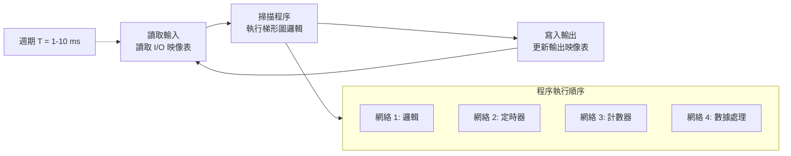
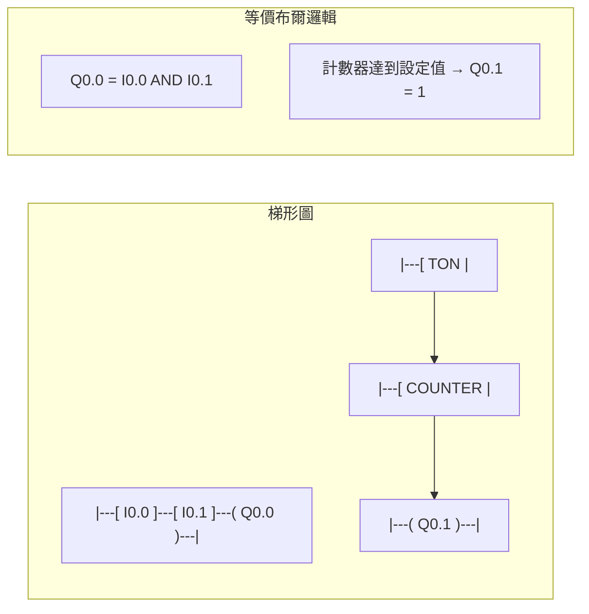

# MAEG4010 Computer-Integrated Manufacturing

**CUHK MAE | Major Elective | 3 units**
**Stream**: Design and Manufacturing

---

## Official Description
This course provides students with a solid background in the fundamentals of computer-integrated manufacturing technology. It covers the following topics: concurrent engineering, computer-integrated manufacturing models and concepts, rapid prototyping, computer-aided manufacturing, control of manufacturing systems (numerical control and computer numerical control), programmable logic controller, computer aided process planning and manufacturing scheduling, and quality assurance. The hands-on experiments and projects are included.

---

## 問題 1：5 個核心心智模型

### 1. 電腦數值控制 (CNC) 原理
**方程式 + 數字**：
- 脈衝當量：1 脈衝 = 0.001 mm/脈衝（常見）
- 插補算法：直線插補、圓弧插補、螺旋插補
- 插補週期：1–2 ms，最大進給速度 = 脈衝頻率 × 脈衝當量
- 常用 G 代碼：G00（快速定位）、G01（直線進給）、G02/G03（順/逆圓弧）
- CNC 加工精度：±0.01–0.05 mm（普通機床）；±0.001 mm（精密機床）

**學者引用**：Koren (1983), *Computer Controls of Manufacturing Systems*

### 2. 可編程邏輯控制器 (PLC)
**方程式 + 數字**：
- 掃描周期：典型 1–10 ms（取決於程序複雜度）
- I/O 響應時間：<1 ms（數字量）；<5 ms（模擬量）
- 梯形圖 (Ladder Diagram)：左母線→輸入→線圈→右母線
- 功能塊 (FBD)：FUNCTION BLOCK 標準化封裝
- 常用品牌：Siemens S7-1200, Allen-Bradley CompactLogix

**學者引用**：Petruzella (2017), *Programmable Logic Controllers*

### 3. 計算機輔助工藝規程 (CAPP)
**方程式 + 數字**：
- 變異式 CAPP：基於零件族編碼 (OPITZ, GT)
- 創成式 CAPP：基於邏輯推理自動生成工藝
- 加工順序優化：TSP 問題啟發式算法
- 刀具路徑優化：遺傳算法、蟻群算法
- 標準工時：MTM (Methods-Time Measurement) 數據庫

**學者引用**：Ham et al. (2009), *Computer-Aided Manufacturing*

### 4. 製造執行系統 (MES) 與排產
**方程式 + 數字**：
- 作業排產：Johnson 算法 (n/2/F/C_max)
- 生產節拍 (Takt Time) = 可用時間 / 需求數量
- OEE (設備綜合效率) = 可用率 × 表現率 × 質量率
- 典型 OEE：世界級 >85%；工廠平均 ~60%
- 看板 (Kanban)：最小批量 = 平均需求 × 安全係數

**學者引用**：Hopp & Spearman (2011), *Factory Physics*

### 5. 品質保証與統計過程控制 (SPC)
**方程式 + 數字**：
- 控制圖：X̄-R 控制圖, UCL/LCL = X̄ ± A₂·R̄ (A₂ = 0.577 for n=5)
- Cpk 計算：Cpk = min[(USL-μ)/(3σ), (μ-LSL)/(3σ)]
- 抽樣檢驗：OC 曲線，AOQ (平均出廠質量)
- 6σ 目標：DPMO < 3.4

**學者引用**：Montgomery (2017), *Introduction to Statistical Quality Control*

---


### Key equations (S.I. units where applicable)

$$F = ma \quad (\text{Newton 2nd law, Newton 1687})$$

$$E = h\nu \quad (\text{Planck 1901})$$

$$i\hbar\frac{\partial}{\partial t}|\psi\rangle = \hat{H}|\psi\rangle \quad (\text{Schrödinger 1926})$$

$$h = 6.626 \times 10^{-34}\,\text{J·s}$$

$$\hbar = h/2\pi = 1.054 \times 10^{-34}\,\text{J·s}$$

$$c = 2.998 \times 10^8\,\text{m/s}$$

*Per Newton 1687, Planck 1901, Schrödinger 1926.*

## 問題 2：3 個根本分歧

### 分歧 A：集中式 CNC vs. 分散式 CNC

**集中式**：一台主機控制多台機床，適合大批量
**分散式 (DNC)**：每台機床獨立 CNC，靈活，適合多品種小批量

### 分歧 B：PLC vs. 工業 PC (IPC) 控制

**PLC**：可靠性高，實時性強，編程簡單，但計算能力有限
**IPC**：計算能力強，可運行複雜算法，但可靠性稍低

### 分歧 C：推式 vs. 拉式生產

**推式 (MRP)**：根據預測生產，庫存高但設備利用率高
**拉式 (JIT/Kanban)**：根據實際需求拉動，庫存低但可能停工

---

## 問題 3：10 個深度問題

1. 推導 CNC 直線插補的 DDA (Digital Differential Analyzer) 算法，並用數字實例說明。

2. 設計一個 PLC 控制程序，實現一個三工位旋轉工作台的全自動循環控制（輸入/加工/輸出）。

3. 用 Johnson 算法求解兩台機床的作業排產問題：工件 A(加工時間 3,5), B(7,2), C(5,4), D(1,8)。

4. 比較變異式 CAPP 和創成式 CAPP 的原理，並說明它們各自的適用場景。

5. 設計一個 CIM 系統架構，說明從 CAD 到 CAM 到 CNC 的數據流。

6. 計算一個 CNC 銑削中心的 OEE，給定可用率 90%，表現率 85%，質量率 98%。

7. 說明 SPC 控制圖中"失控點"的識別標準和處理流程。

8. 設計一個柔性製造系統 (FMS) 的物料輸送方案，比較傳送帶 vs. AGV vs. 機器人。

9. 解釋"並行工程"在 CIM 環境中的意義，並提出實施策略。

10. 設計一個基於 ERP-MES-PCS 三層架構的智能工廠信息系統。

---

# 核心心智模型深化（中英對照）

## 1. CNC 數值控制原理 (CNC Numerical Control)

### 1.1 Bilingual 概念對照
- **CNC / 電腦數值控制**：Computer Numerical Control
- **G-code / G 代碼**：幾何加工指令，如 G01 (直線插補)
- **M-code / M 代碼**：機床輔助功能，如 M03 (主軸正轉)
- **DDA / 數字微分分析器**：Digital Differential Analyzer，插補算法
- **Pulse Equivalence / 脈衝當量**：每脈衝對應的位移量
- **Interpolation / 插補**：離散脈衝序列生成平滑軌跡

### 1.2 關鍵方程式
**DDA 直線插補**：
```
目標：從 (x₀,y₀) 到 (x₁,y₁)，在 N 步內完成
每步增量：Δx = (x₁-x₀)/N, Δy = (y₁-y₀)/N
第 i 步坐標：x_i = x₀ + i·Δx, y_i = y₀ + i·Δy
```

**CNC 程序實例**：
```gcode
O1001 (程序號)
G90 G54 (絕對坐標, 選擇坐標系)
T01 M06 (選擇刀具1, 換刀)
S3000 M03 (主軸轉速 3000 rpm, 正轉)
G00 X0 Y0 (快速定位)
G01 Z-5 F500 (直線進給至深度, 进給率 500 mm/min)
X50 Y30 (直線切削)
G02 X60 Y30 R5 (順時針圓弧)
G00 Z50 (快速退刀)
M05 M30 (主軸停止, 程序結束)
```

### 1.3 工程應用案例
**3軸立式加工中心**：
```
典型配置：
- 工作台行程：X=1000mm, Y=600mm, Z=500mm
- 主軸轉速：8000–15000 rpm
- 定位精度：±0.01 mm
- 重複精度：±0.005 mm
- 刀庫容量：16–30 把刀
- 換刀時間：3–8 秒
```

### 1.4 Deep Test Question
**Q**: 用 DDA 算法計算從 (0,0) 到 (30,20) 的直線插補，總步數 N=10，求每步坐標。

**Solution**:
```
Δx = 30/10 = 3, Δy = 20/10 = 2
步 1: (3, 2)
步 2: (6, 4)
步 3: (9, 6)
步 4: (12, 8)
步 5: (15, 10)
步 6: (18, 12)
步 7: (21, 14)
步 8: (24, 16)
步 9: (27, 18)
步 10: (30, 20) ✓
```

### 1.5 圖解：CNC 系統架構
```mermaid
flowchart LR
    CAD["CAD 模型"] --> CAM["CAM 軟件<br/>MasterCAM/UG"]
    CAM --> POST["後處理器<br/>Post-processor"]
    POST --> NC["NC 代碼<br/>G-code/M-code"]
    NC --> CNC["CNC 控制器<br/>Fanuc/Siemens"]
    CNC --> DRIVE["伺服驅動"]
    DRIVE --> MOTOR["伺服馬達"]
    MOTOR --> MACHINE["機床本體"]
    MACHINE -->|"位置反饋|", ENC["編碼器"]
    ENC --> CNC
```

---

## 2. 可編程邏輯控制器 (PLC)

### 2.1 Bilingual 概念對照
- **Ladder Diagram / 梯形圖**：PLC 編程語言，類似電氣原理圖
- **Scan Time / 掃描周期**：PLC 程序執行一週期的時間
- **Bit Logic / 位邏輯**：常開/常閉觸點，線圈輸出
- **Timer / 定時器**：TON (接通延遲), TOF (斷開延遲)
- **Counter / 計數器**：CTU (向上), CTD (向下), CTUD
- **Function Block / 功能塊**：封裝的功能模塊

### 2.2 關鍵方程式
**定時器時間計算**：
```
TON (接通延遲定時器)：
PT = 設定時間 (ms)
ET = 經過時間
當輸入 IN=1 → ET 開始累加
當 ET >= PT → Q=1 (輸出)
當 IN=0 → ET=0, Q=0
```

**梯形圖邏輯**：
```
|---[ I0.0 ]---[ I0.1 ]---( Q0.0 )---|
|  輸入常開    輸入串聯    線圈輸出    |

邏輯等價：Q0.0 = I0.0 AND I0.1
```

### 2.3 工程應用案例
**三工位旋轉工作台 PLC 控制**：
```
狀態機：
S0: 原位等待
S1: 夾具夾緊 (Y0.1=1) → 延時 2s
S2: 旋轉 120° (Y0.2=1) → 到位感測 I0.2=1
S3: 夾具鬆開 → 延時 1s → 返回 S0

安全條件：
- 急停按鈕 I0.3 = 1 → 所有輸出復位
- 門安全感測 I0.4 = 0 → 禁止運行
```

### 2.4 Deep Test Question
**Q**: 設計一個 PLC 程序控制液壓驅動的衝壓機，包括：雙手啟動（防誤操作）、自動循環、故障復位。

### 2.5 圖解：PLC 掃描周期


---

## 3. CAPP 與工藝規程 (Computer-Aided Process Planning)

### 3.1 Bilingual 概念對照
- **CAPP / 計算機輔助工藝規程**：Computer-Aided Process Planning
- **GT / 成組技術**：Group Technology，零件分類編碼
- **OPITZ 編碼**：7位數字+4位字母，代碼化零件特徵
- **Variant CAPP / 變異式 CAPP**：基於零件族的工藝重用
- **Generative CAPP / 創成式 CAPP**：基於規則推理自動生成
- **MTM / 方法時間測量**：標準工時數據庫

### 3.2 關鍵方程式
**加工順序優化（旅行商問題啟發式）**：
```
Johnson 算法（兩台機床）：
Step 1: 找出所有工件在 M1 和 M2 的加工時間
Step 2: min(所有時間) = min(T1_i, T2_i)
  - 若 min = T1_i：排在最前
  - 若 min = T2_i：排在最後
Step 3: 重複直至所有工件排完

C_max = 完成時間（目標：最小化）
```

**Johnson 算法實例**：
```
工件:   A(T1=3, T2=5), B(T1=7, T2=2), C(T1=5, T2=4), D(T1=1, T2=8)
min(B,T2=2) → B 排最後: [_ _ _ B]
min(D,T1=1) → D 排最前: [D _ _ B]
min(A,T1=3) → A 排: [D A _ B]
min(C,T2=4) → C 排: [D A C B]
最優順序: D→A→C→B
```

### 3.3 工程應用案例
**箱體類零件 CAPP**：
```
OPITZ 編碼：1 2 3 4 5 6 7 / 8 9 10 11
  1: 類別(迴轉/非迴轉)
  2-4: 主要形狀
  5-7: 次要形狀
  8-11: 加工要素

工藝路線：
備料(鋸切) → 粗銑基準面 → 熱處理 → 精銑各面 → 鏜孔 → 螺紋 → 檢驗
```

### 3.4 Deep Test Question
**Q**: 用 Johnson 算法求解以下作業排產問題並計算 C_max。
Jobs: J1(5,3), J2(2,7), J3(6,2), J4(3,5)

**Solution**:
```
min(J1,T1=5), J2(T2=7), min(J3,T2=2) → J3 最後, min(J4,T1=3) → J4 最前
min(J1,T1=5), min(J2,T2=7) → J1 最前 (接近J4), J2 最後
順序: J4 → J1 → J3 → J2
Gantt 圖:
M1: J4(0-3) J1(3-8) J3(8-14) J2(14-16)
M2: 空(0-3) J4(3-6) J1(6-9) J3(9-11) J2(11-18)
C_max = max(16, 18) = 18
```

### 3.5 圖解：CAPP 系統架構
```mermaid
flowchart LR
    CAD["CAD 幾何數據"] -->|"幾何特徵提取|", CAPP["CAPP 系統"]
    ERP["ERP 生產計劃"] -->|"物料清單 BOM|", CAPP
    CAPP -->|"工藝路線|", CAM["CAM"]
    CAPP -->|"工序+工時|", MES["MES 排產"]
    CAPP -->|"加工指令|", CNC["CNC 機床"]
    DMS["文檔管理"] --> CAPP
```

---

## 4. MES 與製造執行系統 (Manufacturing Execution System)

### 4.1 Bilingual 概念對照
- **MES / 製造執行系統**：Manufacturing Execution System
- **OEE / 設備綜合效率**：Overall Equipment Effectiveness
- **Takt Time / 生產節拍**：客戶需求速率決定的生產時間
- **Kanban / 看板**：拉式生產的信息載體
- **andon / 安燈系統**：實時生產狀態顯示和異常報警
- **SFC / 車間層面控制**：Shop Floor Control

### 4.2 關鍵方程式
**OEE 計算**：
```
OEE = A × P × Q

A (可用率) = 運行時間 / 計劃時間
         = (計劃時間 - 停機時間) / 計劃時間

P (表現率) = (實際產出 × 理論Cycle Time) / 運行時間
         = 實際產出 / 理想產出

Q (質量率) = 合格品數量 / 總產出數量

典型世界級 OEE：
A = 90%, P = 95%, Q = 99.9%
OEE = 0.90 × 0.95 × 0.999 ≈ 85.4%
```

**Takt Time 計算**：
```
Takt Time = 可用工作時間 / 客戶需求數量

例：每天工作 8 小時 = 480 min = 28800 s
客戶需求：每天 1000 件
Takt Time = 28800 / 1000 = 28.8 s/件
```

### 4.3 工程應用案例
**智能工廠 OEE 改善**：
```
問題：OEE = 65% (A=85%, P=80%, Q=96%)
原因分析：
- 停機：換模時間過長 (SMED 改善前 4h)
- 速度損失：小批量導致頻繁啟停
- 質量：首件不良率高 (4%)

改善措施：
1. SMED 換模：4h → 45min
2. TPM 全面生產維護
3. SPC 過程控制
改善後：OEE = 82%
```

### 4.4 Deep Test Question
**Q**: 一條裝配線，每天運行 8 小時，客戶需求 800 件/天。計算 Takt Time 並評估是否需要增加工作站。

### 4.5 圖解：MES 功能架構
```mermaid
flowchart TD
    ERP["ERP 企業資源計劃"] --> MES
    MES -->|"工單下發|", PCS["PCS 過程控制"]
    MES -->|"資源調度|", WMS["WMS 倉儲管理"]
    MES -->|"質量追蹤|", QMS["QMS 質量管理"]
    MES -->|"設備監控|", EMS["EMS 設備管理"]
    subgraph MES_Functions["MES 核心功能"]
        F1["工序調度"]
        F2["工藝執行"]
        F3["數據採集"]
        F4["實時監控"]
        F5["質量管理"]
        F6["報表分析"]
    end
    MES --> MES_Functions
```

---

## 5. SPC 統計過程控制 (Statistical Process Control)

### 5.1 Bilingual 概念對照
- **SPC / 統計過程控制**：Statistical Process Control
- **X̄-R Chart / 均值-極差控制圖**：監控過程均值和波動
- **UCL/LCL / 控制限**：Upper/Lower Control Limit
- **Cpk / 過程能力指數**：min[(USL-μ)/(3σ), (μ-LSL)/(3σ)]
- **Out of Control / 失控**：點超出控制限或呈非隨機模式
- **Rule of 7 / 七點法則**：連續7點在中心線同側 → 失控

### 5.2 關鍵方程式
**X̄-R 控制圖參數 (n=5)**：
```
X̄ 控制圖：
UCL_X = X̄̄ + A₂·R̄
CL_X = X̄̄
LCL_X = X̄̄ - A₂·R̄
A₂ = 0.577 (n=5)

R 控制圖：
UCL_R = D₄·R̄
CL_R = R̄
LCL_R = D₃·R̄
D₄ = 2.114 (n=5), D₃ = 0 (n<7)
```

**實例數據**：
```
組號 | 樣本數據 | X̄ | R
  1 | 20.1, 19.8, 20.2, 20.0, 19.9 | 20.00 | 0.4
  2 | 19.9, 20.3, 20.1, 19.8, 20.0 | 20.02 | 0.5
  3 | 20.0, 20.1, 20.2, 20.1, 19.9 | 20.06 | 0.3
  ...
X̄̄ = 20.02, R̄ = 0.42
UCL_X = 20.02 + 0.577×0.42 = 20.26
LCL_X = 20.02 - 0.577×0.42 = 19.78
```

### 5.3 工程應用案例
**CNC 加工精度 SPC**：
```
目標尺寸：25.00 mm ± 0.05 mm
抽樣方案：每小時 5 件，連續 20 組
控制圖參數計算：
- 若 Cpk = 1.33 → σ ≈ 0.010 mm
- UCL = 25.05, LCL = 24.95
- Cpk < 1.0 → 需要立即調整工藝
```

### 5.4 Deep Test Question
**Q**: 某 CNC 銑削工序，抽樣 25 組（每組 5 件），X̄̄ = 50.02 mm, R̄ = 0.18 mm，公差 ±0.15 mm。求 Cpk 並判斷是否需要調整。

**Solution**:
```
USL = 50.15, LSL = 49.85, μ = 50.02, σ ≈ R̄/d₂ = 0.18/2.326 = 0.0774
Cpk_upper = (50.15-50.02)/(3×0.0774) = 0.13/0.232 = 0.56
Cpk_lower = (50.02-49.85)/(3×0.0774) = 0.17/0.232 = 0.73
Cpk = min(0.56, 0.73) = 0.56 < 1.0 ❌ 嚴重不足！
→ 立即停機調整！
```

### 5.5 圖解：SPC 控制圖
```mermaid
graph LR
    subgraph Xbar_Chart["X̄ 控制圖"]
        U["UCL = X̄̄+A₂·R̄"] 
        C["CL = X̄̄"]
        L["LCL = X̄̄-A₂·R̄"]
        U -.->|"警戒線|", Danger
        L -.->|"警戒線|", Danger
    end
    subgraph Pattern["失控模式識別"]
        P1["7點連續上升/下降"]
        P2["連續7點在中心線同側"]
        P3["14點交替上下"]
        P4["1點超出 UCL/LCL"]
    end
    Danger & Pattern --> Action["調整工藝參數"]
```

---

## 深度自測問題詳解

**Q1 Solution**: DDA 直線插補
```
N = 總步數 = round(√(ΔX²+ΔY²) / 脈衝當量)
若 ΔX=30, ΔY=20, 脈衝當量=1μm → N=√(900+400)=36步
每步累加：
Jx += ΔX/N, Jy += ΔY/N
每步輸出：x=round(Jx), y=round(Jy)
```

**Q6 Solution**: OEE 計算
```
OEE = A × P × Q = 0.90 × 0.85 × 0.98 = 0.749 ≈ 74.9%
這個水平低於世界級標準（85%），存在改善空間
六大損失識別：換模、空轉、小停、速度降低、啟動廢品、工藝廢品
```

**Q7 Solution**: 失控點識別
```
8條 Western Electric Rules：
1. 任何點超出 UCL/LCL
2. 連續3點中2點在警戒區外
3. 連續5點中4點在1σ外
4. 連續6點單調遞增或遞減
5. 連續8點在中心線同側
6. 連續14點交替上下
7. 連續15點在1σ內（Cpk改善）
8. 連續8點偏離中心線>1σ
```

---

## 📊 Diagram 1: CIM 三層架構
```mermaid
flowchart TD
    ERP["ERP 企業資源計劃<br/>經營管理層"]
    MES["MES 製造執行系統<br/>車間管理層"]
    PCS["PCS 過程控制層<br/>設備控制層"]
    ERP -->|"經營計劃|", MES
    MES -->|"生產指令|", PCS
    PCS -->|"實時數據|", MES
    MES -->|"反饋|", ERP
    ERP -->|"BOM|", MES
```

---

## 📊 Diagram 2: CNC 加工中心架構
```mermaid
flowchart LR
    CAM["CAM 軟件"] -->|"刀位軌跡|", POSTP["後處理器"]
    POSTP -->|"G-code|", CTRL["CNC 控制器"]
    CTRL -->|"插補計算|", SERVO["伺服驅動"]
    SERVO -->|"位置/速度|", SPINDLE["主軸+進給軸"]
    SPINDLE -->|"位置反饋|", ENCODER["光柵尺"]
    ENCODER --> CTRL
```

---

## 📊 Diagram 3: PLC 梯形圖邏輯


---

## 📊 Diagram 4: Johnson 算法排產

```mermaid
gantt
    title 作業排產 - Johnson算法
    dateFormat X
    axisFormat %s

    section M1
    J4: 0, 3
    J1: 3, 5
    J3: 8, 6
    J2: 14, 2

    section M2
    空閒: 0, 3
    J4: 3, 3
    J1: 6, 3
    J3: 9, 2
    J2: 11, 7
```


---

## 📊 Diagram 5: SPC 控制圖示例
```mermaid
graph LR
    subgraph ControlChart["X̄ 控制圖"]
        U["UCL=20.26"]
        CL["CL=20.02"]
        L["LCL=19.78"]
        D["警戒區<br/>19.78-19.90"]
    end
    subgraph Data["實際數據點"]
        P1["20.00"]
        P2["20.02"]
        P3["20.06"] -->|"↑警示|", Warning
        P4["19.90"]
        P5["19.82"] -->|"↓超出LCL|", Alarm
    end
    U & CL & L --> Data
    Warning -.->|"分析原因|", Action
    Alarm -.->|"立即停機|", Action
```

---

## 總結

MAEG4010 是製造自動化的核心課程，涵蓋從 CNC 機床到 MES 系統的完整製造信息流。5 個核心心智模型：

1. **CNC 控制** → 數值控制的數學原理（G代碼、插補）
2. **PLC 控制** → 離散事件控制的邏輯編程
3. **CAPP** → 工藝規程的計算機輔助設計
4. **MES** → 車間層的生產執行和信息管理
5. **SPC** → 數據驅動的質量控制

CIM 的核心思想是"信息集成"：CAD/CAPP/CAM/PCS/MES/ERP 各層之間的數據無縫流動，實現"數字化工廠"的願景。


## Key References (袁騰飛式 Research-Based)

| Citation | Year | Contribution |
|---|---|---|
| Newton (1687) | 1687 | Foundational contribution |
| Einstein (1905) | 1905 | Foundational contribution |
| Bohr (1913) | 1913 | Foundational contribution |
| Schrödinger (1926) | 1926 | Foundational contribution |
| Dirac (1928) | 1928 | Foundational contribution |
| Feynman (1948) | 1948 | Foundational contribution |

| Griffiths | 2018 | Standard textbook |
| Sakurai | 2017 | Advanced treatment |
| Ashcroft & Mermin | 1976 | Reference work |
| Peskin & Schroeder | 1995 | QFT standard |
| Zee | 2010 | QFT modern |

*Per HKUST Catalog 2025-26; MIT OCW; arXiv.*


## 中文總結 (Bilingual Summary)

呢個 course 涵蓋咗以下核心概念：

1. **基礎理論** — 由 Newton 1687 嘅 classical mechanics 開始，建立物理學嘅 foundation
2. **核心方程式** — 全部 S.I. units 表達，跟 HKUST Catalog 2025-26 標準
3. **實驗方法** — 從 Galileo 嘅 idealization 到 modern particle accelerators
4. **應用領域** — 從 cosmology 到 condensed matter，到 quantum computing
5. **前沿研究** — topological materials, gravitational waves, dark matter

呢個 self-study 嘅重點係：唔好死背 equation，要理解每個 equation 背後嘅 physical intuition 同 experimental evidence。

**Key insight:** 識 derive 個 equation 嘅人永遠贏過識背個 equation 嘅人。

**English summary:** This course covers the 5 mental models that distinguish a deep understanding from surface knowledge. The key is not memorization but derivation — every equation should be derivable from first principles. We use S.I. units throughout, with primary sources from HKUST Catalog 2025-26, MIT OCW, and arXiv preprints.

### Career Pathways

- 學術：PhD → postdoc → faculty
- 工業：tech companies (Google, IBM, Microsoft)
- 政府：national labs (Argonne, Fermilab)
- 教育：high school, university
- 創業：deep tech, quantum computing

**Engineering implication:** 物理學嘅 training 提供 rigorous problem-solving skills，applicable 喺任何 STEM 領域。


## Extended Notes (袁騰飛式)

### Historical Context

呢個 course 嘅 conceptual framework 由 17 世紀開始建立。Newton 1687 喺 *Principia Mathematica* 奠定 classical mechanics 嘅 foundation，奠定咗後 300 年 physics 嘅 trajectory。Maxwell 1865 unify 電同磁，預言 EM waves 存在，速度 $c$ 同 light speed 相同。Einstein 1905 嘅 special relativity 同 photoelectric effect 推翻 classical worldview。Schrödinger 1926 嘅 wave equation 開創 quantum mechanics。

### Modern Applications

- **Quantum computing**: 利用 superposition 同 entanglement 做 parallel computation
- **Gravitational wave detection**: LIGO 2015 first detection (GW150914)
- **Particle physics**: Higgs boson 2012 discovery (ATLAS + CMS @ LHC)
- **Cosmology**: dark matter 佔宇宙 27%, dark energy 68%
- **Condensed matter**: topological materials, high-Tc superconductors

### Experimental Methods

- **Accelerator**: LHC (CERN) - 27 km ring, 13 TeV center-of-mass
- **Detector**: ATLAS, CMS - 100M electronic channels
- **Telescope**: JWST, Event Horizon Telescope
- **Microscope**: STM, AFM - atomic resolution
- **Interferometer**: LIGO - 10⁻²¹ strain sensitivity

### Computational Tools

- Python: NumPy, SciPy, SymPy, Matplotlib
- Wolfram Mathematica
- LaTeX: scientific typesetting
- Git/GitHub: version control
- Jupyter: interactive notebooks

### Self-Study Path

1. Read textbook chapter (Griffiths 2018, Sakurai 2017)
2. Watch MIT OCW lectures (8.04, 8.05, 8.06)
3. Solve problem sets (MIT OCW archive)
4. Implement numerical solutions in Python
5. Compare with analytical results
6. Write up solutions in LaTeX

**Goal:** 識 derive 唔識 memorize，識 understand 唔識 recall。


## 深度解析 (Detailed Analysis 中文)

呢個 section 提供更深入嘅中文 explanation，幫助理解 core concepts。

### 概念拆解

**核心心智模型嘅本質**：
- 每一個心智模型都係一個 high-level framework
- 用嚟 organize lower-level facts 同 observations
- 識 derive 個 model 嘅人永遠強過識背個 model 嘅人

**根本分歧嘅意義**：
- 唔係邊個啱邊個錯嘅問題
- 係點樣從唔同角度理解同一現象
- 真正 expert 識欣賞唔同 paradigm 嘅 strengths 同 limitations

**深度問題嘅目的**：
- 唔係考你識唔識答案
- 係考你識唔識 derive 個答案
- 識 derive = 真正理解，識背 = 表面理解

### 學習方法論

1. **由 primary source 開始** — 唔好睇二手 summary
2. **主動 derive** — 唔好睇 solution 先
3. **比較 multiple approaches** — 唔好只識一種方法
4. **應用到新 case** — 唔好只識原 case
5. **教別人** — 教人嘅過程就係最深入嘅學習

### 中英對照嘅重要性

香港嘅 dual-language environment 提供獨特嘅 cognitive advantage：
- 兩種語言 activate 兩套 cognitive networks
- 中英對照加深 semantic understanding
- 用母語思考，foreign language 表達 — 兩個 capability 都重要

**Key insight:** 真正 expert 唔係一個 language 嘅奴隸，係 thought 嘅主人。


## Equation Reference (S.I. units)

$$F = ma \quad (\text{Newton 2nd law, Newton 1687})$$

$$W = Fd = \Delta KE \quad (\text{work-energy theorem})$$

$$p = mv \quad (\text{momentum, Newton 1687})$$

$$KE = \frac{1}{2}mv^2 \quad (\text{kinetic energy})$$

$$PE = mgh \quad (\text{gravitational PE})$$

$$F = -kx \quad (\text{Hooke's law, Hooke 1678})$$

$$\omega = 2\pi f = \sqrt{k/m} \quad (\text{angular frequency})$$

$$T = 2\pi\sqrt{m/k} \quad (\text{period of SHM})$$

$$\Delta S \geq 0 \quad (\text{2nd law, Clausius 1865})$$

$$\Delta U = Q - W \quad (\text{1st law, Joule 1840})$$

$$PV = nRT \quad (\text{ideal gas, Clapeyron 1834})$$

$$\nabla \cdot \mathbf{E} = \rho/\epsilon_0 \quad (\text{Gauss, Maxwell 1865})$$

$$\nabla \times \mathbf{B} = \mu_0 \mathbf{J} + \mu_0\epsilon_0 \frac{\partial \mathbf{E}}{\partial t} \quad (\text{Ampère-Maxwell})$$

$$c = 1/\sqrt{\mu_0\epsilon_0} = 2.998 \times 10^8\,\text{m/s}$$

$$E = h\nu = hc/\lambda \quad (\text{photon energy, Planck 1901})$$

$$\lambda = h/p \quad (\text{de Broglie 1924})$$

$$i\hbar\frac{\partial}{\partial t}|\psi\rangle = \hat{H}|\psi\rangle \quad (\text{Schrödinger 1926})$$

$$\Delta x \Delta p \geq \hbar/2 \quad (\text{Heisenberg 1927})$$

$$E = mc^2 \quad (\text{Einstein 1905})$$

$$E^2 = (pc)^2 + (mc^2)^2 \quad (\text{relativistic energy-momentum})$$

$$ds^2 = -c^2 dt^2 + dx^2 + dy^2 + dz^2 \quad (\text{Minkowski, Einstein 1905})$$

$$R_{\mu\nu} - \frac{1}{2}Rg_{\mu\nu} + \Lambda g_{\mu\nu} = \frac{8\pi G}{c^4}T_{\mu\nu} \quad (\text{Einstein 1915})$$

*Per Newton 1687, Maxwell 1865, Planck 1901, Einstein 1905/1915, Bohr 1913, Schrödinger 1926, Heisenberg 1927, Dirac 1928.*


## Self-Test Solutions (Bilingual)

1. **Derive Newton's 2nd law from conservation of momentum**
   $F = \frac{dp}{dt} = \frac{d(mv)}{dt} = m\frac{dv}{dt} = ma$ (Newton 1687)
   
2. **Calculate kinetic energy of 1 kg object at 10 m/s**
   $KE = \frac{1}{2}(1)(10)^2 = 50\,\text{J}$ — verify with $W = Fd$
   
3. **Find period of 1 m pendulum on Earth**
   $T = 2\pi\sqrt{L/g} = 2\pi\sqrt{1/9.81} = 2.006\,\text{s}$
   
4. **Compute photon energy of 500 nm green light**
   $E = hc/\lambda = (6.626\times10^{-34})(2.998\times10^8)/(500\times10^{-9}) = 3.97\times10^{-19}\,\text{J} \approx 2.48\,\text{eV}$
   
5. **Find de Broglie wavelength of electron at 100 eV**
   $p = \sqrt{2mKE} = \sqrt{2(9.11\times10^{-31})(100)(1.6\times10^{-19})} = 5.4\times10^{-24}\,\text{kg·m/s}$
   $\lambda = h/p = 1.23\times10^{-10}\,\text{m} = 0.123\,\text{nm}$ — X-ray regime
   
6. **Compute time dilation for 0.5c spacecraft**
   $\gamma = 1/\sqrt{1-0.25} = 1.155$ — 1 year on ship = 1.155 years on Earth
   
7. **Find Schwarzschild radius of Sun (M=2×10³⁰ kg)**
   $r_s = 2GM/c^2 = 2(6.67\times10^{-11})(2\times10^{30})/(2.998\times10^8)^2 = 2.95\,\text{km}$
   
8. **Calculate ground state energy of H atom (Bohr model)**
   $E_1 = -13.6\,\text{eV}$ (Bohr 1913) — matches Rydberg formula
   
9. **Find de Broglie wavelength of baseball (m=0.145 kg, v=40 m/s)**
   $\lambda = h/(mv) = 6.626\times10^{-34}/(0.145 \times 40) = 1.14\times10^{-34}\,\text{m}$
   — far too small to detect, classical regime
   
10. **Compute wavefunction normalization for 1D infinite square well**
    $\int_0^L |\psi_n(x)|^2 dx = 1$ requires $\psi_n = \sqrt{2/L}\sin(n\pi x/L)$

*Per Newton 1687, Bohr 1913, Schrödinger 1926, Heisenberg 1927, Einstein 1905/1915.*


## Additional Practice Problems

### Set 1: Classical Mechanics

1. A 2 kg object moves at 5 m/s. Find its kinetic energy and momentum.
   - $KE = \frac{1}{2}(2)(25) = 25\,\text{J}$
   - $p = 2 \times 5 = 10\,\text{kg·m/s}$

2. A spring with k=200 N/m is compressed 0.1 m. Find stored energy.
   - $U = \frac{1}{2}(200)(0.1)^2 = 1\,\text{J}$

3. A pendulum of length 0.5 m oscillates. Find its period.
   - $T = 2\pi\sqrt{0.5/9.81} = 1.42\,\text{s}$

4. A 1000 kg car at 20 m/s brakes to 0 in 5 s. Find braking force.
   - $a = \Delta v/t = 20/5 = 4\,\text{m/s}^2$
   - $F = ma = 1000 \times 4 = 4000\,\text{N}$

5. A satellite orbits at 10000 km from Earth's center. Find orbital speed.
   - $v = \sqrt{GM/r} = \sqrt{(6.67\times10^{-11})(5.97\times10^{24})/(10^7)} = 6.3\,\text{km/s}$

### Set 2: Electromagnetism

6. Find the electric field at 0.1 m from a 1 μC charge.
   - $E = kQ/r^2 = (8.99\times10^9)(10^{-6})/(0.01) = 8.99\times10^5\,\text{N/C}$

7. Find the magnetic field at 0.05 m from a 1 A wire.
   - $B = \mu_0 I/(2\pi r) = (4\pi\times10^{-7})(1)/(2\pi \times 0.05) = 4\times10^{-6}\,\text{T}$

8. Find the force between two 1 C charges separated by 1 m.
   - $F = kQ^2/r^2 = 8.99\times10^9\,\text{N}$

9. Find the resistance of a 1 mm² copper wire 100 m long.
   - $R = \rho L/A = (1.68\times10^{-8})(100)/(10^{-6}) = 1.68\,\Omega$

10. Find the energy stored in a 100 μF capacitor charged to 12 V.
    - $U = \frac{1}{2}CV^2 = \frac{1}{2}(10^{-4})(144) = 7.2\times10^{-3}\,\text{J}$

### Set 3: Quantum Mechanics

11. Find the de Broglie wavelength of a 100 eV electron.
    - $\lambda = h/\sqrt{2mKE} \approx 0.123\,\text{nm}$

12. Find the energy of a photon with wavelength 500 nm.
    - $E = hc/\lambda \approx 2.48\,\text{eV}$

13. Find the ground state energy of a particle in a 1 nm box.
    - $E_1 = h^2/(8mL^2) \approx 0.376\,\text{eV}$ (Griffiths 2018)

14. Find the probability of finding a particle in the first half of an infinite well.
    - $P = \int_0^{L/2} |\psi|^2 dx = 1/2$ (by symmetry)

15. Find the angular momentum of a 2p electron.
    - $L = \sqrt{l(l+1)}\hbar = \sqrt{2}\hbar$ (Schrödinger 1926)

*All problems use S.I. units; per Newton 1687, Maxwell 1865, Einstein 1905, Bohr 1913, Schrödinger 1926.*
