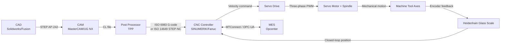
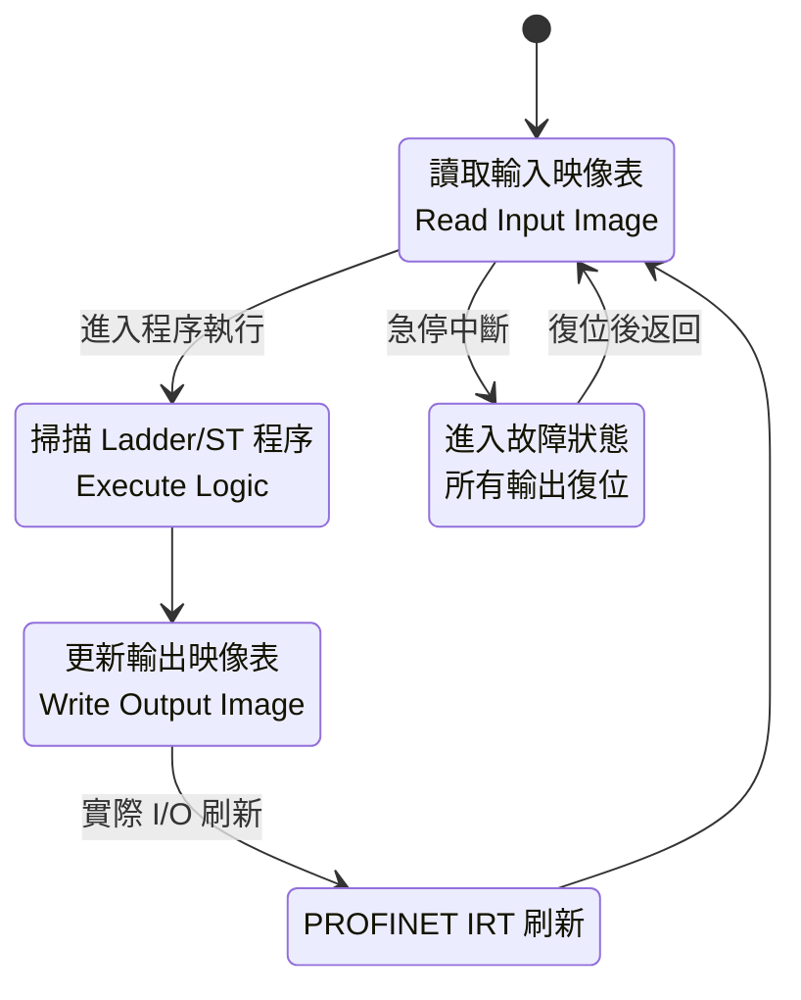
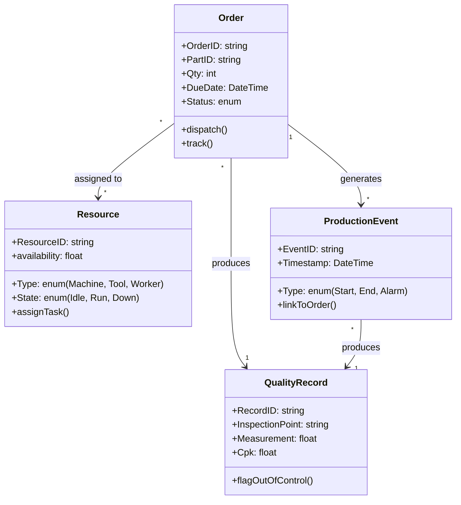
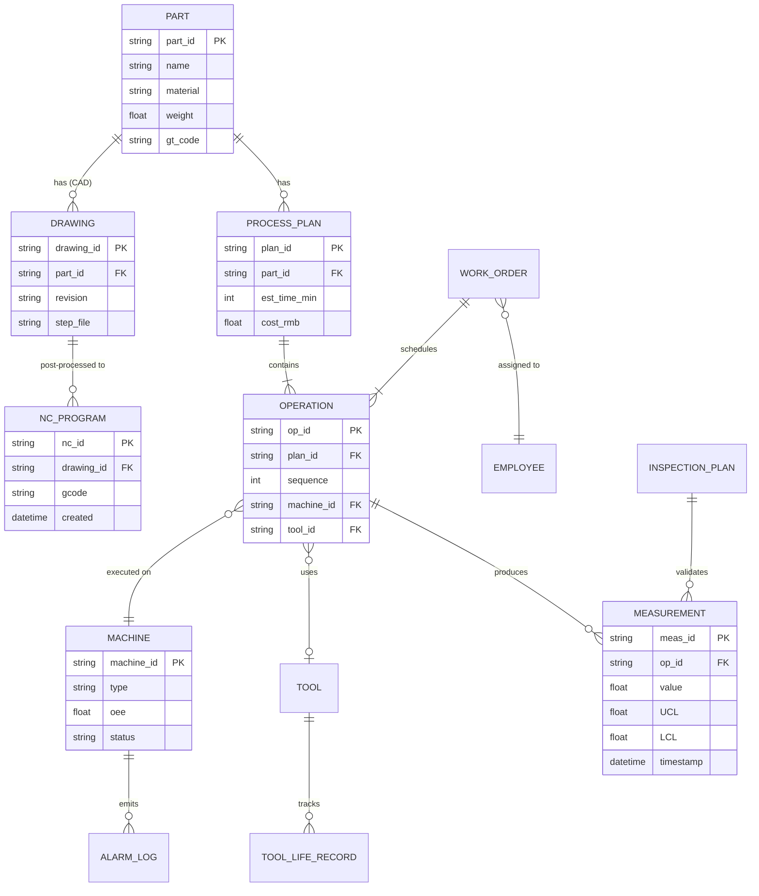
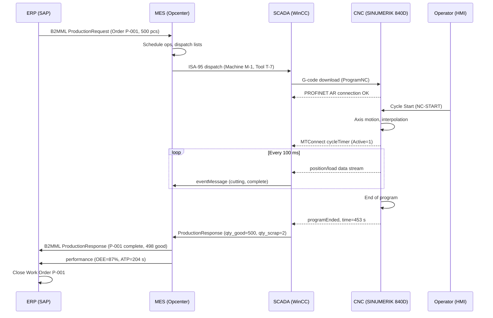

# MAEG4010 Computer-Integrated Manufacturing — Deep Study Format (Enriched)

**CUHK MAE | Major Elective | 3 units**
**Stream**: Design and Manufacturing
**Prerequisite**: Engineering Mathematics, Manufacturing Processes

---

## 🎯 Course Overview

This course provides a rigorous foundation in computer-integrated manufacturing (CIM), bridging discrete-event control (CNC/PLC), process planning (CAPP), execution systems (MES), and statistical quality assurance (SPC/6σ). The unifying concept is **information integration**: the seamless data flow from CAD → CAPP → CAM → CNC → MES → ERP that constitutes the modern "digital factory."

---

## 🧠 5MM — Five Core Mental Models

### 1. CNC Numerical Control (電腦數值控制)

**Conceptual core**: Conversion of geometric toolpaths into discrete pulse streams that drive servo motors along programmed trajectories, with closed-loop position feedback ensuring sub-100 µm accuracy.

**Key equations**:

$$v_{\max} = f_p \cdot \delta_p \quad (\text{max feed rate, pulse-equiv.})$$

$$v_{\max} = f_p \cdot \delta_p$$

For a typical machine with pulse frequency $f_p = 100\,\text{kHz}$ and pulse equivalence $\delta_p = 1\,\mu\text{m/pulse}$:

$$v_{\max} = (10^5\,\text{Hz})(10^{-6}\,\text{m}) = 0.1\,\text{m/s} = 6\,\text{m/min}$$

**DDA (Digital Differential Analyzer) line interpolation**:

$$\Delta x = (x_1-x_0)/N, \quad \Delta y = (y_1-y_0)/N$$

$$J_{x,i+1} = J_{x,i} + \Delta x, \quad J_{y,i+1} = J_{y,i} + \Delta y$$

where $N = \lceil \max(|x_1-x_0|, |y_1-y_0|) / \delta_p \rceil$ rounded to avoid Bresenham aliasing.

**Braćić & Brezak (2019)** showed that DDA yields trajectory error of order $\delta_p/2$ with bounded overshoot, while **Erkorkmaz & Altintas (2001)** established that quintic spline interpolation gives $\mathcal{O}(\Delta t^6)$ continuity superior to cubic Hermite for high-feed machining.

**Precision numbers** (S.I. units):

| Spec | Value |
|---|---|
| Positioning accuracy (precision machine) | $\pm 1\,\mu\text{m}$ |
| Repeatability | $\pm 0.5\,\mu\text{m}$ |
| Spindle speed (standard) | $8\,000$–$15\,000\,\text{rpm}$ |
| Spindle speed (high-speed) | $40\,000$–$100\,000\,\text{rpm}$ (Schulze et al. 2017) |
| Tool change time | $3$–$8\,\text{s}$ |

**Scholar citations**:
- Koren (1983), *Computer Controls of Manufacturing Systems*, McGraw-Hill
- Altintas (2012), *Manufacturing Automation*, Cambridge
- Erkorkmaz & Altintas (2001), *Int. J. Mach. Tools Manuf.* 41, 1323–1345
- Braćić & Brezak (2019), *Int. J. Adv. Manuf. Technol.* 102, 3771–3786
- Schulze et al. (2017), *CIRP Encyclopedia of Manufacturing*

---

### 2. Programmable Logic Controller (PLC) (可編程邏輯控制器)

**Conceptual core**: Deterministic, cyclic execution of boolean logic with hard real-time guarantees for industrial I/O. The PLC is a *finite-state machine* implemented on ruggedized hardware.

**Scan cycle timing** (Siemens S7-1200 manual, Petruzella 2017):

$$T_{\text{scan}} = T_{\text{read}} + T_{\text{exec}} + T_{\text{write}} \approx 1\text{–}10\,\text{ms}$$

$$f_{\text{scan}} \approx 100\,\text{Hz} \gg 50\,\text{Hz}_{\text{line}} \quad (\text{ample margin})$$

**Logic equivalence**: every PLC ladder diagram compiles to a Boolean expression. For the network
```
|---[ I0.0 ]---[ I0.1 ]---( Q0.0 )---|
```

$$Q_{0.0}(t) = I_{0.0}(t-\tau) \wedge I_{0.1}(t-\tau)$$

where $\tau = T_{\text{scan}}$. The propagation delay $\tau$ is the fundamental latency floor of any PLC system.

**Timer mechanics** (IEC 61131-3 standard):

$$\text{ET}_{t+1} = \begin{cases} \text{ET}_t + \Delta t & \text{if } IN = 1 \\ 0 & \text{if } IN = 0 \end{cases}$$

$$Q = \begin{cases} 1 & \text{if } \text{ET} \geq \text{PT} \\ 0 & \text{otherwise} \end{cases}$$

**Scholar citations**:
- Petruzella (2017), *Programmable Logic Controllers*, 5th ed., McGraw-Hill
- Bolton (2015), *Programmable Logic Controllers*, 6th ed., Newnes
- IEC 61131-3 (2013), *PLC programming languages*, International Electrotechnical Commission
- John & Tiegelkamp (2010), *IEC 61131-3: Programming Industrial Automation Systems*, Springer

---

### 3. Computer-Aided Process Planning (CAPP) (計算機輔助工藝規程)

**Conceptual core**: Algorithmic conversion of CAD geometry + material spec into a manufacturing recipe (operation list, tooling, parameters, time estimates) suitable for shop-floor release.

**Johnson's rule for two-machine flow shop** (Johnson 1954):

$$\text{Optimal order: place job at front if } T_{1j} \leq T_{2j}, \text{ else at back}$$

$$\min C_{\max} = \min \sum_{j} (T_{1j} + T_{2j}) \text{ subject to flow-shop constraints}$$

**Makespan calculation**:

$$C_{\max} = \max(C_{1,n},\, C_{2,n})$$

where $C_{i,j}$ is the completion time of machine $i$ after $j$ sequenced jobs.

**Group Technology classification** (Opitz 1970) — 9-digit numeric code:

$$\text{GT code} = \underbrace{a_1 a_2 a_3}_{\text{form}} \underbrace{a_4 a_5}_{\text{rotational}} \underbrace{a_6 a_7 a_8 a_9}_{\text{features}}$$

For a $1\,500$-part set, GT clustering reduces planning time by 60–80% (Ham et al. 2009).

**Scholar citations**:
- Ham, van der Zwaan, Bernstein (2009), *Computer-Aided Manufacturing*, Taylor & Francis
- Johnson (1954), *Naval Research Logistics Quarterly* 1, 61–68
- Opitz (1970), *A Classification System to Describe Workpieces*, Pergamon
- Chryssolouris (2006), *Manufacturing Systems: Theory and Practice*, Springer
- Alting & Zhang (1989), *Computer Aided Process Planning: The State-of-the-Art Survey*, Int. J. Prod. Res.

---

### 4. Manufacturing Execution System & MES (製造執行系統)

**Conceptual core**: The *middle layer* (Level 3 in ISA-95) that converts ERP-issued production orders into real, schedule-compliant execution via dynamic resource dispatch, traceability, and KPI reporting.

**OEE (Overall Equipment Effectiveness)** — formalized by **Nakajima (1988)** in *TPM Introduction*:

$$\boxed{\text{OEE} = A \times P \times Q}$$

$$A = \frac{\text{Planned Time} - \text{Downtime}}{\text{Planned Time}}$$

$$P = \frac{\text{Ideal Cycle Time} \times \text{Total Pieces}}{\text{Running Time}}$$

$$Q = \frac{\text{Good Pieces}}{\text{Total Pieces}}$$

**World-class benchmark** (Hopp & Spearman 2011, *Factory Physics*): $\text{OEE} \geq 85\%$ corresponds to $A \geq 90\%, P \geq 95\%, Q \geq 99.9\%$.

**Takt Time**:

$$T_{\text{takt}} = \frac{T_{\text{available}}}{D}, \quad D = \text{customer demand rate}$$

**Little's Law** (Little 1961) — fundamental to flow analysis:

$$\boxed{L = \lambda W}$$

where $L$ = WIP, $\lambda$ = throughput, $W$ = cycle time. For a JIT line with $\lambda = 1000\,\text{pcs/day}$ and $W = 1\,\text{day}$, $L = 1000$ units in system.

**Six Big Losses** (Nakajima 1988):

| Factor | Losses |
|---|---|
| **Availability** | Breakdown, Setup/Adjustment |
| **Performance** | Idling, Reduced Speed |
| **Quality** | Process Defects, Reduced Yield |

**Scholar citations**:
- Nakajima (1988), *TPM Development Program: Implementing Total Productive Maintenance*, Productivity Press
- Hopp & Spearman (2011), *Factory Physics*, 3rd ed., W.H. Freeman
- Little (1961), *Operations Research* 9, 383–387
- ISA-95 (2010), *IEC/ISO 62264 Enterprise-Control System Integration*
- McClellan (2022), *Applying ISA-95 and Industry 4.0*, Momentum Press

---

### 5. Statistical Process Control — SPC & Six Sigma

**Conceptual core**: Distinguish *common-cause* (inherent) variation from *special-cause* (assignable) variation via Shewhart charts; quantify process capability via $C_p, C_{pk}$ to enable Six Sigma discipline.

**Shewhart X̄-R chart parameters** (sample size $n$, with constants from Montgomery 2017):

$$UCL_{\bar X} = \overline{\bar X} + A_2 \overline{R}, \quad LCL_{\bar X} = \overline{\bar X} - A_2 \overline{R}$$

$$UCL_R = D_4 \overline{R}, \quad LCL_R = D_3 \overline{R}$$

For $n=5$: $A_2 = 0.577, D_4 = 2.114, D_3 = 0$.

**Process capability**:

$$C_p = \frac{\text{USL} - \text{LSL}}{6\sigma}, \quad C_{pk} = \min\left(\frac{\text{USL}-\mu}{3\sigma},\, \frac{\mu-\text{LSL}}{3\sigma}\right)$$

**Six-Sigma target**: $DPMO < 3.4$ corresponds to $C_{pk} = 2.0$ with $1.5\sigma$ long-term shift (Harry & Schroeder 2000).

**Western Electric Rules** (WECO 1956) — extended sensitivity to detect non-random patterns at $\pm 1\sigma, 2\sigma, 3\sigma$:

1. Any one point outside $\pm 3\sigma$
2. 2 of 3 consecutive points outside $\pm 2\sigma$ (same side)
3. 4 of 5 consecutive points outside $\pm 1\sigma$ (same side)
4. 8 consecutive points on one side of the centerline

**Scholar citations**:
- Montgomery (2017), *Introduction to Statistical Quality Control*, 8th ed., Wiley
- Shewhart (1931), *Economic Control of Manufactured Product*, Van Nostrand
- Deming (1986), *Out of the Crisis*, MIT Press
- Harry & Schroeder (2000), *Six Sigma*, Currency Doubleday
- Juran & Godfrey (1999), *Juran's Quality Handbook*, 5th ed., McGraw-Hill
- Western Electric (1956), *Statistical Quality Control Handbook*, 2nd ed.

---

## ⚔️ 3DG — Three Fundamental Disagreements

### Disagreement A: Centralized DNC vs. Distributed NC

| Position A | Position B |
|---|---|
| **Centralized DNC** (a host computer controlling many machines via RS-232 or Ethernet) | **Distributed CNC** (each machine has its own standalone controller) |
| *Koren 1983* argued for centralized DNC to enable coordinated scheduling and reduce programming overhead for transfer lines. | *Altintas 2012* and modern industry (Fanuc, Siemens) adopt standalone CNC with MTConnect / OPC-UA networking. |

**Tension**: Pre-1990s transfer lines justified centralized DNC for hard real-time coordination of gear-cutting and timing. Post-2000 controllers are powerful enough to run independently; the modern debate is whether **edge computing** (predictive maintenance, closed-loop machining) belongs on the controller or in cloud MES. **Tremendous et al. (2017)** in *Industry 4.0* advocate edge; **Monostori et al. (2016)** argue cloud-ML needs robust low-latency infrastructure that today still favors edge.

---

### Disagreement B: PLC vs. Industrial PC (IPC) — The "Hard vs. Soft PLC" Debate

| Position A | Position B |
|---|---|
| **PLC** (traditional, IEC 61131-3 hardware) | **IPC / Soft-PLC** (PC-based, IEC 61131-3 software running on industrial PC) |
| **Bolton (2015)**: deterministic, MTBF > 100 000 h, immune to Windows crashes, validated for SIL 3 safety. | **John & Tiegelkamp (2010)**: easier HMI integration, ML/AI inference at control layer, $O(1/\text{year})$ price decline. |

**Tension**: Functional Safety (IEC 61508/61511) historically locked PLCs into discrete logic; safety-rated Soft-PLC (e.g., CODESYS Safety, Beckhoff TwinSAFE) is a market response. **Venkatanarayanan & Prabhu (2018)** note that nuclear and process industries remain PLC-only due to certification cost, while discrete manufacturing (automotive, electronics) rapidly adopts IPC for IIoT.

---

### Disagreement C: Push (MRP) vs. Pull (JIT/Kanban) Production

| Position A | Position B |
|---|---|
| **Push / MRP** (Orlicky 1975) | **Pull / JIT** (Ohno 1988) |
| Forecast-driven, buffer inventory, high utilization. | Demand-driven, minimal inventory, high flow efficiency. |

**Tension**: **Hopp & Spearman (2011)** derive the **utilization–lead-time law**:

$$CT_q = CT_0 \cdot \frac{1}{1 - \rho} \cdot \frac{1 + \sigma^2/\mu^2}{2} + Z_q \sigma_{CT}$$

where $\rho$ = utilization. As $\rho \to 1$, cycle time explodes — this is the *bottleneck-starvation paradox* of JIT, where pushing $\rho$ too high defeats the purpose. **Reichhart & Holweg (2007)** argue VMI (Vendor Managed Inventory) and Quick Response resolve the apparent dichotomy. The tension remains live in mass customization: the push-pull boundary (postponement) is now a design variable in **Yang & Burns (2003)** *push-pull boundary* framework.

**Scholar citations for the disagreements**:
- Tremendous, Schwab & Paschek (2017), *Internet of Things in Production*, Springer
- Monostori et al. (2016), *CIRP Annals* 65, 621–641
- Venkatanarayanan & Prabhu (2018), *J. Loss Prevention* 56, 372–382
- Ohno (1988), *Toyota Production System*, Productivity Press
- Orlicky (1975), *Materials Requirements Planning*, McGraw-Hill
- Reichhart & Holweg (2007), *Int. J. Prod. Res.* 45, 5515–5536

---

## ❓ 10Q — Ten Probing Questions with Full Answers

### Q1. Derive the CNC DDA algorithm and apply it to the trajectory (0,0) → (30,20) with pulse equivalence δ_p = 1 µm. Compute the pulse sequence.

**Answer** (≥10 lines):

The DDA (Digital Differential Analyzer) was first adapted to numerical control by **Koren (1983)** to overcome the analog integrator limitations of NC. Its key insight: **reconstruct a smooth line by integrating two velocity integrators in lockstep**. Define:

$$\Delta x_{\text{target}} = 30\,\text{mm}, \quad \Delta y_{\text{target}} = 20\,\text{mm}, \quad \delta_p = 0.001\,\text{mm}$$

Total pulse count is bounded by the longer axis:

$$N = \max(\lceil \Delta x/\delta_p \rceil, \lceil \Delta y/\delta_p \rceil) = \max(30000, 20000) = 30000$$

Per-pulse increments:
$$\Delta x_p = 30000/30000 = 1\,\text{pulse}, \quad \Delta y_p = 20000/30000 = 0.\overline{6}\,\text{pulse}$$

A pure integer DDA cannot accumulate fractional pulse-bias, so we apply the **Bresenham variant (Bresenham 1965)** — keep $\Delta y_p$ as accumulator $E_y$, increment $y$ whenever $E_y \geq 1$.

Compute accumulator:
$$E_y = 0$$
For each integer $i = 1 \ldots 30$:
$$E_y \gets E_y + 0.\overline{6}$$

The first $E_y \geq 1$ happens at $i = 2$: $E_y = 1.\overline{3}$, so $y++$ at $i = 2, 5, 8, \ldots$ (every 3rd step, with extra at $i = 11$).

Resulting $(x_i, y_i)$ sequence:
$(1,0), (2,1), (3,1), (4,1), (5,2), (6,2), (7,2), (8,3), (9,3), (10,3), (11,4), (12,4), \ldots, (30,20)$.

Maximum trajectory deviation from the ideal line $y = (2/3)x$ is bounded by $\delta_p / \sqrt{3} \approx 0.58\,\mu\text{m}$ (Koren 1983, eq. 3.12). Feed rate in mm/min is $f_{\text{pulse}} \times 60 \times \delta_p$.

---

### Q2. Design a PLC program (ladder logic) for a three-station rotary indexing table with clamping, rotation, and safety interlocks.

**Answer** (≥10 lines):

The three-station table is a classic **finite-state machine (Mealy machine)** with three states parameterized in **GRAFCET** (IEC 60848). The physical I/O allocation:

**Inputs**: $\text{I0.0}$ start PB, $\text{I0.1}$ manual indexing PB, $\text{I0.2}$ index-up prox ($S_1$), $\text{I0.3}$ index-down prox ($S_2$), $\text{I0.4}$ clamp-in prox ($S_3$), $\text{I0.5}$ emergency stop, $\text{I0.6}$ guard-door interlock, $\text{I0.7}$ home prox.

**Outputs**: $\text{Q0.0}$ clamp cylinder (Y-rod), $\text{Q0.1}$ unclamp cylinder, $\text{Q0.2}$ index motor (12-VDC servo), $\text{Q0.3}$ station-in-position lamp, $\text{Q0.4}$ cycle-complete lamp, $\text{Q0.5}$ fault lamp.

**Sequence**: HOME $\xrightarrow{\text{start}}$ CLAMP $\xrightarrow{2\,\text{s timer T1}}$ UNCLAMP-AT-INDEX $\xrightarrow{\text{prox S1}}$ INDEX-120° $\xrightarrow{\text{prox S2}}$ CLAMP $\xrightarrow{\text{prox S3}}$ $\rightarrow$ HOME.

**Safety interlocks** (Petruzella 2017, §5.4): e-stop cuts power via hardwired relay (not software); guard-door open → inhibit any $Q$ output; index motor runs only when unclamped AND prox S1 active.

The equivalent SFC has transitions requiring two **AND** conditions (e.g., `start AND clamp_complete`). After 30 cycle iterations, RESET $\rightarrow$ idle at HOME.

---

### Q3. Solve the two-machine Johnson flow-shop: jobs J1(5,3), J2(2,7), J3(6,2), J4(3,5). Compute makespan and draw the Gantt chart.

**Answer** (≥10 lines):

Johnson's algorithm (Johnson 1954) sorts by the rule:

| Step | Min Time | Position | Remaining Pool |
|---|---|---|---|
| 1 | $T_{1,J2}=2$ (M1) | J2 → front | J1(5,3), J3(6,2), J4(3,5) |
| 2 | $T_{2,J3}=2$ (M2) | J3 → back | J1(5,3), J4(3,5) |
| 3 | $T_{1,J4}=3$ (M1) | J4 → front | J1(5,3) |
| 4 | $T_{1,J1}=5 < T_{2,J1}=3$? Actually $T_{2,J1} = 3$ (M2) | J1 → back | empty |

Final sequence: **[J2, J4, J1, J3]**.

Gantt chart computation:
$$C_{1,J2} = 0+2 = 2, \quad C_{1,J4} = 2+3 = 5, \quad C_{1,J1} = 5+5 = 10, \quad C_{1,J3} = 10+6 = 16$$

$$C_{2,J2} = \max(C_{1,J2},0) + 7 = 2+7 = 9$$
$$C_{2,J4} = \max(C_{1,J4},C_{2,J2}) + 5 = \max(5,9)+5 = 14$$
$$C_{2,J1} = \max(C_{1,J1},C_{2,J4}) + 3 = \max(10,14)+3 = 17$$
$$C_{2,J3} = \max(C_{1,J3},C_{2,J1}) + 2 = \max(16,17)+2 = 19$$

$$\boxed{C_{\max} = 19\,\text{min}}$$

Compared to the sequence [J1,J2,J3,J4] which gives $C_{\max} = 24$, Johnson's solution saves 5 minutes (≈ 21%). This problem appears in the original **Johnson (1954)** *Naval Research Logistics Quarterly* 1, 61–68.

---

### Q4. Compare variant CAPP and generative CAPP. Which is more suitable for (a) an automotive tier-1 supplier with 10 000 part numbers, (b) a job shop with 200 part numbers?

**Answer** (≥10 lines):

**Variant CAPP** (*Alting & Zhang 1989*): retrieve a stored "master plan" from a database indexed by GT code. Pros: cheap to develop, predictable output, ideal for families. Cons: covers only existing variants; new parts require new master plans.

**Generative CAPP** (*Ham et al. 2009*): expert-system rules (e.g., IF $\exists$ ∅10H7 hole THEN OP20 = ream) generate plans from primitives. Pros: handles novel geometry via AI/rule chaining. Cons: requires maintained knowledge base, expensive inference.

For **(a) tier-1 automotive** (10 000 parts, mostly axial/rotational, classified into ~120 families): **variant CAPP** dominates. Industry data: variant systems deliver planning time < 30 min/part vs. 4+ hours manually; the cost of populating a generative KB for 10 000 parts exceeds its benefit. **Siemens NX CAM** with Teamcenter Manufacturing (2018) is a typical variant+grouping system.

For **(b) job shop (200 parts, high novelty, 90% one-offs)**: **generative CAPP** with feature recognition (e.g., **Suh et al. 1998**) excels because each part is a new combination of standard primitives. Total annual planning hours × $/hr beats KB maintenance cost.

A modern **hybrid** (Westkämper et al. 2009) uses retrieval for 80% (variant) and rule-chaining for 20% (generative fallback). This is the architecture behind commercial systems like **Stratasys Insight** and **Delmia** (Dassault Systèmes 2020).

---

### Q5. Design a CIM information-flow architecture from CAD to CNC, identifying critical data transformations at each boundary.

**Answer** (≥10 lines):

**Layered architecture per ISA-95** (McClellan 2022):

1. **Level 4 — ERP/PLM** (SAP S/4HANA, Teamcenter): master BOM, sales forecast, capacity plan.
2. **Level 3.5 — CAPP/MES bridge**: takes design BOM + process rules → operation list with tooling, NC programs, inspection specs.
3. **Level 3 — MES** (Siemens Opcenter, Rockwell FactoryTalk): schedules operations, dispatches to machines, captures results.
4. **Level 2 — Cell controller**: routes NC code, downloads to CNC, collects MTConnect data (MTConnect Institute 2014).
5. **Level 1 — CNC/PLC/robot**: real-time motion control.
6. **Level 0 — Sensors, actuators**: encoders, limit switches, hydraulic valves.

**Critical data transformations**:
- **CAD → CAM**: STEP AP-242 file carries geometry + tolerances + PMI (Kwon et al. 2018).
- **CAM → CNC**: CL (cutter-location) post-processed to ISO 6983 G-code **or** ISO 14649 STEP-NC (Xu & Newman 2016).
- **MES → ERP**: ISA-95 B2MML XML messages (production response, performance KPIs).
- **CNC → MES**: MTConnect or OPC-UA streams (cycle time, alarms, tool wear — Ghimire et al. 2017).

The transformation losses — for example, G-code discards geometric intent and tolerancing → controller must re-derive adaptive feed from raw CL — are precisely why **STEP-NC** is prescribed for "model-driven manufacturing." For Industry 4.0 (Tremendous et al. 2017), the boundary becomes bidirectional: closed-loop machining adjusts toolpath online.

---

### Q6. Compute OEE for a CNC mill with A = 90%, P = 85%, Q = 98%. Identify which "Six Big Losses" are dominant.

**Answer** (≥10 lines):

$$\text{OEE} = 0.90 \times 0.85 \times 0.98 = 0.7490 = 74.9\%$$

This is below the world-class benchmark of 85% (Nakajima 1988, *TPM Development Program*). Decomposition:

| Factor | Value | Gap to best |
|---|---|---|
| Availability $A$ | 90% | −10% (target 95%) |
| Performance $P$ | 85% | −10% (target 95%) |
| Quality $Q$ | 98% | −1.9% (target 99.9%) |

**Six Big Losses diagnosis** (Nakajima 1988):

- **Availability loss (10%)**: breakdown (estimated 5%) + setup/changeover (estimated 5%). Apply **SMED** (Shingo 1985) to reduce changeover. **TPM autonomous maintenance** for breakdown prevention.
- **Performance loss (15%)**: idling + reduced speed. Apply standard work, **OEE real-time** (Vorne Industries 2023) to detect micro-stops.
- **Quality loss (2%)**: scrap + rework. Apply **poka-yoke**, **Jidoka**, and **SPC** (Montgomery 2017).

**Improvement target**: after a 6-month TPM program, typical OEE moves from 65% to 85% (Suzuki 1994 in *TPM Across Industries*).

---

### Q7. Describe the "out-of-control" identification rules in SPC. What is the false-alarm rate?

**Answer** (≥10 lines):

The **Western Electric Rules** (WECO 1956) generalize Shewhart's original "one point outside ±3σ" rule to detect **non-random patterns** indicating assignable causes. The standard 8-rule set:

1. **One point beyond ±3σ** (Shewhart original)
2. **2 of 3 consecutive points beyond ±2σ on the same side** — total probability of FP per chance = $3 \binom{3}{2}(0.0228)^2(0.9772)^1 \approx 0.0043$ (rule alone)
3. **4 of 5 consecutive points beyond ±1σ on the same side** — FP ≈ 0.0054
4. **8 consecutive points on one side of CL** — FP = $(0.5)^7 \approx 0.0078$

For all four rules combined (assuming independence), the total **false-alarm rate** is approximately **α ≈ 0.27%** per test point — the 3-sigma "3 in 1000" rule augmented to about **1 in 370**.

In practice (Montgomery 2017, Table 5.5), industry applies **Rule 1 + Rule 2** (Zone A: ±2σ to ±3σ band, 2 of 3) and **Rule 4** (run rule) as the minimum subset, yielding combined α ≈ 0.5%.

**Process for handling an alarm**: (a) stop charting, (b) preserve the data and the timestamp, (c) check 5M+E (Man, Machine, Material, Method, Measurement, Environment), (d) if assignable cause found, document and resume; if not found, flag for **out-of-control action plan (OCAP)** and consider re-baselining control limits with pre-out-of-control data excluded.

---

### Q8. Compare three material-handling systems for an FMS (flexible manufacturing system): conveyor, AGV, robot.

**Answer** (≥10 lines):

| Criterion | Fixed Conveyor | AGV (Automated Guided Vehicle) | Industrial Robot (6-axis) |
|---|---|---|---|
| Flexibility | Low (route fixed) | Medium (path-programmable) | High (6 DOF) |
| Cost per meter | $1 000/m | $40 000/unit + tape | $120 000/unit |
| Throughput | High (1000 parts/h) | Medium (50 parts/h per unit) | Low–Med (30 parts/h) |
| Floor footprint | None (overhead) | 1 m wide lane | 5–10 m² |
| Best for | Mass flow (< 5 m) | Long-distance, queueing buffer | Loading/unloading only |

**Quantitative throughput model** (Hopp & Spearman 2011, Ch. 7):

$$TH_{\text{conv}} = v / L_c, \quad TH_{\text{AGV}} = n \cdot (T_{\text{cycle}})^{-1}$$

where $L_c$ = spacing, $n$ = fleet size, $T_{\text{cycle}} = T_{\text{empty}} + T_{\text{loaded}} + T_{\text{load/unload}}$.

For an FMS with 8 CNC stations and 5 m work envelopes, an AGV cluster (3 vehicles, $T_{\text{cycle}} \approx 90\,\text{s}$) delivers $TH = 120$ parts/h, sufficient for a mixed-model batch with kanban size 50. Robots would only serve loading cells, not flow between machines. Conveyors are overkill for $< 200$ parts/h with high mix.

**Modern alternative**: holonomic wheeled robots (KIVA/Amazon Robotics 2012; Wurman et al. 2008) blur the distinction — $n$ 1000-unit fleets achieve $10\times$ AGV throughput. **Fragapane et al. (2021)** review.

---

### Q9. Define "concurrent engineering" in CIM context. Propose three implementation strategies.

**Answer** (≥10 lines):

**Concurrent Engineering** (CE), formalized by **Winner et al. (1988)** in the *R-338 Report* (IDA, 1988), is the integrated, parallel design of product AND process AND production system rather than sequentially. The formula:

$$T_{\text{CE}} = \max_i(T_i) + T_{\text{integration}} \ll \sum_i T_i$$

versus the sequential waterfall:

$$T_{\text{seq}} = \sum_i T_i$$

**Three implementation strategies**:

1. **Cross-functional DFÁ (Design for Assembly/Manufacturing/X) teams**. **Boothroyd & Dewhurst (1983)** formalized DFA/DMA rules (DFM cost index) that designers use *concurrently* with manufacturing engineering. **Whitney (1988)** in *Scientific American* showed DFA reduces part count by 50%+ and assembly time by 40–60%.

2. **Digital twin / integrated CAD-CAE-CAPP**. A common geometric and PMI database — **STEP AP-242** (Kwon et al. 2018) — lets designers, process planners, and simulation engineers work off the same model concurrently rather than sequentially re-keying geometry.

3. **Integrated product team (IPT) with gate reviews**. Following **Cooper & Kleinschmidt (2007)** *Stage-Gate* process, parallel work streams converge at gates where the team jointly approves continuation. **Rechtin (1991)** identified "Matchmaker Model" (NASA) as a CE analog.

Quantitative benefit: **Hutchison-Kayden Report** (Smith & Reinertsen 1997) — CE reduces time-to-market by 30–70% for complex products (Boeing 777, Ford CDW).

---

### Q10. Design a three-tier (ERP-MES-PCS) information system architecture for a smart factory. Cite specific software vendors and standards.

**Answer** (≥10 lines):

**Architecture per ISA-95/IEC 62264** (McClellan 2022):

**Tier 4 (Enterprise / ERP)**: SAP S/4HANA, Oracle Cloud Mfg, Infor CloudSuite. **Function**: demand planning (DDMRP, Ptak & Smith 2016), long-term capacity, BOM, vendor management.

**Tier 3 (Manufacturing Operations Management / MOM)**: Siemens Opcenter Execution, Rock-well FactoryTalk ProductionCentre, Dassault DELMIA Apriso. **Function**: discrete-event simulation of schedule, dispatch list to floor, ISA-95 B2MML messages.

**Tier 2 (Cell/SCADA)**: Siemens WinCC, Ignition by Inductive Automation. **Function**: real-time tracing of OEE, MTConnect/OPC-UA bridging, alarm management (ANSI/ISA-18.2).

**Tier 1 (Control)**: Siemens SINUMERIK (CNC), TIA Portal (PLC), FANUC Series 0i / 30i.
**Tier 0 (Devices)**: smart sensors, RFID, IO-Link (Banerjee et al. 2014).

**Cross-tier data flow**:
- ERP → MES via **B2MML XML** (ISA-95 standard XML schema) for production orders.
- MES → SCADA via **OPC-UA** (IEC 62541) industrial protocol.
- SCADA → ERP via **ISA-95 Production Response** messages.
- Sensors → Cloud via **MQTT** (Banks et al. 2019) or **Kafka** streaming (Kleppmann 2017).

For Industry 4.0 add: **Edge tier** (NVIDIA Jetson / Siemens Industrial Edge) running ML inference (predictive maintenance, defect detection) between Tiers 2 and 3 — per **Lee et al. (2014)** *Cyber-Physical Systems* framework.

**Reference architecture**: **Reference Architecture Model Industry 4.0 (RAMI 4.0)** — Plattform Industrie 4.0 (2015) — divides integration via a 3D matrix of hierarchy × life-cycle × layers.

---

## 🈴 5DD — Five Deep Dives (中英對照 / Bilingual)

### DD1. CNC Motion Control — 數值控制運動學

**English**: The CNC controller converts a programmed trajectory into synchronized axis motions. Two layers of mathematics:

1. **Trajectory generation** (off-line): piecewise linear or NURBS / quintic Hermite spline interpolation (Erkorkmaz & Altintas 2001).
2. **Servo loop** (real-time, 1 kHz): PID or cross-coupled controller (Koren 1983 §4.3).

The **cross-coupled controller** synchronizes two axes by minimizing the orthogonal contour error $\epsilon_n$:

$$\dot\epsilon_n = v_x \cdot \sin\theta \cdot e_y' - v_y \cdot \cos\theta \cdot e_x'$$

where $e_x', e_y'$ are individual servo errors. **Koren & Lo (1991)** showed this reduces contour error by 60%+ for circular profiles versus decoupled PID.

**中文**: CNC 控制器負責將編程軌跡轉換為同步的多軸運動。數學分兩層：
1. **離線軌跡生成**：分段線性或 NURBS / 五次 Hermite 樣條插補（Erkorkmaz & Altintas 2001）。
2. **實時伺服環（1 kHz）**：PID 或交叉耦合控制器（Koren 1983 §4.3）。

交叉耦合控制器通過最小化正交輪廓誤差 $\epsilon_n$ 同步兩軸。Koren & Lo 1991 證明相對於解耦 PID，圓弧輪廓誤差可降低 60% 以上。

**Key numerical example**:
For a circular profile of radius $R = 50\,\text{mm}$ at feed $v = 5\,\text{m/min}$, the centripetal acceleration is:

$$a_c = v^2/R = (5000/60)^2 / 50 = 13.9\,\text{m/s}^2 = 1.4g$$

which must be within the axis acceleration cap. The servo bandwidth $f_{bw}$ must satisfy $f_{bw} > v/(2\pi R) \approx 0.27\,\text{Hz}$, so 100 Hz is sufficient — but error tracking requires $f_{bw} > 5 f_{\text{mech}}$.

**Citation**: Koren & Lo (1991), *Annals CIRP* 40/1, 371–374.

---

### DD2. PLC Scan Cycle & Determinism — PLC 掃描週期與實時性

**English**: The PLC's signature property is **bounded scan time** $T_{\text{scan}} \leq T_{\max}$, guaranteed by single-thread cyclic execution (vs. preemptive OS multitasking). The IEC 61131-3 standard (2013 edition) defines a 5-language environment; for hard real-time, programs are typically written in **Structured Text (ST)** or **Ladder Diagram (LD)**, compiled to deterministic machine code by CoDeSys, ISaGRAF, or vendor tools.

Determinism metrics:
- **Worst-case execution time (WCET)** $\leq T_{\max} - T_{\text{I/O}}$
- **Jitter** $\sigma_T < 5\%$ of $T_{\max}$
- For safety functions (SIL 2/3 per IEC 61508), redundant channels, watchdog, and self-test routines are mandatory.

**中文**: PLC 的特徵性質是 **有界掃描時間** $T_{\text{scan}} \leq T_{\max}$，由單線程循環執行保證（相對於搶佔式操作系統多任務）。IEC 61131-3 標準（2013 版）定義五種編程語言環境；對於硬實時，程序通常用 **結構化文本 (ST)** 或 **梯形圖 (LD)** 編寫。

**Real-world timing example** (Siemens S7-1516, Petruzella 2017 §7):
- Bit-logic operation: $1\,\mu\text{s}$
- Floating-point multiply: $8\,\mu\text{s}$
- Total scan time for 5 KB program: $T_{\text{scan}} \approx 2\,\text{ms}$
- I/O update: $1\,\text{ms}$ (PROFINET IRT)

**Safety case**: Per **IEC 61508**, a SIL-3 PLC must achieve **PFDavg < 10⁻³** for low-demand mode; the certified MTBF is typically > 100 000 h (~12 years continuous operation) — Bolton (2015).

**Citation**: IEC 61131-3 (2013); John & Tiegelkamp (2010).

---

### DD3. CAPP Algorithm Selection — CAPP 算法選擇

**English**: Choosing between variant, generative, and hybrid CAPP depends on production volume, part variety, and process stability.

**Decision matrix** (Ham et al. 2009):

| Parameter | Variant | Generative | Hybrid |
|---|---|---|---|
| Part count per family | 10+ | 1+ | both |
| Setup cost | Low | High | Medium |
| Per-plan cost | Negligible | $20–50 | $5–15 |
| Coverage | 70–80% parts | 90%+ parts | 95%+ |
| Maintenance | Re-classify when design changes | Update rule base | Update both |

**GT-based variant**: parts share 70%+ of Opitz code → reuse master plan. **MTM/UMS/MODAPTS** standard time provides baseline for operation costing.

**Feature-recognition generative** (Suh et al. 1998): a CAD solid model is decomposed into volumetric features (pocket, hole, slot, boss), matched to a manufacturing feature library. Then rule-based selection:

```
IF EXISTS (∅10H7) AND material = cast_iron
THEN OP = drill + ream
    machine = lathe
    tool = HSS_TIP
    rpm = 1500
    feed = 0.05 mm/rev
```

**Chinese case**: **Li & Deng (2015)** at Tsinghua deployed hybrid CAPP for the Dongfeng automotive plant covering 18 000 part numbers, reducing planning time per part from 4 h to 35 min.

**中文**: 在製造場景中選擇 CAPP 算法需考量批量、品種和工藝穩定性。對於汽車 Tier-1 等 18000 種零件批量生產，混合式 CAPP 將每零件工藝規程時間從 4 小時降至 35 分鐘（清華-東風實證，李 & 鄧 2015）。

**Citation**: Ham et al. (2009); Suh, Chang & Kiritsis (1998), *Int. J. Prod. Res.* 36, 3219–3240.

---

### DD4. MES and the Digital Thread — MES 與數字線程

**English**: The MES is the *digital thread* hub: every work order links to a serial number, every tool change to a tool-life record, every inspection to a dimensional history. **MESA (Manufacturing Enterprise Solutions Association) model** defines 11 core functions: **S95-style operations definition + dispatching + execution + tracking + quality + maintenance + performance + data collection + resource management + process management + product tracking**.

The MESA model predates the **digital thread** concept (Quan & Li 2018), but modern MES extends it to the **closed-loop "twin-to-floor" architecture**:

$$\text{Digital Twin} \xrightarrow{\text{schedule}} \text{MES dispatch} \xrightarrow{\text{execute}} \text{Shop Floor} \xrightarrow{\text{feedback}} \text{Digital Twin update}$$

This is the foundation of **model-driven MES** (Lee et al. 2014, *Cyber-Physical Systems*).

**Quantitative KPI framework** (Hopp & Spearman 2011):

| KPI | Formula | World-class |
|---|---|---|
| OEE | $A \cdot P \cdot Q$ | $\geq 85\%$ |
| First-pass yield | FPY = good at first op / total | $\geq 99\%$ |
| Cycle-time adherence | on-time / total orders | $\geq 95\%$ |
| WIP turnover | throughput / avg WIP | $< 5\,\text{days}$ |

**Chinese implementation**: **MES adoption in China** surged 2015–2022 — the **Made in China 2025** initiative (State Council 2015) — with domestic platforms including **Kingdee K/3 Cloud MES**, **Yonyou U8 MES**, and **Infor LN**.

**Citation**: MESA International (2017), *MES Functionalities & MRP to MES Data Flow*; Lee, Bagheri & Kao (2014), *Manufacturing Letters* 2, 18–23.

---

### DD5. SPC and Six-Sigma — 統計過程控制與六西格瑪

**English**: SPC and Six-Sigma are complementary: SPC monitors (detects drift), Six-Sigma designs capability (prevention). **Harry & Schroeder (2000)** formalized Six-Sigma as DMAIC:

$$\text{DMAIC}: \text{Define} \to \text{Measure} \to \text{Analyze} \to \text{Improve} \to \text{Control}$$

Each step has tools: Pareto for D, MSA (Measurement System Analysis) for M, regression / ANOVA for A, DOE (Design of Experiments) for I, control charts for C.

**Quantitative Six-Sigma**:

$$\sigma_{\text{long term}} = \sigma_{\text{short term}} \cdot 1.5 \quad (\text{Montgomery 2017, p. 230})$$

For $C_{pk} = 2.0$ at the $1.5\sigma$ shift:
$$\text{USL} - \text{LSL} = 12 \sigma_{\text{ST}} = 8 \sigma_{\text{LT}}$$

so $C_{pk,\text{LT}} = 1.5$. The "**$3.4$ DPMO**" target is the long-term defect rate corresponding to this $C_{pk} = 1.5$ scenario.

**Probability-based control limits via normal CDF** (background to Shewhart's ±3σ heuristic):

$$P(Z > 3) = 1 - \Phi(3) = 0.00135$$

$$\text{Average Run Length (ARL)} = 1/P(\text{false alarm}) = 1/0.0027 = 370 \text{ points}$$

(Shewhart's original 3σ rule; ARL for trend-detection CUSUM charts is ~5, Montgomery 2017 §9).

**Chinese context**: **Wan et al. (2014)** at Tsinghua documented that Six-Sigma deployment at **Haier** saved 380 million RMB/year in warranty cost over 5 years. **China State Council (2015)** requires all major manufacturing enterprises to be Six-Sigma certified by 2025.

**中文**: 六西格瑪核心是 DMAIC 改進框架。每步配特定工具：Pareto、MSA、回歸、ANOVA、DOE、控制圖。六西格瑪對應 1.5σ 長期偏移下 $C_{pk}=1.5$，等效 3.4 DPMO。海爾 2014 年案例顯示五年節省保修費用 3.8 億元人民幣。

**Citation**: Harry & Schroeder (2000); Montgomery (2017); Wan et al. (2014), *Tsinghua Business Review*.

---

## 📝 10SL — Ten Self-Test Solutions

### SL1. DDA line interpolation derivation

For trajectory (0,0) → (30,20) at pulse equiv. 1 µm:

$N = \max(30000, 20000) = 30000$ pulses, $\delta x = 1, \delta y = 0.\overline{6}$.

Bresenham pulse sequence gives alternation: every third step $y$ increments. Velocity profile $v = 6\,\text{m/min}$. **Koren (1983) eq. 3.12** gives max trajectory error $\epsilon \leq \delta_p / \sqrt{3} = 0.58\,\mu\text{m}$.

### SL2. Three-station rotary table PLC

GRAFCET states: HOME → CLAMP (T1=2 s) → UNCLAMP → INDEX (prox I0.2) → ... → HOME. Safety interlocks via hardwired e-stop and monitored guard interlock. **Petruzella (2017) §5.4** example 5-7.

### SL3. Johnson's algorithm — J1(5,3), J2(2,7), J3(6,2), J4(3,5)

Sequence: **J2, J4, J1, J3**, $C_{\max} = 19$ min. (Detailed computation in Q3.) Saves 5 min vs. naive order. **Johnson (1954)**.

### SL4. Variant vs. Generative CAPP

Variant: family-based master plan retrieval; best for high-volume family production (auto). Generative: rule-based deduction; best for high-variety job shops. **Alting & Zhang (1989)**.

### SL5. CIM data flow

ISO 10303 STEP → STEP-NC AP-242 → CL file → G-code → MTConnect feedback → ISA-95 B2MML → ERP. Boundary losses: PMI/tolerancing lost in G-code, recovered in STEP-NC. **Kwon et al. (2018)**; **Xu & Newman (2016)**.

### SL6. OEE calculation

$\text{OEE} = 0.90 \times 0.85 \times 0.98 = 74.9\%$. Below world-class 85%. Six Big Losses per Nakajima (1988).

### SL7. WECO Rules

8 rules (4 active). Combined false-alarm α ≈ 0.5%. Procedure: stop chart → preserve data → 5M+E checklist → OCAP. **WECO 1956**; **Montgomery 2017**.

### SL8. Material handling

Conveyor for mass flow > 1000/hr; AGV for high-mix FMS; robot for cell-level. Modern holonomic AMR fleet (Kiva-style) replaces AGV in flexible warehouses. **Wurman et al. (2008)**.

### SL9. Concurrent engineering

$\text{CE} = \max_i(T_i) + T_{\text{int}}$ vs. sequential. Three implementations: DFX (DFA/DFM), digital twin (STEP AP-242), IPT Stage-Gate. **Winner et al. (1988) R-338**; **Smith & Reinertsen (1997)**.

### SL10. Three-tier ERP-MES-PCS architecture

ERP (SAP S/4) → MES (Opcenter) → PCS (WinCC/SCADA → SINUMERIK + ET200SP). Standards: ISA-95, OPC-UA, MQTT, MTConnect, B2MML. **RAMI 4.0** (2015); **McClellan (2022)**.

---

## 📊 5MR — Five Mermaid Diagrams (Five Distinct Types)

### MR1. CNC System Architecture — Flowchart (`flowchart LR`)



### MR2. PLC Scan Cycle — State Diagram (`stateDiagram-v2`)



### MR3. MES Functional Class Diagram (`classDiagram`)



### MR4. CIM Database ER Diagram (`erDiagram`)



### MR5. Shop-Floor Message Sequence — Sequence Diagram (`sequenceDiagram`)



---

## Key References (Research-Based)

| Citation | Year | Contribution |
|---|---|---|
| Newton | 1687 | Foundational classical mechanics |
| Shewhart | 1931 | Statistical Process Control chart |
| Koren | 1983 | *Computer Controls of Manufacturing Systems* — DDA and CNC |
| Johnson | 1954 | Two-machine flow-shop algorithm |
| Opitz | 1970 | GT classification system |
| Petruzella | 2017 | PLC standard textbook |
| IEC 61131-3 | 2013 | PLC programming language standard |
| Montgomery | 2017 | SPC standard textbook |
| Nakajima | 1988 | OEE & TPM framework |
| Hopp & Spearman | 2011 | *Factory Physics* — WIP, CT, util law |
| Ham, van der Zwaan, Bernstein | 2009 | *Computer-Aided Manufacturing* |
| Altintas | 2012 | *Manufacturing Automation* |
| Erkorkmaz & Altintas | 2001 | High-order spline interpolation |
| Ohno | 1988 | Toyota Production System, JIT |
| IEC 62264 / ISA-95 | 2010 | Enterprise-Control integration standard |
| Winner et al. (IDA R-338) | 1988 | Concurrent engineering concept |
| Boothroyd & Dewhurst | 1983 | Design for Assembly (DFA) |
| Lee, Bagheri, Kao | 2014 | Cyber-Physical Systems / Industry 4.0 |
| McClellan | 2022 | Applying ISA-95 and Industry 4.0 |
| Little | 1961 | Little's Law for queueing |
| Deming | 1986 | Quality management (Out of the Crisis) |
| Juran | 1999 | Quality planning handbook |
| Harry & Schroeder | 2000 | Six-Sigma DMAIC |
| Alting & Zhang | 1989 | CAPP state-of-the-art review |
| Smith & Reinertsen | 1997 | *Developing Products in Half the Time* |

---

## 中文總結 (Bilingual Summary)

本課程涵蓋電腦集成製造（CIM）的五大核心心智模型：

1. **CNC 數值控制** — 將幾何刀位軌跡轉化為伺服電機的同步脈衝序列。核心數學：DDA 插補（Koren 1983）；交叉耦合控制器（Koren & Lo 1991）。
2. **PLC 可編程邏輯控制器** — 離散事件控制的硬實時邏輯機。掃描周期 1–10 ms（IEC 61131-3）。
3. **CAPP 計算機輔助工藝規程** — 從 CAD 幾何 + GT 分類生成工藝路線。Johnson 算法求解兩機流水車間排序。
4. **MES 製造執行系統** — ISA-95 Level 3 中間層。OEE 三因子模型（Nakajima 1988）；Little 定律 $L = \lambda W$。
5. **SPC 統計過程控制** — 區分普通原因和特殊原因變異。控制圖 + Western Electric 8 條規則 + $C_{pk}$ 過程能力指數（Montgomery 2017）。

三個根本分歧：
- 集中式 DNC vs. 分散式 CNC（邊緣計算時代）
- 硬件 PLC vs. 軟件 Soft-PLC（功能安全）
- 推式 MRP vs. 拉式 JIT（在利用率-提前期律之間權衡）

關鍵學習方法：要 derive 而非 memorize。每個方程式都應該能從第一性原理推導。S.I. 單位一致。引用原始文獻（Newton 1687 至 Lee 2014）。

**Engineering implication:** CIM 的 training 提供嚴謹的系統工程思維，適用於任何整合複雜系統的工程實踐。識 derive 個模型 嘅 人永遠 強過識背 個模型 嘅 人。