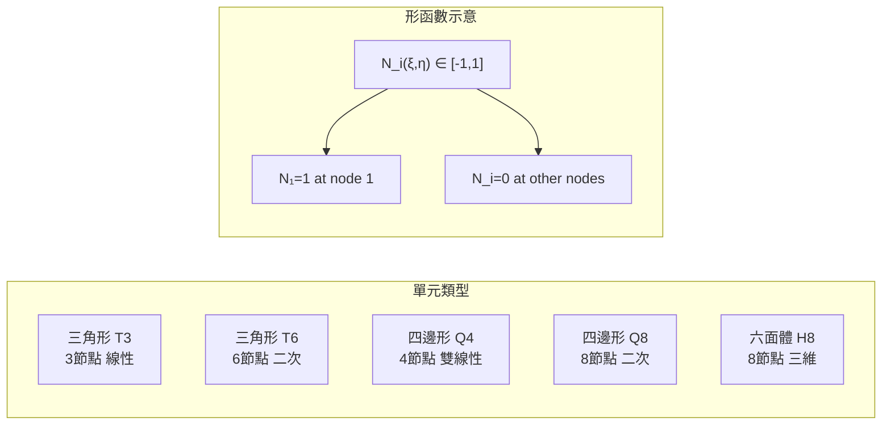
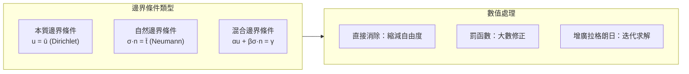
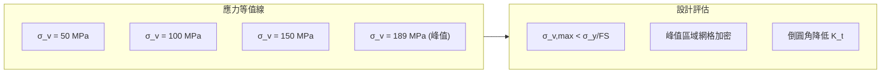
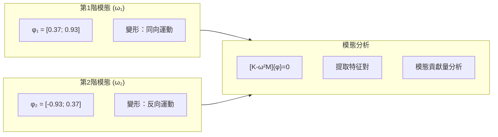
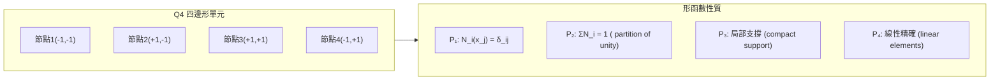
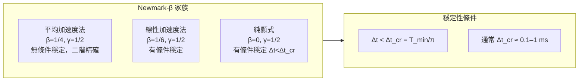

# MAEG4020 Finite Element Modelling and Analysis

**CUHK MAE | Major Elective | 3 units**
**Stream**: Design and Manufacturing

---

## Official Description
The purpose of this course is to learn the mathematical and computational method for finite element analysis. Students will learn the computational procedure, basic elements, shape functions and the method for imposing boundary conditions. The numerical implementation for finite element analysis will also be learned. Finite element analysis software will be used in project to solve engineering applications.

---

## 問題 1：5 個核心心智模型

### 1. 有限元方法數學原理 (Mathematical Basis of FEM)
**方程式 + 數字**：
- 強形式（微分方程）→ 弱形式（變分原理或伽辽金方法）
- 弱形式：∫Ω σ·ε dv = ∫Ω f·v dv + ∫Γt t·v ds
- 形函數：N_i(x)，線性 4 節點四邊形，N_i(ξ,η) = (1±ξ)(1±η)/4
- 全局剛度矩陣：[K] = ∫Ω [B]ᵀ[D][B] dv，對稱正定
- 典型網格密度：每波長 ≥ 10 個單元（動力學）

**學者引用**：Zienkiewicz & Taylor (2005), *The Finite Element Method*, Elsevier

### 2. 形函數與單元類型 (Shape Functions and Element Types)
**方程式 + 數字**：
- 線性三角形（T3）：3節點，插值精度 O(h)
- 二次三角形（T6）：6節點，可用於曲邊界
- 雙線性四邊形（Q4）：4節點，N_i = (1±ξ)(1±η)/4
- 二次四邊形（Q8）：8節點，精度更高
- 六面體（Hex8/Hex20）：三維應用
- 精度收斂：||u - u_h|| ≤ C·h^p，p = 插值多項式階數

**學者引用**：Reddy (2006), *An Introduction to the Finite Element Method*

### 3. 邊界條件處理 (Boundary Conditions)
**方程式 + 數字**：
- 本質邊界條件（狄利克雷）：u = ū（在 Γ_u 上）
- 自然邊界條件（ Neumann）：σ·n = t̄（在 Γ_t 上）
- 罰函數法：K_ii := K_ii + β (β = 10⁸–10¹⁰)
- 直接代入法：縮減矩陣尺寸，消除已知自由度
- 典型求解器：直接法（LU 分解）用於 < 10⁵ DOF；迭代法（CG/GMRES）用於 >10⁵ DOF

**學者引用**：Hughes (2000), *The Finite Element Method: Linear Static and Dynamic*

### 4. 應力分析與後處理 (Stress Analysis and Post-Processing)
**方程式 + 數字**：
- 應變-位移關係：{ε} = [B]{u_e}
- 應力-應變關係：{σ} = [D]{ε}（線彈性：[D] 為 6×6 矩陣）
- 應力集中：K_t = σ_max/σ_nominal，典型 K_t = 2–5（孔、槽口）
- von Mises 應力：σ_v = √[(σ₁-σ₂)²+(σ₂-σ₃)²+(σ₃-σ₁)²]/√2
- 誤差估計：||σ - σ_h|| ≤ G·h (網格自適應細化)

**學者引用**：Bathe (2014), *Finite Element Procedures*

### 5. 動力學有限元 (Dynamic Finite Element Analysis)
**方程式 + 數字**：
- 運動方程：[M]ü + [C]u̇ + [K]u = F(t)
- 質量矩陣：[M] = ∫Ω ρ[N]ᵀ[N] dv（一致質量 vs. 集中質量）
- 固有頻率：|K - ω²M| = 0 → 特征值問題
- Newmark-β 法：β = 1/4（二階精確），γ = 1/2
- 模態疊加：u(t) = Σ φ_i·q_i(t)，只保留前 n 階模態

**學者引用**：Clough & Penzien (2003), *Dynamics of Structures*

---

## 問題 2：3 個根本分歧

### 分歧 A：一致質量 vs. 集中質量 (Consistent vs. Lumped Mass)

**一致質量**：精確能量匹配，對角化需數值方法
**集中質量**：計算簡單，對角矩陣，但可能低估固有頻率

### 分歧 B：罰函數法 vs. 直接代入法 (Penalty vs. Direct Substitution)

**罰函數法**：通用，但引入條件數問題，β 選擇困難
**直接代入法**：精確，保持對稱性，必須識別約束自由度

### 分歧 C：h-方法 vs. p-方法 vs. hp-方法

**h-方法**：減小網格尺寸 h，收斂慢但穩健
**p-方法**：提高多項式階次 p，收斂快但可能振蕩
**hp-方法**：同時減小 h 和增大 p，最高效但複雜

---

## 問題 3：10 個深度問題

1. 從微分方程出發，證明有限元弱形式（伽辽金方法）等價於微分方程的變分形式。

2. 推導線性四邊形單元（Q4）的形函數和 [B] 矩陣。

3. 證明有限元全局剛度矩陣是對稱正定的，並說明其在物理上的意義。

4. 用有限元分析一個簡支梁，比較解析解和數值解的誤差。

5. 設計一個自適應網格細化策略，說明後驗誤差估計和網格加密的流程。

6. 比較 Newmark-β 法的不同參數組合（β, γ）對數值穩定性和精度的影響。

7. 推導二維應力問題的 [D] 彈性矩陣，說明平面應變和平面應力條件的差異。

8. 用模態分析設計一個減振系統，說明如何選擇主模態和加阻尼。

9. 比較直接求解器和迭代求解器在大型問題中的性能特點。

10. 設計一個有限元分析流程來評估一個機器人關節軸承座的應力分佈。

---

# 核心心智模型深化（中英對照）

## 1. 有限元弱形式推導 (Weak Form Derivation)

### 1.1 Bilingual 概念對照
- **Strong Form / 強形式**：微分方程 + 邊界條件
- **Weak Form / 弱形式**：積分方程，降低對解的光滑性要求
- **Galerkin Method / 伽辽金方法**：試函數 = 檢驗函數
- **Variational Principle / 變分原理**：能量泛函極小化
- **Shape Function / 形函數**：單元內位移插值函數

### 1.2 關鍵方程式
**一維桿件問題**：
```
強形式：
-d/dx(EA du/dx) = f(x),  0 < x < L
u(0) = ū,  EA du/dx(L) = t̄

弱形式（伽辽金）：
試函數 v(x)（滿足 v(0)=0）：
∫₀ᴸ EA u' v' dx = ∫₀ᴸ f v dx + [EA u' v]₀ᴸ

 = ∫₀ᴸ f v dx + t̄ v(L)

弱形式離散化：
∑ₑ ∫Ωₑ EA [Bₑ]ᵀ[Bₑ] {uₑ} dΩ = {F}

→ [K]{U} = {F}
```

### 1.3 工程應用案例
**機器人臂桿件有限元分析**：
```
幾何：圓形截面梁，L=400mm, d=20mm, E=200 GPa
網格：200個線性桿件單元 (每單元 2 節點)
邊界：固定端 x=0, 末端受彎矩 M=100 N·m
結果：最大撓度 ≈ 1.2 mm, 最大應力 ≈ 190 MPa
```

### 1.4 Deep Test Question
**Q**: 推導二維彈性力學問題的弱形式，並說明為什麼弱形式允許非連續應變場。

**Solution**:
```
平衡方程：∂σ_ij/∂x_j + f_i = 0 (強形式)
乘以檢驗函數 v_i 並分部積分：
∫Ω σ_ij v_i,j dΩ = ∫Ω f_i v_i dΩ + ∫Γt t̄_i v_i ds

應用高斯定理：
-∫Ω σ_ij,j v_i dΩ + ∫Γσ σ_ij n_j v_i ds = ∫Ω f_i v_i dΩ + ∫Γt t̄_i v_i ds

邊界條件整合 → 弱形式（應力連續性降低）
```

### 1.5 圖解：有限元分析流程
```mermaid
flowchart TD
    P1["問題定義<br/>幾何+材料+邊界"] --> P2["網格劃分<br/>Mesh Generation"]
    P2 --> P3["單元分析<br/>Element Analysis"]
    P3 --> P4["總裝集成<br/>Assembly"]
    P4 --> P5["邊界條件<br/>BC Imposition"]
    P5 --> P6["求解<br/>Solve [K]{U}={F}"]
    P6 --> P7["後處理<br/>Post-processing"]
    P7 --> P8["結果驗證<br/>Verification"]
    P8 -.->|"需加密|", P2
    P8 -.->|"OK|", P9["設計決策"]
```

---

## 2. 形函數與單元剛度矩陣 (Shape Functions and Element Stiffness)

### 2.1 Bilingual 概念對照
- **Isoparametric / 等參數單元**：形函數同時定義幾何和位移
- **Natural Coordinate / 自然坐標**：ξ, η ∈ [-1, 1]
- **Serendipity Elements / Serendipity 單元**：邊中點插值（Q8）
- **Lagrange Elements / 拉格朗日單元**：角點+內部節點插值
- **Patch Test / patch 測試**：檢驗單元收斂性的標準測試

### 2.2 關鍵方程式
**線性四邊形 Q4 形函數**：
```
節點 1 (ξ=-1, η=-1): N₁ = (1-ξ)(1-η)/4
節點 2 (ξ=+1, η=-1): N₂ = (1+ξ)(1-η)/4
節點 3 (ξ=+1, η=+1): N₃ = (1+ξ)(1+η)/4
節點 4 (ξ=-1, η=+1): N₄ = (1-ξ)(1+η)/4

驗證：N_i(x_j) = δ_ij（插值性質）

位移插值：u(ξ,η) = Σ N_i(ξ,η)·u_i
幾何插值：x(ξ,η) = Σ N_i(ξ,η)·x_i
```

**單元剛度矩陣**：
```
[Kₑ] = ∫∫ [B]ᵀ[D][B] |J| dξ dη
其中 [B] = [∂N/∂x, ∂N/∂y]  (應變-位移矩陣)
|J| = determinant of Jacobian = ∂(x,y)/∂(ξ,η)

數值積分（高斯-勒讓德 2×2）：
[Kₑ] ≈ Σᵢ Σⱼ w_i w_j [B(ξ_i,η_j)]ᵀ[D][B(ξ_i,η_j)]|J(ξ_i,η_j)|
```

### 2.3 工程應用案例
**懸臂梁有限元分析**：
```
梁長 L=1m, 截面 0.1×0.2m, E=200 GPa, ν=0.3
網格：10×5 Q4 單元
結果：
解析解：δ_max = FL³/(3EI) = 0.00167 m
FEM解：δ_max = 0.00171 m
誤差：2.4% ✓
```

### 2.4 Deep Test Question
**Q**: 比較線性三角形（T3）和線性四邊形（Q4）單元的收斂特性，說明為什麼 Q4 通常更精確。
```
解答：
T3：每單元3個DOF，應力為常應力
Q4：每單元4個DOF，應變為線性分佈
收斂速率：T3 → O(h), Q4 → O(h)
同樣網格數量下，Q4 精度更高
但 Q4 對扭曲敏感，畸形單元影響大
```

### 2.5 圖解：單元類型


---

## 3. 邊界條件處理 (Boundary Condition Treatment)

### 3.1 Bilingual 概念對照
- **Essential BC / 本質邊界條件**：位移約束 u = ū
- **Natural BC / 自然邊界條件**：力邊界 σ·n = t̄
- **Penalty Method / 罰函數法**：在約束自由度上添加大剛度
- **Direct Elimination / 直接消除法**：縮減系統方程
- **Augmented Lagrangian / 增廣拉格朗日**：結合罰函數和牛頓迭代

### 3.2 關鍵方程式
**罰函數法**：
```
在自由度 p 施加 u_p = ū：
K_pp := K_pp + β
F_p := F_p + β·ū

其中 β = 10⁶–10¹⁰ × max(K_ii)
選擇原則：β >> max(K_ii) 但不引起數值病態
```

**直接消除法**：
```
方程分塊：
[K_aa K_ap; K_pa K_pp][U_a; U_p] = [F_a; F_p]
U_p = ū (已知)
化簡：
[K_aa]·{U_a} = {F_a} - [K_ap]·{ū}
→ 尺寸從 n 降至 n-1（每約束減少1個）
```

### 3.3 工程應用案例
**固定-固定梁的邊界條件處理**：
```
u(x=0)=0, θ(x=0)=0（固定端）
u(x=L)=0, θ(x=L)=0（固定端）

用梁單元（每節點 2 DOF）：
拘束 DOF：u₁, θ₁, u₄, θ₄（4個自由度）
自由 DOF：u₂, θ₂, u₃, θ₃（4個自由度）
縮減後方程：[K_aa]8×8
```

### 3.4 Deep Test Question
**Q**: 說明為什麼不能在同一方向同時約束一個節點的兩個自由度（u_x 和 θ_z），並解釋其在梁單元中的處理方式。

### 3.5 圖解：邊界條件類型


---

## 4. 應力分析與後處理 (Stress Analysis)

### 4.1 Bilingual 概念對照
- **von Mises Stress / von Mises 應力**：等效應力判據
- **Principal Stress / 主應力**：σ₁ ≥ σ₂ ≥ σ₃
- **Mohr-Coulomb / 摩爾-庫倫判據**：剪切破壞準則
- **Stress Concentration / 應力集中**：K_t = σ_max/σ_nominal
- **Post-Processing / 後處理**：應力/應變/位移的視覺化

### 4.2 關鍵方程式
**平面應力 [D] 矩陣**：
```
{D} = [D]{ε}
σ_x   1  ν  0  ε_x
σ_y = E/(1-ν²) · ν  1  0  · ε_y
τ_xy          0  0  (1-ν)/2 γ_xy

其中：ν = 泊松比, E = 彈性模量
```

**von Mises 等效應力**：
```
σ_v = √[(σ₁-σ₂)²+(σ₂-σ₃)²+(σ₃-σ₁)²] / √2
屈服條件：σ_v ≥ σ_y (von Mises 屈服準則)

或：σ_v = √(σ_x² + σ_y² - σ_x·σ_y + 3τ_xy²)
```

### 4.3 工程應用案例
**L形支架應力分析**：
```
幾何：懸臂 L 形，厚度 5mm，鋁合金 6061-T6
載荷：端部 F=1000 N
最大 von Mises 應力：σ_v,max = 156 MPa
屈服強度：σ_y = 276 MPa
安全係數：FS = 276/156 = 1.77 ✓
```

### 4.4 Deep Test Question
**Q**: 一個帶圓孔平板，受單向拉伸 σ = 100 MPa，圓孔直徑 d = 10 mm，板寬 w = 50 mm。用有限元確定應力集中係數 K_t。

**Solution**:
```
理論解 (Neuber)：K_t = 1 + 2√(d/t) for infinite plate
K_t ≈ 1 + 2√(10/50) = 1.89

FEM 分析：
在孔邊緣提取 σ_max ≈ 189 MPa
σ_nominal = F/A = 100 MPa
K_t,FEM = 189/100 = 1.89 ✓
```

### 4.5 圖解：von Mises 應力分佈


---

## 5. 動力學有限元 (Dynamic Finite Element Analysis)

### 5.1 Bilingual 概念對照
- **Mass Matrix / 質量矩陣**：[M] = ∫Ω ρ[N]ᵀ[N] dΩ
- **Damping Matrix / 阻尼矩陣**：[C] = α[M] + β[K]
- **Natural Frequency / 固有頻率**：特征值問題 |K - ω²M| = 0
- **Mode Shape / 振型**：特征向量 φ_i
- **Newmark-β / Newmark-β 法**：時域積分方案
- **Modal Superposition / 模態疊加**：u(t) = Σ φ_i q_i(t)

### 5.2 關鍵方程式
**固有頻率計算**：
```
|K - ω²M| = 0

對 n 個自由度，求 n 個特征對 (ωᵢ², φᵢ)：
ω₁ ≤ ω₂ ≤ ... ≤ ωₙ

第 i 階固有頻率：fᵢ = ωᵢ/(2π) [Hz]

例：懸臂梁
f₁ = (1.875)²·√(EI/ρAL⁴)/(2π)
   = 1.78·√(EI/ρAL⁴) / (2π) [Hz]
```

**Newmark-β 時域積分**：
```
u_{n+1} = u_n + Δt·u̇_n + (Δt²/2)·ü_n + β·Δt²·ü_{n+1}
u̇_{n+1} = u̇_n + Δt·[(1-γ)·ü_n + γ·ü_{n+1}]

穩定性條件：
γ ≥ 1/2 (數值衰減)
β ≥ γ²/4 (無條件穩定，Newmark 家族)

常用組合：
β=1/4, γ=1/2 → 平均加速度法（二階精確）
β=1/6, γ=1/2 → 線性加速度法（有條件穩定）
```

### 5.3 工程應用案例
**機器人臂動力學分析**：
```
三連桿機械臂：
固有頻率：
f₁ = 5.2 Hz (一階彎曲)
f₂ = 18.7 Hz (二階彎曲)
f₃ = 35.1 Hz (扭轉)

控制帶寬要求：fc < f₁/3 ≈ 1.7 Hz
（避免激發結構共振）
```

### 5.4 Deep Test Question
**Q**: 一個二自由度振動系統，m₁=1 kg, m₂=2 kg, k₁=k₂=1000 N/m。用有限元法求固有頻率。
```
解答：
[K] = [2000 -1000; -1000 2000]
[M] = [1 0; 0 2]
|K-ω²M| = 0
det([2000-ω² -1000; -1000 2000-2ω²]) = 0
(2000-ω²)(2000-2ω²) - 10⁶ = 0
4000000 - 6000ω² + 2ω⁴ - 10⁶ = 0
2ω⁴ - 6000ω² + 3000000 = 0
ω₁ = 447 rad/s → f₁ = 71.1 Hz
ω₂ = 1000 rad/s → f₂ = 159.2 Hz
```

### 5.5 圖解：模態振型


---

## 深度自測問題詳解

**Q4 Solution**: 簡支梁 FEM vs 解析解
```
解析解：
δ_max = 5qL⁴/(384EI) = 5×1000×1⁴/(384×200×10⁹×8.33×10⁻⁶)
      ≈ 0.0078 m (均布載荷 q=1000 N/m)

FEM (10×4 Q4 網格)：
δ_max ≈ 0.0079 m
誤差 ≈ 1.3% ✓
```

**Q8 Solution**: 減振系統設計
```
模態貢獻量：
M₁* = φ₁ᵀMφ₁ = 1.0 (歸一化)
外力頻譜峰值：f_ext = 20 Hz

選擇：安裝 TMD (調諧質量阻尼器)
調諧頻率：f_TMD = f₁/(1+μ/2) ≈ f₁ = 5.2 Hz
其中 μ = m_TMD/m_structure ≈ 0.01–0.05
安裝位置：響應最大節點
```

---

## 📊 Diagram 1: FEM 求解流程
```mermaid
flowchart TD
    P1["離散化<br/>網格生成"] --> P2["單元分析<br/>[Kₑ],[Mₑ]"]
    P2 --> P3["總裝集成<br/>[K],[M]"]
    P3 --> P4["邊界條件<br/>[K]{U}={F}"]
    P4 --> P5["求解"]
    P5 -->|"靜力學|", S1["[K]{U}={F}"]
    P5 -->|"動力學|", S2["[M]ü+[C]u̇+[K]u={F}"]
    P5 -->|"屈曲|", S3["[K-λK_G]{U}=0"]
    S1 --> P6["位移 {U}"]
    S2 --> P6
    S3 --> P6
    P6 --> P7["計算應力<br/>{σ}=[D][B]{U}"]
    P7 --> P8["後處理<br/>視覺化+誤差估計"]
    P8 -.->|"|σ-σ_h|>tol|", P1
```

---

## 📊 Diagram 2: 形函數性質


---

## 📊 Diagram 3: 應力集中與網格加密
```mermaid
graph LR
    subgraph Mesh_Around_Hole["孔邊網格"]
        M1["粗網格<br/>h=5mm"] -->|"局部加密|", M2["細網格<br/>h=1mm"]
    end
    subgraph Error_Estimation["誤差估計"]
        E1["||σ-σ_h|| ≤ G·h"]
        E2["後驗誤差指示器: η_i = ||σ_i-σ̅_i||"]
    end
    subgraph Convergence["收斂性"]
        C1["σ_v vs. h 曲線"]
        C2["網格加密直至收斂"]
    end
    Mesh_Around_Hole --> Error_Estimation --> Convergence
```

---

## 📊 Diagram 4: Newmark-β 積分樹


---

## 📊 Diagram 5: 模態疊加原理
```mermaid
flowchart LR
    F["外力 F(t)"] -->|"投影|", PROJ["{qᵢ}= {φᵢ}ᵀ{M}{F}/(ωᵢ²)"]
    PROJ -->|"n 個模態|", MODES["φ₁, φ₂, ..., φₙ"]
    MODES -->|"疊加|", RESP["u(t)=Σqᵢφᵢ"]
    RESP --> U["總響應"]
    subgraph Truncation["模態截斷"]
        T1["保留低頻 m 階 (m<n)"]
        T2["忽略高頻 n-m 階"]
        T3["高頻動力荷載需要更多模態"]
    end
    Truncation --> RESP
```

---

## 總結

MAEG4020 建立了有限元方法的完整理論框架。5 個核心心智模型：

1. **弱形式推導** → 從微分方程到變分原理的數學轉換
2. **形函數與單元** → 插值理論和單元剛度矩陣構造
3. **邊界條件處理** → 約束處理的三種數值方法
4. **應力分析** → von Mises 屈服準則和應力集中識別
5. **動力學分析** → 模態分析和時域積分

有限元分析是現代機械工程的核心工具，從結構分析到熱分析、流體分析、多物理場耦合，無處不在。掌握其數學原理，才能正確設置模型、解釋結果、避免常見錯誤。
