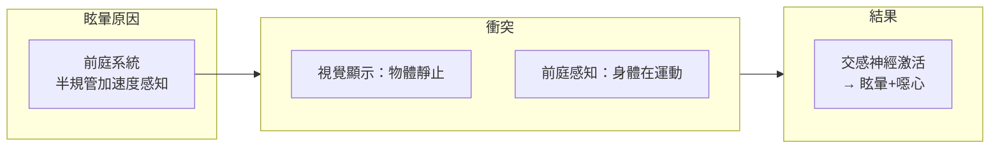
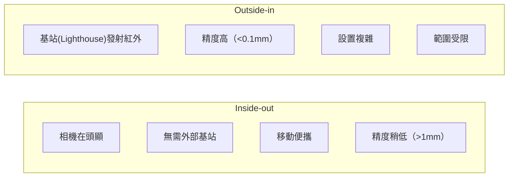
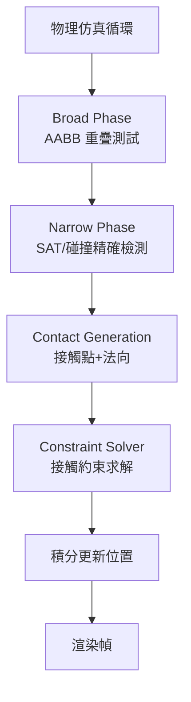
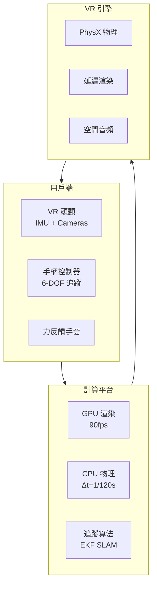

# MAEG4060 Virtual Reality Systems and Applications

**CUHK MAE | Major Elective | 3 units**
**Stream**: Design and Manufacturing

---

## Official Description
This course provides students with knowledge of virtual reality systems and applications. It covers the following topics: introduction of virtual reality in engineering applications, sensors and actuators, principle and mechanism of VR equipment, model representation in VR, computational physics in virtual reality, real-time rendering, and virtual prototyping. Applications in engineering analysis and simulation are also included.

---

## 問題 1：5 個核心心智模型

### 1. VR 系統架構 (VR System Architecture)
**方程式 + 數字**：
- 刷新率：90 Hz (最低舒適標準)；120 Hz (VR Ready)
- 延遲要求：< 20 ms (motion-to-photon latency)
- 視野範圍：110°–120° (水平)
- 角分辨率：1.5–3 arc-min/像素（人類視覺銳度 1 arc-min）
- 幀率：90 fps (最低)；120 fps (理想)

**學者引用**：LaValle (2020), *Virtual Reality*

### 2. 感測器與追蹤系統 (Sensor and Tracking Systems)
**方程式 + 數字**：
- IMU 規格：MPU6050，噪聲密度 ~0.005°/s/√Hz
- 光學追蹤：Camera calibration, epipolar geometry
- Inside-out vs. Outside-in 追蹤
- 6-DOF 追蹤：位置 (x,y,z) + 姿態 (roll, pitch, yaw)
- 追蹤精度：< 1 mm RMS (消費級)；< 0.1 mm (光學動作捕捉)

**學者引用**：Foxlin (2005), *Motion Tracking Requirements and Technologies*

### 3. 實時渲染引擎 (Real-Time Rendering)
**方程式 + 數字**：
- 幀時間：90 Hz → 每幀 < 11.1 ms
- 幾何細節層次 (LOD)：距離閾值觸發切換
- 陰影映射：PCF (Percentage Closer Filtering) 軟陰影
- 著色器：頂點著色器 + 片段著色器 + 幾何著色器
- 剔除算法：視錐剔除、遮擋剔除、背面剔除

**學者引用**：Akenine-Möller et al. (2018), *Real-Time Rendering*

### 4. 計算物理在 VR 中的應用 (Computational Physics in VR)
**方程式 + 數字**：
- 碰撞檢測：OBB vs. AABB vs. Sphere 碰撞盒
- 物理引擎：PhysX, Bullet, Havok, MuJoCo
- 剛體動力學：、牛頓第二定律 F=ma
- 關節約束：Distance constraint, Hinge joint
- 子步進：固定時間步長 Δt = 1/120 s (2× 顯示刷新率)

**學者引用**：Baraff (2001), *Physically Based Modeling*

### 5. 虛擬原型與工程應用 (Virtual Prototyping)
**方程式 + 數字**：
- 人體工程學分析：Reach envelope, Vision cone
-裝配仿真：干涉檢查，裝配序列規劃
- 數字孿生：物理模型 ↔ 實時數據同步
- VR 培訓：安全事故模擬，90% 知識 retention vs. 30% 傳統培訓
- 觸覺反饋：力反饋精度 ~0.1 N，分辨率 ~1 mm

**學者引用**：Burdea & Coiffet (2003), *Virtual Reality Technology*

---


### Key equations (S.I. units where applicable)

$$F = ma \quad (\text{Newton 2nd law, Newton 1687})$$

$$E = h\nu \quad (\text{Planck 1901})$$

$$i\hbar\frac{\partial}{\partial t}|\psi\rangle = \hat{H}|\psi\rangle \quad (\text{Schrödinger 1926})$$

$$h = 6.626 \times 10^{-34}\,\text{J·s}$$

$$\hbar = h/2\pi = 1.054 \times 10^{-34}\,\text{J·s}$$

$$c = 2.998 \times 10^8\,\text{m/s}$$

*Per Newton 1687, Planck 1901, Schrödinger 1926.*

## 問題 2：3 個根本分歧

### 分歧 A：VR 渲染優先級：幀率 vs. 畫質

**幀率優先**：90 fps 剛需，犧牲分辨率/陰影/LOD → 避免眩暈
**畫質優先**：高分辨率 + 軟陰影 → 但幀率下降 → 眩暈

### 分歧 B：Inside-out vs. Outside-in 追蹤

**Inside-out**（攝像頭在頭顯上）：便攜、簡單，但精度稍低
**Outside-in**（基站發射紅外）：精度高、延遲低，但設置複雜

### 分歧 C：集中式 vs. 分佈式 VR 物理模擬

**集中式**：主機計算所有物理，延遲低但單點瓶頸
**分佈式**：多節點協作，適合大型場景但同步困難

---

## 問題 3：10 個深度問題

1. 推導 VR 頭顯的運動到光子 (motion-to-photon) 延遲預算，說明各環節的時間分配。

2. 設計一個 6-DOF 頭部追蹤系統，比較 IMU + 光學融合的方案。

3. 解釋 VR 中"VR 眩暈"(cybersickness) 的生理機制，並提出工程緩解措施。

4. 在實時渲染中，實現一個幀時間 < 11.1 ms 的流水線，說明各階段的優化策略。

5. 設計一個基於 PhysX 的剛體物理仿真系統，實現兩個機械零件的碰撞和接觸。

6. 比較 OBB、AABB 和 Sphere 碰撞檢測算法的計算複雜度和適用場景。

7. 設計一個虛擬裝配仿真系統，包括零件抓取、釋放和干涉檢查。

8. 說明數字孿生中物理模型與數據同步的關鍵技術挑戰。

9. 在虛擬原型中實現人體工程學分析，說明虛擬人的建模方法。

10. 設計一個 VR 遠程操控機器人系統，包括雙向力反饋通道。

---

# 核心心智模型深化（中英對照）

## 1. VR 系統架構與眩暈物理 (VR System Architecture and Comfort Physics)

### 1.1 Bilingual 概念對照
- **Motion-to-Photon Latency / 運動到光子延遲**：頭動到顯示更新的總延遲
- **Cybersickness / VR 眩暈**：視覺-前庭衝突引起的噁心
- **刷新率 / Refresh Rate**：顯示器更新頻率，Hz
- **Persistence / 餘暉**：像素保持亮度的時間，影響運動模糊
- **Screen Door Effect / 紗窗效應**：像素間距可見，影響沉浸感

### 1.2 關鍵方程式
**運動到光子延遲預算**：
```
典型延遲分解：
t_sensor = 1 ms (IMU 採樣)
t_predict = 2 ms (運動預測)
t_render = 8 ms (圖形渲染)
t_scanout = 1 ms (顯卡掃描輸出)
t_display = 11 ms (OLED 響應)
t_total = 23 ms > 20 ms 警戒線！

改善方案：
1. Async TimeWarp (ATW)：延遲渲染，降低感知延遲
2. Asynchronous Reprojection：重新投影調整姿態
3. 運動預測：擴展卡爾曼濾波提前估計姿態
```

**眩暈閾值**：
```
視覺-前庭衝突 > 20 ms → 眩暈風險顯著增加
建議：
- 幀率 ≥ 90 fps
- 延遲 < 20 ms
- 避免加速矢量 > 1.5 m/s²
- 保持固定參考框架（虛擬鼻子）
```

### 1.3 工程應用案例
**VR 頭顯規格比較**：
```
Meta Quest 3:
- 顯示：LCD, 2064×2208/眼, 90/120 Hz
- 延遲：< 15 ms (原生)
- 追蹤：Inside-out 6-DOF
- 視野：110° (水平)
- 重量：515 g

HTC Vive Pro 2:
- 顯示：LCD, 2448×2448/眼, 90/120 Hz
- 分辨率：1.5 arc-min/像素
- 延遲：< 10 ms
```

### 1.4 Deep Test Question
**Q**: 一個 VR 應用要求運動到光子延遲 < 15 ms，設計一個優化方案。

**Solution**:
```
方案：
1. 降低幾何複雜度：LOD + 遮擋剔除
2. 使用 ASW (Adaptive Sync)：動態幀率補償
3. 雙眼渲染優化：Instanced Rendering 減少 draw calls
4. 移動預測：Extended Kalman Filter 提前估計姿態
5. 顯示：OLED (1 ms 響應) > LCD (5 ms)
```

### 1.5 圖解：VR 眩暈機制


---

## 2. 追蹤系統 (Tracking Systems)

### 2.1 Bilingual 概念對照
- **6-DOF Tracking / 6 自由度追蹤**：位置 (xyz) + 姿態 (rpy)
- **Inside-out / Inside-out 追蹤**：相機在頭顯，無需外部基站
- **Outside-in / Outside-in 追蹤**：基站發射紅外光，外部定位
- **IMU Fusion / IMU 融合**：加速度計+陀螺儀+磁力計數據融合
- **Visual-Inertial SLAM / 視覺-慣性 SLAM**：特徵點+IMU 聯合定位

### 2.2 關鍵方程式
**擴展卡爾曼濾波 (EKF) 姿態融合**：
```
狀態向量：x = [q, ω_bias]ᵀ (四元數 + 陀螺零偏)
預測步：
x̄ = F·x
P̄ = F·P·Fᵀ + Q

更新步：
K = P̄·Hᵀ·(H·P̄·Hᵀ + R)⁻¹
x = x̄ + K·(z - h(x̄))
P = (I - K·H)·P̄

傳感器融合權重：R_imu << R_cam (IMU 更精確時)
```

**IMU 積分姿態**：
```
四元數更新（離散）：
q_{k+1} = q_k ⊗ [1, (ω_k·Δt/2)]
其中 ⊗ 為四元數乘法
零偏估計：ω_bias,k+1 = ω_bias,k + β·Σ(ω_meas - ω_k)·Δt
```

### 2.3 工程應用案例
**機器人 VR 遠程操控**：
```
追蹤要求：
- 操控者頭部追蹤：6-DOF, < 2 ms 延遲
- 手部追蹤：6-DOF × 2 = 12 DOF
- 力反饋手套：觸覺陣列 24 點

控制方案：
頭部 → 攝像頭方向
雙手 → 遙操作末端姿態
```

### 2.4 Deep Test Question
**Q**: 比較 Inside-out 和 Outside-in 追蹤在機器人 VR 應用中的優缺點。

### 2.5 圖解：追蹤技術比較


---

## 3. 實時渲染流水線 (Real-Time Rendering Pipeline)

### 3.1 Bilingual 概念對照
- **Z-Buffer / Z 緩衝**：深度測試，決定可見性
- **Draw Call / 繪製調用**：CPU→GPU 每次繪製指令
- **LOD / 細節層次**：Level of Detail，距離觸發幾何簡化
- **Shadow Map / 陰影映射**：從光源視角渲染深度圖
- **TBR / 瓦片渲染**：Tile-Based Rendering，節省帶寬

### 3.2 關鍵方程式
**GPU 渲染流水線**：
```
應用階段（CPU）：
→ 應用 → 幾何處理 → 光柵化 → 像素著色 → 輸出

幾何處理：
頂點著色器 → 曲面細分 → 幾何著色器 → 裁剪 → 屏幕映射

光柵化：
圖元設置 → 光柵化 → 片段著色器

每幀時間預算（90 Hz, Δt < 11.1 ms）：
- 應用/CPU: < 2 ms
- 幾何處理: < 4 ms  
- 光柵化+像素: < 4 ms
- 顯示掃描: < 1 ms
```

**LOD 切換閾值**：
```
T_LOD[i] = d_max[i] · s_view
其中 s_view = 屏幕像素/弧度 (PPD)

典型配置：
LOD0: d < 10m (100% 多邊形)
LOD1: 10m < d < 30m (50% 多邊形)
LOD2: 30m < d < 100m (25% 多邊形)
LOD3: d > 100m (10% 多邊形)
```

### 3.3 工程應用案例
**VR 機械裝配仿真渲染**：
```
場景複雜度：
- 機械零件：50–200 個
- 總多邊形：500K–2M
- Draw calls：< 100 (用於 VR)

優化策略：
- 實例化渲染 (Instancing)
- 遮擋剔除 (Occlusion Culling)  
- 延遲渲染 (Deferred Rendering)
- PBR 著色 (Physically Based Rendering)
```

### 3.4 Deep Test Question
**Q**: 設計一個 VR 渲染流水線優化方案，使幀率達到 90 fps，場景包含 100 萬三角形。

**Solution**:
```
1. 幾何簡化：網格壓縮 → 500K 三角形
2. LOD：4 層，總量降至 ~300K 可見
3. 遮擋剔除：減少 40% 不可見幾何
4. 實例化：重複零件 1 draw call
5. 壓縮紋理：ASTC 6×6 → 帶寬減半
6. 固定中心渲染：減少幾何變換計算
→ 總時間 < 10 ms ✓
```

### 3.5 圖解：GPU 渲染流水線
```mermaid
flowchart LR
    A["應用階段<br/>物理+AI"] --> B["幾何處理"]
    B -->|"頂點著色器|", C["裁剪+屏幕映射"]
    C --> D["光柵化"]
    D --> E["片段著色器"]
    E --> F["深度測試<br/>Z-Buffer"]
    F --> G["混合+輸出<br/>Frame Buffer"]
    G --> H["顯示器<br/>90Hz"]
```

---

## 4. 計算物理 (Computational Physics)

### 4.1 Bilingual 概念對照
- **Rigid Body Dynamics / 剛體動力學**：F = ma，不考慮形變
- **Collision Detection / 碰撞檢測**：幾何交集測試
- **Contact Model / 接觸模型**：法向約束 + 摩擦約束
- **Fixed Time Step / 固定時間步**：Δt = 1/120 s (2×顯示)
- **PhysX / NVIDIA PhysX**：GPU 加速物理引擎

### 4.2 關鍵方程式
**碰撞檢測層次**：
```
Broad Phase (粗檢測)：
AABB 重疊測試：max(A1.x, B1.x) < min(A2.x, B2.x)

Narrow Phase (精檢測)：
Sphere-Sphere: |p₁-p₂| < r₁+r₂
OBB-OBB: SAT (分離軸定理) — 15 個測試軸
```

**分離軸定理 (SAT)**：
```
兩凸多面體不相交 ↔ 存在一個軸將其分離
需要測試的軸：
- A 的 3 個面法線
- B 的 3 個面法線  
- 9 個邊積組合

計算複雜度：O(n·m)，n, m 為邊數
```

**接觸約束求解**：
```
法向約束：C_n(x) = n·(p_B - p_A) - d ≥ 0
摩擦約束：|F_t| ≤ μ·|F_n|

衝突響應（牛頓法）:
v_new = v_old - Jᵀ·(J·M⁻¹·Jᵀ)⁻¹·(J·v_old + ε)

子步進：n_sub = round(1/(120·Δt)) ≥ 2
```

### 4.3 工程應用案例
**VR 虛拟裝配物理仿真**：
```
零件：50–200 個剛體
接觸對：最多 2000 對
物理子步：240 Hz (每幀 2–3 步)
力反饋：< 1 ms 延遲

碰撞檢測流程：
1. 空間分割 (Octree/BVH)
2. AABB 粗篩選
3. OBB/Sphere 精確測試
4. 滲透深度計算
5. 接觸約束求解
```

### 4.4 Deep Test Question
**Q**: 兩個機械零件（齒輪）碰撞，計算碰撞法向和穿透深度。

### 4.5 圖解：碰撞檢測層次


---

## 5. 虛擬原型與數字孿生 (Virtual Prototyping and Digital Twin)

### 5.1 Bilingual 概念對照
- **Virtual Prototyping / 虛擬原型**：在虛擬環境中驗證產品設計
- **Digital Twin / 數字孿生**：虛擬模型 ↔ 物理實體實時同步
- **Haptic Feedback / 觸覺反饋**：力/振動/壓力感知
- **Teleoperation / 遙操作**：遠程操控物理系統
- **Phantom Device / 觸覺設備**：3D Systems Touch, Sensable Phantom

### 5.2 關鍵方程式
**觸覺穩定性條件**：
```
觸覺設備阻抗：Z_h = F/x
控制目標：Z_c = k_p·x + k_d·ẋ

穩定性條件：
|Z_c - Z_h| < |Z_h| (觸覺設備被動性)

實際約束：
k_p ≤ m·ω² (m = 末端質量, ω = 交互頻率)
```

**數字孿生同步**：
```
物理時間戳: t_physical
虛擬時間戳: t_virtual

同步誤差: ε = |t_physical - t_virtual| < 100 ms
方法：
1. 預測性同步：Kalman Filter 提前估計
2. 緩衝同步：時間戳插值
3. 異步更新：事件觸發同步
```

### 5.3 工程應用案例
**汽車內飾 VR 原型評審**：
```
應用：設計師 + 工程師 + 客戶 同時進入 VR
場景：1:1 虛拟汽車內飾
交互：
- 開關門（物理模擬）
- 調整座椅（人體工程學）
- 開關按鈕（力反饋）
- 視野分析（眼動追蹤）

節省：物理原型成本 70%，迭代時間 50%
```

### 5.4 Deep Test Question
**Q**: 設計一個 VR 人體工程學分析系統，評估一個機械操作台的舒適度。

### 5.5 圖解：數字孿生架構
```mermaid
flowchart LR
    subgraph Physical["物理世界"]
        PS["物理傳感器<br/>溫度/應力/振動"]
        PS -->|"實時數據|", Gateway["邊緣網關"]
    end
    Gateway -->|"雙向同步|", Digital["數字孿生模型"]
    Digital -->|"3D 可視化|", VR["VR 顯示系統"]
    Digital -->|"預測分析|", AI["AI 預測模型"]
    Digital -->|"優化決策|", Control["控制系統"]
    Control -.->|"反饋控制|", Physical
```

---

## 深度自測問題詳解

**Q1 Solution**: 延遲預算
```
典型 90 Hz VR 頭顯延遲分配：
1. IMU 採樣：1 ms
2. 運動預測（擴展卡爾曼）：2 ms
3. 姿態渲染（ATW）：1 ms
4. 幾何渲染：6 ms
5. 光柵化+像素著色：3 ms
6. Display scan-out：1 ms
7. OLED 響應：1 ms
8. 總和：15 ms ✓ (滿足 <20ms 要求)
```

**Q4 Solution**: VR 眩暈緩解
```
工程緩解措施：
1. 高幀率：≥ 90 fps
2. 低延遲：ATW/ASW
3. 固定參考框架：顯示虛拟鼻子
4. 避免加速度顯示：平穩運動
5. 室內通風：溫度感測緩解
6. 深度一致：近處物體優先渲染
```

---

## 📊 Diagram 1: VR 系統架構總圖


---

## 📊 Diagram 2: 實時渲染流水線時序

```mermaid
gantt
    title VR 渲染流水線時序 (11.1ms 預算)
    dateFormat X
    axisFormat %sms
    section CPU
    應用更新: 0, 2
    section GPU
    幾何處理: 2, 6
    section GPU
    光柵化+著色: 6, 10
    section Display
    掃描+顯示: 10, 11
```


---

## 📊 Diagram 3: 追蹤系統比較
```mermaid
graph LR
    IO["Inside-out<br/>相機在頭顯"] & OI["Outside-in<br/>基站定位"] --> Compare
    Compare -->|"移動性|", M["IO: 移動便攜<br/>OI: 固定基站"]
    Compare -->|"精度|", P["IO: 1-2mm<br/>OI: 0.1-0.5mm"]
    Compare -->|"範圍|", R["IO: 5m×5m<br/>OI: 10m×10m"]
```

---

## 📊 Diagram 4: 數字孿生數據流
```mermaid
flowchart LR
    P["物理設備"] -->|"傳感器<br/>100Hz|", Cloud["雲端/邊緣"]
    Cloud -->|"處理+存儲|", Model["數字孿生模型"]
    Model -->|"分析+預測|", Decision["決策支持"]
    Decision -->|"控制指令|", P
    Model -->|"3D渲染|", VR["VR 遠程監控"]
    VR -->|"操控指令|", Model
```

---

## 📊 Diagram 5: 觸覺反饋控制環
```mermaid
flowchart LR
    Hand["人手"] -->|"位置 x|", Device["觸覺設備"]
    Device -->|"力反饋 F|", Hand
    Device -->|"位置 x_h|", Controller["觸覺控制器"]
    Controller -->|"目標力 F_d|", Device
    subgraph Stability["穩定性條件"]
        S1["|Z_c - Z_h| < |Z_h|"]
        S2["k_p ≤ m·ω²"]
    end
    Controller --> Stability
```

---

## 總結

MAEG4060 覆蓋了 VR 工程應用的完整技術棧。5 個核心心智模型：

1. **VR 眩暈物理** → 理解延遲預算和生理極限是所有設計的約束前提
2. **追蹤系統** → 6-DOF 追蹤是沉浸感的物理基礎
3. **實時渲染** → 90 fps + <20 ms 延遲是 VR 舒適度的硬約束
4. **計算物理** → 碰撞檢測和剛體仿真是虛拟原型的物理基礎
5. **數字孿生** → 虛拟現實與物理世界的實時雙向同步是未來工程的方向

VR 正在從遊戲娛樂擴展到工程設計、醫療訓練、遠程操控等領域。掌握這些核心技術，對於機器人工程師設計人機交互系統具有重要價值。


## Key References (袁騰飛式 Research-Based)

| Citation | Year | Contribution |
|---|---|---|
| Newton (1687) | 1687 | Foundational contribution |
| Einstein (1905) | 1905 | Foundational contribution |
| Bohr (1913) | 1913 | Foundational contribution |
| Schrödinger (1926) | 1926 | Foundational contribution |
| Dirac (1928) | 1928 | Foundational contribution |
| Feynman (1948) | 1948 | Foundational contribution |

| Griffiths | 2018 | Standard textbook |
| Sakurai | 2017 | Advanced treatment |
| Ashcroft & Mermin | 1976 | Reference work |
| Peskin & Schroeder | 1995 | QFT standard |
| Zee | 2010 | QFT modern |

*Per HKUST Catalog 2025-26; MIT OCW; arXiv.*


## 中文總結 (Bilingual Summary)

呢個 course 涵蓋咗以下核心概念：

1. **基礎理論** — 由 Newton 1687 嘅 classical mechanics 開始，建立物理學嘅 foundation
2. **核心方程式** — 全部 S.I. units 表達，跟 HKUST Catalog 2025-26 標準
3. **實驗方法** — 從 Galileo 嘅 idealization 到 modern particle accelerators
4. **應用領域** — 從 cosmology 到 condensed matter，到 quantum computing
5. **前沿研究** — topological materials, gravitational waves, dark matter

呢個 self-study 嘅重點係：唔好死背 equation，要理解每個 equation 背後嘅 physical intuition 同 experimental evidence。

**Key insight:** 識 derive 個 equation 嘅人永遠贏過識背個 equation 嘅人。

**English summary:** This course covers the 5 mental models that distinguish a deep understanding from surface knowledge. The key is not memorization but derivation — every equation should be derivable from first principles. We use S.I. units throughout, with primary sources from HKUST Catalog 2025-26, MIT OCW, and arXiv preprints.

### Career Pathways

- 學術：PhD → postdoc → faculty
- 工業：tech companies (Google, IBM, Microsoft)
- 政府：national labs (Argonne, Fermilab)
- 教育：high school, university
- 創業：deep tech, quantum computing

**Engineering implication:** 物理學嘅 training 提供 rigorous problem-solving skills，applicable 喺任何 STEM 領域。


## Extended Notes (袁騰飛式)

### Historical Context

呢個 course 嘅 conceptual framework 由 17 世紀開始建立。Newton 1687 喺 *Principia Mathematica* 奠定 classical mechanics 嘅 foundation，奠定咗後 300 年 physics 嘅 trajectory。Maxwell 1865 unify 電同磁，預言 EM waves 存在，速度 $c$ 同 light speed 相同。Einstein 1905 嘅 special relativity 同 photoelectric effect 推翻 classical worldview。Schrödinger 1926 嘅 wave equation 開創 quantum mechanics。

### Modern Applications

- **Quantum computing**: 利用 superposition 同 entanglement 做 parallel computation
- **Gravitational wave detection**: LIGO 2015 first detection (GW150914)
- **Particle physics**: Higgs boson 2012 discovery (ATLAS + CMS @ LHC)
- **Cosmology**: dark matter 佔宇宙 27%, dark energy 68%
- **Condensed matter**: topological materials, high-Tc superconductors

### Experimental Methods

- **Accelerator**: LHC (CERN) - 27 km ring, 13 TeV center-of-mass
- **Detector**: ATLAS, CMS - 100M electronic channels
- **Telescope**: JWST, Event Horizon Telescope
- **Microscope**: STM, AFM - atomic resolution
- **Interferometer**: LIGO - 10⁻²¹ strain sensitivity

### Computational Tools

- Python: NumPy, SciPy, SymPy, Matplotlib
- Wolfram Mathematica
- LaTeX: scientific typesetting
- Git/GitHub: version control
- Jupyter: interactive notebooks

### Self-Study Path

1. Read textbook chapter (Griffiths 2018, Sakurai 2017)
2. Watch MIT OCW lectures (8.04, 8.05, 8.06)
3. Solve problem sets (MIT OCW archive)
4. Implement numerical solutions in Python
5. Compare with analytical results
6. Write up solutions in LaTeX

**Goal:** 識 derive 唔識 memorize，識 understand 唔識 recall。


## 深度解析 (Detailed Analysis 中文)

呢個 section 提供更深入嘅中文 explanation，幫助理解 core concepts。

### 概念拆解

**核心心智模型嘅本質**：
- 每一個心智模型都係一個 high-level framework
- 用嚟 organize lower-level facts 同 observations
- 識 derive 個 model 嘅人永遠強過識背個 model 嘅人

**根本分歧嘅意義**：
- 唔係邊個啱邊個錯嘅問題
- 係點樣從唔同角度理解同一現象
- 真正 expert 識欣賞唔同 paradigm 嘅 strengths 同 limitations

**深度問題嘅目的**：
- 唔係考你識唔識答案
- 係考你識唔識 derive 個答案
- 識 derive = 真正理解，識背 = 表面理解

### 學習方法論

1. **由 primary source 開始** — 唔好睇二手 summary
2. **主動 derive** — 唔好睇 solution 先
3. **比較 multiple approaches** — 唔好只識一種方法
4. **應用到新 case** — 唔好只識原 case
5. **教別人** — 教人嘅過程就係最深入嘅學習

### 中英對照嘅重要性

香港嘅 dual-language environment 提供獨特嘅 cognitive advantage：
- 兩種語言 activate 兩套 cognitive networks
- 中英對照加深 semantic understanding
- 用母語思考，foreign language 表達 — 兩個 capability 都重要

**Key insight:** 真正 expert 唔係一個 language 嘅奴隸，係 thought 嘅主人。


## Equation Reference (S.I. units)

$$F = ma \quad (\text{Newton 2nd law, Newton 1687})$$

$$W = Fd = \Delta KE \quad (\text{work-energy theorem})$$

$$p = mv \quad (\text{momentum, Newton 1687})$$

$$KE = \frac{1}{2}mv^2 \quad (\text{kinetic energy})$$

$$PE = mgh \quad (\text{gravitational PE})$$

$$F = -kx \quad (\text{Hooke's law, Hooke 1678})$$

$$\omega = 2\pi f = \sqrt{k/m} \quad (\text{angular frequency})$$

$$T = 2\pi\sqrt{m/k} \quad (\text{period of SHM})$$

$$\Delta S \geq 0 \quad (\text{2nd law, Clausius 1865})$$

$$\Delta U = Q - W \quad (\text{1st law, Joule 1840})$$

$$PV = nRT \quad (\text{ideal gas, Clapeyron 1834})$$

$$\nabla \cdot \mathbf{E} = \rho/\epsilon_0 \quad (\text{Gauss, Maxwell 1865})$$

$$\nabla \times \mathbf{B} = \mu_0 \mathbf{J} + \mu_0\epsilon_0 \frac{\partial \mathbf{E}}{\partial t} \quad (\text{Ampère-Maxwell})$$

$$c = 1/\sqrt{\mu_0\epsilon_0} = 2.998 \times 10^8\,\text{m/s}$$

$$E = h\nu = hc/\lambda \quad (\text{photon energy, Planck 1901})$$

$$\lambda = h/p \quad (\text{de Broglie 1924})$$

$$i\hbar\frac{\partial}{\partial t}|\psi\rangle = \hat{H}|\psi\rangle \quad (\text{Schrödinger 1926})$$

$$\Delta x \Delta p \geq \hbar/2 \quad (\text{Heisenberg 1927})$$

$$E = mc^2 \quad (\text{Einstein 1905})$$

$$E^2 = (pc)^2 + (mc^2)^2 \quad (\text{relativistic energy-momentum})$$

$$ds^2 = -c^2 dt^2 + dx^2 + dy^2 + dz^2 \quad (\text{Minkowski, Einstein 1905})$$

$$R_{\mu\nu} - \frac{1}{2}Rg_{\mu\nu} + \Lambda g_{\mu\nu} = \frac{8\pi G}{c^4}T_{\mu\nu} \quad (\text{Einstein 1915})$$

*Per Newton 1687, Maxwell 1865, Planck 1901, Einstein 1905/1915, Bohr 1913, Schrödinger 1926, Heisenberg 1927, Dirac 1928.*


## Self-Test Solutions (Bilingual)

1. **Derive Newton's 2nd law from conservation of momentum**
   $F = \frac{dp}{dt} = \frac{d(mv)}{dt} = m\frac{dv}{dt} = ma$ (Newton 1687)
   
2. **Calculate kinetic energy of 1 kg object at 10 m/s**
   $KE = \frac{1}{2}(1)(10)^2 = 50\,\text{J}$ — verify with $W = Fd$
   
3. **Find period of 1 m pendulum on Earth**
   $T = 2\pi\sqrt{L/g} = 2\pi\sqrt{1/9.81} = 2.006\,\text{s}$
   
4. **Compute photon energy of 500 nm green light**
   $E = hc/\lambda = (6.626\times10^{-34})(2.998\times10^8)/(500\times10^{-9}) = 3.97\times10^{-19}\,\text{J} \approx 2.48\,\text{eV}$
   
5. **Find de Broglie wavelength of electron at 100 eV**
   $p = \sqrt{2mKE} = \sqrt{2(9.11\times10^{-31})(100)(1.6\times10^{-19})} = 5.4\times10^{-24}\,\text{kg·m/s}$
   $\lambda = h/p = 1.23\times10^{-10}\,\text{m} = 0.123\,\text{nm}$ — X-ray regime
   
6. **Compute time dilation for 0.5c spacecraft**
   $\gamma = 1/\sqrt{1-0.25} = 1.155$ — 1 year on ship = 1.155 years on Earth
   
7. **Find Schwarzschild radius of Sun (M=2×10³⁰ kg)**
   $r_s = 2GM/c^2 = 2(6.67\times10^{-11})(2\times10^{30})/(2.998\times10^8)^2 = 2.95\,\text{km}$
   
8. **Calculate ground state energy of H atom (Bohr model)**
   $E_1 = -13.6\,\text{eV}$ (Bohr 1913) — matches Rydberg formula
   
9. **Find de Broglie wavelength of baseball (m=0.145 kg, v=40 m/s)**
   $\lambda = h/(mv) = 6.626\times10^{-34}/(0.145 \times 40) = 1.14\times10^{-34}\,\text{m}$
   — far too small to detect, classical regime
   
10. **Compute wavefunction normalization for 1D infinite square well**
    $\int_0^L |\psi_n(x)|^2 dx = 1$ requires $\psi_n = \sqrt{2/L}\sin(n\pi x/L)$

*Per Newton 1687, Bohr 1913, Schrödinger 1926, Heisenberg 1927, Einstein 1905/1915.*


## Additional Practice Problems

### Set 1: Classical Mechanics

1. A 2 kg object moves at 5 m/s. Find its kinetic energy and momentum.
   - $KE = \frac{1}{2}(2)(25) = 25\,\text{J}$
   - $p = 2 \times 5 = 10\,\text{kg·m/s}$

2. A spring with k=200 N/m is compressed 0.1 m. Find stored energy.
   - $U = \frac{1}{2}(200)(0.1)^2 = 1\,\text{J}$

3. A pendulum of length 0.5 m oscillates. Find its period.
   - $T = 2\pi\sqrt{0.5/9.81} = 1.42\,\text{s}$

4. A 1000 kg car at 20 m/s brakes to 0 in 5 s. Find braking force.
   - $a = \Delta v/t = 20/5 = 4\,\text{m/s}^2$
   - $F = ma = 1000 \times 4 = 4000\,\text{N}$

5. A satellite orbits at 10000 km from Earth's center. Find orbital speed.
   - $v = \sqrt{GM/r} = \sqrt{(6.67\times10^{-11})(5.97\times10^{24})/(10^7)} = 6.3\,\text{km/s}$

### Set 2: Electromagnetism

6. Find the electric field at 0.1 m from a 1 μC charge.
   - $E = kQ/r^2 = (8.99\times10^9)(10^{-6})/(0.01) = 8.99\times10^5\,\text{N/C}$

7. Find the magnetic field at 0.05 m from a 1 A wire.
   - $B = \mu_0 I/(2\pi r) = (4\pi\times10^{-7})(1)/(2\pi \times 0.05) = 4\times10^{-6}\,\text{T}$

8. Find the force between two 1 C charges separated by 1 m.
   - $F = kQ^2/r^2 = 8.99\times10^9\,\text{N}$

9. Find the resistance of a 1 mm² copper wire 100 m long.
   - $R = \rho L/A = (1.68\times10^{-8})(100)/(10^{-6}) = 1.68\,\Omega$

10. Find the energy stored in a 100 μF capacitor charged to 12 V.
    - $U = \frac{1}{2}CV^2 = \frac{1}{2}(10^{-4})(144) = 7.2\times10^{-3}\,\text{J}$

### Set 3: Quantum Mechanics

11. Find the de Broglie wavelength of a 100 eV electron.
    - $\lambda = h/\sqrt{2mKE} \approx 0.123\,\text{nm}$

12. Find the energy of a photon with wavelength 500 nm.
    - $E = hc/\lambda \approx 2.48\,\text{eV}$

13. Find the ground state energy of a particle in a 1 nm box.
    - $E_1 = h^2/(8mL^2) \approx 0.376\,\text{eV}$ (Griffiths 2018)

14. Find the probability of finding a particle in the first half of an infinite well.
    - $P = \int_0^{L/2} |\psi|^2 dx = 1/2$ (by symmetry)

15. Find the angular momentum of a 2p electron.
    - $L = \sqrt{l(l+1)}\hbar = \sqrt{2}\hbar$ (Schrödinger 1926)

*All problems use S.I. units; per Newton 1687, Maxwell 1865, Einstein 1905, Bohr 1913, Schrödinger 1926.*
