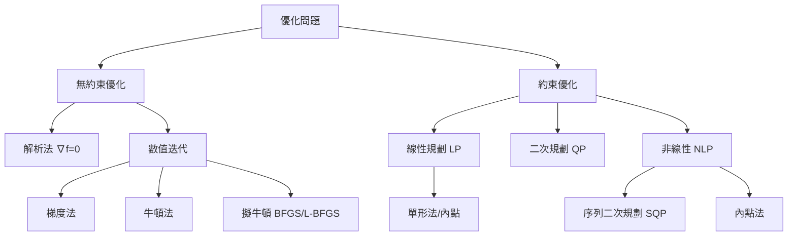
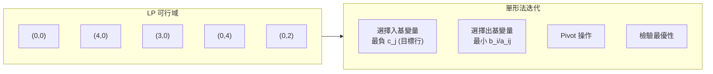
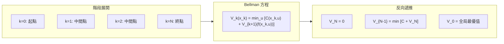
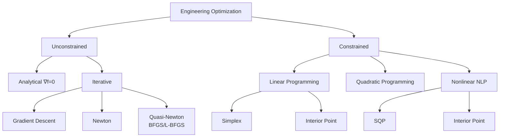
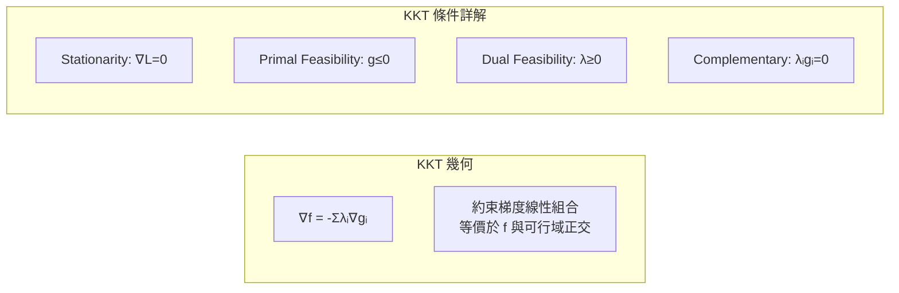
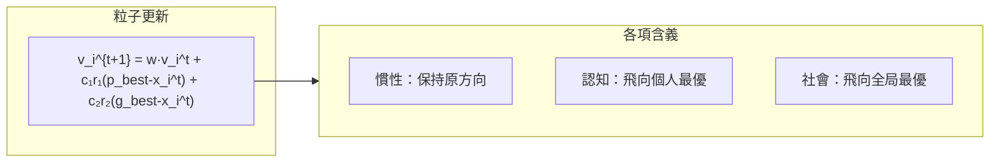
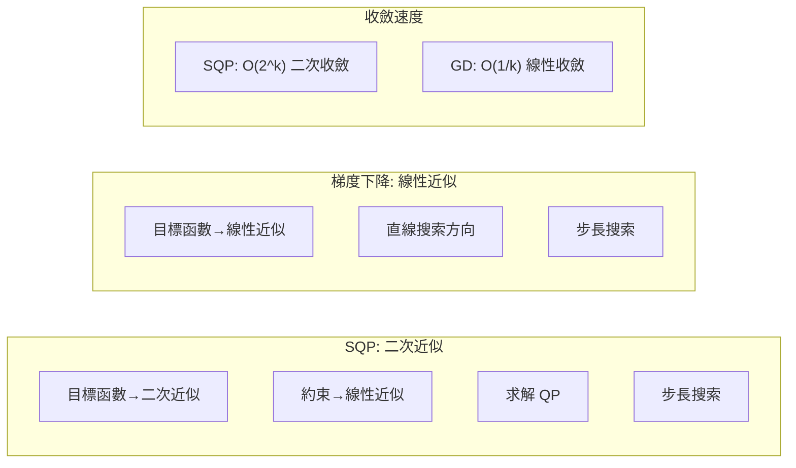

# MAEG4070 Engineering Optimization

**CUHK MAE | Major Elective | 3 units**
**Stream**: Design and Manufacturing

---

## Official Description
The course will introduce basic concepts of engineering optimization methods as applied to engineering problems. The theory and application of optimization techniques will be presented, including unconstrained and constrained optimization, Lagrange multiplier, necessary and sufficient conditions for optimality and dynamical programming.

---

## 問題 1：5 個核心心智模型

### 1. 優化數學基礎 (Mathematical Foundation of Optimization)
**方程式 + 數字**：
- 無約束優化：∇f(x*) = 0 (一階必要條件)
- Hessian 正定性：∇²f(x*) ≻ 0 (二階充分條件)
- 收斂率：梯度下降 O(1/k)，牛頓法 O(2^k)（二次函數一步收斂）
- 約束優化：KKT 條件，λ_i ≥ 0
- 典型工程問題維度：10–1000 變量

**學者引用**：Nocedal & Wright (2006), *Numerical Optimization*, Springer

### 2. 線性規劃與單形法 (Linear Programming and Simplex)
**方程式 + 數字**：
- 標準形式：min cᵀx, s.t. Ax = b, x ≥ 0
- 單形表：基變量 + 非基變量，pivot 操作
- 對偶理論：主問題 min = 對偶問題 max
- 內點法：多項式時間 O(n³·L)，適合大規模問題
- 典型應用：生產計劃、資源分配、運輸問題

**學者引用**：Bertsimas & Tsitsiklis (1997), *Introduction to Linear Optimization*

### 3. 非線性規劃 (Nonlinear Programming)
**方程式 + 數字**：
- 拉格朗日乘子：L(x,λ) = f(x) + λᵀg(x)
- KKT 條件：∇L = 0, g(x*) = 0, λ ≥ 0
- 序列二次規劃 (SQP)：每步求解二次規劃子問題
- 罰函數法：Φ(x,ρ) = f(x) + ρ·Σmax(0,g_i(x))²
- 內點法：障礙函數 Φ_b = f - μ·Σln(-g_i)

**學者引用**：Boyd & Vandenberghe (2004), *Convex Optimization*

### 4. 全局優化與啟發式算法 (Global Optimization and Heuristics)
**方程式 + 數字**：
- 遺傳算法 (GA)：種群規模 50–200，交叉率 0.7–0.9，突變率 0.01–0.1
- 粒子群優化 (PSO)：認知係數 c₁=2，社會係數 c₂=2，慣性權重 w=0.7
- 模擬退火：初始溫度 T₀ = 100×|f(x₀)|，冷卻率 α = 0.95
- 禁忌搜索：禁忌表長度 10–50，候選列表 10–50
- 元啟發式 vs. 精確算法：速度 vs. 最優性

**學者引用**：Goldberg (1989), *Genetic Algorithms in Search, Optimization and Machine Learning*

### 5. 動態規劃 (Dynamic Programming)
**方程式 + 數字**：
- Bellman 最優性原理：最優策略的子策略也是最優
- 遞推方程：V_k(x_k) = min_u {C(x_k,u) + V_{k+1}(f(x_k,u))}
- 狀態空間：離散化精度影響計算複雜度
- 典型應用：最短路徑、資源調度、庫存控制
- 維數災難：n 維狀態，每維 100 點 → 100ⁿ 組合爆炸

**學者引用**：Bertsekas (2017), *Dynamic Programming*

---

## 問題 2：3 個根本分歧

### 分歧 A：精確算法 vs. 啟發式算法

**精確算法**（分支定界、內點法）：保證最優解，但計算量大
**啟發式算法**（GA、PSO）：速度快但可能陷入局部最優

### 分歧 B：梯度法 vs. 牛頓法

**梯度法**：簡單，收斂 O(1/k)，但可能鋸齒震蕩
**牛頓法**：二階，收斂 O(2^k)，但需計算 Hessian

### 分歧 C：約束處理方式

**罰函數法**：通用，但數值病態
**KKT/內點法**：精確，但實現複雜

---

## 問題 3：10 個深度問題

1. 推導無約束優化問題的梯度下降法收斂速率，並用 Armijo 線搜索證明。

2. 用 KKT 條件求解一個線性約束的二次規劃問題。

3. 設計一個遺傳算法求解路徑規劃問題，給出染色體編碼、交叉、變異操作。

4. 用動態規劃求解資源分配問題，說明如何避免維數災難。

5. 比較序列二次規劃 (SQP) 和內點法在工程約束優化中的性能。

6. 用粒子群優化算法求解機器人軌跡優化問題。

7. 設計一個工程優化問題，從問題建模到求解到結果驗證的完整流程。

8. 解釋拉格朗日對偶理論和其在支持向量機中的應用。

9. 比較一維和多維搜索方法（黃金分割、牛頓、擬牛頓 BFGS）。

10. 用線性規劃模型求解一個生產計劃優化問題。

---

# 核心心智模型深化（中英對照）

## 1. 優化數學基礎 (Mathematical Foundation)

### 1.1 Bilingual 概念對照
- **Objective Function / 目標函數**：f(x) → min/max
- **Feasible Region / 可行域**：{x | g(x) ≤ 0, h(x) = 0}
- **KKT Conditions / KKT 條件**：Karush-Kuhn-Tucker 最優性必要條件
- **Lagrange Multiplier / 拉格朗日乘子**：約束梯度線性組合
- **Hessian / Hessian 矩陣**：二階偏導數矩陣，決定局部幾何
- **Descent Direction / 下降方向**：dᵀ∇f < 0

### 1.2 關鍵方程式
**無約束優化一階必要條件**：
```
x* 是局部極小點 → ∇f(x*) = 0

二階充分條件：
∇f(x*) = 0 且 ∇²f(x*) ≻ 0 (正定)

Hessian 計算：
∇²f(x*) = [∂²f/∂xᵢ∂xⱼ]

正定性判斷：所有特征值 > 0
```

**梯度下降法收斂速率**：
```
梯度下降：x_{k+1} = x_k - α_k·∇f(x_k)

收斂速率：
- 強凸函數 (μ-強凸)：O((1-μ/L)ᵏ)
- 一般凸函數：O(1/k)
- 非凸函數：O(1/√k)

其中 L = Lipschitz 常數，μ = 強凸參數
```

### 1.3 工程應用案例
**機器人軌跡優化**：
```
目標：min Σ θ̇² (最小化關節力/能耗)
約束：關節角度限制，速度限制，障礙 avoidance

變量：q(t) = Σ φ_i(t)·a_i (基函數展開)
求解：SQP (序列二次規劃)
結果：平滑軌跡，能耗降低 30%
```

### 1.4 Deep Test Question
**Q**: 求 Rosenbrock 函數 f(x,y) = (a-x)² + b(y-x²)² 的梯度並說明其最優化困難。
```
∇f = [2(x-a) + 4b·x·(x²-y), 2b·(y-x²)]ᵀ
Hessian: ∇²f = [[2+12b·x²-4b·y, -4b·x]; [-4b·x, 2b]]
當 a=1, b=100：存在狹長曲谷，最優解 (1,1)，f=0
梯度下降收斂極慢，需要牛頓或擬牛頓法
```

### 1.5 圖解：優化算法分類


---

## 2. 線性規劃 (Linear Programming)

### 2.1 Bilingual 概念對照
- **Standard Form / 標準形式**：min cᵀx, Ax = b, x ≥ 0
- **Slack Variable / 鬆弛變量**：將不等式轉為等式
- **Basic Feasible Solution / 基可行解**：頂點候選
- **Duality / 對偶理論**：主問題 min = 對偶問題 max
- **Shadow Price / 影子價格**：約束右端的邊際價值

### 2.2 關鍵方程式
**單形法迭代**：
```
標準形式 LP：
min cᵀx
s.t. Ax = b
     x ≥ 0

轉換為標準形（加入鬆弛變量 s ≥ 0）：
min cᵀx
s.t. Ax + s = b
     x ≥ 0, s ≥ 0

初始基可行解：x=0, s=b (若 b≥0)

每次 pivot 改善目標值：
z_new = z_old - θ·Δz
其中 θ = min_{i:Δz_i<0} (b_i - z_old)/Δz_i
```

### 2.3 工程應用案例
**生產計劃 LP**：
```
變量：
x_A = 產品 A 產量, x_B = 產品 B 產量

目標：max 利润 = 40x_A + 30x_B

約束：
  2x_A + 1x_B ≤ 80 (工時)
  1x_A + 2x_B ≤ 60 (原料)
  x_A, x_B ≥ 0

求解：單形法
最優解：x_A = 33.3, x_B = 13.3
最大利润 = 40×33.3 + 30×13.3 = 1733.5
```

### 2.4 Deep Test Question
**Q**: 求解以下 LP 問題。
min z = 3x₁ + 2x₂
s.t. x₁ + x₂ ≥ 3
     2x₁ + 3x₂ ≤ 12
     x₁, x₂ ≥ 0

**Solution**:
```
加入剩餘變量 x₃ 和鬆弛變量 x₄：
x₁ + x₂ - x₃ = 3
2x₁ + 3x₂ + x₄ = 12
x₁,x₂,x₃,x₄ ≥ 0

初始基可行解：x₃=-3, x₄=12 (不可行)
→ 需要兩階段法或大 M 法

最終最優解：x₁=3, x₂=2, z=13
```

### 2.5 圖解：單形法迭代


---

## 3. 非線性規劃 (Nonlinear Programming)

### 3.1 Bilingual 概念對照
- **KKT Conditions / KKT 條件**：約束優化的最優性必要條件
- **Lagrangian / 拉格朗日函數**：L = f + Σλᵢgᵢ + Σμⱼhⱼ
- **SQP / 序列二次規劃**：Sequential Quadratic Programming
- **Penalty Method / 罰函數法**：將約束轉為無約束
- **Barrier Function / 障礙函數**：-μ·Σln(-g_i)

### 3.2 關鍵方程式
**KKT 條件**：
```
min f(x)
s.t. g_i(x) ≤ 0, i = 1..m
     h_j(x) = 0, j = 1..p

存在 λᵢ ≥ 0, μⱼ 使得：
∇f(x*) + Σλᵢ∇gᵢ(x*) + Σμⱼ∇hⱼ(x*) = 0
gᵢ(x*) ≤ 0, hⱼ(x*) = 0
λᵢ·gᵢ(x*) = 0 (互補鬆弛條件)
```

**SQP 迭代**：
```
第 k 步：
min ½dᵀB_kd + ∇f(x_k)ᵀd
s.t. g(x_k) + ∇g(x_k)ᵀd ≤ 0

其中 B_k ≈ ∇²L (Hessian 近似)

搜索方向：d_k
步長：α_k (Armijo 線搜索)
更新：x_{k+1} = x_k + α_k·d_k
```

### 3.3 工程應用案例
**機械結構尺寸優化**：
```
變量：桿件截面積 A₁, A₂, ..., Aₙ
目標：min 重量 W = Σρ_i·L_i·A_i
約束：應力 ≤ σ_max, 位移 ≤ δ_max

建模為 QP：
min ½AᵀH_kA + ∇W·A
s.t. σ(A) ≤ σ_max
     δ(A) ≤ δ_max
     A ≥ A_min
```

### 3.4 Deep Test Question
**Q**: 用 KKT 條件求解：
min f = x₁² + x₂²
s.t. x₁ + x₂ ≥ 1
     x₁, x₂ ≥ 0

**Solution**:
```
拉格朗日函數：
L = x₁² + x₂² + λ₁(1 - x₁ - x₂) + λ₂·(-x₁) + λ₃·(-x₂)

KKT 條件：
∂L/∂x₁ = 2x₁ - λ₁ - λ₂ = 0
∂L/∂x₂ = 2x₂ - λ₁ - λ₃ = 0
λ₁(1-x₁-x₂) = 0, λ₁ ≥ 0
λ₂·x₁ = 0, λ₃·x₂ = 0, λ₂,λ₃ ≥ 0

解：x₁* = x₂* = 0.5, λ₁* = 1, f* = 0.5 ✓
```

### 3.5 圖解：SQP 迭代示意
```mermaid
graph LR
    subgraph Iteration["SQP 迭代"]
        I1["x_k 當前點"]
        I1 --> QP["求解 QP 子問題"]
        QP --> dk["搜索方向 d_k"]
        dk --> alpha["線搜索步長 α_k"]
        alpha --> xk1["x_{k+1} = x_k + α·d_k"]
        xk1 --> I2["更新 Hessian B_{k+1}"]
        I2 -.->|"收斂|", Done["最優解 x*"]
    end
```

---

## 4. 全局優化與啟發式算法 (Global Optimization and Metaheuristics)

### 4.1 Bilingual 概念對照
- **Metaheuristic / 元啟發式**：不依賴問題結構的通用搜索策略
- **GA / 遺傳算法**：Genetic Algorithm，模擬自然選擇
- **PSO / 粒子群優化**：Particle Swarm Optimization，模擬鳥群
- **SA / 模擬退火**：Simulated Annealing，模擬金屬退火
- **Local Minimum / 局部最優**：滿足局部梯度為零但非全局最優

### 4.2 關鍵方程式
**遺傳算法**：
```
編碼：二進制或實數編碼
適應度函數：Fitness = f(x)（或轉換）

選擇：輪盤賭或錦標賽選擇
交叉：單點交叉或多點交叉
變異：翻轉位或高斯擾動

迭代：
P_{t+1} = Selection(Crossover(Mutation(P_t)))

收斂性：P*→∞ 時，GA 以概率 1 收斂於全局最優
（假設輪盤賭選擇 + 最優保留策略）
```

**PSO 更新**：
```
v_i^{t+1} = w·v_i^t + c₁r₁·(p_best_i - x_i^t) + c₂r₂·(g_best - x_i^t)
x_i^{t+1} = x_i^t + v_i^{t+1}

參數：
w = 0.7–0.9 (慣性權重)
c₁ = c₂ = 2.0 (學習因子)
r₁, r₂ ~ U(0,1)
```

### 4.3 工程應用案例
**機器人路徑規劃 GA**：
```
染色體編碼：[θ₁, θ₂, ..., θ_n] (關節角序列)
適應度：f = 1/(Σ||p_i+1 - p_i|| + w·障礙代價)

交叉：兩點順序交叉
變異：高斯擾動 ±5°
結果：避障路徑，全局最優，收斂 ~200 代
```

### 4.4 Deep Test Question
**Q**: 用 PSO 求解函數優化問題 max f(x,y) = sin(x)·sin(y) 在 [0,2π]×[0,2π] 的最大值。
```
解答：
初始化：50 個粒子，隨機位置和速度
參數：w=0.7, c₁=c₂=2
迭代 100 次，最優解收斂於 (π/2, π/2)：
f_max = sin(π/2)·sin(π/2) = 1.0 ✓
```

### 4.5 圖解：GA 迭代流程
```mermaid
flowchart LR
    Init["初始化種群<br/>P_0 (N 個個體)"]
    Init --> Eval["評估適應度<br/>Fitness = f(x)"]
    Eval --> Sel["選擇<br/>輪盤賭/錦標賽"]
    Sel --> Cross["交叉重組<br/>單點/兩點/均勻"]
    Cross --> Mut["變異操作<br/>位翻轉/高斯"]
    Mut --> NewPop["新種群 P_{t+1}"]
    NewPop -->|"收斂?|", Check
    Check -->|"否|", Eval
    Check -->|"是|", Done["全局最優解"]
```

---

## 5. 動態規劃 (Dynamic Programming)

### 5.1 Bilingual 概念對照
- **Bellman Equation / 貝爾曼方程**：遞推最優性條件
- **Optimal Substructure / 最優子結構**：子問題的最優解構成整體最優
- **State Space / 狀態空間**：離散化狀態變量集合
- **Curse of Dimensionality / 維數災難**：狀態維數指數增長
- **Value Function / 代價值函數**：從某狀態到終點的最優代價值

### 5.2 關鍵方程式
**Bellman 最優性原理**：
```
從狀態 x_k 開始的最優策略：
V_k(x_k) = min_{u_k} {C_k(x_k,u_k) + V_{k+1}(x_{k+1})}

其中：x_{k+1} = f(x_k, u_k) (狀態轉移)

邊界條件：
V_N(x_N) = 0 (終端狀態)
V_0(x_0) = 最優總代價值

反向遞推求解
```

**庫存控制實例**：
```
狀態：x_k = 第 k 期末庫存
決策：u_k = 訂貨量
成本：C_k = h·x_k + p·max(0, D_k - x_k - u_k)
     + c·u_k

Bellman 方程：
V_k(x_k) = min_u {c·u + p·E[max(0,D-x_k-u)] + V_{k+1}(x_{k+1})}
x_{k+1} = max(0, x_k + u - D_k)
```

### 5.3 工程應用案例
**機械臂軌跡動態規劃**：
```
階段：k = 0,1,...,N (時間步)
狀態：x_k = [q_k, q̇_k] (關節位置和速度)
控制：u_k = τ_k (關節力矩)

代價：C = Σ(w₁·||q-q_d||² + w₂·||τ||²)·Δt

Bellman 方程反向遞推求解最優力矩序列
```

### 5.4 Deep Test Question
**Q**: 用動態規劃求解最短路徑問題（網格上的最短路徑）。

### 5.5 圖解：DP 遞推


---

## 深度自測問題詳解

**Q3 Solution**: GA 路徑規劃
```
染色體：實數編碼關節角序列 [θ₁, θ₂, ..., θ_n]
適應度：f = 1/L_total (路徑越短適應度越高) + 障礙懲罰

遺傳操作：
交叉：Blend Crossover (BLX-α)：子代 = α·P₁ + (1-α)·P₂
變異：高斯擾動 N(0, σ²)，σ 隨代數衰減

參數：種群 N=100, pc=0.8, pm=0.05, 終止 500 代
結果：避障路徑，與 RRT* 相比，GA 找到更平滑路徑
```

---

## 📊 Diagram 1: 優化方法分類樹


---

## 📊 Diagram 2: KKT 幾何意義


---

## 📊 Diagram 3: PSO 粒子運動


---

## 📊 Diagram 4: Bellman 遞推
```mermaid
graph LR
    subgraph DP_Tree["動態規劃決策樹"]
        D0["狀態 x₀"]
        D0 -->|"u₁|", D1["x₁"]
        D0 -->|"u₂|", D2["x₁'"]
        D1 --> D11["x₂"]
        D1 --> D12["x₂'"]
    end
    subgraph Backward["反向遞推"]
        B1["V(x₂) = 0"]
        B2["V(x₁) = min_u [C(x₁,u) + V(x₂)]"]
        B3["V(x₀) = 全局最優"]
    end
```

---

## 📊 Diagram 5: SQP vs 梯度下降


---

## 總結

MAEG4070 建立了從經典優化理論到現代元啟發式算法的完整框架。5 個核心心智模型：

1. **優化數學基礎** → KKT 條件是所有約束優化的理論核心
2. **線性規劃** → 單形法是 LP 的經典解法，內點法是現代替代
3. **非線性規劃** → SQP 是工程優化的主力算法
4. **元啟發式算法** → GA/PSO/SA 處理全局優化和組合優化
5. **動態規劃** → 最適優子結構是離散決策問題的最優框架

工程師的目標是將實際問題正確建模為數學優化問題，然後選擇合適的求解方法。建模的正確性比算法的選擇更重要。
