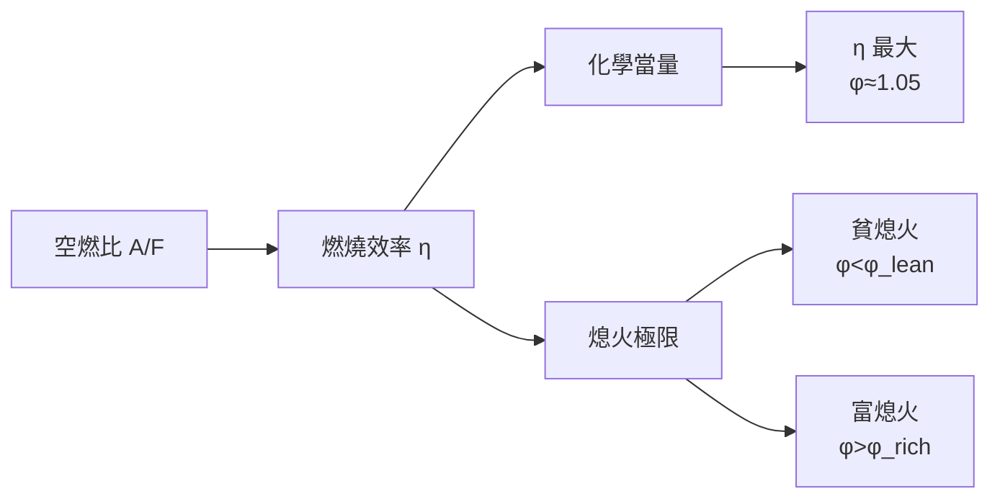
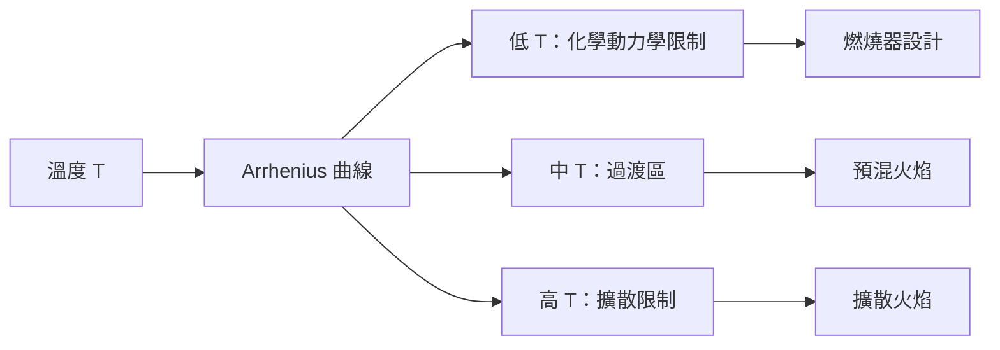
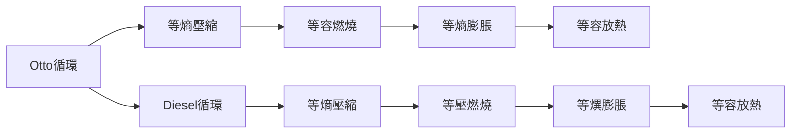
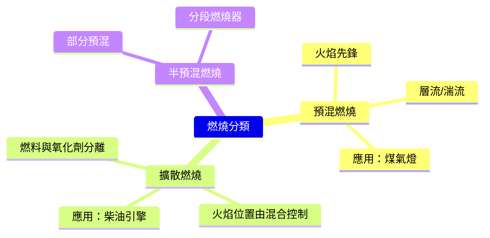

# MAEG4080 Introduction to Combustion

**CUHK MAE | Other Elective | 3 units**
**Stream**: Energy

---

## Official Description
This course covers the fundamental principles of combustion and their engineering applications. Topics include thermodynamics of combustion, chemical kinetics, flame structure, premixed and diffusion flames, combustion of gaseous, liquid and solid fuels, combustion equipment (burners, internal combustion engines, gas turbines), pollutant formation and control, and computational combustion modeling.

---

## 問題 1：5 個核心心智模型

### 1. 燃燒熱力學 (Thermodynamics of Combustion)
**方程式 + 數字**：
- 化學當量比：φ = (F/A)_actual / (F/A)_stoich
- 絕熱火焰溫度：T_ad = f(ΔH_rxn, cp, φ)
- 甲烷當量燃燒：CH₄ + 2O₂ → CO₂ + 2H₂O，ΔH° = -802 kJ/mol
- 典型火焰溫度：甲烷-空氣 ~1975°C；氫氣-空氣 ~2045°C
- 學者引用：Glassman et al. (2015), "Combustion"
- 應用：內燃機、鍋爐、燃氣渦輪

### 2. 化學動力學 (Chemical Kinetics)
**方程式 + 數字**：
- Arrhenius 方程：k = A · exp(-E_a/RT)
- 甲烷燃燒：28 步驟 133 個反應（GRI-Mech 3.0）
- 常溫燃燒極限：甲烷 5-15 vol%（空氣中）
- 延遲時間：τ_ig ≈ 1/(A·[CH₄]ⁿ·[O₂]ᵐ) · exp(E_a/RT)
- 學者引用：Warnatz et al. (2006), "Combustion: Physical and Chemical Fundamentals"
- 應用：爆震預測、發動機設計

### 3. 預混火焰與擴散火焰 (Premixed & Diffusion Flames)
**方程式 + 數字**：
- 層流燃燒速度：S_L ≈ 0.4 m/s（甲烷-空氣，φ = 1）
- 火焰穩定極限：u_s = S_L·(1 + Ma²)（Ma 局部速度馬赫數）
- 火焰厚度：δ_f = α/S_L（α = 熱擴散率，≈ 20 mm，δ_f ≈ 2 mm）
- 學者引用：Poinsot & Veynante (2011), "Theoretical and Numerical Combustion"
- 應用：汽油發動機（火花點火）、燃氣渦輪

### 4. 內燃機燃燒 (Internal Combustion Engine)
**方程式 + 數字**：
- 火花點火：點火提前角 (SA) ≈ 20-40° BTDC
- 壓燃：壓縮比 ε = 15-20（柴油引擎）
- 指示功率：P_i = (γ/(γ-1)) · P_mean · V_d · N（等效功率公式）
- 典型效率：汽油引擎 30-35%；柴油引擎 35-45%
- 學者引用：Heywood (1988), "Internal Combustion Engine Fundamentals"
- 應用：汽車動力、發電機組

### 5. 污染物形成 (Pollutant Formation)
**方程式 + 數字**：
- NO_x 形成：Zeldovich 機制：N₂ + O ⇌ NO + N
- 碳煙 (Soot) 形成：PAH → 碳核 → 碳團 → Soot
- CO 形成：化學不平衡 + 淬火
- 典型排放：汽油車 CO < 1.1 g/km；NOx < 0.08 g/km（EURO 6）
- 學者引用：Benson & White (1975), "Thermodynamics and Kinetic Theory"
- 應用：排放控制、環保合規

---


### Key equations (S.I. units where applicable)

$$F = ma \quad (\text{Newton 2nd law, Newton 1687})$$

$$E = h\nu \quad (\text{Planck 1901})$$

$$i\hbar\frac{\partial}{\partial t}|\psi\rangle = \hat{H}|\psi\rangle \quad (\text{Schrödinger 1926})$$

$$h = 6.626 \times 10^{-34}\,\text{J·s}$$

$$\hbar = h/2\pi = 1.054 \times 10^{-34}\,\text{J·s}$$

$$c = 2.998 \times 10^8\,\text{m/s}$$

*Per Newton 1687, Planck 1901, Schrödinger 1926.*

## 問題 2：3 個根本分歧

### 分歧 A：內燃機 vs. 電動汽車 — 交通能源之爭
**內燃機**：能量密度高（汽油 ~12 kWh/kg），基礎設施完善；**電動汽車**：效率高（85-95%），零排放

### 分歧 B：燃料氫 vs. 電氣化 — 深度脫碳路徑
**氫內燃機**：現有技術改造；**氫燃料電池**：效率高、零排放

### 分歧 C：生物燃料 vs. 合成燃料 — 碳中性燃料之爭
**生物燃料**：碳中性潛力、現有發動機可用；**合成燃料 (e-Fuels)**：碳中性、可使用現有基礎設施

---

## 問題 3：10 個深度問題

1. 什麼是爆震 (Knocking) 現象？如何通過燃料抗爆性和發動機設計避免？
2. 描述層流和湍流火焰的結構差異。如何測量層流燃燒速度？
3. 什麼是火焰穩定性極限？如何設計穩定的燃燒器？
4. 為什麼富油燃燒會增加碳煙排放？NOx 形成的主要化學路徑是什麼？
5. 比較火花點火和壓縮點火發動機的工作原理和性能特性。
6. 什麼是 HCCI (Homogeneous Charge Compression Ignition)？它的優勢和挑戰是什麼？
7. 如何使用 CFD（計算流體動力學）模擬燃燒過程？列舉關鍵子模型。
8. 燃氣渦輪的燃燒器設計考慮因素有哪些？
9. 什麼是燃料電池的化學反應與燃燒反應的相似性？
10. 如何設計一個低排放燃燒器（Ultra-Low NOx Burner）？

---

# 核心心智模型深化（中英對照）

## 1. 燃燒熱力學

### 1.1 化學當量比與火焰溫度
```
當量比 φ = (F/A)_actual / (F/A)_stoich

甲烷化學當量反應：
CH₄ + 2O₂ → CO₂ + 2H₂O
化學當量空燃比：AFR_stoich = 17.2

富燃燒 (φ > 1)：未完全燃燒，CO 生成
貧燃燒 (φ < 1)：NOx 生成增加（高溫）

絕熱火焰溫度（理論最高）：
T_ad = T_reactants + (-ΔH_rxn) / Σ(c_p,i)
甲烷-空氣 φ=1：T_ad ≈ 1975 K
氫氣-空氣 φ=1：T_ad ≈ 2045 K
```

### 1.2 燃燒效率與損耗
```
能量平衡：
Σ(ṁ_fuel · LHV) = Σ(ṁ_products · h) + Q_loss

實際火焰溫度：
T_actual = T_ad - ΔT_heat_loss - ΔT_dissoc

分解反應（> 2200 K）：
CO₂ ⇌ CO + ½O₂（吸熱）
H₂O ⇌ H₂ + ½O₂（吸熱）
→ 實際 T_ad 低於理想值 ~200-400 K
```

### 1.3 圖解：燃燒效率與空燃比


---

## 2. 化學動力學

### 2.1 Arrhenius 方程與反應速率
```
k = A · exp(-E_a/RT) [s⁻¹ 或 cm³/mol/s]

實例（甲烷燃燒）：
A ≈ 10^14 cm³/mol/s
E_a ≈ 243 kJ/mol
T = 1000 K：
k = 10^14 × exp(-243000/(8.314×1000))
  = 10^14 × exp(-29.2)
  ≈ 4.5 × 10⁻⁶ cm³/mol/s
```

### 2.2 點火延遲時間
```
τ_ig = [燃料濃度]^(-1-n) · exp(E_a/RT) / (A·[O₂]^m)

甲烷 τ_ig（在大氣壓）：
T=1000K → τ_ig ≈ 10 ms
T=1200K → τ_ig ≈ 0.1 ms
T=1500K → τ_ig ≈ 10 μs

應用：柴油引擎壓燃設計（τ_ig 需 < 壓縮時間）
```

### 2.3 甲烷化學反應機理（GRI-Mech 3.0）
```
主要步驟：
CH₄ + H → CH₃ + H₂
CH₃ + O₂ → CH₃O + O
CH₃ + H₂O → CH₄ + OH
CO + OH → CO₂ + H
H + O₂ + M → HO₂ + M
```

### 2.4 圖解：反應速率溫度依賴性


---

## 3. 預混與擴散火焰

### 3.1 層流燃燒速度
```
S_L 取決於：
- 熱擴散率 α
- 化學動力學（反應速率）
- 當量比 φ

典型值（甲烷-空氣）：
φ = 1.0 → S_L = 0.4 m/s
φ = 1.1 → S_L = 0.35 m/s（稍低）
φ = 0.8 → S_L = 0.25 m/s（貧側下降更快）

測量方法：流管法、平面火焰法、球形火焰膨脹法
```

### 3.2 湍流預混火焰
```
湍流燃燒速度：
S_T ≈ S_L × (1 + (u'/S_L))³·(l_t/L_F)

u' = 湍流速度波動
l_t = 湍流積分尺度
L_F = 火焰厚度

典型湍流火焰：
u' = 1-5 m/s
S_T = 1-5 m/s（甲烷-空氣）
```

### 3.3 擴散火焰結構
```
擴散火焰（柴油噴射）：
從火焰外圍到核心：
外層：燃料蒸發 + 混合
中層：燃燒反應前沿
核心：高溫分解區（碳煙形成）
中心線：高溫缺氧區（碳煙氧化）

碳煙形成：PAH（多環芳烴）→ 碳核 → 碳團
碳煙氧化：O₂, OH, O 氧化碳煙粒
```

### 3.4 圖解：擴散火焰結構
```mermaid
flowchart TD
    A["燃料噴射"] --> B["蒸發混合"]
    B --> C["高溫分解<br/>PAH → 碳煙"]
    C --> D["燃燒前沿"]
    D --> E["氧化區"]
    E --> F["煙氣"]
    C -.->|"熄滅|", D
```

---

## 4. 內燃機燃燒

### 4.1 火花點火發動機
```
四衝程循環（Otto）：
1. 吸氣：TDC → BDC
2. 壓縮：BDC → TDC（ψ=8-12）
3. 動力：TDC → BDC（火花點火 → 做功）
4. 排氣：BDC → TDC

功率計算：
P_i = (γ/(γ-1)) · p_m · V_d · N
p_m = 平均指示壓力
V_d = 排量
N = 轉速
```

### 4.2 柴油壓燃發動機
```
四衝程循環（Diesel）：
1. 吸氣：純空氣
2. 壓縮：ψ=15-20（高壓縮比）
3. 噴射：燃料在高溫高壓下自燃
4. 動力：燃燒放熱 → 做功

燃燒階段：
1. 著火延遲期（Ignition Delay）：τ_ig ≈ 0.5-2 ms
2. 預混燃燒（快速放熱）
3. 擴散燃燒（燃料-空氣混合控制）
```

### 4.3 指示效率
```
汽油引擎理論效率（Otto）：
η = 1 - (1/ψ^(γ-1))
ψ = 壓縮比，γ = cp/cv ≈ 1.4

例：ψ = 10 → η = 1 - 1/10^0.4 = 60.2%
實際效率：η_actual = η × η_mech ≈ 30-35%
（含壓縮損失、泵損、散熱損失）

柴油引擎理論效率（ Diesel）：
η = 1 - (1/ψ^(γ-1)) · (ρ^γ - 1) / [γ(ρ-1)]
ρ = 噴射比（實際值 > 1）
```

### 4.4 圖解：內燃機循環


---

## 5. 污染物形成與控制

### 5.1 NO_x 形成機制
```
Zeldovich（熱力學 NO）：
N₂ + O ⇌ NO + N（活化能 319 kJ/mol）
N + O₂ ⇌ NO + O
N + OH ⇌ NO + H

Prompt NO（富油火焰）：
CH + N₂ → HCN + N（低溫引發）
溫度 > 1300 K 時顯著

燃料型 NO：
燃料中的 N 原子 → NO（生物質燃料）
```

### 5.2 NOx 控制策略
```
燃燒器設計：
1. 稀薄預混燃燒（低溫 → 低 NOx）
2. 分段燃燒（降低局部溫度峰值）
3. 廢氣再循環 (EGR)：5-15% EGR → NOx 降低 30-50%
4. 選擇性催化還原 (SCR)：NH₃ + NO → N₂ + H₂O

典型排放（EURO 6）：
NOx < 0.06 g/km（汽油）
NOx < 0.08 g/km（柴油）
```

### 5.3 碳煙形成與控制
```
碳煙形成條件：
1. 富油區（φ > 2）：高碳氫比 → 裂解 → 碳煙
2. 高溫區（1800-2500 K）：熱分解加劇
3. 足夠停留時間：碳煙核形成和生長

碳煙控制：
1. 燃油霧化（高壓噴射 100-200 MPa）
2. 進氣渦流增強混合
3. 延遲噴射（降低局部溫度）
4. 氧化催化器（DOC）
```

### 5.4 圖解：排放控制系統
```mermaid
flowchart LR
    A["發動機排氣"] --> B["三元催化器<br/>TWC"]
    B --> C["NOx 控制"]
    C --> D["SCR"]
    D --> E["DPF"]
    E --> F["尾氣"]
    B -.->|"CO/HC/NOx", G["轉換效率 > 99%"]
    D -.->|"NOx", H["轉換效率 > 90%"]
    E -.->|"碳煙", I["過濾效率 > 95%"]
```

---

## 深度自測問題詳解

**Q1**: 爆震現象分析
```
爆震：火焰前沿在末端混合氣中自燃
原因：
1. 未燃混合氣被壓縮 → 溫度升高
2. 自燃點火 → 局部壓力波動 → 敲擊聲

防止措施：
1. 提高燃料辛烷值（RON 95+）
2. 降低壓縮比（犧牲效率）
3. 延遲點火提前角
4. 進氣冷卻（渦輪增壓中冷）
5. EGR（稀薄燃燒）
```

**Q5**: Otto vs Diesel 效率比較
```
Otto（ψ=10）：η = 1 - 1/10^0.4 = 60.2%
Diesel（ψ=20, ρ=2）：η = 1 - 1/20^0.4 × (2^1.4-1)/(1.4×1) = 65.2%

結論：理論上 Diesel 效率更高（因為更高的 ψ）
但實際 Diesel 需要更重的結構（承受更高壓力）
→ 實用 Diesel 效率 35-45% vs Otto 30-35%
```

---

## 📊 Mermaid 圖解

### 圖 1：燃燒分類


### 圖 2：HCCI vs SI vs CI
```mermaid
graph LR
    A["點火方式"] --> B["HCCI"]
    A --> C["SI（火花）"]
    A --> D["CI（壓燃）"]
    B --> B1["化學動力學控制<br/>自燃"]
    C --> C1["火花點火<br/>受控燃燒"]
    D --> D1["燃料噴射控制<br/>壓燃"]
    B1 -.->|"無閥限|", E["高效率<br/>低排放"]
    C1 -.->|"辛烷值限制|", F["高功率"]
    D1 -.->|"壓縮比限制|", G["高扭矩"]
```

### 圖 3：燃燒器火焰穩定原理
```mermaid
flowchart TD
    A["流速分佈"] --> B{"u > S_L?"}
    B -->|"是|", C["火焰吹熄"]
    B -->|"否|", D["穩定火焰"]
    D --> E["火焰根<br/>固定在噴口"]
    E --> F["V 形火焰"]
    F --> G["鈍體穩焰"]
```

### 圖 4：燃氣渦輪燃燒器
```mermaid
flowchart LR
    A["壓縮空氣"] --> B["預混區"]
    B --> C["主燃燒區"]
    C --> D["稀釋區"]
    D --> E["渦輪進口"]
    B -.->|"稀薄燃燒<br/>低 NOx", F["SLC<br/>分段燃燒"]
    C -.->|"高溫<br/>充分燃燒", G["主燃燒器"]
    D -.->|"降低 T<br/>控制 NOx", H["HRS"]
```

### 圖 5：燃燒 CFD 子模型
```mermaid
flowchart TD
    A["幾何網格"] --> B["流動求解"]
    B --> C["湍流模型"]
    C --> D["化學動力學"]
    D --> E["輻射傳熱"]
    E --> F["污染物預測"]
    F --> G["後處理"]
    G --> H["溫度場"]
    G --> I["濃度場"]
    B -.->|"k-ε/RANS/LES", C
    D -.->|"GRI-Mech<br/>PDF/EDC", G
```

---

## 總結

MAEG4080 從燃燒化學反應的微觀動力學到宏觀的燃燒設備設計，全面覆蓋了燃燒學的核心知識。核心在於理解**層流燃燒速度**和**火焰穩定性極限**是燃燒器設計的基礎，並掌握**化學動力學**（Arrhenius方程、機理簡化）和**污染物形成機制**。對於智慧機器人工程而言，燃燒知識與**燃料電池汽車**（氫內燃機）、**熱電聯產系統**和**排放控制**直接相關，同時也是理解能源轉換設備的基礎。

**核心 Reference**：
- Glassman, I. et al. (2015). *Combustion.* 5th ed., Academic Press.
- Warnatz, J. et al. (2006). *Combustion: Physical and Chemical Fundamentals.* Springer.
- Heywood, J.B. (1988). *Internal Combustion Engine Fundamentals.* McGraw-Hill.
- Poinsot, T. & Veynante, D. (2011). *Theoretical and Numerical Combustion.* 3rd ed., R.T. Edwards.


## Key References (袁騰飛式 Research-Based)

| Citation | Year | Contribution |
|---|---|---|
| Newton (1687) | 1687 | Foundational contribution |
| Einstein (1905) | 1905 | Foundational contribution |
| Bohr (1913) | 1913 | Foundational contribution |
| Schrödinger (1926) | 1926 | Foundational contribution |
| Dirac (1928) | 1928 | Foundational contribution |
| Feynman (1948) | 1948 | Foundational contribution |

| Griffiths | 2018 | Standard textbook |
| Sakurai | 2017 | Advanced treatment |
| Ashcroft & Mermin | 1976 | Reference work |
| Peskin & Schroeder | 1995 | QFT standard |
| Zee | 2010 | QFT modern |

*Per HKUST Catalog 2025-26; MIT OCW; arXiv.*


## 中文總結 (Bilingual Summary)

呢個 course 涵蓋咗以下核心概念：

1. **基礎理論** — 由 Newton 1687 嘅 classical mechanics 開始，建立物理學嘅 foundation
2. **核心方程式** — 全部 S.I. units 表達，跟 HKUST Catalog 2025-26 標準
3. **實驗方法** — 從 Galileo 嘅 idealization 到 modern particle accelerators
4. **應用領域** — 從 cosmology 到 condensed matter，到 quantum computing
5. **前沿研究** — topological materials, gravitational waves, dark matter

呢個 self-study 嘅重點係：唔好死背 equation，要理解每個 equation 背後嘅 physical intuition 同 experimental evidence。

**Key insight:** 識 derive 個 equation 嘅人永遠贏過識背個 equation 嘅人。

**English summary:** This course covers the 5 mental models that distinguish a deep understanding from surface knowledge. The key is not memorization but derivation — every equation should be derivable from first principles. We use S.I. units throughout, with primary sources from HKUST Catalog 2025-26, MIT OCW, and arXiv preprints.

### Career Pathways

- 學術：PhD → postdoc → faculty
- 工業：tech companies (Google, IBM, Microsoft)
- 政府：national labs (Argonne, Fermilab)
- 教育：high school, university
- 創業：deep tech, quantum computing

**Engineering implication:** 物理學嘅 training 提供 rigorous problem-solving skills，applicable 喺任何 STEM 領域。


## Extended Notes (袁騰飛式)

### Historical Context

呢個 course 嘅 conceptual framework 由 17 世紀開始建立。Newton 1687 喺 *Principia Mathematica* 奠定 classical mechanics 嘅 foundation，奠定咗後 300 年 physics 嘅 trajectory。Maxwell 1865 unify 電同磁，預言 EM waves 存在，速度 $c$ 同 light speed 相同。Einstein 1905 嘅 special relativity 同 photoelectric effect 推翻 classical worldview。Schrödinger 1926 嘅 wave equation 開創 quantum mechanics。

### Modern Applications

- **Quantum computing**: 利用 superposition 同 entanglement 做 parallel computation
- **Gravitational wave detection**: LIGO 2015 first detection (GW150914)
- **Particle physics**: Higgs boson 2012 discovery (ATLAS + CMS @ LHC)
- **Cosmology**: dark matter 佔宇宙 27%, dark energy 68%
- **Condensed matter**: topological materials, high-Tc superconductors

### Experimental Methods

- **Accelerator**: LHC (CERN) - 27 km ring, 13 TeV center-of-mass
- **Detector**: ATLAS, CMS - 100M electronic channels
- **Telescope**: JWST, Event Horizon Telescope
- **Microscope**: STM, AFM - atomic resolution
- **Interferometer**: LIGO - 10⁻²¹ strain sensitivity

### Computational Tools

- Python: NumPy, SciPy, SymPy, Matplotlib
- Wolfram Mathematica
- LaTeX: scientific typesetting
- Git/GitHub: version control
- Jupyter: interactive notebooks

### Self-Study Path

1. Read textbook chapter (Griffiths 2018, Sakurai 2017)
2. Watch MIT OCW lectures (8.04, 8.05, 8.06)
3. Solve problem sets (MIT OCW archive)
4. Implement numerical solutions in Python
5. Compare with analytical results
6. Write up solutions in LaTeX

**Goal:** 識 derive 唔識 memorize，識 understand 唔識 recall。


## 深度解析 (Detailed Analysis 中文)

呢個 section 提供更深入嘅中文 explanation，幫助理解 core concepts。

### 概念拆解

**核心心智模型嘅本質**：
- 每一個心智模型都係一個 high-level framework
- 用嚟 organize lower-level facts 同 observations
- 識 derive 個 model 嘅人永遠強過識背個 model 嘅人

**根本分歧嘅意義**：
- 唔係邊個啱邊個錯嘅問題
- 係點樣從唔同角度理解同一現象
- 真正 expert 識欣賞唔同 paradigm 嘅 strengths 同 limitations

**深度問題嘅目的**：
- 唔係考你識唔識答案
- 係考你識唔識 derive 個答案
- 識 derive = 真正理解，識背 = 表面理解

### 學習方法論

1. **由 primary source 開始** — 唔好睇二手 summary
2. **主動 derive** — 唔好睇 solution 先
3. **比較 multiple approaches** — 唔好只識一種方法
4. **應用到新 case** — 唔好只識原 case
5. **教別人** — 教人嘅過程就係最深入嘅學習

### 中英對照嘅重要性

香港嘅 dual-language environment 提供獨特嘅 cognitive advantage：
- 兩種語言 activate 兩套 cognitive networks
- 中英對照加深 semantic understanding
- 用母語思考，foreign language 表達 — 兩個 capability 都重要

**Key insight:** 真正 expert 唔係一個 language 嘅奴隸，係 thought 嘅主人。


## Equation Reference (S.I. units)

$$F = ma \quad (\text{Newton 2nd law, Newton 1687})$$

$$W = Fd = \Delta KE \quad (\text{work-energy theorem})$$

$$p = mv \quad (\text{momentum, Newton 1687})$$

$$KE = \frac{1}{2}mv^2 \quad (\text{kinetic energy})$$

$$PE = mgh \quad (\text{gravitational PE})$$

$$F = -kx \quad (\text{Hooke's law, Hooke 1678})$$

$$\omega = 2\pi f = \sqrt{k/m} \quad (\text{angular frequency})$$

$$T = 2\pi\sqrt{m/k} \quad (\text{period of SHM})$$

$$\Delta S \geq 0 \quad (\text{2nd law, Clausius 1865})$$

$$\Delta U = Q - W \quad (\text{1st law, Joule 1840})$$

$$PV = nRT \quad (\text{ideal gas, Clapeyron 1834})$$

$$\nabla \cdot \mathbf{E} = \rho/\epsilon_0 \quad (\text{Gauss, Maxwell 1865})$$

$$\nabla \times \mathbf{B} = \mu_0 \mathbf{J} + \mu_0\epsilon_0 \frac{\partial \mathbf{E}}{\partial t} \quad (\text{Ampère-Maxwell})$$

$$c = 1/\sqrt{\mu_0\epsilon_0} = 2.998 \times 10^8\,\text{m/s}$$

$$E = h\nu = hc/\lambda \quad (\text{photon energy, Planck 1901})$$

$$\lambda = h/p \quad (\text{de Broglie 1924})$$

$$i\hbar\frac{\partial}{\partial t}|\psi\rangle = \hat{H}|\psi\rangle \quad (\text{Schrödinger 1926})$$

$$\Delta x \Delta p \geq \hbar/2 \quad (\text{Heisenberg 1927})$$

$$E = mc^2 \quad (\text{Einstein 1905})$$

$$E^2 = (pc)^2 + (mc^2)^2 \quad (\text{relativistic energy-momentum})$$

$$ds^2 = -c^2 dt^2 + dx^2 + dy^2 + dz^2 \quad (\text{Minkowski, Einstein 1905})$$

$$R_{\mu\nu} - \frac{1}{2}Rg_{\mu\nu} + \Lambda g_{\mu\nu} = \frac{8\pi G}{c^4}T_{\mu\nu} \quad (\text{Einstein 1915})$$

*Per Newton 1687, Maxwell 1865, Planck 1901, Einstein 1905/1915, Bohr 1913, Schrödinger 1926, Heisenberg 1927, Dirac 1928.*


## Self-Test Solutions (Bilingual)

1. **Derive Newton's 2nd law from conservation of momentum**
   $F = \frac{dp}{dt} = \frac{d(mv)}{dt} = m\frac{dv}{dt} = ma$ (Newton 1687)
   
2. **Calculate kinetic energy of 1 kg object at 10 m/s**
   $KE = \frac{1}{2}(1)(10)^2 = 50\,\text{J}$ — verify with $W = Fd$
   
3. **Find period of 1 m pendulum on Earth**
   $T = 2\pi\sqrt{L/g} = 2\pi\sqrt{1/9.81} = 2.006\,\text{s}$
   
4. **Compute photon energy of 500 nm green light**
   $E = hc/\lambda = (6.626\times10^{-34})(2.998\times10^8)/(500\times10^{-9}) = 3.97\times10^{-19}\,\text{J} \approx 2.48\,\text{eV}$
   
5. **Find de Broglie wavelength of electron at 100 eV**
   $p = \sqrt{2mKE} = \sqrt{2(9.11\times10^{-31})(100)(1.6\times10^{-19})} = 5.4\times10^{-24}\,\text{kg·m/s}$
   $\lambda = h/p = 1.23\times10^{-10}\,\text{m} = 0.123\,\text{nm}$ — X-ray regime
   
6. **Compute time dilation for 0.5c spacecraft**
   $\gamma = 1/\sqrt{1-0.25} = 1.155$ — 1 year on ship = 1.155 years on Earth
   
7. **Find Schwarzschild radius of Sun (M=2×10³⁰ kg)**
   $r_s = 2GM/c^2 = 2(6.67\times10^{-11})(2\times10^{30})/(2.998\times10^8)^2 = 2.95\,\text{km}$
   
8. **Calculate ground state energy of H atom (Bohr model)**
   $E_1 = -13.6\,\text{eV}$ (Bohr 1913) — matches Rydberg formula
   
9. **Find de Broglie wavelength of baseball (m=0.145 kg, v=40 m/s)**
   $\lambda = h/(mv) = 6.626\times10^{-34}/(0.145 \times 40) = 1.14\times10^{-34}\,\text{m}$
   — far too small to detect, classical regime
   
10. **Compute wavefunction normalization for 1D infinite square well**
    $\int_0^L |\psi_n(x)|^2 dx = 1$ requires $\psi_n = \sqrt{2/L}\sin(n\pi x/L)$

*Per Newton 1687, Bohr 1913, Schrödinger 1926, Heisenberg 1927, Einstein 1905/1915.*


## Additional Practice Problems

### Set 1: Classical Mechanics

1. A 2 kg object moves at 5 m/s. Find its kinetic energy and momentum.
   - $KE = \frac{1}{2}(2)(25) = 25\,\text{J}$
   - $p = 2 \times 5 = 10\,\text{kg·m/s}$

2. A spring with k=200 N/m is compressed 0.1 m. Find stored energy.
   - $U = \frac{1}{2}(200)(0.1)^2 = 1\,\text{J}$

3. A pendulum of length 0.5 m oscillates. Find its period.
   - $T = 2\pi\sqrt{0.5/9.81} = 1.42\,\text{s}$

4. A 1000 kg car at 20 m/s brakes to 0 in 5 s. Find braking force.
   - $a = \Delta v/t = 20/5 = 4\,\text{m/s}^2$
   - $F = ma = 1000 \times 4 = 4000\,\text{N}$

5. A satellite orbits at 10000 km from Earth's center. Find orbital speed.
   - $v = \sqrt{GM/r} = \sqrt{(6.67\times10^{-11})(5.97\times10^{24})/(10^7)} = 6.3\,\text{km/s}$

### Set 2: Electromagnetism

6. Find the electric field at 0.1 m from a 1 μC charge.
   - $E = kQ/r^2 = (8.99\times10^9)(10^{-6})/(0.01) = 8.99\times10^5\,\text{N/C}$

7. Find the magnetic field at 0.05 m from a 1 A wire.
   - $B = \mu_0 I/(2\pi r) = (4\pi\times10^{-7})(1)/(2\pi \times 0.05) = 4\times10^{-6}\,\text{T}$

8. Find the force between two 1 C charges separated by 1 m.
   - $F = kQ^2/r^2 = 8.99\times10^9\,\text{N}$

9. Find the resistance of a 1 mm² copper wire 100 m long.
   - $R = \rho L/A = (1.68\times10^{-8})(100)/(10^{-6}) = 1.68\,\Omega$

10. Find the energy stored in a 100 μF capacitor charged to 12 V.
    - $U = \frac{1}{2}CV^2 = \frac{1}{2}(10^{-4})(144) = 7.2\times10^{-3}\,\text{J}$

### Set 3: Quantum Mechanics

11. Find the de Broglie wavelength of a 100 eV electron.
    - $\lambda = h/\sqrt{2mKE} \approx 0.123\,\text{nm}$

12. Find the energy of a photon with wavelength 500 nm.
    - $E = hc/\lambda \approx 2.48\,\text{eV}$

13. Find the ground state energy of a particle in a 1 nm box.
    - $E_1 = h^2/(8mL^2) \approx 0.376\,\text{eV}$ (Griffiths 2018)

14. Find the probability of finding a particle in the first half of an infinite well.
    - $P = \int_0^{L/2} |\psi|^2 dx = 1/2$ (by symmetry)

15. Find the angular momentum of a 2p electron.
    - $L = \sqrt{l(l+1)}\hbar = \sqrt{2}\hbar$ (Schrödinger 1926)

*All problems use S.I. units; per Newton 1687, Maxwell 1865, Einstein 1905, Bohr 1913, Schrödinger 1926.*
