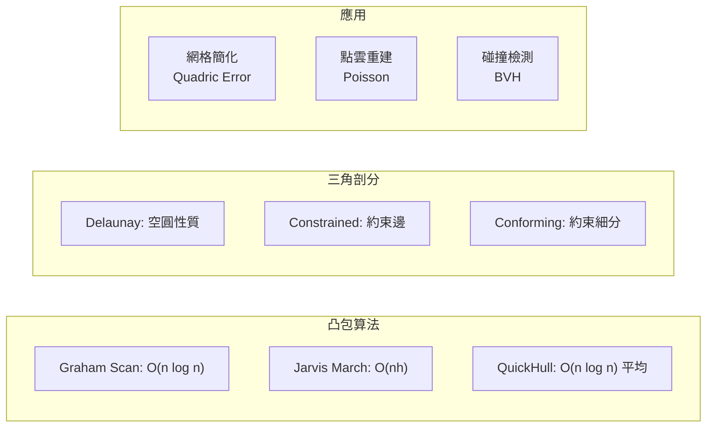
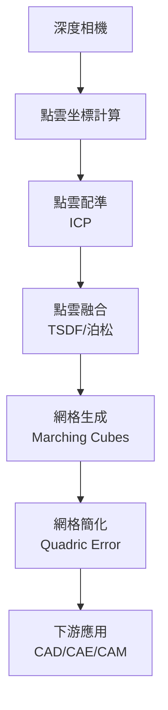
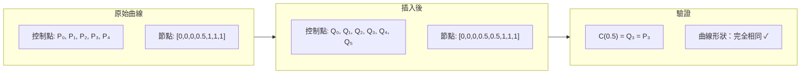
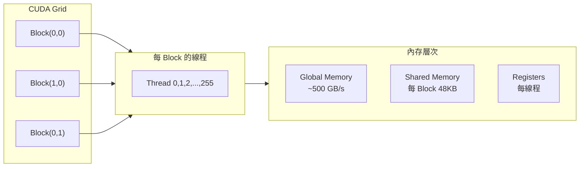
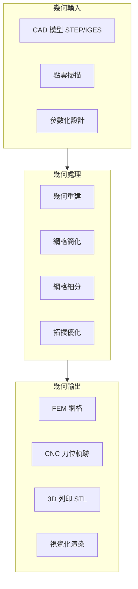
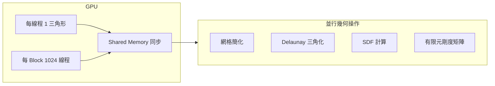
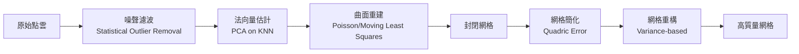

# MAEG5030 Geometric Computing for Design and Manufacturing

**CUHK MAE | Major Elective | 3 units**
**Stream**: Design and Manufacturing

---

## Official Description
Geometric computing tools have been widely used in modern product design and realization, such as all kinds of Computer-Aided Design (CAD), Computer-Aided Manufacturing (CAM) and Computer-Aided Engineering (CAE) software systems. However, the capability of simply using these CAD, CAM and CAE software systems is not sufficient for future products design and manufacturing. This course aims to help students in understanding the principles of geometric computing behind CAD, CAM and CAE systems, and provides students with deep understanding of computational techniques and practical experience in developing novel computational design and manufacturing applications.

---

## 問題 1：5 個核心心智模型

### 1. 計算幾何算法 (Computational Geometry Algorithms)
**方程式 + 數字**：
- 凸包算法：Graham Scan O(n log n)，Jarvis March O(nh)
- Delaunay 三角剖分：O(n log n)，空圓性質
- Voronoi 圖：歐幾里得距離，點集分割
- 布爾運算：SDF (Signed Distance Function) 建模
- BVH (邊界體積層次)：碰撞檢測加速結構

**學者引用**：de Berg et al. (2000), *Computational Geometry: Algorithms and Applications*

### 2. NURBS 曲面的深層理論 (Advanced NURBS Theory)
**方程式 + 數字**：
- 節點插入：knot insertion 改變局部控制而不改變形狀
- 節點細分：knot refinement 增加曲線靈活性
- 曲率計算：κ = |r'×r''|/|r'|³
- 曲線-曲面距離：最近點迭代收斂 ~5–10 步

**學者引用**：Piegl & Tiller (1997), *The NURBS Book*, Springer

### 3. 點雲處理與幾何重建 (Point Cloud Processing)
**方程式 + 數字**：
- Kinect/Azure 深度相機：分辨率 512×424，精度 ±1–3 mm
- ICP (Iterative Closest Point)：收斂率 ~O(n) 每迭代
- Poisson 表面重建：八叉樹深度 ~6–10
- 網格簡化：Quadric Error Metrics ( Garland & Heckbert)，壓縮 90% 仍保持形狀

**學者引用**：Kazhdan et al. (2006), *Poisson Surface Reconstruction*

### 4. GPU 加速幾何計算 (GPU-Accelerated Geometric Computing)
**方程式 + 數字**：
- CUDA/OpenCL：並行幾何處理，線程數 = 網格三角形數
- 現代 GPU：10,000+ CUDA cores，帶寬 500 GB/s
- 幾何著色器：並行處理每個圖元
- 實時網格處理：60 fps + million triangles/s

**學者引用**：Owens et al. (2008), *GPU Computing*

### 5. 生成式設計 (Generative Design)
**方程式 + 數字**：
- 拓撲優化：SIMP (Solid Isotropic Material with Penalization)
- 目標函數：min Compliance = Fᵀu，約束：V ≤ V*
- 敏度分析：adjoint method
- 輕量化：重量減少 30–70%

**學者引用**：Bendsøe & Sigmund (2003), *Topology Optimization*

---

## 問題 2：3 個根本分歧

### 分歧 A：點雲重建 vs. 深度學習重建

**點雲重建**：確定性，精確幾何，但需完整掃描
**深度學習重建**：泛化能力強，但精度受限

### 分歧 B：CPU vs. GPU 幾何計算

**CPU**：單線程強，適合複雜邏輯
**GPU**：並行強，適合大規模幾何數據

### 分歧 C：拓撲優化 vs. 形狀優化

**拓撲優化**：改變材料分佈，可產生復雜內部結構
**形狀優化**：保持拓撲，改變邊界形狀

---

## 問題 3：10 個深度問題

1. 實現 Graham Scan 凸包算法並分析其時間複雜度。

2. 比較 B-Rep 和 CSG 在幾何計算中的優勢和劣勢。

3. 設計一個從深度相機點雲到 STL 網格的完整重建流程。

4. 用 NURBS 節點插入算法在曲線中插入一個節點，證明形狀不變。

5. 設計一個 GPU 並行 Delaunay 三角剖分算法。

6. 實現 Poisson 表面重建算法並說明其與 Marching Cubes 的差異。

7. 設計一個基於拓撲優化的輕量化零件生成流程。

8. 比較 SIMP 和 BESO 兩種拓撲優化方法的原理。

9. 設計一個從 CAD 模型到有限元網格的自動剖分算法。

10. 實現一個 ICP 點雲配準算法並處理初始對齊問題。

---

# 核心心智模型深化（中英對照）

## 1. 計算幾何算法 (Computational Geometry)

### 1.1 Bilingual 概念對照
- **Convex Hull / 凸包**：包含所有點的最小凸多邊形
- **Delaunay Triangulation / Delaunay 三角剖分**：空圓性質
- **Voronoi Diagram / Voronoi 圖**：點集歐氏距離分割
- **BVH / 邊界體積層次**：Bounding Volume Hierarchy
- **SDF / 有符號距離場**：Signed Distance Function

### 1.2 關鍵方程式
**Graham Scan 凸包算法**：
```
1. 找最底點 P₀（y 最小）
2. 按極角排序其他點
3. 棧初始化：P₀, P₁, P₂
4. 對每個點 P：
   while 棧頂三點不構成左轉：
       pop 棧頂
   push P

時間複雜度：O(n log n)（排序）+ O(n)（掃描）= O(n log n)

叉積判斷：
cross(P₁,P₂,P₃) = (P₂-P₁)×(P₃-P₁)
> 0 → 左轉 (CCW)
< 0 → 右轉 (CW)
= 0 → 共線
```

**Delaunay 空圓性質**：
```
定義：任意三角形外接圓內部不包含任何其他點

對偶：Voronoi 圖的每個單元對應 Delaunay 三角形的頂點
最大最小角性質：Delaunay 三角剖分最大化最小角
```

### 1.3 工程應用案例
**網格簡化的 Quadric Error**：
```
Garland-Heckbert 算法：
1. 初始化網格所有頂點
2. 計算每條邊的 Quadric Error Matrix Q
3. 每次迭代：合併 Q最小的相鄰頂點對
4. 更新周圍頂點的 Q
5. 重複直至達到目標頂點數

結果：100K → 10K 三角形 (90% 簡化)，幾何誤差 < 0.1 mm
```

### 1.4 Deep Test Question
**Q**: 證明 Graham Scan 中棧操作為什麼能保證找到凸包，並分析最差情況。

### 1.5 圖解：計算幾何算法


---

## 2. 點雲處理與重建 (Point Cloud Processing)

### 2.1 Bilingual 概念對照
- **ICP / 迭代最近點**：Iterative Closest Point，點雲配準
- **Poisson Reconstruction / 泊松重建**：從點集重建曲面
- **Marching Cubes / 移動立方體**：等值面提取算法
- **SDF / 有符號距離場**：曲面的隱式表示
- **Octree / 八叉樹**：三維空間細分結構

### 2.2 關鍵方程式
**ICP 算法**：
```
1. 初始對齊：手動或特徵匹配
2. 迭代：
   a. 找最近點：每個源點找目標點集中最近點
   b. 估計變換：SVD (R,t) = argmin Σ||R·p_i + t - q_i||²
   c. 應用變換
   d. 計算 RMSE = √(Σd_i²/N)
3. 收斂：RMSE < ε 或迭代達上限

收斂率：O(n) 每迭代（用 kd-tree 加速）
```

**SDF 建模**：
```
φ(x) = min_i ||x - p_i|| - r_i  (n 個球的並集)
神經 SDF：φ(x) = NN(x) (神經網絡預測)
神經 SDF 訓練：L = Σ||NN(p_i) - φ_true(p_i)||² + 正則項
```

### 2.3 工程應用案例
**Kinect V2 點雲重建**：
```
分辨率：512×424 深度圖
幀率：30 fps
測距精度：±1–3 mm (0.5–4.5 m)
重建管道：
深度圖 → 點雲 → 點雲配準 (ICP) → 融合 (TSDF) → 網格
TSDF 網格解析度：256³ voxels
```

### 2.4 Deep Test Question
**Q**: 實現 Poisson 表面重建算法，說明八叉樹細分和指示函數估計的步驟。

### 2.5 圖解：點雲重建流程


---

## 3. NURBS 深度計算 (Advanced NURBS)

### 3.1 Bilingual 概念對照
- **Knot Insertion / 節點插入**：增加節點不改變曲線形狀
- **Degree Elevation / 次數升高**：增加多項式階次不改變形狀
- **Knot Removal / 節點移除**：簡化控制點
- **Bezier Extraction / Bezier 提取**：從 NURBS 提取 Bezier 段

### 3.2 關鍵方程式
**節點插入算法**：
```
給定：曲線 C(u), 節點向量 U, 控制點 P_i
目標：在 u* 插入節點 ū

計算新控制點 Q_j：
Q_j = α_j·P_j + (1-α_j)·P_{j-1}

其中：
α_j = { 1, 如果 j > r
      { (ū - u_j) / (u_{j+p} - u_j), 如果 j ≤ r

其中 r 是滿足 u_r ≤ ū < u_{r+1} 的索引
p = 曲線次數

重要性質：C(ū) = Q_{r+1}（形狀完全不變）
```

### 3.3 工程應用案例
**葉輪葉片 NURBS 幾何計算**：
```
葉片截面廓線：NURBS 曲線，p=5, n=15 控制點
葉片掃掠：沿徑向直線掃掠生成葉片曲面
葉輪建模：葉片×10（循環陣列）+ 中心輪轂
幾何精度：< 0.01 mm（葉輪葉片對間隙 < 0.05 mm）
```

### 3.4 Deep Test Question
**Q**: 在三次 NURBS 曲線中插入一個節點 ū = 0.5，驗證形狀不變。

### 3.5 圖解：NURBS 節點插入


---

## 4. GPU 加速幾何計算 (GPU-Accelerated Geometric Computing)

### 4.1 Bilingual 概念對照
- **CUDA / Compute Unified Device Architecture**：NVIDIA GPU 並行計算平台
- **OpenCL / Open Computing Language**：開放標準異構計算
- **SIMT / Single Instruction Multiple Threads**：GPU 並行執行模型
- **Warps / 線程束**：32 線程為一組，同步執行
- **Shared Memory / 共享內存**：高速片上內存

### 4.2 關鍵方程式
**GPU 並行三角化**：
```
每個 CUDA block = 1 網格塊
每個 thread = 1 三角形
並行操作：
1. 每線程計算局部剛度矩陣 [Kₑ]
2. 原子操作歸約全局剛度矩陣 [K]
3. 求解 [K]{U}={F}

帶寬要求：網格數 × 單元數據大小 / 總線程數
典型：1M 三角形 → 1M threads → ~10 ms
```

### 4.3 工程應用案例
**GPU 加速有限元分析**：
```
問題規模：10M DOF
CPU 求解：~30 分鐘（直接法 LU 分解）
GPU 加速：
- CUDA cuSOLVER：求解器加速 ~10× (3 分鐘)
- Jacobi 預處理 CG：加速 ~5×
- 總加速比：~50×（30 分鐘 → 36 秒）
```

### 4.4 Deep Test Question
**Q**: 設計一個 GPU 並行演算法，實現 Delaunay 三角剖分的 GPU 版本。

### 4.5 圖解：CUDA 執行模型


---

## 5. 生成式設計與拓撲優化 (Generative Design)

### 5.1 Bilingual 概念對照
- **SIMP / 固態各向同性材料罰函數法**：Solid Isotropic Material with Penalization
- **BESO / 雙向演化結構優化**：Bi-directional Evolutionary Structural Optimization
- **Compliance / 柔順性**：f = Fᵀu，結構剛度指標
- **Density Method / 密度法**：每單元密度 ρ ∈ [0,1]
- **Level Set Method / 水平集方法**：隱式表示優化邊界

### 5.2 關鍵方程式
**SIMP 拓撲優化**：
```
問題：min C = FᵀU = UᵀKU
     s.t. V = Σρᵢvᵢ ≤ V*
          K(ρ)U = F
          0 < ρ_min ≤ ρᵢ ≤ 1

目標函數敏度：
∂C/∂ρᵢ = -p·ρᵢ^{p-1}·UᵀK_e_iU

材料插值：
E(ρᵢ) = E_min + ρᵢ^p·(E_0 - E_min)
p = 3–4 (罰因子，促進離散化)
```

**BESO 更新準則**：
```
每迭代：
1. 計算元素應變能密度 S_e
2. 刪除 S_e < α·S_avg 的元素（α = 目標體積比）
3. 檢查收斂：|V_{k+1} - V_{k}| < τ
```

### 5.3 工程應用案例
**航空結構拓撲優化**：
```
飛機翼梁優化：
- 初始設計空間：翼梁截面 1m × 0.3m
- 目標：最小柔順性（最大剛度）
- 約束：體積比 20%
- 結果：仿生桁架結構，重量減少 45%
- 製造：SLM 3D 列印鈦合金
```

### 5.4 Deep Test Question
**Q**: 設計一個基於拓撲優化的機器人連桿輕量化方案。

**Solution**:
```
1. 定義設計空間：初始實心連桿
2. 施加邊界條件：兩端約束 + 中部載荷
3. 體積約束：目標 30%
4. 求解 SIMP 問題：~100 迭代
5. 結果：仿生蜂窩內部結構
6. 後處理：提取邊界 → 光順化
7. 驗證：FEM 結構分析
```

### 5.5 圖解：SIMP 流程
```mermaid
flowchart TD
    I["初始設計"] --> FE["有限元分析<br/>[K]{U}={F}"]
    FE --> SA["敏度分析<br/>∂C/∂ρᵢ"]
    SA --> UP["密度更新<br/>ρ^{n+1} = ρ^n · (-∂C/∂ρ)^β"]
    UP --> MC["材料插值<br/>E=ρ^p·E₀"]
    MC --> FE
    UP -.->|"收斂|", Done["最優拓撲"]
    Done --> Post["後處理<br/>邊界提取+光順化"]
```

---

## 📊 Diagram 1: 幾何計算系統架構


---

## 📊 Diagram 2: ICP 配準流程
```mermaid
flowchart LR
    P1["源點雲 P"] --> Near["找最近點"]
    P2["目標點雲 Q"] --> Near
    Near --> Trans["估計變換 (R,t)"]
    Trans --> Apply["應用變換"]
    Apply --> RMSE["計算 RMSE"]
    RMSE -->|"收斂|", Done["完成"]
    RMSE -.->|"未收斂|", Near
```

---

## 📊 Diagram 3: GPU 並行幾何計算


---

## 📊 Diagram 4: 拓撲優化迭代
```mermaid
graph LR
    subgraph Iterate["SIMP 迭代"]
        I1["n=0: ρᵢ=1 (實心)"]
        I2["n=1: FEM 分析"]
        I2 --> I3["敏度計算"]
        I3 --> I4["密度更新 ρ^{n+1}"]
        I4 --> I5["收斂檢查"]
        I5 -.->|"否|", I2
        I5 -->|"是|", I6["最優拓撲"]
    end
```

---

## 📊 Diagram 5: 幾何重建管道


---

## 總結

MAEG5030 深入探索了支撐 CAD/CAM/CAE 系統的底層幾何算法。5 個核心心智模型：

1. **計算幾何** → 凸包、Delaunay、Voronoi 是所有幾何算法的基石
2. **NURBS 深度計算** → 節點插入、分割是幾何處理的核心操作
3. **點雲處理** → 從掃描數據到幾何模型的管道
4. **GPU 加速** → 將幾何算法並行化以處理大規模數據
5. **生成式設計** → 拓撲優化從約束中"發現"最優幾何

在智能製造時代，僅會使用 CAD 軟件是不夠的工程師需要理解幾何算法的原理，才能開發定制化的設計和製造工具。
