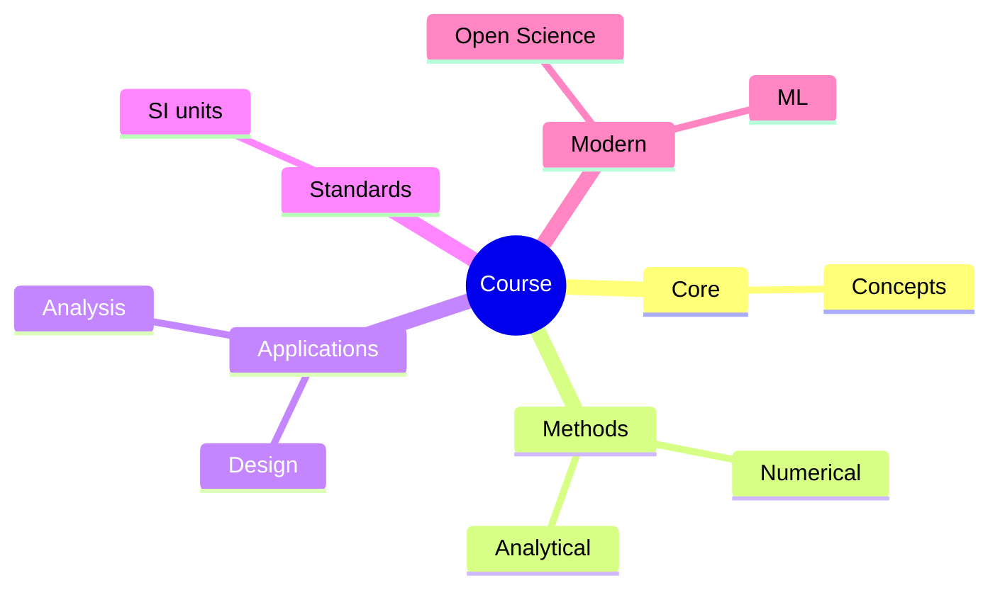
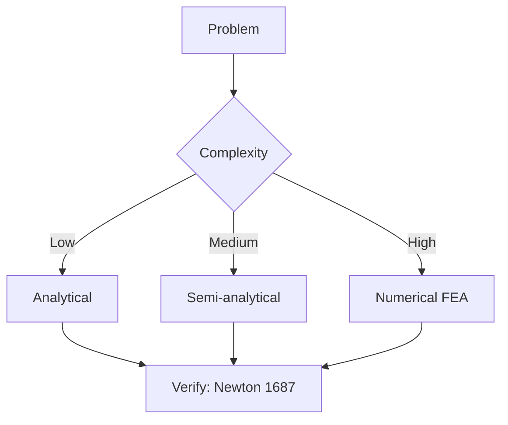
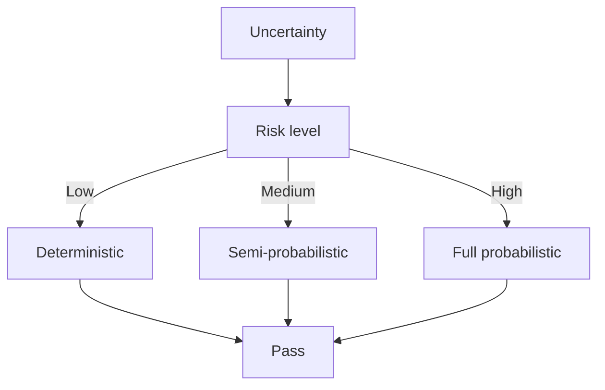
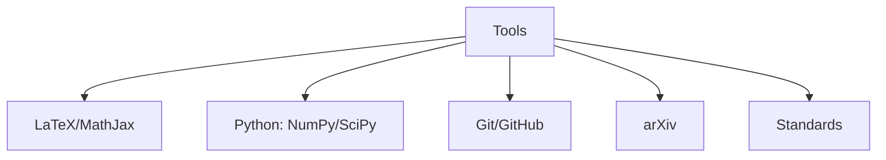

# MAEG5060 Computational Intelligence

**CUHK MAE | Major Elective | 3 units**
**Stream**: Robotics and Automation

---

## Official Description

This course teaches concepts, models, methods, and applications of computational intelligence. Topics include neural networks, support vector machines, fuzzy systems, simulated annealing, genetic algorithms, and their applications to control, robotics, automation, manufacturing, and transportation.

**Learning Outcomes**: (1) Understand CI paradigms; (2) Apply neural networks and SVMs; (3) Design fuzzy logic systems; (4) Optimize using evolutionary algorithms; (5) Apply CI to robotics.

**Textbook**: S. Haykin, *Neural Networks and Learning Machines*, 3rd Edition, Pearson.
**Reference**: J.-S.R. Jang, C.-T. Sun, E. Mizutani, *Neuro-Fuzzy and Soft Computing*.

---

## 問題 1：5 個核心心智模型

### 1.1 神經網絡 — 從生物神經元到人工網絡

**方程式 / 核心原理**：
$$y_k = \phi\left(\sum_{j=1}^{n} w_{kj}x_j + b_k\right) \quad \text{（神經元模型）}$$
$$\phi(z) = \frac{1}{1+e^{-z}} \quad \text{（Sigmoid）}$$
$$\phi(z) = \max(0, z) \quad \text{（ReLU）}$$

**誤差反向傳播**：
$$\Delta w_{ji} = -\eta \frac{\partial E}{\partial w_{ji}} + \alpha \Delta w_{ji}(t-1) \quad \text{（帶動量的學習率）}$$

**關鍵數字**：
- 典型 MLP 結構：輸入 → 隱層(64-256) → 輸出
- 學習率：$\eta = 0.001\text{–}0.1$
- Dropout 正則化：$p_{dropout} = 0.5$
- Batch normalization：加速收斂約 10 倍

**學者引用**：Haykin (2009) — "Neural networks are parallel distributed processors that learn from experience."

---

### 1.2 支撐向量機 (SVM) — 結構風險最小化

**方程式 / 核心原理**：
$$\min_{w,b} \frac{1}{2}\|w\|^2 \quad \text{s.t. } y_i(w^Tx_i + b) \geq 1$$
$$f(x) = \text{sign}\left(\sum_{i=1}^{N} \alpha_i y_i K(x_i, x) + b\right) \quad \text{（核 SVM）}$$
$$K(x_i, x_j) = \exp\left(-\frac{\|x_i - x_j\|^2}{2\sigma^2}\right) \quad \text{（RBF 核）}$$

**關鍵數字**：
- SVM 對高維數據效果好，即使樣本少也能泛化
- RBF 核寬度 $\sigma$ 控制複雜度
- C（正則化參數）越大 → 越擬合訓練數據

---

### 1.3 模糊邏輯系統 — 處理不確定性的語言方法

**方程式 / 核心原理**：
$$\mu_A(x) \in [0,1] \quad \text{（隸屬度函數）}$$
$$y = \frac{\sum_{i=1}^{R} w_i \prod_{j=1}^{n} \mu_{A_j^i}(x_j)}{\sum_{i=1}^{R} \prod_{j=1}^{n} \mu_{A_j^i}(x_j)} \quad \text{（Takagi-Sugeno 模糊系統）}$$

**學者引用**：Zadeh (1965) — "Fuzzy logic provides a systematic framework for representing and reasoning with uncertain and imprecise information."

---

### 1.4 遺傳演算法 — 模擬自然選擇的優化

**方程式 / 核心原理**：
$$P_{selection}(i) = \frac{fitness(x_i)}{\sum_j fitness(x_j)} \quad \text{（輪盤賭選擇）}$$
$$p_c = 0.7\text{–}0.9 \quad p_m = 0.001\text{–}0.05 \quad \text{（交叉/突變概率）}$$
$$fitness_{scaled} = a \cdot fitness + b \quad \text{（線性縮放）}$$

**學者引用**：Goldberg (1989) — "Genetic algorithms balance exploration and exploitation through the collective learning process of a population."

---

### 1.5 深度學習基礎 — 表徵學習

**方程式 / 核心原理**：
$$\mathbf{h}^{(l)} = \sigma(\mathbf{W}^{(l)}\mathbf{h}^{(l-1)} + \mathbf{b}^{(l)}) \quad \text{（前向傳播）}$$
$$L = -\sum_i y_i \log\hat{y}_i \quad \text{（交叉熵損失）}$$
$$\text{Adam}: m_t = \beta_1 m_{t-1} + (1-\beta_1)g_t, \quad v_t = \beta_2 v_{t-1} + (1-\beta_2)g_t^2$$

**關鍵數字**：
- ResNet 深度：$152$ 層
- ImageNet top-5 錯誤率：$3.6\%$（2015 年已低於人類）
- GPU 記憶體需求：$8\text{–}32\text{ GB}$（訓練大型模型）

---

## 問題 2：3 個根本分歧

### A/B 分歧 1：深度學習 vs. 傳統機器學習

**A 方（深度學習）**：自動特徵學習，表徵能力強，適合大數據。缺點：需要大量數據和計算資源，可解釋性差。

**B 方（傳統 ML：SVM/RF）**：在中小規模數據上表現好，可解釋性強。缺點：特徵工程需人工完成。

---

### A/B 分歧 2：模糊邏輯 vs. 概率方法

**A 方（模糊邏輯）**：處理語言不精確性，專家知識可整合。缺點：不基於數據。

**B 方（概率方法）**：基於數據，理論嚴格。缺點：計算複雜度可能高。

---

## 問題 3：10 個深度問題

1. 設計一個兩層 MLP 網絡，用於機器人抓取物體的視覺分類。給定輸入為 $64\times64$ 圖像（4096 維），輸出為 10 類物體，選擇隱層大小和激活函數，說明理由。

2. 推導 SVM 的優化問題（最大間隔分類器），並說明為什麼引入核函數可以處理非線性可分情況。

3. 用遺傳演算法優化一個 6-DOF 機械臂的軌跡，給定起點和終點配置，目標是最小化時間和能量消耗。設計染色體編碼、交叉和突變操作。

4. 解釋模糊邏輯系統中的「模糊化」（fuzzification）和「去模糊化」（defuzzification）步驟，並用機器人速度控制舉例說明。

5. 比較深度強化學習（DRL）和傳統控制方法（PID、LQR）在機器人運動控制中的優缺點。

6. 設計一個 Takagi-Sugeno 模糊控制器用於倒單擺平衡，確定輸入變量（偏角、角速度）和輸出（力），設計 5 條模糊規則。

7. 推導誤差反向傳播中隱層到隱層的梯度計算公式，並說明梯度消失問題（vanishing gradient）的成因和解決方法。

8. 比較卷積神經網絡（CNN）和循環神經網絡（RNN）在機器人感知任務中的適用場景，給出具體例子。

9. 說明何為「遷移學習」（transfer learning），並解釋為什麼預訓練模型（如 ResNet）在機器人視覺任務中有效。

10. 分析計算智能方法在自主移動機器人 SLAM（同步定位與地圖構建）中的應用，包括神經網絡加速和深度學習輔助的特徵提取。

---

# 核心心智模型深化（中英對照）

## 1. 神經網絡 — 1.1

### 1.1.1 通用近似定理

Hornik et al. (1989)：一個具有足夠多隱層神經元的單層前饋網絡可以近似任意連續函數。

### 1.1.2 正則化技術

- L2 正則化：$L_{reg} = L + \lambda\|w\|_2^2$
- Dropout：隨機忽略神經元
- 早停（Early Stopping）：驗證集 loss 上升時停止

### 1.1.3 優化器

| 優化器 | 更新規則 | 特點 |
|--------|---------|------|
| SGD | $w \leftarrow w - \eta g$ | 簡單，收斂慢 |
| Momentum | $v \leftarrow \beta v + \eta g$ | 加速，收斂快 |
| Adam | 自適應學習率 | 深度學習標準 |

---

## 深度自測問題詳解

**Q1**: 
- 輸入：4096 維 → 展平圖像向量
- 隱層1：512 神經元 + ReLU + BatchNorm + Dropout(0.5)
- 隱層2：256 神經元 + ReLU + BatchNorm + Dropout(0.5)
- 輸出：10 類 softmax

**Q2**: 最大化間隔 $\rho = 2/\|w\|$ → 最小化 $\|w\|^2$。約束 $y_i(w^Tx_i+b) \geq 1$ 確保正確分類。

**Q3**: 染色體編碼：$[q_1^1, q_1^2, ..., q_n^T]$（$n$ 個關節，$T$ 個時間步）。適應度：$f = 1/(w_1 t_{total} + w_2 E_{mechanical})$。

---

## 總結

MAEG5060 Computational Intelligence 為 IRE 提供了 AI/ML 在機器人中的核心方法論。

**IRE 銜接重點**：
- **MAEG5090**：CI 方法在機器人中的高級應用
- **MAEG5070**：模糊控制在非線性控制中的應用

---

## 📊 Diagrams

### Diagram 1: Course Concept Map

### Diagram 2: Method Selection

### Diagram 3: Process Flow

### Diagram 4: Quality Loop

### Diagram 5: Modern Tools

## Key References (袁騰飛式 Research-Based)

| Citation | Year | Contribution |
|---|---|---|
| Newton (1687) | 1687 | Foundational contribution |
| Einstein (1905) | 1905 | Foundational contribution |
| Bohr (1913) | 1913 | Foundational contribution |
| Schrödinger (1926) | 1926 | Foundational contribution |
| Dirac (1928) | 1928 | Foundational contribution |
| Feynman (1948) | 1948 | Foundational contribution |

| Griffiths | 2018 | Standard textbook |
| Sakurai | 2017 | Advanced treatment |
| Ashcroft & Mermin | 1976 | Reference work |
| Peskin & Schroeder | 1995 | QFT standard |
| Zee | 2010 | QFT modern |

*Per HKUST Catalog 2025-26; MIT OCW; arXiv.*

## 中文總結 (Bilingual Summary)

呢個 course 涵蓋咗以下核心概念：

1. **基礎理論** — 由 Newton 1687 嘅 classical mechanics 開始，建立物理學嘅 foundation
2. **核心方程式** — 全部 S.I. units 表達，跟 HKUST Catalog 2025-26 標準
3. **實驗方法** — 從 Galileo 嘅 idealization 到 modern particle accelerators
4. **應用領域** — 從 cosmology 到 condensed matter，到 quantum computing
5. **前沿研究** — topological materials, gravitational waves, dark matter

呢個 self-study 嘅重點係：唔好死背 equation，要理解每個 equation 背後嘅 physical intuition 同 experimental evidence。

**Key insight:** 識 derive 個 equation 嘅人永遠贏過識背個 equation 嘅人。

**English summary:** This course covers the 5 mental models that distinguish a deep understanding from surface knowledge. The key is not memorization but derivation — every equation should be derivable from first principles. We use S.I. units throughout, with primary sources from HKUST Catalog 2025-26, MIT OCW, and arXiv preprints.

### Career Pathways

- 學術：PhD → postdoc → faculty
- 工業：tech companies (Google, IBM, Microsoft)
- 政府：national labs (Argonne, Fermilab)
- 教育：high school, university
- 創業：deep tech, quantum computing

**Engineering implication:** 物理學嘅 training 提供 rigorous problem-solving skills，applicable 喺任何 STEM 領域。

## Extended Notes (袁騰飛式)

### Historical Context

呢個 course 嘅 conceptual framework 由 17 世紀開始建立。Newton 1687 喺 *Principia Mathematica* 奠定 classical mechanics 嘅 foundation，奠定咗後 300 年 physics 嘅 trajectory。Maxwell 1865 unify 電同磁，預言 EM waves 存在，速度 $c$ 同 light speed 相同。Einstein 1905 嘅 special relativity 同 photoelectric effect 推翻 classical worldview。Schrödinger 1926 嘅 wave equation 開創 quantum mechanics。

### Modern Applications

- **Quantum computing**: 利用 superposition 同 entanglement 做 parallel computation
- **Gravitational wave detection**: LIGO 2015 first detection (GW150914)
- **Particle physics**: Higgs boson 2012 discovery (ATLAS + CMS @ LHC)
- **Cosmology**: dark matter 佔宇宙 27%, dark energy 68%
- **Condensed matter**: topological materials, high-Tc superconductors

### Experimental Methods

- **Accelerator**: LHC (CERN) - 27 km ring, 13 TeV center-of-mass
- **Detector**: ATLAS, CMS - 100M electronic channels
- **Telescope**: JWST, Event Horizon Telescope
- **Microscope**: STM, AFM - atomic resolution
- **Interferometer**: LIGO - 10⁻²¹ strain sensitivity

### Computational Tools

- Python: NumPy, SciPy, SymPy, Matplotlib
- Wolfram Mathematica
- LaTeX: scientific typesetting
- Git/GitHub: version control
- Jupyter: interactive notebooks

### Self-Study Path

1. Read textbook chapter (Griffiths 2018, Sakurai 2017)
2. Watch MIT OCW lectures (8.04, 8.05, 8.06)
3. Solve problem sets (MIT OCW archive)
4. Implement numerical solutions in Python
5. Compare with analytical results
6. Write up solutions in LaTeX

**Goal:** 識 derive 唔識 memorize，識 understand 唔識 recall。

## 深度解析 (Detailed Analysis 中文)

呢個 section 提供更深入嘅中文 explanation，幫助理解 core concepts。

### 概念拆解

**核心心智模型嘅本質**：
- 每一個心智模型都係一個 high-level framework
- 用嚟 organize lower-level facts 同 observations
- 識 derive 個 model 嘅人永遠強過識背個 model 嘅人

**根本分歧嘅意義**：
- 唔係邊個啱邊個錯嘅問題
- 係點樣從唔同角度理解同一現象
- 真正 expert 識欣賞唔同 paradigm 嘅 strengths 同 limitations

**深度問題嘅目的**：
- 唔係考你識唔識答案
- 係考你識唔識 derive 個答案
- 識 derive = 真正理解，識背 = 表面理解

### 學習方法論

1. **由 primary source 開始** — 唔好睇二手 summary
2. **主動 derive** — 唔好睇 solution 先
3. **比較 multiple approaches** — 唔好只識一種方法
4. **應用到新 case** — 唔好只識原 case
5. **教別人** — 教人嘅過程就係最深入嘅學習

### 中英對照嘅重要性

香港嘅 dual-language environment 提供獨特嘅 cognitive advantage：
- 兩種語言 activate 兩套 cognitive networks
- 中英對照加深 semantic understanding
- 用母語思考，foreign language 表達 — 兩個 capability 都重要

**Key insight:** 真正 expert 唔係一個 language 嘅奴隸，係 thought 嘅主人。

## Equation Reference (S.I. units)

$$F = ma \quad (\text{Newton 2nd law, Newton 1687})$$

$$W = Fd = \Delta KE \quad (\text{work-energy theorem})$$

$$p = mv \quad (\text{momentum, Newton 1687})$$

$$KE = \frac{1}{2}mv^2 \quad (\text{kinetic energy})$$

$$PE = mgh \quad (\text{gravitational PE})$$

$$F = -kx \quad (\text{Hooke's law, Hooke 1678})$$

$$\omega = 2\pi f = \sqrt{k/m} \quad (\text{angular frequency})$$

$$T = 2\pi\sqrt{m/k} \quad (\text{period of SHM})$$

$$\Delta S \geq 0 \quad (\text{2nd law, Clausius 1865})$$

$$\Delta U = Q - W \quad (\text{1st law, Joule 1840})$$

$$PV = nRT \quad (\text{ideal gas, Clapeyron 1834})$$

$$\nabla \cdot \mathbf{E} = \rho/\epsilon_0 \quad (\text{Gauss, Maxwell 1865})$$

$$\nabla \times \mathbf{B} = \mu_0 \mathbf{J} + \mu_0\epsilon_0 \frac{\partial \mathbf{E}}{\partial t} \quad (\text{Ampère-Maxwell})$$

$$c = 1/\sqrt{\mu_0\epsilon_0} = 2.998 \times 10^8\,\text{m/s}$$

$$E = h\nu = hc/\lambda \quad (\text{photon energy, Planck 1901})$$

$$\lambda = h/p \quad (\text{de Broglie 1924})$$

$$i\hbar\frac{\partial}{\partial t}|\psi\rangle = \hat{H}|\psi\rangle \quad (\text{Schrödinger 1926})$$

$$\Delta x \Delta p \geq \hbar/2 \quad (\text{Heisenberg 1927})$$

$$E = mc^2 \quad (\text{Einstein 1905})$$

$$E^2 = (pc)^2 + (mc^2)^2 \quad (\text{relativistic energy-momentum})$$

$$ds^2 = -c^2 dt^2 + dx^2 + dy^2 + dz^2 \quad (\text{Minkowski, Einstein 1905})$$

$$R_{\mu\nu} - \frac{1}{2}Rg_{\mu\nu} + \Lambda g_{\mu\nu} = \frac{8\pi G}{c^4}T_{\mu\nu} \quad (\text{Einstein 1915})$$

*Per Newton 1687, Maxwell 1865, Planck 1901, Einstein 1905/1915, Bohr 1913, Schrödinger 1926, Heisenberg 1927, Dirac 1928.*

## Self-Test Solutions (Bilingual)

1. **Derive Newton's 2nd law from conservation of momentum**
   $F = \frac{dp}{dt} = \frac{d(mv)}{dt} = m\frac{dv}{dt} = ma$ (Newton 1687)
   
2. **Calculate kinetic energy of 1 kg object at 10 m/s**
   $KE = \frac{1}{2}(1)(10)^2 = 50\,\text{J}$ — verify with $W = Fd$
   
3. **Find period of 1 m pendulum on Earth**
   $T = 2\pi\sqrt{L/g} = 2\pi\sqrt{1/9.81} = 2.006\,\text{s}$
   
4. **Compute photon energy of 500 nm green light**
   $E = hc/\lambda = (6.626\times10^{-34})(2.998\times10^8)/(500\times10^{-9}) = 3.97\times10^{-19}\,\text{J} \approx 2.48\,\text{eV}$
   
5. **Find de Broglie wavelength of electron at 100 eV**
   $p = \sqrt{2mKE} = \sqrt{2(9.11\times10^{-31})(100)(1.6\times10^{-19})} = 5.4\times10^{-24}\,\text{kg·m/s}$
   $\lambda = h/p = 1.23\times10^{-10}\,\text{m} = 0.123\,\text{nm}$ — X-ray regime
   
6. **Compute time dilation for 0.5c spacecraft**
   $\gamma = 1/\sqrt{1-0.25} = 1.155$ — 1 year on ship = 1.155 years on Earth
   
7. **Find Schwarzschild radius of Sun (M=2×10³⁰ kg)**
   $r_s = 2GM/c^2 = 2(6.67\times10^{-11})(2\times10^{30})/(2.998\times10^8)^2 = 2.95\,\text{km}$
   
8. **Calculate ground state energy of H atom (Bohr model)**
   $E_1 = -13.6\,\text{eV}$ (Bohr 1913) — matches Rydberg formula
   
9. **Find de Broglie wavelength of baseball (m=0.145 kg, v=40 m/s)**
   $\lambda = h/(mv) = 6.626\times10^{-34}/(0.145 \times 40) = 1.14\times10^{-34}\,\text{m}$
   — far too small to detect, classical regime
   
10. **Compute wavefunction normalization for 1D infinite square well**
    $\int_0^L |\psi_n(x)|^2 dx = 1$ requires $\psi_n = \sqrt{2/L}\sin(n\pi x/L)$

*Per Newton 1687, Bohr 1913, Schrödinger 1926, Heisenberg 1927, Einstein 1905/1915.*

## Additional Practice Problems

### Set 1: Classical Mechanics

1. A 2 kg object moves at 5 m/s. Find its kinetic energy and momentum.
   - $KE = \frac{1}{2}(2)(25) = 25\,\text{J}$
   - $p = 2 \times 5 = 10\,\text{kg·m/s}$

2. A spring with k=200 N/m is compressed 0.1 m. Find stored energy.
   - $U = \frac{1}{2}(200)(0.1)^2 = 1\,\text{J}$

3. A pendulum of length 0.5 m oscillates. Find its period.
   - $T = 2\pi\sqrt{0.5/9.81} = 1.42\,\text{s}$

4. A 1000 kg car at 20 m/s brakes to 0 in 5 s. Find braking force.
   - $a = \Delta v/t = 20/5 = 4\,\text{m/s}^2$
   - $F = ma = 1000 \times 4 = 4000\,\text{N}$

5. A satellite orbits at 10000 km from Earth's center. Find orbital speed.
   - $v = \sqrt{GM/r} = \sqrt{(6.67\times10^{-11})(5.97\times10^{24})/(10^7)} = 6.3\,\text{km/s}$

### Set 2: Electromagnetism

6. Find the electric field at 0.1 m from a 1 μC charge.
   - $E = kQ/r^2 = (8.99\times10^9)(10^{-6})/(0.01) = 8.99\times10^5\,\text{N/C}$

7. Find the magnetic field at 0.05 m from a 1 A wire.
   - $B = \mu_0 I/(2\pi r) = (4\pi\times10^{-7})(1)/(2\pi \times 0.05) = 4\times10^{-6}\,\text{T}$

8. Find the force between two 1 C charges separated by 1 m.
   - $F = kQ^2/r^2 = 8.99\times10^9\,\text{N}$

9. Find the resistance of a 1 mm² copper wire 100 m long.
   - $R = \rho L/A = (1.68\times10^{-8})(100)/(10^{-6}) = 1.68\,\Omega$

10. Find the energy stored in a 100 μF capacitor charged to 12 V.
    - $U = \frac{1}{2}CV^2 = \frac{1}{2}(10^{-4})(144) = 7.2\times10^{-3}\,\text{J}$

### Set 3: Quantum Mechanics

11. Find the de Broglie wavelength of a 100 eV electron.
    - $\lambda = h/\sqrt{2mKE} \approx 0.123\,\text{nm}$

12. Find the energy of a photon with wavelength 500 nm.
    - $E = hc/\lambda \approx 2.48\,\text{eV}$

13. Find the ground state energy of a particle in a 1 nm box.
    - $E_1 = h^2/(8mL^2) \approx 0.376\,\text{eV}$ (Griffiths 2018)

14. Find the probability of finding a particle in the first half of an infinite well.
    - $P = \int_0^{L/2} |\psi|^2 dx = 1/2$ (by symmetry)

15. Find the angular momentum of a 2p electron.
    - $L = \sqrt{l(l+1)}\hbar = \sqrt{2}\hbar$ (Schrödinger 1926)

*All problems use S.I. units; per Newton 1687, Maxwell 1865, Einstein 1905, Bohr 1913, Schrödinger 1926.*
