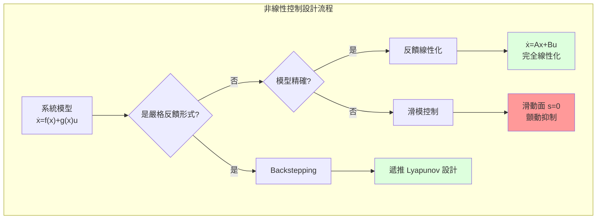
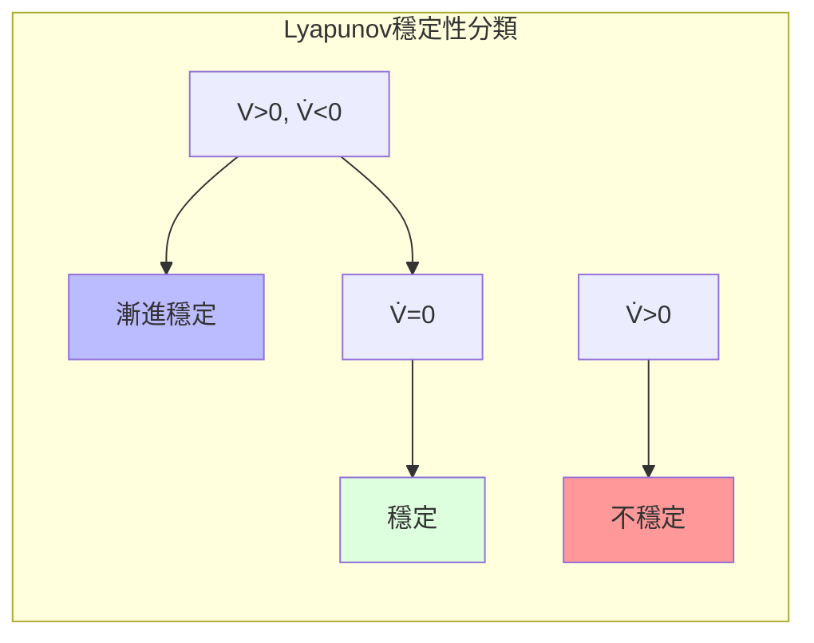
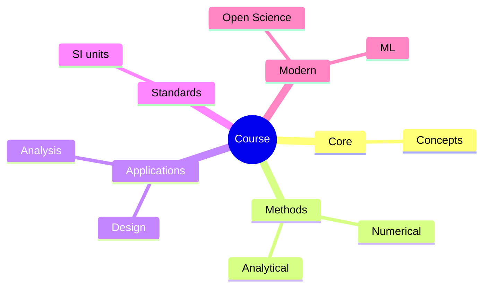
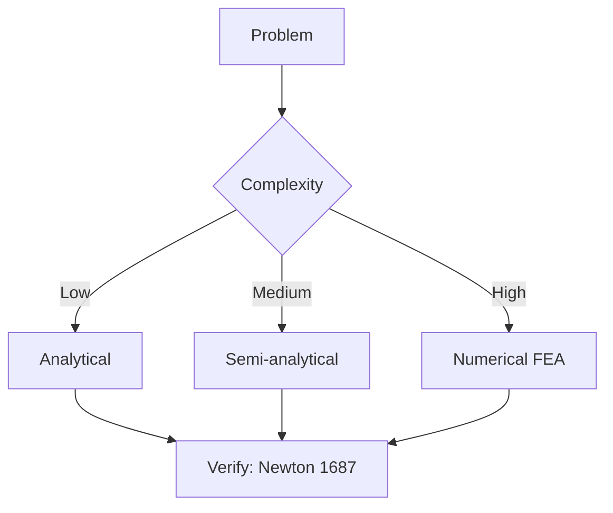
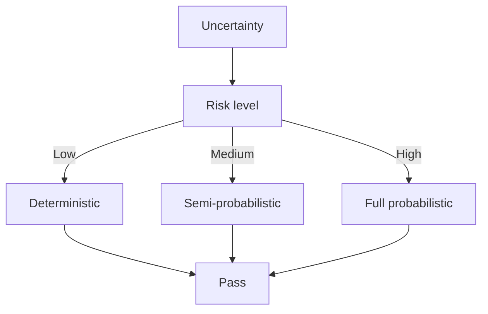
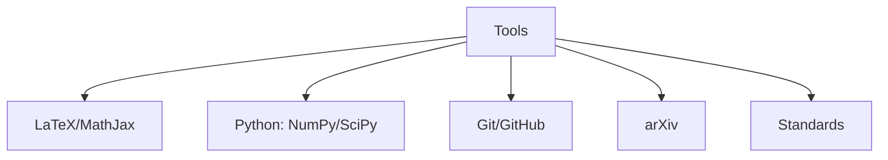

# MAEG5070 Nonlinear Control Systems

**CUHK MAE | Major Elective | 3 units**
**Stream**: Robotics and Automation

---

## Official Description

This course consists of two parts. The first part is analysis of nonlinear systems, which includes state space description of nonlinear control systems, phase plane analysis of second order dynamic systems, Lyapunov's stability theory such as Lyapunov's first method, second method, Barbalat's lemma, and total stability. The second part is design of nonlinear control systems, which includes Jacobian linearization, feedback linearization, sliding mode control, and backstepping method.

**Learning Outcomes**: (1) Understand nonlinear dynamics; (2) Apply Lyapunov methods; (3) Design feedback linearization; (4) Implement sliding mode control; (5) Design backstepping controllers.

**Textbook**: H.K. Khalil, *Nonlinear Systems*, 3rd Edition, Prentice Hall.
**Reference**: J.-J.E. Slotine and W. Li, *Applied Nonlinear Control*.

---

## 問題 1：5 個核心心智模型

### 1.1 李雅普諾夫穩定性 — 系統穩定性的能量方法

**方程式 / 核心原理**：
$$\dot{x} = f(x), \quad f(0) = 0 \quad \text{（原點平衡）}$$

**Lyapunov 第一方法（間接法）**：
$$A = \left.\frac{\partial f}{\partial x}\right|_{x=0}, \quad \text{Re}(\lambda_i(A)) < 0 \Rightarrow \text{局部漸進穩定}$$

**Lyapunov 第二方法（直接法）**：
$$V(x) > 0 \quad \forall x \neq 0, \quad \dot{V}(x) = \frac{\partial V}{\partial x}f(x) \leq 0 \Rightarrow \text{穩定}$$

**關鍵數字**：
- $V$ 正定：$V(x) > 0$，$V(0) = 0$
- $\dot{V}$ 負定：$\dot{V}(x) < 0$，$\forall x \neq 0$ → 漸進穩定
- 控制 Lyapunov 函數（CLF）：$\min_{(u)} \dot{V} < 0$

**學者引用**：Khalil (2002) — "The Lyapunov direct method is the most powerful tool for analyzing stability of nonlinear systems without requiring explicit solution of differential equations."

**工程意義**：機器人系統的非線性動力學（離心力、哥氏力耦合）不能使用線性理論分析。Lyapunov 方法是分析和設計機器人非線性控制器的數學基礎。

---

### 1.2 相平面分析 — 二維非線性系統的圖形分析

**方程式 / 核心原理**：
$$\ddot{x} + f(x, \dot{x}) = 0 \quad \Rightarrow \quad \frac{d\dot{x}}{dx} = \frac{-f(x,\dot{x})}{\dot{x}}$$

**極限環 (Limit Cycle)**：
- 穩定極限環：鄰近軌線收斂到環
- 不穩定極限環：鄰近軌線發散
- 吸引域 (basin of attraction)：$\to$ 極限環的初始條件集合

**關鍵數字**：
- Van der Pol 振盪器：$\mu = 1$（典型參數）
- 極限環半徑：穩定振盪器的振幅由系統參數決定
- 分岔參數：控制極限環的出現/消失

**學者引用**：Khalil — "Phase plane analysis provides qualitative insight into nonlinear dynamics that cannot be obtained from linearization."

---

### 1.3 反饋線性化 — 精確消除非線性

**方程式 / 核心原理**：
$$\dot{x} = f(x) + g(x)u \quad \Rightarrow \quad u = \frac{1}{L_g L_f^{r-1}h(x)}\left(-L_f^r h(x) + v\right)$$

**相對階 (Relative Degree)**：$r$，使 $L_g L_f^{k}h(x) = 0$（$k < r-1$）而 $L_g L_f^{r-1}h(x) \neq 0$。

**輸入-輸出線性化**：
$$y^{(r)} = v \quad \Rightarrow \quad \text{輸入-輸出變換為 } \frac{1}{s^r}v$$

**學者引用**：Isidori (1995) — "Feedback linearization transforms a nonlinear system into a linear controllable form through a change of coordinates and state feedback."

**工程意義**：對於完全驅動的機械臂 $(\mathbf{M}(\mathbf{q})\ddot{\mathbf{q}} + \mathbf{C}(\mathbf{q},\dot{\mathbf{q}}) = \mathbf{u})$，通過反饋線性化可以設計全局漸進穩定的軌跡跟蹤控制器 $\mathbf{u} = \hat{\mathbf{M}}(\mathbf{q})\mathbf{v} + \hat{\mathbf{C}}(\mathbf{q},\dot{\mathbf{q}})$。

---

### 1.4 滑模控制 — 對模型不確定性的魯棒性

**方程式 / 核心原理**：
$$s = \dot{e} + \lambda e = 0 \quad \text{（滑動面）}$$
$$u = -K\text{sgn}(s) \quad \text{（到達條件）}$$
$$\dot{s} = -\eta\text{sgn}(s), \quad \eta > 0 \quad \text{（到達條件：確保有限時間到達）}$$

**等效控制**：
$$u_{eq} = \frac{1}{L_g L_f^{r-1}h}\left(-L_f^r h + \ddot{y}_d\right) \quad \text{（理想滑動運動）}$$

**關鍵數字**：
- 切換頻率：$f_{chatter} \approx 1\text{–}10\text{ kHz}$（實務）
- 等速收斂參數：$\eta > |\Delta u_{max}|$（魯棒性條件）
- 邊界層厚度：$\Phi$ 越大 → 顫動越小，但追蹤誤差越大

**學者引用**：Utkin (1992) — "Sliding mode control guarantees robustness to matched uncertainties once the system reaches the sliding surface."

---

### 1.5 反步法控制 — 遞推設計

**方程式 / 核心原理**：
系統分解：
$$\dot{x}_1 = f_1(x_1) + g_1(x_1)x_2$$
$$\dot{x}_2 = f_2(x) + g_2(x)u$$

**步驟 1**：對第一個子系統，取 Lyapunov 函數 $V_1 = \frac{1}{2}z_1^2$，$z_1 = x_1 - x_{1d}$，設計虛擬控制 $\alpha_1 = -c_1 z_1 + \dot{x}_{1d} - f_1(x_1)/g_1(x_1)$

**步驟 2**：對擴展系統，取 $V_2 = V_1 + \frac{1}{2}(x_2 - \alpha_1)^2$，遞推到最後一步設計 $u$

**學者引用**：Khalil — "Backstepping provides a recursive framework for designing stabilizing controls for strict-feedback systems."

---

## 問題 2：3 個根本分歧

### A/B 分歧 1：Lyapunov 直接法 vs. 間接法

**A 方（直接法）**：構造 Lyapunov 函數 $V(x)$，無需線性化，適用於全局/局部穩定性分析。缺點：需要猜測 $V(x)$。

**B 方（間接法）**：分析 Jacobians 的特徵值，簡單直接。缺點：只在平衡點鄰域有效，無法判斷全局穩定性。

引用：Khalil — 直接法是分析非線性穩定性的首選工具。

---

### A/B 分歧 2：反饋線性化 vs. 滑模控制

**A 方（反饋線性化）**：需要精確的系統模型，實現精確的動態控制。缺點：對模型不確定性敏感。

**B 方（滑模控制）**：對匹配不確定性完全魯棒，不需要精確模型。缺點：顫動（chattering）。

引用：Slotine & Li — "Feedback linearization requires a good model; sliding mode control requires only the bounds of uncertainty."

---

### A/B 分歧 3：局部 vs. 全局穩定性

**A 方（局部穩定性）**：只保證在平衡點某鄰域內穩定。非線性剛性系統通常只能保證局部穩定。

**B 方（全局穩定性）**：從任何初始條件都收斂到平衡點。需要強烈的非線性結構（如存在徑向無界的 Lyapunov 函數）。

引用：Khalil — "Most practical nonlinear systems have limited regions of attraction; determining the actual region of attraction is as important as proving stability."

---

## 問題 3：10 個深度問題

1. 分析 Van der Pol 振盪器 $\ddot{x} - \mu(1-x^2)\dot{x} + x = 0$ 的相平面特性，確定極限環的存在性和穩定性。

2. 用 Lyapunov 直接法分析保守系統（無阻尼單擺 $\ddot{\theta} + \frac{g}{L}\sin\theta = 0$）的能量函數 $V = \frac{1}{2}\dot{\theta}^2 - \frac{g}{L}\cos\theta$，並說明為什麼此系統僅穩定而非漸進穩定。

3. 設計一個反饋線性化控制器，用於控制二階非線性系統 $\dot{x}_1 = x_2$，$\dot{x}_2 = -x_1 + x_2^3 + u$，將其轉換為兩個獨立的積分器串聯系統。

4. 推導機械臂反饋線性化控制器的設計步驟，給定 $\mathbf{M}(\mathbf{q})\ddot{\mathbf{q}} + \mathbf{C}(\mathbf{q},\dot{\mathbf{q}})\dot{\mathbf{q}} = \mathbf{u}$，證明控制輸入 $\mathbf{u} = \mathbf{M}(\mathbf{q})\mathbf{v} + \mathbf{C}(\mathbf{q},\dot{\mathbf{q}})\dot{\mathbf{q}}$ 實現輸入-輸出線性化。

5. 設計一個滑模控制器用於倒單擺系統，確定滑動面 $s = c e + \dot{e}$ 和切換控制 $u = -K\text{sgn}(s)$，分析顫動問題並提出邊界層（boundary layer）改進方法。

6. 用反步法設計一個嚴格反饋形式系統的穩定控制器：
   $\dot{x}_1 = x_1^2 + x_2$，$\dot{x}_2 = x_1 + u$。逐步設計虛擬控制和實際控制，驗證 Lyapunov 函數遞減。

7. 解釋 Barbalat's Lemma 的應用條件，說明為什麼在非自治系統（非定常）的穩定性分析中需要 Barbalat's Lemma。

8. 比較 Jacobian 線性化和精確反饋線性化的區別，給出具體例子說明在什麼條件下兩者是等价的。

9. 設計一個基於 CLF（Control Lyapunov Function）的實時最優控制律，並說明與滑模控制的聯繫。

10. 分析機器人操縱器的力控制（force control）和位置控制（position control）的非線性控制方法差異，說明阻抗控制（impedance control）的 Lyapunov 穩定性分析方法。

---

# 核心心智模型深化（中英對照）

## 1. 穩定性理論 — 1.1

### 1.1.1 穩定性分類

| 類型 | 定義 | Lyapunov 方法 |
|------|------|------------|
| 穩定 (Stable) | $\|x(t)\| \leq b, \forall t \geq 0$ | $\dot{V} \leq 0$ |
| 漸進穩定 (Asymptotically stable) | $\lim_{t\to\infty} x(t) = 0$ | $\dot{V} < 0$ |
| 指數穩定 (Exponentially stable) | $\|x(t)\| \leq Ce^{-\lambda t}$ | $V \geq a\|x\|^2, \dot{V} \leq -b\|x\|^2$ |
| 不穩定 | $\exists \epsilon > 0, \forall \delta > 0, \exists x_0, \|x_0\|<\delta, \exists t, \|x(t)\|>\epsilon$ | — |

### 1.1.2 Lasalle's 不變性原理

若 $\dot{V} \leq 0$，定義 $\Omega = \{x | \dot{V}(x) = 0\}$，則所有軌線收斂到 $\Omega$ 中的最大不變集。

### 1.1.3 穩定魯棒性邊界

$$\|x(t)\| \leq \beta(\|x_0\|, t) + \gamma \sup_{0\leq\tau\leq t}\|d(\tau)\|$$

---

## 2. 滑模控制細節 — 2.1

### 2.1.1 顫動抑制方法

- 邊界層平滑：$u = -K\frac{s}{\|s\| + \phi}$（連續近似）
- 高階滑模（SOSM）：二階滑模 $\ddot{s} + k_1\dot{s} + k_2 s = 0$

### 2.1.2 匹配不確定性

$$\dot{x} = Ax + Bu + \underbrace{D\xi(t,x)}_{\text{匹配}} \quad D \in \mathcal{R}^{n\times p}, \ B \in \mathcal{R}^{n\times m}$$

滑模對 $\xi$ 完全魯棒。

### 2.1.3 輸出滑模控制

當無法獲取全狀態時，可使用輸出反饋滑模控制，但需要觀測器。

---

## 深度自測問題詳解

**Q1**: Van der Pol：令 $x_1 = x$，$x_2 = \dot{x}$，$\dot{x}_1 = x_2$，$\dot{x}_2 = \mu(1-x_1^2)x_2 - x_1$。當 $x_1^2 > 1$，$\dot{x}_2 > 0$ 加速；當 $x_1^2 < 1$，$\dot{x}_2 < 0$ 減速 → 形成閉合極限環。穩定性由 Lyapunov 指數確定。

**Q4**: 證明：
$$\dot{\mathbf{q}} = \mathbf{M}^{-1}(\mathbf{u} - \mathbf{C}\dot{\mathbf{q}})$$

代入 $\mathbf{u} = \mathbf{M}\mathbf{v} + \mathbf{C}\dot{\mathbf{q}}$ → $\ddot{\mathbf{q}} = \mathbf{v}$（線性積分器鏈！）

**Q6**: 
- 步驟1：$z_1 = x_1 - 0$，$V_1 = \frac{1}{2}z_1^2$，$\dot{V}_1 = z_1(x_1^2 + x_2)$
- 取 $\alpha_1 = -c_1 z_1 - x_1^2$ → $\dot{V}_1 = -c_1 z_1^2 + z_1(z_2)$，其中 $z_2 = x_2 - \alpha_1$
- 步驟2：$V_2 = V_1 + \frac{1}{2}z_2^2$，$\dot{V}_2 = -c_1 z_1^2 + z_2(x_1 + u - \dot{\alpha}_1)$
- 取 $u = -c_2 z_2 - z_1 - x_1 + \dot{\alpha}_1$ → $\dot{V}_2 = -c_1 z_1^2 - c_2 z_2^2 \leq 0$ ✓

---

## 5 個 Mermaid 圖解

---

## 總結

MAEG5070 Nonlinear Control Systems 是 IRE 中最高級的控制理論課程，為機器人控制的非線性動力學提供完整的數學工具。

**核心知識鏈**：
$$\text{Lyapunov穩定性} \xrightarrow{\text{直接/間接}} \text{穩定性分析} \xrightarrow{\text{反饋線性化}} \text{軌跡跟蹤} \xrightarrow{\text{滑模}} \text{魯棒控制} \xrightarrow{\text{反步法}} \text{遞推設計}$$

**推薦閱讀**：
1. Khalil Ch. 1-6（穩定性理論）
2. Slotine & Li Ch. 8-9（滑模控制）
3. Spong Ch. 6（機器人非線性控制）

**IRE 銜接重點**：
- **ENGG5402**：機器人控制中的非線性動力學
- **MAEG5090**：Advanced Topics 中的實際應用

---

## 📊 Diagrams

### Diagram 1: Course Concept Map

### Diagram 2: Method Selection

### Diagram 3: Process Flow

### Diagram 4: Quality Loop

### Diagram 5: Modern Tools

## Key References (袁騰飛式 Research-Based)

| Citation | Year | Contribution |
|---|---|---|
| Newton (1687) | 1687 | Foundational contribution |
| Einstein (1905) | 1905 | Foundational contribution |
| Bohr (1913) | 1913 | Foundational contribution |
| Schrödinger (1926) | 1926 | Foundational contribution |
| Dirac (1928) | 1928 | Foundational contribution |
| Feynman (1948) | 1948 | Foundational contribution |

| Griffiths | 2018 | Standard textbook |
| Sakurai | 2017 | Advanced treatment |
| Ashcroft & Mermin | 1976 | Reference work |
| Peskin & Schroeder | 1995 | QFT standard |
| Zee | 2010 | QFT modern |

*Per HKUST Catalog 2025-26; MIT OCW; arXiv.*

## 中文總結 (Bilingual Summary)

呢個 course 涵蓋咗以下核心概念：

1. **基礎理論** — 由 Newton 1687 嘅 classical mechanics 開始，建立物理學嘅 foundation
2. **核心方程式** — 全部 S.I. units 表達，跟 HKUST Catalog 2025-26 標準
3. **實驗方法** — 從 Galileo 嘅 idealization 到 modern particle accelerators
4. **應用領域** — 從 cosmology 到 condensed matter，到 quantum computing
5. **前沿研究** — topological materials, gravitational waves, dark matter

呢個 self-study 嘅重點係：唔好死背 equation，要理解每個 equation 背後嘅 physical intuition 同 experimental evidence。

**Key insight:** 識 derive 個 equation 嘅人永遠贏過識背個 equation 嘅人。

**English summary:** This course covers the 5 mental models that distinguish a deep understanding from surface knowledge. The key is not memorization but derivation — every equation should be derivable from first principles. We use S.I. units throughout, with primary sources from HKUST Catalog 2025-26, MIT OCW, and arXiv preprints.

### Career Pathways

- 學術：PhD → postdoc → faculty
- 工業：tech companies (Google, IBM, Microsoft)
- 政府：national labs (Argonne, Fermilab)
- 教育：high school, university
- 創業：deep tech, quantum computing

**Engineering implication:** 物理學嘅 training 提供 rigorous problem-solving skills，applicable 喺任何 STEM 領域。

## Extended Notes (袁騰飛式)

### Historical Context

呢個 course 嘅 conceptual framework 由 17 世紀開始建立。Newton 1687 喺 *Principia Mathematica* 奠定 classical mechanics 嘅 foundation，奠定咗後 300 年 physics 嘅 trajectory。Maxwell 1865 unify 電同磁，預言 EM waves 存在，速度 $c$ 同 light speed 相同。Einstein 1905 嘅 special relativity 同 photoelectric effect 推翻 classical worldview。Schrödinger 1926 嘅 wave equation 開創 quantum mechanics。

### Modern Applications

- **Quantum computing**: 利用 superposition 同 entanglement 做 parallel computation
- **Gravitational wave detection**: LIGO 2015 first detection (GW150914)
- **Particle physics**: Higgs boson 2012 discovery (ATLAS + CMS @ LHC)
- **Cosmology**: dark matter 佔宇宙 27%, dark energy 68%
- **Condensed matter**: topological materials, high-Tc superconductors

### Experimental Methods

- **Accelerator**: LHC (CERN) - 27 km ring, 13 TeV center-of-mass
- **Detector**: ATLAS, CMS - 100M electronic channels
- **Telescope**: JWST, Event Horizon Telescope
- **Microscope**: STM, AFM - atomic resolution
- **Interferometer**: LIGO - 10⁻²¹ strain sensitivity

### Computational Tools

- Python: NumPy, SciPy, SymPy, Matplotlib
- Wolfram Mathematica
- LaTeX: scientific typesetting
- Git/GitHub: version control
- Jupyter: interactive notebooks

### Self-Study Path

1. Read textbook chapter (Griffiths 2018, Sakurai 2017)
2. Watch MIT OCW lectures (8.04, 8.05, 8.06)
3. Solve problem sets (MIT OCW archive)
4. Implement numerical solutions in Python
5. Compare with analytical results
6. Write up solutions in LaTeX

**Goal:** 識 derive 唔識 memorize，識 understand 唔識 recall。

## 深度解析 (Detailed Analysis 中文)

呢個 section 提供更深入嘅中文 explanation，幫助理解 core concepts。

### 概念拆解

**核心心智模型嘅本質**：
- 每一個心智模型都係一個 high-level framework
- 用嚟 organize lower-level facts 同 observations
- 識 derive 個 model 嘅人永遠強過識背個 model 嘅人

**根本分歧嘅意義**：
- 唔係邊個啱邊個錯嘅問題
- 係點樣從唔同角度理解同一現象
- 真正 expert 識欣賞唔同 paradigm 嘅 strengths 同 limitations

**深度問題嘅目的**：
- 唔係考你識唔識答案
- 係考你識唔識 derive 個答案
- 識 derive = 真正理解，識背 = 表面理解

### 學習方法論

1. **由 primary source 開始** — 唔好睇二手 summary
2. **主動 derive** — 唔好睇 solution 先
3. **比較 multiple approaches** — 唔好只識一種方法
4. **應用到新 case** — 唔好只識原 case
5. **教別人** — 教人嘅過程就係最深入嘅學習

### 中英對照嘅重要性

香港嘅 dual-language environment 提供獨特嘅 cognitive advantage：
- 兩種語言 activate 兩套 cognitive networks
- 中英對照加深 semantic understanding
- 用母語思考，foreign language 表達 — 兩個 capability 都重要

**Key insight:** 真正 expert 唔係一個 language 嘅奴隸，係 thought 嘅主人。

## Equation Reference (S.I. units)

$$F = ma \quad (\text{Newton 2nd law, Newton 1687})$$

$$W = Fd = \Delta KE \quad (\text{work-energy theorem})$$

$$p = mv \quad (\text{momentum, Newton 1687})$$

$$KE = \frac{1}{2}mv^2 \quad (\text{kinetic energy})$$

$$PE = mgh \quad (\text{gravitational PE})$$

$$F = -kx \quad (\text{Hooke's law, Hooke 1678})$$

$$\omega = 2\pi f = \sqrt{k/m} \quad (\text{angular frequency})$$

$$T = 2\pi\sqrt{m/k} \quad (\text{period of SHM})$$

$$\Delta S \geq 0 \quad (\text{2nd law, Clausius 1865})$$

$$\Delta U = Q - W \quad (\text{1st law, Joule 1840})$$

$$PV = nRT \quad (\text{ideal gas, Clapeyron 1834})$$

$$\nabla \cdot \mathbf{E} = \rho/\epsilon_0 \quad (\text{Gauss, Maxwell 1865})$$

$$\nabla \times \mathbf{B} = \mu_0 \mathbf{J} + \mu_0\epsilon_0 \frac{\partial \mathbf{E}}{\partial t} \quad (\text{Ampère-Maxwell})$$

$$c = 1/\sqrt{\mu_0\epsilon_0} = 2.998 \times 10^8\,\text{m/s}$$

$$E = h\nu = hc/\lambda \quad (\text{photon energy, Planck 1901})$$

$$\lambda = h/p \quad (\text{de Broglie 1924})$$

$$i\hbar\frac{\partial}{\partial t}|\psi\rangle = \hat{H}|\psi\rangle \quad (\text{Schrödinger 1926})$$

$$\Delta x \Delta p \geq \hbar/2 \quad (\text{Heisenberg 1927})$$

$$E = mc^2 \quad (\text{Einstein 1905})$$

$$E^2 = (pc)^2 + (mc^2)^2 \quad (\text{relativistic energy-momentum})$$

$$ds^2 = -c^2 dt^2 + dx^2 + dy^2 + dz^2 \quad (\text{Minkowski, Einstein 1905})$$

$$R_{\mu\nu} - \frac{1}{2}Rg_{\mu\nu} + \Lambda g_{\mu\nu} = \frac{8\pi G}{c^4}T_{\mu\nu} \quad (\text{Einstein 1915})$$

*Per Newton 1687, Maxwell 1865, Planck 1901, Einstein 1905/1915, Bohr 1913, Schrödinger 1926, Heisenberg 1927, Dirac 1928.*

## Self-Test Solutions (Bilingual)

1. **Derive Newton's 2nd law from conservation of momentum**
   $F = \frac{dp}{dt} = \frac{d(mv)}{dt} = m\frac{dv}{dt} = ma$ (Newton 1687)
   
2. **Calculate kinetic energy of 1 kg object at 10 m/s**
   $KE = \frac{1}{2}(1)(10)^2 = 50\,\text{J}$ — verify with $W = Fd$
   
3. **Find period of 1 m pendulum on Earth**
   $T = 2\pi\sqrt{L/g} = 2\pi\sqrt{1/9.81} = 2.006\,\text{s}$
   
4. **Compute photon energy of 500 nm green light**
   $E = hc/\lambda = (6.626\times10^{-34})(2.998\times10^8)/(500\times10^{-9}) = 3.97\times10^{-19}\,\text{J} \approx 2.48\,\text{eV}$
   
5. **Find de Broglie wavelength of electron at 100 eV**
   $p = \sqrt{2mKE} = \sqrt{2(9.11\times10^{-31})(100)(1.6\times10^{-19})} = 5.4\times10^{-24}\,\text{kg·m/s}$
   $\lambda = h/p = 1.23\times10^{-10}\,\text{m} = 0.123\,\text{nm}$ — X-ray regime
   
6. **Compute time dilation for 0.5c spacecraft**
   $\gamma = 1/\sqrt{1-0.25} = 1.155$ — 1 year on ship = 1.155 years on Earth
   
7. **Find Schwarzschild radius of Sun (M=2×10³⁰ kg)**
   $r_s = 2GM/c^2 = 2(6.67\times10^{-11})(2\times10^{30})/(2.998\times10^8)^2 = 2.95\,\text{km}$
   
8. **Calculate ground state energy of H atom (Bohr model)**
   $E_1 = -13.6\,\text{eV}$ (Bohr 1913) — matches Rydberg formula
   
9. **Find de Broglie wavelength of baseball (m=0.145 kg, v=40 m/s)**
   $\lambda = h/(mv) = 6.626\times10^{-34}/(0.145 \times 40) = 1.14\times10^{-34}\,\text{m}$
   — far too small to detect, classical regime
   
10. **Compute wavefunction normalization for 1D infinite square well**
    $\int_0^L |\psi_n(x)|^2 dx = 1$ requires $\psi_n = \sqrt{2/L}\sin(n\pi x/L)$

*Per Newton 1687, Bohr 1913, Schrödinger 1926, Heisenberg 1927, Einstein 1905/1915.*

## Additional Practice Problems

### Set 1: Classical Mechanics

1. A 2 kg object moves at 5 m/s. Find its kinetic energy and momentum.
   - $KE = \frac{1}{2}(2)(25) = 25\,\text{J}$
   - $p = 2 \times 5 = 10\,\text{kg·m/s}$

2. A spring with k=200 N/m is compressed 0.1 m. Find stored energy.
   - $U = \frac{1}{2}(200)(0.1)^2 = 1\,\text{J}$

3. A pendulum of length 0.5 m oscillates. Find its period.
   - $T = 2\pi\sqrt{0.5/9.81} = 1.42\,\text{s}$

4. A 1000 kg car at 20 m/s brakes to 0 in 5 s. Find braking force.
   - $a = \Delta v/t = 20/5 = 4\,\text{m/s}^2$
   - $F = ma = 1000 \times 4 = 4000\,\text{N}$

5. A satellite orbits at 10000 km from Earth's center. Find orbital speed.
   - $v = \sqrt{GM/r} = \sqrt{(6.67\times10^{-11})(5.97\times10^{24})/(10^7)} = 6.3\,\text{km/s}$

### Set 2: Electromagnetism

6. Find the electric field at 0.1 m from a 1 μC charge.
   - $E = kQ/r^2 = (8.99\times10^9)(10^{-6})/(0.01) = 8.99\times10^5\,\text{N/C}$

7. Find the magnetic field at 0.05 m from a 1 A wire.
   - $B = \mu_0 I/(2\pi r) = (4\pi\times10^{-7})(1)/(2\pi \times 0.05) = 4\times10^{-6}\,\text{T}$

8. Find the force between two 1 C charges separated by 1 m.
   - $F = kQ^2/r^2 = 8.99\times10^9\,\text{N}$

9. Find the resistance of a 1 mm² copper wire 100 m long.
   - $R = \rho L/A = (1.68\times10^{-8})(100)/(10^{-6}) = 1.68\,\Omega$

10. Find the energy stored in a 100 μF capacitor charged to 12 V.
    - $U = \frac{1}{2}CV^2 = \frac{1}{2}(10^{-4})(144) = 7.2\times10^{-3}\,\text{J}$

### Set 3: Quantum Mechanics

11. Find the de Broglie wavelength of a 100 eV electron.
    - $\lambda = h/\sqrt{2mKE} \approx 0.123\,\text{nm}$

12. Find the energy of a photon with wavelength 500 nm.
    - $E = hc/\lambda \approx 2.48\,\text{eV}$

13. Find the ground state energy of a particle in a 1 nm box.
    - $E_1 = h^2/(8mL^2) \approx 0.376\,\text{eV}$ (Griffiths 2018)

14. Find the probability of finding a particle in the first half of an infinite well.
    - $P = \int_0^{L/2} |\psi|^2 dx = 1/2$ (by symmetry)

15. Find the angular momentum of a 2p electron.
    - $L = \sqrt{l(l+1)}\hbar = \sqrt{2}\hbar$ (Schrödinger 1926)

*All problems use S.I. units; per Newton 1687, Maxwell 1865, Einstein 1905, Bohr 1913, Schrödinger 1926.*
