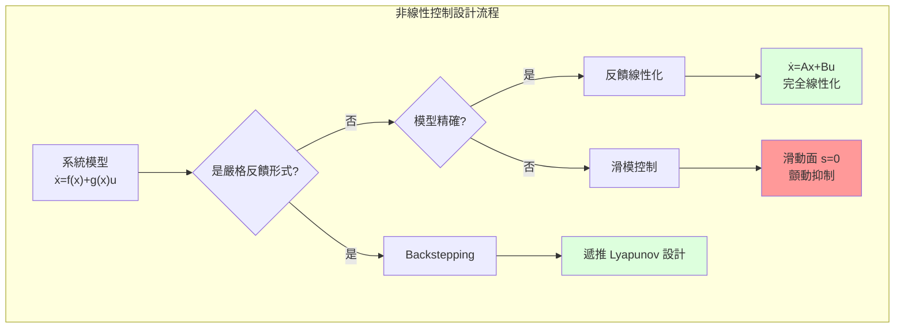
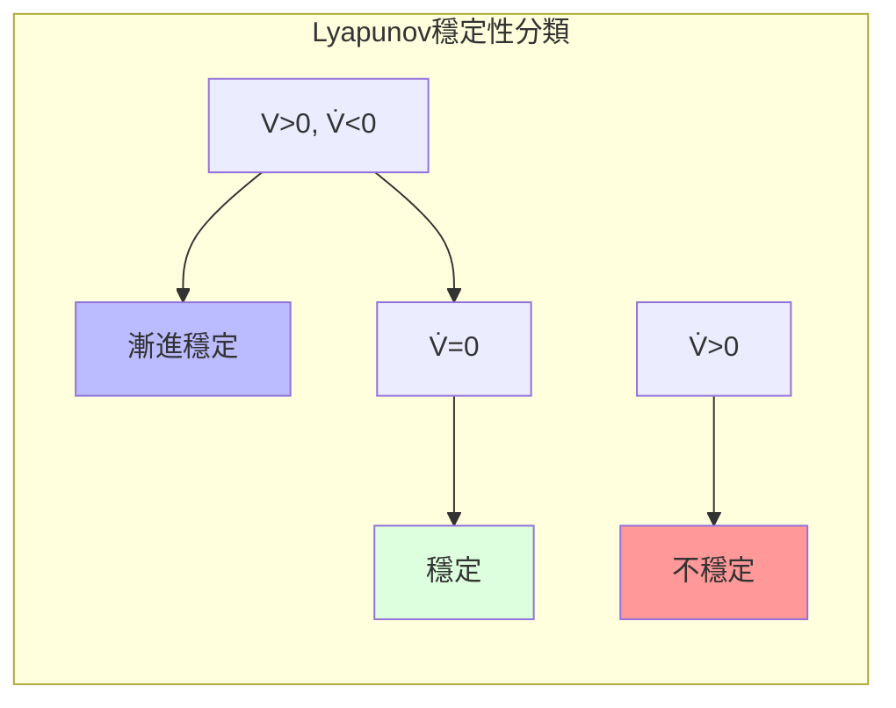

# MAEG5070 Nonlinear Control Systems

**CUHK MAE | Major Elective | 3 units**
**Stream**: Robotics and Automation

---

## Official Description

This course consists of two parts. The first part is analysis of nonlinear systems, which includes state space description of nonlinear control systems, phase plane analysis of second order dynamic systems, Lyapunov's stability theory such as Lyapunov's first method, second method, Barbalat's lemma, and total stability. The second part is design of nonlinear control systems, which includes Jacobian linearization, feedback linearization, sliding mode control, and backstepping method.

**Learning Outcomes**: (1) Understand nonlinear dynamics; (2) Apply Lyapunov methods; (3) Design feedback linearization; (4) Implement sliding mode control; (5) Design backstepping controllers.

**Textbook**: H.K. Khalil, *Nonlinear Systems*, 3rd Edition, Prentice Hall.
**Reference**: J.-J.E. Slotine and W. Li, *Applied Nonlinear Control*.

---

## 問題 1：5 個核心心智模型

### 1.1 李雅普諾夫穩定性 — 系統穩定性的能量方法

**方程式 / 核心原理**：
$$\dot{x} = f(x), \quad f(0) = 0 \quad \text{（原點平衡）}$$

**Lyapunov 第一方法（間接法）**：
$$A = \left.\frac{\partial f}{\partial x}\right|_{x=0}, \quad \text{Re}(\lambda_i(A)) < 0 \Rightarrow \text{局部漸進穩定}$$

**Lyapunov 第二方法（直接法）**：
$$V(x) > 0 \quad \forall x \neq 0, \quad \dot{V}(x) = \frac{\partial V}{\partial x}f(x) \leq 0 \Rightarrow \text{穩定}$$

**關鍵數字**：
- $V$ 正定：$V(x) > 0$，$V(0) = 0$
- $\dot{V}$ 負定：$\dot{V}(x) < 0$，$\forall x \neq 0$ → 漸進穩定
- 控制 Lyapunov 函數（CLF）：$\min_{(u)} \dot{V} < 0$

**學者引用**：Khalil (2002) — "The Lyapunov direct method is the most powerful tool for analyzing stability of nonlinear systems without requiring explicit solution of differential equations."

**工程意義**：機器人系統的非線性動力學（離心力、哥氏力耦合）不能使用線性理論分析。Lyapunov 方法是分析和設計機器人非線性控制器的數學基礎。

---

### 1.2 相平面分析 — 二維非線性系統的圖形分析

**方程式 / 核心原理**：
$$\ddot{x} + f(x, \dot{x}) = 0 \quad \Rightarrow \quad \frac{d\dot{x}}{dx} = \frac{-f(x,\dot{x})}{\dot{x}}$$

**極限環 (Limit Cycle)**：
- 穩定極限環：鄰近軌線收斂到環
- 不穩定極限環：鄰近軌線發散
- 吸引域 (basin of attraction)：$\to$ 極限環的初始條件集合

**關鍵數字**：
- Van der Pol 振盪器：$\mu = 1$（典型參數）
- 極限環半徑：穩定振盪器的振幅由系統參數決定
- 分岔參數：控制極限環的出現/消失

**學者引用**：Khalil — "Phase plane analysis provides qualitative insight into nonlinear dynamics that cannot be obtained from linearization."

---

### 1.3 反饋線性化 — 精確消除非線性

**方程式 / 核心原理**：
$$\dot{x} = f(x) + g(x)u \quad \Rightarrow \quad u = \frac{1}{L_g L_f^{r-1}h(x)}\left(-L_f^r h(x) + v\right)$$

**相對階 (Relative Degree)**：$r$，使 $L_g L_f^{k}h(x) = 0$（$k < r-1$）而 $L_g L_f^{r-1}h(x) \neq 0$。

**輸入-輸出線性化**：
$$y^{(r)} = v \quad \Rightarrow \quad \text{輸入-輸出變換為 } \frac{1}{s^r}v$$

**學者引用**：Isidori (1995) — "Feedback linearization transforms a nonlinear system into a linear controllable form through a change of coordinates and state feedback."

**工程意義**：對於完全驅動的機械臂 $(\mathbf{M}(\mathbf{q})\ddot{\mathbf{q}} + \mathbf{C}(\mathbf{q},\dot{\mathbf{q}}) = \mathbf{u})$，通過反饋線性化可以設計全局漸進穩定的軌跡跟蹤控制器 $\mathbf{u} = \hat{\mathbf{M}}(\mathbf{q})\mathbf{v} + \hat{\mathbf{C}}(\mathbf{q},\dot{\mathbf{q}})$。

---

### 1.4 滑模控制 — 對模型不確定性的魯棒性

**方程式 / 核心原理**：
$$s = \dot{e} + \lambda e = 0 \quad \text{（滑動面）}$$
$$u = -K\text{sgn}(s) \quad \text{（到達條件）}$$
$$\dot{s} = -\eta\text{sgn}(s), \quad \eta > 0 \quad \text{（到達條件：確保有限時間到達）}$$

**等效控制**：
$$u_{eq} = \frac{1}{L_g L_f^{r-1}h}\left(-L_f^r h + \ddot{y}_d\right) \quad \text{（理想滑動運動）}$$

**關鍵數字**：
- 切換頻率：$f_{chatter} \approx 1\text{–}10\text{ kHz}$（實務）
- 等速收斂參數：$\eta > |\Delta u_{max}|$（魯棒性條件）
- 邊界層厚度：$\Phi$ 越大 → 顫動越小，但追蹤誤差越大

**學者引用**：Utkin (1992) — "Sliding mode control guarantees robustness to matched uncertainties once the system reaches the sliding surface."

---

### 1.5 反步法控制 — 遞推設計

**方程式 / 核心原理**：
系統分解：
$$\dot{x}_1 = f_1(x_1) + g_1(x_1)x_2$$
$$\dot{x}_2 = f_2(x) + g_2(x)u$$

**步驟 1**：對第一個子系統，取 Lyapunov 函數 $V_1 = \frac{1}{2}z_1^2$，$z_1 = x_1 - x_{1d}$，設計虛擬控制 $\alpha_1 = -c_1 z_1 + \dot{x}_{1d} - f_1(x_1)/g_1(x_1)$

**步驟 2**：對擴展系統，取 $V_2 = V_1 + \frac{1}{2}(x_2 - \alpha_1)^2$，遞推到最後一步設計 $u$

**學者引用**：Khalil — "Backstepping provides a recursive framework for designing stabilizing controls for strict-feedback systems."

---

## 問題 2：3 個根本分歧

### A/B 分歧 1：Lyapunov 直接法 vs. 間接法

**A 方（直接法）**：構造 Lyapunov 函數 $V(x)$，無需線性化，適用於全局/局部穩定性分析。缺點：需要猜測 $V(x)$。

**B 方（間接法）**：分析 Jacobians 的特徵值，簡單直接。缺點：只在平衡點鄰域有效，無法判斷全局穩定性。

引用：Khalil — 直接法是分析非線性穩定性的首選工具。

---

### A/B 分歧 2：反饋線性化 vs. 滑模控制

**A 方（反饋線性化）**：需要精確的系統模型，實現精確的動態控制。缺點：對模型不確定性敏感。

**B 方（滑模控制）**：對匹配不確定性完全魯棒，不需要精確模型。缺點：顫動（chattering）。

引用：Slotine & Li — "Feedback linearization requires a good model; sliding mode control requires only the bounds of uncertainty."

---

### A/B 分歧 3：局部 vs. 全局穩定性

**A 方（局部穩定性）**：只保證在平衡點某鄰域內穩定。非線性剛性系統通常只能保證局部穩定。

**B 方（全局穩定性）**：從任何初始條件都收斂到平衡點。需要強烈的非線性結構（如存在徑向無界的 Lyapunov 函數）。

引用：Khalil — "Most practical nonlinear systems have limited regions of attraction; determining the actual region of attraction is as important as proving stability."

---

## 問題 3：10 個深度問題

1. 分析 Van der Pol 振盪器 $\ddot{x} - \mu(1-x^2)\dot{x} + x = 0$ 的相平面特性，確定極限環的存在性和穩定性。

2. 用 Lyapunov 直接法分析保守系統（無阻尼單擺 $\ddot{\theta} + \frac{g}{L}\sin\theta = 0$）的能量函數 $V = \frac{1}{2}\dot{\theta}^2 - \frac{g}{L}\cos\theta$，並說明為什麼此系統僅穩定而非漸進穩定。

3. 設計一個反饋線性化控制器，用於控制二階非線性系統 $\dot{x}_1 = x_2$，$\dot{x}_2 = -x_1 + x_2^3 + u$，將其轉換為兩個獨立的積分器串聯系統。

4. 推導機械臂反饋線性化控制器的設計步驟，給定 $\mathbf{M}(\mathbf{q})\ddot{\mathbf{q}} + \mathbf{C}(\mathbf{q},\dot{\mathbf{q}})\dot{\mathbf{q}} = \mathbf{u}$，證明控制輸入 $\mathbf{u} = \mathbf{M}(\mathbf{q})\mathbf{v} + \mathbf{C}(\mathbf{q},\dot{\mathbf{q}})\dot{\mathbf{q}}$ 實現輸入-輸出線性化。

5. 設計一個滑模控制器用於倒單擺系統，確定滑動面 $s = c e + \dot{e}$ 和切換控制 $u = -K\text{sgn}(s)$，分析顫動問題並提出邊界層（boundary layer）改進方法。

6. 用反步法設計一個嚴格反饋形式系統的穩定控制器：
   $\dot{x}_1 = x_1^2 + x_2$，$\dot{x}_2 = x_1 + u$。逐步設計虛擬控制和實際控制，驗證 Lyapunov 函數遞減。

7. 解釋 Barbalat's Lemma 的應用條件，說明為什麼在非自治系統（非定常）的穩定性分析中需要 Barbalat's Lemma。

8. 比較 Jacobian 線性化和精確反饋線性化的區別，給出具體例子說明在什麼條件下兩者是等价的。

9. 設計一個基於 CLF（Control Lyapunov Function）的實時最優控制律，並說明與滑模控制的聯繫。

10. 分析機器人操縱器的力控制（force control）和位置控制（position control）的非線性控制方法差異，說明阻抗控制（impedance control）的 Lyapunov 穩定性分析方法。

---

# 核心心智模型深化（中英對照）

## 1. 穩定性理論 — 1.1

### 1.1.1 穩定性分類

| 類型 | 定義 | Lyapunov 方法 |
|------|------|------------|
| 穩定 (Stable) | $\|x(t)\| \leq b, \forall t \geq 0$ | $\dot{V} \leq 0$ |
| 漸進穩定 (Asymptotically stable) | $\lim_{t\to\infty} x(t) = 0$ | $\dot{V} < 0$ |
| 指數穩定 (Exponentially stable) | $\|x(t)\| \leq Ce^{-\lambda t}$ | $V \geq a\|x\|^2, \dot{V} \leq -b\|x\|^2$ |
| 不穩定 | $\exists \epsilon > 0, \forall \delta > 0, \exists x_0, \|x_0\|<\delta, \exists t, \|x(t)\|>\epsilon$ | — |

### 1.1.2 Lasalle's 不變性原理

若 $\dot{V} \leq 0$，定義 $\Omega = \{x | \dot{V}(x) = 0\}$，則所有軌線收斂到 $\Omega$ 中的最大不變集。

### 1.1.3 穩定魯棒性邊界

$$\|x(t)\| \leq \beta(\|x_0\|, t) + \gamma \sup_{0\leq\tau\leq t}\|d(\tau)\|$$

---

## 2. 滑模控制細節 — 2.1

### 2.1.1 顫動抑制方法

- 邊界層平滑：$u = -K\frac{s}{\|s\| + \phi}$（連續近似）
- 高階滑模（SOSM）：二階滑模 $\ddot{s} + k_1\dot{s} + k_2 s = 0$

### 2.1.2 匹配不確定性

$$\dot{x} = Ax + Bu + \underbrace{D\xi(t,x)}_{\text{匹配}} \quad D \in \mathcal{R}^{n\times p}, \ B \in \mathcal{R}^{n\times m}$$

滑模對 $\xi$ 完全魯棒。

### 2.1.3 輸出滑模控制

當無法獲取全狀態時，可使用輸出反饋滑模控制，但需要觀測器。

---

## 深度自測問題詳解

**Q1**: Van der Pol：令 $x_1 = x$，$x_2 = \dot{x}$，$\dot{x}_1 = x_2$，$\dot{x}_2 = \mu(1-x_1^2)x_2 - x_1$。當 $x_1^2 > 1$，$\dot{x}_2 > 0$ 加速；當 $x_1^2 < 1$，$\dot{x}_2 < 0$ 減速 → 形成閉合極限環。穩定性由 Lyapunov 指數確定。

**Q4**: 證明：
$$\dot{\mathbf{q}} = \mathbf{M}^{-1}(\mathbf{u} - \mathbf{C}\dot{\mathbf{q}})$$

代入 $\mathbf{u} = \mathbf{M}\mathbf{v} + \mathbf{C}\dot{\mathbf{q}}$ → $\ddot{\mathbf{q}} = \mathbf{v}$（線性積分器鏈！）

**Q6**: 
- 步驟1：$z_1 = x_1 - 0$，$V_1 = \frac{1}{2}z_1^2$，$\dot{V}_1 = z_1(x_1^2 + x_2)$
- 取 $\alpha_1 = -c_1 z_1 - x_1^2$ → $\dot{V}_1 = -c_1 z_1^2 + z_1(z_2)$，其中 $z_2 = x_2 - \alpha_1$
- 步驟2：$V_2 = V_1 + \frac{1}{2}z_2^2$，$\dot{V}_2 = -c_1 z_1^2 + z_2(x_1 + u - \dot{\alpha}_1)$
- 取 $u = -c_2 z_2 - z_1 - x_1 + \dot{\alpha}_1$ → $\dot{V}_2 = -c_1 z_1^2 - c_2 z_2^2 \leq 0$ ✓

---

## 5 個 Mermaid 圖解

---

## 總結

MAEG5070 Nonlinear Control Systems 是 IRE 中最高級的控制理論課程，為機器人控制的非線性動力學提供完整的數學工具。

**核心知識鏈**：
$$\text{Lyapunov穩定性} \xrightarrow{\text{直接/間接}} \text{穩定性分析} \xrightarrow{\text{反饋線性化}} \text{軌跡跟蹤} \xrightarrow{\text{滑模}} \text{魯棒控制} \xrightarrow{\text{反步法}} \text{遞推設計}$$

**推薦閱讀**：
1. Khalil Ch. 1-6（穩定性理論）
2. Slotine & Li Ch. 8-9（滑模控制）
3. Spong Ch. 6（機器人非線性控制）

**IRE 銜接重點**：
- **ENGG5402**：機器人控制中的非線性動力學
- **MAEG5090**：Advanced Topics 中的實際應用
