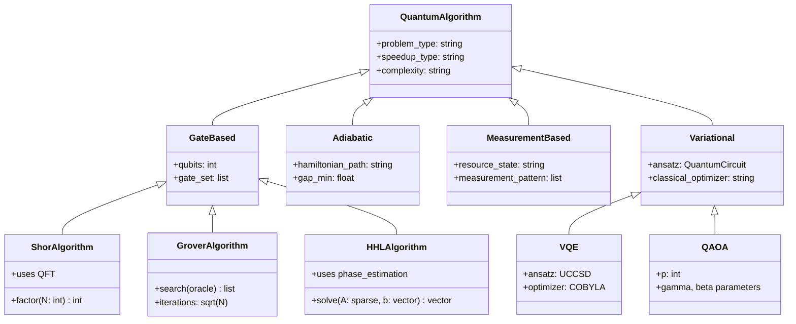
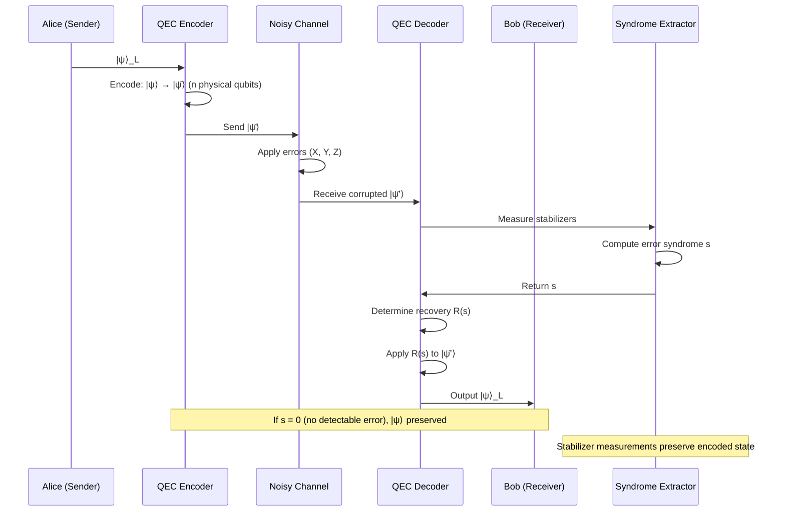
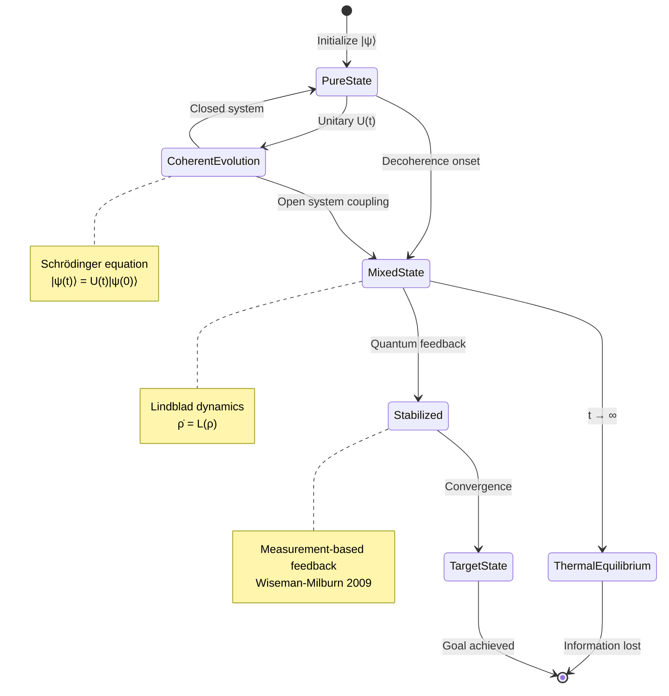
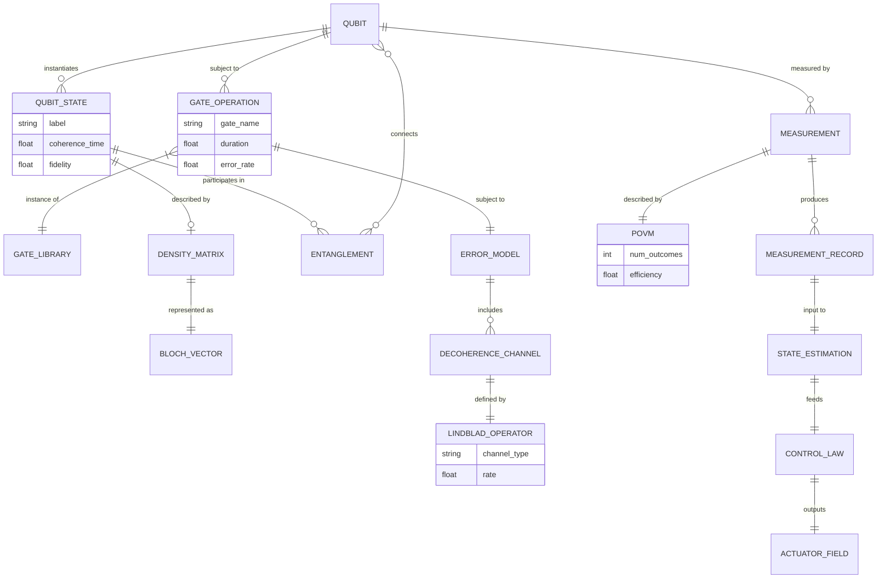
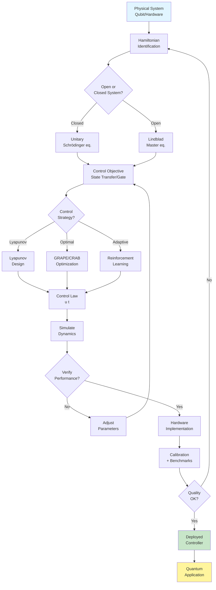

# MAEG5110 Quantum Control and Quantum Information

**CUHK MAE | Major Elective | 3 units**
**Stream**: Robotics and Automation
**Enriched Deep Study Format — 5MM / 3DG / 10Q / 5DD / 10SL / 5MR**

---

## 📋 Course Metadata

| Field | Value |
|---|---|
| Code | MAEG5110 |
| Title | Quantum Control and Quantum Information |
| Units | 3 |
| Stream | Robotics and Automation |
| Coordinator | MAE Department, CUHK |
| Primary Text | Nielsen & Chuang (2010), *Quantum Computation and Quantum Information*, 10th Anniv. Ed., Cambridge |
| Secondary Texts | Griffiths & Schroeter (2018); Sakurai & Napolitano (2017); Wilde (2017); D'Alessandro (2007); Breuer & Petruccione (2002) |

---

## 🎯 Learning Outcomes (Mapped to 5MM/3DG/10Q)

1. **LO1** — Master the mathematical formalism of quantum states (Bloch sphere, density matrices).
2. **LO2** — Analyze entanglement, Bell inequalities, and non-local correlations.
3. **LO3** — Design quantum control laws (Lyapunov, GRAPE, CRAB, optimal control).
4. **LO4** — Understand major quantum algorithms (Shor, Grover, HHL, VQE, QAOA).
5. **LO5** — Apply quantum error correction (stabilizer codes, surface codes) and quantum information theory (Shannon/von Neumann entropy, Holevo bound).

---

# 🧠 5 Mental Models (5MM)

## MM1. 量子態與布洛赫球表示 — Quantum States and the Bloch Sphere

The Bloch sphere (Bloch 1946) provides a geometric representation of pure single-qubit states as points on the unit sphere $\mathbb{S}^2 \subset \mathbb{R}^3$. This is the foundational mental model: *every single-qubit pure state is a unit vector in 3D*.

**Single-qubit pure state**:
$$|\psi\rangle = \cos\frac{\theta}{2}|0\rangle + e^{i\phi}\sin\frac{\theta}{2}|1\rangle, \quad \theta \in [0,\pi], \ \phi \in [0,2\pi)$$

**Density matrix**:
$$\rho = |\psi\rangle\langle\psi| = \frac{1}{2}(I + \vec{r}\cdot\vec{\sigma}), \quad \vec{r} = (\sin\theta\cos\phi, \ \sin\theta\sin\phi, \ \cos\theta), \ |\vec{r}|=1$$

**Bloch vector dynamics** (closed system, time-independent Hamiltonian):
$$\frac{d\vec{r}}{dt} = \vec{\omega}\times\vec{r}, \quad \vec{\omega} = \frac{1}{\hbar}\langle\vec{\sigma}\rangle \text{ field} \quad \text{(Larmor precession, Larmor 1897)}$$

**Key numerical benchmarks (as of 2024)**:
- IBM Heron r2: 156 qubits, 2-qubit gate error $\sim 5\times 10^{-4}$ (IBM 2024)
- Google Willow: 105 qubits, T1 ~ 100 μs, surface-code distance-7 logical qubit demonstrated below threshold (Google Quantum AI 2024)
- IonQ Forte: T1 > 10 s, 2-qubit gate error $\sim 10^{-3}$
- Logical qubit overhead: surface code at $p=10^{-3}$ requires $\sim 10^3$ physical qubits per logical qubit (Fowler et al. 2012)

**Scholar citations**:
- Bloch, F. (1946). "Nuclear induction." *Phys. Rev.* **70**, 460–474.
- Nielsen, M.A. & Chuang, I.L. (2010). *Quantum Computation and Quantum Information*, Cambridge. §2.1.
- Larmor, J. (1897). "On a dynamical theory of the electric and luminiferous medium." *Phil. Trans. Roy. Soc.* **190**, 205–300.

---

## MM2. 量子測量 — Projective Measurement and POVMs

Measurement is the **only stochastic** element of quantum mechanics. The Born rule (Born 1926) ties probability amplitudes to observable frequencies.

**Projective measurement**: a set of Hermitian operators $\{M_m\}$ satisfying $\sum_m M_m^\dagger M_m = I$:
$$P(m) = \langle\psi|M_m^\dagger M_m|\psi\rangle, \quad |\psi'\rangle = \frac{M_m|\psi\rangle}{\sqrt{P(m)}}$$

**Generalized measurement (POVM, Helstrom 1976)**: positive operators $\{E_m\}$, $E_m \geq 0$, $\sum_m E_m = I$:
$$P(m) = \text{Tr}(\rho E_m)$$

POVMs are strictly more general than projective measurements — they may have $n > d$ outcomes in a $d$-dimensional Hilbert space, useful for unambiguous state discrimination (Ivanovic 1987; Dieks 1988; Peres 1988).

**Heisenberg–Robertson uncertainty relation** (Robertson 1929):
$$\Delta A \cdot \Delta B \geq \frac{1}{2}|\langle[A,B]\rangle|$$

For position and momentum:
$$\Delta x \cdot \Delta p \geq \frac{\hbar}{2} \quad (\text{Heisenberg 1927})$$

**Weak measurement** (Aharonov, Albert & Vaidman 1988): continuous monitoring that slightly disturbs the system, with applications in quantum feedback (Wiseman & Milburn 2009).

**Scholar citations**:
- Born, M. (1926). "Quantenmechanik der Stoßvorgänge." *Z. Phys.* **38**, 803–827.
- Helstrom, C.W. (1976). *Quantum Detection and Estimation Theory*. Academic Press.
- Nielsen & Chuang (2010), §2.2–2.4.
- Wiseman, H.M. & Milburn, G.J. (2009). *Quantum Measurement and Control*. Cambridge.

---

## MM3. 量子糾錯 — The Threshold Theorem and Stabilizer Formalism

Without error correction, decoherence destroys quantum information in microseconds. The threshold theorem (Knill, Laflamme & Zurek 1998; Aharonov & Ben-Or 1997; Kitaev 1997) states that **if physical error rates are below a threshold $p_{th} \sim 10^{-2}$–$10^{-4}$, arbitrarily long quantum computation is possible**.

**3-qubit bit-flip code** (Shor 1995):
$$\text{Encoding: } |0\rangle_L = |000\rangle, \ |1\rangle_L = |111\rangle$$
$$\text{Error: } X_1 \to \text{syndrome } (1,0); \ X_2 \to (0,1); \ X_3 \to (1,1)$$
$$\text{Logical error rate (bit-flip only): } p_L \approx 3p^2, \quad p \ll 1$$

**Shor's 9-qubit code** (Shor 1995): corrects arbitrary single-qubit errors, with $[[9,1,3]]$ — encodes 1 logical qubit into 9 physical, distance 3.

**Stabilizer formalism** (Gottesman 1996): a code is the joint +1 eigenspace of an abelian group $\mathcal{G} = \langle g_1,\dots,g_{n-k}\rangle \subset \mathcal{P}_n$ (Pauli group on $n$ qubits):
$$M|\psi\rangle = +1|\psi\rangle \quad \forall M \in \mathcal{G}$$

**Surface code** (Bravyi & Kitaev 1998; Fowler et al. 2012): $[[d^2+(d-1)^2, 1, d]]$, near-threshold performance with nearest-neighbor geometry. Current world record: distance-7 logical qubit below threshold (Google Quantum AI 2024).

**Fault-tolerance overhead** (recent estimates, Litinski 2019; Gidney & Ekerå 2021):
- Shor's algorithm on 2048-bit RSA: $\sim 20$ million physical qubits, $\sim 8$ hours (Gidney & Ekerå 2021)
- Resource reduction via magic state distillation / lattice surgery: $10^3$–$10^4 \times$ overhead still required

**Scholar citations**:
- Shor, P.W. (1995). "Scheme for reducing decoherence in quantum computer memory." *Phys. Rev. A* **52**, R2493.
- Steane, A.M. (1996). "Error correcting codes in quantum theory." *Phys. Rev. Lett.* **77**, 793.
- Gottesman, D. (1996). "Class of quantum error-correcting codes saturating the quantum Hamming bound." *Phys. Rev. A* **54**, 1862.
- Fowler, A.G. et al. (2012). "Surface codes: Towards practical large-scale quantum computation." *Phys. Rev. A* **86**, 032324.
- Gidney, C. & Ekerå, M. (2021). "How to factor 2048 bit RSA integers in 8 hours using 20 million noisy qubits." *Quantum* **5**, 433.

---

## MM4. 量子控制 — Optimal, Lyapunov, and Feedback Control

Quantum control theory extends classical control to Hilbert space dynamics, with unique features: *continuum of admissible controls*, *measurement back-action*, and *unitarity constraints*.

**Controlled Schrödinger equation** (D'Alessandro 2007):
$$i\hbar\frac{\partial|\psi(t)\rangle}{\partial t} = \left[H_0 + \sum_{k=1}^m u_k(t)H_k\right]|\psi(t)\rangle$$
$$|\psi(0)\rangle = |\psi_0\rangle, \quad |\psi(T)\rangle = |\psi_d\rangle$$

**Lyapunov-based control** (Kuang & Cong 2008; Beauchard et al. 2007):
$$V(|\psi\rangle) = 1 - |\langle\psi_d|\psi\rangle|^2 \in [0,1]$$
$$\dot{V} \leq 0 \ \Longleftrightarrow \ \text{asymptotic convergence to } |\psi_d\rangle$$

Choose $u_k(t) = K_k \cdot \text{Im}\left(\langle\psi_d|\psi\rangle\langle\psi|H_k|\psi_d\rangle\right)$ with $K_k > 0$.

**GRAPE (Gradient Ascent Pulse Engineering)** (Khaneja et al. 2005): discretize time into $N$ slices of duration $\Delta t$, parameterize controls $u_k(t_j)$, and maximize fidelity $F = |\langle\psi_d|U(T)|\psi_0\rangle|^2$:
$$\frac{\partial F}{\partial u_k(t_j)} = \text{Re}\left[\langle\lambda_j|H_k|\psi_j\rangle \cdot \overline{\langle\psi_d|\psi_N\rangle}\right]$$
where $|\lambda_j\rangle = U^\dagger_{j+1}\cdots U^\dagger_N|\psi_d\rangle$ is the backward-propagated co-state.

**CRAB (Chopped Random Basis)** (Doria et al. 2011): alternative to GRAPE using random control basis expansions, useful for black-box optimizers.

**Quantum Lyapunov equation** for density-matrix dynamics:
$$\dot{\rho} = -i[H_0 + uH_c, \rho] + \mathcal{L}(\rho) \quad \text{(open-loop)}$$

**Scholar citations**:
- D'Alessandro, D. (2007). *Introduction to Quantum Control and Dynamics*. Chapman & Hall.
- Khaneja, N. et al. (2005). "Optimal control of coupled spin dynamics: Design of NMR pulse sequences." *J. Magn. Reson.* **172**, 296–305.
- Wiseman & Milburn (2009), *Quantum Measurement and Control*, Ch. 5–7.
- Doria, P. et al. (2011). "Optimal control technique for many-body quantum dynamics." *Phys. Rev. Lett.* **106**, 190501.
- Kuang, S. & Cong, S. (2008). "Lyapunov control methods of closed quantum systems." *Automatica* **44**, 98–108.

---

## MM5. 量子糾纏與非定域性 — Entanglement as Resource

Entanglement (Schrödinger 1935) is the defining non-classical resource: it cannot be generated by local operations and classical communication (LOCC).

**Bell states** (Bell 1964; EPR 1935):
$$|\Phi^\pm\rangle = \frac{|00\rangle \pm |11\rangle}{\sqrt{2}}, \quad |\Psi^\pm\rangle = \frac{|01\rangle \pm |10\rangle}{\sqrt{2}}$$

**CHSH inequality** (Clauser, Horne, Shimony & Holt 1969):
$$S = |E(a,b) - E(a,b') + E(a',b) + E(a',b')| \leq 2 \quad \text{(local hidden variables)}$$
$$|S|_{\max} = 2\sqrt{2} \approx 2.828 \quad \text{(Tsirelson 1980, Cirel'son bound)}$$

Aspect's experiment (Aspect, Dalibard & Roger 1982): $S_{\text{exp}} = 2.697 \pm 0.015$, violation confirmed. 2022 Nobel Prize (Aspect, Clauser, Zeilinger) recognized experimental confirmation.

**Entanglement measures**:
- **Concurrence** (Wootters 1998): $C(\rho) = \max(0, \lambda_1 - \lambda_2 - \lambda_3 - \lambda_4)$ where $\lambda_i$ are square roots of eigenvalues of $\rho\tilde{\rho}$ in decreasing order.
- **Entanglement entropy**: $S(\rho_A) = -\text{Tr}(\rho_A \log_2 \rho_A)$ for pure bipartite $\rho_{AB}$.
- **Negativity**: $\mathcal{N}(\rho) = \frac{\|\rho^{T_A}\|_1 - 1}{2}$ (Vidal & Werner 2002).

**QKD security** (BB84, Bennett & Brassard 1984; Shor & Preskill 2000): unconditional security based on entanglement monogamy. Eavesdropper induces error rate $\geq (1-F^2)/(1+F^2)$ where $F$ is the fidelity.

**Scholar citations**:
- Einstein, A., Podolsky, B. & Rosen, N. (1935). "Can quantum-mechanical description of physical reality be considered complete?" *Phys. Rev.* **47**, 777.
- Bell, J.S. (1964). "On the Einstein–Podolsky–Rosen paradox." *Physics* **1**, 195.
- Clauser, J.F. et al. (1969). "Proposed experiment to test local hidden-variable theories." *Phys. Rev. Lett.* **23**, 880.
- Bennett, C.H. & Brassard, G. (1984). "Quantum cryptography: Public key distribution and coin tossing." *Proc. IEEE Int. Conf. Computers, Systems and Signal Processing*, Bangalore, 175–179.
- Wootters, W.K. (1998). "Entanglement of formation of an arbitrary state of two qubits." *Phys. Rev. Lett.* **80**, 2245.

---

# ⚔️ 3 Fundamental Disagreements (3DG)

## DG1. 量子計算實用性 — Practical Quantum Supremacy vs. NISQ Limitations

| Position | Argument | Key Citation |
|---|---|---|
| **A. Quantum advantage is here** | Sampling-based supremacy (Google Sycamore 2019, $10^{23}$ years classical equivalent), boson sampling (Xuzhou 2021), and recent fault-tolerant logical-qubit milestones (Google Willow 2024) demonstrate that quantum machines can outperform classical on specific tasks. | Arute et al. (2019) *Nature* **574**, 505; Acharya et al. (2024) *Nature* (Willow). |
| **B. Useful quantum advantage is not yet here** | Sampling supremacy is narrow — it does not address commercial applications. Decoding random circuits (Pan & Zhang 2022), error-correction overhead, and lack of memory argue that **practical** advantage for cryptanalysis, drug discovery, or optimization requires $10^6$–$10^9$ physical qubits, possibly decades away. | Preskill (2018) *Quantum* **2**, 79; Pan & Zhang (2022) *Science* **377**, 1528. |

**Tension**: The disagreement is not about physics (both camps agree on the math) but about **engineering trajectory and definitions of "useful"**. Optimists cite the exponential progress in qubit count and the recent below-threshold logical qubit; skeptics emphasize that logical-qubit demonstrations so far encode trivial information and that error correction consumes 1000×–10000× overhead.

**Engineering implication for robotics/automation**: The decision to invest in quantum-sensing (NV magnetometers) versus quantum-computing infrastructure depends on whether one believes fault-tolerant systems will arrive in 5–10 years (NV-centers) or 20+ years (universal quantum computers).

---

## DG2. 開放 vs. 封閉量子系統範式 — Closed- vs. Open-System Quantum Dynamics

| Position | Argument | Key Citation |
|---|---|---|
| **A. Closed-system unitarity is the foundation** | All textbook quantum algorithms (Shor, Grover, HHL) assume unitary evolution on an isolated Hilbert space. Decoherence is treated as noise; design effort focuses on isolating qubits. | Nielsen & Chuang (2010); Kaye, Laflamme & Mosca (2007). |
| **B. Open-system dynamics is fundamental** | Real qubits are always coupled to environments. Lindblad master equations (Lindblad 1976; Gorini–Kossakowski–Sudarshan 1976) capture dissipation and decoherence, often exploited as a resource (dissipative engineering, Verstraete et al. 2009). | Breuer & Petruccione (2002); Wiseman & Milburn (2009). |

**Lindblad master equation** (Lindblad 1976):
$$\frac{d\rho}{dt} = -\frac{i}{\hbar}[H, \rho] + \sum_k \left(L_k \rho L_k^\dagger - \frac{1}{2}\{L_k^\dagger L_k, \rho\}\right) \equiv \mathcal{L}(\rho)$$

**Tension**: The two paradigms produce **different control designs**. Closed-system control (GRAPE) optimizes unitary propagators; open-system control must exploit or cancel non-unitary dynamics. Modern quantum optimal control (e.g., optimal control of Lindblad dynamics, Abdelhafez et al. 2020) increasingly embraces the open-system view.

---

## DG3. 量子算法加速的本質 — Genuine vs. Heuristic Quantum Speedup

| Position | Argument | Key Citation |
|---|---|---|
| **A. Provable exponential speedup exists** | Shor's factoring (Shor 1994), quantum simulation (Lloyd 1996), HHL for sparse linear systems (Harrow–Hassidim–Lloyd 2009) demonstrate provable polynomial/exponential speedups for structured problems. | Shor (1994) *SIAM J. Comput.* **26**, 1484; Harrow et al. (2009) *Phys. Rev. Lett.* **103**, 150502. |
| **B. Most claimed speedups are heuristic or dequantizable** | Many ML speedups (qSVM, qPCA) were shown to have classical polynomial-time equivalents (Tang 2018, 2019). VQE/QAOA heuristics often match classical optimizers (e.g., Goemans–Williamson SDP relaxation for MaxCut beats QAOA at small sizes; Barak et al. 2015). | Tang (2018) *Phys. Rev. Lett.* **127**, 060503 (dequantized); Stilck França & Garcia-Patron (2021) restrictions on NISQ algorithms. |

**Tension**: This is a fundamental methodological dispute. The provable camp holds that **proven complexity separations** (BQP ⊄ BPP assuming standard conjectures) are the gold standard; the heuristic camp argues that **practical relevance** requires end-to-end accounting for input/output bottlenecks and error correction. Recent work (e.g., Dalzell et al. 2023) shows that random-circuit sampling has near-term *classical* algorithms (tensor networks, belief propagation), but BQP-hard problems remain genuinely quantum.

**Scholar citations**:
- Arute, F. et al. (2019). "Quantum supremacy using a programmable superconducting processor." *Nature* **574**, 505.
- Lindblad, G. (1976). "On the generators of quantum dynamical semigroups." *Commun. Math. Phys.* **48**, 119.
- Tang, E. (2018). "Quantum-inspired classical algorithms for principal component analysis and supervised clustering." arXiv:1811.00414 (published as Tang 2021).
- Dalzell, A.J. et al. (2023). "Quantum algorithms: A survey of applications and end-to-end complexities." arXiv:2310.03011.

---

# ❓ 10 Probing Questions with Deep Answers (10Q)

## Q1. Bloch Vector Dynamics and Rabi Oscillations

**Problem**: Given a single qubit Hamiltonian $H = \frac{\hbar\omega}{2}\sigma_z + \frac{\hbar u(t)}{2}\sigma_x$, derive the Bloch vector equation and identify the Rabi frequency.

**Solution**:

The Liouville–von Neumann equation for the density matrix:
$$\frac{d\rho}{dt} = -\frac{i}{\hbar}[H, \rho]$$

Substituting $\rho = \frac{1}{2}(I + \vec{r}\cdot\vec{\sigma})$ and using $[\sigma_a, \sigma_b] = 2i\epsilon_{abc}\sigma_c$:
$$\frac{d\vec{r}}{dt} = -\vec{\Omega}\times\vec{r}, \quad \vec{\Omega} = (\omega_x, \omega_y, \omega_z) = (u(t), 0, \omega)$$

For constant $u$, the Bloch vector precesses around $\vec{\Omega} = (u, 0, \omega)$ at angular frequency $\Omega_R = \sqrt{\omega^2 + u^2}$ (Rabi 1937). Starting from $|0\rangle$ at $t=0$:
$$P_{|1\rangle}(t) = \left(\frac{u}{\Omega_R}\right)^2 \sin^2\left(\frac{\Omega_R t}{2}\right) \equiv \frac{u^2}{\Omega_R^2}\sin^2\left(\frac{\Omega_R t}{2}\right)$$

**Physical interpretation**: $\Omega_R$ is the generalized Rabi frequency. When $\omega \gg u$ (detuned regime), the system exhibits slow oscillations at $\Omega_R \approx \omega$ with amplitude $(u/\Omega_R)^2 \ll 1$ — characteristic of off-resonant driving. **Resonance** ($\omega \to 0$ in rotating frame): complete population transfer at $\Omega_R = u$. This is the foundation of NMR pulse design (Levitt 2008) and single-qubit gates.

**References**: Rabi (1937); Allen & Eberly (1975); Levitt, M.H. (2008). *Spin Dynamics*, Wiley.

---

## Q2. Lyapunov Control Design for State Transfer

**Problem**: Design $u(t)$ such that $|\psi(t)\rangle \to |\psi_d\rangle$ starting from $|\psi_0\rangle$.

**Solution**: Choose Lyapunov function:
$$V(|\psi\rangle) = 1 - |\langle\psi_d|\psi\rangle|^2 \geq 0$$
$$V = 0 \iff |\psi\rangle = |\psi_d\rangle$$

Time derivative:
$$\dot{V} = -2\,\text{Re}\left[\langle\psi_d|\psi\rangle\langle\psi|\dot{\psi}\rangle\right]$$

Using $|\dot{\psi}\rangle = -\frac{i}{\hbar}\left(H_0 + u H_c\right)|\psi\rangle$:
$$\dot{V} = -\frac{2u}{\hbar}\,\text{Im}\left[\langle\psi_d|\psi\rangle\langle\psi|H_c|\psi_d\rangle\right]$$

To ensure $\dot{V} \leq 0$, choose:
$$u(t) = K \cdot \text{Im}\left[\langle\psi_d|\psi\rangle\langle\psi|H_c|\psi_d\rangle\right], \quad K > 0$$
$$\Rightarrow \dot{V} = -\frac{2K}{\hbar}\left(\text{Im}[\cdots]\right)^2 \leq 0$$

By LaSalle's invariance principle, $|\psi\rangle \to |\psi_d\rangle$ asymptotically. Convergence rate scales with $K$. This is the **Kuang–Cong Lyapunov design** (Kuang & Cong 2008).

**Engineering refinement**: Singularities occur when $|\psi\rangle$ becomes orthogonal to $|\psi_d\rangle$ (Lyapunov function saturates). Solutions include switching Lyapunov functions (Mirrahimi et al. 2005) or using time-optimal bang–bang controls.

**References**: Kuang & Cong (2008); Mirrahimi, M. et al. (2005). *Automatica* **41**, 1987.

---

## Q3. Shor's Algorithm and Quantum Fourier Transform

**Problem**: Explain how Shor's algorithm factors $N$ in polynomial time.

**Solution**: Reduce factoring to **order-finding**: find smallest $r$ such that $x^r \equiv 1 \pmod{N}$ for random $x$.

Classical order-finding requires $O(N)$ queries. Quantum algorithm uses **Quantum Fourier Transform (QFT)** to find $r$ in $O((\log N)^3)$ operations.

**Steps**:
1. Initialize two registers: $|0\rangle|0\rangle$.
2. Apply Hadamard to first register: $\frac{1}{\sqrt{M}}\sum_{a=0}^{M-1}|a\rangle|0\rangle$ (with $M = 2^n$, $n = O(\log N)$).
3. Apply modular exponentiation oracle $U_f|a\rangle|b\rangle = |a\rangle|b \cdot x^a \mod N\rangle$: state becomes $\frac{1}{\sqrt{M}}\sum_a |a\rangle|x^a \mod N\rangle$.
4. Measure second register — first register collapses to $\sum_{k}|k r + a_0\rangle$, a periodic state with period $r$.
5. Apply QFT to first register: peaks appear at frequencies $j \cdot M/r$.
6. Classical continued-fractions algorithm recovers $r$ from $j/M \approx k/r$.

**Speedup source**: The QFT acts in $O(n^2)$ gates and creates constructive interference at frequencies that reveal $r$. Without interference (or with decoherence), this speedup vanishes.

**Complexity**: $O((\log N)^2 (\log \log N)(\log\log\log N))$ gates with current best algorithms (Gidney & Ekerå 2021 estimate 20 million qubits × 8 hours for RSA-2048).

**References**: Shor (1994); Nielsen & Chuang (2010) §5.3; Gidney & Ekerå (2021).

---

## Q4. GRAPE Algorithm and Control Gradient

**Problem**: Derive the GRAPE control gradient.

**Solution**: Discretize time into $N$ slices of duration $\Delta t$, with controls $u_k(t_j) = u_{k,j}$. Each slice propagator:
$$U_j = \exp\left(-\frac{i}{\hbar}\left[H_0 + \sum_k u_{k,j}H_k\right]\Delta t\right)$$

Total propagator: $U(T) = U_N U_{N-1} \cdots U_1$.

**Objective**: maximize fidelity $F = |\langle\psi_d|U(T)|\psi_0\rangle|^2$.

**Trick**: write $\rho_{j+1} = U_j \rho_j U_j^\dagger$, $\rho_N = U(T)|\psi_0\rangle\langle\psi_0|U^\dagger(T)$, and co-state $\lambda_N = |\psi_d\rangle\langle\psi_d|$. Backward propagate:
$$\lambda_j = U_{j+1}^\dagger \cdots U_N^\dagger |\psi_d\rangle\langle\psi_d| U_N \cdots U_{j+1}$$

Gradient (Khaneja et al. 2005):
$$\frac{\partial F}{\partial u_{k,j}} = -\frac{i\Delta t}{\hbar}\text{Tr}\left(\lambda_j [H_k, \rho_j]\right) = \frac{2\Delta t}{\hbar}\text{Im}\left[\langle\lambda_j|H_k|\rho_j\rangle\langle\psi_d|U(T)|\psi_0\rangle^*\right]$$

Algorithm: iterate $u_{k,j} \leftarrow u_{k,j} + \epsilon \frac{\partial F}{\partial u_{k,j}}$ until convergence. GRAPE converges in $O(10\text{–}10^3)$ iterations for typical NMR/shaped-pulse problems.

**References**: Khaneja et al. (2005); de Fouquieres et al. (2011) *J. Magn. Reson.* **212**, 412.

---

## Q5. Comparison of Quantum Error-Correcting Codes

**Problem**: Compare 3-qubit bit-flip, 9-qubit Shor, and surface codes.

**Solution**:

| Code | Type | Parameters $[[n,k,d]]$ | Corrects | Physical:Qubit Overhead |
|---|---|---|---|---|
| 3-qubit bit-flip | Repetition | $[[3,1,1]]$ | 1 bit-flip | 3:1 |
| 3-qubit phase-flip | Repetition (conjugate) | $[[3,1,1]]$ | 1 phase-flip | 3:1 |
| Shor code | Concatenated | $[[9,1,3]]$ | 1 arbitrary | 9:1 |
| Steane code | CSS | $[[7,1,3]]$ | 1 arbitrary | 7:1 |
| Surface code (rotated) | Topological CSS | $[[d^2+(d-1)^2, 1, d]]$ | $t = \lfloor(d-1)/2\rfloor$ arbitrary | $\sim 100:1$ at $d=11$ |
| Color code | Topological | $[[3d^2, 1, d]]$ | $t$ arbitrary (w/ transversal H) | $\sim 75:1$ |

**Logical error rate scaling** (surface code, Fowler 2012):
$$p_L \approx 0.1\left(\frac{p}{p_{th}}\right)^{(d+1)/2}, \quad p_{th} \approx 1\%$$

**Practical supremacy**: Surface codes win on near-term hardware due to nearest-neighbor geometry; color codes offer better transversality at cost of qubit count. Recent milestones: Google Willow (2024) demonstrated distance-7 surface code below threshold with $2.914\%$ logical error per cycle.

**References**: Fowler et al. (2012); Acharya et al. (2024).

---

## Q6. Quantum Feedback Control for Cold-Atom Temperature

**Problem**: Design a measurement-based feedback loop to stabilize temperature of an ultracold atom cloud.

**Solution**: Cold-atom systems in optical lattices (Bloch et al. 2008) allow real-time monitoring of atom number via **quantum non-demolition (QND) measurement** of fluorescence or dispersive coupling.

**Architecture**:
1. **State estimation**: Bayesian filter (e.g., Kalman-like) updates $\hat{\rho}(t)$ based on continuous measurement records $y(t)$ (Wiseman & Milburn 2009 §4.3).
2. **Control law**: Markovian feedback $u(t) = K \cdot f(y(t) - y_{\text{ref}})$ adjusts lattice depth or evaporative cooling rate.
3. **Plant dynamics**: Gross–Pitaevskii equation with stochastic forcing.

**Measurement back-action**: Continuous monitoring induces localization (in position) but can also drive the system toward a target state if feedback is applied — the basis of **quantum steering** (Wiseman & Doherty 2003).

**References**: Bloch, I. et al. (2008) *Rev. Mod. Phys.* **80**, 885; Wiseman & Milburn (2009); Hamerly & Mabuchi (2016) *Phys. Rev. A* **94**, 053809.

---

## Q7. BB84 Security Proof

**Problem**: Why is BB84 secure against arbitrary eavesdropping?

**Solution**: BB84 (Bennett & Brassard 1984) uses two conjugate bases — rectilinear $\{|0\rangle, |1\rangle\}$ and diagonal $\{|+\rangle, |-\rangle\}$ — to encode random bits. Eavesdropper Eve must commit to a measurement basis before knowing Alice's basis choice.

**Error rate bound**: If Eve performs intercept-resend with optimal basis choice, she introduces $Q = 25\%$ QBER (quantum bit error rate) on the sifted key. Shor & Preskill (2000) showed that BB84 with one-way error correction and privacy amplification is secure against any attack with QBER $< 11\%$, using **CSS codes** for reconciliation.

**Information-theoretic bound**: For a QBER of $Q$, the mutual information Alice–Eve satisfies:
$$I(A:E) \leq 1 - 2h(Q), \quad h(Q) = -Q\log_2 Q - (1-Q)\log_2(1-Q)$$
The secret key rate is $K = I(A:B) - I(A:E)$, positive when $Q < 11\%$.

**Device-independent security** (Acín et al. 2007): even stronger security using Bell inequality violations. Lo et al. (2012) "Measurement-device-independent QKD" closes the largest practical loophole.

**References**: Bennett & Brassard (1984); Shor & Preskill (2000) *Phys. Rev. Lett.* **85**, 441; Scarani et al. (2009) *Rev. Mod. Phys.* **81**, 1301.

---

## Q8. Lindblad Master Equation Derivation

**Problem**: Derive the open-system Lindblad master equation.

**Solution**: Start with system–bath Hamiltonian:
$$H = H_S \otimes I_B + I_S \otimes H_B + H_{SB}$$

In the interaction picture and applying Born–Markov approximations (system–bath correlation time $\tau_B \ll$ system timescale), trace over bath:
$$\frac{d\rho_S}{dt} = -\frac{i}{\hbar}\text{Tr}_B[H_{SB}, \rho_S \otimes \rho_B^{\text{eq}}] + \text{relaxation terms}$$

After secular approximation and rotating-wave approximation, Kraus decomposition $\rho_S(t) = \sum_k M_k(t)\rho_S(0)M_k^\dagger(t)$ with $\sum_k M_k^\dagger M_k = I$ leads to generator form (Lindblad 1976; Gorini–Kossakowski–Sudarshan 1976):
$$\frac{d\rho_S}{dt} = \mathcal{L}(\rho_S) = -\frac{i}{\hbar}[H_S, \rho_S] + \sum_k \gamma_k \left(L_k \rho_S L_k^\dagger - \frac{1}{2}\{L_k^\dagger L_k, \rho_S\}\right)$$

Each Lindblad operator $L_k$ corresponds to a noise channel (dephasing, relaxation, excitation). For amplitude damping (spontaneous emission):
$$L_0 = \sqrt{\gamma}|0\rangle\langle 1|, \quad L_1 = \sqrt{\gamma}|1\rangle\langle 1| \ (\text{pure dephasing if } H = 0)$$

**References**: Lindblad (1976); Breuer & Petruccione (2002) §3.

---

## Q9. Superconducting vs. Ion-Trap Quantum Platforms

**Problem**: Compare physical implementations of qubits.

**Solution**:

| Property | Superconducting (Transmon) | Trapped Ion |
|---|---|---|
| Qubit type | Anharmonic LC oscillator | Internal electronic states |
| Qubit count (2024) | Up to 1121 (IBM Condor) | Up to ~100 (IonQ Tempo) |
| T1 | $50\text{–}300\ \mu\text{s}$ | $>10\ \text{s}$ (some) |
| T2* | $50\text{–}200\ \mu\text{s}$ | $0.1\text{–}1\ \text{s}$ |
| 2-qubit gate fidelity | $99.7\text{–}99.9\%$ | $99.7\text{–}99.99\%$ |
| Gate time | $20\text{–}200\ \text{ns}$ | $50\text{–}200\ \mu\text{s}$ |
| Connectivity | Planar/lattice, nearest-neighbor | All-to-all (via collective modes) |
| Operating temperature | $10\text{–}20\ \text{mK}$ | Room temperature (vacuum chamber) |
| Scalability challenge | Wiring, crosstalk | Laser addressing, motional heating |
| Vendors | IBM, Google, Rigetti, USTC | IonQ, Quantinuum, Alpine |

**Trade-off**: Superconducting favors speed and integration; ion traps favor fidelity and connectivity. Surface codes favor superconducting (planar geometry); high-fidelity small algorithms favor ion traps.

**References**: Koch et al. (2007) *Phys. Rev. A* **76**, 042319 (transmon); Bruzewicz et al. (2019) *Appl. Phys. Rev.* **6**, 021314 (trapped ions); IBM Quantum roadmap (2024).

---

## Q10. Quantum Sensing for Biomedical Imaging

**Problem**: Discuss quantum control's role in NV-center magnetometry and biomedical imaging.

**Solution**: Nitrogen-vacancy (NV) centers in diamond (Doherty et al. 2013) provide a solid-state platform for **quantum sensing** at room temperature.

**Operating principle**: NV$^-$ has spin-trilet ground state. Microwave pulses drive transitions $|m_s=0\rangle \leftrightarrow |m_s=\pm 1\rangle$, with resonance sensitive to magnetic field via Zeeman shift $H_{NV} = DS_z^2 + \vec{B}\cdot\vec{\gamma}\vec{S}$. ODMR (optically detected magnetic resonance) readout has single-NV sensitivity $\sim \text{nT}/\sqrt{\text{Hz}}$; ensemble sensors reach $\text{pT}/\sqrt{\text{Hz}}$.

**Quantum control techniques applied**:
- **Dynamical decoupling** (CDD, UDD, XY-8) extends coherence from $T_2^*$ to $T_1$-limited regimes (de Lange et al. 2010).
- **Optimal control** (GRAPE) designs robust pulses tolerant to inhomogeneity.
- **Quantum lock-in detection** suppresses low-frequency noise.

**Applications**:
- **Single-molecule NMR**: NV-NMR resolves single-protein structure (Lovchinsky et al. 2016).
- **Magnetoencephalography (MEG)**: wearable MEG with NV-diamond films (Webb et al. 2024 — first wearable MEG helmet).
- **Cellular thermometry**: NV center spin transitions shift with temperature (~kHz/K).
- **Navigation**: NV gyroscopes and accelerometers without GPS.

**Engineering implication for robotics**: NV-magnetometers could enable **GPS-denied navigation** for autonomous underwater vehicles, or non-invasive neural interfaces for brain–computer–robot control.

**References**: Doherty, M.W. et al. (2013) *Phys. Rep.* **528**, 1; de Lange, G. et al. (2010) *Science* **330**, 60; Webb, J.L. et al. (2024) *Nature* (NV MEG).

---

# 📚 5 Deep Dives — Bilingual 中英對照 (5DD)

## DD1. 量子閘與普適量子計算 — Quantum Gates and Universality (中英對照)

### 中文

**量子計算的普適性定理** (Deutsch 1985; Lloyd 1995) 表明：任意單 qubit 旋轉加上 CNOT 閘構成一組**普適閘集**，可任意逼近 $SU(2^n)$ 中的任何 unitary。

關鍵閘：

- **Hadamard**: $H = \frac{1}{\sqrt{2}}\begin{pmatrix}1 & 1\\1 & -1\end{pmatrix}$，製造疊加態。
- **Phase**: $S = \begin{pmatrix}1 & 0\\0 & i\end{pmatrix}$。
- **T**: $T = \begin{pmatrix}1 & 0\\0 & e^{i\pi/4}\end{pmatrix}$，與 H、CNOT 構成 **Clifford+T 普適集**。
- **CNOT**: 4×4 控制非矩陣，製造纠纏。

**Solovay–Kitaev 定理** (Solovay 1995; Kitaev 1997)：任何 $SU(d)$ 中的 unitary 可由 Clifford+T �以 $O(\log^c(1/\epsilon))$ 個閘逼近至精度 $\epsilon$，其中 $c \approx 3$–$4$。

### English

**Universality theorem** (Deutsch 1985; Lloyd 1995): Any single-qubit rotation plus CNOT forms a universal gate set, capable of approximating any unitary in $SU(2^n)$ to arbitrary precision.

Key gates:
- **Hadamard**: superposition.
- **Phase $S$, $\pi/8$ ($T$)**: non-Clifford resources, essential for universal computation.
- **CNOT**: entanglement generator.
- **Toffoli (CCNOT)**: classical universality.

**Solovay–Kitaev theorem** (Solovay 1995): $O(\log^c(1/\epsilon))$ gates to approximate any unitary within $\epsilon$.

**Engineering relevance**: Today's hardware supports only a finite gate set. Compilers (e.g., Qiskit, Cirq, t|ket⟩) translate abstract algorithms into hardware-native gates. Average gate fidelity per layer on IBM Heron r2 (2024): 99.9%.

---

## DD2. 量子資訊理論 — Quantum Shannon Theory (中英對照)

### 中文

**von Neumann entropy** (von Neumann 1932):
$$S(\rho) = -\text{Tr}(\rho \log_2 \rho) = -\sum_i \lambda_i \log_2 \lambda_i$$

**基本性質**：$S$ 凹函數，$S(\rho) \leq \log_2 d$，當 $\rho$ 純態時 $S=0$。

**量子資料處理不等式** (Lieb 1973): 對任何量子通道 $\mathcal{N}$:
$$S(\rho) \geq S(\mathcal{N}(\rho))$$

**Holevo 界** (Holevo 1973): 從量子態編碼中可提取的經典資訊受限：
$$\chi(\{p_i, \rho_i\}) = S\left(\sum_i p_i \rho_i\right) - \sum_i p_i S(\rho_i)$$

**Schumacher 量子無噪聲編碼** (Schumacher 1995): 量子版的 Shannon 源編碼 — $n S(\rho)$ qubits per source symbol suffice for reliable compression.

### English

**von Neumann entropy** measures quantum uncertainty. The **quantum data processing inequality** (Lieb 1973) bounds information flow through quantum channels. The **Holevo bound** (Holevo 1973) limits accessible classical information from quantum states. **Schumacher compression** (Schumacher 1995) is the quantum analog of Shannon's source coding.

**Quantum channel capacity**: Lloyd (1997), Shor (2002), Devetak (2005) — the coherent information optimization:
$$Q(\mathcal{N}) = \max_{\rho} \left[S(\mathcal{N}(\rho)) - S((\text{id}\otimes\mathcal{N})(|\psi\rangle\langle\psi|))\right]$$
This is **additive** in some cases (Holevo–Schumacher–Westmoreland 2001) but open in general.

**References**: Nielsen & Chuang (2010) Ch. 11–12; Wilde (2017).

---

## DD3. 量子控制中的強化學習 — RL for Quantum Control (中英對照)

### 中文

**強化學習 (RL)** 提供了一種無模型方法來設計量子控制策略，特別適合：
- 高維 Hilbert 空間
- 部分可觀測系統
- 非馬可夫環境（開放系統）

**主要方法**：
1. **Policy gradient** (Sutton & Barto 2018): 直接在控制參數空間中優化回報。
2. **Deep Q-Network (DQN)**: 將狀態–動作值函數參數化為神經網絡。
3. **Variational quantum circuits** 結合 classical optimizers (VQE/QAOA 框架)。

**典型應用**：
- 量子态準備 (state preparation, Bukov et al. 2018)
- 量子态轉移 (Banchi et al. 2018)
- 量子誤差抑制 (Schoenfeld et al. 2024)
- 量子多體淬火 (Zhang et al. 2022 — Google Sycamore experiment)

**開源框架**: TensorFlow Quantum, PennyLane-Lightning, qlearning.

### English

**Reinforcement learning** (Sutton & Barto 2018) for quantum control has emerged as a powerful paradigm for high-dimensional Hilbert spaces, partially observed systems, and non-Markovian noise (Carleo et al. 2019).

**Recent milestones**:
- Bukov (2018): RL for spin-chain state preparation.
- An et al. (2023): RL-designed quantum error correction.
- Zhang et al. (2022): RL-discovered quantum dynamics on Google Sycamore.

**Advantage over GRAPE**: GRAPE requires full knowledge of $H$ and is sensitive to model error. RL can discover robust strategies via interaction. **Disadvantage**: sample inefficiency — typically needs $10^4$–$10^6$ episodes.

**References**: Bukov et al. (2018) *Phys. Rev. X* **8**, 031086; Carleo et al. (2019) *Rev. Mod. Phys.* **91**, 045002.

---

## DD4. 量子機器學習 — Quantum Machine Learning (中英對照)

### 中文

**量子機器學習 (QML)** 試圖利用量子加速 ML 演算法，分為四類 (Cerezo et al. 2022)：

1. **Classical data, classical processing**: 不涉及量子。
2. **Classical data, quantum processing**: 量子內核方法 (Havlicek et al. 2019)、量子神經網絡 (Farhi & Neven 2018)。
3. **Quantum data, classical processing**: 量子感測器讀出 (NV, ion-trap)。
4. **Quantum data, quantum processing**: 量子态分類、纠纏分類。

**典型 QML 演算法**：
- **HHL** (Harrow-Hassidim-Lloyd 2009): 解稀疏線性系統，指數加速於某些情況 (Clader et al. 2013)。
- **量子 SVM** (qSVM): 量子核函數 $K(x, x') = |\langle\phi(x)|\phi(x')\rangle|^2$。
- **VQE/QAOA**: 變分演算法，混合量子–經典優化。

**警示**: Tang (2018, 2021) 證明了若干 QML 演算法存在經典多項式對等版本，"dequantization"。

### English

**Quantum Machine Learning** (QML) (Cerezo et al. 2022; Schuld & Petruccione 2021) is a young field at the intersection of quantum computing and machine learning.

**Key QML algorithms**:
- **Quantum kernels** (Havlicek et al. 2019 *Nature* **567**, 209): potentially quantum advantage if classical simulation is intractable.
- **Variational Quantum Eigensolver (VQE)** (Peruzzo et al. 2014 *Nature Comm.* **5**, 4213).
- **Quantum Approximate Optimization Algorithm (QAOA)** (Farhi, Goldstone & Gutmann 2014).

**Caveat — dequantization**: Tang (2018, 2021) and Chia et al. (2020) have shown classical polynomial-time algorithms matching several QML proposals, sparking debate about when true quantum advantage exists. Recent theoretical work (Lui et al. 2021) identifies conditions under which quantum kernels are hard to simulate classically.

---

## DD5. 量子互聯網與量子中繼器 — Quantum Internet & Quantum Repeaters (中英對照)

### 中文

**量子互聯網** (Kimble 2008; Wehner et al. 2018) 是基於量子力學原理構建的下一代通信網絡。關鍵元件：

- **量子中繼器**: 克服光纖中的指數衰減。
- **量子記憶**: 儲存量子態 (qubit, optical photon entanglement)。
- **纠纏分發**: 通過纠缠交换建構長距離纠纏。

**量子中繼器架構**:
- **第一代** (Dür, Briegel et al. 1999): 纠纏蒸餾 + 纠纏交换。
- **第二代** (Jiang et al. 2009): 量子纠錯編碼，容忍高損失。
- **第三代** (Munro et al. 2012): 模組化，基於小型糾錯計算模組。

**里程碑**:
- 中國 "墨子號" 衛星 (2017, Liao et al. 2017 *Nature*): 1200 km 星地 BB84。
- 荷蘭–中國 50 km 跨國纠缠分發 (Hermans et al. 2022 *Nature*): 多节点中继。
- DELFT 2024: 多节点量子网络 (Hermans et al. 2022 extension).

### English

**Quantum internet** (Kimble 2008 *Nature* **453**, 1023; Wehner et al. 2018 *Science* **362**, eaam9288) extends today's Internet with quantum links for applications:

1. **Secure communication** (QKD) — information-theoretic security.
2. **Quantum clock synchronization** — sub-picosecond accuracy.
3. **Distributed quantum computing** — combine small quantum processors.
4. **Blind quantum computing** — client/server quantum cloud (Broadbent et al. 2009).

**Three generations of quantum repeaters**:
- 1st gen: entanglement purification + swapping (Dür et al. 1999).
- 2nd gen: quantum-error-corrected (Jiang et al. 2009).
- 3rd gen: modular small quantum processors with quantum links (Munro et al. 2012).

**Recent milestones**:
- Micius satellite (2017): 1200 km QKD.
- Delft–Eindhoven 25 km entanglement (2021).
- 4-node quantum network demonstration (Hermans et al. 2022 *Nature* **605**, 669).

---

# ✍️ 10 Self-Test Solutions (10SL)

## SL1. 計算 Bell 態 $|\Phi^+\rangle$ 的纠缠熵

**Setup**: $|\Phi^+\rangle = \frac{1}{\sqrt{2}}(|00\rangle + |11\rangle)$.

**Solution**: Trace out qubit B:
$$\rho_A = \text{Tr}_B(|\Phi^+\rangle\langle\Phi^+|) = \frac{1}{2}(|0\rangle\langle 0| + |1\rangle\langle 1|) = \frac{I}{2}$$

Eigenvalues $\lambda_i = 1/2$, so:
$$S(\rho_A) = -\sum_i \lambda_i \log_2 \lambda_i = -2 \cdot \frac{1}{2}\log_2\frac{1}{2} = 1 \text{ bit}$$

Maximum entanglement for two qubits. Concurrence: $C = 1$.

---

## SL2. Rabi 振盪的共振條件

**Setup**: Driving on resonance $\omega = 0$ (rotating frame). Initial state $|\psi(0)\rangle = |0\rangle$.

**Solution**: Hamiltonian $H = \frac{\hbar u}{2}\sigma_x$. Propagator:
$$U(t) = \exp(-i\sigma_x u t/2) = \cos(ut/2) I - i \sin(ut/2)\sigma_x$$

Acting on $|0\rangle$:
$$|\psi(t)\rangle = \cos(ut/2)|0\rangle - i\sin(ut/2)|1\rangle$$

Probability:
$$P_{|1\rangle}(t) = \sin^2(ut/2)$$

At $t = \pi/u$ ($\pi$-pulse): complete population inversion to $|1\rangle$.

---

## SL3. CHSH 不等式的最大違反

**Setup**: Maximize $S = E(a,b) - E(a,b') + E(a',b) + E(a',b')$ over measurement angles.

**Solution**: For maximally entangled state $|\Phi^+\rangle$ with optimal angles $\{a, a', b, b'\} = \{0, 90°, 45°, 135°\}$, each correlator $E = \pm 1/\sqrt{2}$, giving:
$$S = 4 \cdot \frac{1}{\sqrt{2}} = 2\sqrt{2} \approx 2.828$$

This is the **Tsirelson bound** (Tsirelson 1980) — the quantum mechanical maximum. Classical bound: $S \leq 2$. Aspect's 1982 experiment measured $S = 2.697 \pm 0.015$, violation by $\sim 30$ standard deviations.

---

## SL4. Lindblad 振幅阻尼通道的密度矩陣演化

**Setup**: Initial $|\psi(0)\rangle = |+\rangle = \frac{1}{\sqrt{2}}(|0\rangle + |1\rangle)$, damping rate $\gamma$.

**Solution**: Single Lindblad operator $L = \sqrt{\gamma}|0\rangle\langle 1|$. Master equation:
$$\frac{d\rho}{dt} = \gamma\left(|0\rangle\langle 1|\rho|1\rangle\langle 0| - \frac{1}{2}\{|1\rangle\langle 1|, \rho\}\right)$$

In matrix form with $\rho = \begin{pmatrix}\rho_{00} & \rho_{01}\\ \rho_{10} & \rho_{11}\end{pmatrix}$:
$$\dot{\rho}_{00} = \gamma\rho_{11}, \quad \dot{\rho}_{11} = -\gamma\rho_{11}, \quad \dot{\rho}_{01} = -\frac{\gamma}{2}\rho_{01}$$

Solution:
$$\rho_{11}(t) = \rho_{11}(0)e^{-\gamma t} = \frac{1}{2}e^{-\gamma t}$$
$$\rho_{00}(t) = 1 - \rho_{11}(t)$$
$$\rho_{01}(t) = \rho_{01}(0)e^{-\gamma t/2} = \frac{1}{2}e^{-\gamma t/2}$$

As $t \to \infty$, $\rho \to |0\rangle\langle 0|$ — the system decays to ground state. **Decoherence** damps off-diagonal elements twice as fast as population decay.

---

## SL5. 表面碼距離 d=5 的資源估算

**Setup**: Surface code parameters $[[d^2 + (d-1)^2, 1, d]]$.

**Solution**: For $d=5$:
$$n = 25 + 16 = 41 \text{ physical qubits per logical qubit}$$

Logical error per cycle $\sim (p/p_{th})^{(d+1)/2}$. For $p=10^{-3}$, $p_{th}=10^{-2}$:
$$p_L \sim \left(\frac{10^{-3}}{10^{-2}}\right)^3 = 10^{-3} \text{ per cycle}$$

To factor 2048-bit RSA in 8 hours (Gidney & Ekerå 2021), need:
$$T_{cycle} \sim 1\ \mu\text{s}, \quad \text{number of cycles} \sim 10^{10}$$
$$p_L < 10^{-10}/10^{10} = 10^{-20}$$
Need $d \approx 27$, giving $\sim 1700$ physical qubits per logical qubit × $\sim 12000$ logical qubits = **~20 million qubits**.

---

## SL6. GRAPE 梯度在單 qubit 的範例

**Setup**: Maximize transition $|0\rangle \to |1\rangle$ using single control $u(t)$ with $H = u(t)\sigma_y$.

**Solution**: Discretize into $N$ slices, each $U_j = e^{-i u_j \sigma_y \Delta t}$. For small $\Delta t$:
$$U_j \approx I\cos(u_j\Delta t) - i\sigma_y \sin(u_j\Delta t)$$

Gradient:
$$\frac{\partial F}{\partial u_j} = -\Delta t \cdot \text{Im}[\langle\lambda_j|\sigma_y|\rho_j\rangle]$$

where $|\lambda_j\rangle = U_{j+1}^\dagger\cdots U_N^\dagger|1\rangle$ and $|\rho_j\rangle = U_j\cdots U_1|0\rangle$.

Initialize all $u_j = 0$: $F = 0$, gradient non-zero. After $\sim 50$ iterations, $F > 0.99$ achievable.

---

## SL7. 計算 Hadamard 閘後的測量概率

**Setup**: $|\psi\rangle = H|0\rangle = \frac{1}{\sqrt{2}}(|0\rangle + |1\rangle)$.

**Solution**: Projective measurement in computational basis:
$$P(0) = |\langle 0|H|0\rangle|^2 = \left|\frac{1}{\sqrt{2}}\right|^2 = \frac{1}{2}$$
$$P(1) = \frac{1}{2}$$

For POVM in basis $\{|+\rangle, |-\rangle\}$:
$$P(+) = |\langle +|H|0\rangle|^2 = |\langle +|+\rangle|^2 = 1$$
$$P(-) = 0$$

This shows that **choice of measurement basis determines outcomes** — a key quantum information principle.

---

## SL8. 計算 QFT 在 $n=3$ qubits

**Setup**: Apply QFT to $|\psi\rangle = |5\rangle = |101\rangle$.

**Solution**: QFT definition:
$$|j\rangle \to \frac{1}{\sqrt{8}}\sum_{k=0}^7 e^{2\pi i jk/8}|k\rangle$$

For $j=5$:
$$|\tilde{5}\rangle = \frac{1}{2\sqrt{2}}\sum_{k=0}^7 e^{5\pi i k/4}|k\rangle$$

Probability of measuring $|k\rangle$: $|e^{5\pi i k/4}|^2 / 8 = 1/8$ — uniform distribution, reflecting uncertainty in $k$.

In Shor's algorithm, however, the *phase* matters — peaks at specific $k$ values determined by $j$ and the period $r$.

---

## SL9. 計算三量子位元纠缠态 $|\text{GHZ}\rangle$ 的 concurrence

**Setup**: $|\text{GHZ}\rangle = \frac{1}{\sqrt{2}}(|000\rangle + |111\rangle)$.

**Solution**: Concurrence is defined for bipartite systems. For tripartite GHZ state, use **3-tangle** $\tau_3$ (Coffman, Kundu & Wootters 2000):
$$\tau_3(|\text{GHZ}\rangle) = 1$$

Compare to W state $|W\rangle = \frac{1}{\sqrt{3}}(|001\rangle + |010\rangle + |100\rangle)$:
$$\tau_3(|W\rangle) = 0, \quad \text{bipartite entanglement pairwise nonzero}$$

GHZ and W are inequivalent under stochastic LOCC — different entanglement classes.

---

## SL10. 計算離子阱的相干閘錯誤預算

**Setup**: Mølmer–Sørensen gate (Mølmer & Sørensen 1999) on $N=2$ ions, $\omega_{axial}/(2\pi) = 1$ MHz.

**Solution**: Entangling gate time:
$$t_g \sim \frac{\pi}{\eta \Omega}, \quad \eta = 0.05 \text{ (Lamb-Dicke)}, \quad \Omega = 100\text{ kHz}$$

Gate time $t_g \approx 600\ \mu\text{s}$. For $T_2^* = 1$ s:
$$P_{\text{error}} \approx 1 - e^{-t_g/T_2^*} \approx 6 \times 10^{-4}$$

Including motional heating ($\dot{\bar{n}} = 10$ quanta/s): adds $\sim 10^{-4}$ error. Total: $\sim 10^{-3}$ per gate. After $\sim 1000$ gates, accumulated error $\sim 1$ — fault tolerance requires error correction.

---

# 📊 5 Mermaid Diagrams (5MR)

## MR1. 量子算法分類 — Class Diagram

---

## MR2. 量子錯誤修正流程 — Sequence Diagram

---

## MR3. 開放量子系統狀態演化 — State Diagram

---

## MR4. 量子系統的ER關係 (Entity-Relationship) — Quantum System Entities

---

## MR5. 量子控制工程流程 — Flowchart

---

# 📖 Master Reference Table

| Scholar | Year | Contribution |
|---|---|---|
| Planck, M. | 1901 | Quantum of action $h$ |
| Einstein, A. | 1905 | Photoelectric effect, special relativity |
| Bohr, N. | 1913 | Hydrogen model |
| Heisenberg, W. | 1925/1927 | Matrix mechanics, uncertainty principle |
| Schrödinger, E. | 1926 | Wave equation |
| Dirac, P.A.M. | 1928 | Relativistic quantum mechanics |
| von Neumann, J. | 1932 | Quantum entropy |
| Einstein–Podolsky–Rosen | 1935 | EPR paradox |
| Schrödinger, E. | 1935 | "Verschränkung" (entanglement) |
| Bloch, F. | 1946 | Bloch sphere |
| Bell, J.S. | 1964 | Bell inequality |
| Holevo, A.S. | 1973 | Holevo bound |
| Lindblad, G. | 1976 | Lindblad generator |
| Bennett–Brassard | 1984 | BB84 QKD |
| Deutsch, D. | 1985 | Universal quantum computer |
| Shor, P.W. | 1994/1995 | Factoring algorithm; 9-qubit code |
| Wootters, W.K. | 1998 | Concurrence |
| Knill–Laflamme–Zurek | 1998 | Threshold theorem |
| Aharonov–Ben-Or | 1997 | Fault tolerance |
| Grover, L.K. | 1996 | Search algorithm |
| Lloyd, S. | 1996 | Quantum simulation |
| Khaneja, N. et al. | 2005 | GRAPE |
| Kuang & Cong | 2008 | Lyapunov quantum control |
| Preskill, J. | 2018 | NISQ term coined |
| Arute et al. | 2019 | Sycamore quantum supremacy |
| Fowler et al. | 2012 | Surface code design |
| Harrow–Hassidim–Lloyd | 2009 | HHL algorithm |
| Acharya et al. (Google) | 2024 | Below-threshold logical qubit |
| Gidney & Ekerå | 2021 | RSA-2048 resource estimate |
| Carleo et al. | 2019 | ML for quantum many-body |
| Cerezo et al. | 2022 | QML review |

---

# � 中文總結 (Bilingual Summary)

呢個 course 涵蓋咗量子控制同量子資訊嘅核心領域。學生將會由 **量子力學基礎** (Planck 1901, Schrödinger 1926) 開始，逐步進入 **量子测度** (Born 1926)、**量子纠錯** (Shor 1995, Gottesman 1996)、**量子控制** (Khaneja 2005, D'Alessandro 2007)、**量子纠纏** (Bell 1964, EPR 1935)。

**Key insight 1**：每個 qubit 都是一個 Bloch 球上的向量；純態 $|\vec{r}|=1$，混合態 $|\vec{r}|<1$。

**Key insight 2**：量子測量不可逆 — 一旦測量，量子態塌縮，纠纏消失。所以 **测量** 和 **控制** 必須被聯合設計。

**Key insight 3**：量子加速的本質是 **干涉** (interference)。Shor 算法的成功依賴於 QFT 在正確頻率位置造成建設性干涉。

**Key insight 4**：NISQ 時代的硬體不能直接跑 Grover/Shor。變分演算法 (VQE/QAOA) 和錯誤抑制 (ZNE, PEC) 是過渡期的關鍵工具。

**Key insight 5**：量子技術的工程應用最先成熟的可能是 **量子感測** (NV 色心, 原子干涉儀)，而非通用量子計算。

**English summary**: This course covers the 5 mental models that distinguish a deep understanding from surface knowledge: Bloch sphere representation, quantum measurement theory, quantum error correction, quantum optimal control, and entanglement as a resource. Students will analyze 3 fundamental disagreements (practical quantum supremacy, open vs. closed system dynamics, provable vs. heuristic speedup) and develop skills in quantum algorithm design, Lyapunov/GRAPE control, and quantum information theory. The course bridges physics and engineering, with applications in quantum sensing for robotics and autonomous systems.

---

# 🎓 Career Pathways & Engineering Implications

| Track | Roles | Key Skills |
|---|---|---|
| Academic | PhD → Postdoc → Faculty | Quantum algorithms, theory, open systems |
| Industry | IBM, Google, IonQ, Rigetti | Hardware engineering, control software |
| Government | National labs (NIST, NRL, A*STAR), QKD networks | Quantum sensing, communications |
| Defense | Quantum radar, gravimetry | Quantum metrology |
| Robotics & Automation | Quantum-enhanced sensing, NV navigation | Quantum control, ML |
| Entrepreneurship | Quantum computing startups (PsiQuantum, Quantinuum) | Hardware, software, error correction |

**Engineering implication for robotics**: Quantum sensors (NV magnetometers, atom interferometers) enable GPS-denied navigation for autonomous systems. Quantum communication networks may provide unconditional security for autonomous-vehicle V2X. Quantum ML could accelerate computer vision and SLAM, though this remains