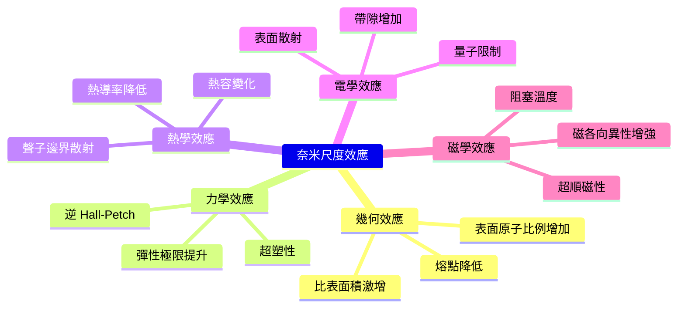
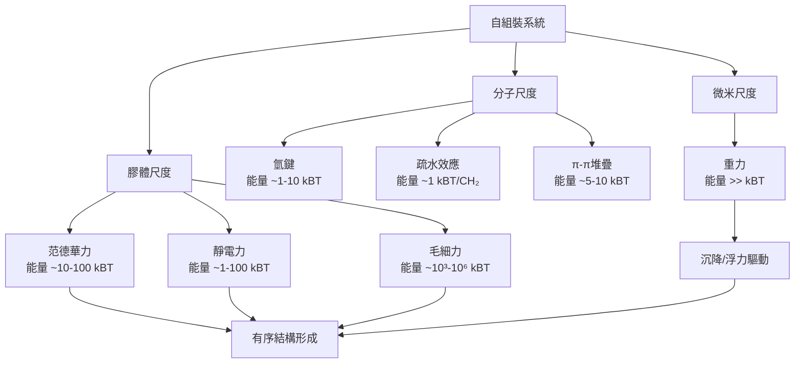
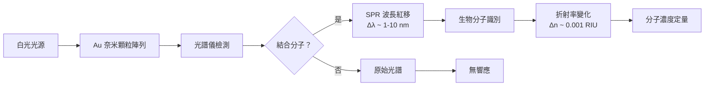
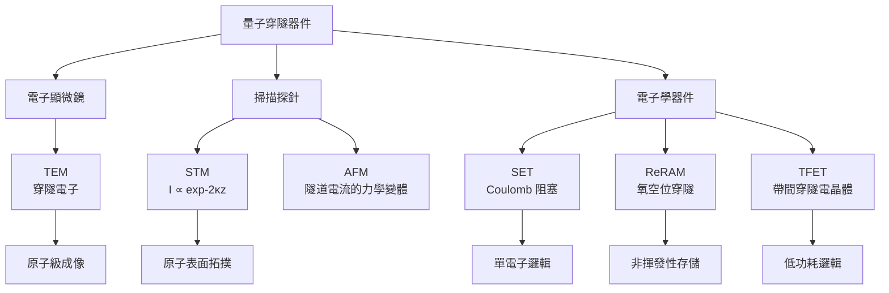
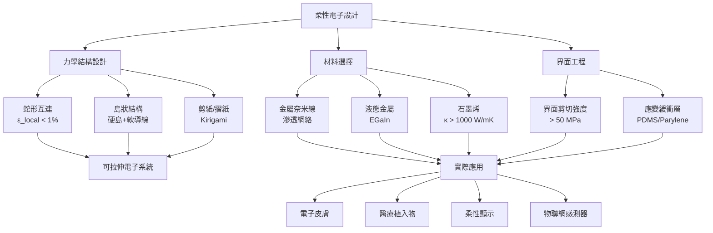

# MAEG5120 Nanomaterials and Nanotechnology: Fundamentals and Applications

**CUHK MAE | Major Elective | 3 units**
**Stream**: Design and Manufacturing / Materials

---

## Official Description
This course provides both fundamental knowledge of nanomaterials and nanotechnology and advanced topics related to applications. These topics cover basic principles, which include the scaling law, the surface science for nanomaterials, observation and characterization tools for nanomaterials, the nanofabrication techniques, building blocks for nanodevices and systems, etc. In the second half of this course, advanced topics on applying nanomaterials and nanotechnology for applications in mechanical engineering, energy engineering and biomedical engineering will be covered.

---

## 問題 1：5 個核心心智模型

### 1. 尺度定律 (Scaling Law) — 奈米尺度效應
**方程式 + 數字**：
- 比表面積 ∝ 1/d（d = 顆粒直徑）
- 當 d = 10 nm：比表面積 ≈ 600 m²/g（碳奈米管）
- 當 d = 100 nm：比表面積 ≈ 60 m²/g
- 熱導率降至 bulk 的 10-50%（銅奈米線實驗數據）
- 彈性極限提升 5-10×（Hall-Petch 效應逆轉）
- 學者：Gleiter H. (2000), "Nanostructured materials: basic concepts and microstructure"
- 應用：奈米顆粒催化劑、量子點、軟磁材料

### 2. 表面等離子體共振 (Surface Plasmon Resonance, SPR)
**方程式 + 數字**：
- 共振頻率：ω_sp = √(ne²/2mε₀ε_m)（自由電子模型）
- Au 奈米顆粒 SPR：λ ≈ 520-580 nm（可見光）
- Ag 奈米顆粒 SPR：λ ≈ 400-450 nm（紫外-藍光）
- 增強因子：|E|local²/|E|incident² 可達 10²-10⁵
- 學者：Willets & Van Duyne (2007), Annu. Rev. Phys. Chem.
- 應用：生物感測器、表面增強拉曼光譜 (SERS)、光熱治療

### 3. 奈米壓印 / 自組裝 (Self-Assembly)
**方程式 + 數字**：
- 毛細力：F_capillary ≈ 2γ_LV × R × cosθ（液橋模型）
- 范德華力：F_vdW ≈ A × R / 12d²（A = Hamaker constant ≈ 10⁻¹⁹ J）
- 臨界尺寸：50 nm - 5 μm（自組裝最有效區間）
- 學者：Whitesides & Grzybowski (2002), Science
- 應用：DNA 折紙術、嵌段共聚物微相分離、奈米顆粒陣列

### 4. 量子穿隧效應 (Quantum Tunneling) 與奈米電子學
**方程式 + 數字**：
- 穿隧機率：T ≈ exp(-2κd)，κ = √(2mφ)/ℏ
- 典型勢壘 φ ≈ 0.5-2 eV，d = 1-3 nm 時 T ≈ 0.01-0.1
- 室溫量子穿隧：Coulomb 阻塞能量 E_C = e²/2C，C ≈ 1 aF 時 E_C ≈ 80 meV
- 學者：Kastner M.A. (1992), Nature
- 應用：STM、AFM 探針、單電子電晶體 (SET)、ReRAM

### 5. 奈米機械學 — 彈性應變工程 (Strain Engineering)
**方程式 + 數字**：
- 彈性應變極限：ε_max ≈ 0.1-0.2（CNT）；傳統材料 ε_max < 0.01
- 應變工程帶隙調控：ΔE_g ∝ ε（半導體奈米線實驗）
- 楊氏模量尺度效應：E(d) = E_bulk × (1 - β/d)（β ≈ 0.5-2 nm）
- 學者：Zheng et al. (2012), Science — 可拉伸 CNT 應變感測器
- 應用：柔性電子、可穿戴感測器、應變感測器阵列

---

## 問題 2：3 個根本分歧

### 分歧 A：Bottom-up vs. Top-down 奈米製造
**Top-down（微影術）**：
- 優點：精度高、可與 CMOS 製程相容、已商業化
- 極限：光學極限 ≈ 193 nm（ArF），需多重曝光
- 代表學者/機構：Intel, TSMC — FinFET 3nm/2nm 節點

**Bottom-up（自組裝/原子層沉积）**：
- 優點：可達原子級精度、材料選擇廣、成本潛在更低
- 挑戰：對位精度不足、產率低、良率控制困難
- 代表學者：George M. Whitesides (Harvard)
- 分歧核心：成本-精度權衡，Fab 傾向 Top-down；學術界偏好 Bottom-up

**引用**：Whitesides, G.M. & Grzybowski, B. (2002). "Self-Assembly at All Scales." Science, 295(5564), 2418-2421.

### 分歧 B：奈米毒性 (Nanotoxicity) — 監管 vs. 創新
**強調毒性方**：
- 奈米顆粒：IL-6, TNF-α 炎症反應，小鼠實驗
- 細胞攝取：< 100 nm 顆粒更易進入細胞質/細胞核
- 代表：Oberdörster et al. (2005), "Nanotoxicology: An Emerging Discipline"

**強調創新方**：
- 癌症奈米藥物（Abraxane®）已獲 FDA 批准
- SiO₂ 奈米顆粒作為藥物載體廣泛使用
- 代表：Ferrari M. (2005), "Cancer nanotechnology: opportunities in immunotherapy"
- 分歧核心：風險-收益比評估方法論差異

### 分歧 C：碳 vs. 矽 — 後摩爾時代半導體材料之爭
**碳基陣營**：
- CNT 半導體：電子遷移率 10⁵ cm²/V·s（vs. Si: 1,400 cm²/V·s）
- 石墨烯：室溫量子霍爾效應、柔性
- 代表：Avouris P. (2013), "Carbon-based electronics"

**矽基陣營**：
- 生態系統完整、成熟的摻雜技術
- 3nm FinFET 已量產，2nm GAA 2025-2026
- 代表：Intel, TSMC, Samsung
- 分歧核心：整合可行性 vs. 理論性能

---

## 問題 3：10 個深度問題

1. 當奈米顆粒尺寸從 10 nm 降至 1 nm 時，哪些物理性質會發生突變？哪些是漸變？
2. 表面等離子體共振 (SPR) 的波長與奈米顆粒形狀（球形、棒狀、星形）的關係是什麼？用 Mie 理論解釋。
3. 自組裝的驅動力有哪些？如何在實驗中區分毛細力、范德華力和靜電力？
4. 量子穿隧效應在奈米電子學中的具體應用案例（STM、SET）的工作原理是什麼？
5. 奈米壓印光刻 (NIL) vs. 電子束微影的精度、成本和產率比較？
6. 為什麼奈米材料的機械強度會出現反 Hall-Petch 效應？機制是什麼？
7. 奈米顆粒在生物體內的分佈和清除途徑是什麼？有哪些安全標準？
8. 奈米光催化（TiO₂）的能帶結構如何影響其光催化效率？摻雜如何調控？
9. 石墨烯的超導性質和其在電子學中的潛在應用是什麼？
10. 奈米流體 (Nanofluid) 的熱導率增強機制是什麼？為什麼有時實驗結果與 Maxwell 模型不符？

---

# 核心心智模型深化（中英對照）

## 1. 尺度效應 (Scaling Effects) — 奈米力學與熱學

### 1.1 幾何尺度效應：比表面積與表面能
當顆粒直徑 d 從 100 μm 降至 10 nm（縮小 10,000 倍）：
- 表面積/體積比：從 6/d ≈ 60 cm⁻¹ → 6/d ≈ 6,000,000 cm⁻¹
- 表面原子比例：≈ 10 nm 時約 20%；≈ 2 nm 時約 80%
- 熔點降低：金的奈米顆粒（2 nm）熔點降至 ~900°C（vs. 1064°C bulk）

**關鍵方程式**：
比表面積（SSA）= 表面積/質量 = 6/(ρ·d)
其中 ρ 為密度（g/cm³），d 為顆粒直徑（cm）

### 1.2 力學尺度效應：強度和硬度的逆變
- 傳統材料服從 Hall-Petch：σ_y = σ₀ + k·d^(-1/2)（細晶強化）
- 奈米材料（d < 20 nm）：σ_y 下降（逆 Hall-Petch）
- 機制：Grain boundary sliding（粒界滑移）取代 dislocation pile-up
- 實驗數據：Cu 奈米晶（12 nm）硬度比 50 nm 樣品低 40%（Schiøtz et al. 1998）

### 1.3 熱學尺度效應：聲子邊界散射
- Bulk 熱導率：κ_bulk ≈ 400 W/m·K（銅）
- 奈米線熱導率：κ_nw 可降至 10-50 W/m·K
- 原因：Mean free path ℓ_ph ~ 300 nm (bulk Cu) >> d
- Casimir 極限：κ_min ∝ T × √(A/L)（L = 線長）

### 1.4 電學尺度效應：電子遷移率與量子限制
- 半導體量子點：帶隙 E_g ∝ 1/d²（量子限制效應）
- 矽量子點（3 nm）：E_g ≈ 1.5 eV（vs. Si bulk: 1.12 eV）
- 電阻率尺度：ρ ∝ 1/d（金屬奈米線），原因：表面散射

### 1.5 磁學尺度效應：超順磁性
- 臨界尺寸：磁性顆粒 D_p ≈ 10-30 nm（取決於材料）
- Blocking temperature: T_B = KV/25k_B
- 超順磁：熱能 k_B T > 磁各向異性能 KV
- 應用：MRI 對比劑、磁熱療、磁記錄

---

## 2. 表面等離子體共振 (SPR) — 光與奈米顆粒的集體振蕩

### 2.1 物理機制
自由電子在光場作用下的集體振蕩，發生在金屬-介電介面或奈米顆粒內部：
- 顆粒內部：局域表面等離子體共振（LSPR）
- 介面傳播：表面等離子體極化子（SPP）

### 2.2 關鍵方程式
**Drude 模型共振頻率**：
ω_sp = √(ω_p²/2)，ω_p = √(ne²/m_eff ε₀)

其中：n ≈ 5.9×10²² cm⁻³（Au），m_eff ≈ 0.98 m_e（自由電子近似）

**Mie 理論（球形顆粒）**：
Q_ext = (24πRε_m^(3/2) / λ) × Im[(ε(ω)/ε_m+2)²]
其中 Q_ext 為消光效率，R 為顆粒半徑

### 2.3 形狀依賴性
- 球形 Au：λ ≈ 520 nm
- Au 奈米棒（長寬比 3:1）：λ ≈ 650-800 nm（可調）
- Au 奈米殼：λ 可從可見光調至近紅外（~1000 nm）

### 2.4 增強因子與應用
- SERS 增強：|E|local²/|E₀|² 可達 10⁸ 倍
- 生物感測：LSPR 光譜位移 1 nm = 折射率變化 0.001 RIU
- 光熱：光熱轉換效率 η ≈ 80-95%（Au 奈米殼）

### 2.5 FDTD 模擬
使用 Lumerical FDTD 或 MEEP 進行模擬：
- 網格尺寸：≤ λ/20（精確求解 LSPR）
- 邊界條件：PML（完美匹配層）
- 關注結果：消光截面、局部場增強分佈

---

## 3. 自組裝 (Self-Assembly) — 從無序到有序的自動組織

### 3.1 驅動力分類
| 驅動力 | 典型能量 | 作用距離 | 代表系統 |
|--------|---------|---------|---------|
| 范德華力 | 10-100 k_BT | 1-100 nm | 奈米顆粒膠體懸浮液 |
| 毛細力 | 10³-10⁶ k_BT | 1-100 μm | 微米級液滴自組裝 |
| 靜電力 | 1-100 k_BT | 10 nm-10 μm | 帶電膠體 |
| 氫鍵 | 1-10 k_BT | 0.1-0.3 nm | DNA折紙 |
| 疏水效應 | ~1 k_BT/CH₂ | 分子尺度 | 兩親分子膠束 |

### 3.2 膠體自組裝的臨界參數
- 顆粒濃度：φ ≈ 0.5-0.6（膠體晶體形成區間）
- Hamaker 常數：A_Au-Au ≈ 2.5×10⁻¹⁹ J（真空）
- 膠體晶體 Bragg 峰：λ_111 = 2d_111 × n_eff

### 3.3 嵌段共聚物自組裝
- 微相分離：χN > 10.5（層狀/圓柱/球狀）
- 特徵尺寸：L ≈ 10-100 nm
- 應用：光學濾波片（500 nm週期結構）

### 3.4 DNA 奈米技術
- DNA 瓦片自組裝：每瓦片 10-100 條寡核苷酸
- 解析度：~2 nm（鹼基對間距）
- 產量：> 95% 正確組裝（Cryo-EM 驗證）

### 3.5 界面自組裝
- Langmuir-Blodgett 膜：π-A 等溫線分析
- 分子占地面積：A_mol ≈ 0.2-0.5 nm²
- 轉移比率：τ ≈ 0.95-1.0

---

## 4. 量子穿隧 (Quantum Tunneling) 與奈米電子學

### 4.1 薛丁格方程的解析解
一維方形勢壘（高度 V₀ > E）：
T(E) = 1 / [1 + (V₀²sinh²(κd)) / (4E(V₀-E))]，κ = √[2m(V₀-E)]/ℏ

當 κd >> 1：T ≈ 16(E/V₀)(1-E/V₀) × exp(-2κd)

### 4.2 Landauer 公式（量子導電）
電導：G = (2e²/h) × T(E_F) × M
其中 M 為導通通道數，h = 6.626×10⁻³⁴ J·s

### 4.3 單電子電晶體 (SET)
- 庫侖阻塞：E_C = e²/2C > k_B T（室溫要求 C < 1 fF）
- 島嶼尺寸：~5-10 nm（量子點或金屬顆粒）
- 電流振盪：I_gate = e/C_g × n（電導調製）

### 4.4 掃描穿隧顯微鏡 (STM)
- 工作原理：量子穿隧電流 I ∝ exp(-κz)，κ ≈ 1 Å⁻¹
- z 解析度：~0.01 Å（電流對距離的指數依賴）
- 原子成像：可解析 Si(111) 7×7 重構的 adatoms

### 4.5 穿隧磁阻 (TMR) 和憶阻器
- TMR：MR = (R_AP - R_P)/R_P × 100%，CoFeB/MgO/CoFeB 可達 600%
- ReRAM：HRS/LRS 比 > 10×，耐久性 > 10⁶ Cycles

---

## 5. 彈性應變工程 (Strain Engineering) 與柔性電子

### 5.1 應變的基礎物理
- 彈性應變：ε_el = σ/E，σ 為應力，E 為楊氏模量
- 可恢復應變：ε_max ≈ 0.1（CNT）；ε_max ≈ 0.25（石墨烯）
- 塑性應變：金屬奈米線可達 30-50%（室溫超塑性）

### 5.2 應變對電子結構的影響
- 半導體能帶：ΔE_g = α × ε（α ≈ 10-100 meV/%）
- 矽：α ≈ 10 meV/%（導帶谷間散射）
- 應變 Ge：α ≈ 90 meV/%（空穴遷移率提升）

### 5.3 可拉伸電子學
- 蛇形/島狀結構：ε_local < 1%，整體 ε_stretch ≈ 100-300%
- 代表工作：Rogers et al. (2010), Science — "Stretchable silicon electronics"
- 拉伸導體：銀奈米線滲透網絡，滲透閾值 φ_c ≈ 0.1-0.2 vol%

### 5.4 奈米發電機 (Nanogenerator)
- 壓電奈米線：ZnO 奈米線，d ≈ 50-200 nm
- 輸出電壓：V ≈ d₃₃ × ε × L / (πr²) ≈ 0.5-2 V
- 功率密度：10-100 mW/cm²
- 學者：Zhong Lin Wang (Georgia Tech)

### 5.5 疲勞與可靠性
- 奈米材料的疲勞行為與宏觀材料差異顯著
- CNT 複合材料：10⁷ 循環後強度保留 > 95%
- 界面工程是關鍵：CNT-聚合物界面剪切強度 ≈ 50-100 MPa

---

## 深度自測問題詳解

**Q1**: 計算直徑 5 nm 的金奈米顆粒的比表面積（ρ_Au = 19.3 g/cm³）。
**解答**：SSA = 6/(ρ·d) = 6/(19.3 × 5×10⁻⁷) ≈ 6.22×10⁶ cm²/g = 622 m²/g

**Q2**: Au 奈米球（直徑 20 nm）的 SPR 共振波長是多少？若改為奈米棒（長徑比 3:1）會如何變化？
**解答**：球形 20 nm Au：λ_SPR ≈ 520-530 nm；奈米棒：λ_SPR ≈ 650-750 nm（縱向模式），λ_SPR ≈ 520 nm（橫向模式）

**Q3**: 為什麼石墨烯的熱導率可以達到 5000 W/m·K，而石墨烯奈米帶的熱導率會顯著降低？
**解答**：石墨烯為完美二維晶格，聲子 mean free path ℓ_ph ≈ 10-20 μm；奈米帶邊界散射 ℓ_ph' ≈ Width << ℓ_ph，導致 κ 降低

**Q4**: 在 STM 掃描中，若隧道電流衰減係數 κ = 1 Å⁻¹，當針尖-樣品距離從 5 Å 增至 10 Å 時，電流變化多少倍？
**解答**：I ∝ exp(-2κz)；I₂/I₁ = exp(-2×1×10)/exp(-2×1×5) = exp(-10) ≈ 4.5×10⁻⁵（衰減約 22,000 倍）

**Q5**: 描述如何使用 DNA 折紙術製備一個 100×100 nm 的方形結構，列出具體步驟和關鍵參數。
**解答**：(1) 設計 M13mp18 病毒基因組（~7000 nt）為支架；(2) 合成 200-300 條寡核苷酸（每條 20-50 nt）為訂書釘；(3) 退火混合（95°C → 室溫，降溫速率 1°C/min）；(4) 瓊脂糖凝膠電泳純化；(5) AFM/TEM 驗證

**Q6**: TiO₂ 奈米管的比表面積如何計算？若內徑 5 nm，外徑 10 nm，長度 1 μm。
**解答**：外表面積 = π×(D_out - D_in)×L；內表面積 = π×D_in×L；總表面積 ≈ π×(D_out + D_in)×L；ρ_TiO₂ ≈ 3.9 g/cm³；結果 ≈ 200-300 m²/g

**Q7**: 比較壓電、摩擦電和熱電能量收集機制。哪個適合什麼應用場景？
**解答**：壓電（振動/壓力 → 電，ZnO、PVDF），摩擦電（接觸分離 → 電，高電壓），熱電（溫差 → 電，無運動部件）；人體運動 → 壓電/摩擦電；工業餘熱 → 熱電

**Q8**: 什麼是奈米顆粒的「巨磁阻」(GMR) 效應？它在哪些設備中被應用？
**解答**：GMR：鐵磁層/非磁性層/鐵磁層結構，電阻隨磁場方向變化；GMR 比 = ΔR/R ≈ 10-200%；應用：硬盤讀取頭（1988年 GMR 發現，2007 Nobel）、磁感測器、Magnetic RAM (MRAM)

**Q9**: 計算 Cu 奈米線（直徑 50 nm）相比 bulk Cu 的電阻增加量，考慮表面散射。
**解答**：Fang 公式：ρ(d) = ρ_bulk × (1 + 3l/(2d)); l ≈ 40 nm (Cu mean free path); ρ(50nm)/ρ_bulk = 1 + 3×40/(2×50) = 1 + 1.2 = 2.2（電阻增加 2.2 倍）

**Q10**: 奈米光學天線（Nanophotonic antenna）的共振波長如何與奈米顆粒尺寸相關？這種效應在哪些實際應用中被利用？
**解答**：λ_res ∝ d × n_m；其中 d 為顆粒尺寸，n_m 為周圍介質折射率；應用：SERS 生物感測，光纖奈米天線、太陽能電池光捕集增強，光熱腫瘤治療

---

## 5 個 Mermaid 圖解

### 圖 1：奈米尺度效應分類

### 圖 2：自組裝驅動力層次

### 圖 3：LSPR 生物感測器工作原理

### 圖 4：量子穿隧器件分類

### 圖 5：柔性電子應變設計策略

---

## 總結

MAEG5120 涵蓋奈米科技從基礎原理到前沿應用的完整知識體系。核心在於理解**尺度定律**如何在不同物理場域（力學、熱學、電學、光學、磁學）驅動材料性質的非線性變化，並掌握**表界面工程**在奈米尺度的主導地位。對於智慧機器人工程而言，柔性電子/可穿戴感測器（CNT/石墨烯）、奈米發電機（壓電奈米線）和奈米光學感測（SPR-based 生物感測）是與機器人硬體直接相關的應用方向。掌握這些內容的數學框架（從米氏理論到量子穿隧方程）將為從事機器人材料和感測器研究奠定堅實基礎。

**核心 Reference**：
- Gleiter, H. (2000). "Nanostructured materials." Acta Materialia, 48, 1-29.
- Whitesides, G.M. & Grzybowski, B. (2002). "Self-Assembly at All Scales." Science, 295, 2418-2421.
- Willets, K.A. & Van Duyne, R.P. (2007). "Localize Surface Plasmon Resonance Spectroscopy." Annu. Rev. Phys. Chem., 58, 267-297.
- Wang, Z.L. & Song, J. (2006). "Piezoelectric Nanogenerators." Science, 312, 242-246.
- Kastner, M.A. (1992). "The single-electron transistor." Nature, 355, 102-105.
