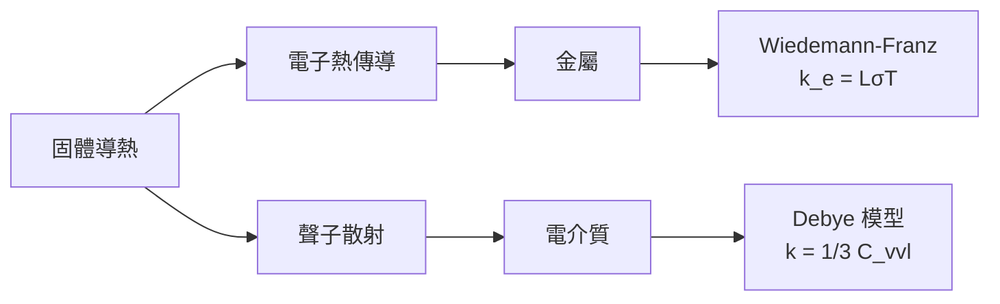
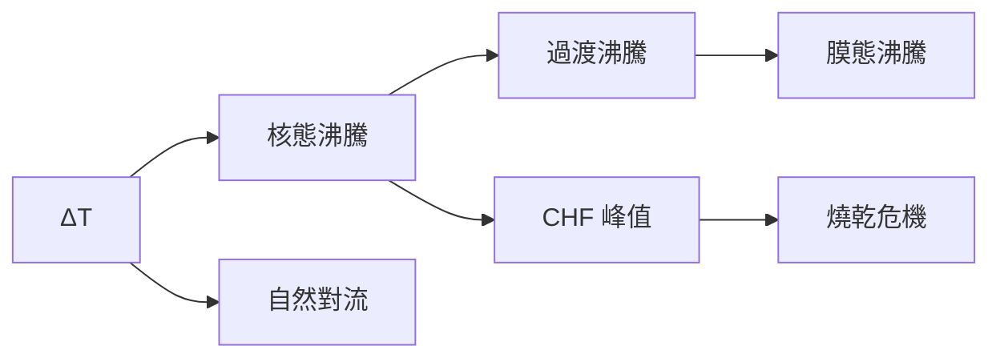
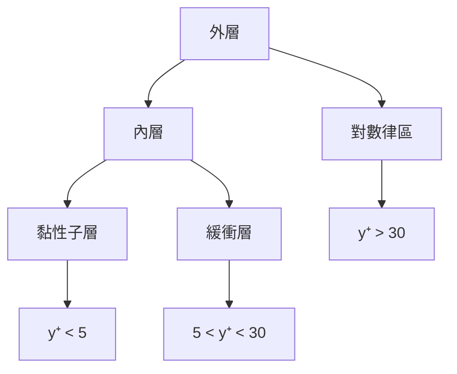
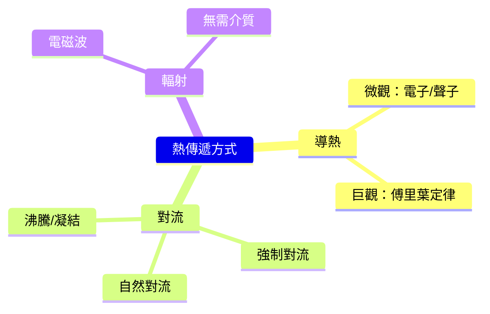
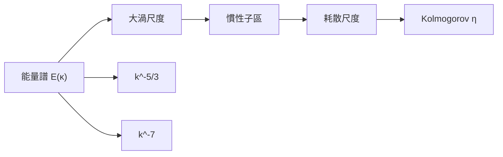
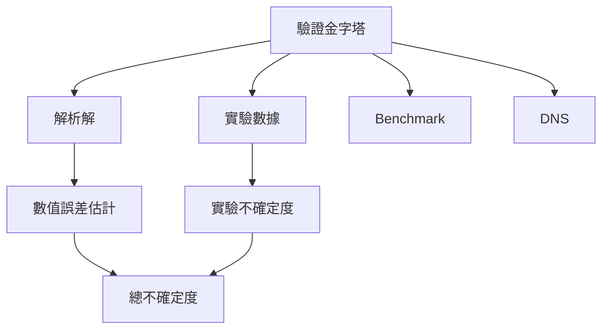

# MAEG5150 Advanced Heat Transfer and Fluid Mechanics

**CUHK MAE | Other Elective | 3 units**
**Stream**: Energy

---

## Official Description
This course covers advanced topics in heat transfer and fluid mechanics including overview of macroscopic theory of heat transfer, microscopic picture of heat carriers and their transport, micro- and nanoscale energy transport in solids, chemical thermodynamics, chemical kinetics, multicomponent and multiphase mixtures, basic principles of computational fluid dynamics, turbulence modeling, and airflow simulation in enclosed environments.

---

## 問題 1：5 個核心心智模型

### 1. 導熱 — 微觀到巨觀 (Conduction: Micro to Macro)
**方程式 + 數字**：
- 傅里葉定律：q = -k∇T（W/m²）
- 熱擴散方程：ρc_p ∂T/∂t = ∇·(k∇T) + q̇
- 微觀：聲子傳熱，k_lattice = 1/3 C_v · v · ℓ_ph（德拜模型）
- 電子熱傳導（金屬）：q_e = -κ_e ∇T，κ_e ≈ L·σ·T（Wiedemann-Franz 定律）
- 典型值：Cu k = 401 W/m·K；空氣 k = 0.026 W/m·K
- 學者：Carslaw & Jaeger (1959), "Conduction of Heat in Solids"
- 應用：電子散熱、核反應堆熱移除

### 2. 對流熱傳遞 (Convection Heat Transfer)
**方程式 + 數字**：
- 牛頓冷卻定律：q = h·(T_s - T_∞)
- Nusselt 數：Nu = hL/k（無量綱對流系數）
- 強迫對流：Nu = C·Re^m·Pr^n（Re = ρUL/μ；Pr = μc_p/k）
- 自然對流：Nu = C·(Gr·Pr)^n（Gr = gβΔTL³/ν²）
- 學者：Incropera et al. (2013), "Fundamentals of Heat and Mass Transfer"
- 應用：散熱器設計、冷卻系統

### 3. 熱輻射 (Thermal Radiation)
**方程式 + 數字**：
- Stefan-Boltzmann 定律：q = εσ(T_s⁴ - T_∞⁴)
- 黑體輻射：E_b = σT⁴（σ = 5.67×10⁻⁸ W/m²·K⁴）
- 視角因子：F₁₋₂（幾何系數，取決於表面幾何）
- 吸收率 + 反射率 + 透射率 = 1
- 學者：Modest (2013), "Radiative Heat Transfer"
- 應用：太陽能集熱器、爐窯設計

### 4. 層流與湍流 (Laminar and Turbulent Flow)
**方程式 + 數字**：
-，雷諾數：Re = ρUL/μ（Re < 2300 層流；Re > 4000 湍流）
- 湍流：速度波動 u'， Reynolds 應力 -ρ⟨u'ᵢu'ⱼ⟩
- 摩阻系數：C_f = τ_w / (1/2ρU²)（平板）
- 邊界層厚度：δ ≈ 5L/√Re（L = 特徵長度）
- 學者：Pope (2000), "Turbulent Flows"
- 應用：管道流動、邊界層控制

### 5. 計算流體動力學 (CFD) 基礎
**方程式 + 數字**：
- 連續方程：∂ρ/∂t + ∇·(ρu) = 0
- 動量方程（N-S）：ρDu/Dt = -∇p + μ∇²u + ρg
- k-ε 模型：k = 1/2⟨u'ᵢu'ᵢ⟩；ε = ν⟨(∂u'_i/∂x_j)²⟩
- 網格無關性：當網格細化後結果不再變化
- 學者：Ferziger & Peric (2002), "Computational Methods for Fluid Dynamics"
- 應用：汽車空氣動力學、HVAC、航空

---

## 問題 2：3 個根本分歧

### 分歧 A：數值模擬 vs. 實驗測量 — 熱工分析之爭
**數值模擬（CFD/熱傳計算）**：
- 優點：快速、低成本、獲得全場數據
- 缺點：模型簡化、計算精度依賴網格和邊界條件
- 適用：設計初期、參數化研究

**實驗測量**：
- 優點：真實物理、驗證數值模型
- 缺點：成本高、難以獲得內部數據
- 適用：認證、設計驗證

### 分歧 B：k-ε vs. LES — 湍流建模之爭
**k-ε 模型**：
- 優點：計算效率高、工業廣泛驗證
- 缺點：各向同性假設、不能捕捉非穩態特徵
- 適用：工程應用（管道、流體機械）

**LES（大渦模擬）**：
- 優點：大渦直接解析、小渦建模，精確捕捉瞬態
- 缺點：計算量大（Re³ 級）
- 適用：高保真度要求（航空、燃燒）

### 分歧 C：顯式 vs. 隱式 離散化
**顯式方法**：
- 優點：簡單、內存需求低
- 缺點：穩定性限制（Courant 數 < 1）
- 適用：簡單幾何

**隱式方法**：
- 優點：無條件穩定、大時間步長
- 缺點：每步求解大型方程組
- 適用：工業 CFD

---

## 問題 3：10 個深度問題

1. 什麼是熱毛細對流 (Thermocapillary Convection)？它在微流控和焊接中的應用是什麼？
2. 描述從微觀聲子動力學到巨觀熱傳導方程的橋樑（玻爾茲曼傳熱方程）。
3. 如何用格子玻爾茲曼方法 (LBM) 模擬熱對流？
4. 什麼是沸騰危機 (Boiling Crisis) 和 Leidenfrost 效應？
5. 湍流邊界層的對數律 (Log Law) 是如何推導的？它的局限性是什麼？
6. 什麼是熱阻抗 (Thermal Resistance) 網絡？如何用它設計電子散熱器？
7. 什麼是 LES 中的 Smagorinsky 亞網格模型？
8. 如何用 PIV (Particle Image Velocimetry) 測量速度場？
9. 什麼是熱虹吸 (Thermosiphon) 效應？它在被動式太陽能熱水器中的應用？
10. 什麼是凍融循環中的多孔介質傳熱？如何建模？

---

# 核心心智模型深化（中英對照）

## 1. 導熱 — 從微觀到巨觀

### 1.1 微觀傳熱機制
```
聲子傳熱（固體）：
k = 1/3 · C_v · v · ℓ

C_v = 比熱容（每單位體積）
v = 聲子群速度
ℓ = 聲子平均自由程

金屬 vs. 電介質：
金屬：電子熱傳導主導 k_e = L·σ·T（Wiedemann-Franz 定律）
L = 洛倫茲數 = 2.44×10⁻⁸ WΩ/K²

典型值：
Cu：k = 401 W/m·K（電子+聲子）
Si：k = 148 W/m·K（聲子主導）
SiO₂：k = 1.4 W/m·K
```

### 1.2 熱擴散方程推導
```
能量守恆：
∂T/∂t + ∇·q = q̇/(ρc_p)

傅里葉定律：
q = -k∇T

熱擴散方程：
ρc_p · ∂T/∂t = ∇·(k∇T) + q̇

特例（恆定熱傳導）：∇·(k∇T) = 0

典型熱擴散系數：
α = k/(ρc_p)
空氣：α ≈ 2×10⁻⁵ m²/s
水：α ≈ 1.4×10⁻⁷ m²/s
鋁：α ≈ 9.7×10⁻⁵ m²/s
```

### 1.3 接觸熱阻
```
R_c = 1/(h_c · A)

微觀接觸機制：
1. 固-固實際接觸點（微觀粗糙峰）
2. 空氣間隙填充

經驗公式：
h_c ≈ 1/(R_c·A) ≈ 1000-10000 W/m²·K（高壓）
h_c ≈ 100-1000 W/m²·K（低壓）

降低接觸熱阻：塗導熱膏、加墊片、增大壓力
```

### 1.4 圖解：導熱機制


---

## 2. 對流熱傳遞

### 2.1 邊界層理論
```
邊界層厚度估算：
 laminar: δ ≈ 5L/√Re_L
 turbulent: δ ≈ 0.37L/Re_L^(1/5)

局部努塞爾數：
Nu_x = h_x·x/k = 0.332·Re_x^0.5·Pr^(1/3) (laminar, 平板)

平均努塞爾數：
Nu_L = h·L/k = 0.664·Re_L^0.5·Pr^(1/3)
```

### 2.2 自然對流
```
格拉曉夫數：Gr = g·β·ΔT·L³/ν²

浮力/黏性力比值：
Gr >> 1 → 自然對流主導
Gr << 1 → 傳導主導

典型自然對流：
室溫空氣（ΔT=10K）：Gr_L ≈ 10⁸（湍流邊界層）
水平板（向上）：Nu ≈ 0.27·Gr_L^(1/4)
```

### 2.3 沸騰曲線
```
整個沸騰曲線：
1. 自然對流沸騰
2. 核態沸騰（NBH）
3. 過渡沸騰（transition boiling）
4. 膜態沸騰（CHF後）

臨界熱流密度（CHF）：
q_CHF ≈ C_h·h_fg·ρ_v^0.5·(σ·g·(ρ_l-ρ_v))^0.25
典型值：q_CHF ≈ 1-2 MW/m²（水，大氣壓）
```

### 2.4 圖解：沸騰曲線


---

## 3. 熱輻射

### 3.1 輻射特性
```
黑體輻射（Stefan-Boltzmann）：
E_b = σ·T⁴

實際表面：
E = ε·σ·T⁴（ε = 發射率）

吸收率 + 反射率 + 透射率 = 1

表面發射率：
拋光鋁：ε ≈ 0.05-0.15
氧化鋁：ε ≈ 0.8-0.9
碳黑：ε ≈ 0.95-0.99
```

### 3.2 視角因子計算
```
平行板視角因子：
F_12 = 1（無窮大平行板）
F_12 = [1/(σ²-1)^0.5] · [σ·cos⁻¹(σ) - cos⁻¹(1/σ)] - 1

σ = L/（2R）（圓柱-圓柱）

一般方法：交叉法 / 代數法
```

### 3.3 輻射網絡
```
兩個表面封閉系：
q_1 = (E_b1 - J_1)/R_1
J_1 = 表面投入輻射
R_1 = (1-ε_1)/(ε_1·A_1)

表面能量平衡：
J_1 = ε_1·E_b1 + (1-ε_1)·G_1
```

### 3.4 圖解：熱阻網絡
```mermaid
flowchart LR
    A["高溫表面"] -->|"對流", B["流體"]
    A -->|"輻射", C["環境"]
    B -->|"導熱", D["固體"]
    C -->|"吸收", D
    A -->|"導熱", D
```

---

## 4. 層流與湍流

### 4.1 湍流模型
```
雷諾應力：
-ρ⟨u'ᵢu'ⱼ⟩ = μ_t(∂Uᵢ/∂xⱼ + ∂Uⱼ/∂xᵢ)

湍流黏度：
μ_t = C_μ·ρ·k²/ε

k-ε 模型封閉方程：
∂(ρk)/∂t + ∂(ρU_jk)/∂xⱼ = ∂/∂xⱼ[(μ+μ_t/σ_k)∂k/∂xⱼ] + G_k - ρε
∂(ρε)/∂t + ∂(ρU_jε)/∂xⱼ = ∂/∂xⱼ[(μ+μ_t/σ_ε)∂ε/∂xⱼ] + C_1ε·G_k·ε/k - C_2ε·ρε²/k
```

### 4.2 LES 大渦模擬
```
過濾 N-S：
∂Ūᵢ/∂t + Ūⱼ∂Ūᵢ/∂xⱼ = -1/ρ·∂p̂/∂xᵢ + ν∂²Ūᵢ/∂xⱼ² - ∂τ_ij/∂xⱼ

亞網格應力：
τ_ij ≈ 2μ_t·Ŝ_ij
μ_t = (C_s·Δ)²·|Ŝ|
```

### 4.3 邊界層相似性
```
對數律速度分佈：
U⁺ = (1/κ)·ln(y⁺) + B
κ ≈ 0.41（卡門常數）
B ≈ 5.0

U⁺ = U·u_τ/v_f
y⁺ = y·u_τ/v_f
u_τ = √(τ_w/ρ)
```

### 4.4 圖解：邊界層結構


---

## 5. CFD 計算流體動力學

### 5.1 離散化方法
```
有限差分（FDM）：精度高，簡單幾何
有限體積（FVM）：守恆性保証，複雜幾何（OpenFOAM, ANSYS Fluent）
有限元（FEM）：複雜邊界，靈活（ANSYS Mechanical）

穩定性條件（顯式）：
Δt < Δx/|u| + Δx²/(2ν)  [對流-擴散]

典型庫朗數：Co = u·Δt/Δx < 1
```

### 5.2 網格質量
```
長寬比：< 1.5:1（邊界層內可接受）
歪斜度：< 0.2
生長率：< 1.2:1（相鄰網格）
局部加密：在梯度區域

網格無關性驗證：
4 倍加密 → 結果差異 < 2% → 網格收斂
```

### 5.3 後驗證證驗
```
解析解對比：
平板邊界層：速度解析解存在

實驗對比：
PIV 測量速度場
LDV 測量速度分量
紅外測量表面溫度

不確定度分析：
A 類（統計）：重複實驗
B 類（儀器）：儀器精度
```

### 5.4 圖解：CFD 工作流程
```mermaid
flowchart TD
    A["幾何建模"] --> B["網格生成"]
    B --> C["求解器設定"]
    C --> D["求解"]
    D --> E{"收斂?"}
    E -->|"否|", F["調整網格/參數"]
    F --> B
    E -->|"是|", G["後處理"]
    G --> H["結果驗證"]
    H --> I["工程報告"]
```

---

## 深度自測問題詳解

**Q1**: 熱毛細對流分析
```
定義：液-氣界面張力梯度驅動的流動
Marangoni 數：
Ma = -dσ/dT · ΔT · L/(μ·α)

典型值：
水-空氣：|dσ/dT| ≈ 0.0002 N/m·K
ΔT = 10 K, L = 0.01 m
Ma = 0.0002×10×0.01/(10⁻⁶×10⁻⁷) ≈ 2000

Ma > 100 → Marangoni 流動主導
```

**Q3**: LBM 基礎
```
格子玻爾茲曼方程：
f_i(x+e_i·Δt, t+Δt) - f_i(x,t) = Ω_i(f)

BGK 近似：
Ω_i = -(f_i - f_i^eq)/τ

流體速度：
ρu = Σ f_i·e_i

典型 LBM 參數：
Δx = 1, Δt = 1, τ = 0.6（黏度 ν = (τ-0.5)/3）
```

**Q5**: 沸騰危機與 Leidenfrost
```
Leidenfrost 效應：
液滴在遠高於沸點的表面上形成蒸汽墊
維持時間：t ≈ (ρ_l·D²)/(k_v·ΔT)

沸騰危機（CHF）：
q_CHF ≈ 0.131·ρ_v·h_fg·[σ·g·(ρ_l-ρ_v)/ρ_v²]^0.25

防止 CHF：
表面微結構（增加汽化核心）
強化換熱表面
低溫差操作
```

**Q8**: PIV 原理
```
粒子圖像測速：
1. 添加追蹤粒子（0.1-10 μm）
2. 雙脈冲激光照亮平面
3. 雙幀相機捕捉粒子位移
4. 互相關計算速度向量

速度精度：< 1%
空間分辨率：取決於窗口大小（典型 32×32 pixel）
```

---

## 📊 Mermaid 圖解

### 圖 1：熱傳遞方式對比


### 圖 2：邊界層結構


### 圖 3：熱阻網絡
```mermaid
flowchart LR
    A["高溫源"] -->|"導熱", B["固體"]
    B -->|"對流", C["流體"]
    A -->|"輻射", C
    B -->|"接觸熱阻", D["界面"]
    D --> E["另一固體"]
```

### 圖 4：湍流尺度譜


### 圖 5：CFD 驗證金字塔


---

## 總結

MAEG5150 從微觀的聲子/電子傳熱到巨觀的 CFD 模擬，全面覆蓋了傳熱和流體力學的核心知識。核心在於理解**能量守恆方程**（熱擴散方程和 N-S 方程）是所有熱工分析的基礎，並掌握**湍流建模**和**數值離散化**的關鍵方法。對於智慧機器人工程而言，散熱設計（電子元件冷卻）、流體力學（氣動特性）和熱力學（能量系統）是直接應用的工程技能。

**核心 Reference**：
- Incropera, F.P. et al. (2013). "Fundamentals of Heat and Mass Transfer." 7th ed., Wiley.
- Pope, S.B. (2000). "Turbulent Flows." Cambridge University Press.
- Ferziger, J.H. & Peric, M. (2002). "Computational Methods for Fluid Dynamics." 3rd ed., Springer.
- Modest, M.F. (2013). "Radiative Heat Transfer." 3rd ed., Academic Press.
